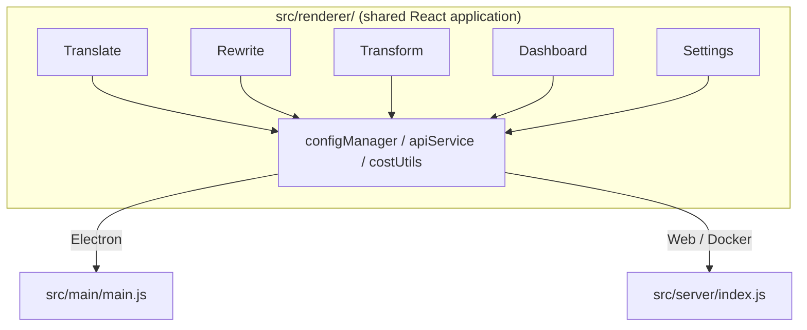

<p align="center">
  
</p>

<h1 align="center">Transrewrt</h1>

<p align="center">
  <a href="https://github.com/wsj-br/transrewrt/releases"></a>
  <a href="LICENSE"></a>
  
  
  
</p>

AI-powered text tool: translate between languages, rewrite in different styles, and transform with custom prompts - all via [OpenRouter](https://openrouter.ai). Runs as a desktop app (Electron) or a self-hosted web app (Docker).

- **Translate** - between dozens of languages, with automatic source detection
- **Rewrite** - fix grammar, improve clarity, formal/informal, shorten, expand, technical
- **Transform** - custom AI prompts; create and manage prompts, optional target language per prompt
- **Models & cost** - choose any OpenRouter model; cost dashboard with SQLite log, summaries by model/operation/day
- **UI** - i18n (pt-BR, de, fr, es, RTL), themes, fonts, keyboard shortcuts; secure web mode (API key on server only)
- **Desktop** - Electron app for Windows and Linux
- **Self-hosted** - Docker image for amd64 & arm64 (Raspberry Pi-ready)

Once installed, see the **[User Guide](USER-GUIDE.md)** for a full walkthrough of all features.

<small>**Read in other languages:** [English (UK)](README.md) · [Português (BR)](translated-docs/README.pt-BR.md) · [العربية](translated-docs/README.ar.md) · [বাংলা](translated-docs/README.bn.md) · [Català](translated-docs/README.ca.md) · [简体中文](translated-docs/README.zh-CN.md) · [繁體中文](translated-docs/README.zh-TW.md) · [Hrvatski](translated-docs/README.hr.md) · [Čeština](translated-docs/README.cs.md) · [Nederlands](translated-docs/README.nl.md) · [English (US)](translated-docs/README.en-US.md) · [Filipino](translated-docs/README.tl.md) · [Français](translated-docs/README.fr.md) · [Deutsch](translated-docs/README.de.md) · [Ελληνικά](translated-docs/README.el.md) · [हिन्दी](translated-docs/README.hi.md) · [Magyar](translated-docs/README.hu.md) · [Italiano](translated-docs/README.it.md) · [日本語](translated-docs/README.ja.md) · [Basa Jawa](translated-docs/README.jv.md) · [한국어](translated-docs/README.ko.md) · [Bahasa Melayu](translated-docs/README.ms.md) · [فارسی](translated-docs/README.fa.md) · [Polski](translated-docs/README.pl.md) · [Português (PT)](translated-docs/README.pt.md) · [ਪੰਜਾਬੀ](translated-docs/README.pa.md) · [Română](translated-docs/README.ro.md) · [Русский](translated-docs/README.ru.md) · [Slovenčina](translated-docs/README.sk.md) · [Español](translated-docs/README.es.md) · [Kiswahili](translated-docs/README.sw.md) · [Svenska](translated-docs/README.sv.md) · [తెలుగు](translated-docs/README.te.md) · [ภาษาไทย](translated-docs/README.th.md) · [Türkçe](translated-docs/README.tr.md) · [Українська](translated-docs/README.uk.md) · [Tiếng Việt](translated-docs/README.vi.md)</small>

<a id="screenshots"></a>
## Screenshots

**Language selector**


**Translate**


**Transform - prompt editor**


**Dashboard**


**Settings - model selection**


<br /><br />

<a id="table-of-contents"></a>
## Table of Contents

<!-- START doctoc generated TOC please keep comment here to allow auto update -->
<!-- DON'T EDIT THIS SECTION, INSTEAD RE-RUN doctoc TO UPDATE -->

- [Quick start](#quick-start)
- [Installation](#installation)
  - [Windows (Electron)](#windows-electron)
  - [Linux (Electron)](#linux-electron)
  - [Docker](#docker)
- [Getting an OpenRouter API key](#getting-an-openrouter-api-key)
- [Configuration and environment](#configuration-and-environment)
- [Development and architecture](#development-and-architecture)
- [Releases and tags](#releases-and-tags)
- [Contributing](#contributing)
- [Disclaimer](#disclaimer)
- [License](#license)

<!-- END doctoc generated TOC please keep comment here to allow auto update -->

<br /><br />

<a id="quick-start"></a>
## Quick start

**Docker (recommended for self-hosting)**

```bash
docker pull ghcr.io/wsj-br/transrewrt:latest

API_KEY=sk-or-your-key docker run -d \
  -p 5000:5000 \
  -v transrewrt-data:/app/data \
  -e API_KEY \
  --name transrewrt-web \
  ghcr.io/wsj-br/transrewrt:latest
```

Replace `sk-or-your-key` with your [OpenRouter API key](https://openrouter.ai/keys). Open [http://localhost:5000](http://localhost:5000) and change the default admin password before exposing the service.

<br />

> ℹ️ **NOTE**<br/>
> In Docker the OpenRouter API key is set only via the `API_KEY` environment variable (not in the web UI). On desktop (Electron) you paste it in **Settings → API**.

<br />

**Windows**

Download the latest `Transrewrt Setup x.y.z.exe` from [Releases](https://github.com/wsj-br/transrewrt/releases), run the installer, then launch from the Start menu or desktop shortcut. Enter your OpenRouter API key in **Settings → API**.

<br />

**Linux**

Download the `.AppImage` from [Releases](https://github.com/wsj-br/transrewrt/releases), then:

```bash
chmod +x Transrewrt-x.y.z.AppImage && ./Transrewrt-x.y.z.AppImage
```

Enter your OpenRouter API key in **Settings → API**. On Debian/Ubuntu you may need to install extra dependencies first:

```bash
sudo apt install libgtk-3-0 libnotify-dev libnss3 libxss1 libasound2 libxtst6 xauth
```

See [Installation → Linux](#linux-electron) for details.

<br />

> ℹ️ **NOTE**<br/>
> macOS is not currently supported. Transrewrt is available for Windows, Linux, and Docker.

<br />

Once the app is running, see the **[User Guide](USER-GUIDE.md)** to learn how to translate, rewrite, and transform text, manage prompts, and configure models.

<br /><br />

<a id="installation"></a>
## Installation

<a id="windows-electron"></a>
### Windows (Electron)

- Download the latest installer from [Releases](https://github.com/wsj-br/transrewrt/releases).
- Run the `.exe` and follow the installer.
- First run: start the app from the Start menu or desktop shortcut. Config is stored in `%APPDATA%\transrewrt\`.

<br />

<a id="linux-electron"></a>
### Linux (Electron)

- Download the `.AppImage` from [Releases](https://github.com/wsj-br/transrewrt/releases).
- Run: `chmod +x Transrewrt-x.y.z.AppImage && ./Transrewrt-x.y.z.AppImage`
- Extra dependencies (Debian/Ubuntu): `sudo apt install libgtk-3-0 libnotify-dev libnss3 libxss1 libasound2 libxtst6 xauth`
- See [dev/DEVELOPMENT.md](dev/DEVELOPMENT.md) for more.

<br />

<a id="docker"></a>
### Docker

- Pull: `docker pull ghcr.io/wsj-br/transrewrt:latest`
- The OpenRouter API key **must** be set via the `API_KEY` environment variable. Pass it with `-e API_KEY` (or via `docker compose` / `.env`) so the key is not visible in the process list.
- The API key cannot be entered in the web UI.

Example - named volume for persistence (API key passed via env, not in the command line):

```bash
API_KEY=sk-or-your-key docker run -d \
  -p 5000:5000 \
  -v transrewrt-data:/app/data \
  -e API_KEY \
  --name transrewrt-web \
  ghcr.io/wsj-br/transrewrt:latest
```

<br />

| Option   | Description                                                                                                   |
| -------- | ------------------------------------------------------------------------------------------------------------- |
| Port     | `5000` (map with `-p 5000:5000`)                                                                              |
| Volume   | Mount `/app/data` for config and database persistence                                                         |
| Env vars | `PORT`, `CONFIG_PATH`, `API_KEY`, `API_URL`, `KEY_SEED` - see [Configuration](#configuration-and-environment) |

To build and run from source: `docker compose up --build -d` or `pnpm run docker:up` - see [dev/DEVELOPMENT.md](dev/DEVELOPMENT.md).

<br /><br />

<a id="getting-an-openrouter-api-key"></a>
## Getting an OpenRouter API key

Transrewrt uses [OpenRouter](https://openrouter.ai) for AI models. You need an API key to translate, rewrite, or transform text.

1. Sign up or log in at [openrouter.ai](https://openrouter.ai).
2. Open the [Keys](https://openrouter.ai/keys) page and create a new key (name it, and optionally set a credit limit). You can use free models without adding credit.
3. **Desktop (Electron):** paste the key in **Settings → API**. **Docker:** set the `API_KEY` environment variable (see [Quick start](#quick-start)).

For limits, BYOK, and more, see [OpenRouter authentication](https://openrouter.ai/docs/api/reference/authentication).

<br /><br />

<a id="configuration-and-environment"></a>
## Configuration and environment

**Config file locations**

| Deployment         | Config location                                   |
| ------------------ | ------------------------------------------------- |
| Electron (Windows) | `%APPDATA%\transrewrt\`                           |
| Electron (Linux)   | `~/.config/transrewrt/`                           |
| Web / Docker       | `/app/data/config.json` (use a volume to persist) |

<br />

**Environment variables** (web/Docker only; Electron uses the local config file)

| Variable      | Default                        | Description                                                   |
| ------------- | ------------------------------ | ------------------------------------------------------------- |
| `PORT`        | `5000`                         | Server listening port                                         |
| `CONFIG_PATH` | `/app/data/config.json`        | Path to the config file                                       |
| `API_KEY`     | *(empty)*                      | OpenRouter API key (required for Docker; set via env, not UI) |
| `API_URL`     | `https://openrouter.ai/api/v1` | Upstream AI API base URL                                      |
| `KEY_SEED`    | *(empty)*                      | Transrewrt proxy key seed (overrides config if set)           |

<br />

**Data and persistence:** For Docker, mount a volume at `/app/data` so `config.json` and the SQLite database persist across container restarts. Without a volume, all data is lost when the container stops.

<br />

**Web authentication:**

- Default admin: `admin` / `transrewrt26`.
- Manage users in **Settings → Users**.
- Reset a password: `docker exec <container> reset-web-password '<username>' '<new-password>'`
  (from source: `pnpm run reset-web-password -- <username> <new-password>`)

<br />

> ⚠️ **WARNING**<br/>
> Change the default admin password immediately on any network-accessible host.

<br />

**Transrewrt proxy (optional):** You can route API traffic through an external proxy that uses a time-based rolling key. In **Settings → API**, enable **Use Transrewrt Proxy**, set **Key seed**, and set **API URL** to the proxy base URL. See [dev/SYSTEM-OVERVIEW.md](dev/SYSTEM-OVERVIEW.md) for details.

Key settings (theme, font, models, languages, etc.) are available in the Settings dialog or can be edited directly in the config JSON. The full list and defaults are documented in [dev/DEVELOPMENT.md](dev/DEVELOPMENT.md).

<br /><br />

<a id="development-and-architecture"></a>
## Development and architecture

- **Development:** Setup, build, test, and deploy (Electron, Web, Docker) - see **[dev/DEVELOPMENT.md](dev/DEVELOPMENT.md)**.
- **Architecture and system overview:** Folder structure, tech stack, design decisions, Transrewrt proxy - see **[dev/SYSTEM-OVERVIEW.md](dev/SYSTEM-OVERVIEW.md)**.



<br /><br />

<a id="releases-and-tags"></a>
## Releases and tags

- **Git tags** `v`* (e.g. `v1.0.10`) trigger the [release workflow](.github/workflows/release.yml). **GitHub Releases** attach the Windows installer (`.exe`) and Linux AppImage.
- **Docker images** are published to `ghcr.io/wsj-br/transrewrt`. Image tags match the Git version (e.g. `v1.0.10` → `ghcr.io/wsj-br/transrewrt:1.0.10`) plus `latest`. Multi-arch: `linux/amd64` and `linux/arm64` (e.g. Raspberry Pi).

<br /><br />

<a id="contributing"></a>
## Contributing

1. Fork the repository.
2. Create a feature branch: `git checkout -b feature/my-feature`
3. Commit your changes with a clear message.
4. Push and open a Pull Request against `main`.

Please follow the existing code style and test your changes in both Electron and web modes before submitting. See [dev/DEVELOPMENT.md](dev/DEVELOPMENT.md) for build and test instructions.

<br />

**Reporting issues:** Open an issue on [GitHub](https://github.com/wsj-br/transrewrt/issues). Include your platform (Windows / Linux / Docker) and app version (shown in the About dialog or on the Releases page).

<br /><br />

<a id="disclaimer"></a>
## Disclaimer

Product names and icons belong to their respective owners and are used for identification purposes only. This software is not affiliated with or endorsed by any of the mentioned brands.

<br /><br />

<a id="license"></a>
## License

Copyright © 2026 Waldemar Scudeller Jr.

[Apache License 2.0](LICENSE)
