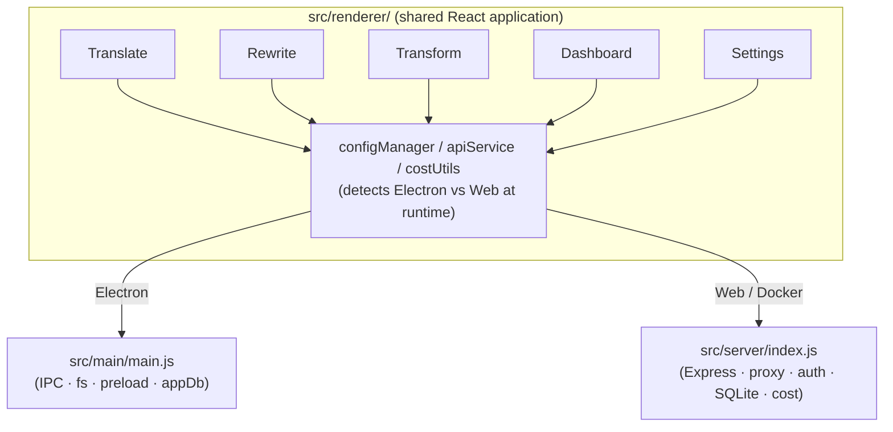

# Transrewrt

[](LICENSE)

AI-powered text tool: translate between languages, rewrite in different styles, and transform with custom prompts — all via [OpenRouter](https://openrouter.ai). Runs as a desktop app (Electron) or a self-hosted web app (Docker).

- **Translate** — between dozens of languages, with automatic source detection
- **Rewrite** — fix grammar, improve clarity, formal/informal, shorten, expand, technical
- **Transform** — custom AI prompts; create and manage prompts, optional target language per prompt
- **Models & cost** — choose any OpenRouter model; cost dashboard with SQLite log, summaries by model/operation/day
- **UI** — i18n (pt-BR, de, fr, es, RTL), themes, fonts, keyboard shortcuts; secure web mode (API key on server only)
- **Deploy** — Electron (Windows, Linux) or Docker (amd64, arm64 e.g. Raspberry Pi); optional [Transrewrt proxy](#configuration-and-environment)
- [Features](#features)
- [Getting Started](#getting-started)
  - [Prerequisites](#prerequisites)
  - [Installation](#installation)
- [Running the App](#running-the-app)
  - [Electron (Desktop)](#electron-desktop)
  - [Web Server (Local)](#web-server-local)
  - [Docker](#docker)
- [Configuration](#configuration)
  - [Environment Variables](#environment-variables)
  - [Web Authentication](#web-authentication)
  - [Transrewrt proxy (optional)](#transrewrt-proxy-optional)
- [Building and Packaging](#building-and-packaging)
- [Architecture](#architecture)
- [Development](#development)
- [Contributing](#contributing)
- [License](#license)

---

## Overview

**Transrewrt** is an AI-powered text tool that lets you translate, rewrite, and transform text:

- **Translate** — translate text from one language to another, with automatic source language detection.
- **Rewrite** — transform the style of any text (fix grammar, improve clarity, make it formal/informal, shorten, expand, or make it more technical).
- **Transform** — apply custom AI prompts to transform text in any way you define.

It connects to [OpenRouter](https://openrouter.ai) to access a wide range of AI models (including free-tier models). The same React codebase runs both as a native Electron desktop application and as a self-hosted web app inside a Docker container. The sidebar provides access to **Translate**, **Rewrite**, **Transform** (custom prompts), **Cost dashboard** (analytics and request log), and **Settings**.

---

## Features

### Core

| Feature                           | Description                                                                                                       |
| --------------------------------- | ----------------------------------------------------------------------------------------------------------------- |
| **Translation**             | Translate between dozens of languages; auto-detect source language                                                |
| **Rewrite styles**          | Spelling & grammar, clarity, formal, informal, shorten, expand, technical                                         |
| **Transform**               | Apply custom AI prompts to text: create, edit, duplicate, and manage prompts; optional target language per prompt |
| **Model selection**         | Choose from any OpenRouter model; manage your model list in settings                                              |
| **Language management**     | Add or remove languages from the selection list                                                                   |
| **Real-time translation**   | Optional live translation as you type (debounced)                                                                 |
| **Auto-translate on paste** | Automatically translates text when pasted into the input panel                                                    |
| **Auto-copy**               | Optionally copy the output to clipboard after each translation                                                    |

### Application

| Feature                      | Description                                                                                                                                                                          |
| ---------------------------- | ------------------------------------------------------------------------------------------------------------------------------------------------------------------------------------ |
| **Dual deployment**    | Same codebase runs as Electron desktop app or web app                                                                                                                                |
| **Cost tracking**      | SQLite log of every API call with cost summaries by model, operation (translate/rewrite/transform), or day                                                                           |
| **Cost dashboard**     | Analytics view with Summary (KPIs, charts), By Model, By Day, and All Calls; time-range filters (e.g. today, this week, this month); configurable display style for fractional costs |
| **Transrewrt proxy**   | Optional external proxy: use a time-based rolling key (HMAC-SHA256 TOTP, 30s window); set the API URL to the proxy base URL and a shared key seed                                    |
| **UI language (i18n)**  | Interface language selector in Settings → General (Application). Key-as-default: English in source is the key; pt-BR, de, fr, es (and optionally more) via locale files. RTL support (e.g. Arabic, Hebrew) sets `dir="rtl"` automatically. |
| **Customisation**      | Font family, font size, text colours, light/dark/system theme, enter key behaviour, cost fraction style                                                                              |
| **Keyboard shortcuts** | Configurable shortcuts for translate, rewrite, copy, clear, etc.                                                                                                                     |
| **Secure web mode**    | API key stored only on the server — never sent to the browser                                                                                                                       |
| **ARM64 support**      | Docker image builds for Raspberry Pi and other ARM64 platforms                                                                                                                       |

---

## Getting Started

### Prerequisites

| Tool                                   | Notes                                                                                                                                                                                                                      |
| -------------------------------------- | -------------------------------------------------------------------------------------------------------------------------------------------------------------------------------------------------------------------------- |
| **Node.js 24 (LTS)**             | Install via[nvm](https://github.com/nvm-sh/nvm) (Linux/macOS) or [nvm-windows](https://github.com/coreybutler/nvm-windows); run `nvm install 24` then `nvm use 24` (or `nvm use` in project root if `.nvmrc` is present) |
| **pnpm**                         | `npm install -g pnpm`                                                                                                                                                                                                    |
| **Git**                          | Any recent version                                                                                                                                                                                                         |
| **direnv** *(Linux, optional)* | Auto-load project environment variables from `.env` when entering the repo (`direnv allow`)                                                                                                                            |
| **Docker** *(optional)*        | Required only for the web/container deployment target                                                                                                                                                                      |

On Debian/Ubuntu, Electron also needs a few system libraries:

```bash
sudo apt install libgtk-3-0 libnotify-dev libnss3 libxss1 libasound2 libxtst6 xauth
```

### Installation

```bash
git clone https://github.com/wsj-br/transrewrt.git
cd transrewrt
pnpm install
```

---

## Running the App

### Electron (Desktop)

**Development** (hot reload):

```bash
pnpm run dev
```

**Production build, then run:**

```bash
pnpm run build-renderer
pnpm start
# Linux with X11 (if Wayland causes issues):
pnpm run start-x11
```

### Web Server (Local)

Build and serve in one command:

```bash
pnpm run serve
```

Then open [http://localhost:5000](http://localhost:5000) in your browser.

For development with hot-module replacement:

```bash
pnpm run dev:web
# Webpack dev server: http://localhost:5000 · API backend: http://localhost:3030
```

### Docker

**Quick start with Docker Compose:**

```bash
docker compose up --build -d
# or:
pnpm run docker:up
```

**Manual Docker run:**

```bash
docker build -t transrewrt-web .
docker volume create transrewrt-data
docker run -d -p 5000:5000 \
  -v transrewrt-data:/app/data \
  --name transrewrt-web \
  transrewrt-web
```

Then open [http://localhost:5000](http://localhost:5000).

> **Data persistence:** Mount a volume at `/app/data` so that `config.json` and `state.json` persist across container restarts.

---

## Configuration

On first run, the application copies the default config from `src/config-defaults/config_default.json` to a writable location and then reads and writes settings there:

| Deployment   | Config location                                                          |
| ------------ | ------------------------------------------------------------------------ |
| Electron     | `%APPDATA%\transrewrt\` (Windows) · `~/.config/transrewrt/` (Linux) |
| Web / Docker | `/app/data/config.json` (inside container; use a volume to persist)    |

Key settings (editable via the **Settings** dialog or directly in the JSON):

| Setting                     | Default                          | Description                                                                                      |
| --------------------------- | -------------------------------- | ------------------------------------------------------------------------------------------------ |
| `api_key`                 | *(empty)*                      | Your OpenRouter API key                                                                          |
| `api_url`                 | `https://openrouter.ai/api/v1` | Upstream AI API base URL                                                                         |
| `use_transrewrt_proxy`    | `false`                        | Use an external Transrewrt proxy (rolling key auth) instead of sending the API key               |
| `key_seed`                | *(empty)*                      | Shared secret for the Transrewrt proxy (used to derive the rolling key)                          |
| `available_models`        | 3 default models                 | List of models shown in the selector                                                             |
| `top_languages`           | 3 default languages              | Languages shown at the top of translate/rewrite/transform selectors                               |
| `real_time_translation`   | `false`                        | Translate as you type                                                                            |
| `real_time_delay`         | `1000`                         | Debounce interval (ms) for real-time translation                                                 |
| `auto_copy`               | `false`                        | Copy output to clipboard automatically                                                           |
| `auto_translate_on_paste` | `true`                         | Translate when text is pasted                                                                    |
| `enter_behavior`          | `Shift-Execute`                | Whether Enter runs the action or adds a new line                                                 |
| `theme`                   | `System`                       | `Light`, `Dark`, or `System`                                                               |
| `font_family`             | `Verdana`                      | Text panel font                                                                                  |
| `font_size`               | `15`                           | Text panel font size (px)                                                                        |
| `cost_fraction_style`     | `muted`                        | How fractional cost values are displayed:`subscript`, `muted`, `superscript`, or `small` |
| `web_margin`              | `true`                         | (Web only) Show a margin around the app                                                          |
| `web_session_timeout`     | `604800`                       | Session duration in seconds (default: 7 days)                                                    |

### Environment Variables

These apply only to the web/Docker deployment:

| Variable        | Default                          | Description                                                                                             |
| --------------- | -------------------------------- | ------------------------------------------------------------------------------------------------------- |
| `PORT`        | `5000`                         | Server listening port                                                                                   |
| `CONFIG_PATH` | `/app/data/config.json`        | Path to the config file                                                                                 |
| `API_KEY`     | *(empty)*                      | Override: set the OpenRouter API key via the environment instead of storing it in `config.json`       |
| `API_URL`     | `https://openrouter.ai/api/v1` | Override: upstream AI API base URL                                                                      |
| `KEY_SEED`    | *(empty)*                      | Override: set the Transrewrt proxy key seed via the environment (takes precedence over `config.json`) |

### Web Authentication

The web app protects all endpoints with session-based authentication (multi-user).

- **Default admin:** username `admin`, password `transrewrt26` (change on first use).
- Passwords are hashed with **Argon2id** and stored in the database (users table).
- **Admin users** can add, edit, and remove users in **Settings → Users**; the default `admin` user cannot be deleted.
- **Regular users** can change their own password via the sidebar user menu or **Settings → Authentication**.
- Sessions use **sliding-window expiry** — successful activity extends the session.
- **Reset user password** if lost: `reset-web-password [username] <new-password>`. Omit `username` to reset the default `admin` user. Examples: `pnpm run reset-web-password -- mynewpass` (admin); `pnpm run reset-web-password -- bob mynewpass` (user `bob`). In Docker: `docker exec <container> reset-web-password '<new-password>'` or `docker exec <container> reset-web-password '<username>' '<new-password>'`. If the user does not exist, they are created with admin role. The "must change password on next login" flag is always cleared. Prefer stopping the server first to avoid DB lock.

> **Change the default admin password immediately** when deploying to a network-accessible host.

### Transrewrt proxy (optional)

You can route API traffic through an external **Transrewrt proxy** that uses a time-based rolling key to obscure and protect the proxy endpoint from unauthorized access and crawlers. Your OpenRouter API key is still required; the proxy forwards requests to OpenRouter on your behalf.

1. In**Settings → API**, enable**Use Transrewrt Proxy** and enter the**Key seed** (shared secret with the proxy).
2. Set**API URL** to the proxy base URL (e.g.`http://localhost:6500`).

The app derives a 30-second-window key from the seed (HMAC-SHA256 TOTP) and sends it with each request; the proxy validates the key and forwards valid requests to OpenRouter using your API key.

---

## Building and Packaging

### Electron Installer

```bash
pnpm run package
```

Produces a native installer in `release/`:

| Platform | Output                                                     |
| -------- | ---------------------------------------------------------- |
| Windows  | `Transrewrt Setup <version>.exe` (NSIS installer)        |
| Linux    | Configure targets in `package.json` (AppImage, deb, rpm) |

### Docker Multi-Architecture (e.g. Raspberry Pi)

```bash
# Register QEMU binfmt handlers for cross-architecture builds
docker run --privileged --rm tonistiigi/binfmt --install all

# Create a multi-arch builder
docker buildx create --name multiarch --driver docker-container --use
docker buildx inspect --bootstrap

# Automated deploy script
./scripts/docker-deploy.sh
```

---

## Architecture




| Concern          | Electron                                          | Web / Docker                                                                |
| ---------------- | ------------------------------------------------- | --------------------------------------------------------------------------- |
| Config storage   | Local `config.json` via IPC                     | REST API → server file                                                     |
| API calls        | Direct to OpenRouter or external proxy            | Proxied via app server, or optional external Transrewrt proxy (rolling key) |
| Authentication   | None (local app)                                  | Session cookie; password hashed with Argon2id                               |
| Data persistence | Local SQLite DB (`appDb`: cost, custom prompts) | Server SQLite DB at `/app/data/transrewrt.db` (cost, custom prompts)      |
| Dashboard        | Reads cost data via IPC                           | Reads cost data via REST API                                                |

For a detailed technical overview (folder structure, tech stack, design decisions, Transrewrt proxy), see [dev/SYSTEM-OVERVIEW.md](dev/SYSTEM-OVERVIEW.md).

---

## Development

See **[dev/Development.md](dev/Development.md)** for the full development guide: setup, build, test, and deploy (Electron, Web, Docker, Raspberry Pi).

Additional references:

- [dev/Development.md](dev/Development.md) — setup, build, deploy, server API reference, Docker, and Windows troubleshooting
- [.cursor/plans/multi-language_i18n_implementation_2dc8b07f.plan.md](.cursor/plans/multi-language_i18n_implementation_2dc8b07f.plan.md) — i18n implementation detail (key-as-default, scripts, adding languages, RTL)

### UI translations (i18n)

The UI uses **react-i18next** with a key-as-default pattern: English strings in source are the keys; locale files (pt-BR, de, fr, es) provide translations. To add or update UI strings:

- **Extract** strings from source and `package.json` description: `pnpm run i18n:extract`
- **Translate** missing entries via OpenRouter (set `API_KEY`): `pnpm run i18n:translate`
- **Sync** (extract + translate): `pnpm run i18n:sync`

To add a new UI language (e.g. Chinese or Arabic): add a loader in `src/renderer/i18n.js`, add the option in Settings → General (SettingsDialogGeneralTab), add the language to `scripts/generate-translations.js` (LANGUAGES), then run extract and translate. RTL languages (ar, he, etc.) get `dir="rtl"` automatically. See the [i18n plan](.cursor/plans/multi-language_i18n_implementation_2dc8b07f.plan.md) for the full steps.

### Quick command reference

| Command                 | Purpose                                   |
| ----------------------- | ----------------------------------------- |
| `pnpm dev`            | Electron dev with hot reload              |
| `pnpm dev:web`        | Web dev with hot reload                   |
| `pnpm build-renderer` | Production build of React app →`dist/` |
| `pnpm start`          | Run Electron (after build)                |
| `pnpm serve`          | Build and serve web app at :5000          |
| `pnpm package`        | Build Electron installer →`release/`   |
| `pnpm i18n:extract`   | Extract UI strings into `locales/strings.json` |
| `pnpm i18n:translate` | Translate missing entries via OpenRouter (needs `API_KEY`) |
| `pnpm i18n:sync`      | Extract then translate                    |
| `pnpm docker:up`      | Build and run Docker Compose              |
| `pnpm docker:down`    | Stop Docker Compose                       |
| `pnpm docker:shell`   | Open shell in running Docker container    |
| `pnpm docker:clean`   | Remove Docker image and volumes           |
| `pnpm docker:deploy`  | Deploy to production host                 |

---

## Contributing

1. Fork the repository.
2. Create a feature branch:`git checkout -b feature/my-feature`
3. Commit your changes with a clear message.
4. Push and open a Pull Request against`main`.

Please follow the existing code style and test your changes in both Electron and web modes before submitting.


## Disclamer

Product names and icons belong to their respective owners and are used for identification purposes only. 
This software is not affiliated with or endorsed by any of the mentioned brands.

---

## License

Copyright © 2026 Waldemar Scudeller Jr.

[Apache License 2.0](LICENSE) 
