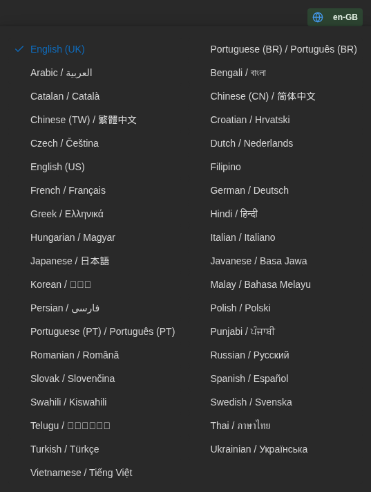
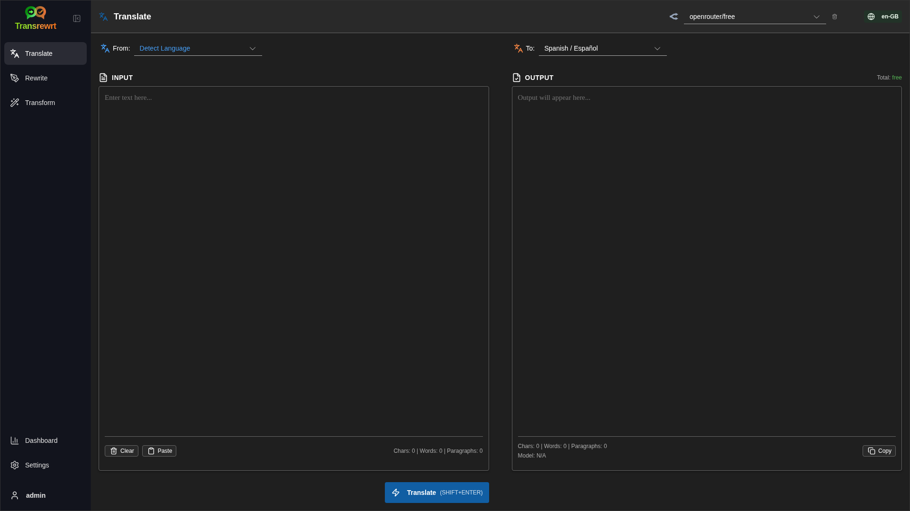
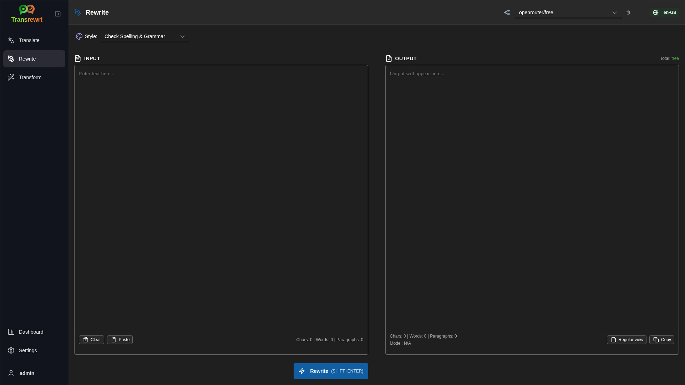
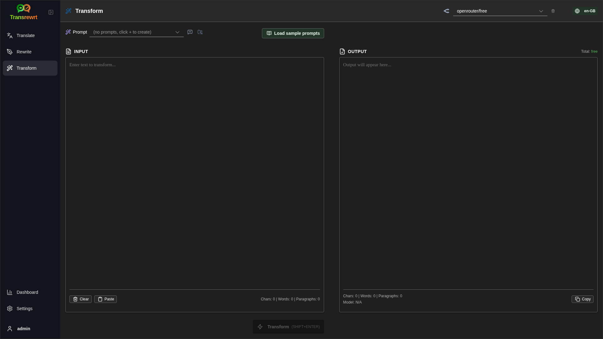
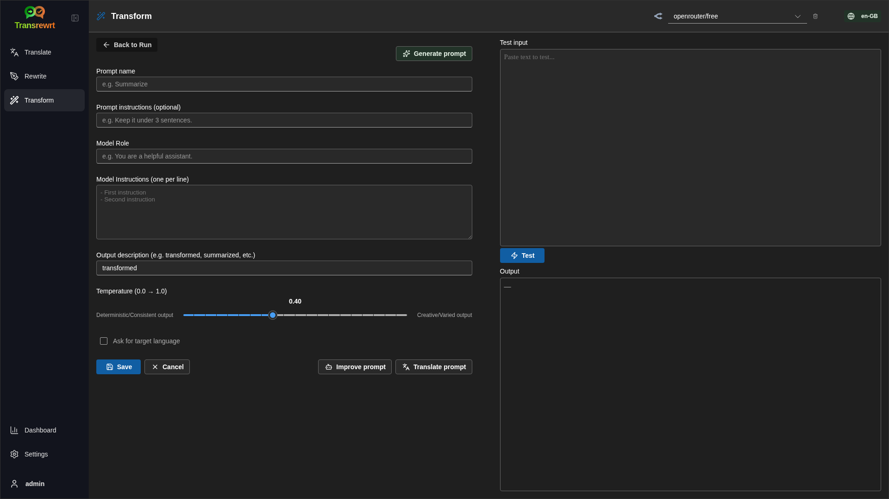
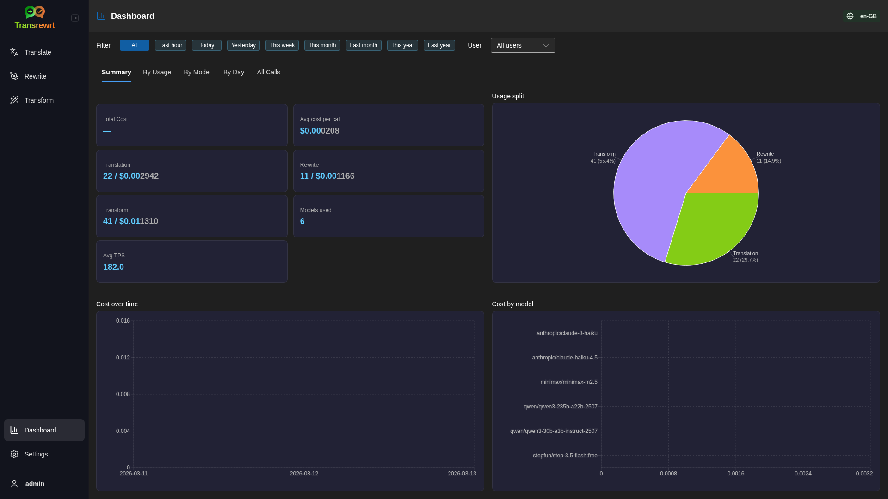
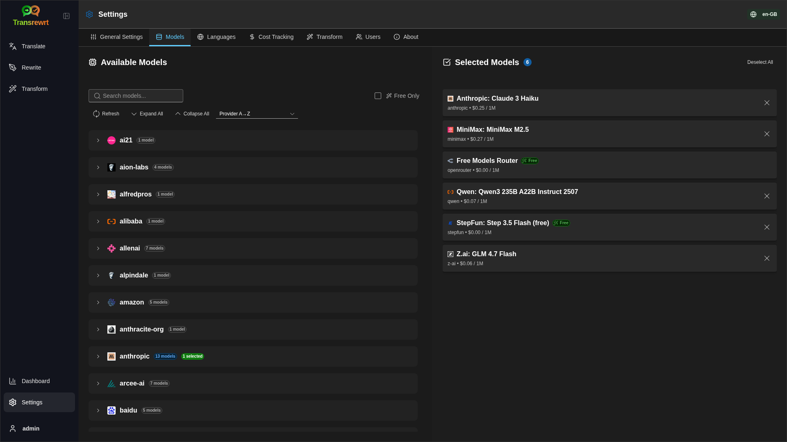

# Transrewrt User Guide

 

## Introduction

Transrewrt helps you work with text in three main ways:

- **Translate** text from one language to another.
- **Rewrite** text in a different style, such as clearer, shorter, or more formal.
- **Transform** text using custom AI instructions called prompts.

 

This guide explains how to use the app after it is installed and open. For installation steps, see the main [README](README.md).

 

> [!NOTE]
> Transrewrt is available as a desktop app for Windows and Linux, and as a self-hosted web app. This guide focuses on everyday use of the app. Where something only applies to one version, it is clearly marked.

<small>**Read in other languages:** [English (UK)](USER-GUIDE.md) · [Português (BR)](translated-docs/USER-GUIDE.pt-BR.md) · [العربية](translated-docs/USER-GUIDE.ar.md) · [বাংলা](translated-docs/USER-GUIDE.bn.md) · [Català](translated-docs/USER-GUIDE.ca.md) · [简体中文](translated-docs/USER-GUIDE.zh-CN.md) · [繁體中文](translated-docs/USER-GUIDE.zh-TW.md) · [Hrvatski](translated-docs/USER-GUIDE.hr.md) · [Čeština](translated-docs/USER-GUIDE.cs.md) · [Nederlands](translated-docs/USER-GUIDE.nl.md) · [English (US)](translated-docs/USER-GUIDE.en-US.md) · [Filipino](translated-docs/USER-GUIDE.tl.md) · [Français](translated-docs/USER-GUIDE.fr.md) · [Deutsch](translated-docs/USER-GUIDE.de.md) · [Ελληνικά](translated-docs/USER-GUIDE.el.md) · [हिन्दी](translated-docs/USER-GUIDE.hi.md) · [Magyar](translated-docs/USER-GUIDE.hu.md) · [Italiano](translated-docs/USER-GUIDE.it.md) · [日本語](translated-docs/USER-GUIDE.ja.md) · [Basa Jawa](translated-docs/USER-GUIDE.jv.md) · [한국어](translated-docs/USER-GUIDE.ko.md) · [Bahasa Melayu](translated-docs/USER-GUIDE.ms.md) · [فارسی](translated-docs/USER-GUIDE.fa.md) · [Polski](translated-docs/USER-GUIDE.pl.md) · [Português (PT)](translated-docs/USER-GUIDE.pt.md) · [ਪੰਜਾਬੀ](translated-docs/USER-GUIDE.pa.md) · [Română](translated-docs/USER-GUIDE.ro.md) · [Русский](translated-docs/USER-GUIDE.ru.md) · [Slovenčina](translated-docs/USER-GUIDE.sk.md) · [Español](translated-docs/USER-GUIDE.es.md) · [Kiswahili](translated-docs/USER-GUIDE.sw.md) · [Svenska](translated-docs/USER-GUIDE.sv.md) · [తెలుగు](translated-docs/USER-GUIDE.te.md) · [ภาษาไทย](translated-docs/USER-GUIDE.th.md) · [Türkçe](translated-docs/USER-GUIDE.tr.md) · [Українська](translated-docs/USER-GUIDE.uk.md) · [Tiếng Việt](translated-docs/USER-GUIDE.vi.md)</small>

 

<!-- START doctoc generated TOC please keep comment here to allow auto update -->
<!-- DON'T EDIT THIS SECTION, INSTEAD RE-RUN doctoc TO UPDATE -->
**Table of Contents** 

- [Before you start](#before-you-start)
  - [How to get an API key (desktop app)](#how-to-get-an-api-key-desktop-app)
- [Getting started](#getting-started)
- [Main parts of the window](#main-parts-of-the-window)
  - [Sidebar](#sidebar)
  - [Toolbar](#toolbar)
  - [Input and output panels](#input-and-output-panels)
- [Translate](#translate)
  - [Translate text](#translate-text)
  - [Language selection](#language-selection)
  - [Helpful translation settings](#helpful-translation-settings)
  - [Keyboard shortcuts](#keyboard-shortcuts)
- [Rewrite](#rewrite)
  - [Rewrite text](#rewrite-text)
- [Transform](#transform)
  - [Run an existing prompt](#run-an-existing-prompt)
  - [If you have no prompts yet](#if-you-have-no-prompts-yet)
  - [Create a prompt quickly](#create-a-prompt-quickly)
  - [Edit a prompt](#edit-a-prompt)
  - [Test a prompt before using it](#test-a-prompt-before-using-it)
  - [Manage saved prompts](#manage-saved-prompts)
- [Dashboard](#dashboard)
  - [Filter the data](#filter-the-data)
  - [Dashboard tabs](#dashboard-tabs)
  - [Export data](#export-data)
  - [Delete stored records for a model](#delete-stored-records-for-a-model)
- [Settings](#settings)
  - [General settings](#general-settings)
  - [Models](#models)
  - [Languages](#languages)
  - [Cost tracking](#cost-tracking)
  - [Transform prompts](#transform-prompts)
  - [Users](#users)
  - [API config](#api-config)
  - [About](#about)
- [Common issues](#common-issues)
  - [The app will not translate, rewrite, or transform text](#the-app-will-not-translate-rewrite-or-transform-text)
  - [The model list is empty](#the-model-list-is-empty)
  - [The result is too slow or too expensive](#the-result-is-too-slow-or-too-expensive)
  - [The interface is in the wrong language](#the-interface-is-in-the-wrong-language)
  - [The text is too small or hard to read](#the-text-is-too-small-or-hard-to-read)
  - [I changed a prompt and lost the edits](#i-changed-a-prompt-and-lost-the-edits)
- [Quick tips](#quick-tips)

<!-- END doctoc generated TOC please keep comment here to allow auto update -->

  

## Before you start

To use Transrewrt, you need access to the AI service through OpenRouter.

You do not need to choose a paid model before you start. The app always includes the built-in **free** model, so in normal use that is enough to begin translating, rewriting, and transforming text.

In plain language:

- A **model** is the AI engine that does the work.
- An **API key** is your access key for that service.

If you are using the **desktop app**, you will need an API key. For detailed steps, see [How to get an API key](#how-to-get-an-api-key-desktop-app) below. In short: create an account at [OpenRouter](https://openrouter.ai), open the [Keys](https://openrouter.ai/keys) page, create a new key, and paste it into [**Settings** > **API Config**](#api-config) in Transrewrt.

If you are using the **web version**, the server owner usually sets this up for you. You do not normally enter an API key in the web app.

 

### How to get an API key (desktop app)

If you are using the desktop app, follow these steps:

1. Go to [OpenRouter](https://openrouter.ai) in your web browser.
2. Create an account or sign in.
3. Open the [Keys](https://openrouter.ai/keys) page.
4. Click the button to create a new API key.
5. Give the key a name so you can recognise it later.
6. Copy the new API key.
7. Return to Transrewrt and open **Settings** > **API Config**.
8. Paste the key into **OpenRouter API Key**.
9. Click **Test API Configuration** to make sure it works.

> [!NOTE]
> You can start with OpenRouter's free route or any of the other free models available. In many cases, that is enough to begin using Transrewrt without choosing a paid model.

  

## Getting started

If this is your first time using Transrewrt, follow this order:

1. Open the app.
2. Choose your **Interface language** from the globe icon if needed.
3. If you are on the **desktop app**, open [**Settings** > **API Config**](#api-config), paste your OpenRouter API key, and click **Test API Configuration**.
4. Open [**Settings** > **Models**](#models) and add one or more models to **Selected Models**.
5. Open [**Settings** > **Languages**](#languages) and choose your **Top languages** if you want your most-used languages to appear first.
6. Go to **Translate** and run a simple translation to confirm everything is working.
7. Once that works, try **Rewrite** and then **Transform**.

This order matters. It prevents the most common first-use problem: trying to run a task before the app has a working API connection or a selected model.

  

## Main parts of the window

The app is divided into three main areas:

- The **sidebar** on the left.
- The **toolbar** at the top.
- The **work area** in the centre.

 

### Sidebar

Use the sidebar to move around the app:

 

<table>
  <tr>
    <td valign="top">
       
    </td>
    <td valign="top">
       
      <ul>
        <li><strong>Translate</strong> opens the translation workspace.</li>
        <li><strong>Rewrite</strong> opens the rewriting workspace.</li>
        <li><strong>Transform</strong> opens the custom prompt workspace.</li>
        <li><strong>Dashboard</strong> shows usage and cost information.</li>
        <li><strong>Settings</strong> opens the settings panel.</li>
        <li><strong>User</strong> shows the username of the logged-in user (web only).</li>
      </ul>
       
      
You can also collapse the sidebar for more space by clicking the icon next to the app logo.

    </td>
  </tr>
</table>

 

### Toolbar

The toolbar changes slightly depending on where you are in the app.

- On the left, it shows the current page name.
- On the right, it shows the **model selector** and the **Interface language** control.

The **model selector** lets you choose which AI engine to use for the current task.

  

> [!NOTE]
> Some free models may stop working temporarily if they are unavailable or have reached a usage limit. If that happens, the app will remove that model from your list automatically.

The **globe icon + language code** changes the app interface language, such as menus and buttons. It does **not** change the translation languages used in **Translate**.

  

 

### Input and output panels

Most workspaces use a left-hand **Input** panel and a right-hand **Output** panel.

The **Input** panel shows:

- Character count
- Word count
- Paragraph count

The **Output** panel can show:

- How long the task took
- The cost of that task
- Your running total cost
- **TPS** (tokens per second), which is a simple speed measure
- Character, word, and paragraph counts
- The model used

If you are wondering about the technical terms:

- **Token** means a small chunk of text. You can think of it as part of a word or a short word.
- **TPS** means how many of those text chunks the model processed each second.

  

## Translate

Use **Translate** when you want to convert text from one language to another.

 

### Translate text

1. Open **Translate**.
2. Choose a language in **From**.
3. Choose a language in **To**.
4. Choose a model in the toolbar.
5. Type or paste text into **Input**.
6. Click **Translate**.
7. Read the result in **Output**.
8. Use the copy button if you want to copy the result.

 

### Language selection

- **From** can be a specific language or **Detect Language**.
- **To** is the language you want the result in.

Your selected **Top languages** appear at the top of the list. You can set these in [**Settings** > **Languages**](#languages).

 

### Helpful translation settings

In [**Settings** > **General Settings**](#general-settings), you can change how translation behaves:

- **Auto-translate on paste** runs a translation as soon as you paste text.
- **Auto-copy result to clipboard** copies the result automatically after a successful run.
- **Real-time translation (while typing)** runs translations while you type.
- **Timeout (ms)** controls how long the app waits before running a real-time translation.

 

### Keyboard shortcuts

In [**Settings** > **General Settings**](#general-settings), **Behavior for ENTER** controls what happens when you press Enter:

- **Enter** can run the task and **Shift+Enter** can add a new line.
- Or the app can do the reverse.

The current shortcut is also shown on the **Translate** button.

  

## Rewrite

Use **Rewrite** when you want to improve wording without changing the main meaning.

This is useful for:

- fixing spelling and grammar
- making text clearer
- making text more formal or more informal
- shortening or expanding text
- making text sound more technical

 

### Rewrite text

1. Open **Rewrite**.
2. Choose a **Mode**.
3. Choose a model in the toolbar.
4. Type or paste text into **Input**.
5. Click **Rewrite**.
6. Review the result in **Output**.

The same Enter key behaviour from [**Translate**](#keyboard-shortcuts) also applies here.

  

## Transform

Use **Transform** when you want the AI to follow a custom set of instructions.

This is the most flexible area of the app. You can use it for tasks such as:

- summarising notes
- turning rough text into a polished email
- extracting key points
- converting text into a specific format

 

### Run an existing prompt

1. Open **Transform**.
2. Choose a prompt from the prompt list.
3. If a **Target** language box appears, choose a language if you want one.
4. Type or paste text into **Input**.
5. Click **Transform**.
6. Read the result in **Output**.

 

### If you have no prompts yet

If your prompt list is empty, click **Load sample prompts**. This adds built-in examples so you can start quickly.

> [!NOTE]
> Sample prompts are provided in English. After loading them, you can edit a prompt and use **Translate prompt** if you want to adapt the prompt text for another language.

 

### Create a prompt quickly

The fastest way to create a prompt is:

1. Click **New prompt**.
2. Click **Generate prompt**.
3. Describe what you want the prompt to do.
4. Choose a model.
5. Let the app create a draft for you.
6. Review the draft and click **Save**.

 

### Edit a prompt

When you create or edit a prompt, the editor appears on the left and a test area appears on the right.

The main fields are:

- **Prompt name**: the name you see in the prompt list.
- **Prompt instructions (optional)**: a short helper line shown to the user.
- **Model Role**: the overall role for the AI, such as "You are a helpful assistant."
- **Model Instructions (one per line)**: the rules you want the AI to follow.
- **Output description**: a short word that describes the result, such as "summary" or "rewrite".
- **Temperature (0.0 -> 1.0)**: a creativity slider.
- **Ask for target language**: adds a target language choice when you run the prompt.

If the technical term **Temperature** is new to you, think of it like this:

- A **lower** temperature gives steadier, more predictable results.
- A **higher** temperature gives more variety and creativity.

You can also use:

- **`Generate prompt`** to create a new draft from a simple description
- **`Improve prompt`** to refine an existing prompt
- **`Translate prompt`** to translate the prompt fields

> [!WARNING]
> Click **`Save`** before you click **`Back to Run`**. If you go back without saving, your changes will be lost.

 

### Test a prompt before using it

The test panel on the right lets you try your prompt with sample text before you use it in day-to-day work.

This is useful when:

- you are building a new prompt
- you are comparing two versions of a prompt
- you want to check tone, length, or output format

 

### Manage saved prompts

To manage saved prompts in one place, open [**Settings** > **Transform Prompts**](#transform-prompts).

There you can:

- list and delete your prompts
- export prompts as **JSON**, **CSV**, or **XLSX**
- import prompts from a file

  

## Dashboard

Use **Dashboard** to see how much you are using the app and how much it is costing.

 

### Filter the data

Use the filter buttons at the top to change the time range.

> [!NOTE]
> In the web version, administrators may also see a **User** filter. This lets them switch between **All users** and an individual user.

 

### Dashboard tabs

- **Summary** gives you an overview of usage and cost.
- **By Usage** breaks activity down by translation language, rewrite mode, and transform prompt.
- **By Model** shows which models you used and how much they cost.
- **By Day** shows daily totals.
- **All Calls** shows the full call history and lets you export it.

 

### Export data

The dashboard tables can export data in:

- **JSON**
- **CSV**
- **XLSX**

This is useful if you want to review activity outside the app or share a report.

 

### Delete stored records for a model

In **By Model** or **All Calls**, you can remove stored records for a model.

> [!WARNING]
> Deleting stored records cannot be undone. Only use this if you are sure you no longer need that history.

To delete all data or remove records based on their age, go to [**Settings** > **Cost Tracking**](#cost-tracking). There you will find options to delete all stored data or only data older than a certain date.

  

## Settings

Open **Settings** from the sidebar to customise how the app works.

The available tabs may vary:

- **API Config** is available only in the desktop app.
- **Users** is available only in the web app for administrators.

 

### General settings

Use **General Settings** to control typing behaviour and appearance.

**Behaviour**

- **Behavior for ENTER** chooses whether Enter runs the task or adds a new line.
- **Auto-translate on paste** starts translation after you paste text.
- **Auto-copy result to clipboard** copies successful results automatically.
- **Real-time translation (while typing)** translates while you type.
- **Timeout (ms)** sets the wait time for real-time translation.

**Appearance**

- **Cost fraction digits** changes how cost decimals are displayed.
- **Font Family** changes the writing font in the text panels.
- **Size** changes the font size.
- **Web only:** **show a margin around the app** adds extra space around the interface.

 

### Models

Use **Settings** > **Models** to choose which models appear in the toolbar.

The page has two lists:

- **Available Models** on the left
- **Selected Models** on the right

Useful controls include:

- **Search models...** to find a model by name
- **Free Only** to show only free models
- **Refresh** to reload the list
- **Expand All** and **Collapse All** when you are sorting by provider

To add a model, click **Add**.

To remove a model, click **X** next to it in **Selected Models**.

To clear the list, click **Deselect all**. The required free model stays in the list.

> [!NOTE]
> If you do not want to add credits to OpenRouter straight away, start by enabling **Free Only** and choosing the free models.

 

### Languages

Use **Settings** > **Languages** to organise the language lists used in the app.

- **Top languages** are pinned near the top of the language lists in **Translate** and **Transform**.
- **Custom language** lets you add a language that is not already in the built-in list.

If you add a custom language, it appears in the language selectors like the built-in options.

 

### Cost tracking

Use **Settings** > **Cost Tracking** to manage cost information.

- **Total Cost** shows the running total.
- **Copy Value** copies the total to the clipboard.
- **Reset Cost** resets the stored total to zero.
- **Sync with API key usage** sets the total to match the usage reported by OpenRouter.
- **API Key Usage** shows usage details, if available.
- **Delete cost data** removes all data or only entries older than a selected date.

> [!WARNING]
> Data deletion cannot be undone. Before deleting, make sure to back up your data or export it via [**Dashboard** > **All Calls**](#dashboard-tabs), otherwise it will be lost permanently.

 

### Transform prompts

Use **Settings** > **Transform Prompts** to manage prompts in bulk.

You can:

- review your saved prompts
- delete prompts
- import prompts from a file
- export prompts for backup or sharing

 

### Users

**Web only, administrator only**

Use **Users** to manage user accounts in the web version. This includes adding users, changing details, resetting passwords, and deleting accounts.

 

### API config

**Desktop only**

Use **API Config** to connect the desktop app to OpenRouter or to a Transrewrt proxy.

- **OpenRouter API Key** is where you paste your key.
- **API URL** is the service address. Leave it at the default unless you were given a different one.
- **Use Transrewrt Proxy** sends requests through a proxy service instead of directly to OpenRouter.
- **Key Seed** appears when the proxy option is enabled.
- **Test API Configuration** checks whether the current setup works.

For detailed steps on obtaining your API key, see [How to get an API key](#how-to-get-an-api-key-desktop-app) above.

> [!NOTE]
> If you are not sure what **API URL**, **Use Transrewrt Proxy**, or **Key Seed** mean, leave them 
> unchanged and use the default OpenRouter setup. More information about the proxy is available in 
> the [Transrewrt Proxy repository](https://github.com/wsj-br/transrewrt-proxy).

 

### About

The **About** tab shows:

- the app name
- the version number
- the build date
- a link to the project repository

  

## Common issues

If something does not work as expected, check these points first.

 

### The app will not translate, rewrite, or transform text

Check that:

- you have selected a model in the toolbar
- at least one model is listed in [**Settings** > **Models**](#models)
- your API setup is working

If you are on the desktop app:

1. Open [**Settings** > **API Config**](#api-config).
2. Check that your API key is saved.
3. Click **Test API Configuration**.

 

### The model list is empty

Open [**Settings** > **Models**](#models) and click **Refresh**.

If needed:

- search for a model
- turn on **Free Only**
- add one or more models to **Selected Models**

 

### The result is too slow or too expensive

Try one or more of these:

- choose a different model
- use a shorter input
- turn off **Real-time translation (while typing)** in [**Settings** > **General Settings**](#general-settings)
- use free models for simple tasks (see [Models](#models))

 

### The interface is in the wrong language

Click the globe icon in the [toolbar](#toolbar) and choose your preferred **Interface language**.

 

### The text is too small or hard to read

Open [**Settings** > **General Settings**](#general-settings) and change:

- **Font Family**
- **Size**

 

### I changed a prompt and lost the edits

When editing prompts, always click **Save** before **Back to Run**.

  

## Quick tips

- Start with [**Translate**](#translate) to make sure your setup works before you move on to [**Rewrite**](#rewrite) or [**Transform**](#transform).
- Use [**Rewrite**](#rewrite) for everyday wording improvements.
- Use [**Transform**](#transform) when you need a repeatable workflow for a specific task.
- Use [**Dashboard**](#dashboard) if you want to keep an eye on usage and cost.
- Export prompts regularly if you build a prompt library you want to keep safe (see [Transform Prompts](#transform-prompts)).

