<a id="transrewrt-user-guide"></a>
# User Guide

<br/>

<a id="introduction"></a>
## Introduction

Transrewrt helps you work with text in three main ways:

- **Translate** - convert text from one language to another.
- **Rewrite** - rephrase text in a different style, such as clearer, shorter, or more formal.
- **Transform** - process text using custom AI instructions called prompts.

<br/>

This guide explains how to use the app once it is installed and running. For installation steps, see the main **[README](README.md)**.

<br/>

> ℹ️ **NOTE**<br/>
> Transrewrt is available as a desktop app for Windows and Linux, and as a self-hosted web app. This guide focuses on everyday use of the app. Where something only applies to one version, it is clearly marked.

<small>**Read in other languages:** </small>
<small id="lang-list">[English](./USER-GUIDE.md) · [Português (BR)](./translated-docs/USER-GUIDE.pt-BR.md) · [العربية](./translated-docs/USER-GUIDE.ar.md) · [বাংলা](./translated-docs/USER-GUIDE.bn.md) · [Català](./translated-docs/USER-GUIDE.ca.md) · [中文 (中国大陆)](./translated-docs/USER-GUIDE.zh-CN.md) · [中文 (台灣)](./translated-docs/USER-GUIDE.zh-TW.md) · [Hrvatski](./translated-docs/USER-GUIDE.hr.md) · [Čeština](./translated-docs/USER-GUIDE.cs.md) · [Nederlands](./translated-docs/USER-GUIDE.nl.md) · [English](./translated-docs/USER-GUIDE.en-US.md) · [Tagalog](./translated-docs/USER-GUIDE.tl.md) · [Français](./translated-docs/USER-GUIDE.fr.md) · [Deutsch](./translated-docs/USER-GUIDE.de.md) · [Ελληνικά](./translated-docs/USER-GUIDE.el.md) · [हिन्दी](./translated-docs/USER-GUIDE.hi.md) · [Magyar](./translated-docs/USER-GUIDE.hu.md) · [Italiano](./translated-docs/USER-GUIDE.it.md) · [日本語](./translated-docs/USER-GUIDE.ja.md) · [한국어](./translated-docs/USER-GUIDE.ko.md) · [Bahasa Melayu](./translated-docs/USER-GUIDE.ms.md) · [فارسی](./translated-docs/USER-GUIDE.fa.md) · [Polski](./translated-docs/USER-GUIDE.pl.md) · [Basa Jawa](./translated-docs/USER-GUIDE.jv.md) · [Português](./translated-docs/USER-GUIDE.pt.md) · [ਪੰਜਾਬੀ](./translated-docs/USER-GUIDE.pa.md) · [Română](./translated-docs/USER-GUIDE.ro.md) · [Русский](./translated-docs/USER-GUIDE.ru.md) · [Slovenčina](./translated-docs/USER-GUIDE.sk.md) · [Español](./translated-docs/USER-GUIDE.es.md) · [Kiswahili](./translated-docs/USER-GUIDE.sw.md) · [Svenska](./translated-docs/USER-GUIDE.sv.md) · [తెలుగు](./translated-docs/USER-GUIDE.te.md) · [ไทย](./translated-docs/USER-GUIDE.th.md) · [Türkçe](./translated-docs/USER-GUIDE.tr.md) · [Українська](./translated-docs/USER-GUIDE.uk.md) · [Tiếng Việt](./translated-docs/USER-GUIDE.vi.md)</small>

<small>

> **Note on UI and documentation translations:** All interface languages except the original English (UK) 
> were translated using AI models; the wording may be imprecise or contain errors.

</small>

<br/>


<!-- START doctoc generated TOC please keep comment here to allow auto update -->
<!-- DON'T EDIT THIS SECTION, INSTEAD RE-RUN doctoc TO UPDATE -->
**Table of Contents** 

- [Before you start](#before-you-start)
  - [How to get a free OpenRouter API key (desktop app)](#how-to-get-a-free-openrouter-api-key-desktop-app)
- [Getting started](#getting-started)
- [Main parts of the window](#main-parts-of-the-window)
  - [Sidebar](#sidebar)
  - [Toolbar](#toolbar)
  - [Input and output panels](#input-and-output-panels)
- [Translate](#translate)
  - [Translate text](#translate-text)
  - [Language selection](#language-selection)
  - [Helpful translation settings](#helpful-translation-settings)
- [Rewrite](#rewrite)
- [Transform](#transform)
  - [Run an existing prompt](#run-an-existing-prompt)
  - [If you have no prompts yet](#if-you-have-no-prompts-yet)
  - [Create a prompt quickly](#create-a-prompt-quickly)
  - [Edit a prompt](#edit-a-prompt)
  - [Test a prompt before using it](#test-a-prompt-before-using-it)
- [Dashboard](#dashboard)
  - [Filter the data](#filter-the-data)
  - [Dashboard tabs](#dashboard-tabs)
  - [Export data](#export-data)
  - [Delete stored records for a model](#delete-stored-records-for-a-model)
- [History](#history)
  - [Filter the data](#filter-the-data-1)
  - [Export history data](#export-history-data)
- [Settings](#settings)
  - [General settings](#general-settings)
  - [Models](#models)
  - [Languages](#languages)
  - [Cost tracking](#cost-tracking)
  - [Transform prompts](#transform-prompts)
  - [Users](#users)
  - [API config](#api-config)
  - [About](#about)
- [Common issues](#common-issues)
  - [The app will not translate, rewrite, or transform text](#the-app-will-not-translate-rewrite-or-transform-text)
  - [The model list is empty](#the-model-list-is-empty)
  - [The result is too slow or too expensive](#the-result-is-too-slow-or-too-expensive)
  - [The interface is in the wrong language](#the-interface-is-in-the-wrong-language)
  - [The text is too small or hard to read](#the-text-is-too-small-or-hard-to-read)
  - [Dashboard charts are empty](#dashboard-charts-are-empty)
  - [Cost shows "not available" or seems wrong](#cost-shows-not-available-or-seems-wrong)
  - [Total cost does not match my provider bill](#total-cost-does-not-match-my-provider-bill)
  - [The History page is missing from the sidebar](#the-history-page-is-missing-from-the-sidebar)
  - [Web app: redirected to the login page unexpectedly](#web-app-redirected-to-the-login-page-unexpectedly)
  - [Web admin: forgot or lost a password](#web-admin-forgot-or-lost-a-password)
  - [Dashboard shows no data for other users (web)](#dashboard-shows-no-data-for-other-users-web)
  - [I changed a prompt and lost the edits](#i-changed-a-prompt-and-lost-the-edits)
- [Quick tips](#quick-tips)
- [Disclaimer](#disclaimer)
- [License](#license)

<!-- END doctoc generated TOC please keep comment here to allow auto update -->

<br/><br/>

<a id="before-you-start"></a>
## Before you start

To use Transrewrt, you need access to at least one AI provider. The supported providers are: [OpenRouter](https://openrouter.ai) (which aggregates many models), OpenAI, Anthropic, Google Gemini, DeepSeek, Groq, Mistral, xAI, Cerebras, and [Ollama](https://ollama.com) for local models.

You do not need to select a paid model to begin. As soon as you add your OpenRouter API key, the app automatically enables a built-in **free** OpenRouter option. This lets you start translating, rewriting, and transforming text right away. Alternatively, you can also obtain a free API key from Cerebras, Google, Groq, or Mistral AI.

In plain language:

- A **model** is the AI engine that does the work. Models are listed with a **provider prefix** (for example `openrouter/…`, `openai/…`, `ollama/…`).
- An **API key** (or, for Ollama, a **base URL**) is how the app reaches that provider.

If you are using the **desktop app**, add keys in [**Settings** > **API Config**](#api-config) for each provider you use. For OpenRouter-only use, see [How to get an API key](#how-to-get-an-api-key-desktop-app) below. If you do not want to use an API key, you can install Ollama (from [ollama.com](https://ollama.com)) and use local models instead, such as `translategemma:4b`.

If you are using the **web version**, the server owner configures providers with environment variables, so you cannot enter API keys directly in the application.

<br/>

<a id="how-to-get-an-api-key-desktop-app"></a>
### How to get a free OpenRouter API key (desktop app)

If you are using the desktop app, follow these steps:

1. Go to [OpenRouter](https://openrouter.ai) in your web browser.
2. Create an account or sign in.
3. Open the [Keys](https://openrouter.ai/keys) page.
4. Click the button to create a new API key.
5. Give the key a name so you can recognise it later.
6. Copy the new API key.
7. Return to Transrewrt and open **Settings** > **API Config**.
8. Paste the key into **OpenRouter API key** (under **Settings** > **API Config**).
9. Click **Test OpenRouter key** to make sure it works.

<br/><br/>

<a id="getting-started"></a>
## Getting started

If this is your first time using Transrewrt, follow this order:

1. Open the app.
2. Choose your **Interface language** from the globe icon if needed.
3. If you are on the **desktop app**, open [**Settings** > **API Config**](#api-config), add an API key for at least one provider (for example OpenRouter), and click **Test** to verify it works.
4. Open [**Settings** > **Models**](#models) and add one or more models to **Selected Models**.
5. Open [**Settings** > **Languages**](#languages) and choose your **Top languages** if you want your most-used languages to appear first.
6. Go to **Translate** and run a simple translation to confirm everything is working.
7. Once that works, try **Rewrite** and then **Transform**.

This order matters. It prevents the most common first-use problem: trying to run a task before the app has a working API connection or a selected model.

<br/><br/>

<a id="main-parts-of-the-window"></a>
## Main parts of the window

The app is divided into three main areas:

- The **sidebar** on the left.
- The **toolbar** at the top.
- The **work area** in the centre.

<br/>

<a id="sidebar"></a>
### Sidebar

Use the sidebar to move around the app. You can collapse the sidebar for more space by clicking the icon next to the app logo.

<br/>

<table>
  <tr>
    <td valign="top">
       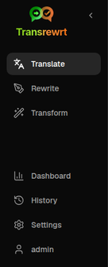
    </td>
    <td valign="top">
      <br/><br/>
      <ul>
        <li><strong>Translate</strong> opens the translation workspace.</li><br/>
        <li><strong>Rewrite</strong> opens the rewriting workspace.</li><br/>
        <li><strong>Transform</strong> opens the custom prompt workspace.</li><br/>
        <li><strong>Dashboard</strong> shows usage and cost information.</li><br/>
        <li><strong>Settings</strong> opens the settings panel.</li><br/>
        <li><strong>History</strong> shows the usage history with the input and output text</li><br/>
        <li><strong>User</strong> shows the username of the logged-in user (web only).</li>
      </ul>
    </td>
  </tr>
</table>

<br/>

<a id="toolbar"></a>
### Toolbar

The toolbar changes slightly depending on where you are in the app.

- On the left, it shows the current page name.
- On the right, it shows the **model selector** and the **Interface language** control.

The **model selector** lets you choose which AI engine to use for the current task.

  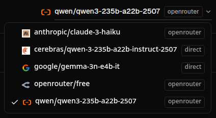

 Some free models may not always be available-sometimes they are offline or have a usage cap. If this happens, the app will automatically remove that model from your available list. To control which models appear, go to [**Settings** > **Models**](#models) and edit your model list. 
 You can also open the model settings directly by clicking the provider icon to the left of the model name in the toolbar.

<br/>

The **globe icon + language code** changes the app interface language, such as menus and buttons. It does **not** change the translation languages used in **Translate**.

  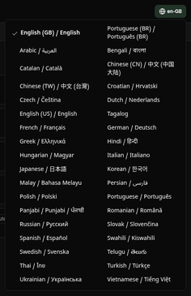

<br/>

<a id="input-and-output-panels"></a>
### Input and output panels

Most workspaces use a left-hand **Input** panel and a right-hand **Output** panel.

Each panel also shows:

| **Input**                                                          | **Output**                                                                                                                  |
|--------------------------------------------------------------------|-----------------------------------------------------------------------------------------------------------------------------|
| - Character count <br/>- Word count <br/>- Paragraph count   <br/> | - How long the task took<br/>- **TPS** (tokens per second)<br/>- Character, word, and paragraph counts<br/>- The model used |


If you are wondering about the technical terms:

- **Token** means a small chunk of text. You can think of it as part of a word or a short word.
- **TPS** means how many of those text chunks the model processed each second.

<br/>

You can also monitor the cost of each operation (if available) and the total cost, enabling the option `Show cost information on the actions` at [**Settings** > **General settings**](#general-settings). 
 
<br/><br/>

[--------------------------------------------------------------------------------------------------------------------------]: # 

<a id="translate"></a>
## Translate

Use **Translate** when you want to convert text from one language to another.

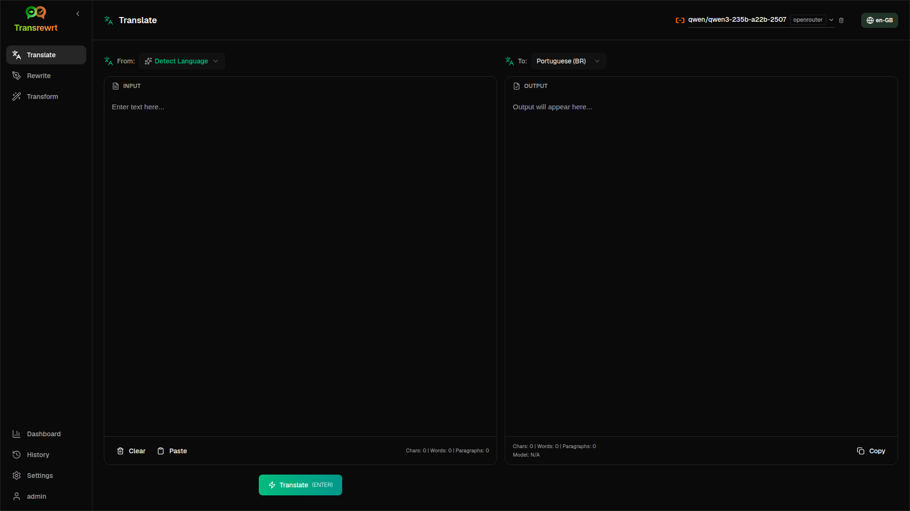

<br/>

<a id="translate-text"></a>
### Translate text

1. Open **Translate**.
2. Choose a language in **From**.
3. Choose a language in **To**.
4. Choose a model in the toolbar.
5. Type or paste text into **Input**.
6. Click **Translate**.
7. Read the result in **Output**.
8. Use the copy button if you want to copy the result.

<br/>

<a id="language-selection"></a>
### Language selection

- **From** can be a specific language or **Detect Language**.
- **To** is the language you want the result in.

Your selected **Top languages** appear at the top of the list. You can set these in [**Settings** > **Languages**](#languages).

<br/>

<a id="helpful-translation-settings"></a>
### Helpful translation settings

In [**Settings** > **General Settings**](#general-settings), you can change how translation behaves:

- **Auto-translate on paste** runs a translation as soon as you paste text.
- **Auto-copy result to clipboard** copies the result automatically after a successful run.
- **Real-time translation (while typing)** runs translations while you type.
- **Timeout (ms)** controls how long the app waits before running a real-time translation.
- **Enter** controls what happens when you press `Enter`:

<br/><br/>

[--------------------------------------------------------------------------------------------------------------------------]: # 

<a id="rewrite"></a>
## Rewrite

Use **Rewrite** when you want to improve wording without changing the main meaning.

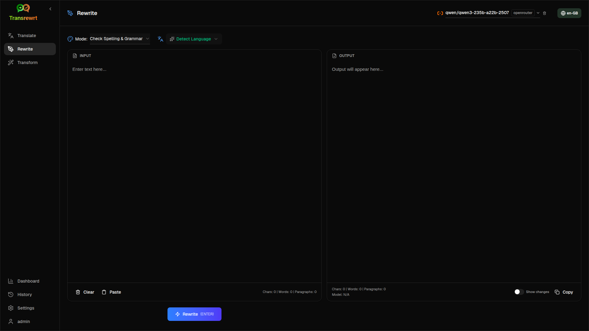

This is useful for:

- fixing spelling and grammar (**Check Spelling & Grammar**)
- making text clearer (**Improve Clarity**)
- several distinct reformulations in one run (**Alternative versions**)
- making text more formal or more informal (**Formal** / **Informal**)
- shortening or expanding text (**Shorten** / **Expand**)
- making text sound more technical (**Make Technical**)

<br/>

> 💡 **TIP**<br/>
> When you use the "**Check Spelling & Grammar**" mode, a **Show changes** switch appears in the output panel (next to **Copy**).
> Turn it on or off to show or hide the specific corrections applied to your text.


<br/><br/>

[--------------------------------------------------------------------------------------------------------------------------]: # 

<a id="transform"></a>
## Transform

Use **Transform** when you want the AI to follow a custom set of instructions.

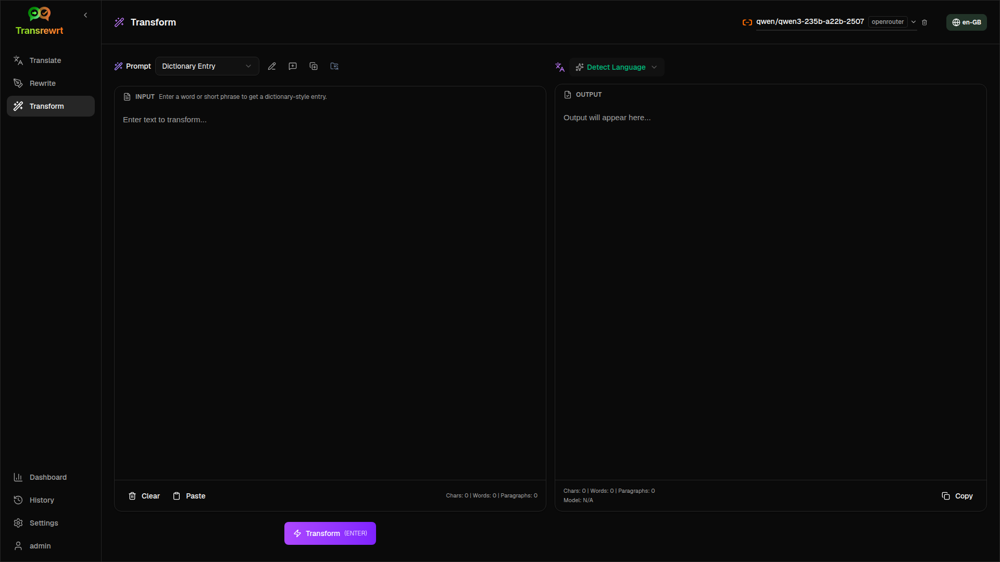

This is the most flexible area of the app. You can use it for tasks such as:

- summarising notes
- turning rough text into a polished email
- extracting key points
- converting text into a specific format
- any other custom activity with the input text

<br/>

<a id="run-an-existing-prompt"></a>
### Run an existing prompt

1. Open **Transform**.
2. Choose a prompt from the prompt list.
3. If a **Target** language box appears, choose a language if you want one.
4. Type or paste text into **Input**.
5. Click **Transform**.
6. Read the result in **Output**.

<br/>

<a id="if-you-have-no-prompts-yet"></a>
### If you have no prompts yet

If your prompt list is empty, click **Load sample prompts** in the Transform workspace. The same control is always available in [**Settings** > **Transform Prompts**](#transform-prompts) on the export/import row. Both add built-in examples so you can start quickly.

<br/>

> ℹ️ **NOTE**<br/>
> Sample prompts are provided in English. After loading them, you can edit a prompt and use **Translate prompt** to translate it into your language.

<br/>

<a id="create-a-prompt-quickly"></a>
### Create a prompt quickly

The fastest way to create a prompt is:

1. Click **New prompt**.
2. Click **Generate prompt**.
3. Describe what you want the prompt to do.
4. Choose a model.
5. Let the app create a draft for you.
6. Review the draft and click **Save**.

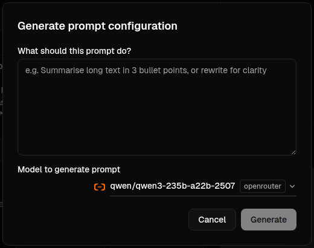


<br/>

<a id="edit-a-prompt"></a>
### Edit a prompt

When you create or edit a prompt, the editor appears on the left and a test area appears on the right.

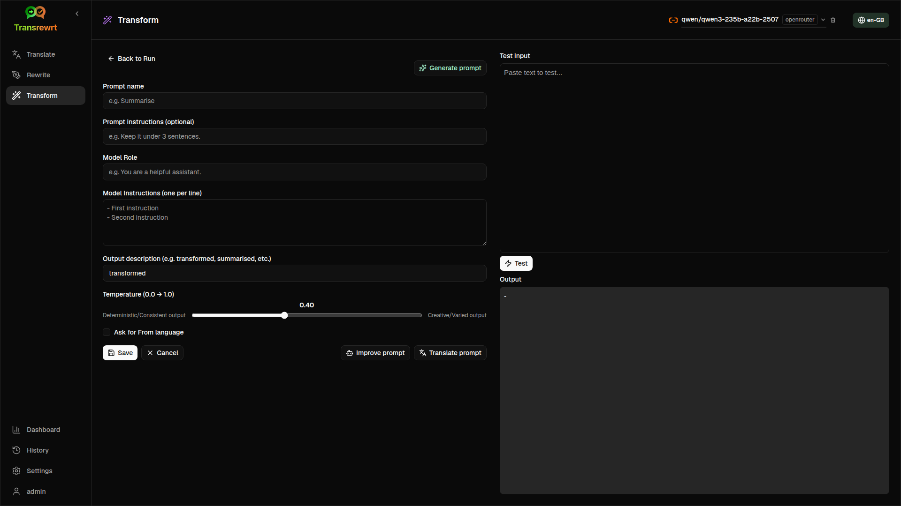

The main fields are:

- **Prompt name**: the name shown in the prompt list.
- **Prompt instructions (optional)**: a short hint displayed to the user when running the prompt.
- **Model Role**: the overall role assigned to the AI, such as 'You are a helpful assistant.'
- **Model Instructions (one per line)**: the specific rules you want the AI to follow.
- **Output description**: a short word describing the result, such as 'summary' or 'rewrite'.
- **Temperature (0.0 → 1.0)**: how the model will behave; see below.
- **Ask for target language**: adds a target language selector when the prompt is run.

If the technical term **Temperature** is new to you, think of it like this:

- A **lower** temperature gives steadier, more predictable results.
- A **higher** temperature gives more variety and creativity.

You can also use:

- **`Generate prompt`** to create a new draft from a simple description
- **`Improve prompt`** to refine an existing prompt
- **`Translate prompt`** to translate the prompt fields

<br/>

> ⚠️ **WARNING**<br/>
> Click **`Save`** before you click **`Back to Run`**. If you go back without saving, your changes will be lost.

<br/>

<a id="test-a-prompt-before-using-it"></a>
### Test a prompt before using it

The test panel on the right lets you try your prompt with sample text before you use it in day-to-day work.

This is useful when:

- you are building a new prompt
- you are comparing two versions of a prompt
- you want to check tone, length, or output format

<br/>

> ℹ️ **NOTE**<br/>
> You can export and import saved prompts in [**Settings** > **Transform Prompts**](#transform-prompts).

<br/><br/>

[--------------------------------------------------------------------------------------------------------------------------]: # 

<a id="dashboard"></a>
## Dashboard

Use **Dashboard** to see how much you are using the app and what it is costing (for paid models).

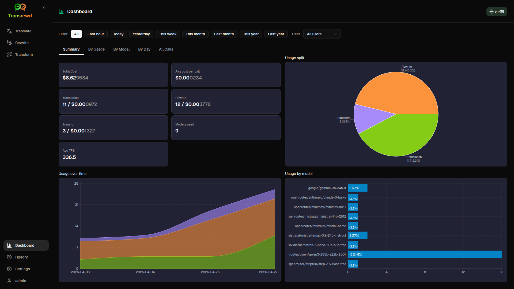


<br/>

> ℹ️ **NOTE**<br/>
> If you only use **free** models, **cost** amounts may be zero and cost-focused summaries can look empty. On **Summary**, **Usage over time** and **Usage by model** still show **numbers of calls** (translate, rewrite, and transform) when you have activity in the selected period.

<br/>

<a id="filter-the-data"></a>
### Filter the data

Use the filter buttons at the top to change the time range.


<br/>

> ℹ️ **NOTE**<br/>
> The **User** filter is only visible to administrators in the web version. Regular users will not see this filter, and it is not available in the desktop app.

<br/>

<a id="dashboard-tabs"></a>
### Dashboard tabs

- **Summary** gives you an overview of usage and cost. It includes a **Usage over time** (stacked cumulative **call counts** by day for translate, rewrite, and transform) and **Usage by model** (total **calls per model**, including transform).
- **By Usage** breaks activity down by translation language, rewrite mode, and transform prompt.
- **By Model** shows which models you used and how much they cost.
- **By Day** shows daily totals.
- **All Calls** shows the full call history and lets you export it.

<br/>

<a id="export-data"></a>
### Export data

The dashboard tables can export data in:

- **JSON**
- **CSV**
- **XLSX**

This is useful if you want to review activity outside the app or share a report.

<br/>

<a id="delete-stored-records-for-a-model"></a>
### Delete stored records for a model

In **By Model** or **All Calls**, you can remove stored records for a model by clicking on the "trash bin" icon.

> ⚠️ **WARNING**<br/>
> Deleting stored records cannot be undone. Only use this if you are sure you no longer need that history.

To delete all data or remove records based on their age, go to [**Settings** > **Cost Tracking**](#cost-tracking). There you will find options to delete all stored data or only data older than a certain date.

<br/><br/>

[--------------------------------------------------------------------------------------------------------------------------]: # 

<a id="history"></a>
## History

Click on **History** to see the history of your actions inside **Transrewrt**, including the input and output of each operation. 

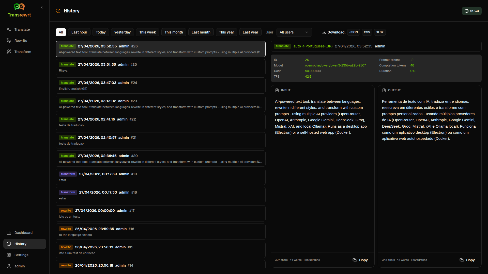

<br/>

<a id="filter-the-history"></a>
### Filter the data

**History** uses the same filters as the **Dashboard** page. Use them to select the time range.


<br/>

> ℹ️ **NOTE**<br/>
> The **User** filter is only visible to administrators in the web version. Regular users will not see this filter, and it is not available in the desktop app.

<br/>

<a id="export-history-data"></a>
###  Export history data

The history page can export the filtered data in:

- **JSON**
- **CSV**
- **XLSX**

This is useful if you want to review activity outside the app or share a report.

<br/><br/>

[--------------------------------------------------------------------------------------------------------------------------]: # 

<a id="settings"></a>
## Settings

Open **Settings** from the sidebar to customise how the app behaves.

The available tabs depend on the platform and your role:

  | Tab               | Desktop | Web (admin) | Web (regular user) |
  |-------------------|:-------:|:-----------:|:------------------:|
  | General Settings  |   yes   |     yes     |        yes         |
  | Models            |   yes   |     yes     |        yes         |
  | Languages         |   yes   |     yes     |        yes         |
  | Cost Tracking     |   yes   |     yes     |         -          |
  | Transform Prompts |   yes   |     yes     |        yes         |
  | Users             |    -    |     yes     |         -          |
  | API Config        |   yes   |     yes     |         -          |
  | About             |   yes   |     yes     |        yes         |

<br/>

> ℹ️ **NOTE**<br/>
> In the web version, each user has their own configuration. Settings such as selected models, languages, general options, and transform prompts are stored per user. Changes you make do not affect other users.

<br/>


[--------------------------------------------------------------------------------------------------------------------------]: # 

<a id="general-settings"></a>
### General settings

Use **General Settings** to control typing behaviour, whether execution details are stored for **History**, and appearance.

**Behaviour**

- **Behaviour for ENTER** chooses whether `Enter` runs the task or inserts a new line.
- **Auto-translate on paste** starts translation as soon as you paste text.
- **Auto-copy result to clipboard** copies successful results automatically.
- **Real-time translation (while typing)** translates while you type.
- **Timeout (ms)** sets the wait time for real-time translation.

**History**

- **Keep execution history** controls whether each translate, rewrite, and transform stores **input and output text** for the sidebar [**History**](#history) view. Turning it off asks for confirmation; if you confirm, stored history text is removed from the database.
- **Delete history data** lets you remove stored text by age (for example older than a few months, or **all data (clear)**) using **Delete data**. That only affects saved execution text for the **History** view; it does **not** delete cost or usage totals. To remove or trim **cost** data, use [**Settings** > **Cost Tracking**](#cost-tracking).

**Appearance**

- **Show cost information on the actions** controls the display of the cost per operation (if available) and the total cost on the Translate, Rewrite, and Transform output panels.
- **Cost fraction digits** changes how cost decimals are displayed.
- **Web only:** **show a margin around the app** adds extra space around the interface.
- **Font Family** changes the writing font in the text panels.
- **Size** changes the font size.

**Configuration Backup**

- **Include usage data in the backup** - when enabled, the ZIP also contains execution history and API call data. 
- **Backup configuration** - creates a single ZIP (`transrewrt-config-backup-YYYY-MM-DD_HHMMSS.zip` in UTC by default) with `config.json`, `state.json`, optional encryption key, users, preferences, custom prompts, and usage data if you opted in. After a successful backup, the confirmation shows the saved file name.
- **Restore from backup** - opens a **confirmation dialog first**. Choose the backup ZIP inside the dialog (**Browse** / file picker or drag-and-drop where supported), then review the options:
  - **Restore the usage data** - import usage/history from the ZIP when it was backed up with usage included; leave off if you only want settings and prompts.
  - **Clear the old usage data before restoring** - remove existing usage/history on this install before applying the backup (optional; use when you want a clean replace).

Backups created in either the web or desktop version can be restored in the other. When restoring a desktop backup in the web version, the data will be restored to the administrator user.


<br/>

<a id="models"></a>
### Models

Use **Settings** > **Models** to choose which models appear in the toolbar.

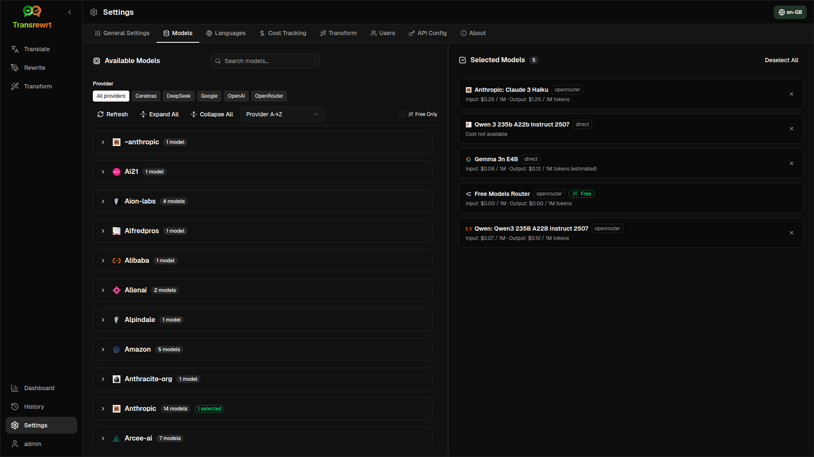

The page has two lists:

- **Available Models** on the left
- **Selected Models** on the right

Useful controls include:

- **Search models...** to find a model by name
- **Provider** chips to narrow the list to one engine (OpenRouter, OpenAI, Ollama, …)
- **Free Only** to show only free models
- **Refresh** to reload the list
- **Expand All** and **Collapse All** when you are sorting by provider

Model ids include the provider prefix (for example `openrouter/…` vs `openai/…`). Badges such as **OpenAI (OpenRouter)** vs **OpenAI (direct)** show how traffic is routed.

> ℹ️ **NOTE**<br/>
> **OpenRouter Body Builder** (`openrouter/bodybuilder`) is a router model, not a general chat model: its reply is JSON that describes OpenRouter API request bodies (for example a `requests` array with `model` and `messages`). If you use it for **Translate**, **Rewrite**, or **Transform**, the output panel will show that JSON instead of finished text. Choose a normal text model for those tasks. See the [Body Builder model page](https://openrouter.ai/openrouter/bodybuilder) on OpenRouter.

Actions:

 - To add a model, click **Add** or anywhere in the entry.

 - To remove a model, click **X** next to it in **Selected Models** or **Selected** on the entry in Available Models.

 - To clear the list, click **Deselect all**. The required free model will remain in the list.

<br/>

> ℹ️ **NOTE**<br/>
> If you do not want to add credits to OpenRouter straight away, start by enabling **Free Only** and choosing the free models (no credit card required). You can also use Ollama to run models locally without any API key.

<br/>

<a id="languages"></a>
### Languages

Use **Settings** > **Languages** to organise the language lists used in the app.

- **Top languages** are pinned near the top of the language lists in **Translate** and **Transform**.
- **Custom language** lets you add a language that is not in the built-in list.

If you add a custom language, it appears in the language selectors alongside the built-in options.

<br/>

<a id="cost-tracking"></a>
### Cost tracking

Use **Settings** > **Cost Tracking** to manage cost information.

- **Total Cost** shows the running total.
- **Copy Value** copies the total to the clipboard.
- **Reset Cost** resets the stored total to zero.
- **Sync with API key usage** sets the total to match the usage reported by your OpenRouter account (OpenRouter only).
- **API Key Usage** shows OpenRouter usage details, if available.
- **Delete cost data** removes all data, or only entries older than a selected date.


 **Cost tracking:** When you use OpenRouter models, the app shows your actual usage and spending based on cost information from OpenRouter. For all other providers, the app estimates costs using prices published by OpenRouter, if a price is unavailable, the estimate may be zero.

<br/>

> ℹ️ **NOTE**<br/>
>  **All cost figures are estimates for your reference only, not official billing statements.**


<br/>

> ⚠️ **WARNING**<br/>
> Data deletion cannot be undone. Before deleting, make sure to back up your data or export it via [**History**](#history) 
> or [**Dashboard** > **All Calls**](#dashboard-tabs), otherwise it will be lost permanently. 
> All input/output history related to each API call entry will also be deleted.


<br/>

<a id="transform-prompts"></a>
### Transform prompts

Use **Settings** > **Transform Prompts** to manage prompts in bulk.

You can:

- review your saved prompts
- delete prompts
- import prompts from a file
- export prompts for backup or sharing
- load sample prompts to the prompt list

<br/>

<a id="users"></a>
### Users

Use **Users** to manage user accounts in the web version. You can add users, update their details, reset passwords, and delete accounts.

<br/>

<a id="api-config"></a>
### API config

The supported providers are: OpenRouter, OpenAI, Anthropic, Google Gemini, DeepSeek, Groq, Mistral, xAI, Cerebras, and **Ollama** (local models via a base URL). You only need to configure the providers you use.

**Web application: administrator only**

API keys are configured through system or Docker environment variables - they are not entered in the web UI. This page shows which providers have a key configured and lets you test each one by clicking the **`Test`** button.

<br/>

> ℹ️ **NOTE**<br/>
> To change an API key, update the environment variable in your system or Docker configuration and restart the server or container.

> ℹ️ **NOTE**<br/>
> **Configuration backups** (see [**General settings** → Configuration Backup](#general-settings)) can embed **resolved** provider keys inside the ZIP’s `config.json`. Restoring that ZIP does **not** copy those keys back into the server’s persisted config file - live keys still come from the environment and existing file state as described there.

<br/>

**Desktop application**

Use **API Config** to store API keys for each provider you use. For Ollama, enter the **base URL** instead of an API key.


<br/>

> 💡 **Tip** <br/>
> If you do not want to use an API key or pay for usage, you can [download Ollama](https://ollama.com) and run models (such as `translategemma:4b`) locally on your machine for free. Alternatively, you can create a free OpenRouter account (no credit card required) to use their free models, or obtain a free API key from Cerebras, Google, Groq, or Mistral AI.

<br/>

- Add only the providers you need. In **Settings** > **Models**, each model id starts with the provider (for example `openrouter/openrouter/free`, `openai/gpt-4o`, `ollama/llama3`).

To add an API key, enter the value in the text field and click **`Save`**. To replace an existing key, click **`Edit`**. To verify that a key is working, click **`Test`**. For the Ollama base URL, always click **`Test`** to check the connection.

<br/>

> ℹ️ **NOTE**<br/>
> You cannot see the current value of an API key. You can only replace it using the **`Edit`** button.
> API keys are stored encrypted in the configuration.

<br/>

<a id="about"></a>
### About

The **About** tab shows:

- the app name
- the version number
- the build date
- a link to the project repository

<br/><br/>

<a id="common-issues"></a>
## Common issues

If something does not work as expected, check the following points first.

<br/>

<a id="the-app-will-not-translate-rewrite-or-transform-text"></a>
### The app will not translate, rewrite, or transform text

Check that:

- you have selected a model in the toolbar
- at least one model is listed in [**Settings** > **Models**](#models)
- your API setup is working

If you are using the desktop app:

1. Open [**Settings** > **API Config**](#api-config).
2. Check that at least one API key is saved.
3. Click **Test** next to the provider to confirm the key is working.

<br/>

<a id="the-model-list-is-empty"></a>
### The model list is empty

Open [**Settings** > **Models**](#models) and click **Refresh**.

If needed:

- search for a model
- turn on **Free Only**
- add one or more models to **Selected Models**

<br/>

<a id="the-result-is-too-slow-or-too-expensive"></a>
### The result is too slow or too expensive

Try one or more of these:

- choose a different model
- use a shorter input
- turn off **Real-time translation (while typing)** in [**Settings** > **General Settings**](#general-settings)
- use free models for simple tasks (see [Models](#models))

<br/>

<a id="the-interface-is-in-the-wrong-language"></a>
### The interface is in the wrong language

Click the globe icon in the [toolbar](#toolbar) and choose your preferred **Interface language**.

<br/>

<a id="the-text-is-too-small-or-hard-to-read"></a>
### The text is too small or hard to read

Open [**Settings** > **General Settings**](#general-settings) and change:

- **Font Family**
- **Size**

<br/>

<a id="dashboard-charts-are-empty"></a>
### Dashboard charts are empty

This is normal if:

- you only use **free models** and you are looking at **cost** figures (they may be zero); **usage** call-count charts on **Summary** still need data from the selected period
- the selected **time filter** does not cover the period when calls were made - try **All** to check

If charts are still empty after selecting **All**, confirm that calls appear in [**History**](#history) or in the **All Calls** tab.

<br/>

<a id="cost-shows-not-available-or-seems-wrong"></a>
### Cost shows "not available" or seems wrong

When you use models through **OpenRouter**, the app shows your actual spend reported by OpenRouter.

For **other providers** (OpenAI direct, Anthropic direct, etc.), cost is estimated from pricing data published by OpenRouter. If no matching price is found for a model, the cost will appear as **not available** and will not be added to your running total.

<br/>

<a id="total-cost-does-not-match-my-provider-bill"></a>
### Total cost does not match my provider bill

All cost figures in the app are **estimates for reference only**, not official billing statements.

To bring the total closer to your real OpenRouter spend, open [**Settings** > **Cost Tracking**](#cost-tracking) and click **Sync with API key usage**.

<br/>

<a id="the-history-page-is-missing-from-the-sidebar"></a>
### The History page is missing from the sidebar

**Keep execution history** may be turned off. Open [**Settings** > **General Settings**](#general-settings) and enable it. Note that turning it on does not restore previously deleted history data.

<br/>

<a id="web-app-session-expired"></a>
### Web app: redirected to the login page unexpectedly

Your session may have timed out. Log in again. If it happens frequently, check the server configuration for session lifetime settings.

<br/>

<a id="web-admin-forgot-or-lost-a-password"></a>
### Web admin: forgot or lost a password

This applies to the **self-hosted web app** (Docker), not the desktop (Electron) app.

- If another administrator can still sign in, they can open [**Settings** > **Users**](#users), choose the account, and set a **new password** there.
- If you are **locked out** but have **shell access** to the machine or container, reset the password with the helper that ships with the image (replace `transrewrt` if you change the default name, and quote the password if it contains spaces or special characters):

```bash
docker exec transrewrt reset-web-password '<username>' '<new-password>'
```

The default admin username is `admin` if you never created other accounts. When you pass only one argument, it is treated as the new password for `admin`.

If you run from a **source checkout** instead of Docker, use:

```bash
pnpm run reset-web-password -- <username> <new-password>
```

The script updates the user record in the SQLite database (and can create the `admin` user if it is missing). After resetting, sign in with the new password.


<br/>

<a id="dashboard-shows-no-data-for-other-users"></a>
### Dashboard shows no data for other users (web)

Only **administrators** can view data from all users via the **User** filter. Regular users see only their own activity by design.

<br/>

<a id="i-changed-a-prompt-and-lost-the-edits"></a>
### I changed a prompt and lost the edits

When editing a prompt, always click **Save** before clicking **Back to Run**.

<br/><br/>

<a id="quick-tips"></a>
## Quick tips

- Start with [**Translate**](#translate) to make sure your setup works before you move on to [**Rewrite**](#rewrite) or [**Transform**](#transform).
- Use [**Rewrite**](#rewrite) for everyday wording improvements.
- Use [**Transform**](#transform) when you need a repeatable workflow for a specific task.
- Use [**Dashboard**](#dashboard) if you want to keep an eye on usage and cost.
- Use [**History**](#history) to review past operations and their full input/output text.
- Export prompts regularly if you are building a prompt library you want to keep safe (see [Transform Prompts](#transform-prompts)) or if you wish to share it with others.

<br/><br/>

<a id="disclaimer"></a>
## Disclaimer

Product names and icons belong to their respective owners and are used for identification purposes only. This software is not affiliated with or endorsed by any of the mentioned brands.

<br/><br/>

<a id="license"></a>
## License

Copyright © 2026 Waldemar Scudeller Jr.

[Apache License 2.0](LICENSE)
