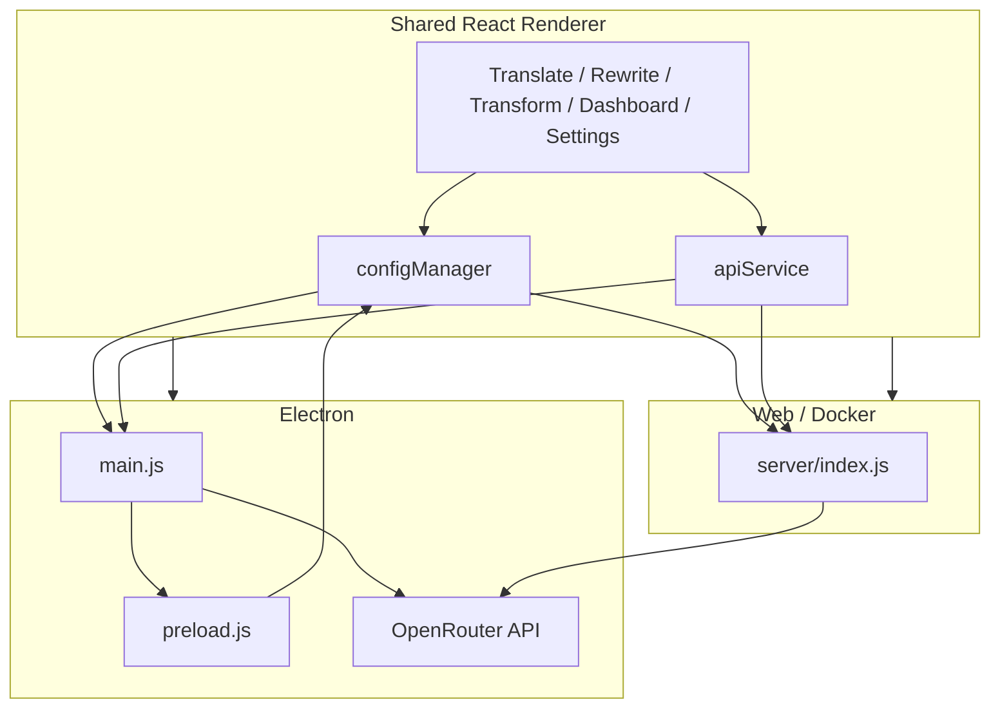

# Transrewrt — System Overview

Technical architecture, folder structure, tech stack, and design decisions for the Transrewrt application.

## Table of Contents

- [Product](#product)
- [Architecture](#architecture)
- [Tech Stack](#tech-stack)
- [Folder Structure](#folder-structure)
- [Design Decisions](#design-decisions)
- [Config and State](#config-and-state)
- [Native Modules](#native-modules)
- [Transrewrt Proxy (Firewall Bypass)](#transrewrt-proxy-firewall-bypass)

---

## Product

**Transrewrt** is an AI-powered text tool that provides **translation**, **rewrite** (style transformation), and **transform** (custom prompts) using OpenRouter. The same codebase runs as:

- **Desktop**: Electron app (Windows, Linux).
- **Web**: Self-hosted web app served from a Docker container (or local Express server).

Both modes share the same React renderer; only config storage and API access differ by runtime.

---

## Architecture

The application uses **runtime environment detection** to switch between Electron and Web/Docker. The renderer detects the presence of `window.electronAPI` (Electron) or uses the web API client (browser).



| Mode           | Config storage                  | API calls                                       | Settings UI     |
|----------------|---------------------------------|-------------------------------------------------|-----------------|
| **Electron**   | Local `config.json` via preload | Direct to OpenRouter (or Transrewrt proxy)      | Separate window |
| **Web/Docker** | Server file via REST API        | Proxied through server (API key on server only) | Inline modal    |

In web mode, the API key is never sent to the browser; the server adds it when proxying to OpenRouter.

---

## Tech Stack

| Layer          | Technology                                                                                                                                                                                             |
|----------------|--------------------------------------------------------------------------------------------------------------------------------------------------------------------------------------------------------|
| **Frontend**   | React 19, Fluent UI 9, Webpack 5, Babel. Build target `web` for both Electron and browser.                                                                                                             |
| **Desktop**    | Electron 40 (Node 24). Main process: [src/main/main.js](../src/main/main.js). Preload: [src/main/preload.js](../src/main/preload.js). Custom `app://` protocol for loading the renderer in production. |
| **Web server** | Express 5 ([server/index.js](../server/index.js)). Serves static `dist/`, config/state REST API, session auth (Argon2), OpenRouter proxy, SQLite (better-sqlite3) for app DB (api_calls, custom_prompts). |

---

## Folder Structure

```
├── src/
│   ├── main/              # Electron only
│   │   ├── main.js        # Main process, IPC, config path, appDb
│   │   ├── preload.js     # Exposes safe APIs to renderer
│   │   └── appDb.js       # SQLite app DB: api_calls, custom_prompts (Electron)
│   └── renderer/          # Shared React app
│       ├── components/    # UI (App, Sidebar, workspace panels, dialogs)
│       ├── contexts/      # AppContext
│       ├── hooks/         # useDebouncedProcess, useCostTracking, useProcessing, useTransformPrompts, etc.
│       ├── services/      # apiService (translate, rewrite, transform, models)
│       ├── utils/         # configManager, webApiClient, transrewrtProxyKey
│       ├── styles/        # main.css
│       └── index.js       # Entry; FluentProvider, AppProvider, App
├── server/
│   ├── index.js           # Express app (static, config, auth, proxy, app DB API)
│   └── logger.js          # File/console logging
├── config/
│   ├── config_default.json
│   └── custom-prompts.json   # Sample transform prompts (Load sample prompts)
├── scripts/               # electron-rebuild, node-rebuild, docker-deploy, etc.
├── build/                 # electron-builder (e.g. installer.nsh)
├── dist/                  # Webpack output (production build)
├── Dockerfile             # Multi-stage: build renderer + run server
└── docker-compose.yml
```

---

## Design Decisions

- **Runtime detection**: [configManager](../src/renderer/utils/configManager.js) and [apiService](../src/renderer/services/apiService.js) check for `window.electronAPI`. If present, they use IPC / direct OpenRouter; otherwise they use [webApiClient](../src/renderer/utils/webApiClient.js) for config and `/api/proxy` for API calls.
- **Single bundle**: One Webpack entry ([src/renderer/index.js](../src/renderer/index.js)), one production bundle for both Electron and web.
- **Electron**: Config read/write via preload IPC and local file; API key in client (or rolling key for Transrewrt proxy); settings in a separate window or modal.
- **Web/Docker**: Config and state via `GET/POST /api/config`; API key only on server; session cookie (Argon2-hashed password); settings in a modal; all AI requests go through server proxy.

---

## Config and State

- **Electron**: Config file path is resolved in the main process (user data dir, project root, or executable dir). Defaults are merged from [config/config_default.json](../config/config_default.json).
- **Web**: Config and state live on the server (e.g. `/app/data/config.json` and `/app/data/state.json` in Docker). The client reads/writes via REST; state keys (e.g. `last_used_model`, `source_language`) are split from config and persisted separately.

---

## Native Modules

The project uses native Node addons:

- **better-sqlite3**: App DB (Electron: [src/main/appDb.js](../src/main/appDb.js); server: SQLite in [server/index.js](../server/index.js)).
- **argon2**: Password hashing for web auth.

These must be compiled for the correct Node ABI:

- **Electron**: After `pnpm install`, the **postinstall** script runs `electron-rebuild` so addons match Electron's bundled Node (e.g. Electron 40 → Node 24).
- **Standalone server** (e.g. `pnpm dev:web`, `pnpm serve`): Use Node 24 in the terminal; [scripts/node-rebuild.js](../scripts/node-rebuild.js) is used for dev:web so addons match the system Node.

The project requires **Node 24** ([.nvmrc](../.nvmrc), [package.json](../package.json) `engines`) so that local tooling matches Electron 40's runtime.

---

## Transrewrt Proxy (Firewall Bypass)

In environments where **OpenRouter is blocked at the firewall**, the app can route API traffic through an optional **external Transrewrt proxy**. The client does not send the API key; instead it uses a **time-based rolling key** (HMAC-SHA256 TOTP, 30s window) derived from a shared **key seed**. The proxy validates the rolling key and forwards requests to OpenRouter.

- **Implementation**: [src/renderer/utils/transrewrtProxyKey.js](../src/renderer/utils/transrewrtProxyKey.js) — `getRollingKey(keySeed)` returns the first 16 characters of a base64url-encoded HMAC-SHA256 of the current 30s time window.
- **Config**: Set `use_transrewrt_proxy: true`, set `api_url` to the proxy base URL (e.g. `http://localhost:6500`), and set `key_seed` to the shared secret. The client sends the rolling key in the `Authorization` header (or as configured by the proxy).
- **Typical use**: Electron desktop when the network blocks OpenRouter; the proxy runs on a host that can reach OpenRouter. In Web/Docker mode the server already proxies OpenRouter, so the Transrewrt proxy is only needed when the server itself cannot reach OpenRouter (e.g. server behind same firewall).
