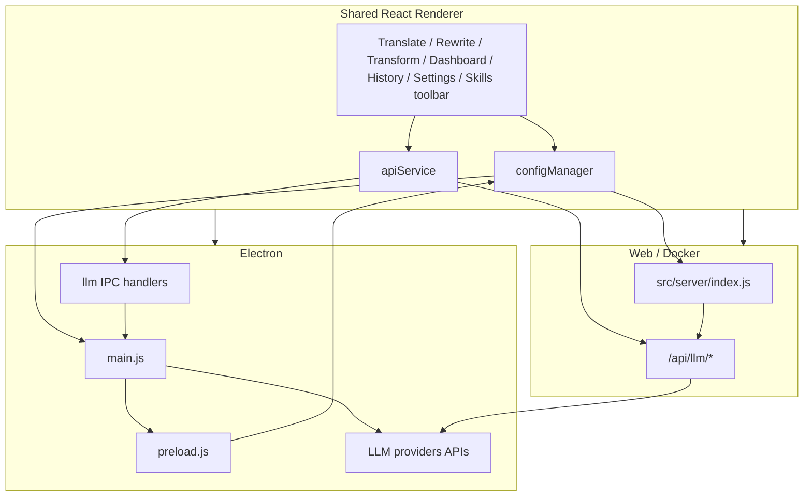

# Transrewrt - System Overview

Technical architecture, folder structure, tech stack, and design decisions for the Transrewrt application.

<!-- START doctoc generated TOC please keep comment here to allow auto update -->
<!-- DON'T EDIT THIS SECTION, INSTEAD RE-RUN doctoc TO UPDATE -->
**Table of Contents**

- [Product](#product)
- [Architecture](#architecture)
- [Tech Stack](#tech-stack)
- [Multi-llm-ts and provider support](#multi-llm-ts-and-provider-support)
- [Security and encryption](#security-and-encryption)
  - [Electron (desktop)](#electron-desktop)
  - [Web / Docker](#web--docker)
  - [Shared practices](#shared-practices)
- [Folder Structure](#folder-structure)
- [Design Decisions](#design-decisions)
- [Easy mode and skills catalog](#easy-mode-and-skills-catalog)
  - [AI experience (Easy vs Advanced)](#ai-experience-easy-vs-advanced)
  - [Skills catalog file and sync](#skills-catalog-file-and-sync)
  - [Development skills editor](#development-skills-editor)
- [Config and State](#config-and-state)
  - [Electron (desktop)](#electron-desktop-1)
  - [Web / Docker](#web--docker-1)
- [Settings UI](#settings-ui)
- [Native Modules](#native-modules)

<!-- END doctoc generated TOC please keep comment here to allow auto update -->


---

## Product

**Transrewrt** is an AI-powered text tool that provides **translation**, **rewrite** (style transformation), and **transform** (transform prompts) using **multiple LLM backends** (OpenRouter, native vendor APIs, Ollama, etc.). By default the app uses **Easy** mode: curated **skills** (Free, Fast, Advanced, Technical, Legal) mapped to models per **provider**, without picking raw model IDs. **Advanced** mode exposes the classic per-model toolbar and **Settings → Models** list. When **execution history** is enabled, past runs (input/output text and metadata) are stored in the app database and browsable from the **History** sidebar view. The same codebase runs as:

- **Desktop**: Electron app (Windows, Linux).
- **Web**: Self-hosted web app served from a Docker container (or local Express server).

Both modes share the same React renderer; **where settings and secrets live**, **how config is loaded**, and **where LLM requests run** differ by runtime.

---

## Architecture

The application uses **runtime environment detection** to switch between Electron and Web/Docker. The renderer detects the presence of `window.electronAPI` (Electron) or uses the web API client (browser).



| Mode | Config / preferences | LLM calls | Settings UI |
|------|----------------------|-----------|-------------|
| **Electron** | Single local `config.json` (path from main: user data / project / portable); provider secrets stay in main; renderer gets **sanitized** config over IPC | **IPC** `llm:stream` / `llm:abort` / `llm:models` - main process runs **multi-llm-ts** and reaches providers | Separate window or modal |
| **Web/Docker** | **Global** `config.json`: **server-only** keys (provider secrets, `web_session_timeout`). **Per user** (signed in): workspace + UI prefs in SQLite `user_preferences` merged on `GET/POST /api/config` | **SSE** `POST /api/llm/stream` (+ `GET /api/llm/models`, etc.); browser never receives provider keys | Inline modal |

In web mode, provider API keys are stored only in server config or environment; the client talks to `/api/llm/*` without embedding secrets.

---

## Tech Stack

| Layer | Technology |
|-------|------------|
| **Frontend** | React 19, Tailwind v4 + shadcn/Radix primitives, react-i18next (key-as-default, locales in `src/renderer/locales/`), Webpack 5, Babel, TypeScript. Build target `web` for both Electron and browser. **AppRoot** applies `dir` for RTL via `useDirection` (see `i18n.js`). |
| **Desktop** | Electron 41 (Node 24). Main: [src/main/main.js](../src/main/main.js). Preload: [src/main/preload.js](../src/main/preload.js). LLM IPC: [src/main/ipc/llmIpc.js](../src/main/ipc/llmIpc.js). Custom `app://` protocol for production renderer. |
| **Web server** | Express 5 ([src/server/index.js](../src/server/index.js)). Static `dist/`, session auth (cookie + SQLite `sessions`, Argon2 passwords), `/api/config`, `/api/llm/*` (streaming), `/api/calls/*`, users and custom prompts routes. SQLite (**better-sqlite3**): `users`, `user_preferences`, `sessions`, `api_calls`, `action_content`, `custom_prompts`, etc. (`transrewrt.db` under the data directory). |
| **LLM integration** | Shared [src/shared/llm/index.js](../src/shared/llm/index.js) wraps **multi-llm-ts** (`igniteModel`, `loadModels`, streaming helpers). See [Multi-llm-ts and provider support](#multi-llm-ts-and-provider-support). |

---

## Multi-llm-ts and provider support

The Node-side LLM stack uses the **[multi-llm-ts](https://www.npmjs.com/package/multi-llm-ts)** library for **chat completions** and **model listing**, with extra logic in [src/shared/llm/index.js](../src/shared/llm/index.js) for **namespaced ids**, **pricing cache**, and **OpenRouter** streaming (including generation-id / cost where applicable). The same module is required from **Electron main** ([llmIpc.js](../src/main/ipc/llmIpc.js)) and the **Express server** ([apiLlm.js](../src/server/routes/apiLlm.js)).

**Supported engines** (each maps to a config key and optional env var - see `CONFIG_KEY_BY_ENGINE` / `ENV_KEY_BY_ENGINE` in `shared/llm/index.js`):

| Engine | Role |
|--------|------|
| **openrouter** | Routed OpenRouter models (`openrouter/<innerId>`); catalog and pricing; can stream via direct HTTP where needed for usage/cost. |
| **openai**, **anthropic**, **google**, **deepseek**, **groq**, **mistralai**, **xai**, **cerebras** | Direct vendor APIs via multi-llm-ts; model ids look like `openai/gpt-4o`, `google/gemini-2.5-flash`, `cerebras/…`, etc. |
| **ollama** | Local server URL (`ollama_base_url` / `OLLAMA_URL`); not a secret key. |

**Model ids** must be **namespaced** (`engine/innerModelId`). Unknown engines are rejected at resolve time. **mergeKeys()** builds the credential map from **saved config plus `process.env`**, with **config winning** over env for the same logical key, so Docker/Electron can override env with UI-saved keys.

**Pricing / “free” UI**: OpenRouter’s public model list can populate a **pricing cache** (TTL in code) for cost estimates; direct engines use cached or list pricing when available - see `modelPricingUtils` and CHANGELOG entries on “Cost not available” / free models.

---

## Security and encryption

### Electron (desktop)

- **At-rest API keys**: Provider secret fields listed in `ENCRYPTED_CONFIG_KEYS` ([shared/llm/index.js](../src/shared/llm/index.js) - all configured engines except **Ollama**) are stored in `config.json` as **AES-256-CBC** ciphertext with a random **IV** per value, prefixed with `enc:`. Implementation: [src/main/encryption.js](../src/main/encryption.js) (`encryptApiKey` / `decryptApiKey`). A **32-byte** encryption key is stored in `transrewrt.key` (hex) beside `config.json` ([getKeyFilePath](../src/main/configPath.js)).
- **Renderer never sees raw secrets**: `config:get` ([configIpc.js](../src/main/ipc/configIpc.js)) **strips** those fields and exposes only `*_configured` flags plus `llm_configured`. The renderer must not receive secrets via `config:setAll` either - encrypted keys are **ignored** in the payload (`ENCRYPTED_CONFIG_KEYS` are skipped when merging).
- **Building LLM requests**: Main exposes `config:getSecretsForRequest`, which returns `mergeKeys(cache)` (plain secrets for the main process only) so streaming and tests run in **main**, not in the renderer.
- **Legacy helpers** in `encryption.js` for `key_seed` remain for decrypting old values if present; the **Transrewrt proxy** feature that used them has been **removed** from the product.

### Web / Docker

- **Passwords**: User passwords are hashed with **Argon2id** (see [reset-web-password.js](../scripts/reset-web-password.js) and server auth).
- **Sessions**: Cookie `transrewrt_session` with `HttpOnly` and `SameSite=Strict` ([auth.js](../src/server/routes/auth.js)); add `Secure` when serving over HTTPS. SQLite `sessions` table; periodic cleanup of stalled/expired rows.
- **Secrets**: Provider keys live in **server** `config.json` and/or **environment variables**; `GET /api/config` merges **server-global** keys only for **admins** ([webConfigKeys.js](../src/server/utils/webConfigKeys.js), [config route](../src/server/routes/config.js)). Non-admins cannot POST server-global keys.
- **Transport**: Use **HTTPS** and a secure cookie configuration in production so tokens and SSE are not exposed on the wire.

### Shared practices

- **Preload**: Only explicit, narrow IPC surfaces ([preload.js](../src/main/preload.js)); no `nodeIntegration` in renderer for secrets.
- **SQLite**: `PRAGMA foreign_keys = ON` where schema relies on referential integrity (e.g. `action_content` → `api_calls`); see CHANGELOG / `appSchema.js`.

---

## Folder Structure

All application source lives under `src/`: main (Electron), renderer (React), server (Express for web/Docker), and shared (DB schema + LLM helpers).

```text/plain
├── easy-mode-config/
│   └── skills.json        # Canonical Easy-mode skills catalog (version, model_ids, translations)
├── dev/
│   └── skills-editor/     # Dev-only catalog editor (not shipped in Electron/Docker)
├── src/
│   ├── main/              # Electron only
│   │   ├── main.js        # Main process, IPC, config path, appDb
│   │   ├── preload.js     # Exposes safe APIs to renderer
│   │   ├── ipc/           # llmIpc.js, skillsIpc.js (read / remote sync)
│   │   ├── configPath.js  # config.json, skills.json paths (user data dir)
│   │   └── appDb.js       # SQLite: api_calls, action_content, custom_prompts
│   ├── renderer/          # Shared React app
│   │   ├── components/    # App, SkillSelector, HistoryPage, SettingsPanel, …
│   │   ├── contexts/      # AppContext (mode, skills, easy provider)
│   │   ├── hooks/         # useProcessing, useCostTracking, useDirection, …
│   │   ├── services/      # apiService (translate / rewrite / transform / models)
│   │   ├── utils/         # configManager, webApiClient, skills/skillsManager, …
│   │   ├── locales/       # i18n JSON (strings.json, per-locale bundles)
│   │   ├── styles/        # main.css
│   │   └── index.tsx      # Entry; i18n, AppRoot (AppProvider), App
│   ├── server/
│   │   ├── index.js       # Express app; resolves default skills path (repo / Docker)
│   │   ├── logger.js
│   │   ├── db/appDb.js    # Web DB init, migrations, user_preferences helpers
│   │   ├── routes/        # config, auth, apiLlm, skills, calls, customPrompts, users, …
│   │   └── utils/         # configFile, webConfigKeys, …
│   ├── shared/
│   │   ├── db/appSchema.js
│   │   ├── llm/index.js   # multi-llm-ts bridge, keys, streaming (main + server)
│   │   └── skillsCatalog.js  # Remote URL, merge rules, 6 h sync throttle (main + server)
│   └── config-defaults/
│       ├── config_default.json   # default mode: "easy"
│       ├── transform-prompts.json
│       └── prompts.json
├── scripts/
├── build/
├── dist/
├── Dockerfile
└── docker-compose.yml
```

---

## Design Decisions

- **Runtime detection**: [configManager](../src/renderer/utils/config/configManager.js) uses preload IPC in Electron and [webApiClient](../src/renderer/utils/api/webApiClient.js) in the browser. [apiService](../src/renderer/services/apiService.js) uses `llm:stream` IPC on desktop and `fetch` + SSE to `/api/llm/stream` on web (not a generic `/api/proxy`).
- **Multi-provider LLM**: **multi-llm-ts** behind [shared/llm/index.js](../src/shared/llm/index.js); details in [Multi-llm-ts and provider support](#multi-llm-ts-and-provider-support). **Security** summary in [Security and encryption](#security-and-encryption).
- **Single bundle**: One Webpack entry ([src/renderer/index.js](../src/renderer/index.js)), one production bundle for Electron and web.
- **Electron security**: Sanitized `config:get`, `config:setAll` does not merge secrets from the renderer, `getSecretsForRequest` only for main-side LLM; see [Security and encryption](#security-and-encryption).
- **Web multi-user**: After migration, **workspace settings** (models, languages, `total_cost`, transform prompts linkage, session fields like `last_used_model`) live in `user_preferences` per `user_id`. **Global** `config.json` keeps **server-global** keys only (`webConfigKeys.js`). **Custom prompts** are scoped with `user_id` where applicable.
- **Authorization**: **Settings → Cost tracking** and **provider keys** in `/api/config` are **admin-only** on web. `GET /api/calls/*` applies **username** filters for non-admins server-side.
- **Execution history**: Optional `keep_execution_history`. Text in `action_content` linked to `api_calls`. History UI via Electron IPC or `GET /api/calls/history`. **Settings → General** vs cost/history deletion semantics: see USER-GUIDE. Optional environment `HISTORY_DISABLED` (`true` / `1`, case-insensitive) on the **Electron main process** or **Node server** forces history off and locks the History settings card; omit unless an administrator requires it.
- **Easy vs Advanced**: `mode` in config (`"easy"` default from [config_default.json](../src/config-defaults/config_default.json)); legacy installs without `mode` are normalized to `"easy"` on load. Advanced mode uses `available_models` and model-list error handling; Easy mode resolves `model_ids[provider]` from the skills catalog and does not auto-remove models on 404.

---

## Easy mode and skills catalog

### AI experience (Easy vs Advanced)

| Mode | Config `mode` | Toolbar | Settings |
|------|---------------|---------|----------|
| **Easy** (default) | `"easy"` or unset | **Skill** selector (Free, Fast, Advanced, Technical, Legal, …) | **General** → **Provider** (cloud engines or Ollama); **Models** tab hidden |
| **Advanced** | `"advanced"` | **Model** selector from `available_models` | **Models** tab for selected models list |

In **Easy** mode, each skill row in `skills.json` can define `model_ids` for cloud providers (OpenRouter, OpenAI, Anthropic, Google, DeepSeek, Groq, Mistral, xAI, Cerebras). The app **omits** skills that have no non-empty `model_ids` entry for the current provider. **Ollama** does not use skills: the toolbar lists installed local models (`easy_ollama_model` in user config). Optional per-skill `prompt_hint` is appended to translate/rewrite/transform system prompts. Display names use `translated_name` / `translated_description` for `ui_locale`, then `source_locale`, then `name` / `description`.

Transform prompt editor actions (translate / improve / generate fields) use the same skill selector in Easy mode and the model list in Advanced mode.

Web **Provider** options use `configuredEngines` from `GET /api/status` (server env keys), not Electron-only `*_configured` flags.

### Skills catalog file and sync

| Artifact | Role |
|----------|------|
| [easy-mode-config/skills.json](../easy-mode-config/skills.json) | **Canonical** catalog in the repo (`version`, `updated_at`, `skills[]`, editor-only `translation_model` / `suggestion_model`, …) |
| User / data `skills.json` | **Runtime** copy beside `config.json` (Electron) or `data/skills.json` (web/Docker) |
| Packaged Electron | `config/skills.json` copied from `easy-mode-config/skills.json` at build ([package.json](../package.json) `extraFiles`) |
| Remote | [shared/skillsCatalog.js](../src/shared/skillsCatalog.js) `SKILLS_REMOTE_URL` → `main` branch `easy-mode-config/skills.json` on GitHub |

**Merge rules** (shared module): do not overwrite local file when local `updated_at` is newer than remote; otherwise prefer newer `updated_at`, then higher semver `version`. A sidecar `.skills-remote-sync.json` stores `last_checked_at` for the **6 hour** throttle.

**Sync behaviour**:

- **Electron**: Remote fetch only while `mode` is Easy (unless forced). Throttled to once per 6 h; **Settings → General** shows catalog `version` / `updated_at` and a **Refresh** button (`skills:sync` IPC).
- **Web server**: Bootstraps missing `data/skills.json`, then syncs on startup and every 6 h for **all** users (shared file). Authenticated Easy users can call `POST /api/skills/sync` (skipped when `user_preferences.mode` is Advanced).
- **Docker**: Image includes `easy-mode-config/`; server default path resolves under `/app/easy-mode-config` when `data/skills.json` is absent.

Renderer loads the catalog via `window.electronAPI.readSkills()` or `GET /api/skills` ([skillsManager.ts](../src/renderer/utils/skills/skillsManager.ts), [skills.js](../src/server/routes/skills.js), [skillsIpc.js](../src/main/ipc/skillsIpc.js)).

### Development skills editor

Not shipped in production builds. Maintainers edit the canonical catalog with **`pnpm run dev:skills-editor`** ([dev/skills-editor/README.md](skills-editor/README.md)): saves `easy-mode-config/skills.json`, mirrors to `data/skills.json` for local web dev, per-provider `model_ids`, translation/suggestion model pickers, **Test**, **Translate missing**, and **AI Suggestion** flows. See [DEVELOPMENT.md](DEVELOPMENT.md#skills-catalog-editor-development).

---

## Config and State

### Electron (desktop)

- **Storage**: One merged `config.json`; provider secrets are **encrypted at rest** when written ([encryption.js](../src/main/encryption.js)). Defaults from [config_default.json](../src/config-defaults/config_default.json) (`mode: "easy"`, `source_locale`, …).
- **Skills**: `skills.json` in the config directory ([getSkillsFilePath](../src/main/configPath.js)); first launch copies or downloads catalog; remote updates when in Easy mode (see [Easy mode and skills catalog](#easy-mode-and-skills-catalog)).
- **State keys** (e.g. `last_used_model`, `easy_provider`, `easy_ollama_model`, `source_language`) live in the same file as other settings from the app’s perspective; the main process may split persistence as implemented in IPC.

### Web / Docker

- **Global file** (`data/config.json`, e.g. `/app/data/config.json` in Docker): **Server-only** keys - provider secret fields (see [webConfigKeys.js](../src/server/utils/webConfigKeys.js)), `web_session_timeout`, etc. **Not** used for per-user workspace after migration.
- **Shared skills file** (`data/skills.json`): Easy-mode catalog for all web users; server sync from GitHub (see [Skills catalog file and sync](#skills-catalog-file-and-sync)). Per-user `mode`, `easy_provider`, and `easy_ollama_model` live in `user_preferences`.
- **SQLite** (`transrewrt.db` next to the config file): `user_preferences` JSON per user (merged into `GET /api/config` and updated via `POST /api/config` for non-global keys), `users`, `sessions`, `api_calls`, `action_content`, `custom_prompts`, etc.
- **Legacy `state.json`**: Still managed by [configFile.js](../src/server/utils/configFile.js) for load/save helpers; after the **user_prefs_migrated_from_global** migration it is reset toward defaults while live prefs are in `user_preferences`.
- **UI language**: `ui_locale` is part of merged settings; [i18n.js](../src/renderer/i18n.js) and `locales/`. Login may use `localStorage` for locale before session exists.

---

## Settings UI

Implemented in [SettingsPanel.tsx](../src/renderer/components/SettingsPanel.tsx) as horizontal tabs: **General** (behaviour, appearance, **AI experience** Easy/Advanced, **Provider** and skills catalog refresh in Easy mode, execution history), **Models** (only when `mode` is **Advanced**), **Languages**, **Cost tracking** (web: **admin-only**), **Transform prompts**, **Users** (web: admin), **API** (provider keys / tests; **admin-only** on web, per-provider layout on Electron), **About**. Tab visibility uses `canAccessApiTab`, `canAccessCostTab`, `canAccessUsersTab`, and experience mode (Models hidden in Easy). The **header** language selector ([HeaderLanguageSelector](../src/renderer/components/HeaderLanguageSelector.js)) is outside the panel but persists `ui_locale`. End-user behaviour is described in [USER-GUIDE.md](../USER-GUIDE.md).

---

## Native Modules

Native Node addons:

- **better-sqlite3**: Electron [appDb.js](../src/main/appDb.js); web [server/db/appDb.js](../src/server/db/appDb.js) + server routes.
- **argon2**: Web user password hashing.

**ABI alignment**:

- **Electron**: `pnpm install` runs `electron-rebuild` (see [scripts/electron-rebuild.js](../scripts/electron-rebuild.js)) so addons match Electron’s Node (Electron 41 / Node 24).
- **Standalone server** (`pnpm dev:web`, `pnpm serve`): Use **Node 24; [scripts/node-rebuild.js](../scripts/node-rebuild.js) rebuilds for system Node when starting web dev.

[.nvmrc](../.nvmrc) and [package.json](../package.json) `engines` require Node 24 to match Electron tooling.
