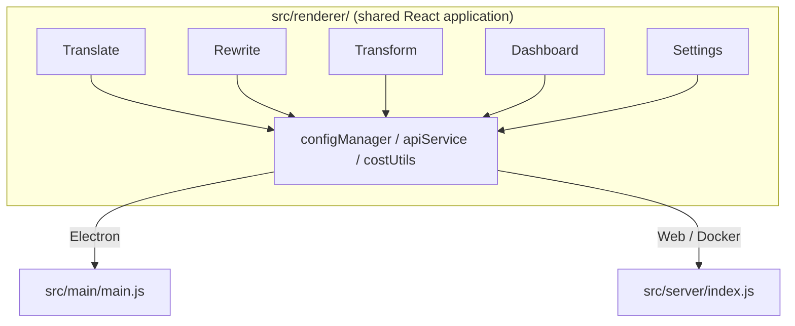

<p align="center">
  
</p>

<h1 align="center">Transrewrt</h1>

<p align="center">
  <a href="https://github.com/wsj-br/transrewrt/releases"></a>
  <a href="LICENSE"></a>
  
  
  
</p>

أداة نصية مدعومة بالذكاء الاصطناعي: ترجمة بين اللغات، إعادة الصياغة بأسلوب مختلف، والتحويل باستخدام أوامر مخصصة - كل ذلك عبر [OpenRouter](https://openrouter.ai). تعمل كتطبيق سطح مكتب (Electron) أو تطبيق ويب مستضاف ذاتيًا (Docker).

- **ترجمة** - بين عشرات اللغات، مع الكشف التلقائي عن المصدر
- **إعادة الصياغة** - تصحيح القواعد، تحسين الوضوح، رسمي/غير رسمي، اختصار، توسيع، تقني
- **تحويل** - أوامر ذكاء اصطناعي مخصصة؛ إنشاء وإدارة الأوامر، لغة هدف اختيارية لكل أمر
- **النماذج والتكلفة** - اختيار أي نموذج OpenRouter؛ لوحة تحكم التكلفة مع سجل SQLite، ملخصات حسب النموذج/العملية/اليوم
- **واجهة المستخدم** - i18n (pt-BR, de, fr, es, RTL)، سمات، خطوط، اختصارات لوحة المفاتيح؛ وضع الويب الآمن (مفتاح API على الخادم فقط)
- **سطح المكتب** - تطبيق Electron لنظامي Windows و Linux
- **مستضاف ذاتيًا** - صورة Docker لـ amd64 و arm64 (جاهزة لـ Raspberry Pi)

بعد التثبيت، راجع **[دليل المستخدم](../USER-GUIDE.md)** للحصول على جولة كاملة لجميع الميزات.

<small>**اقرأ بلغات أخرى:** [الإنجليزية (المملكة المتحدة)](../README.md) · [البرتغالية (البرازيل)](README.pt-BR.md) · [العربية](README.ar.md) · [البنغالية](README.bn.md) · [الكاتالانية](README.ca.md) · [الصينية المبسطة](README.zh-CN.md) · [الصينية التقليدية](README.zh-TW.md) · [الكرواتية](README.hr.md) · [التشيكية](README.cs.md) · [الهولندية](README.nl.md) · [الإنجليزية (الولايات المتحدة)](README.en-US.md) · [الفلبينية](README.tl.md) · [الفرنسية](README.fr.md) · [الألمانية](README.de.md) · [اليونانية](README.el.md) · [الهندية](README.hi.md) · [المجرية](README.hu.md) · [الإيطالية](README.it.md) · [اليابانية](README.ja.md) · [الجاوية](README.jv.md) · [الكورية](README.ko.md) · [الماليزية](README.ms.md) · [الفارسية](README.fa.md) · [البولندية](README.pl.md) · [البرتغالية (البرتغال)](README.pt.md) · [البنجابية](README.pa.md) · [الرومانية](README.ro.md) · [الروسية](README.ru.md) · [السلوفاكية](README.sk.md) · [الإسبانية](README.es.md) · [السواحيلية](README.sw.md) · [السويدية](README.sv.md) · [التيلوغوية](README.te.md) · [التايلاندية](README.th.md) · [التركية](README.tr.md) · [الأوكرانية](README.uk.md) · [الفيتنامية](README.vi.md)</small>

<a id="screenshots"></a>
## لقطات الشاشة

**محدد اللغة**


**ترجمة**


**تحويل - محرر الأوامر**


**لوحة التحكم**


**الإعدادات - اختيار النموذج**


<br /><br />

<a id="table-of-contents"></a>
## جدول المحتويات

<!-- START doctoc generated TOC please keep comment here to allow auto update -->
<!-- DON'T EDIT THIS SECTION, INSTEAD RE-RUN doctoc TO UPDATE -->

- [البداية السريعة](#quick-start)
- [التثبيت](#installation)
  - [Windows (Electron)](#windows-electron)
  - [Linux (Electron)](#linux-electron)
  - [Docker](#docker)
- [الحصول على مفتاح OpenRouter API](#getting-an-openrouter-api-key)
- [التكوين والبيئة](#configuration-and-environment)
- [التطوير والهندسة المعمارية](#development-and-architecture)
- [الإصدارات والعلامات](#releases-and-tags)
- [المساهمة](#contributing)
- [إخلاء المسؤولية](#disclaimer)
- [الترخيص](#license)

<!-- END doctoc generated TOC please keep comment here to allow auto update -->

<br /><br />

<a id="quick-start"></a>

## البدء السريع

**Docker (موصى به للاستضافة الذاتية)**

```bash
docker pull ghcr.io/wsj-br/transrewrt:latest

API_KEY=sk-or-your-key docker run -d \
  -p 5000:5000 \
  -v transrewrt-data:/app/data \
  -e API_KEY \
  --name transrewrt-web \
  ghcr.io/wsj-br/transrewrt:latest
```

استبدل `sk-or-your-key` بـ [مفتاح OpenRouter API](https://openrouter.ai/keys). افتح [http://localhost:5000](http://localhost:5000) وغير كلمة مرور المسؤول الافتراضية قبل تعريض الخدمة.

<br />

> ℹ️ **ملاحظة**<br/>
> في Docker، يتم تعيين مفتاح OpenRouter API فقط عبر متغير البيئة `API_KEY` (وليس في واجهة الويب). على سطح المكتب (Electron) الصقه في **الإعدادات → API**.

<br />

**Windows**

نزل الإصدار `Transrewrt Setup x.y.z.exe` الأحدث من [الإصدارات](https://github.com/wsj-br/transrewrt/releases)، شغل المثبت، ثم ابدأ من قائمة البدء أو اختصار سطح المكتب. أدخل مفتاح OpenRouter API في **الإعدادات → API**.

<br />

**Linux**

نزل ملف `.AppImage` من [الإصدارات](https://github.com/wsj-br/transrewrt/releases)، ثم:

```bash
chmod +x Transrewrt-x.y.z.AppImage && ./Transrewrt-x.y.z.AppImage
```

أدخل مفتاح OpenRouter API في **الإعدادات → API**. على ديبيان/أوبونتو قد تحتاج إلى تثبيت تبعيات إضافية أولاً:

```bash
sudo apt install libgtk-3-0 libnotify-dev libnss3 libxss1 libasound2 libxtst6 xauth
```

انظر [التثبيت → Linux](#linux-electron) للتفاصيل.

<br />

> ℹ️ **ملاحظة**<br/>
> macOS غير مدعوم حاليًا. Transrewrt متاح لنظام Windows وLinux وDocker.

<br />

بمجرد تشغيل التطبيق، انظر إلى **[دليل المستخدم](../USER-GUIDE.md)** لمعرفة كيفية ترجمة وإعادة كتابة وتحويل النصوص، وإدارة المطالبات، وتكوين النماذج.

<br /><br />

<a id="installation"></a>
## التثبيت

<a id="windows-electron"></a>
### Windows (Electron)

- نزل المثبت الأحدث من [الإصدارات](https://github.com/wsj-br/transrewrt/releases).
- شغل ملف `.exe` واتبع خطوات المثبت.
- التشغيل الأول: ابدأ التطبيق من قائمة البدء أو اختصار سطح المكتب. يتم تخزين التهيئة في `%APPDATA%\transrewrt\`.

<br />

<a id="linux-electron"></a>
### Linux (Electron)

- نزل ملف `.AppImage` من [الإصدارات](https://github.com/wsj-br/transrewrt/releases).
- شغل: `chmod +x Transrewrt-x.y.z.AppImage && ./Transrewrt-x.y.z.AppImage`
- تبعيات إضافية (ديبيان/أوبونتو): `sudo apt install libgtk-3-0 libnotify-dev libnss3 libxss1 libasound2 libxtst6 xauth`
- انظر [dev/DEVELOPMENT.md](../dev/DEVELOPMENT.md) للمزيد.

<br />

<a id="docker"></a>
### Docker

- اسحب: `docker pull ghcr.io/wsj-br/transrewrt:latest`
- يجب تعيين مفتاح OpenRouter API **يجب** تعيينه عبر متغير البيئة `API_KEY`. مرره باستخدام `-e API_KEY` (أو عبر `docker compose` / `.env`) حتى لا يكون المفتاح مرئيًا في قائمة العمليات.
- لا يمكن إدخال مفتاح API في واجهة الويب.

مثال - حجم مسمى للاستمرارية (مفتاح API مُمر عبر متغير البيئة، وليس في سطر الأوامر):

```bash
API_KEY=sk-or-your-key docker run -d \
  -p 5000:5000 \
  -v transrewrt-data:/app/data \
  -e API_KEY \
  --name transrewrt-web \
  ghcr.io/wsj-br/transrewrt:latest
```

<br />

| الخيار   | الوصف                                                                                                   |
| -------- | ------------------------------------------------------------------------------------------------------- |
| المنفذ   | `5000` (تعيين باستخدام `-p 5000:5000`)                                                                 |
| الحجم    | قم بتحميل `/app/data` للاستمرارية في التهيئة وقاعدة البيانات                                          |
| متغيرات البيئة | `PORT`، `CONFIG_PATH`، `API_KEY`، `API_URL`، `KEY_SEED` - انظر [الإعدادات](#configuration-and-environment) |

 للبناء والتشغيل من المصادر: `docker compose up --build -d` أو `pnpm run docker:up` - انظر [dev/DEVELOPMENT.md](../dev/DEVELOPMENT.md).

<br /><br />

<a id="getting-an-openrouter-api-key"></a>
## الحصول على مفتاح OpenRouter API

يستخدم Transrewrt [OpenRouter](https://openrouter.ai) لنماذج الذكاء الاصطناعي. تحتاج إلى مفتاح API لترجمة النصوص أو إعادة كتابتها أو تحويلها.

1. سجل أو قم بتسجيل الدخول في [openrouter.ai](https://openrouter.ai).
2. افتح صفحة [المفاتيح](https://openrouter.ai/keys) وأنشئ مفتاحًا جديدًا (قم بتسميته، واختياريًا اضبط حد ائتمان). يمكنك استخدام النماذج المجانية دون إضافة رصيد.
3. **سطح المكتب (Electron):** الصق المفتاح في **الإعدادات → API**. **Docker:** اضبط متغير البيئة `API_KEY` (انظر [البدء السريع](#quick-start)).

للحدود، BYOK، والمزيد، انظر [مصادقة OpenRouter](https://openrouter.ai/docs/api/reference/authentication).

<br /><br />

## التهيئة والبيئة

**مواقع ملفات التكوين**

| طريقة النشر | موقع ملف التكوين |
| ----------- | ---------------- |
| Electron (Windows) | `%APPDATA%\transrewrt\` |
| Electron (Linux) | `~/.config/transrewrt/` |
| Web / Docker | `/app/data/config.json` (استخدم وحدة تخزين للحفظ) |

<br />

**المتغيرات البيئية** (للويب/دوكر فقط؛ الإلكترون يستخدم ملف التكوين المحلي)

| المتغير      | الافتراضي                        | الوصف                                                   |
| ------------- | -------------------------------- | -------------------------------------------------------- |
| `PORT`        | `5000`                           | منفذ استماع الخادم                                      |
| `CONFIG_PATH` | `/app/data/config.json`          | مسار ملف التكوين                                        |
| `API_KEY`     | `*(empty)*`                      | مفتاح OpenRouter API (مطلوب لدوكر؛ اضبط عبر متغير البيئة، ليس عبر واجهة المستخدم) |
| `API_URL`     | `https://openrouter.ai/api/v1`   | عنوان URL الأساسي لـ API الذكاء الاصطناعي              |
| `KEY_SEED`    | `*(empty)*`                      | بذرة مفتاح Transrewrt بروكسي (تتجاوز التكوين إذا تم تعيينها) |

<br />

**البيانات والاستمرارية:** لدوكر، قم بتثبيت وحدة تخزين في `/app/data` بحيث يظل `config.json` وقاعدة بيانات SQLite مستمرة عبر إعادة تشغيل الحاوية. بدون وحدة تخزين، تفقد جميع البيانات عند توقف الحاوية.

<br />

**مصادقة الويب:**

- المسؤول الافتراضي: `admin` / `transrewrt26`.
- إدارة المستخدمين في **الإعدادات → المستخدمون**.
- إعادة تعيين كلمة المرور: `docker exec <container> reset-web-password '<username>' '<new-password>'`
  (من المصدر: `pnpm run reset-web-password -- <username> <new-password>`)

<br />

> ⚠️ **تحذير**<br/>
> قم بتغيير كلمة مرور المسؤول الافتراضي فورًا على أي مضيف يمكن الوصول إليه عبر الشبكة.

<br />

**بروكسي Transrewrt (اختياري):** يمكنك توجيه حركة API من خلال بروكسي خارجي يستخدم مفتاحًا دوارًا قائمًا على الوقت. في **الإعدادات → API**، قم بتمكين **استخدام بروكسي Transrewrt**، وعيّن **بذرة المفتاح**، وعيّن **عنوان URL لـ API** إلى عنوان URL الأساسي للبروكسي. راجع [dev/SYSTEM-OVERVIEW.md](../dev/SYSTEM-OVERVIEW.md) للتفاصيل.

الإعدادات الرئيسية (السمة، الخط، النماذج، اللغات، إلخ) متاحة في حوار الإعدادات أو يمكن تحريرها مباشرة في ملف التكوين JSON. القائمة الكاملة والإعدادات الافتراضية موثقة في [dev/DEVELOPMENT.md](../dev/DEVELOPMENT.md).

<br /><br />

<a id="development-and-architecture"></a>
## التطوير والهيكلية

- **التطوير:** الإعداد، البناء، الاختبار، والنشر (إلكترون، ويب، دوكر) - راجع **[dev/DEVELOPMENT.md](../dev/DEVELOPMENT.md)**.
- **الهيكلية ونظرة عامة على النظام:** هيكلة المجلدات، مكدس التكنولوجيا، قرارات التصميم، بروكسي Transrewrt - راجع **[dev/SYSTEM-OVERVIEW.md](../dev/SYSTEM-OVERVIEW.md)**.



<br /><br />

<a id="releases-and-tags"></a>
## الإصدارات والعلامات

- **علامات Git** `v`* (مثل `v1.0.10`) تشغل [سير عمل الإصدار](.github/workflows/release.yml). **إصدارات GitHub** مرفق معها مثبت Windows (`.exe`) و Linux AppImage.
- **صور Docker** منشورة في `ghcr.io/wsj-br/transrewrt`. علامات الصور تطابق إصدار Git (مثل `v1.0.10` → `ghcr.io/wsj-br/transrewrt:1.0.10`) بالإضافة إلى `latest`. متعددة البنى: `linux/amd64` و `linux/arm64` (مثل Raspberry Pi).

<br /><br />

<a id="contributing"></a>
## المساهمة

1. قم بتفرع المستودع.
2. إنشاء فرع للميزة: `git checkout -b feature/my-feature`
3. الالتزام بتغييراتك برسالة واضحة.
4. ادفع وافتح طلب سحب ضد `main`.

يرجى اتباع نمط التعليمات البرمجية الحالي واختبار تغييراتك في وضعي الإلكترون والويب قبل التقديم. راجع [dev/DEVELOPMENT.md](../dev/DEVELOPMENT.md) لتعليمات البناء والاختبار.

<br />

**الإبلاغ عن المشاكل:** افتح مشكلة على [GitHub](https://github.com/wsj-br/transrewrt/issues). قم بذكر منصتك (ويندوز / لينكس / دوكر) وإصدار التطبيق (معروض في حوار حول أو في صفحة الإصدارات).

<br /><br />

<a id="disclaimer"></a>

## إخلاء المسؤولية

أسماء المنتجات والأيقونات مملوكة لأصحابها المعنيين وتُستخدم لأغراض التحديد فقط. هذا البرنامج غير تابع أو معتمد من أي من العلامات التجارية المذكورة.

<br /><br />

<a id="license"></a>
## الترخيص

Copyright © 2026 Waldemar Scudeller Jr.

[Apache License 2.0](LICENSE)