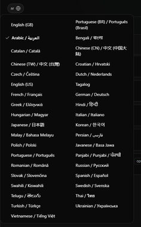
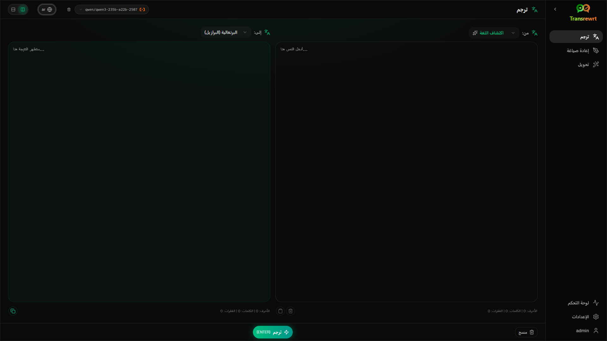
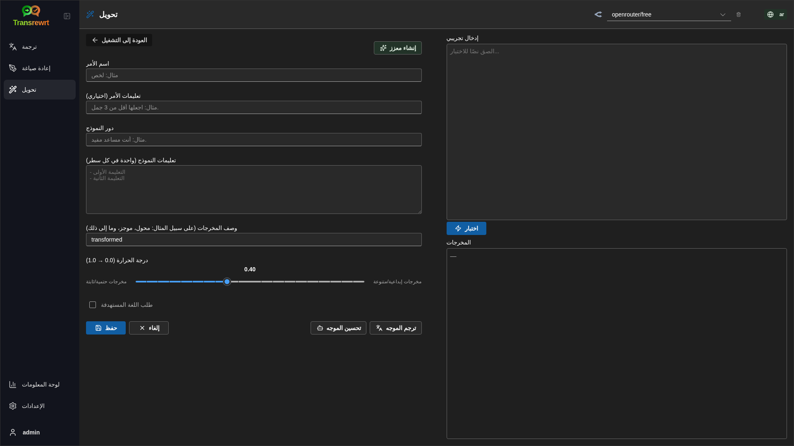
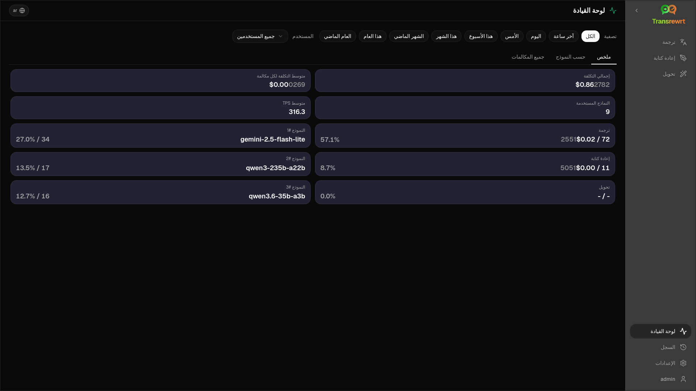
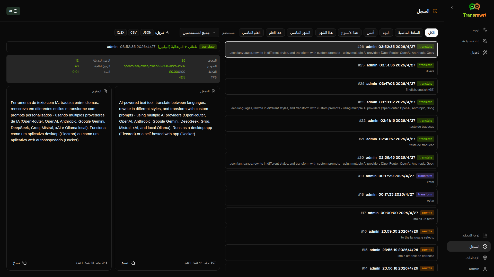
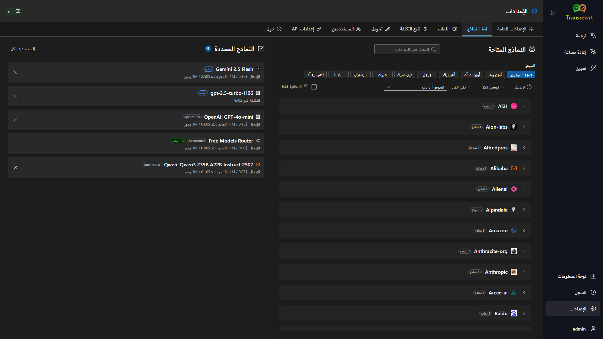

<p align="center">
  
</p>

<p align="center">
  <a href="https://github.com/wsj-br/transrewrt/releases"></a>
  <a href="LICENSE"></a>
  
  
  
</p>

أداة نصية مدعومة بالذكاء الاصطناعي: ترجمة بين اللغات، وإعادة صياغة بأساليب مختلفة، وتحويل باستخدام أوامر مخصصة — باستخدام موفري ذكاء اصطناعي متعددين (أوبن روتر، أوبن إي آي، أنثروبيك، جوجل جيميني، ديب سيك، غروك، ميسترال، إكس إيه آي، وأولاما محلي). تعمل كتطبيق سطح مكتب (إلكترون) أو تطبيق ويب قابل الاستضافة ذاتيًا (داكر).

- **ترجم** - بين عشرات اللغات، مع اكتشاف تلقائي للمصدر
- **إعادة صياغة** - إصلاح القواعد، تحسين الوضوح، نسق رسمي/غير رسمي، تقصير، توسيع، محتوى تقني
- **تحويل** - موجهات ذكاء اصطناعي مخصصة؛ إنشاء وإدارة الموجهات، مع إمكانية تحديد لغة الهدف لكل موجه
- **السجل** - سجل تنفيذ كامل يحتوي على النص المدخل/النص الناتج، مع إمكانية التصفية والتصدير
- **سهل & متقدم** - الوضع السهل (الافتراضي): مهارات مختارة حسب المزود (**مجاني (OpenRouter)**، **Lite**، **متقدم**، **تقني**؛ تظهر فقط المهارات التي لها تعيين للمزود المحدد) دون الحاجة لاختيار معرفات النماذج؛ الوضع المتقدم: قائمة كاملة بالنماذج من مزوديك المُعدّين
- **النماذج والتكلفة** - لوحات تحليل التكلفة والاستخدام (ملخص، حسب النموذج، جميع الطلبات) مع إمكانية التصدير؛ يعرض OpenRouter الإنفاق الفعلي، بينما يستخدم المزودون الآخرون تقديرات
- **واجهة المستخدم** - واجهة متعددة اللغات (أكثر من 30 لغة، مع دعم الكتابة من اليمين لليسار)، خطوط، ...
- **الوضع الويب** - دعم تعدد المستخدمين مع أدوار المسؤول
- **سطح المكتب** - تطبيق Electron لنظامي Windows وLinux
- **استضافة ذاتية** - صورة Docker متوفرة لـ amd64 وarm64 (جاهزة للاستخدام على Raspberry Pi)

بمجرد التثبيت، راجع [**دليل المستخدم**](USER-GUIDE.ar.md) للحصول على شرح كامل لجميع الميزات.

<small>**اقرأ باللغات الأخرى:** </small>
<small id="lang-list">[English (GB)](../README.md) · [Português (Brasil)](./README.pt-BR.md) · [العربية](./README.ar.md) · [বাংলা](./README.bn.md) · [Català](./README.ca.md) · [中文 (中国大陆)](./README.zh-CN.md) · [中文 (台灣)](./README.zh-TW.md) · [Hrvatski](./README.hr.md) · [Čeština](./README.cs.md) · [Nederlands](./README.nl.md) · [English (US)](./README.en-US.md) · [Tagalog](./README.tl.md) · [Français](./README.fr.md) · [Deutsch](./README.de.md) · [Ελληνικά](./README.el.md) · [हिन्दी](./README.hi.md) · [Magyar](./README.hu.md) · [Italiano](./README.it.md) · [日本語](./README.ja.md) · [한국어](./README.ko.md) · [Bahasa Melayu](./README.ms.md) · [فارسی](./README.fa.md) · [Polski](./README.pl.md) · [Basa Jawa](./README.jv.md) · [Português](./README.pt.md) · [ਪੰਜਾਬੀ](./README.pa.md) · [Română](./README.ro.md) · [Русский](./README.ru.md) · [Slovenčina](./README.sk.md) · [Español](./README.es.md) · [Kiswahili](./README.sw.md) · [Svenska](./README.sv.md) · [తెలుగు](./README.te.md) · [ไทย](./README.th.md) · [Türkçe](./README.tr.md) · [Українська](./README.uk.md) · [Tiếng Việt](./README.vi.md)</small>

<small>

> **ملاحظة حول ترجمات واجهة المستخدم والتوثيق:** جميع لغات الواجهة باستثناء الإنجليزية (المملكة المتحدة) الأصلية
> تم ترجمتها باستخدام نماذج الذكاء الاصطناعي؛ قد تكون الصياغة غير دقيقة أو تحتوي على أخطاء.

</small>

<br/>

<a id="table-of-contents"></a>
## جدول المحتويات

<!-- START doctoc generated TOC please keep comment here to allow auto update -->
<!-- DON'T EDIT THIS SECTION, INSTEAD RE-RUN doctoc TO UPDATE -->

- [لقطات الشاشة](#screenshots)
- [البدء السريع](#quick-start)
- [الحصول على مفتاح واجهة برمجة تطبيقات OpenRouter](#getting-an-openrouter-api-key)
- [التكوين والبيئة](#configuration-and-environment)
- [التطوير والهندسة المعمارية](#development-and-architecture)
- [إبلاغ عن مشكلات](#reporting-issues)
- [إخلاء المسؤولية](#disclaimer)
- [الرخصة](#license)

<!-- END doctoc generated TOC please keep comment here to allow auto update -->

<br/><br/>

<a id="screenshots"></a>
## لقطات الشاشة

**محدد اللغة**



**ترجمة**



**تحويل - محرر الأوامر**



**لوحة المعلومات**



**السجل**



**الإعدادات - اختيار النموذج**



<br/><br/>

<a id="quick-start"></a>
## البدء السريع

<details>
<summary><b>Docker (مُوصى به للاستضافة الذاتية)</b></summary>

<a id="docker"></a>

<br/>

```bash
docker pull ghcr.io/wsj-br/transrewrt:latest

OPENROUTER_API_KEY=sk-or-your-key docker run -d \
  -p 5000:5000 \
  -v transrewrt-data:/app/data \
  -e OPENROUTER_API_KEY \
  --name transrewrt-web \
  ghcr.io/wsj-br/transrewrt:latest
```

استبدل `sk-or-your-key` بمفتاح [API الخاص بأوبن روتر](https://openrouter.ai/keys) (أو عيّن مفاتيح موفر آخر؛ انظر [التكوين](#configuration-and-environment)). افتح [http://localhost:5000](http://localhost:5000) وغيّر كلمة المرور الافتراضية قبل تعريض الخدمة للخارج.

قم بتعيين مفتاح موفر واحد على الأقل عبر البيئة (على سبيل المثال `OPENROUTER_API_KEY` لأوبن روتر). قم بتمرير المتغيرات باستخدام `-e` أو `docker compose` / `.env` حتى لا يتم تضمين الأسرار في الصورة. مفاتيح الموفر هي **غير** مدخلة في واجهة الويب؛ يقوم الخادم بقراءتها من البيئة.

<br/>

> ℹ️ **ملاحظة**<br/>
> في Docker، تُضبط بيانات اعتماد نموذج اللغة الكبير (LLM) باستخدام متغيرات البيئة مثل `OPENROUTER_API_KEY`، `OPENAI_API_KEY`، `CEREBRAS_API_KEY`، … (وليس عبر واجهة الويب). في تطبيق سطح المكتب (Electron)، تقوم بتكوين المفاتيح في **الإعدادات → API**.

<br/>

أو استخدم Docker Compose:

```bash
# download the compose file
wget https://github.com/wsj-br/transrewrt/raw/refs/heads/master/production.yml -O transrewrt.yml
# Edit the file to add your API keys (API_KEYs), or uncomment and adjust the `.env` file. Set the timezone (TZ) if necessary.
vi transrewrt.yml
# start the container
docker compose -f transrewrt.yml up -d
```

انظر [التكوين](#configuration-and-environment) للحصول على جميع متغيرات البيئة، مثل `PORT`، `CONFIG_PATH`، `TZ`، ومفاتيح نماذج اللغة (`OPENROUTER_API_KEY`، `OPENAI_API_KEY`، …).

</details>

<br/>

<details>
<summary><b>المنطقة الزمنية للخادم (Docker)</b></summary>

<a id="configuring-the-timezone"></a>

<br/>

تتبع واجهة المستخدم الخاصة بالتطبيق التاريخ والوقت حسب إعدادات **المتصفح** المحلية والمنطقة الزمنية. بالنسبة للسلوك **الجانب الخادم** (مثل التسجيل)، يستخدم الحاوية متغير البيئة `TZ`. القيمة الافتراضية هي `TZ=Europe/London`.

لاستخدام منطقة زمنية أخرى، عيّن `TZ` في ملف Compose الخاص بك، مثلاً:

```yaml
environment:
  - TZ=America/Sao_Paulo
```

أو مرره عند تشغيل الحاوية (Docker):

```bash
--env TZ=America/Sao_Paulo
```

في العديد من أنظمة Linux، يمكنك نسخ اسم المنطقة الزمنية للنظام باستخدام:

```bash
echo TZ=\"$(</etc/timezone)\"
```

يتم الحفاظ على قائمة بأسماء المناطق الزمنية الصالحة في [قاعدة بيانات tz](https://en.wikipedia.org/wiki/List_of_tz_database_time_zones) (ويكيبيديا).

</details>

<br/>

<details>
<summary><b>ويندوز</b></summary>

<a id="windows-electron"></a>

<br/>

- قم بتنزيل أحدث إصدار من `Transrewrt Setup x.y.z.exe` من [الإصدارات](https://github.com/wsj-br/transrewrt/releases).
- شغّل ملف `.exe` واتبع التعليمات في برنامج التثبيت.
- عند التشغيل الأول: ابدأ التطبيق من قائمة ابدأ أو الاختصار على سطح المكتب.
- أدخل مفاتيح API الخاصة بك في **الإعدادات → API**. يجب عليك تهيئة موفر واحد على الأقل؛ يُعد أوبن روتر شائعًا بالنسبة للنماذج المجانية.

<br/>

> ℹ️ **ملاحظة**<br/>
> قد يعرض ويندوز أحد تحذيرات الأمان التالية (وهو طبيعي للتطبيقات غير الموقعة أو المستقلة):
>   - **التحكم في حساب المستخدم (UAC)**: "هل تريد السماح لهذا التطبيق من ناشر غير معروف بإجراء تغييرات على جهازك؟" → انقر فوق **نعم**.
>   - **Microsoft Defender SmartScreen**: "ويندوز قام بحماية جهازك" → انقر فوق **مزيد من المعلومات** → **تشغيل على أي حال**.
>
> يحدث هذا لأن التطبيق غير موقع من قبل مايكروسوفت أو ناشر رئيسي — وهو آمن إذا تم تنزيله من إصدارات GitHub الرسمية لدينا (تحقق من القيم المُستخلصة على صفحة [الإصدارات](https://github.com/wsj-br/transrewrt/releases) بجانب كل عنصر).

<br/>

</details>

<br/>

<details>
<summary><b>لينكس</b></summary>

<a id="linux-electron"></a>

<br/>

قم بتنزيل `.AppImage` للوسيط الخاص بك من [الإصدارات](https://github.com/wsj-br/transrewrt/releases) (`x64` لأجهزة الكمبيوتر النموذجية، `arm64` لمعظم أجهزة ARM، بما في ذلك Raspberry Pi 4+)، ثم:

```bash
chmod +x Transrewrt-x.y.z-x64.AppImage && ./Transrewrt-x.y.z-x64.AppImage
```

على x86_64/amd64 استخدم اسم ملف `x64`؛ وعلى ARM64 استخدم اسم `...-arm64.AppImage`.

أدخل مفاتيح API الخاصة بك في **الإعدادات → API**. تحتاج إلى تهيئة موفر واحد على الأقل؛ يُعد أوبن روتر شائعًا للنماذج المجانية.

**رسائل وحدة التحكم:** إصدارات لينكس المُجمّعة (`x64` و `arm64` AppImages) تُخفي تحذيرات إصدار Node القديمة في الطرفية (مثل الوحدة المدمجة `punycode`). إذا طبعت Chromium أخطاء GPU / EGL مثل "GLES3 غير مدعوم" ولكن التطبيق يعمل، يمكنك كتمها عن طريق تعطيل التسارع المادي:

```bash
TRANSREWRT_DISABLE_GPU=1 ./Transrewrt-x.y.z-arm64.AppImage
```

ينطبق ذلك على amd64 أيضًا؛ غيّر اسم الملف ليتطابق مع التنزيل الخاص بك.

على ديبيان/أوبونتو، قد تحتاج إلى مكتبات **تشغيل** إضافية مطلوبة بواسطة Chromium (غالبًا ما تكون موجودة بالفعل على التثبيتات الكاملة لسطح المكتب). قم بتشغيل الأوامر أدناه عند الحاجة:

```bash
sudo apt update
sudo apt install -y libfuse2 libgtk-3-0 libnotify4 libnss3 libnspr4 libxss1 libxtst6 xdg-utils \
     xauth libatspi2.0-0 libdrm2 libgbm1 libxcb-dri3-0 libcups2 libasound2t64
```

استبدل `libasound2t64` بـ `libasound2` لـ `arm64`. قد تفشل التثبيتات المحدودة أو المخصصة مع ملف مفقود هو `.so`. قم بتثبيت الحزمة المذكورة في رسالة الخطأ (إضافات شائعة: `libatk1.0-0`، `libatk-bridge2.0-0`، `libgbm1`، `libdrm2`). في بعض البيئات، قد تحتاج إلى تشغيل التطبيق باستخدام `APPIMAGE_EXTRACT_AND_RUN=1 ./Transrewrt-….AppImage`.

<br/>

> ℹ️ **ملاحظة**<br/>
> نظام macOS غير مدعوم حاليًا. يتوفر Transrewrt لنظام Windows وLinux وDocker.

</details>

<br/>

بمجرد تشغيل التطبيق، راجع [**دليل المستخدم**](USER-GUIDE.ar.md) لمعرفة كيفية ترجمة النصوص، وإعادة صياغتها، وتحويلها، وإدارة المطالبات، وتكوين النماذج.

<br/><br/>

<a id="getting-an-openrouter-api-key"></a>
## الحصول على مفتاح OpenRouter API

يدعم Transrewrt عدة موفري ذكاء اصطناعي. يُعد [أوبن روتر](https://openrouter.ai) خيارًا شائعًا لأنه يجمع العديد من النماذج تحت مفتاح واحد ويوفر نماذج مجانية.

1. سجّل حسابًا أو سجّل الدخول على [openrouter.ai](https://openrouter.ai).
2. افتح صفحة [المفاتيح](https://openrouter.ai/keys) وأنشئ مفتاحًا جديدًا (سمّه، ويمكنك اختيار تحديد حد ائتماني). يمكنك استخدام النماذج المجانية دون إضافة رصيد.
3. **النسخة المكتبية (Electron):** الصق المفاتيح في **الإعدادات → API**. **Docker:** عيّن متغيرات البيئة مثل `OPENROUTER_API_KEY` (انظر [البدء السريع](#quick-start)).

لا تستخدم نموذج **Body Builder** من أوبن روتر ([`openrouter/bodybuilder`](https://openrouter.ai/openrouter/bodybuilder)) للترجمة أو إعادة الصياغة أو التحويل: فهو يُرجع حُمولات طلب JSON، وليس النص المكتمل لهذه المهام. راجع [الإعدادات → النماذج](USER-GUIDE.ar.md#models) في دليل المستخدم.

يمكنك أيضًا استخدام موفرين آخرين (أوبن إي آي، أنثروبيك، جوجل جيميني، ديب سيك، غروك، ميسترال، إكس إيه آي، Cerebras) أو تشغيل النماذج محليًا باستخدام [أولاما](https://ollama.com). راجع [التهيئة](#configuration-and-environment) للحصول على القائمة الكاملة للموفرين المدعومين ومتغيرات البيئة.

</br>

> ⚠️ **تحذير**<br/>
> إذا كنت تستخدم أولاما من جهاز آخر أو حاوية أو خدمة، فتذكر تهيئة أولاما للسماح بالاتصالات الخارجية (وليس localhost فقط).

<br/><br/>

<a id="configuration-and-environment"></a>
## التهيئة وبيئة العمل

</br>

**مواقع ملفات التهيئة**

| النشر         | موقع التهيئة                                   |
| ------------------ | ------------------------------------------------- |
| إلكترون (ويندوز) | `%APPDATA%\transrewrt\`                           |
| إلكترون (لينكس)   | `~/.config/transrewrt/`                           |
| الويب / دوكر       | `/app/data/config.json` (استخدم وحدة تخزين للحفظ) |

<br/>

**المتغيرات البيئية** (للويب/دوكر فقط؛ يستخدم إلكترون ملف التهيئة المحلي)

| المتغير             | الوصف                                                                  |
|----------------------|------------------------------------------------------------------------------|
| `PORT`               | منفذ الاستماع للخادم (القيمة الافتراضية هي `5000`)                                  |
| `CONFIG_PATH`        | مسار ملف التهيئة (القيمة الافتراضية هي `/app/data/config.json`)                |
| `TZ`                 | التوقيت الزمني للخادم (للسجلات، إلخ) (القيمة الافتراضية هي `Europe/London`) |
| `HISTORY_DISABLED`   | يفرض إيقاف سجل التنفيذ (اختياري، يتم تعيينه تلقائيًا إلى `false`)                  |
| `OPENROUTER_API_KEY` | مفتاح واجهة برمجة تطبيقات OpenRouter                                                           |
| `OPENAI_API_KEY`     | مفتاح واجهة برمجة تطبيقات OpenAI                                                               |
| `CEREBRAS_API_KEY`   | مفتاح واجهة برمجة تطبيقات Cerebras                                                             |
| `ANTHROPIC_API_KEY`  | مفتاح واجهة برمجة تطبيقات Anthropic                                                            |
| `GOOGLE_API_KEY`     | مفتاح واجهة برمجة تطبيقات Google Gemini                                                        |
| `DEEPSEEK_API_KEY`   | مفتاح واجهة برمجة تطبيقات DeepSeek                                                             |
| `GROQ_API_KEY`       | مفتاح واجهة برمجة تطبيقات Groq                                                                 |
| `MISTRAL_API_KEY`    | مفتاح واجهة برمجة تطبيقات Mistral                                                              |
| `OLLAMA_URL`         | عنوان URL الأساسي لـ Ollama (مثلاً `http://host.docker.internal:11434`)                   |
| `XAI_API_KEY`        | مفتاح واجهة برمجة تطبيقات xAI                                                                  |

**وضع الخصوصية:** لإجبار إيقاف تتبع السجل بغض النظر عن `config.json` أو تفضيلات المستخدم الفردية، قم بتعيين `HISTORY_DISABLED` إلى `true` أو `1` (بدون تمييز بين الأحرف الكبيرة والصغيرة) لعملية **خادم الويب/دوكير** و/أو عملية **إلكترون الرئيسية على سطح المكتب** (مثلاً بيئة النظام أو برنامج التشغيل — وليس العارض فقط). هذا يعطل تخزين سجل المدخلات/المخرجات، ويُقفل **الإعدادات → الإعدادات العامة → السجل**، ويمنع واجهات برمجة التطبيقات المتعلقة بالسجل.

قم بتهيئة موفري الخدمة الذين تستخدمهم فقط. أسماء النماذج تحتوي على نطاقات (`openrouter/…`، `openai/…`، `cerebras/…`، `ollama/…`، إلخ).

**عرض التكلفة:** يُرجع أوبن روتر التكلفة المُفَاترة الفعلية عند توفرها. أما موفرو الخدمة الآخرون فيستخدمون **تكلفة مقدرة** من أسعار النماذج العامة في أوبن روتر عندما يكون مفتاح أوبن روتر متاحًا؛ وإذا لم يكن كذلك، فقد تُعرض التكلفة غير التابعة لأوبن روتر كـ `0`. التقديرات ليست فواتير.

<br/>

**البيانات والتخزين الدائم:** بالنسبة لدوكر، قم بتركيب وحدة تخزين عند `/app/data` بحيث تظل `config.json` وقاعدة بيانات SQLite محفوظتين بعد إعادة تشغيل الحاوية. بدون وحدة تخزين، تُفقد جميع البيانات عند إيقاف الحاوية.

<br/>

**مصادقة الويب:**

- المسؤول الافتراضي: `admin` / `transrewrt26`.
- إدارة المستخدمين في **الإعدادات → المستخدمين**.
- إعادة تعيين كلمة المرور: `docker exec <container> reset-web-password '<username>' '<new-password>'`

<br/>

> ⚠️ **تحذير**<br/>
> قم بتغيير كلمة مرور المسؤول الافتراضية فورًا على أي مضيف يمكن الوصول إليه عبر الشبكة.

<br/>

تتوفر إعدادات رئيسية (الخط، النماذج، اللغات، إلخ) في إعدادات التطبيق.

<br/><br/>

<a id="development-and-architecture"></a>
## التطوير والهندسة المعمارية

- **التطوير:** الإعداد، البناء، الاختبار، والنشر (Electron، Web، Docker) - انظر [dev/DEVELOPMENT.md](../dev/DEVELOPMENT.md).
- **نظرة عامة على الهيكل والأنظمة:** هيكل المجلدات، مجموعة التقنيات، وقرارات التصميم - انظر [dev/SYSTEM-OVERVIEW.md](../dev/SYSTEM-OVERVIEW.md).

<br/><br/>

<a id="reporting-issues"></a>
## الإبلاغ عن المشكلات

افتح مشكلة على [GitHub](https://github.com/wsj-br/transrewrt/issues). وقم بتضمين نظامك (ويندوز / لينكس / دوكر) وإصدار التطبيق (موضح في نافذة حول أو على صفحة الإصدارات).

<br/><br/>

<a id="disclaimer"></a>
## إخلاء المسؤولية

أسماء المنتجات والأيقونات ملك لأصحابها وتُستخدم لأغراض التعريف فقط. هذا البرنامج غير تابع لأي من العلامات التجارية المذكورة أو معتمد منها.

<br/><br/>

<a id="license"></a>
## الترخيص

حقوق النشر © 2026 والديمار سكوديلر جونيور.

[Apache License 2.0](../LICENSE)
