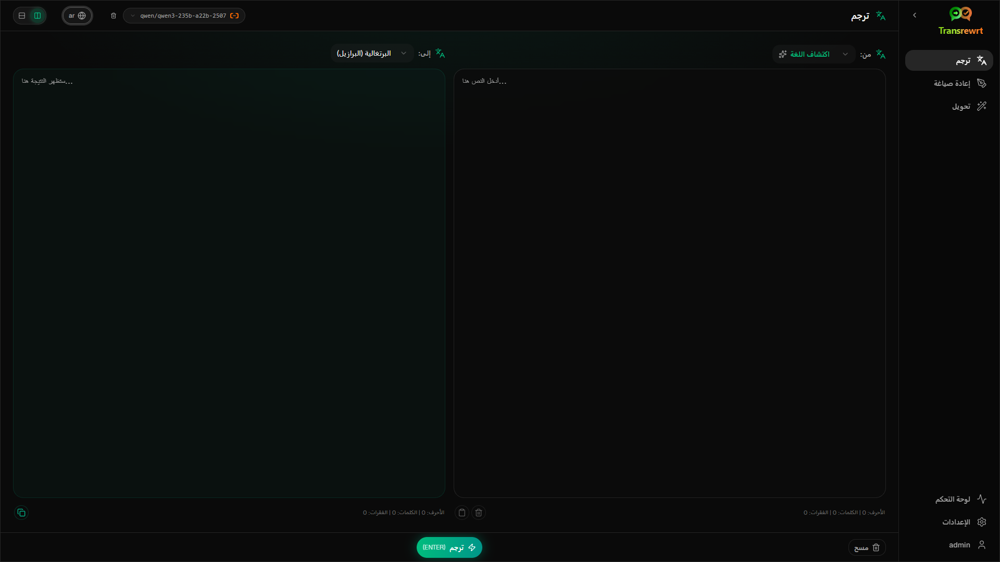

<p align="center">
  
</p>

<h1 align="center">Transrewrt</h1>

<p align="center">
  <a href="https://github.com/wsj-br/transrewrt/releases"></a>
  <a href="LICENSE"></a>
  
</p>

أداة نصوص مدعومة بالذكاء الاصطناعي لـ **الترجمة** و**إعادة الكتابة** و**التحويل** باستخدام مطالبات مخصصة. استخدم مزودي الذكاء الاصطناعي الخاصين بك (OpenRouter، OpenAI، Anthropic، Google Gemini، DeepSeek، Groq، Mistral، xAI، Cerebras، NVIDIA، Alibaba Cloud، apikey.fun، نقاط نهاية متوافقة مع OpenAI، وخوادم محلية مثل Ollama، LM Studio، أو llama.cpp). يعمل كتطبيق سطح مكتب (Windows / Linux / macOS) أو تطبيق ويب Docker. لا يوجد حساب سحابي لـ Transrewrt.

## الميزات

| القدرة | الوصف |
| --- | --- |
| **الترجمة** | عشرات اللغات، الكشف التلقائي، المسارد، التحسين باستخدام إعادة الصياغة |
| **إعادة كتابة** | الوضوح، النبرة، الطول، الإملاء والقواعد — نفس اللغة |
| **تحويل** | مطالبات الذكاء الاصطناعي المخصصة التي تنشئها وتعدلها وتعيد استخدامها |
| **نشر** | سطح مكتب Electron أو ويب Docker (amd64 و arm64) |
| **المفاتيح** | مزودوك، مضيفك — إعدادات مسبقة سهلة أو قائمة نماذج متقدمة |



<small>**اقرأ باللغات الأخرى:** </small>
<small id="lang-list">[English (UK)](../README.md) · [العربية](./README.ar.md) · [简体中文](./README.zh-Hans.md) · [繁體中文](./README.zh-Hant.md) · [Čeština](./README.cs.md) · [Nederlands](./README.nl.md) · [Français](./README.fr.md) · [Deutsch](./README.de.md) · [Ελληνικά](./README.el.md) · [हिन्दी](./README.hi.md) · [Magyar](./README.hu.md) · [Italiano](./README.it.md) · [日本語](./README.ja.md) · [한국어](./README.ko.md) · [فارسی](./README.fa.md) · [Polski](./README.pl.md) · [Português (Brasil)](./README.pt-BR.md) · [Română](./README.ro.md) · [Русский](./README.ru.md) · [Slovenčina](./README.sk.md) · [Español](./README.es.md) · [Svenska](./README.sv.md) · [ไทย](./README.th.md) · [Türkçe](./README.tr.md) · [Українська](./README.uk.md) · [Tiếng Việt](./README.vi.md)</small>

## بدء سريع

**Docker**

```bash
docker pull ghcr.io/wsj-br/transrewrt:latest

docker run -d \
  -p 5000:5000 \
  -v transrewrt-data:/app/data \
  -e PROVIDER_API_KEY=your-key \
  --name transrewrt \
  ghcr.io/wsj-br/transrewrt:latest
```

استبدل `PROVIDER_API_KEY` بمتغير المزود الخاص بك (على سبيل المثال `OPENROUTER_API_KEY`، `OPENAI_API_KEY`، `GROQ_API_KEY`). افتح [http://localhost:5000](http://localhost:5000) وقم بتغيير كلمة مرور المسؤول الافتراضية. يتم تعيين المفاتيح عبر متغيرات البيئة (وليس واجهة المستخدم على الويب).

**Windows** — قم بتنزيل `Transrewrt Setup x.y.z.exe` من [الإصدارات](https://github.com/wsj-br/transrewrt/releases)، ثم قم بالتثبيت، ثم أضف المفاتيح في **الإعدادات ← API**.

**Linux** — قم بتنزيل `.AppImage` من [الإصدارات](https://github.com/wsj-br/transrewrt/releases)، ثم:

```bash
chmod +x Transrewrt-x.y.z-x64.AppImage && ./Transrewrt-x.y.z-x64.AppImage
```

**macOS** — قم بتنزيل `.dmg` لجهاز Mac الخاص بك من [الإصدارات](https://github.com/wsj-br/transrewrt/releases): `arm64` لـ Apple Silicon، `x64` لـ Intel. افتح صورة القرص واسحب Transrewrt إلى التطبيقات.

النسخة غير موقعة، لذا يمنع Gatekeeper الإطلاق الأول. انقر بزر الماوس الأيمن على `Transrewrt.app` واختر **فتح**، ثم قم بتأكيد **فتح**. أو قم بمسح سمة الحجر الصحي:

```bash
xattr -dr com.apple.quarantine /Applications/Transrewrt.app
```

تفاصيل المنصة (Compose، SmartScreen، مكتبات apt، علامات GPU، المنطقة الزمنية): [وثائق البدء السريع](https://wsj-br.github.io/transrewrt/docs/quick-start/).

## الوثائق

وثائق المنتج الكاملة (التثبيت، مفاتيح API، الأدلة، الإعدادات، استكشاف الأخطاء وإصلاحها):

**[https://wsj-br.github.io/transrewrt/docs/](https://wsj-br.github.io/transrewrt/docs/)**

- [مفتاح API](https://wsj-br.github.io/transrewrt/docs/api-key/)
- [التكوين](https://wsj-br.github.io/transrewrt/docs/configuration/)
- [ترجمة](https://wsj-br.github.io/transrewrt/docs/translate/) · [إعادة كتابة](https://wsj-br.github.io/transrewrt/docs/rewrite/) · [تحويل](https://wsj-br.github.io/transrewrt/docs/transform/)
- [المشكلات الشائعة](https://wsj-br.github.io/transrewrt/docs/common-issues/)

## التطوير

- الإعداد، البناء، الاختبار، النشر: [dev/DEVELOPMENT.md](../dev/DEVELOPMENT.md)
- نظرة عامة على البنية: [dev/SYSTEM-OVERVIEW.md](../dev/SYSTEM-OVERVIEW.md)

## الدعم

افتح مشكلة على [GitHub](https://github.com/wsj-br/transrewrt/issues). قم بتضمين نظامك الأساسي (Windows / Linux / macOS / Docker) وإصدار التطبيق (مربع حوار حول أو صفحة الإصدارات).

## شكر وتقدير

تستخدم اقتراحات الإعدادات المسبقة للوضع السهل في محرر الإعدادات المسبقة بيانات التقييم العامة
على جهاز المشرف فقط. لا يتم إعادة توزيع أي محتوى من مجموعة البيانات مع Transrewrt:

- [languagebench](https://huggingface.co/spaces/fair-forward/languagebench) (CC BY-SA 4.0) — ترجمة ChrF
- [Arena](https://huggingface.co/datasets/lmarena-ai/leaderboard-dataset) (CC BY 4.0) — نقاط Arena
- [models.dev](https://models.dev/) (MIT)

تراخيص التبعيات الخارجية وإشعارات مصدر البيانات هذه مدرجة في [NOTICES](../NOTICES).

## الترخيص

حقوق النشر © 2026 والديمار سكوديلر جونيور.

[Apache License 2.0](../LICENSE)

<br/>

أسماء المنتجات والرموز تنتمي إلى أصحابها المعنيين وتستخدم لأغراض التعريف فقط. هذا البرنامج ليس تابعًا لتلك العلامات التجارية أو معتمدًا منها.

<small>

> **ملاحظة حول ترجمات واجهة المستخدم والوثائق:** تم ترجمة جميع لغات الواجهة والوثائق باستثناء الإنجليزية (المملكة المتحدة) باستخدام الذكاء الاصطناعي باستخدام [ai-i18n-tools](https://wsj-br.github.io/ai-i18n-tools/)؛ قد تكون الصياغة غير دقيقة أو تحتوي على أخطاء.

</small>
