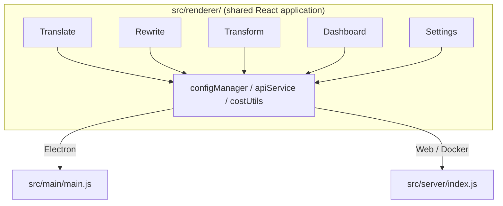

<p align="center">
  
</p>

<h1 align="center">Transrewrt</h1>

<p align="center">
  <a href="https://github.com/wsj-br/transrewrt/releases"></a>
  <a href="LICENSE"></a>
  
  
  
</p>

এআই-চালিত টেক্সট সরঞ্জাম: বিভিন্ন ভাষায় অনুবাদ, বিভিন্ন শৈলীতে পুনরলেখন, এবং কাস্টম প্রম্পট দিয়ে রূপান্তর - সবই [OpenRouter](https://openrouter.ai) এর মাধ্যমে। ডেস্কটপ অ্যাপ (Electron) বা স্ব-হোস্টেড ওয়েব অ্যাপ (Docker) হিসেবে চালায়।

- **অনুবাদ** - বিশাল সংখ্যক ভাষার মধ্যে, স্বয়ংক্রিয় উক্ত শনাক্তকরণ সহ
- **পুনরলেখন** - ব্যাকরণ সংশোধন, স্পষ্টতা উন্নয়ন, আনুষ্ঠানিক/অনানুষ্ঠানিক, সংক্ষেপ, বিস্তৃতি, প্রযুক্তিগত
- **রূপান্তর** - কাস্টম এআই প্রম্পট; প্রম্পট তৈরি এবং পরিচালনা, প্রতিটি প্রম্পটের জন্য ঐচ্ছিক টার্গেট ভাষা
- **মডেল ও খরচ** - যেকোনো OpenRouter মডেল নির্বাচন; SQLite লগ সহ খরচ ড্যাশবোর্ড, মডেল/কার্য/দিন অনুযায়ী সারাংশ
- **UI** - i18n (pt-BR, de, fr, es, RTL), থিম, ফন্ট, কীবোর্ড শর্টকাট; নিরাপদ ওয়েব মোড (API key শুধুমাত্র সার্ভারে)
- **ডেস্কটপ** - Windows এবং Linux-এর জন্য Electron অ্যাপ
- **স্ব-হোস্টেড** - amd64 এবং arm64-এর জন্য Docker ইমেজ (Raspberry Pi-সুবিধা)

ইন্সটল হওয়ার পর, সমস্ত বৈশিষ্ট্যের পূর্ণ গাইডের জন্য **[ব্যবহারকারী গাইড](../USER-GUIDE.md)** দেখুন।

<small>**অন্যান্য ভাষায় পড়ুন:** [English (UK)](../README.md) · [Português (BR)](README.pt-BR.md) · [العربية](README.ar.md) · [বাংলা](README.bn.md) · [Català](README.ca.md) · [简体中文](README.zh-CN.md) · [繁體中文](README.zh-TW.md) · [Hrvatski](README.hr.md) · [Čeština](README.cs.md) · [Nederlands](README.nl.md) · [English (US)](README.en-US.md) · [Filipino](README.tl.md) · [Français](README.fr.md) · [Deutsch](README.de.md) · [Ελληνικά](README.el.md) · [हिन्दी](README.hi.md) · [Magyar](README.hu.md) · [Italiano](README.it.md) · [日本語](README.ja.md) · [Basa Jawa](README.jv.md) · [한국어](README.ko.md) · [Bahasa Melayu](README.ms.md) · [فارسی](README.fa.md) · [Polski](README.pl.md) · [Português (PT)](README.pt.md) · [ਪੰਜਾਬੀ](README.pa.md) · [Română](README.ro.md) · [Русский](README.ru.md) · [Slovenčina](README.sk.md) · [Español](README.es.md) · [Kiswahili](README.sw.md) · [Svenska](README.sv.md) · [తెలుగు](README.te.md) · [ภาษาไทย](README.th.md) · [Türkçe](README.tr.md) · [Українська](README.uk.md) · [Tiếng Việt](README.vi.md)</small>

<a id="screenshots"></a>
## স্ক্রিনশট

**ভাষা নির্বাচক**


**অনুবাদ**


**রূপান্তর - প্রম্পট এডিটর**


**ড্যাশবোর্ড**


**সেটিংস - মডেল নির্বাচন**


<br /><br />

<a id="table-of-contents"></a>
## কন্টেন্ট তালিকা

<!-- START doctoc generated TOC please keep comment here to allow auto update -->
<!-- DON'T EDIT THIS SECTION, INSTEAD RE-RUN doctoc TO UPDATE -->

- [দ্রুত শুরু](#quick-start)
- [ইনস্টলেশন](#installation)
  - [Windows (Electron)](#windows-electron)
  - [Linux (Electron)](#linux-electron)
  - [Docker](#docker)
- [একটি OpenRouter API কী পাওয়া](#getting-an-openrouter-api-key)
- [কনফিগারেশন এবং পরিবেশ](#configuration-and-environment)
- [উন্নয়ন এবং আর্কিটেকচার](#development-and-architecture)
- [রিলিজ এবং ট্যাগ](#releases-and-tags)
- [অবদান রাখা](#contributing)
- [দাবি পরিত্যাগ](#disclaimer)
- [লাইসেন্স](#license)

<!-- END doctoc generated TOC please keep comment here to allow auto update -->

<br /><br />

<a id="quick-start"></a>

## দ্রুত শুরু

**ডকার (স্ব-হোস্টিং కNmatsats জন্য সুপারিশকৃত)**

```bash
docker pull ghcr.io/wsj-br/transrewrt:latest

API_KEY=sk-or-your-key docker run -d \
  -p 5000:5000 \
  -v transrewrt-data:/app/data \
  -e API_KEY \
  --name transrewrt-web \
  ghcr.io/wsj-br/transrewrt:latest
```

`sk-or-your-key`-কে আপনার [OpenRouter API কী](https://openrouter.ai/keys) দিয়ে প্রতিস্থাপন করুন। [http://localhost:5000](http://localhost:5000) ওপেন করুন এবং সেবাকে ব্রহ্মাণ্ডিকভাবে প্রকাশ করার আগে ডিফল্ট অ্যডমিন পাসওয়ার্ড পরিবর্তন করুন।

<br />

> ℹ️ **নোট**<br/>
> ডকার-এ, OpenRouter API কী শুধুমাত্র `API_KEY` পরিবেশ ভ embroidery-এ সেট করা যায় (ওয়েব UI-এ না)। ডেস্কটপ (ইলেক্ট্রন)-এ, আপনি তা **সেটিংস → API**-এ পেস্ট করেন।

<br />

**উইন্ডোজ**

[Releases](https://github.com/wsj-br/transrewrt/releases)- থেকে সর্বশেষ `Transrewrt Setup x.y.z.exe` ফাইলটি ডাউনলোড করুন, ইনস্টলারটি চালান, তারপর স্টার্ট মেনু বা ডেস্কটপ শর্টকাট থেকে লঞ্চ করুন। আপনার OpenRouter API কী **সেটিংস → API**-এ প্রবিষ্ট করুন।

<br />

**লিনাক্স**

[Releases](https://github.com/wsj-br/transrewrt/releases)- থেকে `.AppImage` ফাইলটি ডাউনলোড করুন, তার:

```bash
chmod +x Transrewrt-x.y.z.AppImage && ./Transrewrt-x.y.z.AppImage
```

আপনার OpenRouter API কী **সেটিংস → API**-এ প্রবিষ্ট করুন। দেবিয়ান/উবুন্টুতে আপনাকে প্রথমে অতিরিক্ত নির্ভরশীলতা ইনস্টল করতে হতে পারে:

```bash
sudo apt install libgtk-3-0 libnotify-dev libnss3 libxss1 libasound2 libxtst6 xauth
```

বিস্তারিত দেখুন [ইন্সটলেশন → লিনাক্স](#linux-electron)。

<br />

> ℹ️ **নোট**<br/>
> macOS বর্তমানে সমর্থিত নয়। ট্রান্সর sūtra ট্রান্সর sūtra উইন্ডোজ, লিনাক্স, এবং ডকার-এ উপলব্ধ।

<br />

এপটি চালিয়ে থাকলে, পাঠন **[ব্যবহারিক গাইড](../USER-GUIDE.md)** দেখুন যাতে আপনি টেক্সট অনুবাদ, পুনর্লিখন এবং রূপান্তর, প্রম্পট ম্যানেজ, এবং মডেল কনফিগার করার পদ্ধতি শিখতে পারেন।

<br /><br />

<a id="installation"></a>
## ইন্সটলেশন

<a id="windows-electron"></a>
### উইন্ডোজ (ইলেক্ট্রন)

- [Releases](https://github.com/wsj-br/transrewrt/releases)- থেকে সর্বশেষ ইনস্টলার ডাউনলোড করুন।
- `.exe` ফাইলটি চালান এবং ইনস্টলারের নির্দেশাবলী অনুসরণ করুন।
- প্রথম রান: স্টার্ট মেনু বা ডেস্কটপ শর্টকাট থেকে অ্যাপটি শুরু করুন। কনফিগারেশন `%APPDATA%\transrewrt\`-এ সংরক্ষিত হয়।

<br />

<a id="linux-electron"></a>
### লিনাক্স (ইলেক্ট্রন)

- [Releases](https://github.com/wsj-br/transrewrt/releases)- থেকে `.AppImage` ফাইলটি ডাউনলোড করুন।
- রান করুন: `chmod +x Transrewrt-x.y.z.AppImage && ./Transrewrt-x.y.z.AppImage`
- অতিরিক্ত নির্ভরশীলতা (দেবিয়ান/উবুন্টু): `sudo apt install libgtk-3-0 libnotify-dev libnss3 libxss1 libasound2 libxtst6 xauth`
- আরও দেখুন [dev/DEVELOPMENT.md](../dev/DEVELOPMENT.md)।

<br />

<a id="docker"></a>
### ডকার

- পুল করুন: `docker pull ghcr.io/wsj-br/transrewrt:latest`
- OpenRouter API клюত **অবশ্যই** `API_KEY` পরিবেশ ভ embroidery-এ সেট করতে হবে। এটিকে `-e API_KEY`-এর সাহাযysteine পাস করুন (বা `docker compose` / `.env` -এর মাধ্যমে) যাতে কী প্রসেস লিস্টে দৃশ্যমান না হয়।
- API কীটি ওয়েব UI-এ প্রবিষ্ট করা যায় না।

উদাহরণ - স্থায়ীত্বের জন্য নামক্যue volume (API কী পরিবেশ ভ embroidery-এ পাস করা হয়েছে, কমান্ড লাইনে না):

```bash
API_KEY=sk-or-your-key docker run -d \
  -p 5000:5000 \
  -v transrewrt-data:/app/data \
  -e API_KEY \
  --name transrewrt-web \
  ghcr.io/wsj-br/transrewrt:latest
```

<br />

| বিকল্প   | বর্ণনা                                                                                                   |
| -------- | ------------------------------------------------------------------------------------------------------------- |
| পোর্ট     | `5000` (`-p 5000:5000`-এর সাথে ম্যাপ করুন)                                                                              |
| ভলিউম   | কনফিগারেশন এবং ডেটাবেস স্থায়ীত্বের জন্য `/app/data` মাউন্ট করুন                                                         |
| পরিবেশ ভ embroidery | `PORT`, `CONFIG_PATH`, `API_KEY`, `API_URL`, `KEY_SEED` - [কনফিগারেশন](#configuration-and-environment) দেখুন |

সোর্স থেকে বিল্ড এবং রান করতে: `docker compose up --build -d` বা `pnpm run docker:up` - [dev/DEVELOPMENT.md](../dev/DEVELOPMENT.md) দেখুন।

<br /><br />

<a id="getting-an-openrouter-api-key"></a>
## একটি OpenRouter API কী পাওয়া

ট্রান্সর sūtra [OpenRouter](https://openrouter.ai) এ AI মডেলগুলির জন্য ব্যবহার করে। টেক্সট অনুবাদ, পুনর্লিখন বা রূপান্তরের জন্য আপনাকে একটি API কী প্রয়োজন।

1. [openrouter.ai](https://openrouter.ai)-এ সাইন আপ করুনหรือ লগ ইন করুন।
2. [Keys](https://openrouter.ai/keys) পৃষ্ঠা ওপেন করুন এবং একটি নতুন কী তৈরি করুন (এটির নাম দিন, এবং ঐচ্ছিকভাবে ক্রেডিট সীমা সেট করুন)। আপনি কৃত্রিম যোগ না বা้ Without adding credit, you can use free models without adding credit.
3. **ডেস্কটপ (ইলেক্ট্রন):** কীটি **সেটিংস → API**-এ পেস্ট করুন। **ডকার:** `API_KEY` পরিবেশ ভ embroidery সেট করুন (দেখুন [দ্রুত শুরু](#quick-start))।

সীমাবদ্ধতা, BYOK, এবং আরও তথ্যের জন্য, [OpenRouter authentication](https://openrouter.ai/docs/api/reference/authentication) দেখুন।

<br /><br />

<a id="configuration-and-environment"></a>

## কনফিগারেশন এবং পরিবেশ

**কনফিগ ফাইল অবস্থান**

| ডিপ্লয়মেন্ট         | কনফিগ অবস্থান                                   |
| ------------------ | ------------------------------------------------- |
| Electron (Windows) | `%APPDATA%\transrewrt\`                           |
| Electron (Linux)   | `~/.config/transrewrt/`                           |
| Web / Docker       | `/app/data/config.json` (use a volume to persist) |

<br />

**পরিবেশ ভেরিয়েবল** (ওয়েব/ডocker only; Electron local config file ব্যবহার করে)

| ভেরিয়েবল      | Default                        | Description                                                   |
| ------------- | ------------------------------ | ------------------------------------------------------------- |
| `PORT`        | `5000`                         | Server listening port                                         |
| `CONFIG_PATH` | `/app/data/config.json`        | Path to the config file                                       |
| `API_KEY`     | *(empty)*                      | OpenRouter API key (required for Docker; set via env, not UI) |
| `API_URL`     | `https://openrouter.ai/api/v1` | Upstream AI API base URL                                      |
| `KEY_SEED`    | *(empty)*                      | Transrewrt proxy key seed (overrides config if set)           |

<br />

**ডেটা এবং স্থায়িত্ব:** Docker-র জন্য, `/app/data` তে একটি volume mount করুন যাতে `config.json` এবং SQLite database container restart-এও স্থায়ী থাকে। volume ছাড়া, container stop হলে সব ডেটা হারায়।

<br />

**ওয়েব authentication:**

- Default admin: `admin` / `transrewrt26`.
- Manage users in **Settings → Users**.
- Reset a password: `docker exec <container> reset-web-password '<username>' '<new-password>'`
  (from source: `pnpm run reset-web-password -- <username> <new-password>`)

<br />

> ⚠️ **WARNING**<br/>
> Change the default admin password immediately on any network-accessible host.

<br />

**Transrewrt proxy (optional):** You can route API traffic through an external proxy that uses a time-based rolling key. In **Settings → API**, enable **Use Transrewrt Proxy**, set **Key seed**, and set **API URL** to the proxy base URL. See [dev/SYSTEM-OVERVIEW.md](../dev/SYSTEM-OVERVIEW.md) for details.

Key settings (theme, font, models, languages, etc.) are available in the Settings dialog or can be edited directly in the config JSON. The full list and defaults are documented in [dev/DEVELOPMENT.md](../dev/DEVELOPMENT.md).

<br /><br />

<a id="development-and-architecture"></a>
## Development and architecture

- **Development:** Setup, build, test, and deploy (Electron, Web, Docker) - see **[dev/DEVELOPMENT.md](../dev/DEVELOPMENT.md)**.
- **Architecture and system overview:** Folder structure, tech stack, design decisions, Transrewrt proxy - see **[dev/SYSTEM-OVERVIEW.md](../dev/SYSTEM-OVERVIEW.md)**.



<br /><br />

<a id="releases-and-tags"></a>
## Releases and tags

- **Git tags** `v`* (e.g. `v1.0.10`) trigger the [ riliz workflow](.github/workflows/release.yml). **GitHub Releases** attach the Windows installer (`.exe`) and Linux AppImage.
- **Docker images** are published to `ghcr.io/wsj-br/transrewrt`. Image tags match the Git version (e.g. `v1.0.10` → `ghcr.io/wsj-br/transrewrt:1.0.10`) plus `latest`. Multi-arch: `linux/amd64` and `linux/arm64` (e.g. Raspberry Pi).

<br /><br />

<a id="contributing"></a>
## Contributing

1. Fork the repository.
2. Create a feature branch: `git checkout -b feature/my-feature`
3. Commit your changes with a clear message.
4. Push and open a Pull Request against `main`.

Please follow the existing code style and test your changes in both Electron and web modes before submitting. See [dev/DEVELOPMENT.md](../dev/DEVELOPMENT.md) for build and test instructions.

<br />

**Reporting issues:** Open an issue on [GitHub](https://github.com/wsj-br/transrewrt/issues). Include your platform (Windows / Linux / Docker) and app version (shown in the About dialog or on the Releases page).

<br /><br />

<a id="disclaimer"></a>

## দাবি

প্রোডাক্টের নাম এবং আইকন ই encourager তাদের মালিকদের স্বাবস্থিক সম্পত্তি এবং শুধুমাত্র পরিচয়ের উদ্দেশ্যে ব্যবহৃত হয়। এই সফ্টওয়্যার উল্লিখিত কোনও ব্র্যান্ডের সাথে যুক্ত বা অনুমোদিত俾নহ都存在।

<br /><br />

<a id="license"></a>
## লাইসেন্স

কপিরাইট © ২০২৬ ওল্ডেমার স্কুডেলার জুনিয়র।

[আপাচে লাইসেন্স ২.০](LICENSE)