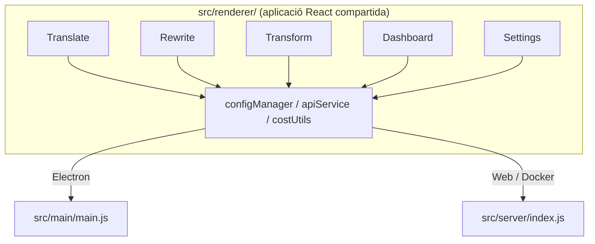

<p align="center">
  
</p>

<h1 align="center">Transrewrt</h1>

<p align="center">
  <a href="https://github.com/wsj-br/transrewrt/releases"></a>
  <a href="LICENSE"></a>
  
  
  
</p>

Eina de text amb IA: tradueix entre llengües, reescriu en diferents estils i transforma amb conselles personalitzades, tot mitjançant [OpenRouter](https://openrouter.ai). Funciona com una aplicació d'escriptori (Electron) o una aplicació web auto-allotjada (Docker).

- **Tradueix** - entre dotzenes d'idiomes, amb detecció automàtica de la llengua d'origen
- **Reescriu** - corregeix gramàtica, millora la claredat, formal/informal, redueix/expandeix, tècnic
- **Transforma** - conselles d'IA personalitzades; crea i gestiona conselles, idioma de destinació opcional per consell
- **Models i cost** - tria qualsevol model d'OpenRouter; tauler de cost amb registre SQLite, resums per model/operació/dia
- **Interfície d'usuari** - internacionalització (pt-BR, de, fr, es, RTL), temes, lletres, dreceres de teclat; mode web segur (clau API només al servidor)
- **Escriptori** - aplicació Electron per a Windows i Linux
- **Auto-allotjat** - imatge Docker per a amd64 i arm64 (compatible Raspberry Pi)

Un cop instal·lat, consulteu la **[Guia d'usuari](../USER-GUIDE.md)** per a un recorregut complet de totes les funcions.

<small>**Llegeix en altres llengües:** [English (UK)](../README.md) · [Português (BR)](README.pt-BR.md) · [العربية](README.ar.md) · [বাংলা](README.bn.md) · [Català](README.ca.md) · [简体中文](README.zh-CN.md) · [繁體中文](README.zh-TW.md) · [Hrvatski](README.hr.md) · [Čeština](README.cs.md) · [Nederlands](README.nl.md) · [English (US)](README.en-US.md) · [Filipino](README.tl.md) · [Français](README.fr.md) · [Deutsch](README.de.md) · [Ελληνικά](README.el.md) · [हिन्दी](README.hi.md) · [Magyar](README.hu.md) · [Italiano](README.it.md) · [日本語](README.ja.md) · [Basa Jawa](README.jv.md) · [한국어](README.ko.md) · [Bahasa Melayu](README.ms.md) · [فارسی](README.fa.md) · [Polski](README.pl.md) · [Português (PT)](README.pt.md) · [ਪੰਜਾਬੀ](README.pa.md) · [Română](README.ro.md) · [Русский](README.ru.md) · [Slovenčina](README.sk.md) · [Español](README.es.md) · [Kiswahili](README.sw.md) · [Svenska](README.sv.md) · [తెలుగు](README.te.md) · [ภาษาไทย](README.th.md) · [Türkçe](README.tr.md) · [Українська](README.uk.md) · [Tiếng Việt](README.vi.md)</small>

<a id="screenshots"></a>
## Captures de pantalla

**Selector d'idioma**


**Tradueix**


**Transforma - editor de conselles**


**Tauler**


**Configuració - selecció de models**


<br /><br />

<a id="table-of-contents"></a>
## Taula de continguts

<!-- START doctoc generated TOC please keep comment here to allow auto update -->
<!-- DON'T EDIT THIS SECTION, INSTEAD RE-RUN doctoc TO UPDATE -->

- [Inici ràpid](#quick-start)
- [Instal·lació](#installation)
  - [Windows (Electron)](#windows-electron)
  - [Linux (Electron)](#linux-electron)
  - [Docker](#docker)
- [Obtenir una clau d'API d'OpenRouter](#getting-an-openrouter-api-key)
- [Configuració i entorn](#configuration-and-environment)
- [Desenvolupament i arquitectura](#development-and-architecture)
- [Llançaments i etiquetes](#releases-and-tags)
- [Col·laboració](#contributing)
- [Avís legal](#disclaimer)
- [Llicència](#license)

<!-- END doctoc generated TOC please keep comment here to allow auto update -->

<br /><br />

<a id="quick-start"></a>

## Inici ràpid

**Docker (recomanat per auto-allotjament)**

```bash
docker pull ghcr.io/wsj-br/transrewrt:latest

API_KEY=sk-or-your-key docker run -d \
  -p 5000:5000 \
  -v transrewrt-data:/app/data \
  -e API_KEY \
  --name transrewrt-web \
  ghcr.io/wsj-br/transrewrt:latest
```

Substituïu `sk-or-your-key` amb la vostra [clau API d'OpenRouter](https://openrouter.ai/keys). Obriu [http://localhost:5000](http://localhost:5000) i canvieu la contrasenya d'administrador per defecte abans d'exposar el servei.

<br />

> ℹ️ **NOTA**<br/>
> En Docker la clau API d'OpenRouter es configura només a través de la variable d'entorn `API_KEY` (no a la interfície web). A l'escriptori (Electron) la enganxeu a **Configuració → API**.

<br />

**Windows**

Baixeu el `Transrewrt Setup x.y.z.exe` més recent des de [Releases](https://github.com/wsj-br/transrewrt/releases), executeu l'instal·lador i després inicieu des del menú Inici o drecera d'escriptori. Introduïu la vostra clau API d'OpenRouter a **Configuració → API**.

<br />

**Linux**

Baixeu el `.AppImage` des de [Releases](https://github.com/wsj-br/transrewrt/releases), després:

```bash
chmod +x Transrewrt-x.y.z.AppImage && ./Transrewrt-x.y.z.AppImage
```

Introduïu la vostra clau API d'OpenRouter a **Configuració → API**. A Debian/Ubuntu potser caldrà instal·lar dependències addicionals primer:

```bash
sudo apt install libgtk-3-0 libnotify-dev libnss3 libxss1 libasound2 libxtst6 xauth
```

Vegeu [Instal·lació → Linux](#linux-electron) per a més detalls.

<br />

> ℹ️ **NOTA**<br/>
> Actualment no es compatible amb macOS. Transrewrt està disponible per a Windows, Linux i Docker.

<br />

Una vegada l'aplicació estigui en marxa, consulteu la **[Guia d'usuari](../USER-GUIDE.md)** per aprendre a traduir, reescriure i transformar text, gestionar prompts i configurar models.

<br /><br />

<a id="installation"></a>
## Instal·lació

<a id="windows-electron"></a>
### Windows (Electron)

- Baixeu l'instal·lador més recent des de [Releases](https://github.com/wsj-br/transrewrt/releases).
- Executeu el `.exe` i seguiu l'instal·lador.
- Primera execució: inicieu l'aplicació des del menú Inici o drecera d'escriptori. La configuració s'emmagatzema a `%APPDATA%\transrewrt\`.

<br />

<a id="linux-electron"></a>
### Linux (Electron)

- Baixeu el `.AppImage` des de [Releases](https://github.com/wsj-br/transrewrt/releases).
- Executeu: `chmod +x Transrewrt-x.y.z.AppImage && ./Transrewrt-x.y.z.AppImage`
- Dependències addicionals (Debian/Ubuntu): `sudo apt install libgtk-3-0 libnotify-dev libnss3 libxss1 libasound2 libxtst6 xauth`
- Vegeu [dev/DEVELOPMENT.md](../dev/DEVELOPMENT.md) per a més.

<br />

<a id="docker"></a>
### Docker

- Baixeu: `docker pull ghcr.io/wsj-br/transrewrt:latest`
- La clau API d'OpenRouter **ha** deconfigurar-se a través de la variable d'entorn `API_KEY`. Passeu-la amb `-e API_KEY` (o a través de `docker compose` / `.env`) perquè la clau no sigui visible a la llista de processos.
- La clau API no es pot introduir a la interfície web.

Exemple - volum amb nom per a persistència (clau API passada via env, no a la línia de comandaments):

```bash
API_KEY=sk-or-your-key docker run -d \
  -p 5000:5000 \
  -v transrewrt-data:/app/data \
  -e API_KEY \
  --name transrewrt-web \
  ghcr.io/wsj-br/transrewrt:latest
```

<br />

| Opció   | Descripció                                                                                                   |
| -------- | ------------------------------------------------------------------------------------------------------------- |
| Port     | `5000` (mapegeu amb `-p 5000:5000`)                                                                            |
| Volum   | Monteu `/app/data` per a persistència de la configuració i la base de dades                                   |
| Vars d'entorn | `PORT`, `CONFIG_PATH`, `API_KEY`, `API_URL`, `KEY_SEED` - vegeu [Configuració](#configuration-and-environment) |

Per construir i executar des del codi font: `docker compose up --build -d` o `pnpm run docker:up` - vegeu [dev/DEVELOPMENT.md](../dev/DEVELOPMENT.md).

<br /><br />

<a id="getting-an-openrouter-api-key"></a>
## Obtenció d'una clau API d'OpenRouter

Transrewrt utilitza [OpenRouter](https://openrouter.ai) per als models d'IA. Necessiteu una clau API per traduir, reescriure o transformar text.

1. Registreu-vos o inicieu sessió a [openrouter.ai](https://openrouter.ai).
2. Obriu la pàgina [Keys](https://openrouter.ai/keys) i creeu una clau nova (poseu-li un nom i, opcionalment, establiu un límit de crèdit). Podeu utilitzar models gratuïts sense afegir crèdit.
3. **Escriptori (Electron):** enganxeu la clau a **Configuració → API**. **Docker:** configureu la variable d'entorn `API_KEY` (vegeu [Inici ràpid](#quick-start)).

Per a límits, BYOK i més, vegeu [Autenticació d'OpenRouter](https://openrouter.ai/docs/api/reference/authentication).

<br /><br />

<a id="configuration-and-environment"></a>

## Configuració i entorn

**Ubicacions del fitxer de configuració**

| Desplegament         | Ubicació de la configuració                         |
| ------------------- | --------------------------------------------------- |
| Electron (Windows)  | `%APPDATA%\transrewrt\`                             |
| Electron (Linux)    | `~/.config/transrewrt/`                             |
| Web / Docker        | `/app/data/config.json` (usa un volum per persistir) |

<br />

**Variables d'entorn** (només web/Docker; l'Electron utilitza el fitxer de configuració local)

| Variable      | Per defecte                        | Descripció                                                   |
| ------------- | ---------------------------------- | ------------------------------------------------------------ |
| `PORT`        | `5000`                             | Port d'escolta del servidor                                  |
| `CONFIG_PATH` | `/app/data/config.json`            | Ruta al fitxer de configuració                              |
| `API_KEY`     | *(buida)*                          | Clau API d'OpenRouter (requerida per Docker; estableix via env, no per la UI) |
| `API_URL`     | `https://openrouter.ai/api/v1`     | URL base de la API AI de l'upstream                          |
| `KEY_SEED`    | *(buida)*                          | Llavor de la clau del proxy Transrewrt (sobreescriu la config si es defineix) |

<br />

**Dades i persistència:** Per a Docker, munta un volum a `/app/data` perquè `config.json` i la base de dades SQLite persistin entre reinicis del contenidor. Sense un volum, totes les dades es perden quan el contenidor s'atura.

<br />

**Autenticació web:**

- Administrador per defecte: `admin` / `transrewrt26`.
- Gestiona usuaris a **Configuració → Usuaris**.
- Restableix una contrasenya: `docker exec <contenidor> reset-web-password '<nom-d\'usuari>' '<nova-contrasenya>'`
  (des de codi font: `pnpm run reset-web-password -- <nom-d\'usuari> <nova-contrasenya>`)

<br />

> ⚠️ **ADVERTÈNCIA**<br/>
> Canvia la contrasenya de l'administrador per defecte immediatament en qualsevol host accessible per xarxa.

<br />

**Proxy Transrewrt (opcional):** Pots enrutar el trànsit de la API a través d'un proxy extern que utilitzi una clau rotativa basada en el temps. A **Configuració → API**, habilita **Utilitza el Proxy Transrewrt**, estableix la **Llavor de la clau** i defineix l'**URL de la API** com la URL base del proxy. Veu [dev/SYSTEM-OVERVIEW.md](../dev/SYSTEM-OVERVIEW.md) per a més detalls.

La configuració principal (tema, lletra, models, idiomes, etc.) està disponible al diàleg de Configuració o es pot editar directament al JSON de configuració. La llista completa i els valors per defecte estan documentats a [dev/DEVELOPMENT.md](../dev/DEVELOPMENT.md).

<br /><br />

<a id="development-and-architecture"></a>
## Desenvolupament i arquitectura

- **Desenvolupament:** Configuració, build, test i desplegament (Electron, Web, Docker) - veu **[dev/DEVELOPMENT.md](../dev/DEVELOPMENT.md)**.
- **Arquitectura i visió general del sistema:** Estructura de carpetes, pila tecnològica, decisions de disseny, proxy Transrewrt - veu **[dev/SYSTEM-OVERVIEW.md](../dev/SYSTEM-OVERVIEW.md)**.



<br /><br />

<a id="releases-and-tags"></a>
## Llançaments i etiquetes

- Les **etiquetes de Git** `v`* (p. ex. `v1.0.10`) activen el [flux de treball de llançament](.github/workflows/release.yml). Els **Llançaments de GitHub** adjunten l'instal·lador de Windows (`.exe`) i l'AppImage de Linux.
- Les **imatges de Docker** es publiquen a `ghcr.io/wsj-br/transrewrt`. Les etiquetes d'imatge coincideixen amb la versió de Git (p. ex. `v1.0.10` → `ghcr.io/wsj-br/transrewrt:1.0.10`) a més de `latest`. Multi-arquitectura: `linux/amd64` i `linux/arm64` (p. ex. Raspberry Pi).

<br /><br />

<a id="contributing"></a>
## Contribucions

1. Fes un fork del repositori.
2. Crea una branca de funcionalitat: `git checkout -b feature/meva-funcionalitat`
3. Fes commit dels canvis amb un missatge clar.
4. Puja i obri una Pull Request contra `main`.

Si us plau, segueix l'estil de codi existent i prova els teus canvis en ambdós modes (Electron i web) abans d'enviar. Veu [dev/DEVELOPMENT.md](../dev/DEVELOPMENT.md) per a instruccions de build i test.

<br />

**Informar d'errors:** Obre un issue a [GitHub](https://github.com/wsj-br/transrewrt/issues). Inclou la teva plataforma (Windows / Linux / Docker) i la versió de l'aplicació (es mostra al diàleg Sobre o a la pàgina Llançaments).

<br /><br />

<a id="disclaimer"></a>

## Avís legal

Els noms dels productes i les icones pertanyen als seus respectius propietaris i s'usen només per a identificació. Aquest programari no està afiliat ni recomanat per cap de les marques esmentades.

<br /><br />

<a id="license"></a>
## Llicència

Copyright © 2026 Waldemar Scudeller Jr.

[Llicència Apache 2.0](LICENSE)