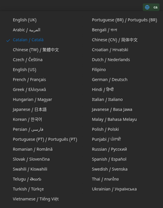
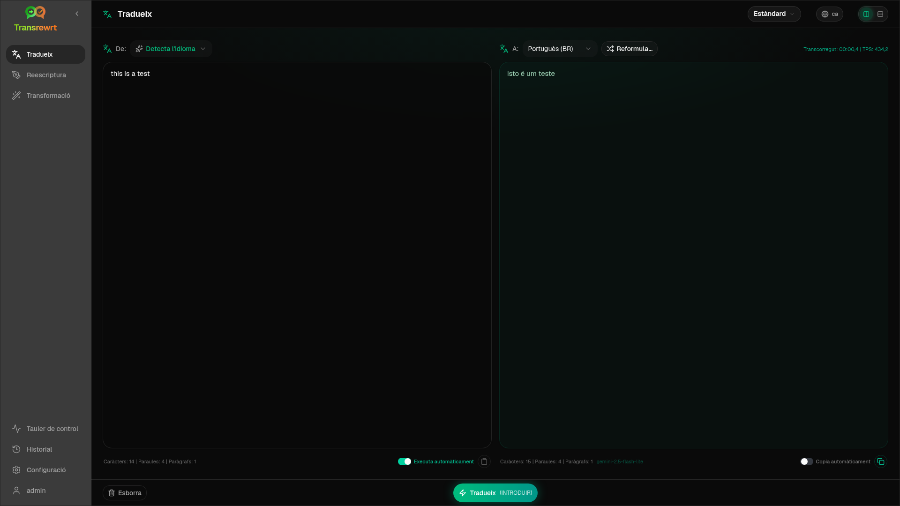
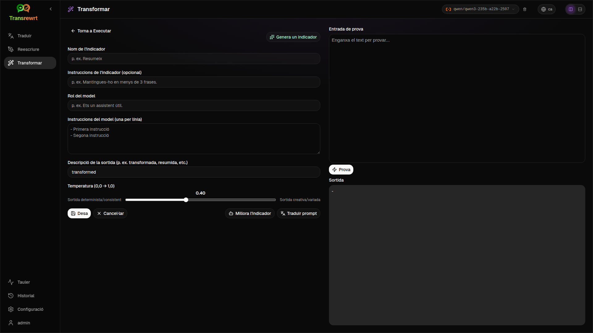
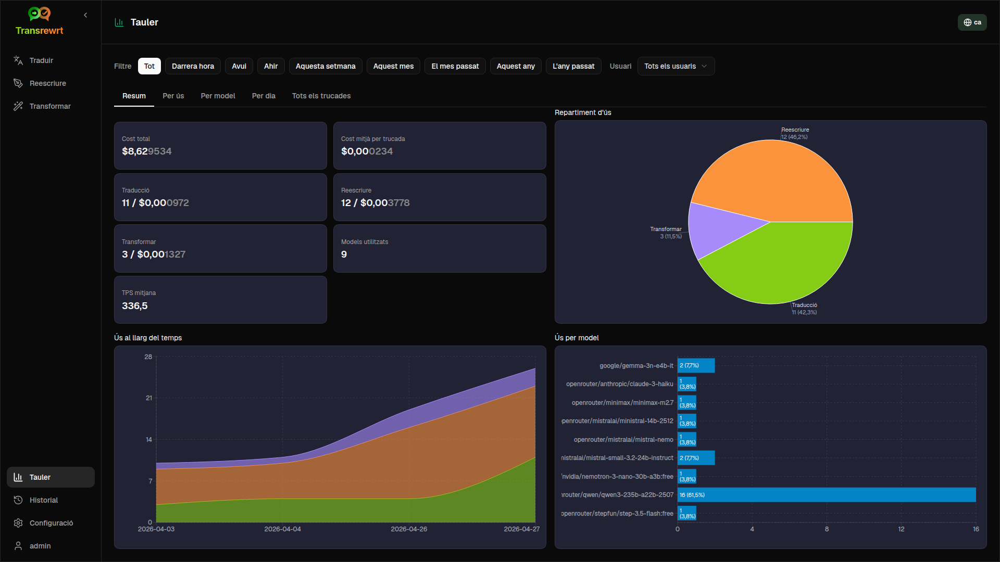
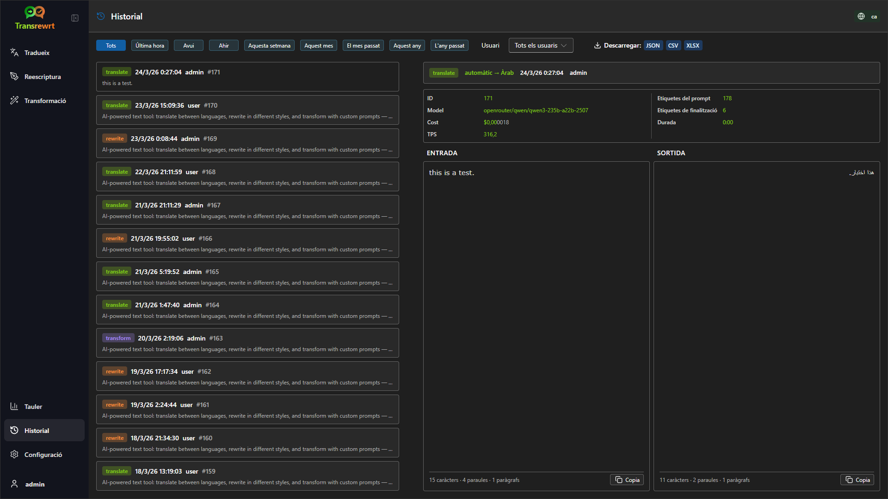
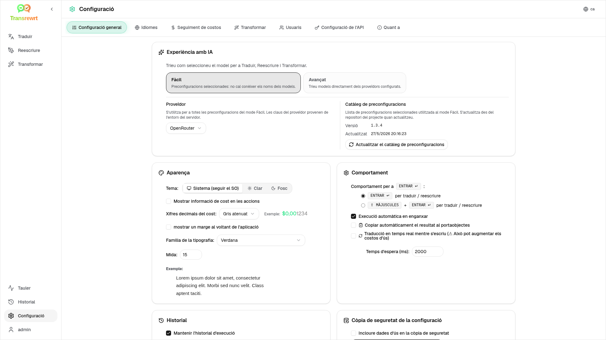

<p align="center">
  
</p>

<p align="center">
  <a href="https://github.com/wsj-br/transrewrt/releases"></a>
  <a href="LICENSE"></a>
  
  
  
</p>

Eina de text amb IA: tradueix entre idiomes, reescriu en diferents estils i transforma amb prompts personalitzats — utilitzant múltiples proveïdors d'IA (OpenRouter, OpenAI, Anthropic, Google Gemini, DeepSeek, Groq, Mistral, xAI i Ollama local). Funciona com a aplicació d'escriptori (Electron) o com a aplicació web autoallotjada (Docker).

- **Traduir** - entre desenes d'idiomes, amb detecció automàtica de l'idioma d'origen
- **Reescriure** - corregir gramàtica, millorar la claredat, formal/informal, escurçar, ampliar, tècnic
- **Transformar** - indicadors personalitzats d'IA; crear i gestionar indicadors, idioma de destinació opcional per a cada indicador
- **Historial** - historial complet d'execucions amb text d'entrada i de sortida, filtres i exportació
- **Fàcil i Avançat** - Mode fàcil (per defecte): predefinicions seleccionades per proveïdor (**Gratuït (OpenRouter)**, **Estàndard**, **Avançat**, **Tècnic**; només apareixen les predefinicions amb una assignació per al proveïdor seleccionat) sense haver de triar IDs de models; Mode avançat: llista completa de models dels proveïdors configurats
- **Models i cost** - taulells de cost i ús (Resum, Per model, Tots els trucades) amb exportació; OpenRouter mostra el desemborsament real, altres proveïdors utilitzen estimacions
- **IU** - interfície multilingüe (30+ idiomes, suport RTL), tipus de lletra, ...
- **Mode web** - suport multiusuari amb rols d'administrador
- **Escriptori** - Aplicació Electron per a Windows i Linux
- **Autoallotjat** - Imatge Docker per a amd64 i arm64 (preparat per Raspberry Pi)

Un cop instal·lat, consulteu la [**Guia de l'usuari**](USER-GUIDE.ca.md) per obtenir una descripció completa de totes les funcions.

<small>**Llegeix en altres idiomes:** </small>
<small id="lang-list">[English (GB)](../README.md) · [Português (Brasil)](./README.pt-BR.md) · [العربية](./README.ar.md) · [বাংলা](./README.bn.md) · [Català](./README.ca.md) · [中文 (中国大陆)](./README.zh-CN.md) · [中文 (台灣)](./README.zh-TW.md) · [Hrvatski](./README.hr.md) · [Čeština](./README.cs.md) · [Nederlands](./README.nl.md) · [English (US)](./README.en-US.md) · [Tagalog](./README.tl.md) · [Français](./README.fr.md) · [Deutsch](./README.de.md) · [Ελληνικά](./README.el.md) · [हिन्दी](./README.hi.md) · [Magyar](./README.hu.md) · [Italiano](./README.it.md) · [日本語](./README.ja.md) · [한국어](./README.ko.md) · [Bahasa Melayu](./README.ms.md) · [فارسی](./README.fa.md) · [Polski](./README.pl.md) · [Basa Jawa](./README.jv.md) · [Português](./README.pt.md) · [ਪੰਜਾਬੀ](./README.pa.md) · [Română](./README.ro.md) · [Русский](./README.ru.md) · [Slovenčina](./README.sk.md) · [Español](./README.es.md) · [Kiswahili](./README.sw.md) · [Svenska](./README.sv.md) · [తెలుగు](./README.te.md) · [ไทย](./README.th.md) · [Türkçe](./README.tr.md) · [Українська](./README.uk.md) · [Tiếng Việt](./README.vi.md)</small>

<small>

> **Nota sobre les traduccions de la interfície i la documentació:** Tots els idiomes de la interfície excepte l'anglès original (UK)
> s'han traduït mitjançant models d'IA; l'expressió pot ser imprecisa o contenir errors.

</small>

<br/>

<a id="table-of-contents"></a>
## Taula de continguts

<!-- START doctoc generated TOC please keep comment here to allow auto update -->
<!-- DON'T EDIT THIS SECTION, INSTEAD RE-RUN doctoc TO UPDATE -->

- [Captures de pantalla](#screenshots)
- [Inici ràpid](#quick-start)
- [Obtenció d'una clau API d'OpenRouter](#getting-an-openrouter-api-key)
- [Configuració i entorn](#configuration-and-environment)
- [Desenvolupament i arquitectura](#development-and-architecture)
- [Informar de problemes](#reporting-issues)
- [Avís legal](#disclaimer)
- [Llicència](#license)

<!-- END doctoc generated TOC please keep comment here to allow auto update -->

<br/><br/>

<a id="screenshots"></a>
## Captures de pantalla

**Selector d'idioma**



**Tradueix**



**Transformació - editor de prompts**



**Tauler**



**Historial**



**Configuració - selecció de model**



<br/><br/>

<a id="quick-start"></a>
## Comença ràpidament

<details>
<summary><b>Docker (recomanat per autoallotjament)</b></summary>

<a id="docker"></a>

<br/>

```bash
docker pull ghcr.io/wsj-br/transrewrt:latest

OPENROUTER_API_KEY=sk-or-your-key docker run -d \
  -p 5000:5000 \
  -v transrewrt-data:/app/data \
  -e OPENROUTER_API_KEY \
  --name transrewrt-web \
  ghcr.io/wsj-br/transrewrt:latest
```

Substitueix `sk-or-your-key` per la teva [clau API d'OpenRouter](https://openrouter.ai/keys) (o configura claus d'altres proveïdors; vegeu [Configuració](#configuration-and-environment)). Obre [http://localhost:5000](http://localhost:5000) i canvia la contrasenya d'admin predeterminada abans d'exposar el servei.

Configura com a mínim una clau de proveïdor mitjançant variables d'entorn (per exemple `OPENROUTER_API_KEY` per OpenRouter). Passa les variables amb `-e` o `docker compose` / `.env` perquè els secrets no quedin incrustats a la imatge. Les claus dels proveïdors **no** s'introdueixen a la interfície web; el servidor les llegeix des de l'entorn.

<br/>

> ℹ️ **NOTA**<br/>
> A Docker, les credencials dels LLM es configuren amb variables d'entorn com `OPENROUTER_API_KEY`, `OPENAI_API_KEY`, `CEREBRAS_API_KEY`, … (no a la interfície web). A l'escriptori (Electron) configureu les claus a **Configuració → API**.

<br/>

O utilitzeu Docker Compose:

```bash
# download the compose file
wget https://github.com/wsj-br/transrewrt/raw/refs/heads/master/production.yml -O transrewrt.yml
# Edit the file to add your API keys (API_KEYs), or uncomment and adjust the `.env` file. Set the timezone (TZ) if necessary.
vi transrewrt.yml
# start the container
docker compose -f transrewrt.yml up -d
```

Vegeu [Configuració](#configuration-and-environment) per a totes les variables d'entorn, com `PORT`, `CONFIG_PATH`, `TZ`, i claus dels LLM (`OPENROUTER_API_KEY`, `OPENAI_API_KEY`, …).

</details>

<br/>

<details>
<summary><b>Zona horària del servidor (Docker)</b></summary>

<a id="configuring-the-timezone"></a>

<br/>

La data i hora de la interfície d'usuari segueixen la configuració regional i la zona horària del **navegador**. Pel **comportament** del costat del servidor (registre i similar), el contenidor utilitza la variable d'entorn `TZ`. El valor predeterminat és `TZ=Europe/London`.

Per utilitzar una altra zona horària, configureu `TZ` al vostre fitxer Compose, per exemple:

```yaml
environment:
  - TZ=America/Sao_Paulo
```

O passeu-la en executar el contenidor (Docker):

```bash
--env TZ=America/Sao_Paulo
```

A molts sistemes Linux podeu copiar el nom de la zona horària del sistema amb:

```bash
echo TZ=\"$(</etc/timezone)\"
```

Una llista de noms de zones horàries vàlids es manté a la [base de dades tz](https://en.wikipedia.org/wiki/List_of_tz_database_time_zones) (Wikipedia).

</details>

<br/>

<details>
<summary><b>Windows</b></summary>

<a id="windows-electron"></a>

<br/>

- Baixeu l'últim `Transrewrt Setup x.y.z.exe` des de [Releases](https://github.com/wsj-br/transrewrt/releases).
- Executeu el `.exe` i seguiu l'instal·lador.
- Primera execució: inicieu l'aplicació des del menú d'Inici o l'accés directe d'escriptori.
- Introduïu les vostres claus API a **Configuració → API**. Heu de configurar com a mínim un proveïdor; OpenRouter és habitual per a models gratuïts.

<br/>

> ℹ️ **NOTA**<br/>
> Windows pot mostrar una d'aquestes alertes de seguretat (normal per a aplicacions no signades o independents):
>   - **Control de comptes d'usuari (UAC)**: "Voleu permetre que aquesta aplicació d'un editor desconegut faci canvis al vostre dispositiu?" → Feu clic a **Sí**.
>   - **Microsoft Defender SmartScreen**: "Windows ha protegit el vostre PC" → Feu clic a **Més informació** → **Executa igualment**.
>
> Això passa perquè l'aplicació no està signada per Microsoft ni per un editor important — és segura si s'ha descarregat des de les nostres versions oficials de GitHub (verifiqueu els sumatoris de comprovació a la pàgina [Releases](https://github.com/wsj-br/transrewrt/releases) al costat de cada recurs).

<br/>

</details>

<br/>

<details>
<summary><b>Linux</b></summary>

<a id="linux-electron"></a>

<br/>

Baixa't l'`.AppImage` per al teu CPU des de [Releases](https://github.com/wsj-br/transrewrt/releases) (`x64` per a ordinadors típics, `arm64` per a molts dispositius ARM, incloent Raspberry Pi 4+), i després:

```bash
chmod +x Transrewrt-x.y.z-x64.AppImage && ./Transrewrt-x.y.z-x64.AppImage
```

A x86_64/amd64 utilitza el nom de fitxer `x64`; a ARM64 utilitza el nom `...-arm64.AppImage`.

Introdueix les teves claus API a **Configuració → API**. Has de configurar com a mínim un proveïdor; OpenRouter és habitual per a models gratuïts.

**Missatges de la consola:** Les compilacions Linux empaquetades (`x64` i `arm64` AppImages) suprimeixen les advertències de deprecació de Node al terminal (per exemple, el mòdul integrat `punycode`). Si Chromium mostra errors de GPU / EGL com ara “GLES3 no és compatible” però l'aplicació funciona, pots silenciar-los desactivant l'acceleració per maquinari:

```bash
TRANSREWRT_DISABLE_GPU=1 ./Transrewrt-x.y.z-arm64.AppImage
```

Això s'aplica també a amd64; canvia el nom del fitxer perquè coincideixi amb la teva descàrrega.

A Debian/Ubuntu, potser necessites biblioteques **runtime** addicionals requerides per Chromium (sovint ja estan presents en instal·lacions d'escriptori completes). Executa les ordres següents si cal:

```bash
sudo apt update
sudo apt install -y libfuse2 libgtk-3-0 libnotify4 libnss3 libnspr4 libxss1 libxtst6 xdg-utils \
     xauth libatspi2.0-0 libdrm2 libgbm1 libxcb-dri3-0 libcups2 libasound2t64
```

substitueix `libasound2t64` per `libasound2` per a `arm64`. Les instal·lacions mínimes o personalitzades poden continuar fallant amb un fitxer `.so` que falta. Instal·la el paquet amb el nom que apareix al missatge d'error (extras habituals: `libatk1.0-0`, `libatk-bridge2.0-0`, `libgbm1`, `libdrm2`). En alguns entorns, potser necessitis executar l'aplicació utilitzant `APPIMAGE_EXTRACT_AND_RUN=1 ./Transrewrt-….AppImage`.

<br/>

> ℹ️ **NOTA**<br/>
> macOS no és compatible actualment. Transrewrt està disponible per a Windows, Linux i Docker.

</details>

<br/>

Un cop l'aplicació estigui en execució, consulteu la [**Guia de l'usuari**](USER-GUIDE.ca.md) per saber com traduir, reescriure i transformar text, gestionar indicacions i configurar models.

<br/><br/>

<a id="getting-an-openrouter-api-key"></a>
## Com obtenir una clau API d'OpenRouter

Transrewrt admet diversos proveïdors d'IA. [OpenRouter](https://openrouter.ai) és una opció popular perquè agrega molts models sota una sola clau i ofereix models gratuïts.

1. Registra't o inicia sessió a [openrouter.ai](https://openrouter.ai).
2. Obre la pàgina [Keys](https://openrouter.ai/keys) i crea una clau nova (posa-li nom i, opcionalment, un límit de crèdit). Pots utilitzar models gratuïts sense afegir crèdit.
3. **Escriptori (Electron):** enganxa les claus a **Configuració → API**. **Docker:** defineix variables d'entorn com `OPENROUTER_API_KEY` (vegeu [Inici ràpid](#quick-start)).

No utilitzis el model **Body Builder** d'OpenRouter ([`openrouter/bodybuilder`](https://openrouter.ai/openrouter/bodybuilder)) per traduir, reescriure o transformar: retorna càrregues útils de sol·licitud JSON, no el text completat per a aquestes tasques. Consulta [Configuració → Models](USER-GUIDE.ca.md#models) a la Guia d'usuari.

També pots utilitzar altres proveïdors (OpenAI, Anthropic, Google Gemini, DeepSeek, Groq, Mistral, xAI, Cerebras) o executar models localment amb [Ollama](https://ollama.com). Consulta [Configuració](#configuration-and-environment) per a la llista completa de proveïdors compatibles i variables d'entorn.

</br>

> ⚠️ **AVÍS**<br/>
> Si estàs utilitzant Ollama des d'un altre dispositiu, contenidor o servei, recorda configurar Ollama per permetre connexions externes (no només localhost).

<br/><br/>

<a id="configuration-and-environment"></a>
## Configuració i entorn

</br>

**Ubicacions del fitxer de configuració**

| Desplegament         | Ubicació de la configuració                                   |
| ------------------ | ------------------------------------------------- |
| Electron (Windows) | `%APPDATA%\transrewrt\`                           |
| Electron (Linux)   | `~/.config/transrewrt/`                           |
| Web / Docker       | `/app/data/config.json` (utilitzeu un volum per mantenir les dades) |

<br/>

**Variables d'entorn** (només web/Docker; Electron utilitza el fitxer de configuració local)

| Variable             | Descripció                                                                  |
|----------------------|------------------------------------------------------------------------------|
| `PORT`               | Port d'escolta del servidor (per defecte `5000`)                                  |
| `CONFIG_PATH`        | Ruta al fitxer de configuració (per defecte `/app/data/config.json`)                |
| `TZ`                 | zona horària per a l'hora del servidor (registres, etc.) (per defecte `Europe/London`) |
| `HISTORY_DISABLED`   | Força la desactivació de l'historial d'execució (opcional, per defecte `false`)                  |
| `OPENROUTER_API_KEY` | Clau API d'OpenRouter                                                           |
| `OPENAI_API_KEY`     | Clau API d'OpenAI                                                               |
| `CEREBRAS_API_KEY`   | Clau API de Cerebras                                                             |
| `ANTHROPIC_API_KEY`  | Clau API d'Anthropic                                                            |
| `GOOGLE_API_KEY`     | Clau API de Google Gemini                                                        |
| `DEEPSEEK_API_KEY`   | Clau API de DeepSeek                                                             |
| `GROQ_API_KEY`       | Clau API de Groq                                                                 |
| `MISTRAL_API_KEY`    | Clau API de Mistral                                                              |
| `OLLAMA_URL`         | URL base d'Ollama (p. ex. `http://host.docker.internal:11434`)                   |
| `XAI_API_KEY`        | clau d'API xAI                                                                  |

**Mode de privacitat:** Per forçar la desactivació de l'historial independentment de `config.json` o de les preferències per usuari, estableix `HISTORY_DISABLED` a `true` o `1` (no distingeix majúscules/minúscules) per al **procés del servidor web/Docker** i/o pel **procés principal d'Escriptori Electron** (per exemple, l'entorn del sistema o del llançador — no només el renderitzador). Això desactiva l'emmagatzematge de l'historial d'entrada/sortida, bloqueja **Configuració → Configuració general → Historial** i impedeix l'ús de les API relacionades amb l'historial.

Configureu només els proveïdors que utilitzeu. Els IDs dels models tenen espai de noms (`openrouter/…`, `openai/…`, `cerebras/…`, `ollama/…`, etc.).

**Visualització del cost:** OpenRouter retorna el cost facturat exacte quan és aplicable. Altres proveïdors utilitzen el cost **estimat** de la tarifació pública de models d'OpenRouter quan hi ha una clau OpenRouter disponible; sense això, el cost no OpenRouter pot mostrar-se com `0`. Les estimacions no són factures.

<br/>

**Dades i persistència:** Per a Docker, munteu un volum a `/app/data` perquè `config.json` i la base de dades SQLite es mantinguin després de reiniciar el contenidor. Sense un volum, totes les dades es perden quan el contenidor s'atura.

<br/>

**Autenticació web:**

- Admin per defecte: `admin` / `transrewrt26`.
- Gestioneu els usuaris a **Configuració → Usuaris**.
- Reinicieu la contrasenya: `docker exec <container> reset-web-password '<username>' '<new-password>'`

<br/>

> ⚠️ **AVÍS**<br/>
> Canvieu immediatament la contrasenya d'admin per defecte en qualsevol equip accessible per xarxa.

<br/>

Els paràmetres principals (tipus de lletra, models, idiomes, etc.) estan disponibles a la Configuració de l'aplicació.

<br/><br/>

<a id="development-and-architecture"></a>
## Desenvolupament i arquitectura

- **Desenvolupament:** Configuració, compilació, prova i desplegament (Electron, Web, Docker) - consulteu [dev/DEVELOPMENT.md](../dev/DEVELOPMENT.md).
- **Arquitectura i visió general del sistema:** Estructura de carpetes, tecnologies utilitzades, decisions de disseny - consulteu [dev/SYSTEM-OVERVIEW.md](../dev/SYSTEM-OVERVIEW.md).

<br/><br/>

<a id="reporting-issues"></a>
## Informació de problemes

Obriu un problema a [GitHub](https://github.com/wsj-br/transrewrt/issues). Incloeu la vostra plataforma (Windows / Linux / Docker) i la versió de l'aplicació (mostrada al diàleg Quant a o a la pàgina de Llançaments).

<br/><br/>

<a id="disclaimer"></a>
## Avís legal

Els noms dels productes i les icones pertanyen als seus respectius propietaris i s'utilitzen únicament amb finalitats d'identificació. Aquest programari no està afiliat ni patrocinat per cap de les marques esmentades.

<br/><br/>

<a id="license"></a>
## Llicència

Copyright © 2026 Waldemar Scudeller Jr.

[Apache License 2.0](../LICENSE)
