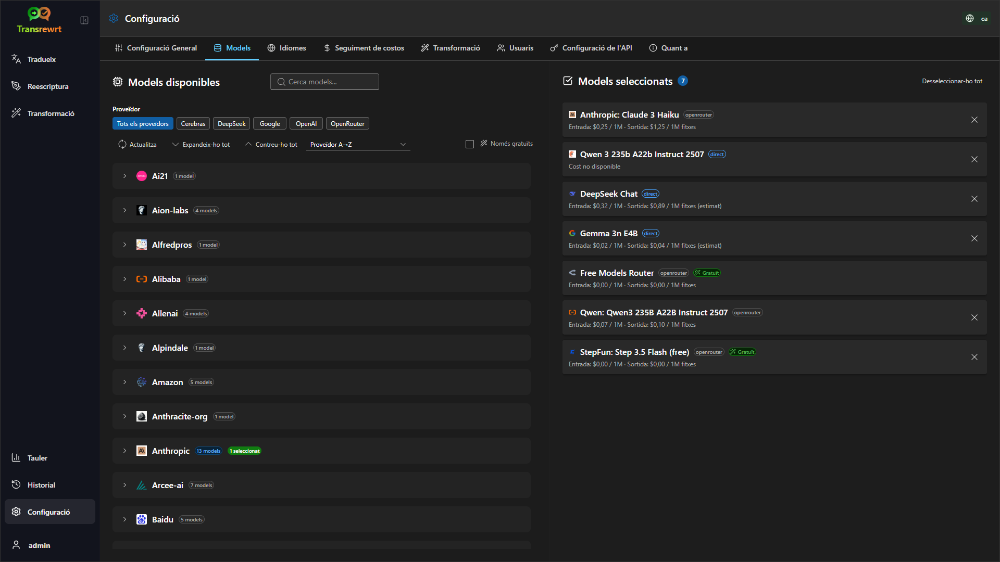

<p align="center">
  
</p>

<p align="center">
  <a href="https://github.com/wsj-br/transrewrt/releases"></a>
  <a href="LICENSE"></a>
  
  
  
</p>

Eina de text amb intel·ligència artificial: tradueix entre idiomes, reescriu en diferents estils i transforma amb indicacions personalitzades — utilitzant múltiples proveïdors d’IA (OpenRouter, OpenAI, Anthropic, Google Gemini, DeepSeek, Groq, Mistral, xAI, i Ollama local). Funciona com a aplicació d’escriptori (Electron) o com a aplicació web autoallotjada (Docker).

- **Tradueix** — entre desenes d'idiomes, amb detecció automàtica de l'idioma origen
- **Reescriu** — corregeix gramàtica, millora la claredat, registre formal/informal, acurça, amplia, tècnic
- **Transforma** — consells personalitzats d'IA; crea i gestiona consells, idioma de destinació opcional per consell
- **Historial** — historial complet d'execucions amb text d'entrada/sortida, filtres i exportació
- **Models i cost** — tria models de qualsevol proveïdor configurat; panells de cost i ús amb registres, resums per model/operació/dia
- **Interfície d'usuari** — interfície multilingüe (més de 30 idiomes, suport RTL), tipografies, ...
- **Mode web** — suport multiusuari amb rols d'administrador
- **Escriptori** — aplicació Electron per a Windows i Linux
- **Autoallotjat** — imatge Docker per a amd64 i arm64 (preparat per Raspberry Pi)

Un cop instal·lat, consulta la **[Guia d'usuari](USER-GUIDE.ca.md)** per una descripció completa de totes les funcions.

<small id="lang-list"> [English (UK)](../README.md) · [Português (BR)](README.pt-BR.md) · [العربية](README.ar.md) · [বাংলা](README.bn.md) · [Català](README.ca.md) · [简体中文](README.zh-CN.md) · [繁體中文](README.zh-TW.md) · [Hrvatski](README.hr.md) · [Čeština](README.cs.md) · [Nederlands](README.nl.md) · [English (US)](README.en-US.md) · [Filipino](README.tl.md) · [Français](README.fr.md) · [Deutsch](README.de.md) · [Ελληνικά](README.el.md) · [हिन्दी](README.hi.md) · [Magyar](README.hu.md) · [Italiano](README.it.md) · [日本語](README.ja.md) · [Basa Jawa](README.jv.md) · [한국어](README.ko.md) · [Bahasa Melayu](README.ms.md) · [فارسی](README.fa.md) · [Polski](README.pl.md) · [Português (PT)](README.pt.md) · [ਪੰਜਾਬੀ](README.pa.md) · [Română](README.ro.md) · [Русский](README.ru.md) · [Slovenčina](README.sk.md) · [Español](README.es.md) · [Kiswahili](README.sw.md) · [Svenska](README.sv.md) · [తెలుగు](README.te.md) · [ภาษาไทย](README.th.md) · [Türkçe](README.tr.md) · [Українська](README.uk.md) · [Tiếng Việt](README.vi.md)</small>

<small id="lang-list"> [English (UK)](../README.md) · [Português (BR)](README.pt-BR.md) · [العربية](README.ar.md) · [বাংলা](README.bn.md) · [Català](README.ca.md) · [简体中文](README.zh-CN.md) · [繁體中文](README.zh-TW.md) · [Hrvatski](README.hr.md) · [Čeština](README.cs.md) · [Nederlands](README.nl.md) · [English (US)](README.en-US.md) · [Filipino](README.tl.md) · [Français](README.fr.md) · [Deutsch](README.de.md) · [Ελληνικά](README.el.md) · [हिन्दी](README.hi.md) · [Magyar](README.hu.md) · [Italiano](README.it.md) · [日本語](README.ja.md) · [Basa Jawa](README.jv.md) · [한국어](README.ko.md) · [Bahasa Melayu](README.ms.md) · [فارسی](README.fa.md) · [Polski](README.pl.md) · [Português (PT)](README.pt-PT.md) · [Română](README.ro.md) · [Русский](README.ru.md) · [Slovenčina](README.sk.md) · [Español](README.es.md) · [Svenska](README.sv.md) · [ไทย](README.th.md) · [Türkçe](README.tr.md) · [Українська](README.uk.md) · [Tiếng Việt](README.vi.md) · [Shqip](README.sq.md) · [සිංහල](README.si.md) · [ગુજરાતી](README.gu.md) · [עִברִית](README.he.md) · [Bosanski](README.bs.md) · [Kiswahili](README.sw.md) · [Norsk](README.no.md) · [Қазақ тілі](README.kk.md) · [తెలుగు](README.te.md)</small>

# Transrewrt

[](https://github.com/fv00/Transrewrt/actions/workflows/build.yml) 
[](LICENSE) 
[](https://github.com/fv00/Transrewrt) 
[](https://github.com/fv00/Transrewrt) 
[](https://codespaces.new/fv00/Transrewrt)

---

## Taula de continguts

- [Resum](#resum)
- [Característiques](#caracaterístiques)
- [Plataformes](#plataformes)
- [Requisits](#requisits)
- [Demo en línia](#demo-en-línia)
- [Instal·lació](#instal·lació)
  - [Electron](#electron)
  - [Descarregar binari](#descarregar-binari)
  - [Docker](#docker)
- [Ús](#ús)
  - [Electron](#electron-1)
  - [Binari](#binari)
  - [Docker](#docker-1)
- [Variables d'entorn](#variables-dentorn)
- [Variables d'entorn de l'API](#variables-dentorn-de-lapi) 
  - [Configuració de l'API de traducció](#configuració-de-lapi-de-traducció)
- [Configuració](#configuració)
- [Desenvolupament](#desenvolupament)
  - [Prerequisits](#prerequisits)
  - [Instal·lació](#instal·lació-1)
- [Contribució](#contribució)
- [Premsa](#premsa)
- [Llicència](#llicència)
- [Contacte](#contacte)

---

## Resum

Transrewrt és una eina d'IA de codi obert per reformular i traduir textos, desenvolupada amb [Electron](https://www.electronjs.org/) i [OpenRouter](https://openrouter.ai/). Transrewrt utilitza models d'IA per reformular i traduir textos de manera eficaç, fent-lo ideal per convertir documents, millorar textos o traduir-los fàcilment. Transrewrt admet diversos models d'IA com ara GPT-3, GPT-4o i MolT5 per tal de proporcionar opcions de qualitat i rendiment personalitzades. 

## Característiques

- ✔️ Traducció de text amb GPT, MolT5, Mistral i altres grans models lingüístics.
- ✔️ Reformulació de textos amb diversos models diferents.
- ✔️ Traducció multilingüe.
- ✔️ Personalització mitjançant variables d'entorn.
- ✔️ Desplegable en diversos sistemes operatius amb paquets Electron.
- ✔️ Desplegament fàcil amb Docker.
- ✔️ Interfície d'usuari simple i fàcil d'usar.
- ✔️ Accés complet via teclat.
- ✔️ Compatible amb d'altres API d'IA com ara OpenRouter, Azure o AWS.
- ✔️ Compatible amb llenguatges amb escriptura de dreta a esquerra com ara l'àrab.
- ✔️ Compatible amb idiomes asiàtics com ara xinès, japonès i coreà.

## Plataformes

- ✅ **Windows** (Windows 7 o superior, x86)
- ✅ **macOS** (10.14 Mojave o superior, ARM64/Apple Silicon i x64)
- ✅ **Linux** (Intel/AMD x86, ARM64)
- ✅ **API**
- ✅ **Docker**

## Requisits

Per utilitzar Transrewrt, necessiteu:

- OpenRouter o una altra clau d'API compatible amb LLM.
  - Vegeu [Configuració de l'API de traducció](#configuració-de-lapi-de-traducció) per saber com afegir claus d'API.
- [Node.js](https://nodejs.org/) versió 18 o superior (només si s'executa des del codi font).

## Demo en línia

- **Versió web**: Prova la demo en línia a [https://transrewrt-web.vercel.app](https://transrewrt-web.vercel.app).
- **Codis espacials**: Obeeixi directament des de GitHub Codespaces fent clic al botó "Utilitza a Codespaces" a la part superior de la pàgina.

## Instal·lació

### Electron

Descarregui i instal·li Transrewrt per al vostre sistema operatiu des de la pàgina de [llançaments](https://github.com/fv00/Transrewrt/releases/latest).

### Descarregar binari

També podeu descarregar la versió d'únic fitxer per al vostre sistema operatiu. Aquests binaris són autònoms i no requereixen instal·lació. Simplement executeu l'arxiu per començar.

### Docker

1. Cloneu el repositori a la vostra màquina local:

   ```bash
   git clone https://github.com/fv00/Transrewrt.git
   cd Transrewrt
   ```

2. Creeu la imatge Docker:

   ```bash
   docker build -t transrewrt:latest .
   ```
3. Inicieu un contenidor Docker amb el port de l'aplicació i les claus d'API:

```bash
   docker run -p 3000:3000 
              -e OPENROUTER_API_KEY=your_api_key 
              transrewrt:latest
```
> ⚠️ Assegureu-vos de substituir `your_api_key` per la vostra clau d'API real.
>
> El contenidor s'iniciarà a `http://localhost:3000`.

## Ús

### Electron

1. Descarregui el paquet Electron per al vostre sistema operatiu.
2. Obriu el fitxer d'instal·lació i seguiu les instruccions del programa d'instal·lació.
3. Un cop instal·lat, executeu Transrewrt des del vostre menú d'aplicacions.

### Binari

1. Descarregui el binari per al vostre sistema operatiu.
2. Feu executable el fitxer (si cal).
3. Executeu el fitxer directament des de la terminal:

   ```bash
   ./transrewrt
   ```

### Docker

1. S'ha creat i executat un contenidor com es mostra a la secció [Docker](#docker).
2. Obriu el vostre navegador i aneu a `http://localhost:3000`.
3. Comenceu a reformular o traduir textos!

## Variables d'entorn

A continuació es mostren les variables d'entorn disponibles per personalitzar Transrewrt. Podeu configurar-les com a variables d'entorn o en un fitxer `.env` a l'arrel del projecte.

| Variable | Descripció | Predeterminat |
|---------|-----------|--------------|
| `OPENROUTER_API_KEY` | Clau d'API per a OpenRouter | `null` |
| `AZURE_OPENAI_API_KEY` | Clau d'API per a Azure OpenAI | `null` |
| `AWS_BEDROCK_ACCESS_KEY_ID` | ID de clau d'accés per a AWS Bedrock | `null` |
| `AWS_BEDROCK_SECRET_ACCESS_KEY` | Clau secreta d'accés per a AWS Bedrock | `null` |
| `MODEL` | Model d'IA a utilitzar (per exemple, `mistralai/Mistral-7B-Instruct-v0.2`) | `GPT-4o` |
| `LANGUAGE` | Llengua de destí per a la traducció (per exemple, `fr` per al francès) | `es` |
| `TEXT` | Text d'entrada per reformular o traduir | `"Hello World"` |
| `MAX_TOKENS` | Nombre màxim de tokens en la resposta | `4096` |
| `TEMPERATURE` | Paraŀlelisme o creativitat en la generació del text (0.0 a 1.0) | `0.7` |
| `TOP_P` | Filtre de mostra de nucli (0.0 a 1.0) | `0.95` |
| `REWRITE_PROMPT` | Instruccions personalitzades per a la reformulació | `Follow the user's instructions to the letter.` |
| `TRANSLATION_PROMPT` | Instruccions per a traducció | `Translate the text into <LANGUAGE>.` |

> 💡 Podeu utilitzar `<LANGUAGE>` a `TRANSLATION_PROMPT` per fer referència a la variable de llengua proporcionada.

## Variables d'entorn de l'API

L'API de Transrewrt permet la traducció fàcil de textos. Podeu utilitzar aquesta API per integrar funcions de traducció a les vostres pròpies aplicacions.

### `POST /rewrite` - Reformular text

Aquest punt d'accés reformula el text segons les instruccions proporcionades.

**Exemple de cURL:**

```bash
curl -X POST http://localhost:3000/rewrite \
  -H "Content-Type: application/json" \
  -d '{
    "text": "The weather is nice today.",
    "prompt": "Make it sound more formal."
  }'
```

**Resposta:**
```json
{ "rewrittenText": "The weather is pleasant today." }
```

### `POST /translate` - Traduir text

Aquest punt d'accés converteix el text a un idioma específic.

**Exemple de cURL:**

```bash
curl -X POST http://localhost:3000/translate \
  -H "Content-Type: application/json" \
  -d '{
    "text": "Hello, how are you?",
    "targetLang": "es"
  }'
```

**Resposta:**
```json
{ "translatedText": "Hola, ¿cómo estás?" }
```

### Configuració de l'API de traducció

Per configurar l'API que es farà servir per a la traducció:

1. Creeu una clau d'API a [OpenRouter](https://openrouter.ai/keys).
2. Afegiu la variable d'entorn `OPENROUTER_API_KEY` o `AZURE_OPENAI_API_KEY`.
3. (Per AWS) Afegiu `AWS_BEDROCK_ACCESS_KEY_ID` i `AWS_BEDROCK_SECRET_ACCESS_KEY` juntament amb el nom de regió (per exemple, `us-west-2`).

> 🔐 Aquestes claus no es carreguen mai al client i es mantenen segures al servidor.

## Configuració

- El fitxer `.env` es pot utilitzar per definir totes les variables d'entorn. Exemple:

  ```env
  OPENROUTER_API_KEY=your_key_here
  MODEL=mistralai/Mistral-7B-Instruct-v0.2
  LANGUAGE=fr
  MAX_TOKENS=2048
  ```

- Els fitxers HTML/JS/CSS es poden personalitzar a `src/renderer/`.
- Podeu modificar `main.js` per canviar la configuració d'Electron o afegir funcionalitats.

## Desenvolupament

### Prerequisits

- [Node.js](https://nodejs.org/) v18 o superior.
- [npm](https://www.npmjs.com/) o [Yarn](https://yarnpkg.com/).

### Instal·lació

```bash
# Cloneu el repositori
git clone https://github.com/fv00/Transrewrt.git
cd Transrewrt

# Instal·leu les dependències
npm install

# Establiu la clau d'API als vostres entorns
export OPENROUTER_API_KEY=your_api_key

# Inicieu l'aplicació en mode de desenvolupament
npm start
```

## Contribució

Les col·laboracions són benvingudes! 

Per contribuir:

1. Fork the project.
2. Creeu una branca per a la teva funció (`git checkout -b feature/amazing-feature`).
3. Feu un commit dels vostres canvis (`git commit -m 'Add some amazing feature'`).
4. Aixequi la branca (`git push origin feature/amazing-feature`).
5. Obrin una sol·licitud d'extracció.

Per a més detalls, vegeu el [GUIDELINES.md](GUIDELINES.md).

## Premsa


Transrewrt va ser llançat a **Product Hunt** el 27 d’abril de 2025 i va rebre una àmplia atenció de la comunitat. Agradem a tots els usuaris que han provat l'eina, deixat comentaris i ens han ajudat a millorar!
Per veure més detalls, visiteu la pàgina de llançament: [https://www.producthunt.com/posts/transrewrt](https://www.producthunt.com/posts/transrewrt)

> Gràcies per fer de Transrewrt un èxit!

## Llicència

Aquest projecte està llicenciat sota la Llicència MIT. Vegeu el fitxer [LICENSE](LICENSE) per obtenir més informació.

## Contacte

Per a preguntes, suggeriments o col·laboracions, obriu una [qüestió](https://github.com/fv00/Transrewrt/issues) al repositori de GitHub o contacteu amb el desenvolupador a [https://github.com/fv00](https://github.com/fv00).

E.pl.md) · [Portuguès (PT)](README.pt.md) · [ਪੰਜਾਬੀ](README.pa.md) · [Romanès](README.ro.md) · [Rus](README.ru.md) · [Eslovac](README.sk.md) · [Espanyol](README.es.md) · [Kiswahili](README.sw.md) · [Suec](README.sv.md) · [తెలుగు](README.te.md) · [Tailandès](README.th.md) · [Turc](README.tr.md) · [Ucraïnès](README.uk.md) · [Vietnamita](README.vi.md)</small>

<small>

> **Nota sobre les traduccions de la interfície i la documentació:** Tots els idiomes de la interfície excepte l'anglès original (UK)
> s'han traduït mitjançant models d'intel·ligència artificial; l'elecció de paraules pot ser imprecisa o contenir errors.

</small>

<br/>

<a id="screenshots"></a>

## Captures de pantalla

**Selector d'idioma**


**Traduir**


**Transformar: editor d'indicacions**


**Tauler**


**Historial**


**Configuració: selecció de models**



<br/><br/>

<a id="table-of-contents"></a>

## Índex

<!-- START doctoc generated TOC please keep comment here to allow auto update -->
<!-- DON'T EDIT THIS SECTION, INSTEAD RE-RUN doctoc TO UPDATE -->

- [Inici ràpid](#quick-start)
- [Instal·lació](#installation)
  - [Windows (Electron)](#windows-electron)
  - [Linux (Electron)](#linux-electron)
  - [Docker](#docker)
  - [Configuració del fus horari](#configuring-the-timezone)
- [Com obtenir una clau API d'OpenRouter](#getting-an-openrouter-api-key)
- [Configuració i entorns](#configuration-and-environment)
- [Desenvolupament i arquitectura](#development-and-architecture)
- [Informar d'incidències](#reporting-issues)
- [Avís legal](#disclaimer)
- [Llicència](#license)

<!-- END doctoc generated TOC please keep comment here to allow auto update -->

<br/><br/>

<a id="quick-start"></a>

## Primers passos

**Docker (recomanat per allotjament propi)**

```bash
docker pull ghcr.io/wsj-br/transrewrt:latest

OPENROUTER_API_KEY=sk-or-your-key docker run -d \
  -p 5000:5000 \
  -v transrewrt-data:/app/data \
  -e OPENROUTER_API_KEY \
  --name transrewrt-web \
  ghcr.io/wsj-br/transrewrt:latest
```

Substituïu `sk-or-your-key` per la vostra [clau API d'OpenRouter](https://openrouter.ai/keys) (o configureu claus d'altres proveïdors; vegeu [Configuració](#configuration-and-environment)). Obriu [http://localhost:5000](http://localhost:5000) i canvieu la contrasenya d'administrador predeterminada abans d'exposar el servei.

<br/>

> ℹ️ **NOTA**<br/>
> Al Docker, les credencials dels LLM es configuren mitjançant variables d'entorn com ara `OPENROUTER_API_KEY`, `OPENAI_API_KEY`, `CEREBRAS_API_KEY`, … (no a través de la interfície web). Al sistema d'escriptori (Electron), configureu les claus a **Configuració → API**.

<br/>

**Windows**

Descarregueu l'últim `Transrewrt Setup x.y.z.exe` des de [Releases](https://github.com/wsj-br/transrewrt/releases), executeu el programa d'instal·lació i llanceu-lo des del menú d'inici o l'accés directe d'escriptori. Introduïu les vostres claus API a **Configuració → API**. Heu de configurar almenys un proveïdor; OpenRouter és comú pels models gratuïts.

<br/>

**Linux**

Descarregueu el fitxer `.AppImage` per al vostre processador des de [Releases](https://github.com/wsj-br/transrewrt/releases) (`x64` per a ordinadors típics, `arm64` per a molts dispositius ARM, incloent Raspberry Pi 4+), i a continuació:

```bash
chmod +x Transrewrt-x.y.z-x64.AppImage && ./Transrewrt-x.y.z-x64.AppImage
```

Introduïu les vostres claus API a **Configuració → API**. Heu de configurar almenys un proveïdor; OpenRouter és comú pels models gratuïts.

A Debian/Ubuntu potser necessiteu instal·lar dependències addicionals primer:

```bash
sudo apt install libgtk-3-0 libnotify-dev libnss3 libxss1 libasound2 libxtst6 xauth
```

Vegeu [Instal·lació → Linux](#linux-electron) per obtenir més detalls.

<br/>

> ℹ️ **NOTA**<br/>

> macOS no és compatible actualment. Transrewrt està disponible per a Windows, Linux i Docker.

<br/>

Un cop l'aplicació estigui en funcionament, consulteu el **[Manual d'usuari](USER-GUIDE.ca.md)** per aprendre com traduir, reescriure i transformar text, gestionar indicacions i configurar models.

<br/><br/>

<a id="installation"></a>

## Instal·lació

<a id="windows-electron"></a>

### Windows (Electron)

- Baixa l'instal·lador més recent des de [Releases](https://github.com/wsj-br/transrewrt/releases).
- Executa l'arxiu `.exe` i segueix les instruccions de l'instal·lador.
- Primera execució: inicia l'aplicació des del menú d'Inici o mitjançant l'atajo d'escriptori.

<br/>

> ℹ️ **NOTA**<br/>
> Windows pot mostrar una d'aquestes advertències de seguretat (normal en aplicacions no signades o independents):
>   - **Control de comptes d'usuari (UAC)**: "Voleu permetre que aquesta aplicació d'un editor desconegut realitzi canvis al vostre dispositiu?" → Clica a **Sí**.
>   - **Microsoft Defender SmartScreen**: "Windows ha protegit el vostre PC" → Clica a **Més informació** → **Executa igualment**.
>
> Això passa perquè l'aplicació no està signada per Microsoft ni per un editor important; però és segura si es baixa des de les nostres versions oficials de GitHub.
> (verifica la suma de verificació SHA256 indicada a continuació).

<br/>

<a id="linux-electron"></a>

### Linux (Electron)

- Baixeu l'arxiu `.AppImage` corresponent (`x64` o `arm64`) des de [Releases](https://github.com/wsj-br/transrewrt/releases).
- Executeu: `chmod +x Transrewrt-x.y.z-x64.AppImage && ./Transrewrt-x.y.z-x64.AppImage` en x86_64/amd64, o utilitzeu el nom de fitxer `...-arm64.AppImage` en ARM64.
- Depèndencies addicionals (Debian/Ubuntu): `sudo apt install libgtk-3-0 libnotify-dev libnss3 libxss1 libasound2 libxtst6 xauth`
- Vegeu [dev/DEVELOPMENT.md](../dev/DEVELOPMENT.md) per obtenir més informació.

<br/>

<a id="docker"></a>

### Docker

- Obté la imatge: `docker pull ghcr.io/wsj-br/transrewrt:latest`
- Defineix com a mínim una clau de proveïdor mitjançant variables d'entorn (per exemple `OPENROUTER_API_KEY` per a OpenRouter). Passa les variables amb `-e` o mitjançant `docker compose` / `.env` per assegurar que els secrets no quedin integrats a la imatge.
- Les claus dels proveïdors **no** s'introdueixen a la interfície web; el servidor les llegeix des de l'entorn.

Exemple: volum amb nom per a persistència (clau OpenRouter via entorn):

```bash
OPENROUTER_API_KEY=sk-or-your-key docker run -d \
  -p 5000:5000 \
  -v transrewrt-data:/app/data \
  -e OPENROUTER_API_KEY \
  --name transrewrt-web \
  ghcr.io/wsj-br/transrewrt:latest
```

O si preferiu utilitzar Docker Compose, feu servir:

```
# descarregueu el fitxer de composició
wget https://github.com/wsj-br/transrewrt/raw/refs/heads/master/production.yml -O transrewrt.yml
# editeu el fitxer per afegir les API_KEYS i ajustar la zona horària (TZ)
vi transrewrt.yml
# inicieu el contenidor
docker compose -f transrewrt.yml up -d

Vegeu [Configuració](#configuration-and-environment) per a totes les variables d'entorn, com ara `PORT`, `CONFIG_PATH`, `TZ` i les claus del LLM (`OPENROUTER_API_KEY`, `OPENAI_API_KEY`, …).

<a id="configuring-the-timezone"></a>

### Configuració del fus horari

La data i hora de la interfície d'usuari de l'aplicació segueixen la configuració regional i el fus horari del **navegador**. Pel comportament del **costat del servidor** (registres i similars), el contenidor utilitza la variable d'entorn `TZ`. El valor predeterminat és `TZ=Europe/London`.

Per utilitzar un altre fus horari, configureu `TZ` al vostre fitxer Compose, per exemple:

```yaml
environment:
  - TZ=America/Sao_Paulo
```

O bé afegiu-la en executar el contenidor (Docker):

```bash
--env TZ=America/Sao_Paulo
```

En molts sistemes Linux podeu copiar el nom del fus horari del sistema amb:

```bash
echo TZ=\"$(</etc/timezone)\"
```

Una llista de noms vàlids de fusos horaris es manté a la [base de dades tz](https://en.wikipedia.org/wiki/List_of_tz_database_time_zones) (Wikipedia).

<br/><br/>

<a id="getting-an-openrouter-api-key"></a>

## Obtenir una clau API d'OpenRouter

Transrewrt admet diversos proveïdors d'IA. [OpenRouter](https://openrouter.ai) és una opció popular perquè agrupa molts models sota una sola clau i ofereix models gratuïts.

1. Registreu-vos o inicieu sessió a [openrouter.ai](https://openrouter.ai).
2. Obriu la pàgina de [Keys](https://openrouter.ai/keys) i creeu una nova clau (doneu-li un nom i, opcionalment, establiu un límit de crèdit). Podeu utilitzar models gratuïts sense afegir crèdit.
3. **Ordinador (Electron):** enganxeu les claus a **Configuració → API**. **Docker:** definiu variables d'entorn com ara `OPENROUTER_API_KEY` (vegeu [Inici ràpid](#quick-start)).

No utilitzeu el model **Body Builder** d'OpenRouter ([`openrouter/bodybuilder`](https://openrouter.ai/openrouter/bodybuilder)) per a les funcions de traduir, reescriure o transformar: retorna càrregues útils de la sol·licitud en format JSON, no el text completat per aquestes tasques. Consulteu [Configuració → Models](USER-GUIDE.ca.md#models) a la Guia d’usuari.

També podeu utilitzar altres proveïdors (OpenAI, Anthropic, Google Gemini, DeepSeek, Groq, Mistral, xAI, Cerebras) o executar models localment amb [Ollama](https://ollama.com). Consulteu [Configuració](#configuration-and-environment) per obtenir la llista completa de proveïdors compatibles i les variables d'entorn.

> ⚠️ **AVÍS**<br/>
> Si esteu utilitzant Ollama des d'un altre dispositiu, contenidor o servei, recordeu configurar Ollama per permetre connexions externes (no només localhost).


Per a límits, BYOK i més, vegeu [autenticació d'OpenRouter](https://openrouter.ai/docs/api/reference/authentication).

<br/><br/>

<a id="configuration-and-environment"></a>

## Configuració i entorn

**Ubicacions del fitxer de configuració**

| Desplegament         | Ubicació del fitxer de configuració                         |
| -------------------- | ----------------------------------------------------------- |
| Electron (Windows)   | `%APPDATA%\transrewrt\`                                     |
| Electron (Linux)     | `~/.config/transrewrt/`                                     |
| Web / Docker         | `/app/data/config.json` (useu un volum per fer-la perdurable) |

<br/>

**Variables d'entorn** (només web/Docker; l'Electron utilitza el fitxer de configuració local)

| Variable         | Predeterminat           | Descripció |
| ---------------- | ----------------------- | ----------- |
| `PORT`           | `5000`                  | Port d'escolta del servidor |
| `CONFIG_PATH`    | `/app/data/config.json` | Camí cap al fitxer de configuració |
| `TZ`             | `Europe/London`         | Zona horària IANA per a l'hora del servidor (registres, etc.); la interfície segueix l'hora del navegador. Vegeu [Docker → zona horària](#docker-timezone) |
| `OPENROUTER_API_KEY` | *(buit)*               | Clau API d'OpenRouter |
| `OPENAI_API_KEY`     | *(buit)*               | Clau API d'OpenAI |
| `CEREBRAS_API_KEY`   | *(buit)*               | Clau API de Cerebras |
| `ANTHROPIC_API_KEY`  | *(buit)*               | Clau API d'Anthropic |
| `GOOGLE_API_KEY`     | *(buit)*               | Clau API de Google Gemini |
| `DEEPSEEK_API_KEY`   | *(buit)*               | Clau API de DeepSeek |
| `GROQ_API_KEY`       | *(buit)*               | Clau API de Groq |
| `MISTRAL_API_KEY`    | *(buit)*               | Clau API de Mistral |
| `OLLAMA_URL`     | *(buit)*               | URL base d'Ollama (per exemple, `http://host.docker.internal:11434`) |
| `XAI_API_KEY`        | *(buit)*               | Clau API de xAI |

Configureu només els proveïdors que utilitzeu. Els IDs de model tenen espai de noms (`openrouter/…`, `openai/…`, `cerebras/…`, `ollama/…`, etc.).

**Mostra de costos:** OpenRouter retorna el cost exacte quan és aplicable. Altres proveïdors utilitzen el cost **estimat** dels preus públics de models d'OpenRouter quan es disposa d'una clau OpenRouter; sense aquesta clau, el cost dels no-OpenRouter pot mostrar-se com `0`. Els càlculs no són factures.

<br/>

**Dades i persistència:** Per a Docker, munteu un volum a `/app/data` perquè `config.json` i la base de dades SQLite persisteixen en reiniciar el contenidor. Sense un volum, totes les dades es perden quan s'atura el contenidor.

**Desenvolupadors:** Després d'actualitzar canvis que substitueixen l'antiga configuració d'una única clau, reinicieu o combineu `data/config.json` amb la nova forma per defecte des de `src/config-defaults/config_default.json` si el vostre fitxer local encara utilitza camps eliminats (`api_key`, `api_url`, opcions de servidor intermediari).

<br/>

**Autenticació web:**

- Administrador per defecte: `admin` / `transrewrt26`.
- Gestioneu els usuaris a **Configuració → Usuaris**.

- Restablir una contrasenya: `docker exec <container> reset-web-password '<username>' '<new-password>'`  
  (des de la font: `pnpm run reset-web-password -- <username> <new-password>`)

<br/>

> ⚠️ **ADVERTÈNCIA**<br/>
> Canvia immediatament la contrasenya predeterminada de l'administrador en qualsevol ordinador accessible a través de xarxa.

<br/>

Les principals configuracions (tipus de lletra, models, idiomes, etc.) estan disponibles a la secció de Configuració de l'aplicació.

<br/><br/>

<a id="development-and-architecture"></a>

## Desenvolupament i arquitectura

- **Desenvolupament:** Configuració, construcció, proves i desplegament (Electron, Web, Docker) - vegeu **[dev/DEVELOPMENT.md](../dev/DEVELOPMENT.md)**.
- **Arquitectura i visió general del sistema:** Estructura de carpetes, tecnologies utilitzades, decisions de disseny - vegeu **[dev/SYSTEM-OVERVIEW.md](../dev/SYSTEM-OVERVIEW.md)**.

<br/><br/>

<a id="reporting-issues"></a>

## Informar de problemes

Obre una incidència a [GitHub](https://github.com/wsj-br/transrewrt/issues). Inclou la teva plataforma (Windows / Linux / Docker) i la versió de l'aplicació (que es mostra al diàleg Quant a o a la pàgina de Llançaments).

<br/><br/>

<a id="disclaimer"></a>

## Avís legal

Només s’utilitzen per finalitats d'identificació els noms i les icones dels productes, que pertanyen als seus respectius propietaris. Aquest programari no està lligat ni comptat amb el suport de cap de les marques esmentades.

<br/><br/>

<a id="license"></a>

## Llicència

Copyright © 2026 Waldemar Scudeller Jr.

[Llicència Apache 2.0](LICENSE)