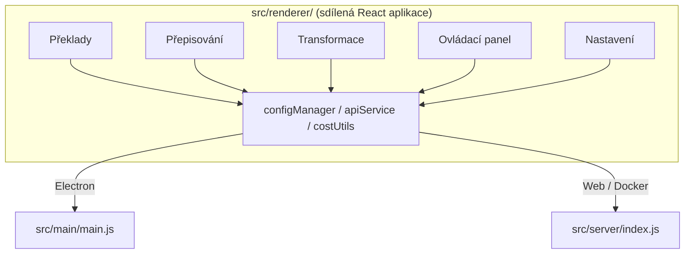

<p align="center">
  
</p>

<h1 align="center">Transrewrt</h1>

<p align="center">
  <a href="https://github.com/wsj-br/transrewrt/releases"></a>
  <a href="LICENSE"></a>
  
  
  
</p>

AI-podporovaný textový nástroj: překládejte mezi jazyky, přepisujte v různých stylech a transformujte pomocí vlastních promptů – vše prostřednictvím [OpenRouter](https://openrouter.ai). Funguje jako desktopová aplikace (Electron) nebo jako self-hostovaná webová aplikace (Docker).

- **Překlady** – mezi desítkami jazyků, s automatickým rozpoznáním zdrojového jazyka
- **Přepis** – oprava gramatiky, vylepšení srozumitelnosti, formální/neformální, zkrácení, rozšíření, technické
- **Transformace** – vlastní AI prompty; vytváření a správa promptů, volitelný cílový jazyk pro každý prompt
- **Modely a náklady** – výběr libovolného modelu OpenRouter; přehled nákladů s SQLite logem, souhrny podle modelu/operace/dne
- **UI** – internationalizace (pt-BR, de, fr, es, RTL), motivy, písma, klávesové zkratky; bezpečný webový režim (API klíč pouze na serveru)
- **Desktop** – Electron aplikace pro Windows a Linux
- **Self-hostování** – Docker image pro amd64 & arm64 (připraveno pro Raspberry Pi)

Po instalaci si projděte **[Uživatelská příručka](../USER-GUIDE.md)** pro úplný průvodce všemi funkcemi.

<small>**Přečtěte si v jiných jazycích:** [English (UK)](../README.md) · [Português (BR)](README.pt-BR.md) · [العربية](README.ar.md) · [বাংলা](README.bn.md) · [Català](README.ca.md) · [简体中文](README.zh-CN.md) · [繁體中文](README.zh-TW.md) · [Hrvatski](README.hr.md) · [Čeština](README.cs.md) · [Nederlands](README.nl.md) · [English (US)](README.en-US.md) · [Filipino](README.tl.md) · [Français](README.fr.md) · [Deutsch](README.de.md) · [Ελληνικά](README.el.md) · [हिन्दी](README.hi.md) · [Magyar](README.hu.md) · [Italiano](README.it.md) · [日本語](README.ja.md) · [Basa Jawa](README.jv.md) · [한국어](README.ko.md) · [Bahasa Melayu](README.ms.md) · [فارسی](README.fa.md) · [Polski](README.pl.md) · [Português (PT)](README.pt.md) · [ਪੰਜਾਬੀ](README.pa.md) · [Română](README.ro.md) · [Русский](README.ru.md) · [Slovenčina](README.sk.md) · [Español](README.es.md) · [Kiswahili](README.sw.md) · [Svenska](README.sv.md) · [తెలుగు](README.te.md) · [ภาษาไทย](README.th.md) · [Türkçe](README.tr.md) · [Українська](README.uk.md) · [Tiếng Việt](README.vi.md)</small>

<a id="screenshots"></a>
## Screenshoty

**Výběr jazyka**


**Překlad**


**Transformace - editor promptů**


**Řídicí panel**


**Nastavení - výběr modelu**


<br /><br />

<a id="table-of-contents"></a>
## Obsah

<!-- START doctoc generated TOC please keep comment here to allow auto update -->
<!-- DON'T EDIT THIS SECTION, INSTEAD RE-RUN doctoc TO UPDATE -->

- [Rychlý start](#quick-start)
- [Instalace](#installation)
  - [Windows (Electron)](#windows-electron)
  - [Linux (Electron)](#linux-electron)
  - [Docker](#docker)
- [Získání OpenRouter API klíče](#getting-an-openrouter-api-key)
- [Konfigurace a prostředí](#configuration-and-environment)
- [Vývoj a architektura](#development-and-architecture)
- [Vydání a tagy](#releases-and-tags)
- [Přispívání](#contributing)
- [Právní upozornění](#disclaimer)
- [Licence](#license)

<!-- END doctoc generated TOC please keep comment here to allow auto update -->

<br /><br />

<a id="quick-start"></a>

## Rychlý start

**Docker (doporučeno pro vlastní hostování)**

```bash
docker pull ghcr.io/wsj-br/transrewrt:latest

API_KEY=sk-or-your-key docker run -d \
  -p 5000:5000 \
  -v transrewrt-data:/app/data \
  -e API_KEY \
  --name transrewrt-web \
  ghcr.io/wsj-br/transrewrt:latest
```

Nahraďte `sk-or-your-key` svým [API klíčem OpenRouter](https://openrouter.ai/keys). Otevřete [http://localhost:5000](http://localhost:5000) a změňte výchozí heslo správce, než službu zpřístupníte.

<br />

> ℹ️ **POZNÁMKA**<br/>
> V Dockeru je API klíč OpenRouter nastaven pouze pomocí proměnné prostředí `API_KEY` (ne v webovém rozhraní). Na ploše (Electron) jej vložíte v **Nastavení → API**.

<br />

**Windows**

Stáhněte si nejnovější `Transrewrt Setup x.y.z.exe` z [Releases](https://github.com/wsj-br/transrewrt/releases), spusťte instalátor a poté aplikaci spusťte z nabídky Start nebo z ikony na ploše. Zadejte svůj API klíč OpenRouter v **Nastavení → API**.

<br />

**Linux**

Stáhněte si `.AppImage` soubor z [Releases](https://github.com/wsj-br/transrewrt/releases), poté:

```bash
chmod +x Transrewrt-x.y.z.AppImage && ./Transrewrt-x.y.z.AppImage
```

Zadejte svůj API klíč OpenRouter v **Nastavení → API**. Na Debianu/Ubuntu může být potřeba nejprve nainstalovat další závislosti:

```bash
sudo apt install libgtk-3-0 libnotify-dev libnss3 libxss1 libasound2 libxtst6 xauth
```

Podrobnosti naleznete v [Instalace → Linux](#linux-electron).

<br />

> ℹ️ **POZNÁMKA**<br/>
> macOS aktuálně není podporován. Transrewrt je dostupný pro Windows, Linux a Docker.

<br />

Jakmile je aplikace spuštěna, podívejte se na **[Uživatelská příručka](../USER-GUIDE.md)**, kde se dozvíte, jak překládat, přepisovat a transformovat text, spravovat výzvy a konfigurovat modely.

<br /><br />

<a id="installation"></a>
## Instalace

<a id="windows-electron"></a>
### Windows (Electron)

- Stáhněte si nejnovější instalátor z [Releases](https://github.com/wsj-br/transrewrt/releases).
- Spusťte `.exe` soubor a postupujte podle instalačního programu.
- První spuštění: spusťte aplikaci z nabídky Start nebo z ikony na ploše. Konfigurace je uložena v `%APPDATA%\transrewrt\`.

<br />

<a id="linux-electron"></a>
### Linux (Electron)

- Stáhněte si `.AppImage` soubor z [Releases](https://github.com/wsj-br/transrewrt/releases).
- Spusťte: `chmod +x Transrewrt-x.y.z.AppImage && ./Transrewrt-x.y.z.AppImage`
- Další závislosti (Debian/Ubuntu): `sudo apt install libgtk-3-0 libnotify-dev libnss3 libxss1 libasound2 libxtst6 xauth`
- Další informace naleznete v [dev/DEVELOPMENT.md](../dev/DEVELOPMENT.md).

<br />

<a id="docker"></a>
### Docker

- Stáhněte image: `docker pull ghcr.io/wsj-br/transrewrt:latest`
- API klíč OpenRouter **musí** být nastaven pomocí proměnné prostředí `API_KEY`. Předávejte jej s `-e API_KEY` (nebo přes `docker compose` / `.env`), aby nebyl klíč viditelný v seznamu procesů.
- API klíč nelze zadat ve webovém rozhraní.

Příklad - pojmenovaný svazek pro trvalost (API klíč předán prostřednictvím env, ne na příkazovém řádku):

```bash
API_KEY=sk-or-your-key docker run -d \
  -p 5000:5000 \
  -v transrewrt-data:/app/data \
  -e API_KEY \
  --name transrewrt-web \
  ghcr.io/wsj-br/transrewrt:latest
```

<br />

| Možnost   | Popis                                                                                                   |
| -------- | ------------------------------------------------------------------------------------------------------- |
| Port     | `5000` (mapovat s `-p 5000:5000`)                                                                       |
| Svazek   | Připojte `/app/data` pro trvalost konfigurace a databáze                                               |
| Proměnné prostředí | `PORT`, `CONFIG_PATH`, `API_KEY`, `API_URL`, `KEY_SEED` - viz [Konfigurace](#configuration-and-environment) |

Pro sestavení a spuštění ze zdrojového kódu: `docker compose up --build -d` nebo `pnpm run docker:up` - viz [dev/DEVELOPMENT.md](../dev/DEVELOPMENT.md).

<br /><br />

<a id="getting-an-openrouter-api-key"></a>
## Získání API klíče OpenRouter

Transrewrt používá [OpenRouter](https://openrouter.ai) pro AI modely. Pro překlad, přepis nebo transformaci textu potřebujete API klíč.

1. Zaregistrujte se nebo přihlaste na [openrouter.ai](https://openrouter.ai).
2. Otevřete stránku [Klíče](https://openrouter.ai/keys) a vytvořte nový klíč (pojmenujte jej a případně nastavte kreditní limit). Můžete používat bezplatné modely bez přidání kreditu.
3. **Plocha (Electron):** vložte klíč v **Nastavení → API**. **Docker:** nastavte proměnnou prostředí `API_KEY` (viz [Rychlý start](#quick-start)).

Informace o limitech, BYOK a dalších naleznete v [OpenRouter authentication](https://openrouter.ai/docs/api/reference/authentication).

<br /><br />

<a id="configuration-and-environment"></a>

## Konfigurace a prostředí

**Umístění konfiguračních souborů**

| Nasazení         | Umístění konfigurace                                   |
| ---------------- | ----------------------------------------------------- |
| Electron (Windows) | `%APPDATA%\transrewrt\`                            |
| Electron (Linux)   | `~/.config/transrewrt/`                            |
| Web / Docker       | `/app/data/config.json` (pro trvalost použijte svazek) |

<br />

**Proměnné prostředí** (pouze web/Docker; Electron používá místní konfigurační soubor)

| Proměnná      | Výchozí                        | Popis                                                   |
| ------------- | ------------------------------ | ------------------------------------------------------- |
| `PORT`        | `5000`                         | Port, na kterém naslouchá server                        |
| `CONFIG_PATH` | `/app/data/config.json`        | Cesta ke konfiguračnímu souboru                         |
| `API_KEY`     | *(prázdné)*                    | OpenRouter API klíč (vyžadován pro Docker; nastavte přes env, ne UI) |
| `API_URL`     | `https://openrouter.ai/api/v1` | Základní URL nadřazeného AI API                        |
| `KEY_SEED`    | *(prázdné)*                    | Transrewrt proxy klíčový seed (přepíše konfiguraci, pokud je nastaven) |

<br />

**Data a trvalost:** Pro Docker namontujte svazek na `/app/data`, aby `config.json` a SQLite databáze přetrvaly restart kontejneru. Bez svazku se všechna data po zastavení kontejneru ztratí.

<br />

**Webová autentizace:**

- Výchozí admin: `admin` / `transrewrt26`.
- Správa uživatelů v **Nastavení → Uživatelé**.
- Reset hesla: `docker exec <kontejner> reset-web-password '<uživatelské_jméno>' '<nové_heslo>'`
  (ze zdroje: `pnpm run reset-web-password -- <uživatelské_jméno> <nové_heslo>`)

<br />

> ⚠️ **VAROVÁNÍ**<br/>
> Okamžitě změňte výchozí heslo admina na každém hostiteli přístupném přes síť.

<br />

**Transrewrt proxy (volitelné):** Můžete směrovat provoz API přes externí proxy, které používá časově založený rotující klíč. V **Nastavení → API**, povolte **Použít Transrewrt Proxy**, nastavte **Klíčový seed** a nastavte **API URL** na základní URL proxy. Podrobnosti viz [dev/SYSTEM-OVERVIEW.md](../dev/SYSTEM-OVERVIEW.md).

Klíčové nastavení (téma, písmo, modely, jazyky atd.) jsou k dispozici v dialogu Nastavení nebo je lze přímo upravit v konfiguračním JSON. Úplný seznam a výchozí hodnoty jsou zdokumentovány v [dev/DEVELOPMENT.md](../dev/DEVELOPMENT.md).

<br /><br />

<a id="development-and-architecture"></a>
## Vývoj a architektura

- **Vývoj:** Nastavení, sestavení, testování a nasazení (Electron, Web, Docker) – viz **[dev/DEVELOPMENT.md](../dev/DEVELOPMENT.md)**.
- **Architektura a přehled systému:** Struktura složek, technologický stack, rozhodnutí o designu, Transrewrt proxy – viz **[dev/SYSTEM-OVERVIEW.md](../dev/SYSTEM-OVERVIEW.md)**.



<br /><br />

<a id="releases-and-tags"></a>
## Vydání a tagy

- **Git tagy** `v`* (např. `v1.0.10`) spouští [vydávací workflow](.github/workflows/release.yml). **GitHub Releases** připojují instalační program pro Windows (`.exe`) a Linux AppImage.
- **Docker obrazy** jsou publikovány na `ghcr.io/wsj-br/transrewrt`. Tagy imagí odpovídají Git verzi (např. `v1.0.10` → `ghcr.io/wsj-br/transrewrt:1.0.10`) a navíc `latest`. Multi-arch: `linux/amd64` a `linux/arm64` (např. Raspberry Pi).

<br /><br />

<a id="contributing"></a>
## Přispívání

1. Vytvořte fork repozitáře.
2. Vytvořte větev pro funkci: `git checkout -b feature/moje-funkce`
3. Potvrďte své změny s jasnou zprávou.
4. Odešlete a otevřete Pull Request proti `main`.

Respektujte existující styl kódu a otestujte své změny v režimech Electron i web před odesláním. Pokyny k sestavení a testování viz [dev/DEVELOPMENT.md](../dev/DEVELOPMENT.md).

<br />

**Hlášení problémů:** Otevřete issue na [GitHubu](https://github.com/wsj-br/transrewrt/issues). Uveďte svoji platformu (Windows / Linux / Docker) a verzi aplikace (zobrazenou v dialogu O aplikaci nebo na stránce Releases).

<br /><br />

<a id="disclaimer"></a>

## Upozornění

Názvy produktů a ikony patří jejich příslušným vlastníkům a jsou používány pouze pro identifikační účely. Tento software není spjat ani podporován žádnou z uvedených značek.

<br /><br />

<a id="license"></a>
## Licence

Copyright © 2026 Waldemar Scudeller Jr.

[Apache License 2.0](LICENSE)