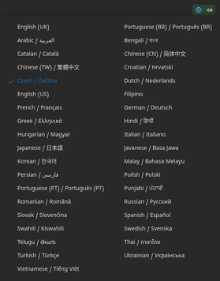
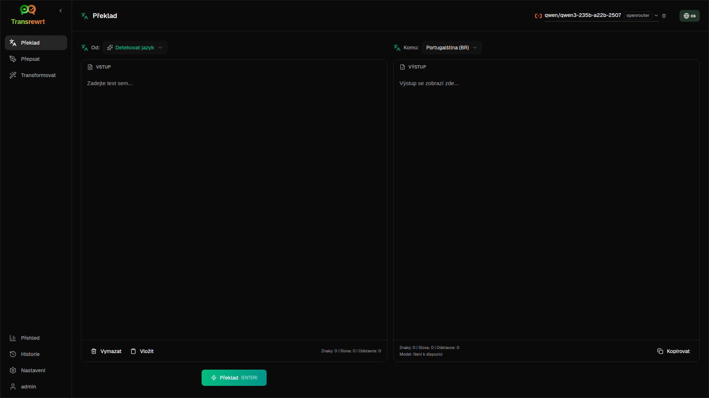
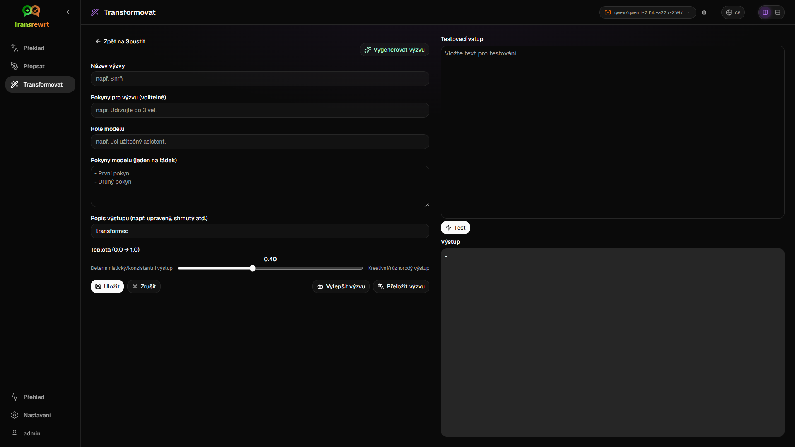
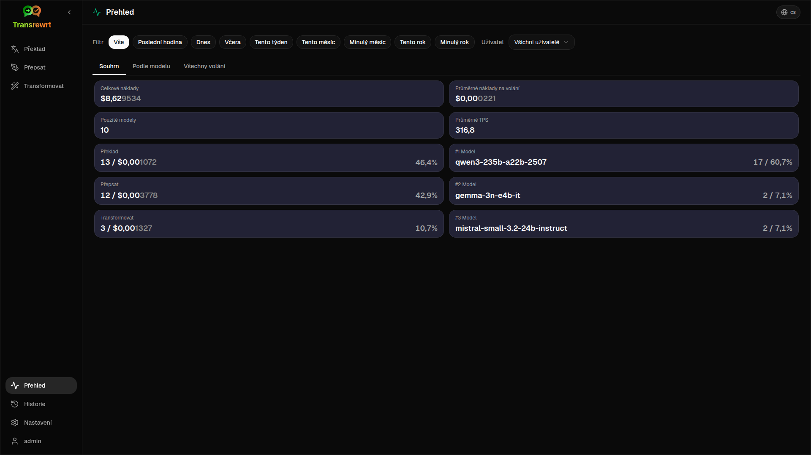
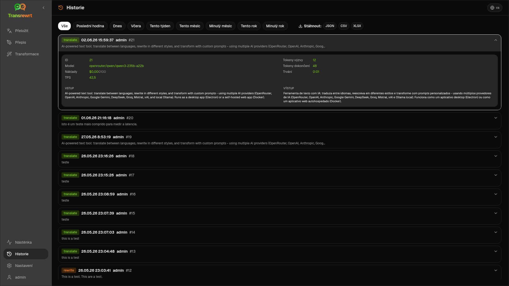
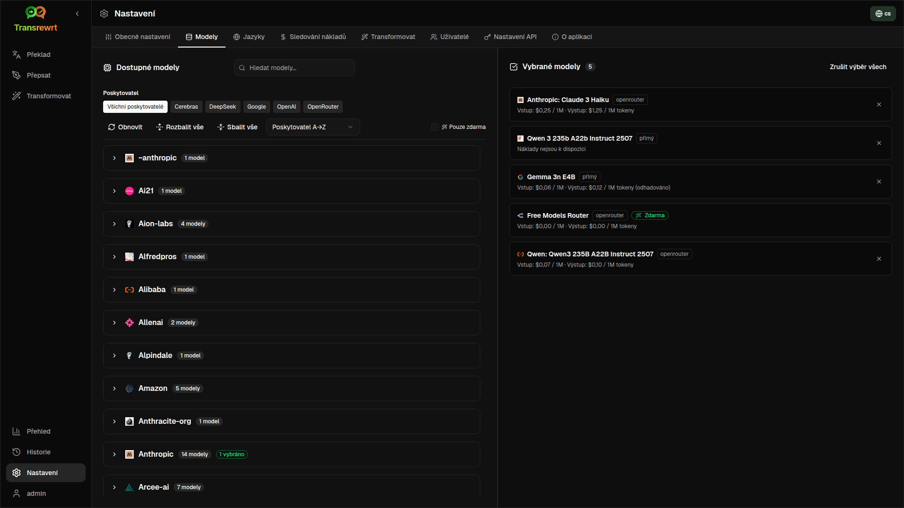

<p align="center">
  
</p>

<p align="center">
  <a href="https://github.com/wsj-br/transrewrt/releases"></a>
  <a href="LICENSE"></a>
  
  
  
</p>

Nástroj pro text s využitím umělé inteligence: překládání mezi jazyky, přepis v různých stylech a transformace pomocí vlastních promptů – s využitím více poskytovatelů umělé inteligence (OpenRouter, OpenAI, Anthropic, Google Gemini, DeepSeek, Groq, Mistral, xAI a lokální Ollama). Funguje jako desktopová aplikace (Electron) nebo jako samostatně hostovaná webová aplikace (Docker).

- **Překlad** – mezi desítkami jazyků s automatickým rozpoznáním zdrojového jazyka
- **Přepsat** – oprava gramatiky, zlepšení srozumitelnosti, formální/neformální styl, zkrácení, rozšíření, technický obsah
- **Transformovat** – vlastní výzvy AI; vytváření a správa výzev, volitelný cílový jazyk pro každou výzvu
- **Historie** – kompletní historie spuštění s vstupním a výstupním textem, filtrováním a exportem
- **Modely a náklady** – výběr modelů od libovolného nakonfigurovaného poskytovatele; přehledy nákladů a využití s logy, shrnutí podle modelu/operace/dne
- **Uživatelské rozhraní** – multilingvní rozhraní (30+ jazyků, podpora RTL), písma, ...
- **Webový režim** – podpora více uživatelů s administračními rolemi
- **Desktop** – Electron aplikace pro Windows a Linux
- **Self-hosted** – Docker image pro amd64 & arm64 (připraveno pro Raspberry Pi)

Jakmile je nainstalováno, podívejte se na [**Uživatelskou příručku**](USER-GUIDE.cs.md) pro podrobný průvodce všemi funkcemi.

<small>**Přečtěte si v jiných jazycích:** </small>
<small id="lang-list">[English (GB)](../README.md) · [Português (Brasil)](./README.pt-BR.md) · [العربية](./README.ar.md) · [বাংলা](./README.bn.md) · [Català](./README.ca.md) · [中文 (中国大陆)](./README.zh-CN.md) · [中文 (台灣)](./README.zh-TW.md) · [Hrvatski](./README.hr.md) · [Čeština](./README.cs.md) · [Nederlands](./README.nl.md) · [English (US)](./README.en-US.md) · [Tagalog](./README.tl.md) · [Français](./README.fr.md) · [Deutsch](./README.de.md) · [Ελληνικά](./README.el.md) · [हिन्दी](./README.hi.md) · [Magyar](./README.hu.md) · [Italiano](./README.it.md) · [日本語](./README.ja.md) · [한국어](./README.ko.md) · [Bahasa Melayu](./README.ms.md) · [فارسی](./README.fa.md) · [Polski](./README.pl.md) · [Basa Jawa](./README.jv.md) · [Português](./README.pt.md) · [ਪੰਜਾਬੀ](./README.pa.md) · [Română](./README.ro.md) · [Русский](./README.ru.md) · [Slovenčina](./README.sk.md) · [Español](./README.es.md) · [Kiswahili](./README.sw.md) · [Svenska](./README.sv.md) · [తెలుగు](./README.te.md) · [ไทย](./README.th.md) · [Türkçe](./README.tr.md) · [Українська](./README.uk.md) · [Tiếng Việt](./README.vi.md)</small>

<small>

> **Poznámka k překladům uživatelského rozhraní a dokumentace:** Všechny jazyky rozhraní kromě původního angličtiny (UK)
> byly přeloženy pomocí modelů umělé inteligence; vyjádření může být nepřesné nebo obsahovat chyby.

</small>

<br/>

<a id="table-of-contents"></a>
## Obsah

<!-- START doctoc generated TOC please keep comment here to allow auto update -->
<!-- DON'T EDIT THIS SECTION, INSTEAD RE-RUN doctoc TO UPDATE -->

- [Snímky obrazovky](#screenshots)
- [Rychlý start](#quick-start)
- [Získání OpenRouter API klíče](#getting-an-openrouter-api-key)
- [Konfigurace a prostředí](#configuration-and-environment)
- [Vývoj a architektura](#development-and-architecture)
- [Hlášení problémů](#reporting-issues)
- [Právní upozornění](#disclaimer)
- [Licence](#license)

<!-- END doctoc generated TOC please keep comment here to allow auto update -->

<br/><br/>

<a id="screenshots"></a>
## Snímky obrazovky

**Výběr jazyka**



**Přeložit**



**Transformace – editor promptu**



**Dashboard**



**Historie**



**Nastavení – výběr modelu**



<br/><br/>

<a id="quick-start"></a>
## Rychlý start

<details>
<summary><b>Docker (doporučeno pro samoobslužné hostování)</b></summary>

<a id="docker"></a>

<br/>

```bash
docker pull ghcr.io/wsj-br/transrewrt:latest

OPENROUTER_API_KEY=sk-or-your-key docker run -d \
  -p 5000:5000 \
  -v transrewrt-data:/app/data \
  -e OPENROUTER_API_KEY \
  --name transrewrt-web \
  ghcr.io/wsj-br/transrewrt:latest
```

Nahraďte `sk-or-your-key` vaším [klíčem k API OpenRouter](https://openrouter.ai/keys) (nebo nastavte klíče jiných poskytovatelů; viz [Konfigurace](#configuration-and-environment)). Otevřete [http://localhost:5000](http://localhost:5000) a změňte výchozí heslo správce, než službu zpřístupníte.

Nastavte alespoň jeden klíč poskytovatele prostřednictvím prostředí (např. `OPENROUTER_API_KEY` pro OpenRouter). Předejte proměnné pomocí `-e` nebo `docker compose` / `.env`, aby se tajemství neuložila přímo do image. Klíče poskytovatelů se **ne** zadávají přes webové rozhraní; server je čte z prostředí.

<br/>

> ℹ️ **POZNÁMKA**<br/>
> V Dockeru se přihlašovací údaje k LLM nastavují pomocí proměnných prostředí, jako jsou `OPENROUTER_API_KEY`, `OPENAI_API_KEY`, `CEREBRAS_API_KEY`, … (ne přes webové rozhraní). Na ploše (Electron) klíče konfigurujete v části **Nastavení → API**.

<br/>

Nebo použijte Docker Compose:

```bash
# download the compose file
wget https://github.com/wsj-br/transrewrt/raw/refs/heads/master/production.yml -O transrewrt.yml
# Edit the file to add your API keys (API_KEYs), or uncomment and adjust the `.env` file. Set the timezone (TZ) if necessary.
vi transrewrt.yml
# start the container
docker compose -f transrewrt.yml up -d
```

Kompletní seznam proměnných prostředí, jako jsou `PORT`, `CONFIG_PATH`, `TZ` a klíče k LLM (`OPENROUTER_API_KEY`, `OPENAI_API_KEY`, …), najdete v části [Konfigurace](#configuration-and-environment).

</details>

<br/>

<details>
<summary><b>Časové pásmo serveru (Docker)</b></summary>

<a id="configuring-the-timezone"></a>

<br/>

Datum a čas v uživatelském rozhraní aplikace respektují lokalitu a časové pásmo vašeho **prohlížeče**. Co se týče **chování na straně serveru** (např. protokolování), kontejner používá proměnnou prostředí `TZ`. Výchozí hodnota je `TZ=Europe/London`.

Chcete-li použít jiné časové pásmo, nastavte `TZ` ve vašem souboru Compose, například:

```yaml
environment:
  - TZ=America/Sao_Paulo
```

Nebo ji předejte při spouštění kontejneru (Docker):

```bash
--env TZ=America/Sao_Paulo
```

Na mnoha Linuxových systémech můžete název systémového časového pásma zkopírovat pomocí:

```bash
echo TZ=\"$(</etc/timezone)\"
```

Seznam platných názvů časových pásem je udržován v [databázi tz](https://en.wikipedia.org/wiki/List_of_tz_database_time_zones) (Wikipedie).

</details>

<br/>

<details>
<summary><b>Windows</b></summary>

<a id="windows-electron"></a>

<br/>

- Stáhněte si nejnovější `Transrewrt Setup x.y.z.exe` z části [Releases](https://github.com/wsj-br/transrewrt/releases).
- Spusťte `.exe` a postupujte podle pokynů instalátoru.
- Při prvním spuštění: spusťte aplikaci z nabídky Start nebo přes zástupce na ploše.
- Zadejte své klíče API v části **Nastavení → API**. Musíte nakonfigurovat alespoň jednoho poskytovatele; OpenRouter je běžný pro modely zdarma.

<br/>

> ℹ️ **POZNÁMKA**<br/>
> Windows mohou zobrazit jedno z těchto varování o zabezpečení (běžné u nepodepsaných nebo nezávislých aplikací):
>   - **Kontrola účtu uživatele (UAC)**: „Chcete povolit této aplikaci od neznámého vydavatele provést změny na vašem zařízení?“ → Klikněte na **Ano**.
>   - **Microsoft Defender SmartScreen**: „Windows chrání váš počítač“ → Klikněte na **Více informací** → **Přesto spustit**.
>
> K tomu dochází, protože aplikace není podepsaná společností Microsoft nebo velkým vydavatelem – je bezpečná, pokud ji stáhnete z našich oficiálních vydání na GitHubu (ověřte kontrolní součty na stránce [Releases](https://github.com/wsj-br/transrewrt/releases) u každého souboru).

<br/>

</details>

<br/>

<details>
<summary><b>Linux</b></summary>

<a id="linux-electron"></a>

<br/>

Stáhněte si `.AppImage` pro své CPU z [Releases](https://github.com/wsj-br/transrewrt/releases) (`x64` pro běžné počítače, `arm64` pro mnoho zařízení ARM, včetně Raspberry Pi 4+), poté:

```bash
chmod +x Transrewrt-x.y.z-x64.AppImage && ./Transrewrt-x.y.z-x64.AppImage
```

Na x86_64/amd64 použijte název souboru `x64`; na ARM64 použijte název `...-arm64.AppImage`.

Zadejte své API klíče v **Nastavení → API**. Musíte nakonfigurovat alespoň jednoho poskytovatele; OpenRouter je běžný výběr pro bezplatné modely.

**Zprávy v konzoli:** Balíčkové verze pro Linux (`x64` a `arm64` AppImages) potlačují upozornění Node o zastarání v terminálu (například vestavěný modul `punycode`). Pokud Chromium zobrazuje chyby GPU / EGL, jako například „GLES3 není podporován“, ale aplikace funguje, můžete je potlačit zakázáním hardwarového zrychlení:

```bash
TRANSREWRT_DISABLE_GPU=1 ./Transrewrt-x.y.z-arm64.AppImage
```

To platí i pro amd64; změňte název souboru tak, aby odpovídal vašemu staženému souboru.

V Debianu/Ubuntu možná budete potřebovat další knihovny **runtime**, které vyžaduje Chromium (tyto jsou často již přítomny v kompletních desktopových instalacích). Spusťte níže uvedené příkazy, pokud je to potřeba:

```bash
sudo apt update
sudo apt install -y libfuse2 libgtk-3-0 libnotify4 libnss3 libnspr4 libxss1 libxtst6 xdg-utils \
     xauth libatspi2.0-0 libdrm2 libgbm1 libxcb-dri3-0 libcups2 libasound2t64
```

nahraďte `libasound2t64` za `libasound2` pro `arm64`. Minimální nebo vlastní instalace mohou stále selhat kvůli chybějícímu souboru `.so`. Nainstalujte balíček uvedený v chybové zprávě (běžné doplňky: `libatk1.0-0`, `libatk-bridge2.0-0`, `libgbm1`, `libdrm2`). V některých prostředích možná budete muset aplikaci spustit pomocí `APPIMAGE_EXTRACT_AND_RUN=1 ./Transrewrt-….AppImage`.

<br/>

> ℹ️ **POZNÁMKA**<br/>
> macOS není momentálně podporován. Transrewrt je dostupný pro Windows, Linux a Docker.

</details>

<br/>

Jakmile aplikace běží, podívejte se na [**Uživatelskou příručku**](USER-GUIDE.cs.md) a naučte se, jak překládat, přepisovat a transformovat text, spravovat výzvy a konfigurovat modely.

<br/><br/>

<a id="getting-an-openrouter-api-key"></a>
## Získání API klíče OpenRouter

Transrewrt podporuje více poskytovatelů umělé inteligence. [OpenRouter](https://openrouter.ai) je oblíbenou volbou, protože agreguje mnoho modelů pod jedním klíčem a nabízí bezplatné modely.

1. Zaregistrujte se nebo se přihlaste na [openrouter.ai](https://openrouter.ai).
2. Otevřete stránku [Keys](https://openrouter.ai/keys) a vytvořte nový klíč (pojmenujte ho a volitelně nastavte limit kreditu). Můžete používat bezplatné modely i bez přidání kreditu.
3. **Desktop (Electron):** vložte klíče do **Nastavení → API**. **Docker:** nastavte proměnné prostředí, např. `OPENROUTER_API_KEY` (viz [Rychlý start](#quick-start)).

Nepoužívejte model OpenRouteru **Body Builder** ([`openrouter/bodybuilder`](https://openrouter.ai/openrouter/bodybuilder)) pro překlad, přepis nebo transformaci: vrací datové části JSON požadavků, nikoli dokončený text pro tyto úkoly. Viz [Nastavení → Modely](USER-GUIDE.cs.md#models) v Uživatelské příručce.

Můžete také použít jiné poskytovatele (OpenAI, Anthropic, Google Gemini, DeepSeek, Groq, Mistral, xAI, Cerebras) nebo spouštět modely lokálně pomocí [Ollama](https://ollama.com). Úplný seznam podporovaných poskytovatelů a proměnných prostředí najdete v části [Konfigurace](#configuration-and-environment).

</br>

> ⚠️ **UPOZORNĚNÍ**<br/>
> Pokud používáte Ollama z jiného zařízení, kontejneru nebo služby, nezapomeňte nakonfigurovat Ollama tak, aby umožňoval externí připojení (ne pouze localhost).

<br/><br/>

<a id="configuration-and-environment"></a>
## Konfigurace a prostředí

</br>

**Umístění konfiguračních souborů**

| Nasazení         | Umístění konfigurace                                   |
| ------------------ | ------------------------------------------------- |
| Electron (Windows) | `%APPDATA%\transrewrt\`                           |
| Electron (Linux)   | `~/.config/transrewrt/`                           |
| Web / Docker       | `/app/data/config.json` (použijte svazek pro trvalé uložení) |

<br/>

**Proměnné prostředí** (pouze web/Docker; Electron používá místní konfigurační soubor)

| Proměnná             | Popis                                                                  |
|----------------------|------------------------------------------------------------------------------|
| `PORT`               | port, na kterém naslouchá server (výchozí hodnota `5000`)                                  |
| `CONFIG_PATH`        | Cesta k konfiguračnímu souboru (výchozí hodnota `/app/data/config.json`)                |
| `TZ`                 | časové pásmo pro čas na straně serveru (protokolování atd.) (výchozí hodnota `Europe/London`) |
| `HISTORY_DISABLED`   | Vynutí vypnutí historie provádění (volitelné, výchozí hodnota je `false`)                  |
| `OPENROUTER_API_KEY` | OpenRouter API klíč                                                           |
| `OPENAI_API_KEY`     | OpenAI API klíč                                                               |
| `CEREBRAS_API_KEY`   | Cerebras API klíč                                                             |
| `ANTHROPIC_API_KEY`  | Anthropic API klíč                                                            |
| `GOOGLE_API_KEY`     | Google Gemini API klíč                                                        |
| `DEEPSEEK_API_KEY`   | DeepSeek API klíč                                                             |
| `GROQ_API_KEY`       | Groq API klíč                                                                 |
| `MISTRAL_API_KEY`    | Mistral API klíč                                                              |
| `OLLAMA_URL`         | základní URL Ollamy (např. `http://host.docker.internal:11434`)                   |
| `XAI_API_KEY`        | klíč k rozhraní xAI API                                                                  |

**Režim soukromí:** Chcete-li vypnout sledování historie bez ohledu na `config.json` nebo nastavení jednotlivých uživatelů, nastavte `HISTORY_DISABLED` na `true` nebo `1` (nezávisle na velikosti písmen) pro proces **webového/Docker serveru** a/nebo hlavní proces **desktopové aplikace Electron** (např. systémové nebo spouštěcí prostředí – ne pouze vykreslovací proces). Tím se zakáže ukládání historie vstupů/výstupů, uzamkne se **Nastavení → Obecné nastavení → Historie** a blokují se rozhraní API související s historií.

Nakonfigurujte pouze poskytovatele, které používáte. Identifikátory modelů jsou rozděleny do jmenných prostor (`openrouter/…`, `openai/…`, `cerebras/…`, `ollama/…`, atd.).

**Zobrazení nákladů:** OpenRouter vrací přesné účtované náklady, pokud je to možné. Ostatní poskytovatelé používají **odhadované** náklady z veřejných cenových informací modelů OpenRouter, pokud je k dispozici klíč OpenRouter; bez něj mohou být náklady mimo OpenRouter zobrazeny jako `0`. Odhady nejsou fakturami.

<br/>

**Data a trvalost:** Pro Docker připojte svazek do `/app/data`, aby `config.json` a databáze SQLite přetrvaly při restartování kontejneru. Bez svazku jsou všechna data ztracena po zastavení kontejneru.

<br/>

**Webové ověřování:**

- Výchozí správce: `admin` / `transrewrt26`.
- Správa uživatelů v **Nastavení → Uživatelé**.
- Obnovení hesla: `docker exec <container> reset-web-password '<username>' '<new-password>'`

<br/>

> ⚠️ **UPOZORNĚNÍ**<br/>
> Ihned změňte výchozí heslo správce na jakémkoli hostiteli s přístupem do sítě.

<br/>

Nastavení klíčových parametrů (písmo, modely, jazyky atd.) jsou k dispozici v nastavení aplikace.

<br/><br/>

<a id="development-and-architecture"></a>
## Vývoj a architektura

- **Vývoj:** Nastavení, sestavení, testování a nasazení (Electron, Web, Docker) - viz [dev/DEVELOPMENT.md](../dev/DEVELOPMENT.md).
- **Architektura a přehled systému:** Struktura složek, technologický stack, rozhodnutí o designu - viz [dev/SYSTEM-OVERVIEW.md](../dev/SYSTEM-OVERVIEW.md).

<br/><br/>

<a id="reporting-issues"></a>
## Hlášení problémů

Otevřete problém na [GitHubu](https://github.com/wsj-br/transrewrt/issues). Uveďte svou platformu (Windows / Linux / Docker) a verzi aplikace (zobrazeno v dialogu O aplikaci nebo na stránce Releases).

<br/><br/>

<a id="disclaimer"></a>
## Zřeknutí se záruk

Názvy produktů a ikony patří jejich příslušným vlastníkům a používají se pouze pro účely identifikace. Tento software není spojen s žádnými z uvedených značek ani jimi není schválen.

<br/><br/>

<a id="license"></a>
## Licence

Copyright © 2026 Waldemar Scudeller Jr.

[Apache License 2.0](../LICENSE)
