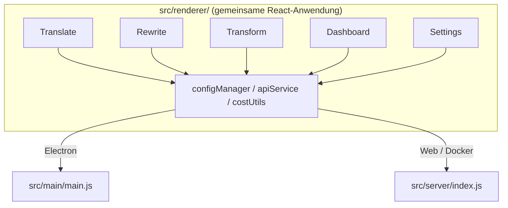

<p align="center">
  
</p>

<h1 align="center">Transrewrt</h1>

<p align="center">
  <a href="https://github.com/wsj-br/transrewrt/releases"></a>
  <a href="LICENSE"></a>
  
  
  
</p>

KI-gestütztes Textwerkzeug: Übersetzungen zwischen Sprachen, Umschreiben in verschiedenen Stilen und Transformationen mit benutzerdefinierten Prompts – alles über [OpenRouter](https://openrouter.ai). Läuft als Desktop-App (Electron) oder selbstgehostete Web-App (Docker).

- **Übersetzen** – zwischen Dutzenden von Sprachen, mit automatischer Quelldetektion
- **Umschreiben** – Grammatik korrigieren, Klarheit verbessern, formal/informell, kürzen, erweitern, technisch
- **Transformieren** – Benutzerdefinierte KI-Prompts; Prompts erstellen und verwalten, optionaler Zielsprache pro Prompt
- **Modelle & Kosten** – Beliebiges OpenRouter-Modell wählen; Kosten-Dashboard mit SQLite-Protokoll, Zusammenfassungen nach Modell/Vorgang/Tag
- **UI** – i18n (pt-BR, de, fr, es, RTL), Themes, Schriftarten, Tastenkürzel; Sicheres Web-Modus (API-Schlüssel nur auf Server)
- **Desktop** – Electron-App für Windows und Linux
- **Selbstgehostet** – Docker-Image für amd64 & arm64 (Raspberry-Pi-fähig)

Nach der Installation finden Sie im **[Benutzerhandbuch](../USER-GUIDE.md)** eine vollständige Anleitung zu allen Funktionen.

<small>**In anderen Sprachen lesen:** [English (UK)](../README.md) · [Português (BR)](README.pt-BR.md) · [العربية](README.ar.md) · [বাংলা](README.bn.md) · [Català](README.ca.md) · [简体中文](README.zh-CN.md) · [繁體中文](README.zh-TW.md) · [Hrvatski](README.hr.md) · [Čeština](README.cs.md) · [Nederlands](README.nl.md) · [English (US)](README.en-US.md) · [Filipino](README.tl.md) · [Français](README.fr.md) · [Deutsch](README.de.md) · [Ελληνικά](README.el.md) · [हिन्दी](README.hi.md) · [Magyar](README.hu.md) · [Italiano](README.it.md) · [日本語](README.ja.md) · [Basa Jawa](README.jv.md) · [한국어](README.ko.md) · [Bahasa Melayu](README.ms.md) · [فارسی](README.fa.md) · [Polski](README.pl.md) · [Português (PT)](README.pt.md) · [ਪੰਜਾਬੀ](README.pa.md) · [Română](README.ro.md) · [Русский](README.ru.md) · [Slovenčina](README.sk.md) · [Español](README.es.md) · [Kiswahili](README.sw.md) · [Svenska](README.sv.md) · [తెలుగు](README.te.md) · [ภาษาไทย](README.th.md) · [Türkçe](README.tr.md) · [Українська](README.uk.md) · [Tiếng Việt](README.vi.md)</small>

<a id="screenshots"></a>
## Screenshots

**Sprachauswahl**


**Übersetzen**


**Transformieren - Prompt-Editor**


**Dashboard**


**Einstellungen - Modellauswahl**


<br /><br />

<a id="table-of-contents"></a>
## Inhaltsverzeichnis

<!-- START doctoc generated TOC please keep comment here to allow auto update -->
<!-- DON'T EDIT THIS SECTION, INSTEAD RE-RUN doctoc TO UPDATE -->

- [Schnellstart](#quick-start)
- [Installation](#installation)
  - [Windows (Electron)](#windows-electron)
  - [Linux (Electron)](#linux-electron)
  - [Docker](#docker)
- [OpenRouter-API-Schlüssel erhalten](#getting-an-openrouter-api-key)
- [Konfiguration und Umgebung](#configuration-and-environment)
- [Entwicklung und Architektur](#development-and-architecture)
- [Releases und Tags](#releases-and-tags)
- [Mitwirken](#contributing)
- [Haftungsausschluss](#disclaimer)
- [Lizenz](#license)

<!-- END doctoc generated TOC please keep comment here to allow auto update -->

<br /><br />

<a id="quick-start"></a>

## Schnellstart

**Docker (empfohlen für Selbsthosting)**

```bash
docker pull ghcr.io/wsj-br/transrewrt:latest

API_KEY=sk-or-your-key docker run -d \
  -p 5000:5000 \
  -v transrewrt-data:/app/data \
  -e API_KEY \
  --name transrewrt-web \
  ghcr.io/wsj-br/transrewrt:latest
```

Ersetzen Sie `sk-or-your-key` durch Ihren [OpenRouter-API-Schlüssel](https://openrouter.ai/keys). Öffnen Sie [http://localhost:5000](http://localhost:5000) und ändern Sie das standardmäßige Administratorpasswort, bevor Sie den Dienst zugänglich machen.

<br />

> ℹ️ **HINWEIS**<br/>
> In Docker wird der OpenRouter-API-Schlüssel nur über die Umgebungsvariable `API_KEY` gesetzt (nicht in der Web-UI). Auf dem Desktop (Electron) fügen Sie ihn unter **Einstellungen → API** ein.

<br />

**Windows**

Laden Sie die neueste `Transrewrt Setup x.y.z.exe` von [Releases](https://github.com/wsj-br/transrewrt/releases) herunter, führen Sie das Installationsprogramm aus und starten Sie es dann aus dem Startmenü oder der Desktopverknüpfung. Geben Sie Ihren OpenRouter-API-Schlüssel unter **Einstellungen → API** ein.

<br />

**Linux**

Laden Sie die `.AppImage` von [Releases](https://github.com/wsj-br/transrewrt/releases) herunter und führen Sie dann aus:

```bash
chmod +x Transrewrt-x.y.z.AppImage && ./Transrewrt-x.y.z.AppImage
```

Geben Sie Ihren OpenRouter-API-Schlüssel unter **Einstellungen → API** ein. Unter Debian/Ubuntu müssen Sie möglicherweise zuerst zusätzliche Abhängigkeiten installieren:

```bash
sudo apt install libgtk-3-0 libnotify-dev libnss3 libxss1 libasound2 libxtst6 xauth
```

Weitere Details finden Sie unter [Installation → Linux](#linux-electron).

<br />

> ℹ️ **HINWEIS**<br/>
> macOS wird derzeit nicht unterstützt. Transrewrt ist für Windows, Linux und Docker verfügbar.

<br />

Sobald die App läuft, lesen Sie den **[Benutzerhandbuch](../USER-GUIDE.md)**, um zu erfahren, wie Sie Text übersetzen, umschreiben und transformieren, Prompts verwalten und Modelle konfigurieren.

<br /><br />

<a id="installation"></a>
## Installation

<a id="windows-electron"></a>
### Windows (Electron)

- Laden Sie den neuesten Installer von [Releases](https://github.com/wsj-br/transrewrt/releases) herunter.
- Führen Sie die `.exe` aus und folgen Sie den Installationsanweisungen.
- Erststart: Starten Sie die App aus dem Startmenü oder der Desktopverknüpfung. Die Konfiguration wird in `%APPDATA%\transrewrt\` gespeichert.

<br />

<a id="linux-electron"></a>
### Linux (Electron)

- Laden Sie die `.AppImage` von [Releases](https://github.com/wsj-br/transrewrt/releases) herunter.
- Ausführen: `chmod +x Transrewrt-x.y.z.AppImage && ./Transrewrt-x.y.z.AppImage`
- Zusätzliche Abhängigkeiten (Debian/Ubuntu): `sudo apt install libgtk-3-0 libnotify-dev libnss3 libxss1 libasound2 libxtst6 xauth`
- Siehe [dev/DEVELOPMENT.md](../dev/DEVELOPMENT.md) für weitere Informationen.

<br />

<a id="docker"></a>
### Docker

- Pull: `docker pull ghcr.io/wsj-br/transrewrt:latest`
- Der OpenRouter-API-Schlüssel **muss** über die Umgebungsvariable `API_KEY` gesetzt werden. Übergeben Sie ihn mit `-e API_KEY` (oder über `docker compose` / `.env`), damit der Schlüssel nicht in der Prozessliste sichtbar ist.
- Der API-Schlüssel kann nicht in der Web-UI eingegeben werden.

Beispiel - benanntes Volume für Persistenz (API-Schlüssel wird über Umgebungsvariable übergeben, nicht in der Befehlszeile):

```bash
API_KEY=sk-or-your-key docker run -d \
  -p 5000:5000 \
  -v transrewrt-data:/app/data \
  -e API_KEY \
  --name transrewrt-web \
  ghcr.io/wsj-br/transrewrt:latest
```

<br />

| Option   | Beschreibung                                                                                                   |
| -------- | ------------------------------------------------------------------------------------------------------------- |
| Port     | `5000` (zuordnen mit `-p 5000:5000`)                                                                              |
| Volume   | `/app/data` für Konfigurations- und Datenbank-Persistenz einbinden                                                         |
| Umgebungsvariablen | `PORT`, `CONFIG_PATH`, `API_KEY`, `API_URL`, `KEY_SEED` - siehe [Konfiguration](#configuration-and-environment) |

Um aus den Quellen zu bauen und auszuführen: `docker compose up --build -d` oder `pnpm run docker:up` - siehe [dev/DEVELOPMENT.md](../dev/DEVELOPMENT.md).

<br /><br />

<a id="getting-an-openrouter-api-key"></a>
## Einen OpenRouter-API-Schlüssel erhalten

Transrewrt verwendet [OpenRouter](https://openrouter.ai) für KI-Modelle. Sie benötigen einen API-Schlüssel, um Text zu übersetzen, umzuschreiben oder zu transformieren.

1. Registrieren Sie sich oder melden Sie sich unter [openrouter.ai](https://openrouter.ai) an.
2. Öffnen Sie die Seite [Keys](https://openrouter.ai/keys) und erstellen Sie einen neuen Schlüssel (benennen Sie ihn und legen Sie optional ein Kreditlimit fest). Sie können kostenlose Modelle ohne Guthabenaufladung nutzen.
3. **Desktop (Electron):** Fügen Sie den Schlüssel unter **Einstellungen → API** ein. **Docker:** Setzen Sie die Umgebungsvariable `API_KEY` (siehe [Schnellstart](#quick-start)).

Zu Limits, BYOK und mehr siehe [OpenRouter-Authentifizierung](https://openrouter.ai/docs/api/reference/authentication).

<br /><br />

<a id="configuration-and-environment"></a>

## Konfiguration und Umgebung

**Konfigurationsdatei-Pfade**

| Bereitstellung         | Konfigurationspfad                                   |
| ------------------ | ------------------------------------------------- |
| Electron (Windows) | `%APPDATA%\transrewrt\`                           |
| Electron (Linux)   | `~/.config/transrewrt/`                           |
| Web / Docker       | `/app/data/config.json` (Volume zur Persistenz verwenden) |

<br />

**Umgebungsvariablen** (nur Web/Docker; Electron nutzt die lokale Konfigurationsdatei)

| Variable      | Standardwert                        | Beschreibung                                                   |
| ------------- | ----------------------------------- | ------------------------------------------------------------- |
| `PORT`        | `5000`                              | Server-Lauschport                                             |
| `CONFIG_PATH` | `/app/data/config.json`             | Pfad zur Konfigurationsdatei                                  |
| `API_KEY`     | *(leer)*                            | OpenRouter-API-Schlüssel (erforderlich für Docker; per Umgebungsvariable setzen, nicht über UI) |
| `API_URL`     | `https://openrouter.ai/api/v1`      | Upstream KI-API-Basis-URL                                     |
| `KEY_SEED`    | *(leer)*                            | Transrewrt-Proxy-Schlüsselsamen (überschreibt Konfiguration, wenn gesetzt) |

<br />

**Daten und Persistenz:** Für Docker ein Volume unter `/app/data` einbinden, damit `config.json` und die SQLite-Datenbank bei Container-Neustarts erhalten bleiben. Ohne Volume gehen alle Daten beim Stoppen des Containers verloren.

<br />

**Web-Authentifizierung:**

- Standard-Admin: `admin` / `transrewrt26`.
- Benutzerverwaltung unter **Einstellungen → Benutzer**.
- Passwort zurücksetzen: `docker exec <container> reset-web-password '<username>' '<new-password>'`
  (aus dem Quellcode: `pnpm run reset-web-password -- <username> <new-password>`)

<br />

> ⚠️ **WARNUNG**<br/>
> Ändern Sie das Standard-Admin-Passwort sofort auf jedem netzwerkzugänglichen Host.

<br />

**Transrewrt-Proxy (optional):** Sie können den API-Verkehr über einen externen Proxy mit einem zeitbasierten Rolling-Key leiten. Unter **Einstellungen → API**, **Transrewrt-Proxy verwenden** aktivieren, **Schlüsselsamen** setzen und **API-URL** auf die Proxy-Basis-URL setzen. Details siehe [dev/SYSTEM-OVERVIEW.md](../dev/SYSTEM-OVERVIEW.md).

Wichtige Einstellungen (Theme, Schriftart, Modelle, Sprachen usw.) sind im Einstellungsdialog verfügbar oder können direkt in der config-JSON bearbeitet werden. Die vollständige Liste und Standardwerte sind in [dev/DEVELOPMENT.md](../dev/DEVELOPMENT.md) dokumentiert.

<br /><br />

<a id="development-and-architecture"></a>
## Entwicklung und Architektur

- **Entwicklung:** Setup, Build, Test und Bereitstellung (Electron, Web, Docker) – siehe **[dev/DEVELOPMENT.md](../dev/DEVELOPMENT.md)**.
- **Architektur und Systemüberblick:** Ordnerstruktur, Tech-Stack, Design-Entscheidungen, Transrewrt-Proxy – siehe **[dev/SYSTEM-OVERVIEW.md](../dev/SYSTEM-OVERVIEW.md)**.



<br /><br />

<a id="releases-and-tags"></a>
## Releases und Tags

- **Git-Tags** `v`* (z.B. `v1.0.10`) lösen den [Release-Workflow](.github/workflows/release.yml) aus. **GitHub Releases** enthalten den Windows-Installer (`.exe`) und das Linux AppImage.
- **Docker-Images** werden auf `ghcr.io/wsj-br/transrewrt` veröffentlicht. Image-Tags entsprechen der Git-Version (z.B. `v1.0.10` → `ghcr.io/wsj-br/transrewrt:1.0.10`) plus `latest`. Multi-Arch: `linux/amd64` und `linux/arm64` (z.B. Raspberry Pi).

<br /><br />

<a id="contributing"></a>
## Mitwirken

1. Forken Sie das Repository.
2. Erstellen Sie einen Feature-Branch: `git checkout -b feature/my-feature`
3. Committen Sie Ihre Änderungen mit einer klaren Meldung.
4. Pushen Sie und öffnen Sie einen Pull Request gegen `main`.

Bitte befolgen Sie den bestehenden Code-Stil und testen Sie Ihre Änderungen sowohl im Electron- als auch im Web-Modus, bevor Sie einreichen. Build- und Testanleitungen finden Sie in [dev/DEVELOPMENT.md](../dev/DEVELOPMENT.md).

<br />

**Issues melden:** Öffnen Sie ein Issue auf [GitHub](https://github.com/wsj-br/transrewrt/issues). Nennen Sie Ihre Plattform (Windows / Linux / Docker) und die App-Version (im Info-Dialog oder auf der Releases-Seite angegeben).

<br /><br />

<a id="disclaimer"></a>

## Haftungsausschluss

Produktnamen und Symbole gehören ihren jeweiligen Eigentümern und werden ausschließlich zur Identifizierung verwendet. Diese Software ist nicht mit den genannten Marken verbunden oder von diesen gebilligt.

<br /><br />

<a id="license"></a>
## Lizenz

Copyright © 2026 Waldemar Scudeller Jr.

[Apache-Lizenz 2.0](LICENSE)