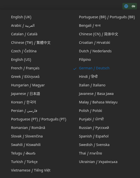
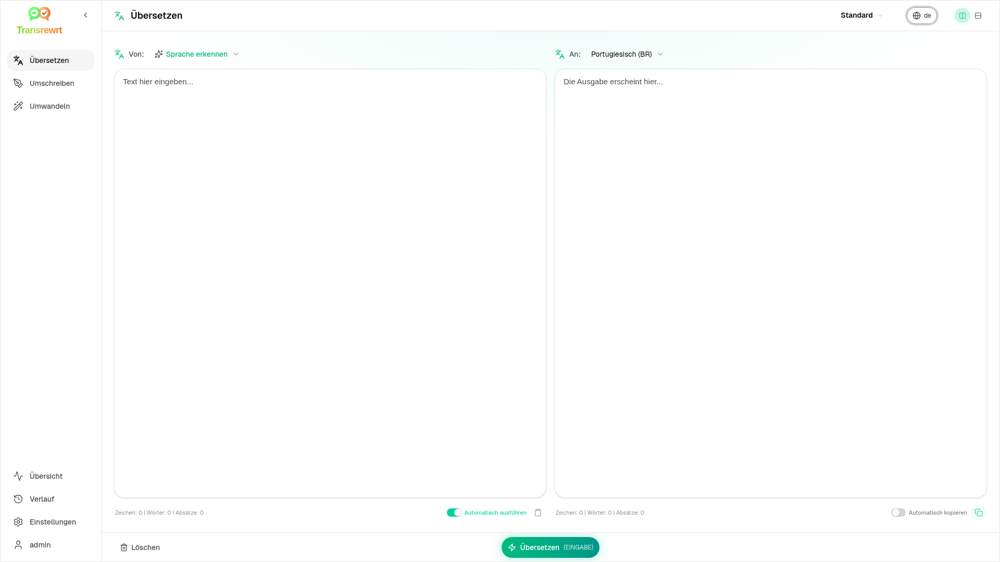
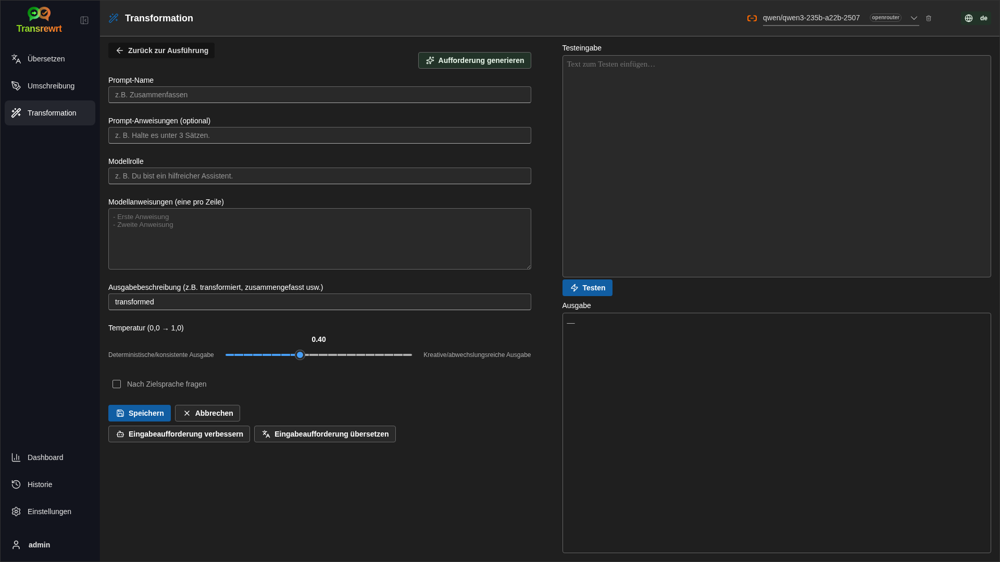
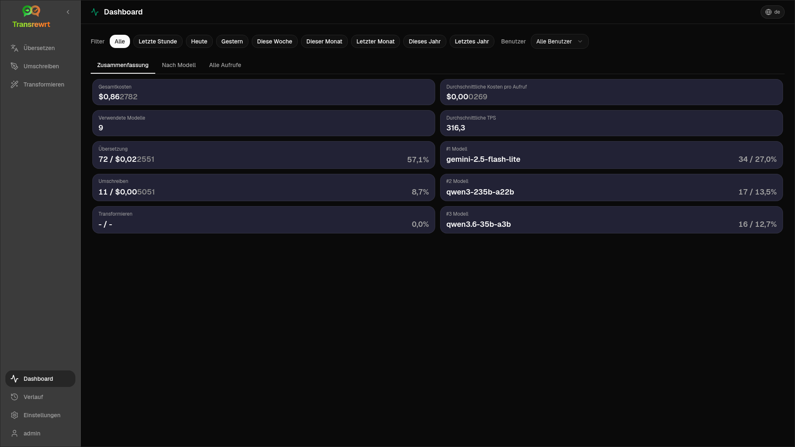
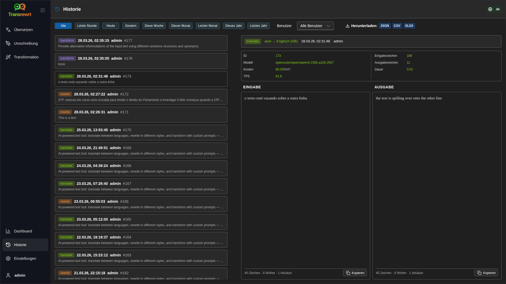
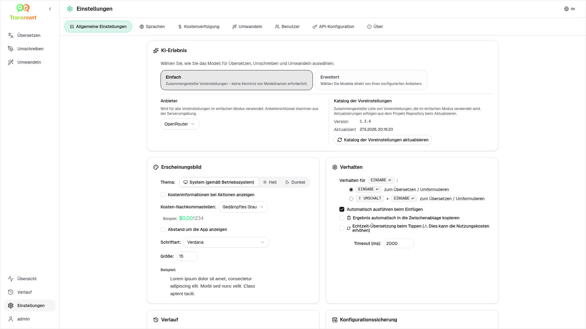

<p align="center">
  
</p>

<p align="center">
  <a href="https://github.com/wsj-br/transrewrt/releases"></a>
  <a href="LICENSE"></a>
  
  
  
</p>

KI-gestütztes Texttool: Übersetzung zwischen Sprachen, Umschreibung in verschiedenen Stilen und Transformation mit benutzerdefinierten Prompts – unter Verwendung mehrerer KI-Anbieter (OpenRouter, OpenAI, Anthropic, Google Gemini, DeepSeek, Groq, Mistral, xAI und lokales Ollama). Läuft als Desktop-App (Electron) oder als selbstgehostete Web-App (Docker).

- **Übersetzen** – zwischen Dutzenden von Sprachen, mit automatischer Erkennung der Quelle
- **Umschreiben** – Grammatik korrigieren, Klarheit verbessern, formell/informell, verkürzen, erweitern, technisch
- **Umwandeln** – benutzerdefinierte KI-Prompts; Prompts erstellen und verwalten, optionale Zielsprache pro Prompt
- **Verlauf** – vollständiger Ausführungsverlauf mit Eingabe-/Ausgabetext, Filterung und Export
- **Einfach & Erweitert** - Einfacher Modus (Standard): kuratierte Voreinstellungen pro Anbieter (**Kostenlos (OpenRouter)**, **Standard**, **Erweitert**, **Technisch**; es werden nur Voreinstellungen angezeigt, die eine Zuordnung zum ausgewählten Anbieter haben) ohne Auswahl von Modell-IDs; Erweiterter Modus: vollständige Modellliste der konfigurierten Anbieter
- **Modelle & Kosten** - Kosten- und Nutzungs-Dashboards (Zusammenfassung, Nach Modell, Alle Aufrufe) mit Exportfunktion; OpenRouter zeigt die tatsächlichen Ausgaben an, andere Anbieter verwenden Schätzungen
- **Benutzeroberfläche (UI)** - mehrsprachige Oberfläche (30+ Sprachen, RTL-Unterstützung), Schriftarten, ...
- **Web-Modus** - Unterstützung für mehrere Benutzer mit Administratorrollen
- **Desktop** - Electron-App für Windows und Linux
- **Selbstgehostet** - Docker-Image für amd64 & arm64 (bereit für Raspberry Pi)

Nach der Installation finden Sie im [**Benutzerhandbuch**](USER-GUIDE.de.md) eine vollständige Übersicht über alle Funktionen.

<small>**In anderen Sprachen lesen:** </small>
<small id="lang-list">[English (GB)](../README.md) · [Português (Brasil)](./README.pt-BR.md) · [العربية](./README.ar.md) · [বাংলা](./README.bn.md) · [Català](./README.ca.md) · [中文 (中国大陆)](./README.zh-CN.md) · [中文 (台灣)](./README.zh-TW.md) · [Hrvatski](./README.hr.md) · [Čeština](./README.cs.md) · [Nederlands](./README.nl.md) · [English (US)](./README.en-US.md) · [Tagalog](./README.tl.md) · [Français](./README.fr.md) · [Deutsch](./README.de.md) · [Ελληνικά](./README.el.md) · [हिन्दी](./README.hi.md) · [Magyar](./README.hu.md) · [Italiano](./README.it.md) · [日本語](./README.ja.md) · [한국어](./README.ko.md) · [Bahasa Melayu](./README.ms.md) · [فارسی](./README.fa.md) · [Polski](./README.pl.md) · [Basa Jawa](./README.jv.md) · [Português](./README.pt.md) · [ਪੰਜਾਬੀ](./README.pa.md) · [Română](./README.ro.md) · [Русский](./README.ru.md) · [Slovenčina](./README.sk.md) · [Español](./README.es.md) · [Kiswahili](./README.sw.md) · [Svenska](./README.sv.md) · [తెలుగు](./README.te.md) · [ไทย](./README.th.md) · [Türkçe](./README.tr.md) · [Українська](./README.uk.md) · [Tiếng Việt](./README.vi.md)</small>

<small>

> **Hinweis zu Übersetzungen der Benutzeroberfläche und Dokumentation:** Alle Sprachen der Benutzeroberfläche außer dem ursprünglichen Englisch (GB)
> wurden mithilfe von KI-Modellen übersetzt; die Formulierungen können ungenau oder fehlerhaft sein.

</small>

<br/>

<a id="table-of-contents"></a>
## Inhaltsverzeichnis

<!-- START doctoc generated TOC please keep comment here to allow auto update -->
<!-- DON'T EDIT THIS SECTION, INSTEAD RE-RUN doctoc TO UPDATE -->

- [Screenshots](#screenshots)
- [Schnellstart](#quick-start)
- [Beschaffung eines OpenRouter-API-Schlüssels](#getting-an-openrouter-api-key)
- [Konfiguration und Umgebung](#configuration-and-environment)
- [Entwicklung und Architektur](#development-and-architecture)
- [Probleme melden](#reporting-issues)
- [Haftungsausschluss](#disclaimer)
- [Lizenz](#license)

<!-- END doctoc generated TOC please keep comment here to allow auto update -->

<br/><br/>

<a id="screenshots"></a>
## Screenshots

**Sprachauswahl**



**Übersetzen**



**Transformation – Prompt-Editor**



**Dashboard**



**Historie**



**Einstellungen – Modellauswahl**



<br/><br/>

<a id="quick-start"></a>
## Schnellstart

<details>
<summary><b>Docker (empfohlen für Self-Hosting)</b></summary>

<a id="docker"></a>

<br/>

```bash
docker pull ghcr.io/wsj-br/transrewrt:latest

OPENROUTER_API_KEY=sk-or-your-key docker run -d \
  -p 5000:5000 \
  -v transrewrt-data:/app/data \
  -e OPENROUTER_API_KEY \
  --name transrewrt-web \
  ghcr.io/wsj-br/transrewrt:latest
```

Ersetzen Sie `sk-or-your-key` durch Ihren [OpenRouter-API-Schlüssel](https://openrouter.ai/keys) (oder setzen Sie Schlüssel anderer Anbieter; siehe [Konfiguration](#configuration-and-environment)). Öffnen Sie [http://localhost:5000](http://localhost:5000) und ändern Sie das Standard-Administratorpasswort, bevor Sie den Dienst öffentlich zugänglich machen.

Legen Sie mindestens einen Anbieterschlüssel über Umgebungsvariablen fest (z. B. `OPENROUTER_API_KEY` für OpenRouter). Übergeben Sie Variablen mit `-e` oder `docker compose` / `.env`, damit Geheimnisse nicht im Image enthalten sind. Anbieterschlüssel werden **nicht** über die Web-Oberfläche eingegeben; der Server liest sie aus der Umgebung.

<br/>

> ℹ️ **HINWEIS**<br/>
> In Docker werden LLM-Anmeldeinformationen mit Umgebungsvariablen wie `OPENROUTER_API_KEY`, `OPENAI_API_KEY`, `CEREBRAS_API_KEY`, … festgelegt (nicht über die Web-Oberfläche). Bei der Desktop-Anwendung (Electron) konfigurieren Sie die Schlüssel unter **Einstellungen → API**.

<br/>

Oder verwenden Sie Docker Compose:

```bash
# download the compose file
wget https://github.com/wsj-br/transrewrt/raw/refs/heads/master/production.yml -O transrewrt.yml
# Edit the file to add your API keys (API_KEYs), or uncomment and adjust the `.env` file. Set the timezone (TZ) if necessary.
vi transrewrt.yml
# start the container
docker compose -f transrewrt.yml up -d
```

Siehe [Konfiguration](#configuration-and-environment) für alle Umgebungsvariablen, wie `PORT`, `CONFIG_PATH`, `TZ`, und LLM-Schlüssel (`OPENROUTER_API_KEY`, `OPENAI_API_KEY`, …).

</details>

<br/>

<details>
<summary><b>Server-Zeitzone (Docker)</b></summary>

<a id="configuring-the-timezone"></a>

<br/>

Datum und Uhrzeit in der Benutzeroberfläche richten sich nach der **Browser-Lokalisierung** und -Zeitzone. Für das **serverseitige** Verhalten (Protokollierung und Ähnliches) verwendet der Container die Umgebungsvariable `TZ`. Der Standardwert ist `TZ=Europe/London`.

Um eine andere Zeitzone zu verwenden, setzen Sie `TZ` in Ihrer Compose-Datei, zum Beispiel:

```yaml
environment:
  - TZ=America/Sao_Paulo
```

Oder geben Sie sie beim Ausführen des Containers an (Docker):

```bash
--env TZ=America/Sao_Paulo
```

Auf vielen Linux-Systemen können Sie den System-Zeitzonennamen mit folgendem Befehl kopieren:

```bash
echo TZ=\"$(</etc/timezone)\"
```

Eine Liste gültiger Zeitzonennamen finden Sie in der [tz-Datenbank](https://en.wikipedia.org/wiki/List_of_tz_database_time_zones) (Wikipedia).

</details>

<br/>

<details>
<summary><b>Windows</b></summary>

<a id="windows-electron"></a>

<br/>

- Laden Sie die neueste `Transrewrt Setup x.y.z.exe` von [Releases](https://github.com/wsj-br/transrewrt/releases) herunter.
- Führen Sie die `.exe` aus und folgen Sie dem Installationsassistenten.
- Erster Start: Starten Sie die App über das Startmenü oder eine Desktop-Verknüpfung.
- Geben Sie Ihre API-Schlüssel unter **Einstellungen → API** ein. Sie müssen mindestens einen Anbieter konfigurieren; OpenRouter ist üblich für kostenlose Modelle.

<br/>

> ℹ️ **HINWEIS**<br/>
> Windows zeigt möglicherweise eine dieser Sicherheitswarnungen an (normal bei nicht signierten/indie-Apps):
>   - **Benutzerkontensteuerung (UAC)**: „Möchten Sie zulassen, dass diese App von einem unbekannten Herausgeber Änderungen an Ihrem Gerät vornimmt?“ → Klicken Sie auf **Ja**.
>   - **Microsoft Defender SmartScreen**: „Windows hat Ihren PC geschützt“ → Klicken Sie auf **Weitere Informationen** → **Trotzdem ausführen**.
>
> Dies geschieht, weil die App nicht von Microsoft oder einem großen Herausgeber signiert ist – sie ist sicher, wenn Sie sie von unseren offiziellen GitHub-Releases heruntergeladen haben (prüfen Sie die Prüfsummen auf der [Releases](https://github.com/wsj-br/transrewrt/releases)-Seite neben jedem Asset).

<br/>

</details>

<br/>

<details>
<summary><b>Linux</b></summary>

<a id="linux-electron"></a>

<br/>

Laden Sie die `.AppImage` für Ihre CPU von [Releases](https://github.com/wsj-br/transrewrt/releases) herunter (`x64` für typische PCs, `arm64` für viele ARM-Geräte, einschließlich Raspberry Pi 4+), dann:

```bash
chmod +x Transrewrt-x.y.z-x64.AppImage && ./Transrewrt-x.y.z-x64.AppImage
```

Verwenden Sie auf x86_64/amd64 den `x64`-Dateinamen; auf ARM64 verwenden Sie den `...-arm64.AppImage`-Namen.

Geben Sie Ihre API-Schlüssel in **Einstellungen → API** ein. Sie müssen mindestens einen Anbieter konfigurieren; OpenRouter ist üblich für kostenlose Modelle.

**Konsolenmeldungen:** Paketierte Linux-Versionen (`x64` und `arm64` AppImages) unterdrücken Node-Deprecation-Warnungen im Terminal (z. B. das integrierte `punycode`-Modul). Wenn Chromium GPU-/EGL-Fehler wie „GLES3 is unsupported“ ausgibt, das Programm aber funktioniert, können Sie diese durch Deaktivierung der Hardwarebeschleunigung unterdrücken:

```bash
TRANSREWRT_DISABLE_GPU=1 ./Transrewrt-x.y.z-arm64.AppImage
```

Dies gilt auch für amd64; ändern Sie den Dateinamen entsprechend Ihrem Download.

Unter Debian/Ubuntu benötigen Sie möglicherweise zusätzliche **Laufzeitbibliotheken**, die von Chromium benötigt werden (diese sind oft bereits auf vollständigen Desktop-Installationen vorhanden). Führen Sie bei Bedarf die folgenden Befehle aus:

```bash
sudo apt update
sudo apt install -y libfuse2 libgtk-3-0 libnotify4 libnss3 libnspr4 libxss1 libxtst6 xdg-utils \
     xauth libatspi2.0-0 libdrm2 libgbm1 libxcb-dri3-0 libcups2 libasound2t64
```

ersetzen Sie `libasound2t64` durch `libasound2` für `arm64`. Minimal- oder benutzerdefinierte Installationen können weiterhin mit einer fehlenden `.so`-Datei fehlschlagen. Installieren Sie das im Fehler angegebene Paket (häufig zusätzlich benötigt: `libatk1.0-0`, `libatk-bridge2.0-0`, `libgbm1`, `libdrm2`). In einigen Umgebungen müssen Sie die App möglicherweise mit `APPIMAGE_EXTRACT_AND_RUN=1 ./Transrewrt-….AppImage` ausführen.

<br/>

> ℹ️ **HINWEIS**<br/>
> macOS wird derzeit nicht unterstützt. Transrewrt ist verfügbar für Windows, Linux und Docker.

</details>

<br/>

Sobald die App läuft, sehen Sie im [**Benutzerhandbuch**](USER-GUIDE.de.md) nach, um zu erfahren, wie Sie Text übersetzen, umschreiben und umwandeln, Eingabeaufforderungen verwalten und Modelle konfigurieren.

<br/><br/>

<a id="getting-an-openrouter-api-key"></a>
## Abrufen eines OpenRouter-API-Schlüssels

Transrewrt unterstützt mehrere KI-Anbieter. [OpenRouter](https://openrouter.ai) ist eine beliebte Wahl, da es viele Modelle unter einem Schlüssel bündelt und kostenlose Modelle anbietet.

1. Registrieren Sie sich oder melden Sie sich an unter [openrouter.ai](https://openrouter.ai).
2. Öffnen Sie die Seite [Keys](https://openrouter.ai/keys) und erstellen Sie einen neuen Schlüssel (geben Sie einen Namen ein und legen Sie optional ein Guthabenlimit fest). Sie können kostenlose Modelle nutzen, ohne Guthaben hinzuzufügen.
3. **Desktop (Electron):** Schlüssel in **Einstellungen → API** einfügen. **Docker:** Umgebungsvariablen wie `OPENROUTER_API_KEY` setzen (siehe [Schnellstart](#quick-start)).

Verwenden Sie nicht das **Body Builder**-Modell von OpenRouter ([`openrouter/bodybuilder`](https://openrouter.ai/openrouter/bodybuilder)) für Übersetzen, Umschreiben oder Transformation: Es gibt JSON-Anfrage-Payloads zurück, nicht den fertigen Text für diese Aufgaben. Siehe [Einstellungen → Modelle](USER-GUIDE.de.md#models) im Benutzerhandbuch.

Sie können auch andere Anbieter verwenden (OpenAI, Anthropic, Google Gemini, DeepSeek, Groq, Mistral, xAI, Cerebras) oder Modelle lokal mit [Ollama](https://ollama.com) ausführen. Siehe [Konfiguration](#configuration-and-environment) für die vollständige Liste der unterstützten Anbieter und Umgebungsvariablen.

</br>

> ⚠️ **WARNUNG**<br/>
> Wenn Sie Ollama von einem anderen Gerät, Container oder Dienst aus verwenden, denken Sie daran, Ollama so zu konfigurieren, dass externe Verbindungen erlaubt sind (nicht nur localhost).

<br/><br/>

<a id="configuration-and-environment"></a>
## Konfiguration und Umgebung

</br>

**Konfigurationsdatei-Speicherorte**

| Bereitstellung         | Konfigurationsort                                   |
| ------------------ | ------------------------------------------------- |
| Electron (Windows) | `%APPDATA%\transrewrt\`                           |
| Electron (Linux)   | `~/.config/transrewrt/`                           |
| Web / Docker       | `/app/data/config.json` (verwenden Sie ein Volume zur Persistenz) |

<br/>

**Umgebungsvariablen** (nur Web/Docker; Electron verwendet die lokale Konfigurationsdatei)

| Variable             | Beschreibung                                                                  |
|----------------------|------------------------------------------------------------------------------|
| `PORT`               | Server-Port (Standard: `5000`)                                  |
| `CONFIG_PATH`        | Pfad zur Konfigurationsdatei (Standard ist `/app/data/config.json`)                |
| `TZ`                 | Zeitzoneneinstellung für serverseitige Zeit (Protokollierung usw.) (Standard: `Europe/London`) |
| `HISTORY_DISABLED`   | Protokollierung der Ausführungsverläufe deaktivieren (optional, Standard ist `false`)                  |
| `OPENROUTER_API_KEY` | OpenRouter-API-Schlüssel                                                           |
| `OPENAI_API_KEY`     | OpenAI-API-Schlüssel                                                               |
| `CEREBRAS_API_KEY`   | Cerebras-API-Schlüssel                                                             |
| `ANTHROPIC_API_KEY`  | Anthropic-API-Schlüssel                                                            |
| `GOOGLE_API_KEY`     | Google-Gemini-API-Schlüssel                                                        |
| `DEEPSEEK_API_KEY`   | DeepSeek-API-Schlüssel                                                             |
| `GROQ_API_KEY`       | Groq-API-Schlüssel                                                                 |
| `MISTRAL_API_KEY`    | Mistral-API-Schlüssel                                                              |
| `OLLAMA_URL`         | Ollama-Basis-URL (z. B. `http://host.docker.internal:11434`)                   |
| `XAI_API_KEY`        | xAI-API-Schlüssel                                                                  |

**Datenschutzmodus:** Um die Verlaufsprotokollierung unabhängig von `config.json` oder benutzerspezifischen Einstellungen zu deaktivieren, setzen Sie `HISTORY_DISABLED` auf `true` oder `1` (Groß-/Kleinschreibung wird nicht beachtet) für den **Web-/Docker-Server-Prozess** und/oder den **Electron-Desktop-Hauptprozess** (z. B. System- oder Starter-Umgebung — nicht nur den Renderer). Dadurch wird das Speichern von Ein- und Ausgabe-Verläufen deaktiviert, **Einstellungen → Allgemeine Einstellungen → Verlauf** gesperrt und Verlauf-bezogene APIs blockiert.

Konfigurieren Sie nur die Anbieter, die Sie verwenden. Modell-IDs sind namensbasiert (`openrouter/…`, `openai/…`, `cerebras/…`, `ollama/…`, etc.).

**Kostenanzeige:** OpenRouter gibt die genauen Abrechnungskosten zurück, wenn zutreffend. Andere Anbieter verwenden **geschätzte** Kosten basierend auf den öffentlichen OpenRouter-Preisen, sofern ein OpenRouter-Schlüssel verfügbar ist; andernfalls können Nicht-OpenRouter-Kosten als `0` angezeigt werden. Schätzungen sind keine Rechnungen.

<br/>

**Daten und Persistenz:** Verwenden Sie bei Docker ein Volume am Pfad `/app/data`, damit `config.json` und die SQLite-Datenbank bei Neustarts des Containers erhalten bleiben. Ohne Volume gehen alle Daten beim Beenden des Containers verloren.

<br/>

**Web-Authentifizierung:**

- Standardadministrator: `admin` / `transrewrt26`.
- Verwalten Sie Benutzer unter **Einstellungen → Benutzer**.
- Ein Passwort zurücksetzen: `docker exec <container> reset-web-password '<username>' '<new-password>'`

<br/>

> ⚠️ **WARNUNG**<br/>
> Ändern Sie sofort das Standard-Administratorpasswort auf jedem netzwerkzugänglichen Host.

<br/>

Wichtige Einstellungen (Schriftart, Modelle, Sprachen, etc.) sind in den Anwendungseinstellungen verfügbar.

<br/><br/>

<a id="development-and-architecture"></a>
## Entwicklung und Architektur

- **Entwicklung:** Einrichtung, Build, Test und Bereitstellung (Electron, Web, Docker) – siehe [dev/DEVELOPMENT.md](../dev/DEVELOPMENT.md).
- **Architektur und Systemübersicht:** Ordnerstruktur, Technologiestapel, Designentscheidungen – siehe [dev/SYSTEM-OVERVIEW.md](../dev/SYSTEM-OVERVIEW.md).

<br/><br/>

<a id="reporting-issues"></a>
## Probleme melden

Eröffnen Sie ein Ticket auf [GitHub](https://github.com/wsj-br/transrewrt/issues). Geben Sie Ihre Plattform (Windows / Linux / Docker) und die App-Version an (angezeigt im Dialog „Über“ oder auf der Releases-Seite).

<br/><br/>

<a id="disclaimer"></a>
## Haftungsausschluss

Produktnamen und Symbole gehören ihren jeweiligen Eigentümern und werden nur zur Identifikation verwendet. Diese Software steht in keiner Verbindung zu den genannten Marken und wird von diesen nicht unterstützt.

<br/><br/>

<a id="license"></a>
## Lizenz

Copyright © 2026 Waldemar Scudeller Jr.

[Apache License 2.0](../LICENSE)
