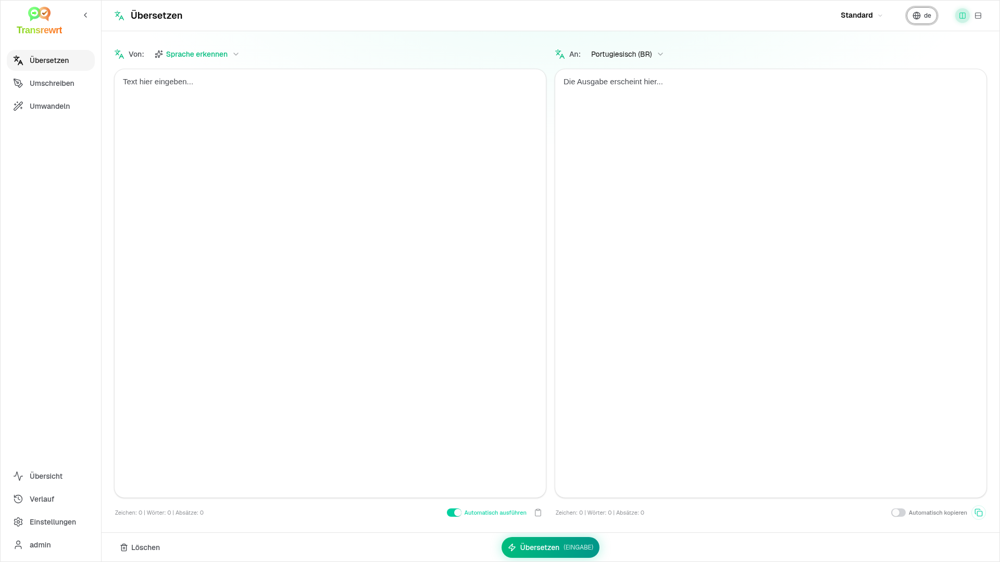

<p align="center">
  
</p>

<h1 align="center">Transrewrt</h1>

<p align="center">
  <a href="https://github.com/wsj-br/transrewrt/releases"></a>
  <a href="LICENSE"></a>
  
</p>

KI-gestütztes Textwerkzeug zum **Übersetzen**, **Umschreiben** und **Transformieren** mit benutzerdefinierten Prompts. Verwenden Sie Ihre eigenen KI-Anbieter (OpenRouter, OpenAI, Anthropic, Google Gemini, DeepSeek, Groq, Mistral, xAI, Cerebras, NVIDIA, Alibaba Cloud, apikey.fun, OpenAI-kompatible Endpunkte und lokale Server wie Ollama, LM Studio oder llama.cpp). Läuft als Desktop-App (Windows / Linux / macOS) oder als Docker-Web-App. Kein Transrewrt Cloud-Konto.

## Funktionen

| Fähigkeit | Beschreibung |
| --- | --- |
| **Übersetzen** | Dutzende von Sprachen, automatische Erkennung, Glossare, Verfeinerung mit Umformulieren |
| **Umschreiben** | Klarheit, Ton, Länge, Rechtschreibung & Grammatik – gleiche Sprache |
| **Transformieren** | Benutzerdefinierte KI-Prompts, die Sie erstellen, bearbeiten und wiederverwenden |
| **Bereitstellen** | Electron Desktop oder Docker Web (amd64 & arm64) |
| **Schlüssel** | Ihre Anbieter, Ihr Host – Einfache Voreinstellungen oder erweiterte Modellliste |



<small>**In anderen Sprachen lesen:** </small>
<small id="lang-list">[English (UK)](../README.md) · [العربية](./README.ar.md) · [简体中文](./README.zh-Hans.md) · [繁體中文](./README.zh-Hant.md) · [Čeština](./README.cs.md) · [Nederlands](./README.nl.md) · [Français](./README.fr.md) · [Deutsch](./README.de.md) · [Ελληνικά](./README.el.md) · [हिन्दी](./README.hi.md) · [Magyar](./README.hu.md) · [Italiano](./README.it.md) · [日本語](./README.ja.md) · [한국어](./README.ko.md) · [فارسی](./README.fa.md) · [Polski](./README.pl.md) · [Português (Brasil)](./README.pt-BR.md) · [Română](./README.ro.md) · [Русский](./README.ru.md) · [Slovenčina](./README.sk.md) · [Español](./README.es.md) · [Svenska](./README.sv.md) · [ไทย](./README.th.md) · [Türkçe](./README.tr.md) · [Українська](./README.uk.md) · [Tiếng Việt](./README.vi.md)</small>

## Schnellstart

**Docker**

```bash
docker pull ghcr.io/wsj-br/transrewrt:latest

docker run -d \
  -p 5000:5000 \
  -v transrewrt-data:/app/data \
  -e PROVIDER_API_KEY=your-key \
  --name transrewrt \
  ghcr.io/wsj-br/transrewrt:latest
```

Ersetzen Sie `PROVIDER_API_KEY` durch Ihre Anbieter-Variable (z. B. `OPENROUTER_API_KEY`, `OPENAI_API_KEY`, `GROQ_API_KEY`). Öffnen Sie [http://localhost:5000](http://localhost:5000) und ändern Sie das Standard-Administrator-Passwort. Schlüssel werden über Umgebungsvariablen (nicht die Web-UI) festgelegt.

**Windows** – Laden Sie `Transrewrt Setup x.y.z.exe` von [Releases](https://github.com/wsj-br/transrewrt/releases) herunter, installieren Sie es und fügen Sie dann Schlüssel unter **Einstellungen → API** hinzu.

**Linux** – Laden Sie die `.AppImage` von [Releases](https://github.com/wsj-br/transrewrt/releases) herunter, dann:

```bash
chmod +x Transrewrt-x.y.z-x64.AppImage && ./Transrewrt-x.y.z-x64.AppImage
```

**macOS** – Laden Sie die `.dmg` für Ihren Mac von [Releases](https://github.com/wsj-br/transrewrt/releases) herunter: `arm64` für Apple Silicon, `x64` für Intel. Öffnen Sie das Disk-Image und ziehen Sie Transrewrt in Anwendungen.

Der Build ist nicht signiert, daher blockiert Gatekeeper den ersten Start. Klicken Sie mit der rechten Maustaste auf `Transrewrt.app` und wählen Sie **Öffnen**, dann bestätigen Sie **Öffnen**. Oder löschen Sie das Quarantäne-Attribut:

```bash
xattr -dr com.apple.quarantine /Applications/Transrewrt.app
```

Plattformdetails (Compose, SmartScreen, apt libs, GPU flags, Zeitzone): [Schnellstart-Dokumentation](https://wsj-br.github.io/transrewrt/docs/quick-start/).

## Dokumentation

Vollständige Produktdokumentation (Installation, API-Schlüssel, Anleitungen, Einstellungen, Fehlerbehebung):

**[https://wsj-br.github.io/transrewrt/docs/](https://wsj-br.github.io/transrewrt/docs/)**

- [API-Schlüssel](https://wsj-br.github.io/transrewrt/docs/api-key/)
- [Konfiguration](https://wsj-br.github.io/transrewrt/docs/configuration/)
- [Übersetzen](https://wsj-br.github.io/transrewrt/docs/translate/) · [Umschreiben](https://wsj-br.github.io/transrewrt/docs/rewrite/) · [Transformieren](https://wsj-br.github.io/transrewrt/docs/transform/)
- [Häufige Probleme](https://wsj-br.github.io/transrewrt/docs/common-issues/)

## Entwicklung

- Setup, Build, Test, Bereitstellung: [dev/DEVELOPMENT.md](../dev/DEVELOPMENT.md)
- Architekturübersicht: [dev/SYSTEM-OVERVIEW.md](../dev/SYSTEM-OVERVIEW.md)

## Support

Erstellen Sie ein Issue auf [GitHub](https://github.com/wsj-br/transrewrt/issues). Geben Sie Ihre Plattform (Windows / Linux / macOS / Docker) und die App-Version (Info-Dialog oder Releases-Seite) an.

## Danksagungen

Vorschläge für Easy-Mode-Voreinstellungen im Voreinstellungseditor verwenden nur öffentliche Bewertungsdaten auf dem Computer des Betreuers. Es werden keine Dataset-Inhalte mit Transrewrt weitergegeben:

- [languagebench](https://huggingface.co/spaces/fair-forward/languagebench) (CC BY-SA 4.0) – Übersetzung ChrF
- [Arena](https://huggingface.co/datasets/lmarena-ai/leaderboard-dataset) (CC BY 4.0) – Arena Score
- [models.dev](https://models.dev/) (MIT)

Lizenzen von Drittanbieter-Abhängigkeiten und diese Hinweise zu Datenquellen sind in [NOTICES](../NOTICES) aufgeführt.

## Lizenz

Copyright © 2026 Waldemar Scudeller Jr.

[Apache License 2.0](../LICENSE)

<br/>

Produktnamen und -symbole gehören ihren jeweiligen Inhabern und werden nur zur Identifizierung verwendet. Diese Software ist nicht mit diesen Marken verbunden oder wird von ihnen unterstützt.

<small>

> **Hinweis zu UI- und Dokumentationsübersetzungen:** Alle Oberflächen- und Dokumentationssprachen außer Englisch (UK) wurden mit KI unter Verwendung von [ai-i18n-tools](https://wsj-br.github.io/ai-i18n-tools/) übersetzt; die Formulierung kann ungenau sein oder Fehler enthalten.

</small>
