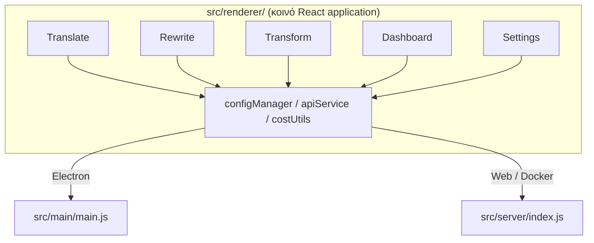

<p align="center">
  
</p>

<h1 align="center">Transrewrt</h1>

<p align="center">
  <a href="https://github.com/wsj-br/transrewrt/releases"></a>
  <a href="LICENSE"></a>
  
  
  
</p>

Εργαλείο κειμένου με AI: μετάφραση μεταξύ γλωσσών, επαναγραφή με διαφορετικά στυλ και μετατροπή με προσαρμοσμένες οδηγίες - όλα μέσω [OpenRouter](https://openrouter.ai). Λειτουργεί ως εφαρμογή επιτραπέζιου υπολογιστή (Electron) ή αυτο-φιλοξενούμενη εφαρμογή ιστού (Docker).

- **Μετάφραση** - ανάμεσα σε δεκάδες γλώσσες, με αυτόματη ανίχνευση προέλευσης
- **Επαναγραφή** - διορθώστε γραμματικά, βελτιώστε σαφήνεια, επίσημο/ανεπίσημο, συντόμευση, επέκταση, τεχνικό
- **Μετατροπή** - προσαρμοσμένες οδηγίες AI· δημιουργία και διαχείριση οδηγιών, προαιρετική γλώσσα στόχου ανά οδηγία
- **Μοντέλα & κόστος** - επιλέξτε οποιοδήποτε μοντέλο OpenRouter· πίνακας κόστους με αρχείο καταγραφής SQLite, περίληψη ανά μοντέλο/λειτουργία/ημέρα
- **Διεπαφής χρήστη** - i18n (pt-BR, de, fr, es, RTL), θέματα, γραμματοσειρές, συντομεύσεις πληκτρολογίου· ασφαλής λειτουργία ιστού (κλειδί API μόνο στον διακομιστή)
- **Επιτραπέζιου Υπολογιστή** - εφαρμογή Electron για Windows και Linux
- **Αυτο-φιλοξενούμενη** - εικόνα Docker για amd64 και arm64 (έτοιμη για Raspberry Pi)

Αφού εγκατασταθεί, δείτε τον **[Οδηγό Χρήστη](../USER-GUIDE.md)** για μια πλήρη περιήγηση όλων των λειτουργιών.

<small>**Διαβάστε σε άλλες γλώσσες:** [Αγγλικά (ΗΒ)](../README.md) · [Πορτογαλικά (ΒΡ)](README.pt-BR.md) · [Αραβικά](README.ar.md) · [Βεγγαλικά](README.bn.md) · [Καταλανικά](README.ca.md) · [Απλοποιημένα Κινεζικά](README.zh-CN.md) · [Παραδοσιακά Κινεζικά](README.zh-TW.md) · [Κροατικά](README.hr.md) · [Τσεχικά](README.cs.md) · [Ολλανδικά](README.nl.md) · [Αγγλικά (ΗΠΑ)](README.en-US.md) · [Φιλιππινικά](README.tl.md) · [Γαλλικά](README.fr.md) · [Γερμανικά](README.de.md) · [Ελληνικά](README.el.md) · [Χίντι](README.hi.md) · [Ουγγρικά](README.hu.md) · [Ιταλικά](README.it.md) · [Ιαπωνικά](README.ja.md) · [Ιάβανικα](README.jv.md) · [Κορεατικά](README.ko.md) · [Μαλαισιανά](README.ms.md) · [Περσικά](README.fa.md) · [Πολωνικά](README.pl.md) · [Πορτογαλικά (ΠΤ)](README.pt.md) · [Παντζαμπικά](README.pa.md) · [Ρουμανικά](README.ro.md) · [Ρωσικά](README.ru.md) · [Σλοβακικά](README.sk.md) · [Ισπανικά](README.es.md) · [Σουαχίλι](README.sw.md) · [Σουηδικά](README.sv.md) · [Τελούγκου](README.te.md) · [Ταϊλανδικά](README.th.md) · [Τουρκικά](README.tr.md) · [Ουκρανικά](README.uk.md) · [Βιετναμικά](README.vi.md)</small>

<a id="screenshots"></a>
## Στιγμιότυπα οθόνης

**Επιλογέας γλώσσας**


**Μετάφραση**


**Μετατροπή - επεξεργαστής προτροπών**


**Πίνακας ελέγχου**


**Ρυθμίσεις - επιλογή μοντέλου**


<br /><br />

<a id="table-of-contents"></a>
## Περιεχόμενα

<!-- START doctoc generated TOC please keep comment here to allow auto update -->
<!-- DON'T EDIT THIS SECTION, INSTEAD RE-RUN doctoc TO UPDATE -->

- [Γρήγορη έναρξη](#quick-start)
- [Εγκατάσταση](#installation)
  - [Windows (Electron)](#windows-electron)
  - [Linux (Electron)](#linux-electron)
  - [Docker](#docker)
- [Λήψη κλειδιού API του OpenRouter](#getting-an-openrouter-api-key)
- [Ρύθμιση και περιβάλλον](#configuration-and-environment)
- [Ανάπτυξη και αρχιτεκτονική](#development-and-architecture)
- [Εκδόσεις και ετικέτες](#releases-and-tags)
- [Συνεισφορά](#contributing)
- [Αποποίηση ευθυνών](#disclaimer)
- [Άδεια χρήσης](#license)

<!-- END doctoc generated TOC please keep comment here to allow auto update -->

<br /><br />

<a id="quick-start"></a>

## Γρήγορη έναρξη

**Docker (συνιστάται για αυτο-φιλοξενία)**

```bash
docker pull ghcr.io/wsj-br/transrewrt:latest

API_KEY=sk-or-your-key docker run -d \
  -p 5000:5000 \
  -v transrewrt-data:/app/data \
  -e API_KEY \
  --name transrewrt-web \
  ghcr.io/wsj-br/transrewrt:latest
```

Αντικαταστήστε το `sk-or-your-key` με το [κλειδί API σας στο OpenRouter](https://openrouter.ai/keys). Ανοίξτε το [http://localhost:5000](http://localhost:5000) και αλλάξτε τον προεπιλεγμένο κωδικό διαχειριστή πριν εκθέσετε την υπηρεσία.

<br />

> ℹ️ **ΣΗΜΕΙΩΣΗ**<br/>
> Στο Docker το κλειδί OpenRouter API ορίζεται μόνο μέσω της μεταβλητής περιβάλλοντος `API_KEY` (όχι στο web UI). Στον επιτραπέζιο (Electron) το επικολλάτε στις **Ρυθμίσεις → API**.

<br />

**Windows**

Κατεβάστε το πιο πρόσφατο `Transrewrt Setup x.y.z.exe` από τα [Releases](https://github.com/wsj-br/transrewrt/releases), εκτελέστε τον εγκαταστάτη και, στη συνέχεια, ξεκινήστε από το μενού Start ή τη συντόμευση στην επιφάνεια εργασίας. Εισάγετε το κλειδί OpenRouter API σας στις **Ρυθμίσεις → API**.

<br />

**Linux**

Κατεβάστε το `.AppImage` από τα [Releases](https://github.com/wsj-br/transrewrt/releases), στη συνέχεια:

```bash
chmod +x Transrewrt-x.y.z.AppImage && ./Transrewrt-x.y.z.AppImage
```

Εισάγετε το κλειδί OpenRouter API σας στις **Ρυθμίσεις → API**. Στο Debian/Ubuntu ίσως χρειαστεί πρώτα να εγκαταστήσετε πρόσθετες εξαρτήσεις:

```bash
sudo apt install libgtk-3-0 libnotify-dev libnss3 libxss1 libasound2 libxtst6 xauth
```

Δείτε το [Εγκατάσταση → Linux](#linux-electron) για λεπτομέρειες.

<br />

> ℹ️ **ΣΗΜΕΙΩΣΗ**<br/>
> Το macOS δεν υποστηρίζεται προς το παρόν. Το Transrewrt είναι διαθέσιμο για Windows, Linux και Docker.

<br />

Μόλις η εφαρμογή εκτελείται, δείτε το **[Οδηγός Χρήστη](../USER-GUIDE.md)** για να μάθετε πώς να μεταφράζετε, ξαναγράφετε και μετασχηματίζετε κείμενο, να διαχειρίζεστε προτροπές και να ρυθμίζετε μοντέλα.

<br /><br />

<a id="installation"></a>
## Εγκατάσταση

<a id="windows-electron"></a>
### Windows (Electron)

- Κατεβάστε τον πιο πρόσφατο εγκαταστάτη από τα [Releases](https://github.com/wsj-br/transrewrt/releases).
- Εκτελέστε το `.exe` και ακολουθήστε τον εγκαταστάτη.
- Πρώτη εκτέλεση: ξεκινήστε την εφαρμογή από το μενού Start ή τη συντόμευση στην επιφάνεια εργασίας. Η ρύθμιση αποθηκεύεται στο `%APPDATA%\transrewrt\`.

<br />

<a id="linux-electron"></a>
### Linux (Electron)

- Κατεβάστε το `.AppImage` από τα [Releases](https://github.com/wsj-br/transrewrt/releases).
- Εκτελέστε: `chmod +x Transrewrt-x.y.z.AppImage && ./Transrewrt-x.y.z.AppImage`
- Πρόσθετες εξαρτήσεις (Debian/Ubuntu): `sudo apt install libgtk-3-0 libnotify-dev libnss3 libxss1 libasound2 libxtst6 xauth`
- Δείτε το [dev/DEVELOPMENT.md](../dev/DEVELOPMENT.md) για περισσότερα.

<br />

<a id="docker"></a>
### Docker

- Κάντε pull: `docker pull ghcr.io/wsj-br/transrewrt:latest`
- Το κλειδί OpenRouter API **πρέπει** να οριστεί μέσω της μεταβλητής περιβάλλοντος `API_KEY`. Περάστε το με `-e API_KEY` (ή μέσω `docker compose` / `.env`) ώστε το κλειδί να μην είναι ορατό στη λίστα διεργασιών.
- Το κλειδί API δεν μπορεί να εισαχθεί στο web UI.

Παράδειγμα - όνομαcephalus τόμος για διατήρηση (κλειδί API περνάει μέσω env, όχι στη γραμμή εντολών):

```bash
API_KEY=sk-or-your-key docker run -d \
  -p 5000:5000 \
  -v transrewrt-data:/app/data \
  -e API_KEY \
  --name transrewrt-web \
  ghcr.io/wsj-br/transrewrt:latest
```

<br />

| Επιλογή   | Περιγραφή                                                                                                   |
| -------- | ------------------------------------------------------------------------------------------------------------- |
| Θύρα     | `5000` (χάρτε用好 `-p 5000:5000`)                                                                              |
| Τόμος    | Συνδέστε το `/app/data` για διατήρηση ρυθμίσεων και βάσης δεδομένων                                                         |
| Μεταβλ. περιβάλλοντος | `PORT`, `CONFIG_PATH`, `API_KEY`, `API_URL`, `KEY_SEED` - δείτε [Ρύθμιση](#configuration-and-environment) |

Για build και εκτέλεση από τον πηγαίο κώδικα: `docker compose up --build -d` ή `pnpm run docker:up` - δείτε [dev/DEVELOPMENT.md](../dev/DEVELOPMENT.md).

<br /><br />

<a id="getting-an-openrouter-api-key"></a>
## Λήψη ενός κλειδιού OpenRouter API

Το Transrewrt χρησιμοποιεί το [OpenRouter](https://openrouter.ai) για μοντέλα AI. Χρειάζεστε ένα κλειδί API για να μεταφράζετε, ξαναγράφετε ή μετασχηματίζετε κείμενο.

1. Εγγραφείτε ή συνδεθείτε στο [openrouter.ai](https://openrouter.ai).
2. Ανοίξτε τη σελίδα [Keys](https://openrouter.ai/keys) και δημιουργήστε ένα νέο κλειδί (δώστε του όνομα και, προαιρετικά, ορίστε ένα όριο πίστωσης). Μπορείτε να χρησιμοποιήσετε δωρεάν μοντέλα χωρίς να προσθέσετε πίστωση.
3. **Επιτραπέζιος (Electron):** επικολλήστε το κλειδί στις **Ρυθμίσεις → API**. **Docker:** ορίστε τη μεταβλητή περιβάλλοντος `API_KEY` (δείτε [Γρήγορη έναρξη](#quick-start)).

Για όρια, BYOK και περισσότερα, δείτε [OpenRouter authentication](https://openrouter.ai/docs/api/reference/authentication).

<br /><br />

<a id="configuration-and-environment"></a>

## Ρυθμίσεις και περιβάλλον

**Θέσεις αρχείου ρυθμίσεων**

| Ανάπτυξη         | Θέση ρυθμίσεων                                   |
| ------------------ | ------------------------------------------------- |
| Electron (Windows) | `%APPDATA%\transrewrt\`                           |
| Electron (Linux)   | `~/.config/transrewrt/`                           |
| Web / Docker       | `/app/data/config.json` (χρησιμοποιήστε τόμο για διατήρηση) |

<br />

**Μεταβλητές περιβάλλοντος** (μόνο για Web/Docker; το Electron χρησιμοποιεί το τοπικό αρχείο ρυθμίσεων)

| Μεταβλητή      | Προεπιλογή                        | Περιγραφή                                                   |
| ------------- | ------------------------------ | ------------------------------------------------------------- |
| `PORT`        | `5000`                         | Θυρίδα ακρόασης διακομιστή                                         |
| `CONFIG_PATH` | `/app/data/config.json`        | Διαδρομή προς το αρχείο ρυθμίσεων                                       |
| `API_KEY`     | *(άδειο)*                      | Κλειδί API OpenRouter (απαιτείται για Docker; ορίζεται μέσω μεταβλητών περιβάλλοντος, όχι UI) |
| `API_URL`     | `https://openrouter.ai/api/v1` | Βασική διεύθυνση URL API AI upstream                                      |
| `KEY_SEED`    | *(άδειο)*                      | Σπόρος κλειδιού διακομιστή μεσολάβησης Transrewrt (υπερκαλύπτει τις ρυθμίσεις αν οριστεί)           |

<br />

**Δεδομένα και διατήρηση:** Για το Docker, συνδέστε έναν τόμο στο `/app/data` ώστε το `config.json` και η βάση δεδομένων SQLite να διατηρούνται μετά από επανεκκινήσεις του κοντέινερ. Χωρίς τόμο, όλα τα δεδομένα χάνονται όταν το κοντέινερ σταματά.

<br />

**Πιστοποίηση Web:**

- Προεπιλογή διαχειριστή: `admin` / `transrewrt26`.
- Διαχείριση χρηστών στις **Ρυθμίσεις → Χρήστες**.
- Επαναφορά κωδικού πρόσβασης: `docker exec <container> reset-web-password '<username>' '<new-password>'`
  (από τον πηγαίο κώδικα: `pnpm run reset-web-password -- <username> <new-password>`)

<br />

> ⚠️ **ΠΡΟΕΙΔΟΠΟΙΗΣΗ**<br/>
> Αλλάξτε αμέσως τον προεπιλεγμένο κωδικό πρόσβασης διαχειριστή σε οποιοδήποτε μηχάνημα προσβάσιμο από δίκτυο.

<br />

**Διακομιστής μεσολάβησης Transrewrt (προαιρετικό):** Μπορείτε να δρομολογήσετε την κίνηση API μέσω ενός εξωτερικού διακομιστή μεσολάβησης που χρησιμοποιεί έναν κλειδί που αλλάζει βάσει χρόνου. Στις **Ρυθμίσεις → API**, ενεργοποιήστε το **Χρήση Transrewrt Proxy**, ορίστε το **Σπόρος κλειδιού** και θέστε το **API URL** στη βασική διεύθυνση URL του proxy. Δείτε το [dev/SYSTEM-OVERVIEW.md](../dev/SYSTEM-OVERVIEW.md) για λεπτομέρειες.

Βασικές ρυθμίσεις (θέμα, γραμματοσειρά, μοντέλα, γλώσσες κ.λπ.) είναι διαθέσιμες στο παράθυρο ρυθμίσεων ή μπορούν να επεξεργαστούν απευθείας στο JSON ρυθμίσεων. Η πλήρης λίστα και οι προεπιλεγμένες τιμές τεκμηριώνονται στο [dev/DEVELOPMENT.md](../dev/DEVELOPMENT.md).

<br /><br />

<a id="development-and-architecture"></a>
## Ανάπτυξη και αρχιτεκτονική

- **Ανάπτυξη:** Εγκατάσταση, κατασκευή, δοκιμή και ανάπτυξη (Electron, Web, Docker) - δείτε **[dev/DEVELOPMENT.md](../dev/DEVELOPMENT.md)**.
- **Αρχιτεκτονική και επισκόπηση συστήματος:** Δομή φακέλων, τεχνολογικό σύνολο, αποφάσεις σχεδιασμού, Transrewrt proxy - δείτε **[dev/SYSTEM-OVERVIEW.md](../dev/SYSTEM-OVERVIEW.md)**.



<br /><br />

<a id="releases-and-tags"></a>
## Εκδόσεις και ετικέτες

- **Ετικέτες Git** `v`* (π.χ. `v1.0.10`) ενεργοποιούν τη [διαδικασία κυκλοφορίας](.github/workflows/release.yml). Οι **GitHub Releases** επισυνάπτουν τον εγκαταστάτη Windows (`.exe`) και το Linux AppImage.
- **Εικόνες Docker** δημοσιεύονται στο `ghcr.io/wsj-br/transrewrt`. Οι ετικέτες εικόνων ταιριάζουν με την έκδοση Git (π.χ. `v1.0.10` → `ghcr.io/wsj-br/transrewrt:1.0.10`) μαζί με το `latest`. Υποστηρίζονται πολλές αρχιτεκτονικές: `linux/amd64` και `linux/arm64` (π.χ. Raspberry Pi).

<br /><br />

<a id="contributing"></a>
## Συμβολή

1. Κάντε fork του αποθετηρίου.
2. Δημιουργήστε έναν κλαδο χαρακτηριστικού: `git checkout -b feature/my-feature`
3. Κάντε commit των αλλαγών σας με σαφή μήνυμα.
4. Κάντε push και ανοίξτε ένα Pull Request προς τον κλαδο `main`.

Παρακαλούμε ακολουθήστε το υπάρχον στιλ κώδικα και δοκιμάστε τις αλλαγές σας και στις λειτουργίες Electron και Web πριν από την υποβολή. Δείτε το [dev/DEVELOPMENT.md](../dev/DEVELOPMENT.md) για οδηγίες κατασκευής και δοκιμής.

<br />

**Αναφορά προβλημάτων:** Ανοίξτε ένα θέμα στο [GitHub](https://github.com/wsj-br/transrewrt/issues). Συμπεριλάβετε την πλατφόρμα σας (Windows / Linux / Docker) και την έκδοση της εφαρμογής (εμφανίζεται στο παράθυρο Σχετικά ή στη σελίδα Εκδόσεις).

<br /><br />

<a id="disclaimer"></a>

## Αποποίηση Ευθύνης

Τα ονόματα προϊόντων και τα εικονίδια ανήκουν στους αντίστοιχους κατόχους και χρησιμοποιούνται μόνο για αναγνωριστικούς σκοπούς. Αυτό το λογισμικό δεν σχετίζεται ούτε εγκρίνεται από κανένα από τις αναφερόμενες μάρκες.

<br /><br />

<a id="license"></a>
## Άδεια

Copyright © 2026 Waldemar Scudeller Jr.

[Άδεια Apache 2.0](LICENSE)