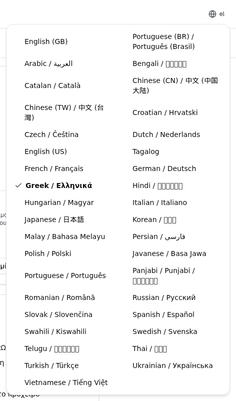
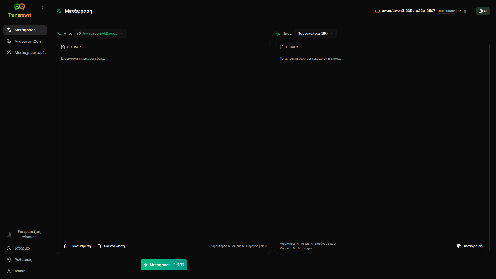
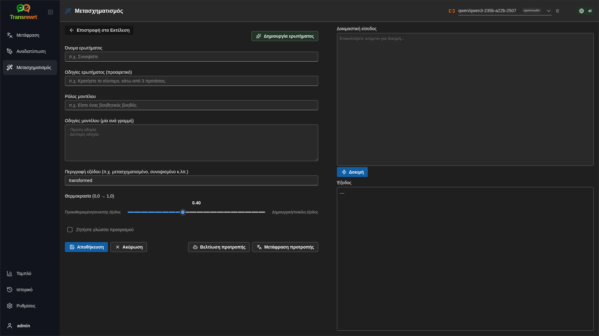
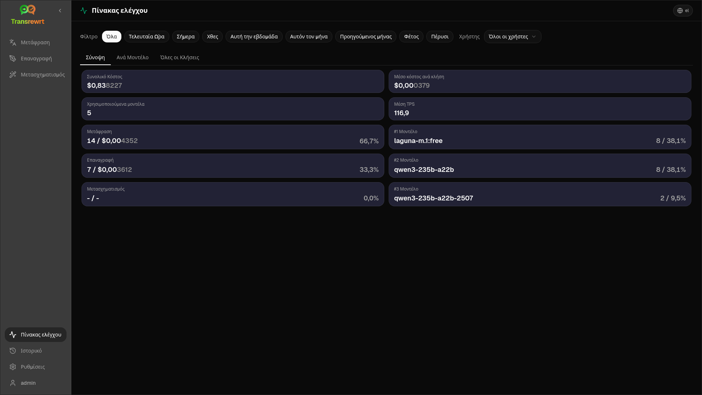
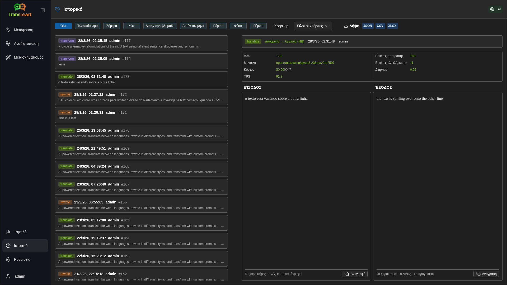
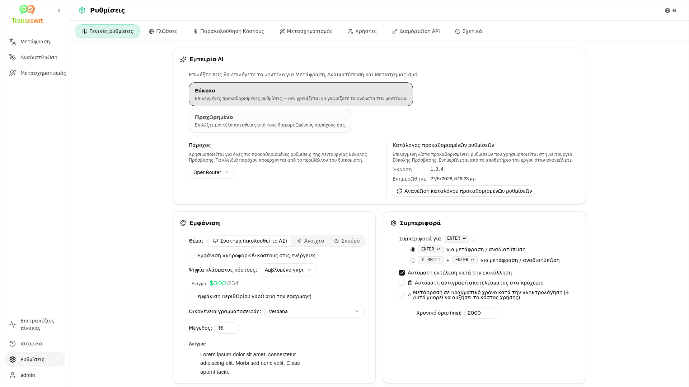

<p align="center">
  
</p>

<p align="center">
  <a href="https://github.com/wsj-br/transrewrt/releases"></a>
  <a href="LICENSE"></a>
  
  
  
</p>

Εργαλείο κειμένου με τεχνητή νοημοσύνη: μετάφραση μεταξύ γλωσσών, επαναγραφή σε διαφορετικά στυλ και μετασχηματισμός με προσαρμοσμένες προτροπές - χρησιμοποιώντας πολλούς παρόχους τεχνητής νοημοσύνης (OpenRouter, OpenAI, Anthropic, Google Gemini, DeepSeek, Groq, Mistral, xAI, Cerebras, NVIDIA, Alibaba Cloud, apikey.fun, οποιονδήποτε πάροχο συμβατό με OpenAI και τοπικό Ollama). Εκτελείται ως εφαρμογή επιτραπέζιου υπολογιστή (Electron) ή ως αυτο-φιλοξενούμενη διαδικτυακή εφαρμογή (Docker).

- **Μετάφραση** - μεταξύ δεκάδων γλωσσών, με αυτόματη ανίχνευση πηγής
- **Επαναγραφή** - διόρθωση γραμματικής, βελτίωση σαφήνειας, επίσημο/ανεπίσημο, συντόμευση, επέκταση, τεχνικό
- **Μετασχηματισμός** - προσαρμοσμένες προτροπές AI. δημιουργία και διαχείριση προτροπών, προαιρετική γλώσσα στόχος ανά προτροπή
- **Γλωσσάριο** - αποθήκευση ζευγών όρων πηγής/στόχου ανά ζεύγος γλωσσών και εφαρμογή τους κατά τη μετάφραση, ώστε οι επιλεγμένοι όροι να παραμένουν συνεπείς. διαχείριση όρων στις Ρυθμίσεις (προσθήκη/επεξεργασία/διαγραφή, εισαγωγή CSV/XLSX και εξαγωγή προτύπου)
- **Ιστορικό** - πλήρες ιστορικό εκτέλεσης με κείμενο εισόδου/εξόδου, φιλτράρισμα και εξαγωγή
- **Εύκολο & Προχωρημένο** - Εύκολη λειτουργία (προεπιλογή): επιμελημένες προεπιλογές ανά πάροχο (**Δωρεάν (OpenRouter)**, **Τυπικό**, **Προχωρημένο**, **Τεχνικό**· εμφανίζονται μόνο οι προεπιλογές με αντιστοίχιση για τον επιλεγμένο πάροχο) χωρίς επιλογή αναγνωριστικών μοντέλων· Προχωρημένη λειτουργία: πλήρης λίστα μοντέλων από τους διαμορφωμένους παρόχους σας
- **Μοντέλα & κόστος** - πίνακες ελέγχου κόστους και χρήσης (Σύνοψη, Ανά Μοντέλο, Όλες οι Κλήσεις) με εξαγωγή· Το OpenRouter εμφανίζει την πραγματική δαπάνη, άλλοι πάροχοι χρησιμοποιούν εκτιμήσεις
- **Διεπαφή χρήστη** - πολύγλωσση διεπαφή (30+ γλώσσες, υποστήριξη RTL), γραμματοσειρές, ...
- **Λειτουργία Web** - υποστήριξη πολλαπλών χρηστών με ρόλους διαχειριστή
- **Επιτραπέζιο** - εφαρμογή Electron για Windows και Linux
- **Αυτο-φιλοξενία** - εικόνα Docker για amd64 & arm64 (έτοιμο για Raspberry Pi)

Μετά την εγκατάσταση, δείτε τον [**Οδηγό Χρήστη**](USER-GUIDE.el.md) για πλήρη καθοδήγηση όλων των λειτουργιών.

<small>**Διαβάστε σε άλλες γλώσσες:** </small>
<small id="lang-list">[English (UK)](../README.md) · [Português (Brasil)](./README.pt-BR.md) · [العربية](./README.ar.md) · [বাংলা](./README.bn.md) · [Català](./README.ca.md) · [简体中文](./README.zh-Hans.md) · [繁體中文](./README.zh-Hant.md) · [Hrvatski](./README.hr.md) · [Čeština](./README.cs.md) · [Nederlands](./README.nl.md) · [English (US)](./README.en-US.md) · [Tagalog](./README.tl.md) · [Français](./README.fr.md) · [Deutsch](./README.de.md) · [Ελληνικά](./README.el.md) · [Hindi (Roman)](./README.hi-Latn.md) · [Magyar](./README.hu.md) · [Italiano](./README.it.md) · [日本語](./README.ja.md) · [한국어](./README.ko.md) · [Bahasa Melayu](./README.ms.md) · [فارسی](./README.fa.md) · [Polski](./README.pl.md) · [Basa Jawa](./README.jv.md) · [Português](./README.pt.md) · [پنجابی](./README.pa-PK.md) · [Română](./README.ro.md) · [Русский](./README.ru.md) · [Slovenčina](./README.sk.md) · [Español](./README.es.md) · [Kiswahili](./README.sw.md) · [Svenska](./README.sv.md) · [తెలుగు](./README.te.md) · [ไทย](./README.th.md) · [Türkçe](./README.tr.md) · [Українська](./README.uk.md) · [Tiếng Việt](./README.vi.md)</small>

<small>

> **Σημείωση σχετικά με τις μεταφράσεις της διεπαφής χρήστη και της τεκμηρίωσης:** Όλες οι γλώσσες διεπαφής εκτός από τα αρχικά αγγλικά (ΗΒ)
> μεταφράστηκαν χρησιμοποιώντας μοντέλα ΤΝ· η διατύπωση μπορεί να είναι ακριβής ή να περιέχει λάθη.

</small>

<br/>

<a id="table-of-contents"></a>
## Πίνακας Περιεχομένων

<!-- START doctoc generated TOC please keep comment here to allow auto update -->
<!-- DON'T EDIT THIS SECTION, INSTEAD RE-RUN doctoc TO UPDATE -->

- [Στιγμιότυπα οθόνης](#screenshots)
- [Γρήγορη έναρξη](#quick-start)
- [Λήψη κλειδιού API OpenRouter](#getting-an-openrouter-api-key)
- [Διαμόρφωση και περιβάλλον](#configuration-and-environment)
- [Ανάπτυξη και αρχιτεκτονική](#development-and-architecture)
- [Αναφορά προβλημάτων](#reporting-issues)
- [Αποποίηση](#disclaimer)
- [Άδεια χρήσης](#license)

<!-- END doctoc generated TOC please keep comment here to allow auto update -->

<br/><br/>

<a id="screenshots"></a>
## Στιγμιότυπα οθόνης

**Επιλογέας γλώσσας**



**Μετάφραση**



**Μετασχηματισμός - επεξεργαστής ερωτήματος**



**Ταμπλό**



**Ιστορικό**



**Ρυθμίσεις - επιλογή μοντέλου**



<br/><br/>

<a id="quick-start"></a>
## Γρήγορη έναρξη

<details>
<summary><b>Docker (προτείνεται για self-hosting)</b></summary>

<a id="docker"></a>

<br/>

```bash
docker pull ghcr.io/wsj-br/transrewrt:latest

OPENROUTER_API_KEY=sk-or-your-key docker run -d \
  -p 5000:5000 \
  -v transrewrt-data:/app/data \
  -e OPENROUTER_API_KEY \
  --name transrewrt-web \
  ghcr.io/wsj-br/transrewrt:latest
```

Αντικαταστήστε το `sk-or-your-key` με το [κλειδί API του OpenRouter](https://openrouter.ai/keys) (ή ορίστε κλειδιά άλλων παρόχων· δείτε [Διαμόρφωση](#configuration-and-environment)). Ανοίξτε το [http://localhost:5000](http://localhost:5000) και αλλάξτε τον προεπιλεγμένο κωδικό διαχειριστή πριν εκθέσετε την υπηρεσία.

Ορίστε τουλάχιστον ένα κλειδί παρόχου μέσω περιβάλλοντος (π.χ. `OPENROUTER_API_KEY` για OpenRouter). Περάστε τις μεταβλητές με `-e` ή `docker compose` / `.env` ώστε τα μυστικά να μην ενσωματώνονται στην εικόνα. Τα κλειδιά παρόχων **δεν** εισάγονται στο γραφικό περιβάλλον· ο διακομιστής τα διαβάζει από το περιβάλλον.

<br/>

> ℹ️ **ΣΗΜΕΙΩΣΗ**<br/>
> Στο Docker, τα πιστοποιητικά LLM ορίζονται με μεταβλητές περιβάλλοντος όπως `OPENROUTER_API_KEY`, `OPENAI_API_KEY`, `CEREBRAS_API_KEY`, … (όχι στο γραφικό περιβάλλον). Στον υπολογιστή (Electron) ρυθμίζετε τα κλειδιά στις **Ρυθμίσεις → API**.

<br/>

Ή χρησιμοποιήστε Docker Compose:

```bash
# download the compose file
wget https://github.com/wsj-br/transrewrt/raw/refs/heads/master/production.yml -O transrewrt.yml
# Edit the file to add your API keys (API_KEYs), or uncomment and adjust the `.env` file. Set the timezone (TZ) if necessary.
vi transrewrt.yml
# start the container
docker compose -f transrewrt.yml up -d
```

Δείτε την [Διαμόρφωση](#configuration-and-environment) για όλες τις μεταβλητές περιβάλλοντος, όπως `PORT`, `CONFIG_PATH`, `TZ`, και τα κλειδιά LLM (`OPENROUTER_API_KEY`, `OPENAI_API_KEY`, …).

</details>

<br/>

<details>
<summary><b>Ωρολογιακή ζώνη διακομιστή (Docker)</b></summary>

<a id="configuring-the-timezone"></a>

<br/>

Η ημερομηνία και ώρα του περιβάλλοντος χρήστη ακολουθούν την τοπικές ρυθμίσεις και τη ζώνη του **προγράμματος περιήγησης**. Για τη **επιχειρησιακή συμπεριφορά** του διακομιστή (καταγραφή και παρόμοια), ο διαμερισμός χρησιμοποιεί τη μεταβλητή περιβάλλοντος `TZ`. Η προεπιλογή είναι `TZ=Europe/London`.

Για να χρησιμοποιήσετε άλλη ζώνη, ορίστε το `TZ` στο αρχείο Compose σας, π.χ.:

```yaml
environment:
  - TZ=America/Sao_Paulo
```

Ή περάστε το κατά την εκτέλεση του διαμερισμού (Docker):

```bash
--env TZ=America/Sao_Paulo
```

Σε πολλά συστήματα Linux μπορείτε να αντιγράψετε το όνομα της ζώνης του συστήματος με:

```bash
echo TZ=\"$(</etc/timezone)\"
```

Μια λίστα έγκυρων ονομάτων ζωνών διατηρείται στη [βάση δεδομένων tz](https://en.wikipedia.org/wiki/List_of_tz_database_time_zones) (Wikipedia).

</details>

<br/>

<details>
<summary><b>Windows</b></summary>

<a id="windows-electron"></a>

<br/>

- Κατεβάστε το τελευταίο `Transrewrt Setup x.y.z.exe` από τις [Εκδόσεις](https://github.com/wsj-br/transrewrt/releases).
- Εκτελέστε το `.exe` και ακολουθήστε τον οδηγό εγκατάστασης.
- Πρώτη εκκίνηση: ξεκινήστε την εφαρμογή από το μενού Έναρξη ή τη συντόμευση επιφάνειας εργασίας.
- Εισαγάγετε τα κλειδιά API σας στις **Ρυθμίσεις → API**. Πρέπει να ρυθμίσετε τουλάχιστον έναν πάροχο· το OpenRouter είναι συνηθισμένο για δωρεάν μοντέλα.

<br/>

> ℹ️ **ΣΗΜΕΙΩΣΗ**<br/>
> Το Windows μπορεί να εμφανίσει έναν από αυτούς τους συναγερμούς ασφαλείας (κανονικό για μη υπογεγραμμένες/ανεξάρτητες εφαρμογές):
>   - **Έλεγχος Λογαριασμού Χρήστη (UAC)**: "Θέλετε να επιτρέψετε σε αυτήν την εφαρμογή από άγνωστο δημοσιευτή να κάνει αλλαγές στη συσκευή σας;" → Κάντε κλικ στο **Ναι**.
>   - **Microsoft Defender SmartScreen**: "Το Windows προστάτεψε τον υπολογιστή σας" → Κάντε κλικ στο **Περισσότερες πληροφορίες** → **Εκτέλεση ούτως ή άλλως**.
>
> Αυτό συμβαίνει επειδή η εφαρμογή δεν έχει υπογραφεί από τη Microsoft ή έναν μεγάλο δημοσιευτή· είναι ασφαλής αν έχει ληφθεί από τις επίσημες εκδόσεις μας στο GitHub (επαληθεύστε τα αθροίσματα ελέγχου στη σελίδα [Εκδόσεις](https://github.com/wsj-br/transrewrt/releases) δίπλα σε κάθε αρχείο).

<br/>

</details>

<br/>

<details>
<summary><b>Linux</b></summary>

<a id="linux-electron"></a>

<br/>

Κατεβάστε το `.AppImage` για τη CPU σας από την ενότητα [Releases](https://github.com/wsj-br/transrewrt/releases) (`x64` για τυπικούς υπολογιστές, `arm64` για πολλές συσκευές ARM, συμπεριλαμβανομένου του Raspberry Pi 4+), και στη συνέχεια:

```bash
chmod +x Transrewrt-x.y.z-x64.AppImage && ./Transrewrt-x.y.z-x64.AppImage
```

Σε x86_64/amd64 χρησιμοποιήστε το όνομα αρχείου `x64`· σε ARM64 χρησιμοποιήστε το όνομα `...-arm64.AppImage`.

Εισάγετε τα κλειδιά API σας στις **Ρυθμίσεις → API**. Πρέπει να ρυθμίσετε τουλάχιστον έναν πάροχο· ο OpenRouter είναι συχνή επιλογή για δωρεάν μοντέλα.

**Μηνύματα κονσόλας:** Οι πακεταρισμένες εκδόσεις Linux (`x64` και `arm64` AppImages) αποκρύπτουν τις προειδοποιήσεις απόσυρσης της Node στο τερματικό (π.χ. το ενσωματωμένο μοντέλο `punycode`). Αν το Chromium εμφανίζει σφάλματα GPU / EGL όπως «το GLES3 δεν υποστηρίζεται», αλλά η εφαρμογή λειτουργεί, μπορείτε να τα απενεργοποιήσετε απενεργοποιώντας την επιτάχυνση υλικού:

```bash
TRANSREWRT_DISABLE_GPU=1 ./Transrewrt-x.y.z-arm64.AppImage
```

Αυτό ισχύει και για amd64· αλλάξτε το όνομα αρχείου ώστε να ταιριάζει με τη λήψη σας.

Σε Debian/Ubuntu, ενδέχεται να χρειαστείτε επιπλέον βιβλιοθήκες **runtime** που απαιτούνται από το Chromium (αυτές συχνά υπάρχουν ήδη σε πλήρεις εγκαταστάσεις γραφικού περιβάλλοντος). Εκτελέστε τις παρακάτω εντολές αν χρειαστεί:

```bash
sudo apt update
sudo apt install -y libfuse2 libgtk-3-0 libnotify4 libnss3 libnspr4 libxss1 libxtst6 xdg-utils \
     xauth libatspi2.0-0 libdrm2 libgbm1 libxcb-dri3-0 libcups2 libasound2t64
```

αντικαταστήστε το `libasound2t64` με `libasound2` για `arm64`. Ελαχιστοποιημένες ή προσαρμοσμένες εγκαταστάσεις ενδέχεται ακόμη να αποτύχουν με ένα λείπον αρχείο `.so`. Εγκαταστήστε το πακέτο που αναφέρεται στο μήνυμα σφάλματος (συνηθισμένα επιπλέον: `libatk1.0-0`, `libatk-bridge2.0-0`, `libgbm1`, `libdrm2`). Σε ορισμένα περιβάλλοντα, ενδέχεται να χρειαστεί να εκτελέσετε την εφαρμογή χρησιμοποιώντας το `APPIMAGE_EXTRACT_AND_RUN=1 ./Transrewrt-….AppImage`.

<br/>

> ℹ️ **ΣΗΜΕΙΩΣΗ**<br/>
> Το macOS δεν υποστηρίζεται προς το παρόν. Το Transrewrt είναι διαθέσιμο για Windows, Linux και Docker.

</details>

<br/>

Όταν η εφαρμογή εκτελείται, δείτε τον [**Οδηγό Χρήστη**](USER-GUIDE.el.md) για να μάθετε πώς να μεταφράζετε, αναδιατυπώνετε και μετασχηματίζετε κείμενο, να διαχειρίζεστε ερωτήματα και να ρυθμίζετε μοντέλα.

<br/><br/>

<a id="getting-an-openrouter-api-key"></a>
## Λήψη κλειδιού API OpenRouter

Το Transrewrt υποστηρίζει πολλούς παρόχους τεχνητής νοημοσύνης. Ο [OpenRouter](https://openrouter.ai) είναι δημοφιλής επιλογή επειδή συγκεντρώνει πολλά μοντέλα υπό ένα κλειδί και προσφέρει δωρεάν μοντέλα.

1. Εγγραφείτε ή συνδεθείτε στο [openrouter.ai](https://openrouter.ai).
2. Ανοίξτε τη σελίδα [Keys](https://openrouter.ai/keys) και δημιουργήστε ένα νέο κλειδί (δώστε του όνομα και προαιρετικά ορίστε όριο πιστωτικού). Μπορείτε να χρησιμοποιήσετε δωρεάν μοντέλα χωρίς να προσθέσετε πίστωση.
3. **Desktop (Electron):** επικολλήστε τα κλειδιά στις **Ρυθμίσεις → API**. **Docker:** ορίστε μεταβλητές περιβάλλοντος όπως `OPENROUTER_API_KEY` (δείτε [Γρήγορη Εκκίνηση](#quick-start)).

Μην χρησιμοποιείτε το μοντέλο **Body Builder** του OpenRouter ([`openrouter/bodybuilder`](https://openrouter.ai/openrouter/bodybuilder)) για μετάφραση, αναδιατύπωση ή μετασχηματισμό· επιστρέφει φορτία αιτημάτων JSON, όχι το ολοκληρωμένο κείμενο για αυτές τις εργασίες. Δείτε [Ρυθμίσεις → Μοντέλα](USER-GUIDE.el.md#models) στο Εγχειρίδιο Χρήστη.

Μπορείτε επίσης να χρησιμοποιήσετε άλλους παρόχους (OpenAI, Anthropic, Google Gemini, DeepSeek, Groq, Mistral, xAI, Cerebras, NVIDIA, Alibaba Cloud, apikey.fun, οποιονδήποτε πάροχο συμβατό με OpenAI) ή να εκτελέσετε μοντέλα τοπικά με το [Ollama](https://ollama.com). Δείτε [Ρυθμίσεις](#configuration-and-environment) για την πλήρη λίστα υποστηριζόμενων παρόχων και μεταβλητών περιβάλλοντος.

</br>

> ⚠️ **ΠΡΟΕΙΔΟΠΟΙΗΣΗ**<br/>
> Αν χρησιμοποιείτε το Ollama από άλλη συσκευή, container ή υπηρεσία, θυμηθείτε να το ρυθμίσετε ώστε να επιτρέπει εξωτερικές συνδέσεις (όχι μόνο localhost).

<br/><br/>

<a id="configuration-and-environment"></a>
## Διαμόρφωση και περιβάλλον

</br>

**Θέσεις αρχείου ρυθμίσεων**

| Ανάπτυξη | Τοποθεσία διαμόρφωσης |
| ------------------ | ------------------------------------------------- |
| Electron (Windows) | `%APPDATA%\transrewrt\` |
| Electron (Linux) | `~/.config/transrewrt/` |
| Ιστός / Docker | `/app/data/config.json` (χρησιμοποιήστε τόμο για διατήρηση) |

<br/>

**Μεταβλητές περιβάλλοντος** (μόνο για web/Docker· το Electron χρησιμοποιεί το τοπικό αρχείο ρυθμίσεων)

| Μεταβλητή                  | Περιγραφή                                                                             |
|---------------------------|-----------------------------------------------------------------------------------------|
| `PORT`                    | Θύρα ακρόασης διακομιστή  (προεπιλογή `5000`)                                             |
| `CONFIG_PATH`        | Διαδρομή προς το αρχείο ρυθμίσεων (προεπιλογή: `/app/data/config.json`)                |
| `TZ` | ζώνη ώρας για την ώρα του διακομιστή (καταγραφή κ.λπ.) (προεπιλογή `Europe/London`) |
| `HISTORY_DISABLED`   | Εξαναγκάζει την απενεργοποίηση του ιστορικού εκτέλεσης (προαιρετικό, προεπιλογή `false`)                  |
| `OPENROUTER_API_KEY` | Κλειδί API OpenRouter |
| `OPENAI_API_KEY` | Κλειδί API OpenAI |
| `CEREBRAS_API_KEY` | Κλειδί API Cerebras |
| `ANTHROPIC_API_KEY` | Κλειδί API Anthropic |
| `GOOGLE_API_KEY` | Κλειδί API Google Gemini |
| `DEEPSEEK_API_KEY` | Κλειδί API DeepSeek |
| `GROQ_API_KEY` | Κλειδί API Groq |
| `MISTRAL_API_KEY` | Κλειδί API Mistral |
| `OLLAMA_URL` | Βασικό URL Ollama (π.χ. `http://host.docker.internal:11434`) |
| `XAI_API_KEY`        | Κλειδί API xAI                                                                  |
| `NVIDIA_API_KEY`          | Κλειδί API NVIDIA                                                                          |
| `ALIBABA_API_KEY`         | Κλειδί API Alibaba Cloud (DashScope)                                                       |
| `APIFUN_API_KEY`          | Κλειδί API apikey.fun                                                                      |
| `CUSTOM_PROVIDER_NAME` | Όνομα εμφάνισης για προσαρμοσμένο πάροχο συμβατό με OpenAI (απαιτούνται και οι τρεις προσαρμοσμένες μεταβλητές) |
| `CUSTOM_PROVIDER_URL`     | Βασική διεύθυνση URL για έναν προσαρμοσμένο πάροχο συμβατό με OpenAI (π.χ. `https://my-llm.example.com/v1`) |
| `CUSTOM_PROVIDER_API_KEY` | Κλειδί API για προσαρμοσμένο πάροχο συμβατό με OpenAI                         |

**Προσαρμοσμένος πάροχος συμβατός με OpenAI (web/Docker):** για οποιοδήποτε συμβατό με OpenAI τελικό σημείο που δεν περιλαμβάνεται στην παραπάνω ενσωματωμένη λίστα (π.χ. ένας αυτο-φιλοξενούμενος διακομιστής ή πύλη), ορίστε και τις τρεις μεταβλητές `CUSTOM_PROVIDER_*` — για παράδειγμα `CUSTOM_PROVIDER_NAME=MyProvider`, `CUSTOM_PROVIDER_URL=https://my-llm.example.com/v1`, και το αντίστοιχο κλειδί API. Τα μοντέλα εμφανίζονται σε **Προχωρημένη** λειτουργία στις Ρυθμίσεις → Μοντέλα με αναγνωριστικά όπως `MyProvider/…` (όνομα παρόχου ως πρόθεμα).

**Λειτουργία ιδιωτικότητας:** Για να εξαναγκάσετε την απενεργοποίηση της παρακολούθησης του ιστορικού, ανεξάρτητα από το `config.json` ή τις προτιμήσεις ανά χρήστη, ορίστε το `HISTORY_DISABLED` σε `true` ή `1` (χωρίς διάκριση πεζών/κεφαλαίων) για τη **διεργασία web/Docker server** και/ή τη **κύρια διεργασία desktop Electron** (π.χ. περιβάλλον συστήματος ή εκκινητή — όχι μόνο το renderer). Αυτό απενεργοποιεί την αποθήκευση του ιστορικού εισόδου/εξόδου, κλειδώνει τις **Ρυθμίσεις → Γενικές ρυθμίσεις → Ιστορικό** και αποκλείει τις σχετικές με το Ιστορικό APIs.

Διαμορφώστε μόνο τους παρόχους που χρησιμοποιείτε. Τα αναγνωριστικά μοντέλων έχουν χώρους ονομάτων (`openrouter/…`, `openai/…`, `cerebras/…`, `ollama/…`, `{providerName}/…` για προσαρμοσμένα τελικά σημεία, κ.λπ.).

**Εμφάνιση κόστους:** Το OpenRouter επιστρέφει το ακριβές χρεωμένο κόστος όταν εφαρμόζεται. Άλλοι πάροχοι χρησιμοποιούν **εκτιμώμενο** κόστος από τη δημόσια τιμολόγηση μοντέλων του OpenRouter όταν είναι διαθέσιμο κλειδί OpenRouter· διαφορετικά, το κόστος μη-OpenRouter μπορεί να εμφανίζεται ως `0`. Οι εκτιμήσεις δεν είναι τιμολόγια.

<br/>

**Δεδομένα και διατήρηση:** Για Docker, προσαρτήστε έναν τόμο στο `/app/data` ώστε το `config.json` και η βάση δεδομένων SQLite να διατηρούνται μετά από επανεκκινήσεις του container. Χωρίς τόμο, όλα τα δεδομένα χάνονται όταν το container σταματήσει.

<br/>

**Πιστοποίηση ιστού:**

- Προεπιλεγμένος διαχειριστής: `admin` / `transrewrt26`.
- Διαχειριστείτε χρήστες στις **Ρυθμίσεις → Χρήστες**.
- Επαναφορά κωδικού πρόσβασης: `docker exec <container> reset-web-password '<username>' '<new-password>'`

<br/>

> ⚠️ **ΠΡΟΕΙΔΟΠΟΙΗΣΗ**<br/>
> Αλλάξτε άμεσα τον προεπιλεγμένο κωδικό πρόσβασης διαχειριστή σε κάθε υπολογιστή που είναι προσβάσιμος από δίκτυο.

<br/>

Οι ρυθμίσεις κλειδιού (γραμματοσειρά, μοντέλα, γλώσσες, κ.λπ.) είναι διαθέσιμες στις Ρυθμίσεις της εφαρμογής.

<br/><br/>

<a id="development-and-architecture"></a>
## Ανάπτυξη και αρχιτεκτονική

- **Ανάπτυξη:** Ρύθμιση, κατασκευή, δοκιμή και εγκατάσταση (Electron, Web, Docker) - δείτε [dev/DEVELOPMENT.md](../dev/DEVELOPMENT.md).
- **Αρχιτεκτονική και επισκόπηση συστήματος:** Δομή φακέλων, τεχνολογικό στέκαρ, αποφάσεις σχεδίασης - δείτε [dev/SYSTEM-OVERVIEW.md](../dev/SYSTEM-OVERVIEW.md).

<br/><br/>

<a id="reporting-issues"></a>
## Αναφορά προβλημάτων

Ανοίξτε ένα ζήτημα στο [GitHub](https://github.com/wsj-br/transrewrt/issues). Συμπεριλάβετε την πλατφόρμα σας (Windows / Linux / Docker) και την έκδοση της εφαρμογής (φαίνεται στο παράθυρο Σχετικά ή στη σελίδα Εκδόσεις).

<br/><br/>

<a id="disclaimer"></a>
## Αποποίηση

Τα ονόματα και τα εικονίδια προϊόντων ανήκουν στους νόμιμους ιδιοκτήτες τους και χρησιμοποιούνται αποκλειστικά για αναγνώριση. Αυτό το λογισμικό δεν σχετίζεται ούτε εγκρίνεται από οποιαδήποτε από τις αναφερόμενες μάρκες.

<br/><br/>

<a id="license"></a>
## Άδεια

Πνευματικά δικαιώματα © 2026 Waldemar Scudeller Jr.

[Apache License 2.0](../LICENSE)
