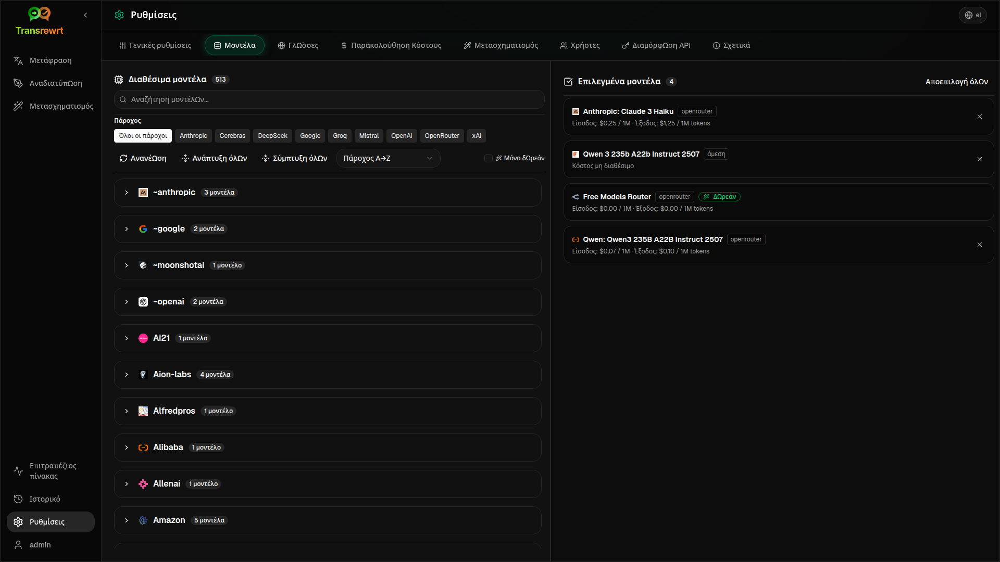

<p align="center">
  
</p>

<p align="center">
  <a href="https://github.com/wsj-br/transrewrt/releases"></a>
  <a href="LICENSE"></a>
  
  
  
</p>

Εργαλείο κειμένου με δυνατότητες τεχνητής νοημοσύνης: μετάφραση μεταξύ γλωσσών, αναδιατύπωση σε διαφορετικούς τύπους, και μετασχηματισμός με προσαρμοσμένα ερωτήματα — χρησιμοποιώντας πολλαπλούς παρόχους τεχνητής νοημοσύνης (OpenRouter, OpenAI, Anthropic, Google Gemini, DeepSeek, Groq, Mistral, xAI, και τοπικό Ollama). Λειτουργεί ως εφαρμογή επιφάνειας εργασίας (Electron) ή ως αυτο-φιλοξενούμενη ιστοεφαρμογή (Docker).

- **Μετάφραση** — μεταξύ δεκάδων γλωσσών, με αυτόματη ανίχνευση προέλευσης
- **Αναδιατύπωση** — διόρθωση γραμματικής, βελτίωση σαφήνειας, επίσημη/ανεπίσημη, σύντομη μορφή, επέκταση, τεχνική
- **Μετασχηματισμός** — προσαρμοσμένα ερωτήματα τεχνητής νοημοσύνης· δημιουργία και διαχείριση ερωτημάτων, προαιρετική στόχος γλώσσα ανά ερώτημα
- **Ιστορικό** — πλήρες ιστορικό εκτέλεσης με είσοδο/έξοδο κειμένου, φιλτράρισμα και εξαγωγή
- **Μοντέλα & κόστος** — επιλογή μοντέλων από οποιονδήποτε διαμορφωμένο πάροχο· ταμπλό κόστους και χρήσης με αρχεία καταγραφής, περιλήψεις ανά μοντέλο/λειτουργία/ημέρα
- **Διεπαφή χρήστη** — πολύγλωσση διεπαφή (πάνω από 30 γλώσσες, υποστήριξη RTL), γραμματοσειρές, ...
- **Λειτουργία ιστού** — υποστήριξη πολλαπλών χρηστών με ρόλους διαχειριστή
- **Επιφάνεια εργασίας** — εφαρμογή Electron για Windows και Linux
- **Αυτο-φιλοξενούμενη** — εικόνα Docker για amd64 & arm64 (έτοιμη για Raspberry Pi)

Μετά την εγκατάσταση, ανατρέξτε στον **[Οδηγό Χρήστη](USER-GUIDE.el.md)** για πλήρη ξενάγηση σε όλες τις λειτουργίες.

<small>**Διαβάστε σε άλλες γλώσσες:** </small>
<small id="lang-list">[English (UK)](../README.md) · [Português (BR)](README.pt-BR.md) · [العربية](README.ar.md) · [বাংলা](README.bn.md) · [Català](README.ca.md) · [简体中文](README.zh-CN.md) · [繁體中文](README.zh-TW.md) · [Hrvatski](README.hr.md) · [Čeština](README.cs.md) · [Nederlands](README.nl.md) · [English (US)](README.en-US.md) · [Filipino](README.tl.md) · [Français](README.fr.md) · [Deutsch](README.de.md) · [Ελληνικά](README.el.md) · [हिन्दी](README.hi.md) · [Magyar](README.hu.md) · [Italiano](README.it.md) · [日本語](README.ja.md) · [Basa Jawa](README.jv.md) · [한국어](README.ko.md) · [Bahasa Melayu](README.ms.md) · [فارسی](README.fa.md) · [Polski](README.pl.md) · [Português (PT)](README.pt.md) · [ਪੰਜਾਬੀ](README.pa.md) · [Română](README.ro.md) · [Русский](README.ru.md) · [Slovenčina](README.sk.md) · [Español](README.es.md) · [Kiswahili](README.sw.md) · [Svenska](README.sv.md) · [తెలుగు](README.te.md) · [ภาษาไทย](README.th.md) · [Türkçe](README.tr.md) · [Українська](README.uk.md) · [Tiếng Việt](README.vi.md)</small>

<small>

> **Σημείωση για τις μεταφράσεις της διεπαφής χρήστη και της τεκμηρίωσης:** Όλες οι γλώσσες διεπαφής, εκτός από τα αρχικά Αγγλικά (ΗΒ),
> μεταφράστηκαν με χρήση μοντέλων τεχνητής νοημοσύνης· η διατύπωση μπορεί να είναι ανακριβής ή να περιέχει λάθη.

</small>

<br/>

<a id="screenshots"></a>
## Στιγμιότυπα οθόνης

**Επιλογέας γλώσσας**


**Μετάφραση**


**Μετασχηματισμός - επεξεργαστής ερωτήματος**


**Ταμπλό**


**Ιστορικό**


**Ρυθμίσεις - επιλογή μοντέλου**



<br/><br/>

<a id="table-of-contents"></a>
## Πίνακας Περιεχομένων

<!-- START doctoc generated TOC please keep comment here to allow auto update -->
<!-- DON'T EDIT THIS SECTION, INSTEAD RE-RUN doctoc TO UPDATE -->

- [Γρήγορη έναρξη](#quick-start)
- [Εγκατάσταση](#installation)
  - [Windows (Electron)](#windows-electron)
  - [Linux (Electron)](#linux-electron)
  - [Docker](#docker)
  - [Διαμόρφωση της ζώνης ώρας](#configuring-the-timezone)
- [Λήψη κλειδιού API OpenRouter](#getting-an-openrouter-api-key)
- [Διαμόρφωση και περιβάλλον](#configuration-and-environment)
- [Ανάπτυξη και αρχιτεκτονική](#development-and-architecture)
- [Αναφορά προβλημάτων](#reporting-issues)
- [Αποποίηση](#disclaimer)
- [Άδεια](#license)

<!-- END doctoc generated TOC please keep comment here to allow auto update -->

<br/><br/>

<a id="quick-start"></a>
## Γρήγορη έναρξη

**Docker (προτείνεται για αυτο-φιλοξενία)**

```bash
docker pull ghcr.io/wsj-br/transrewrt:latest

OPENROUTER_API_KEY=sk-or-your-key docker run -d \
  -p 5000:5000 \
  -v transrewrt-data:/app/data \
  -e OPENROUTER_API_KEY \
  --name transrewrt-web \
  ghcr.io/wsj-br/transrewrt:latest
```

Αντικαταστήστε το `sk-or-your-key` με το [κλειδί API του OpenRouter](https://openrouter.ai/keys) (ή ορίστε κλειδιά άλλων παρόχων· δείτε [Διαμόρφωση](#configuration-and-environment)). Ανοίξτε το [http://localhost:5000](http://localhost:5000) και αλλάξτε τον προεπιλεγμένο κωδικό διαχειριστή πριν εκθέσετε την υπηρεσία.

<br/>

> ℹ️ **ΣΗΜΕΙΩΣΗ**<br/>
> Στο Docker, τα πιστοποιητικά LLM ορίζονται μέσω μεταβλητών περιβάλλοντος όπως `OPENROUTER_API_KEY`, `OPENAI_API_KEY`, `CEREBRAS_API_KEY`, … (όχι μέσω του γραφικού περιβάλλοντος). Στην έκδοση για επιτραπέζιο (Electron) ορίζετε τα κλειδιά στις **Ρυθμίσεις → API**.

<br/>

**Windows**

Κατεβάστε το τελευταίο `Transrewrt Setup x.y.z.exe` από τις [Εκδόσεις](https://github.com/wsj-br/transrewrt/releases), εκτελέστε τον εγκαταστάτη και εκκινήστε την εφαρμογή από το μενού Έναρξη ή τη συντόμευση στην επιφάνεια εργασίας. Εισαγάγετε τα κλειδιά API σας στις **Ρυθμίσεις → API**. Πρέπει να ρυθμίσετε τουλάχιστον έναν πάροχο· ο OpenRouter είναι συνηθισμένος για δωρεάν μοντέλα.

<br/>

**Linux**

Κατεβάστε το `.AppImage` για την CPU σας από τις [Εκδόσεις](https://github.com/wsj-br/transrewrt/releases) (`x64` για συνηθισμένους υπολογιστές, `arm64` για πολλές συσκευές ARM, συμπεριλαμβανομένου του Raspberry Pi 4+), και στη συνέχεια:

```bash
chmod +x Transrewrt-x.y.z-x64.AppImage && ./Transrewrt-x.y.z-x64.AppImage
```

Εισαγάγετε τα κλειδιά API σας στις **Ρυθμίσεις → API**. Πρέπει να ρυθμίσετε τουλάχιστον έναν πάροχο· ο OpenRouter είναι συνηθισμένος για δωρεάν μοντέλα.

Σε Debian/Ubuntu ίσως χρειαστεί να εγκαταστήσετε πρόσθετες εξαρτήσεις πρώτα:

```bash
sudo apt install libgtk-3-0 libnotify-dev libnss3 libxss1 libasound2 libxtst6 xauth
```

Δείτε [Εγκατάσταση → Linux](#linux-electron) για λεπτομέρειες.

<br/>

> ℹ️ **ΣΗΜΕΙΩΣΗ**<br/>
> Το macOS δεν υποστηρίζεται προς το παρόν. Το Transrewrt είναι διαθέσιμο για Windows, Linux και Docker.

<br/>

Όταν η εφαρμογή εκτελείται, δείτε το **[Οδηγό Χρήστη](USER-GUIDE.el.md)** για να μάθετε πώς να μεταφράζετε, αναδιατυπώνετε και μετασχηματίζετε κείμενο, να διαχειρίζεστε προτροπές και να ρυθμίζετε μοντέλα.

<br/><br/>

<a id="installation"></a>
## Εγκατάσταση

<a id="windows-electron"></a>
### Windows (Electron)

- Κατεβάστε τον τελευταίο εγκαταστάτη από τις [Εκδόσεις](https://github.com/wsj-br/transrewrt/releases).
- Εκτελέστε το `.exe` και ακολουθήστε τις οδηγίες του εγκαταστάτη.
- Πρώτη εκκίνηση: ξεκινήστε την εφαρμογή από το μενού Έναρξη ή τη συντόμευση στην επιφάνεια εργασίας.

<br/>

> ℹ️ **ΣΗΜΕΙΩΣΗ**<br/>
> Το Windows μπορεί να εμφανίσει μία από τις παρακάτω προειδοποιήσεις ασφαλείας (φυσιολογικό για μη υπογεγραμμένες/ανεξάρτητες εφαρμογές):
>   - **Έλεγχος Λογαριασμού Χρήστη (UAC)**: «Θέλετε να επιτρέψετε σε αυτή την εφαρμογή από άγνωστο δημοσιευτή να κάνει αλλαγές στη συσκευή σας;» → Κάντε κλικ στο **Ναι**.
>   - **Microsoft Defender SmartScreen**: «Το Windows προστάτεψε τον υπολογιστή σας» → Κάντε κλικ στο **Περισσότερες πληροφορίες** → **Εκτέλεση ούτως ή άλλως**.
>
> Αυτό συμβαίνει επειδή η εφαρμογή δεν έχει υπογραφεί από τη Microsoft ή έναν μεγάλο δημοσιευτή· είναι ασφαλής αν έχει ληφθεί από τις επίσημες εκδόσεις μας στο GitHub
>  (επαληθεύστε το αθροιστικό ελέγχου SHA256 παρακάτω).

<br/>

<a id="linux-electron"></a>
### Linux (Electron)

- Κατεβάστε το αντίστοιχο `.AppImage` (`x64` ή `arm64`) από την ενότητα [Releases](https://github.com/wsj-br/transrewrt/releases).
- Εκτελέστε: `chmod +x Transrewrt-x.y.z-x64.AppImage && ./Transrewrt-x.y.z-x64.AppImage` σε x86_64/amd64, ή χρησιμοποιήστε το όνομα αρχείου `...-arm64.AppImage` σε ARM64.
- Επιπλέον εξαρτήσεις (Debian/Ubuntu): `sudo apt install libgtk-3-0 libnotify-dev libnss3 libxss1 libasound2 libxtst6 xauth`
- Δείτε το [dev/DEVELOPMENT.md](../dev/DEVELOPMENT.md) για περισσότερες πληροφορίες.

<br/>

<a id="docker"></a>
### Docker

- Λήψη: `docker pull ghcr.io/wsj-br/transrewrt:latest`
- Ορίστε τουλάχιστον ένα κλειδί παρόχου μέσω περιβάλλοντος (π.χ. `OPENROUTER_API_KEY` για OpenRouter). Περάστε τις μεταβλητές με `-e` ή μέσω `docker compose` / `.env` ώστε τα μυστικά να μην ενσωματωθούν στην εικόνα.
- Τα κλειδιά παρόχου **δεν** εισάγονται στο web UI· ο διακομιστής τα διαβάζει από το περιβάλλον.

Παράδειγμα - ονομαστικός τόμος για διαρκή αποθήκευση (κλειδί OpenRouter μέσω env):

```bash
OPENROUTER_API_KEY=sk-or-your-key docker run -d \
  -p 5000:5000 \
  -v transrewrt-data:/app/data \
  -e OPENROUTER_API_KEY \
  --name transrewrt-web \
  ghcr.io/wsj-br/transrewrt:latest
```

ή, αν προτιμάτε το Docker Compose, χρησιμοποιήστε:

```
# download the compose file
wget https://github.com/wsj-br/transrewrt/raw/refs/heads/master/production.yml -O transrewrt.yml
# edit the file to add the API_KEYS and adjust the timezone (TZ)
vi transrewrt.yml
# start the container
docker compose -f transrewrt.yml up -d
```

Δείτε το [Configuration](#configuration-and-environment) για όλες τις μεταβλητές περιβάλλοντος, όπως `PORT`, `CONFIG_PATH`, `TZ` και κλειδιά LLM (`OPENROUTER_API_KEY`, `OPENAI_API_KEY`, …).

<a id="configuring-the-timezone"></a>
### Διαμόρφωση της ώρας ζώνης

Η ημερομηνία και ώρα του περιβάλλοντος χρήστη της εφαρμογής ακολουθούν την τοπικές ρυθμίσεις και τη ζώνη ώρας του **προγράμματος περιήγησης**. Για τη **συμπεριφορά στην πλευρά του διακομιστή** (καταγραφή και παρόμοια), ο διαμόρφωση χρησιμοποιεί τη μεταβλητή περιβάλλοντος `TZ`. Η προεπιλογή είναι `TZ=Europe/London`.

Για να χρησιμοποιήσετε άλλη ζώνη ώρας, ορίστε το `TZ` στο αρχείο Compose σας, π.χ.:

```yaml
environment:
  - TZ=America/Sao_Paulo
```

Ή περάστε το κατά την εκτέλεση του container (Docker):

```bash
--env TZ=America/Sao_Paulo
```

Σε πολλά συστήματα Linux μπορείτε να αντιγράψετε το όνομα της ζώνης ώρας του συστήματος με:

```bash
echo TZ=\"$(</etc/timezone)\"
```

Μια λίστα έγκυρων ονομάτων ζωνών ώρας διατηρείται στη [βάση δεδομένων tz](https://en.wikipedia.org/wiki/List_of_tz_database_time_zones) (Wikipedia).

<br/><br/>

<a id="getting-an-openrouter-api-key"></a>
## Λήψη κλειδιού OpenRouter API

Το Transrewrt υποστηρίζει πολλούς παρόχους τεχνητής νοημοσύνης. Το [OpenRouter](https://openrouter.ai) είναι μια δημοφιλής επιλογή επειδή συγκεντρώνει πολλά μοντέλα υπό ένα κλειδί και προσφέρει δωρεάν μοντέλα.

1. Εγγραφείτε ή συνδεθείτε στο [openrouter.ai](https://openrouter.ai).
2. Ανοίξτε τη σελίδα [Keys](https://openrouter.ai/keys) και δημιουργήστε ένα νέο κλειδί (δώστε του όνομα, και προαιρετικά ορίστε όριο πίστωσης). Μπορείτε να χρησιμοποιήσετε δωρεάν μοντέλα χωρίς να προσθέσετε πίστωση.
3. **Επιτραπέζια (Electron):** επικολλήστε τα κλειδιά στις **Ρυθμίσεις → API**. **Docker:** ορίστε μεταβλητές περιβάλλοντος όπως `OPENROUTER_API_KEY` (δείτε [Γρήγορη έναρξη](#quick-start)).

Μην χρησιμοποιείτε το μοντέλο **Body Builder** του OpenRouter ([`openrouter/bodybuilder`](https://openrouter.ai/openrouter/bodybuilder)) για μετάφραση, αναδιατύπωση ή μετασχηματισμό: επιστρέφει φορτία JSON αιτήματος, όχι το ολοκληρωμένο κείμενο για αυτές τις εργασίες. Δείτε [Ρυθμίσεις → Μοντέλα](USER-GUIDE.el.md#models) στον Οδηγό Χρήστη.

Μπορείτε επίσης να χρησιμοποιήσετε άλλους παρόχους (OpenAI, Anthropic, Google Gemini, DeepSeek, Groq, Mistral, xAI, Cerebras) ή να εκτελέσετε μοντέλα τοπικά με [Ollama](https://ollama.com). Δείτε το [Configuration](#configuration-and-environment) για την πλήρη λίστα υποστηριζόμενων παρόχων και μεταβλητών περιβάλλοντος.

> ⚠️ **ΠΡΟΕΙΔΟΠΟΙΗΣΗ**<br/>
> Αν χρησιμοποιείτε το Ollama από άλλη συσκευή, container ή υπηρεσία, θυμηθείτε να το ρυθμίσετε ώστε να επιτρέπει εξωτερικές συνδέσεις (όχι μόνο localhost).

Για όρια, BYOK και άλλα, δείτε [ταυτοποίηση OpenRouter](https://openrouter.ai/docs/api/reference/authentication).

<br/><br/>

<a id="configuration-and-environment"></a>
## Διαμόρφωση και περιβάλλον

**Τοποθεσίες αρχείων διαμόρφωσης**

| Εγκατάσταση         | Τοποθεσία διαμόρφωσης                                   |
| ------------------ | ------------------------------------------------- |
| Electron (Windows) | `%APPDATA%\transrewrt\`                           |
| Electron (Linux)   | `~/.config/transrewrt/`                           |
| Web / Docker       | `/app/data/config.json` (χρησιμοποιήστε έναν τόμο για διατήρηση) |

<br/>

**Μεταβλητές περιβάλλοντος** (μόνο για web/Docker· το Electron χρησιμοποιεί το τοπικό αρχείο διαμόρφωσης)

| Μεταβλητή         | Προεπιλογή                 | Περιγραφή |
| ---------------- | ----------------------- | ----------- |
| `PORT`           | `5000`                  | Θύρα ακρόασης του διακομιστή |
| `CONFIG_PATH`    | `/app/data/config.json` | Διαδρομή προς το αρχείο διαμόρφωσης |
| `TZ`             | `Europe/London`         | Ζώνη ώρας IANA για την ώρα της πλευράς διακομιστή (καταγραφή κ.λπ.)· το περιβάλλον χρήστη ακολουθεί το πρόγραμμα περιήγησης. Δείτε [Docker → timezone](#docker-timezone) |
| `OPENROUTER_API_KEY` | *(κενό)*               | Κλειδί API OpenRouter |
| `OPENAI_API_KEY`     | *(κενό)*               | Κλειδί API OpenAI |
| `CEREBRAS_API_KEY`   | *(κενό)*               | Κλειδί API Cerebras |
| `ANTHROPIC_API_KEY`  | *(κενό)*               | Κλειδί API Anthropic |
| `GOOGLE_API_KEY`     | *(κενό)*               | Κλειδί API Google Gemini |
| `DEEPSEEK_API_KEY`   | *(κενό)*               | Κλειδί API DeepSeek |
| `GROQ_API_KEY`       | *(κενό)*               | Κλειδί API Groq |
| `MISTRAL_API_KEY`    | *(κενό)*               | Κλειδί API Mistral |
| `OLLAMA_URL`     | *(κενό)*               | Βασικό URL Ollama (π.χ. `http://host.docker.internal:11434`) |
| `XAI_API_KEY`        | *(κενό)*               | Κλειδί API xAI |

Διαμορφώστε μόνο τους παρόχους που χρησιμοποιείτε. Οι ταυτότητες μοντέλων είναι ονοματοχώροι (`openrouter/…`, `openai/…`, `cerebras/…`, `ollama/…`, κ.λπ.).

**Εμφάνιση κόστους:** Το OpenRouter επιστρέφει το ακριβές χρεωμένο κόστος όταν εφαρμόζεται. Άλλοι πάροχοι χρησιμοποιούν **εκτιμώμενο** κόστος από τη δημόσια τιμολόγηση μοντέλων του OpenRouter όταν είναι διαθέσιμο κλειδί OpenRouter· χωρίς αυτό, το κόστος μη-OpenRouter μπορεί να εμφανίζεται ως `0`. Οι εκτιμήσεις δεν είναι τιμολόγια.

<br/>

**Δεδομένα και διατήρηση:** Για Docker, προσαρτήστε έναν τόμο στο `/app/data` ώστε το `config.json` και η βάση δεδομένων SQLite να διατηρούνται μεταξύ επανεκκινήσεων του container. Χωρίς τόμο, όλα τα δεδομένα χάνονται όταν το container σταματήσει.

**Προγραμματιστές:** Μετά τη λήψη αλλαγών που αντικαθιστούν την παλιά διαμόρφωση με μοναδικό κλειδί, επαναφέρετε ή συγχωνεύστε το `data/config.json` με τη νέα προεπιλεγμένη μορφή από το `src/config-defaults/config_default.json`, αν το τοπικό αρχείο σας χρησιμοποιεί ακόμη πεδία που αφαιρέθηκαν (`api_key`, `api_url`, επιλογές proxy).

<br/>

**Ταυτοποίηση ιστού:**

- Προεπιλεγμένος διαχειριστής: `admin` / `transrewrt26`.
- Διαχειριστείτε τους χρήστες στο **Ρυθμίσεις → Χρήστες**.
- Επαναφορά κωδικού πρόσβασης: `docker exec <container> reset-web-password '<username>' '<new-password>'`
  (από την πηγή: `pnpm run reset-web-password -- <username> <new-password>`)

<br/>

> ⚠️ **ΠΡΟΕΙΔΟΠΟΙΗΣΗ**<br/>
> Αλλάξτε αμέσως τον προεπιλεγμένο κωδικό πρόσβασης διαχειριστή σε κάθε υπολογιστή που έχει πρόσβαση στο δίκτυο.

<br/>

Οι βασικές ρυθμίσεις (γραμματοσειρά, μοντέλα, γλώσσες κ.λπ.) είναι διαθέσιμες στις Ρυθμίσεις της εφαρμογής.

<br/><br/>

<a id="development-and-architecture"></a>
## Ανάπτυξη και αρχιτεκτονική

- **Ανάπτυξη:** Ρύθμιση, κατασκευή, δοκιμή και εγκατάσταση (Electron, Web, Docker) - δείτε **[dev/DEVELOPMENT.md](../dev/DEVELOPMENT.md)**.
- **Αρχιτεκτονική και επισκόπηση συστήματος:** Δομή φακέλων, τεχνολογικό stack, αποφάσεις σχεδιασμού - δείτε **[dev/SYSTEM-OVERVIEW.md](../dev/SYSTEM-OVERVIEW.md)**.

<br/><br/>

<a id="reporting-issues"></a>
## Αναφορά προβλημάτων

Ανοίξτε ένα ζήτημα στο [GitHub](https://github.com/wsj-br/transrewrt/issues). Συμπεριλάβετε την πλατφόρμα σας (Windows / Linux / Docker) και την έκδοση της εφαρμογής (που εμφανίζεται στο παράθυρο Σχετικά ή στη σελίδα Εκδόσεις).

<br/><br/>

<a id="disclaimer"></a>
## Αποποίηση

Τα ονόματα και τα εικονίδια προϊόντων ανήκουν στους νόμιμους ιδιοκτήτες τους και χρησιμοποιούνται αποκλειστικά για αναγνώριση. Αυτό το λογισμικό δεν σχετίζεται ούτε εγκρίνεται από οποιαδήποτε από τις αναφερόμενες μάρκες.

<br/><br/>

<a id="license"></a>
## Άδεια

Πνευματικά δικαιώματα © 2026 Waldemar Scudeller Jr.

[Apache License 2.0](../LICENSE)
