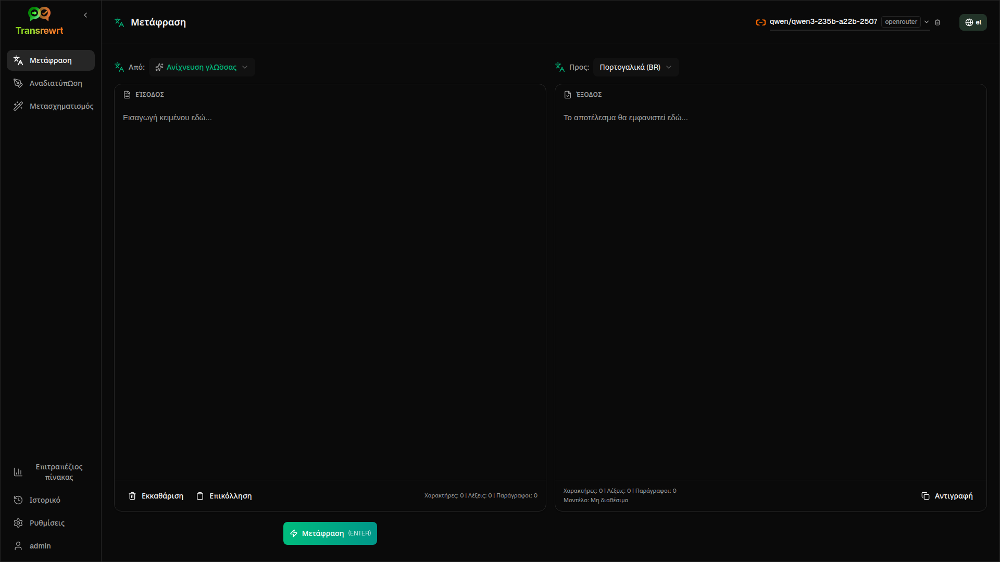

<p align="center">
  
</p>

<h1 align="center">Transrewrt</h1>

<p align="center">
  <a href="https://github.com/wsj-br/transrewrt/releases"></a>
  <a href="LICENSE"></a>
  
</p>

Εργαλείο κειμένου με τεχνητή νοημοσύνη για **μετάφραση**, **επαναγραφή** και **μετασχηματισμό** με προσαρμοσμένες προτροπές. Χρησιμοποιήστε τους δικούς σας παρόχους τεχνητής νοημοσύνης (OpenRouter, OpenAI, Anthropic, Google Gemini, DeepSeek, Groq, Mistral, xAI, Cerebras, NVIDIA, Alibaba Cloud, apikey.fun, τελικά σημεία συμβατά με OpenAI και τοπικούς διακομιστές όπως Ollama, LM Studio ή llama.cpp). Εκτελέστε ως εφαρμογή επιφάνειας εργασίας (Windows / Linux / macOS) ή ως εφαρμογή ιστού Docker. Χωρίς λογαριασμό cloud Transrewrt.

## Χαρακτηριστικά

| Δυνατότητα | Περιγραφή |
| --- | --- |
| **Μετάφραση** | Δεκάδες γλώσσες, αυτόματη ανίχνευση, γλωσσάρια, βελτίωση με αναδιατύπωση |
| **Επαναγραφή** | Σαφήνεια, τόνος, μήκος, ορθογραφία & γραμματική — ίδια γλώσσα |
| **Μετασχηματισμός** | Προσαρμοσμένες προτροπές AI που δημιουργείτε, επεξεργάζεστε και επαναχρησιμοποιείτε |
| **Ανάπτυξη** | Electron desktop ή Docker web (amd64 & arm64) |
| **Κλειδιά** | Οι πάροχοί σας, ο οικοδεσπότης σας — Εύκολες προεπιλογές ή λίστα μοντέλων για Προχωρημένους |



<small>**Διαβάστε σε άλλες γλώσσες:** </small>
<small id="lang-list">[English (UK)](../README.md) · [العربية](./README.ar.md) · [简体中文](./README.zh-Hans.md) · [繁體中文](./README.zh-Hant.md) · [Čeština](./README.cs.md) · [Nederlands](./README.nl.md) · [Français](./README.fr.md) · [Deutsch](./README.de.md) · [Ελληνικά](./README.el.md) · [हिन्दी](./README.hi.md) · [Magyar](./README.hu.md) · [Italiano](./README.it.md) · [日本語](./README.ja.md) · [한국어](./README.ko.md) · [فارسی](./README.fa.md) · [Polski](./README.pl.md) · [Português (Brasil)](./README.pt-BR.md) · [Română](./README.ro.md) · [Русский](./README.ru.md) · [Slovenčina](./README.sk.md) · [Español](./README.es.md) · [Svenska](./README.sv.md) · [ไทย](./README.th.md) · [Türkçe](./README.tr.md) · [Українська](./README.uk.md) · [Tiếng Việt](./README.vi.md)</small>

## Γρήγορη εκκίνηση

**Docker**

```bash
docker pull ghcr.io/wsj-br/transrewrt:latest

docker run -d \
  -p 5000:5000 \
  -v transrewrt-data:/app/data \
  -e PROVIDER_API_KEY=your-key \
  --name transrewrt \
  ghcr.io/wsj-br/transrewrt:latest
```

Αντικαταστήστε το `PROVIDER_API_KEY` με τη μεταβλητή παρόχου σας (για παράδειγμα `OPENROUTER_API_KEY`, `OPENAI_API_KEY`, `GROQ_API_KEY`). Ανοίξτε το [http://localhost:5000](http://localhost:5000) και αλλάξτε τον προεπιλεγμένο κωδικό διαχειριστή. Τα κλειδιά ορίζονται μέσω μεταβλητών περιβάλλοντος (όχι μέσω του περιβάλλοντος εργασίας χρήστη).

**Windows** — Κατεβάστε το `Transrewrt Setup x.y.z.exe` από τις [Εκδόσεις](https://github.com/wsj-br/transrewrt/releases), εγκαταστήστε το και, στη συνέχεια, προσθέστε κλειδιά στις **Ρυθμίσεις → API**.

**Linux** — Κατεβάστε το `.AppImage` από τις [Εκδόσεις](https://github.com/wsj-br/transrewrt/releases), και στη συνέχεια:

```bash
chmod +x Transrewrt-x.y.z-x64.AppImage && ./Transrewrt-x.y.z-x64.AppImage
```

**macOS** — Κατεβάστε το `.dmg` για το Mac σας από τις [Εκδόσεις](https://github.com/wsj-br/transrewrt/releases): `arm64` για Apple Silicon, `x64` για Intel. Ανοίξτε την εικόνα δίσκου και σύρετε το Transrewrt στις Εφαρμογές.

Η έκδοση είναι χωρίς υπογραφή, οπότε το Gatekeeper μπλοκάρει την πρώτη εκκίνηση. Κάντε δεξί κλικ στο `Transrewrt.app` και επιλέξτε **Άνοιγμα**, μετά επιβεβαιώστε **Άνοιγμα**. Ή καθαρίστε το χαρακτηριστικό καραντίνας:

```bash
xattr -dr com.apple.quarantine /Applications/Transrewrt.app
```

Λεπτομέρειες πλατφόρμας (Compose, SmartScreen, apt libs, GPU flags, ζώνη ώρας): [Έγγραφα γρήγορης εκκίνησης](https://wsj-br.github.io/transrewrt/docs/quick-start/).

## Τεκμηρίωση

Πλήρης τεκμηρίωση προϊόντος (εγκατάσταση, κλειδιά API, οδηγοί, ρυθμίσεις, αντιμετώπιση προβλημάτων):

**[https://wsj-br.github.io/transrewrt/docs/](https://wsj-br.github.io/transrewrt/docs/)**

- [Κλειδί API](https://wsj-br.github.io/transrewrt/docs/api-key/)
- [Διαμόρφωση](https://wsj-br.github.io/transrewrt/docs/configuration/)
- [Μετάφραση](https://wsj-br.github.io/transrewrt/docs/translate/) · [Επαναγραφή](https://wsj-br.github.io/transrewrt/docs/rewrite/) · [Μετασχηματισμός](https://wsj-br.github.io/transrewrt/docs/transform/)
- [Κοινά προβλήματα](https://wsj-br.github.io/transrewrt/docs/common-issues/)

## Ανάπτυξη

- Ρύθμιση, κατασκευή, δοκιμή, ανάπτυξη: [dev/DEVELOPMENT.md](../dev/DEVELOPMENT.md)
- Επισκόπηση αρχιτεκτονικής: [dev/SYSTEM-OVERVIEW.md](../dev/SYSTEM-OVERVIEW.md)

## Υποστήριξη

Ανοίξτε ένα ζήτημα στο [GitHub](https://github.com/wsj-br/transrewrt/issues). Συμπεριλάβετε την πλατφόρμα σας (Windows / Linux / macOS / Docker) και την έκδοση της εφαρμογής (διάλογος Σχετικά ή σελίδα Εκδόσεων).

## Ευχαριστίες

Οι προτάσεις προεπιλογών λειτουργίας Easy-mode στον επεξεργαστή προεπιλογών χρησιμοποιούν δημόσια δεδομένα αξιολόγησης
μόνο στον υπολογιστή του συντηρητή. Κανένα περιεχόμενο συνόλου δεδομένων δεν αναδιανέμεται με το Transrewrt:

- [languagebench](https://huggingface.co/spaces/fair-forward/languagebench) (CC BY-SA 4.0) — μετάφραση ChrF
- [Arena](https://huggingface.co/datasets/lmarena-ai/leaderboard-dataset) (CC BY 4.0) — Βαθμολογία Arena
- [models.dev](https://models.dev/) (MIT)

Οι άδειες εξαρτήσεων τρίτων και αυτές οι ειδοποιήσεις πηγής δεδομένων παρατίθενται στο [NOTICES](../NOTICES).

## Άδεια

Πνευματικά δικαιώματα © 2026 Waldemar Scudeller Jr.

[Apache License 2.0](../LICENSE)

<br/>

Τα ονόματα και τα εικονίδια των προϊόντων ανήκουν στους αντίστοιχους ιδιοκτήτες τους και χρησιμοποιούνται μόνο για σκοπούς αναγνώρισης. Αυτό το λογισμικό δεν είναι συνδεδεμένο ή εγκεκριμένο από αυτές τις μάρκες.

<small>

> **Σημείωση για τις μεταφράσεις διεπαφής χρήστη και τεκμηρίωσης:** Όλες οι γλώσσες διεπαφής και τεκμηρίωσης εκτός από τα Αγγλικά (Ηνωμένο Βασίλειο) μεταφράστηκαν με τεχνητή νοημοσύνη χρησιμοποιώντας το [ai-i18n-tools](https://wsj-br.github.io/ai-i18n-tools/). Η διατύπωση μπορεί να είναι ανακριβής ή να περιέχει σφάλματα.

</small>
