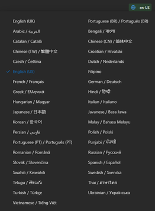
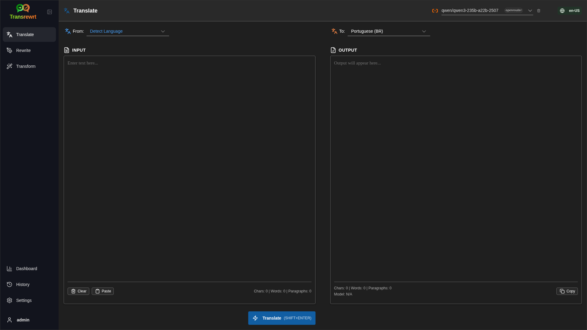
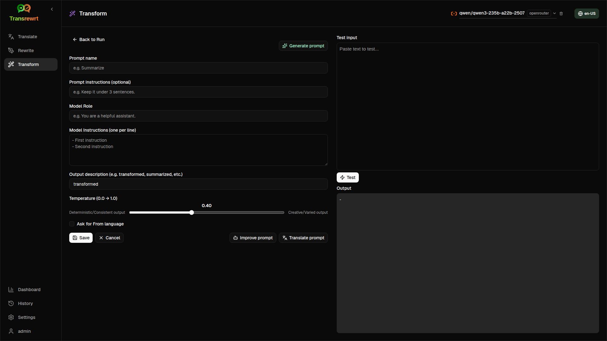
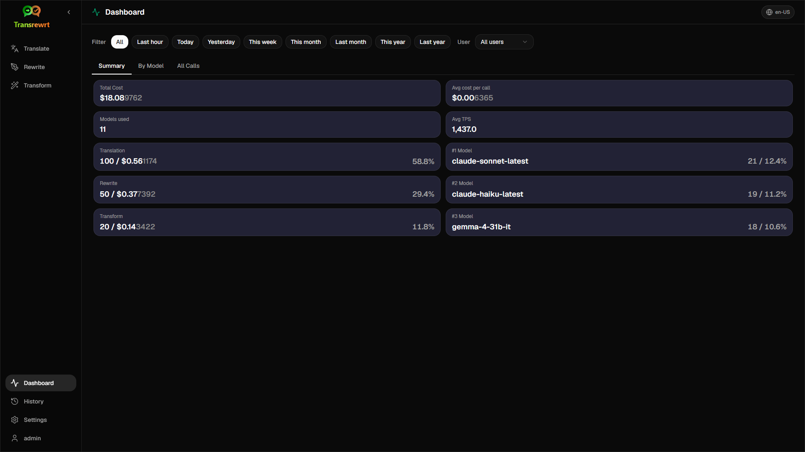
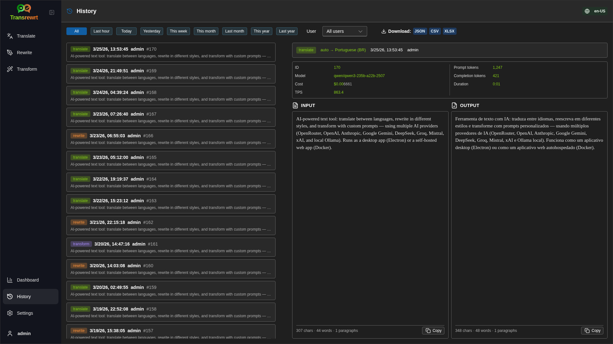
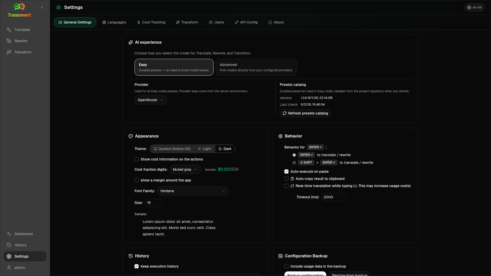

<p align="center">
  
</p>

<p align="center">
  <a href="https://github.com/wsj-br/transrewrt/releases"></a>
  <a href="LICENSE"></a>
  
  
  
</p>

AI-powered text tool: translate between languages, rewrite in different styles, and transform with custom prompts - using multiple AI providers (OpenRouter, OpenAI, Anthropic, Google Gemini, DeepSeek, Groq, Mistral, xAI, and local Ollama). Runs as a desktop app (Electron) or a self-hosted web app (Docker).

- **Translate** - between dozens of languages, with automatic source detection
- **Rewrite** - fix grammar, improve clarity, formal/informal, shorten, expand, technical
- **Transform** - custom AI prompts; create and manage prompts, optional target language per prompt
- **History** - full execution history with input/output text, filtering, and export
- **Easy & Advanced** - Easy mode (default): curated presets per provider (**Free (OpenRouter)**, **Standard**, **Advanced**, **Technical**; only presets with a mapping for the selected provider appear) without picking model IDs; Advanced mode: full model list from your configured providers
- **Models & cost** - cost and usage dashboards (Summary, By Model, All Calls) with export; OpenRouter shows actual spend, other providers use estimates
- **UI** - multilingual interface (30+ languages, RTL support), fonts, ...
- **Web mode** - multi-user support with admin roles
- **Desktop** - Electron app for Windows and Linux
- **Self-hosted** - Docker image for amd64 & arm64 (Raspberry Pi-ready)

Once installed, see the [**User Guide**](USER-GUIDE.en-US.md) for a full walkthrough of all features.

<small>**Read in other languages:** </small>
<small id="lang-list">[English (GB)](../README.md) · [Português (Brasil)](./README.pt-BR.md) · [العربية](./README.ar.md) · [বাংলা](./README.bn.md) · [Català](./README.ca.md) · [中文 (中国大陆)](./README.zh-CN.md) · [中文 (台灣)](./README.zh-TW.md) · [Hrvatski](./README.hr.md) · [Čeština](./README.cs.md) · [Nederlands](./README.nl.md) · [English (US)](./README.en-US.md) · [Tagalog](./README.tl.md) · [Français](./README.fr.md) · [Deutsch](./README.de.md) · [Ελληνικά](./README.el.md) · [हिन्दी](./README.hi.md) · [Magyar](./README.hu.md) · [Italiano](./README.it.md) · [日本語](./README.ja.md) · [한국어](./README.ko.md) · [Bahasa Melayu](./README.ms.md) · [فارسی](./README.fa.md) · [Polski](./README.pl.md) · [Basa Jawa](./README.jv.md) · [Português](./README.pt.md) · [ਪੰਜਾਬੀ](./README.pa.md) · [Română](./README.ro.md) · [Русский](./README.ru.md) · [Slovenčina](./README.sk.md) · [Español](./README.es.md) · [Kiswahili](./README.sw.md) · [Svenska](./README.sv.md) · [తెలుగు](./README.te.md) · [ไทย](./README.th.md) · [Türkçe](./README.tr.md) · [Українська](./README.uk.md) · [Tiếng Việt](./README.vi.md)</small>

<small>

> **Note on UI and documentation translations:** All interface languages except the original English (UK) 
> were translated using AI models; the wording may be imprecise or contain errors.

</small>

<br/>

<a id="table-of-contents"></a>
## Table of Contents

<!-- START doctoc generated TOC please keep comment here to allow auto update -->
<!-- DON'T EDIT THIS SECTION, INSTEAD RE-RUN doctoc TO UPDATE -->

- [Screenshots](#screenshots)
- [Quick start](#quick-start)
- [Getting an OpenRouter API key](#getting-an-openrouter-api-key)
- [Configuration and environment](#configuration-and-environment)
- [Development and architecture](#development-and-architecture)
- [Reporting issues](#reporting-issues)
- [Disclaimer](#disclaimer)
- [License](#license)

<!-- END doctoc generated TOC please keep comment here to allow auto update -->

<br/><br/>

<a id="screenshots"></a>
## Screenshots

**Language selector**



**Translate**



**Transform - prompt editor**



**Dashboard**



**History**



**Settings - model selection**



<br/><br/>

<a id="quick-start"></a>
## Quick start

<details>
<summary><b>Docker (recommended for self-hosting)</b></summary>

<a id="docker"></a>

<br/>

```bash
docker pull ghcr.io/wsj-br/transrewrt:latest

OPENROUTER_API_KEY=sk-or-your-key docker run -d \
  -p 5000:5000 \
  -v transrewrt-data:/app/data \
  -e OPENROUTER_API_KEY \
  --name transrewrt-web \
  ghcr.io/wsj-br/transrewrt:latest
```

Replace `sk-or-your-key` with your [OpenRouter API key](https://openrouter.ai/keys) (or set other provider keys; see [Configuration](#configuration-and-environment)). Open [http://localhost:5000](http://localhost:5000) and change the default admin password before exposing the service.

Set at least one provider key via environment (for example `OPENROUTER_API_KEY` for OpenRouter). Pass variables with `-e` or `docker compose` / `.env` so secrets are not baked into the image. Provider keys are **not** entered in the web UI; the server reads them from the environment.

<br/>

> ℹ️ **NOTE**<br/>
> In Docker, LLM credentials are set with environment variables such as `OPENROUTER_API_KEY`, `OPENAI_API_KEY`, `CEREBRAS_API_KEY`, … (not in the web UI). On desktop (Electron) you configure keys in **Settings → API**.

<br/>

Or use Docker Compose:

```bash
# download the compose file
wget https://github.com/wsj-br/transrewrt/raw/refs/heads/master/production.yml -O transrewrt.yml
# Edit the file to add your API keys (API_KEYs), or uncomment and adjust the `.env` file. Set the timezone (TZ) if necessary.
vi transrewrt.yml
# start the container
docker compose -f transrewrt.yml up -d
```

See [Configuration](#configuration-and-environment) for all environment variables, such as `PORT`, `CONFIG_PATH`, `TZ`, and LLM keys (`OPENROUTER_API_KEY`, `OPENAI_API_KEY`, …).

</details>

<br/>

<details>
<summary><b>Server timezone (Docker)</b></summary>

<a id="configuring-the-timezone"></a>

<br/>

The application user interface date and time follow the **browser’s** locale and timezone. For **server-side** behavior (logging and similar), the container uses the `TZ` environment variable. The default is `TZ=Europe/London`.

To use another timezone, set `TZ` in your Compose file, for example:

```yaml
environment:
  - TZ=America/Sao_Paulo
```

Or pass it when running the container (Docker):

```bash
--env TZ=America/Sao_Paulo
```

On many Linux hosts you can copy the system timezone name with:

```bash
echo TZ=\"$(</etc/timezone)\"
```

A list of valid timezone names is maintained in the [tz database](https://en.wikipedia.org/wiki/List_of_tz_database_time_zones) (Wikipedia).

</details>

<br/>

<details>
<summary><b>Windows</b></summary>

<a id="windows-electron"></a>

<br/>

- Download the latest `Transrewrt Setup x.y.z.exe` from [Releases](https://github.com/wsj-br/transrewrt/releases).
- Run the `.exe` and follow the installer.
- First run: start the app from the Start menu or desktop shortcut.
- Enter your API keys in **Settings → API**. You need to configure at least one provider; OpenRouter is common for free models.

<br/>

> ℹ️ **NOTE**<br/>
> Windows may show one of these security warnings (normal for unsigned/indie apps):
>   - **User Account Control (UAC)**: "Do you want to allow this app from an unknown publisher to make changes to your device?" → Click **Yes**.
>   - **Microsoft Defender SmartScreen**: "Windows protected your PC" → Click **More info** → **Run anyway**.
>
> This happens because the app isn't signed by Microsoft or a major publisher—it's safe if downloaded from our official GitHub releases (verify checksums on the [Releases](https://github.com/wsj-br/transrewrt/releases) page alongside each asset).

<br/>

</details>

<br/>

<details>
<summary><b>Linux</b></summary>

<a id="linux-electron"></a>

<br/>

Download the `.AppImage` for your CPU from [Releases](https://github.com/wsj-br/transrewrt/releases) (`x64` for typical PCs, `arm64` for many ARM devices, including Raspberry Pi 4+), then:

```bash
chmod +x Transrewrt-x.y.z-x64.AppImage && ./Transrewrt-x.y.z-x64.AppImage
```

On x86_64/amd64 use the `x64` filename; on ARM64 use the `...-arm64.AppImage` name.

Enter your API keys in **Settings → API**. You need to configure at least one provider; OpenRouter is common for free models.

**Console messages:** Packaged Linux builds (`x64` and `arm64` AppImages) suppress Node deprecation warnings in the terminal (for example the built-in `punycode` module). If Chromium prints GPU / EGL errors such as “GLES3 is unsupported” but the app works, you can silence them by disabling hardware acceleration:

```bash
TRANSREWRT_DISABLE_GPU=1 ./Transrewrt-x.y.z-arm64.AppImage
```

That applies on amd64 as well; change the filename to match your download.

On Debian/Ubuntu, you may need additional **runtime** libraries required by Chromium (these are often already present on full desktop installations). Run the commands below if needed:

```bash
sudo apt update
sudo apt install -y libfuse2 libgtk-3-0 libnotify4 libnss3 libnspr4 libxss1 libxtst6 xdg-utils \
     xauth libatspi2.0-0 libdrm2 libgbm1 libxcb-dri3-0 libcups2 libasound2t64
```

replace `libasound2t64` with `libasound2` for `arm64`.  Minimal or custom installs may still fail with a missing `.so` file. Install the package named in the error message (common extras: `libatk1.0-0`, `libatk-bridge2.0-0`, `libgbm1`, `libdrm2`). In some environments, you may need to run the app using `APPIMAGE_EXTRACT_AND_RUN=1 ./Transrewrt-….AppImage`.

<br/>

> ℹ️ **NOTE**<br/>
> macOS is not currently supported. Transrewrt is available for Windows, Linux, and Docker.

</details>

<br/>

Once the app is running, see the [**User Guide**](USER-GUIDE.en-US.md) to learn how to translate, rewrite, and transform text, manage prompts, and configure models.

<br/><br/>

<a id="getting-an-openrouter-api-key"></a>
## Getting an OpenRouter API key

Transrewrt supports multiple AI providers. [OpenRouter](https://openrouter.ai) is a popular choice because it aggregates many models under one key and offers free models.

1. Sign up or log in at [openrouter.ai](https://openrouter.ai).
2. Open the [Keys](https://openrouter.ai/keys) page and create a new key (name it, and optionally set a credit limit). You can use free models without adding credit.
3. **Desktop (Electron):** paste keys in **Settings → API**. **Docker:** set env vars such as `OPENROUTER_API_KEY` (see [Quick start](#quick-start)).

Do not use OpenRouter’s **Body Builder** model ([`openrouter/bodybuilder`](https://openrouter.ai/openrouter/bodybuilder)) for translate, rewrite, or transform: it returns JSON request payloads, not the completed text for those tasks. See [Settings → Models](USER-GUIDE.en-US.md#models) in the User Guide.

You can also use other providers (OpenAI, Anthropic, Google Gemini, DeepSeek, Groq, Mistral, xAI, Cerebras) or run models locally with [Ollama](https://ollama.com). See [Configuration](#configuration-and-environment) for the full list of supported providers and environment variables.

</br>

> ⚠️ **WARNING**<br/>
> If you are using Ollama from another device, container, or service, remember to configure Ollama to allow external connections (not localhost-only).

<br/><br/>

<a id="configuration-and-environment"></a>
## Configuration and environment

</br>

**Config file locations**

| Deployment         | Config location                                   |
| ------------------ | ------------------------------------------------- |
| Electron (Windows) | `%APPDATA%\transrewrt\`                           |
| Electron (Linux)   | `~/.config/transrewrt/`                           |
| Web / Docker       | `/app/data/config.json` (use a volume to persist) |

<br/>

**Environment variables** (web/Docker only; Electron uses the local config file)

| Variable             | Description                                                                  |
|----------------------|------------------------------------------------------------------------------|
| `PORT`               | Server listening port  (defaults to `5000`)                                  |
| `CONFIG_PATH`        | Path to the config file (defaults to `/app/data/config.json`)                |
| `TZ`                 | timezone for server-side time (logging, etc.) (defaults to  `Europe/London`) |
| `HISTORY_DISABLED`   | Force execution history off (optional, defaults to `false`)                  |
| `OPENROUTER_API_KEY` | OpenRouter API key                                                           |
| `OPENAI_API_KEY`     | OpenAI API key                                                               |
| `CEREBRAS_API_KEY`   | Cerebras API key                                                             |
| `ANTHROPIC_API_KEY`  | Anthropic API key                                                            |
| `GOOGLE_API_KEY`     | Google Gemini API key                                                        |
| `DEEPSEEK_API_KEY`   | DeepSeek API key                                                             |
| `GROQ_API_KEY`       | Groq API key                                                                 |
| `MISTRAL_API_KEY`    | Mistral API key                                                              |
| `OLLAMA_URL`         | Ollama base URL (e.g. `http://host.docker.internal:11434`)                   |
| `XAI_API_KEY`        | xAI API key                                                                  |

**Privacy mode:** To force the track of history off regardless of `config.json` or per-user preferences, set `HISTORY_DISABLED` to `true` or `1` (case-insensitive) for the **web/Docker server process** and/or the **Electron desktop main process** (e.g. system or launcher environment — not the renderer alone). This disables storing input/output history, locks **Settings → General Settings → History**, and blocks History-related APIs.

Configure only the providers you use. Model IDs are namespaced (`openrouter/…`, `openai/…`, `cerebras/…`, `ollama/…`, etc.).

**Cost display:** OpenRouter returns exact billed cost when applicable. Other providers use **estimated** cost from OpenRouter’s public model pricing when an OpenRouter key is available; without it, non-OpenRouter cost may show as `0`. Estimates are not invoices.

<br/>

**Data and persistence:** For Docker, mount a volume at `/app/data` so `config.json` and the SQLite database persist across container restarts. Without a volume, all data is lost when the container stops.

<br/>

**Web authentication:**

- Default admin: `admin` / `transrewrt26`.
- Manage users in **Settings → Users**.
- Reset a password: `docker exec <container> reset-web-password '<username>' '<new-password>'`

<br/>

> ⚠️ **WARNING**<br/>
> Change the default admin password immediately on any network-accessible host.

<br/>

Key settings (font, models, languages, etc.) are available in the application Settings.

<br/><br/>

<a id="development-and-architecture"></a>
## Development and architecture

- **Development:** Setup, build, test, and deploy (Electron, Web, Docker) - see [dev/DEVELOPMENT.md](../dev/DEVELOPMENT.md).
- **Architecture and system overview:** Folder structure, tech stack, design decisions - see [dev/SYSTEM-OVERVIEW.md](../dev/SYSTEM-OVERVIEW.md).

<br/><br/>

<a id="reporting-issues"></a>
## Reporting issues

Open an issue on [GitHub](https://github.com/wsj-br/transrewrt/issues). Include your platform (Windows / Linux / Docker) and app version (shown in the About dialog or on the Releases page).

<br/><br/>

<a id="disclaimer"></a>
## Disclaimer

Product names and icons belong to their respective owners and are used for identification purposes only. This software is not affiliated with or endorsed by any of the mentioned brands.

<br/><br/>

<a id="license"></a>
## License

Copyright © 2026 Waldemar Scudeller Jr.

[Apache License 2.0](../LICENSE)
