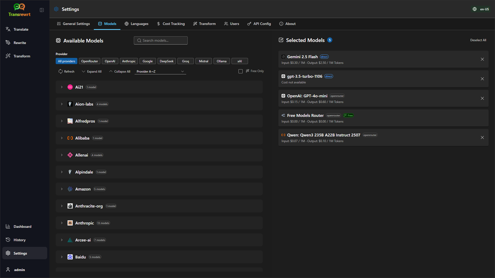

<p align="center">
  
</p>

<h1 align="center">Transrewrt</h1>

<p align="center">
  <a href="https://github.com/wsj-br/transrewrt/releases"></a>
  <a href="LICENSE"></a>
  
  
  
</p>

AI-powered text tool: translate between languages, rewrite in different styles, and transform with custom prompts — using multiple AI providers (OpenRouter, OpenAI, Anthropic, Google Gemini, DeepSeek, Groq, Mistral, xAI, and local Ollama). Runs as a desktop app (Electron) or a self-hosted web app (Docker).

- **Translate** — between dozens of languages, with automatic source detection
- **Rewrite** — fix grammar, improve clarity, formal/informal, shorten, expand, technical
- **Transform** — custom AI prompts; create and manage prompts, optional target language per prompt
- **History** — full execution history with input/output text, filtering, and export
- **Models & cost** — choose models from any configured provider; cost dashboard with SQLite log, summaries by model/operation/day
- **UI** — multilingual interface (30+ languages, RTL support), fonts, ...
- **Web mode** — multi-user support with admin roles; API keys stay server-side, never exposed to the browser
- **Desktop** — Electron app for Windows and Linux
- **Self-hosted** — Docker image for amd64 & arm64 (Raspberry Pi-ready)

Once installed, see the **[User Guide](USER-GUIDE.en-US.md)** for a full walkthrough of all features.

<small>**Read in other languages:** [English (UK)](README.en-US.md) · [Português (BR)](README.pt-BR.md) · [العربية](README.ar.md) · [বাংলা](README.bn.md) · [Català](README.ca.md) · [简体中文](README.zh-CN.md) · [繁體中文](README.zh-TW.md) · [Hrvatski](README.hr.md) · [Čeština](README.cs.md) · [Nederlands](README.nl.md) · [English (US)](README.en-US.md) · [Filipino](README.tl.md) · [Français](README.fr.md) · [Deutsch](README.de.md) · [Ελληνικά](README.el.md) · [हिन्दी](README.hi.md) · [Magyar](README.hu.md) · [Italiano](README.it.md) · [日本語](README.ja.md) · [Basa Jawa](README.jv.md) · [한국어](README.ko.md) · [Bahasa Melayu](README.ms.md) · [فارسی](README.fa.md) · [Polski](README.pl.md) · [Português (PT)](README.pt.md) · [ਪੰਜਾਬੀ](README.pa.md) · [Română](README.ro.md) · [Русский](README.ru.md) · [Slovenčina](README.sk.md) · [Español](README.es.md) · [Kiswahili](README.sw.md) · [Svenska](README.sv.md) · [తెలుగు](README.te.md) · [ภาษาไทย](README.th.md) · [Türkçe](README.tr.md) · [Українська](README.uk.md) · [Tiếng Việt](README.vi.md)</small>

<br/>

**Note on UI and documentation translations:** All interface languages except English (UK) were translated using AI models; the wording may be imprecise or contain errors.

<a id="screenshots"></a>
## Screenshots

**Language selector**


**Translate**


**Transform - prompt editor**


**Dashboard**


**History**


**Settings - model selection**



<br/><br/>

<a id="table-of-contents"></a>

## Table of Contents

<!-- START doctoc generated TOC please keep comment here to allow auto update -->
<!-- DON'T EDIT THIS SECTION, INSTEAD RE-RUN doctoc TO UPDATE -->

- [Quick start](#quick-start)
- [Installation](#installation)
  - [Windows (Electron)](#windows-electron)
  - [Linux (Electron)](#linux-electron)
  - [Docker](#docker)
- [Getting an OpenRouter API key](#getting-an-openrouter-api-key)
- [Configuration and environment](#configuration-and-environment)
- [Development and architecture](#development-and-architecture)
- [Releases and tags](#releases-and-tags)
- [Contributing](#contributing)
- [Disclaimer](#disclaimer)
- [License](#license)

<!-- END doctoc generated TOC please keep comment here to allow auto update -->

<br/><br/>

<a id="quick-start"></a>
## Quick start

**Docker (recommended for self-hosting)**

```bash
docker pull ghcr.io/wsj-br/transrewrt:latest

OPENROUTER_KEY=sk-or-your-key docker run -d \
  -p 5000:5000 \
  -v transrewrt-data:/app/data \
  -e OPENROUTER_KEY \
  --name transrewrt-web \
  ghcr.io/wsj-br/transrewrt:latest
```

Replace `sk-or-your-key` with your [OpenRouter API key](https://openrouter.ai/keys) (or set other provider keys; see [Configuration](#configuration-and-environment)). Open [http://localhost:5000](http://localhost:5000) and change the default admin password before exposing the service.

<br/>

> ℹ️ **NOTE**<br/>
> In Docker, LLM credentials are set with environment variables such as `OPENROUTER_KEY`, `OPENAI_KEY`, … (not in the web UI). On desktop (Electron) you configure keys in **Settings → API**.

<br/>

**Windows**

Download the latest `Transrewrt Setup x.y.z.exe` from [Releases](https://github.com/wsj-br/transrewrt/releases), run the installer, then launch from the Start menu or desktop shortcut. Enter your API keys in **Settings → API**. You need to configure at least one provider; OpenRouter is commonly used for free models.

<br/>

**Linux**

Download the `.AppImage` from [Releases](https://github.com/wsj-br/transrewrt/releases), then:

```bash
chmod +x Transrewrt-x.y.z.AppImage && ./Transrewrt-x.y.z.AppImage
```

Enter your API keys in **Settings → API**. You need to configure at least one provider; OpenRouter is commonly used for free models.

On Debian/Ubuntu you may need to install extra dependencies first:

```bash
sudo apt install libgtk-3-0 libnotify-dev libnss3 libxss1 libasound2 libxtst6 xauth
```

See [Installation → Linux](#linux-electron) for details.

<br/>

> ℹ️ **NOTE**<br/>
> macOS is not currently supported. Transrewrt is available for Windows, Linux, and Docker.

<br/>

Once the app is running, see the **[User Guide](USER-GUIDE.en-US.md)** to learn how to translate, rewrite, and transform text, manage prompts, and configure models.

<br/><br/>

<a id="installation"></a>
## Installation

<a id="windows-electron"></a>
### Windows (Electron)

- Download the latest installer from [Releases](https://github.com/wsj-br/transrewrt/releases).
- Run the `.exe` and follow the installer.
- First run: start the app from the Start menu or desktop shortcut. 

<br/>

<a id="linux-electron"></a>
### Linux (Electron)

- Download the `.AppImage` from [Releases](https://github.com/wsj-br/transrewrt/releases).
- Run: `chmod +x Transrewrt-x.y.z.AppImage && ./Transrewrt-x.y.z.AppImage`
- Extra dependencies (Debian/Ubuntu): `sudo apt install libgtk-3-0 libnotify-dev libnss3 libxss1 libasound2 libxtst6 xauth`
- See [dev/DEVELOPMENT.md](../dev/DEVELOPMENT.md) for more.

<br/>

<a id="docker"></a>
### Docker

- Pull: `docker pull ghcr.io/wsj-br/transrewrt:latest`
- Set at least one provider key via environment (for example `OPENROUTER_KEY` for OpenRouter). Pass variables with `-e` or `docker compose` / `.env` so secrets are not baked into the image.
- Provider keys are **not** entered in the web UI; the server reads them from the environment.

Example - named volume for persistence (OpenRouter key via env):

```bash
OPENROUTER_KEY=sk-or-your-key docker run -d \
  -p 5000:5000 \
  -v transrewrt-data:/app/data \
  -e OPENROUTER_KEY \
  --name transrewrt-web \
  ghcr.io/wsj-br/transrewrt:latest
```

<br/>

| Option   | Description                                                                                                   |
| -------- | ------------------------------------------------------------------------------------------------------------- |
| Port     | `5000` (map with `-p 5000:5000`)                                                                              |
| Volume   | Mount `/app/data` for config and database persistence                                                         |
| Env vars | `PORT`, `CONFIG_PATH`, plus LLM keys (`OPENROUTER_KEY`, `OPENAI_KEY`, …) - see [Configuration](#configuration-and-environment) |

To build and run from source: `docker compose up --build -d` or `pnpm docker:up` - see [dev/DEVELOPMENT.md](../dev/DEVELOPMENT.md).

<br/><br/>

<a id="getting-an-openrouter-api-key"></a>

## Getting an OpenRouter API key

Transrewrt supports multiple AI providers. [OpenRouter](https://openrouter.ai) is a popular choice because it aggregates many models under one key and offers free models.

1. Sign up or log in at [openrouter.ai](https://openrouter.ai).
2. Go to the [Keys](https://openrouter.ai/keys) page and create a new key (give it a name, and optionally set a credit limit). You can use free models without adding credit.
3. **Desktop (Electron):** paste keys in **Settings → API**. **Docker:** set environment variables such as `OPENROUTER_KEY` (see [Quick start](#quick-start)).

You can also use other providers (OpenAI, Anthropic, Google Gemini, DeepSeek, Groq, Mistral, xAI) or run models locally with [Ollama](https://ollama.com). See [Configuration](#configuration-and-environment) for the full list of supported providers and environment variables.

For rate limits, bring-your-own-key (BYOK), and more, see [OpenRouter authentication](https://openrouter.ai/docs/api/reference/authentication).

<br/><br/>

<a id="configuration-and-environment"></a>
## Configuration and environment

**Config file locations**

| Deployment         | Config location                                   |
| ------------------ | ------------------------------------------------- |
| Electron (Windows) | `%APPDATA%\transrewrt\`                           |
| Electron (Linux)   | `~/.config/transrewrt/`                           |
| Web / Docker       | `/app/data/config.json` (use a volume to persist) |

<br/>

**Environment variables** (web/Docker only; Electron uses the local config file)

| Variable         | Default                 | Description |
| ---------------- | ----------------------- | ----------- |
| `PORT`           | `5000`                  | Server listening port |
| `CONFIG_PATH`    | `/app/data/config.json` | Path to the config file |
| `OPENROUTER_KEY` | *(empty)*               | OpenRouter API key |
| `OPENAI_KEY`     | *(empty)*               | OpenAI API key |
| `ANTHROPIC_KEY`  | *(empty)*               | Anthropic API key |
| `GOOGLE_KEY`     | *(empty)*               | Google Gemini API key |
| `DEEPSEEK_KEY`   | *(empty)*               | DeepSeek API key |
| `GROQ_KEY`       | *(empty)*               | Groq API key |
| `MISTRAL_KEY`    | *(empty)*               | Mistral API key |
| `OLLAMA_URL`     | *(empty)*               | Ollama base URL (e.g. `http://host.docker.internal:11434`) |
| `XAI_KEY`        | *(empty)*               | xAI API key |

Configure only the providers you plan to use. Model IDs are namespaced (`openrouter/…`, `openai/…`, `ollama/…`, etc.).

**Cost display:** OpenRouter returns the exact billed cost when applicable. For other providers, costs are **estimated** using OpenRouter’s public model pricing if an OpenRouter API key is available; otherwise, non-OpenRouter costs may appear as `0`. These estimates are not official invoices.

<br/>

**Data and persistence:** For Docker deployments, mount a volume at `/app/data` to ensure that `config.json` and the SQLite database persist across container restarts. Without a volume, all data will be lost when the container stops.

**Developers:** After pulling updates that replace the old single-key configuration, reset or merge your `data/config.json` with the new default structure from `src/config-defaults/config_default.json` if your local file still uses deprecated fields (`api_key`, `api_url`, proxy settings).

<br/>

**Web authentication:**

- Default admin credentials: `admin` / `transrewrt26`.
- Manage users in **Settings → Users**.
- Reset a password: `docker exec <container> reset-web-password '<username>' '<new-password>'`  
  (from source: `pnpm run reset-web-password -- <username> <new-password>`)

<br/>

> ⚠️ **WARNING**<br/>
> Immediately change the default admin password on any host accessible over a network.

<br/>

Key settings (font, models, languages, etc.) can be adjusted in the application Settings.

<br/><br/>

<a id="development-and-architecture"></a>
## Development and architecture

- **Development:** Setup, build, test, and deploy (Electron, Web, Docker) - see **[dev/DEVELOPMENT.md](../dev/DEVELOPMENT.md)**.
- **Architecture and system overview:** Folder structure, tech stack, design decisions - see **[dev/SYSTEM-OVERVIEW.md](../dev/SYSTEM-OVERVIEW.md)**.

<br/><br/>

<a id="releases-and-tags"></a>

## Releases and tags

- **Git tags** starting with `v` (e.g., `v1.0.10`) trigger the [release workflow](.github/workflows/release.yml). **GitHub Releases** include the Windows installer (`.exe`) and Linux AppImage.
- **Docker images** are published to `ghcr.io/wsj-br/transrewrt`. Image tags correspond to the Git version (e.g., `v1.0.10` → `ghcr.io/wsj-br/transrewrt:1.0.10`) as well as `latest`. Multi-architecture support: `linux/amd64` and `linux/arm64` (e.g., Raspberry Pi).

<br/><br/>

<a id="contributing"></a>
## Contributing

1. Fork the repository.
2. Create a feature branch: `git checkout -b feature/my-feature`
3. Commit your changes with a clear message.
4. Push your changes and open a Pull Request targeting `main`.

Please follow the existing code style and test your changes in both Electron and web modes before submission. See [dev/DEVELOPMENT.md](../dev/DEVELOPMENT.md) for instructions on building and testing.

<br/>

**Reporting issues:** Open an issue on [GitHub](https://github.com/wsj-br/transrewrt/issues). Include your platform (Windows / Linux / Docker) and app version (shown in the About dialog or on the Releases page).

<br/><br/>

<a id="disclaimer"></a>
## Disclaimer

Product names and icons belong to their respective owners and are used solely for identification purposes. This software is not affiliated with or endorsed by any of the mentioned brands.

<br/><br/>

<a id="license"></a>
## License

Copyright © 2026 Waldemar Scudeller Jr.

[Apache License 2.0](LICENSE)