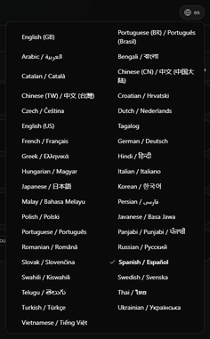
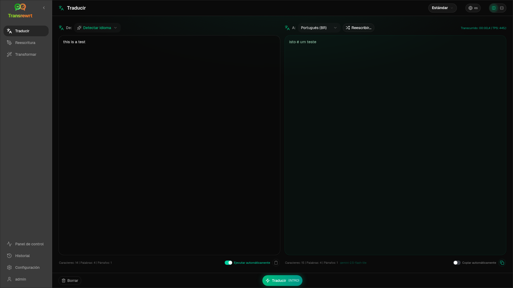
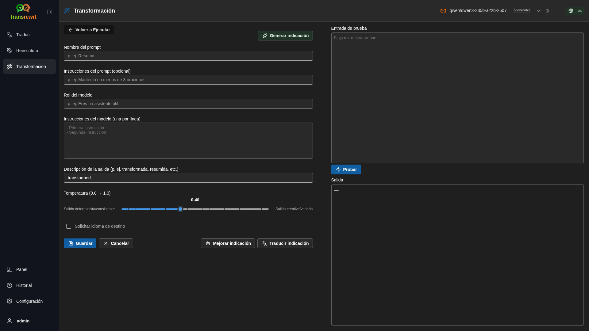
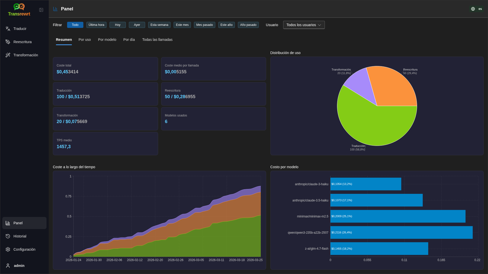
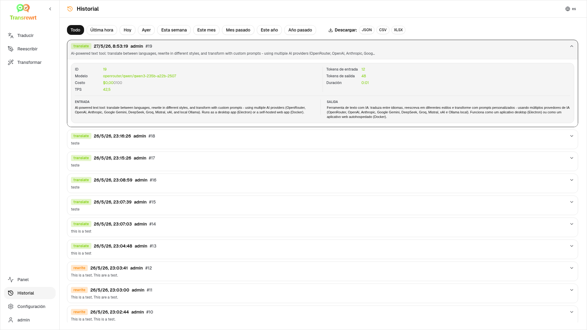
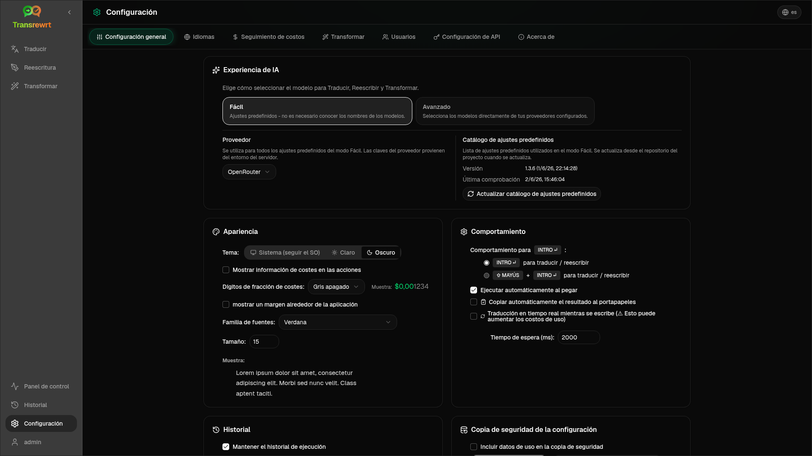

<p align="center">
  
</p>

<p align="center">
  <a href="https://github.com/wsj-br/transrewrt/releases"></a>
  <a href="LICENSE"></a>
  
  
  
</p>

Herramienta de texto con IA: traduce entre idiomas, reescribe en diferentes estilos y transforma con prompts personalizados, utilizando múltiples proveedores de IA (OpenRouter, OpenAI, Anthropic, Google Gemini, DeepSeek, Groq, Mistral, xAI y Ollama local). Funciona como aplicación de escritorio (Electron) o como aplicación web autohospedada (Docker).

- **Traducir** - entre docenas de idiomas, con detección automática del idioma de origen
- **Reescribir** - corregir gramática, mejorar claridad, estilo formal/informal, acortar, ampliar, contenido técnico
- **Transformar** - prompts personalizados de IA; crear y gestionar prompts, idioma de destino opcional por prompt
- **Historial** - historial completo de ejecuciones con texto de entrada/salida, filtros y exportación
- **Fácil y Avanzado** - Modo Fácil (predeterminado): ajustes preestablecidos seleccionados por proveedor (**Gratis (OpenRouter)**, **Estándar**, **Avanzado**, **Técnico**; solo aparecen los preajustes con una asignación para el proveedor seleccionado) sin necesidad de elegir IDs de modelos; Modo Avanzado: lista completa de modelos de tus proveedores configurados
- **Modelos y costo** - paneles de costos y uso (Resumen, Por modelo, Todas las llamadas) con opción de exportación; OpenRouter muestra el gasto real, otros proveedores usan estimaciones
- **Interfaz de usuario (UI)** - interfaz multilingüe (más de 30 idiomas, soporte RTL), fuentes, ...
- **Modo web** - soporte multiusuario con roles de administrador
- **Escritorio** - Aplicación Electron para Windows y Linux
- **Autohospedado** - Imagen Docker para amd64 y arm64 (listo para Raspberry Pi)

Una vez instalado, consulte la [**Guía del usuario**](USER-GUIDE.es.md) para una descripción completa de todas las funciones.

<small>**Leer en otros idiomas:** </small>
<small id="lang-list">[English (GB)](../README.md) · [Português (Brasil)](./README.pt-BR.md) · [العربية](./README.ar.md) · [বাংলা](./README.bn.md) · [Català](./README.ca.md) · [中文 (中国大陆)](./README.zh-CN.md) · [中文 (台灣)](./README.zh-TW.md) · [Hrvatski](./README.hr.md) · [Čeština](./README.cs.md) · [Nederlands](./README.nl.md) · [English (US)](./README.en-US.md) · [Tagalog](./README.tl.md) · [Français](./README.fr.md) · [Deutsch](./README.de.md) · [Ελληνικά](./README.el.md) · [हिन्दी](./README.hi.md) · [Magyar](./README.hu.md) · [Italiano](./README.it.md) · [日本語](./README.ja.md) · [한국어](./README.ko.md) · [Bahasa Melayu](./README.ms.md) · [فارسی](./README.fa.md) · [Polski](./README.pl.md) · [Basa Jawa](./README.jv.md) · [Português](./README.pt.md) · [ਪੰਜਾਬੀ](./README.pa.md) · [Română](./README.ro.md) · [Русский](./README.ru.md) · [Slovenčina](./README.sk.md) · [Español](./README.es.md) · [Kiswahili](./README.sw.md) · [Svenska](./README.sv.md) · [తెలుగు](./README.te.md) · [ไทย](./README.th.md) · [Türkçe](./README.tr.md) · [Українська](./README.uk.md) · [Tiếng Việt](./README.vi.md)</small>

<small>

> **Nota sobre traducciones de la interfaz y documentación:** Todos los idiomas de la interfaz, excepto el inglés (UK) original, 
> fueron traducidos mediante modelos de IA; la redacción puede ser imprecisa o contener errores.

</small>

<br/>

<a id="table-of-contents"></a>
## Tabla de contenidos

<!-- START doctoc generated TOC please keep comment here to allow auto update -->
<!-- DON'T EDIT THIS SECTION, INSTEAD RE-RUN doctoc TO UPDATE -->

- [Capturas de pantalla](#screenshots)
- [Inicio rápido](#quick-start)
- [Obtener una clave API de OpenRouter](#getting-an-openrouter-api-key)
- [Configuración y entorno](#configuration-and-environment)
- [Desarrollo y arquitectura](#development-and-architecture)
- [Informar de problemas](#reporting-issues)
- [Descargo de responsabilidad](#disclaimer)
- [Licencia](#license)

<!-- END doctoc generated TOC please keep comment here to allow auto update -->

<br/><br/>

<a id="screenshots"></a>
## Capturas de pantalla

**Selector de idioma**



**Traducir**



**Transformación - editor de prompts**



**Panel**



**Historial**



**Configuración - selección de modelo**



<br/><br/>

<a id="quick-start"></a>
## Comienzo rápido

<details>
<summary><b>Docker (recomendado para autohospedaje)</b></summary>

<a id="docker"></a>

<br/>

```bash
docker pull ghcr.io/wsj-br/transrewrt:latest

OPENROUTER_API_KEY=sk-or-your-key docker run -d \
  -p 5000:5000 \
  -v transrewrt-data:/app/data \
  -e OPENROUTER_API_KEY \
  --name transrewrt-web \
  ghcr.io/wsj-br/transrewrt:latest
```

Reemplace `sk-or-your-key` con su [clave API de OpenRouter](https://openrouter.ai/keys) (o configure claves de otros proveedores; consulte [Configuración](#configuration-and-environment)). Abra [http://localhost:5000](http://localhost:5000) y cambie la contraseña predeterminada del administrador antes de exponer el servicio.

Establezca al menos una clave de proveedor mediante variables de entorno (por ejemplo, `OPENROUTER_API_KEY` para OpenRouter). Pase las variables con `-e` o `docker compose` / `.env` para que los secretos no queden integrados en la imagen. Las claves de los proveedores **no** se ingresan en la interfaz web; el servidor las lee desde el entorno.

<br/>

> ℹ️ **NOTA**<br/>
> En Docker, las credenciales de los LLM se establecen con variables de entorno como `OPENROUTER_API_KEY`, `OPENAI_API_KEY`, `CEREBRAS_API_KEY`, … (no en la interfaz web). En el escritorio (Electron), configura las claves en **Configuración → API**.

<br/>

O use Docker Compose:

```bash
# download the compose file
wget https://github.com/wsj-br/transrewrt/raw/refs/heads/master/production.yml -O transrewrt.yml
# Edit the file to add your API keys (API_KEYs), or uncomment and adjust the `.env` file. Set the timezone (TZ) if necessary.
vi transrewrt.yml
# start the container
docker compose -f transrewrt.yml up -d
```

Consulte [Configuración](#configuration-and-environment) para todas las variables de entorno, como `PORT`, `CONFIG_PATH`, `TZ`, y claves de LLM (`OPENROUTER_API_KEY`, `OPENAI_API_KEY`, …).

</details>

<br/>

<details>
<summary><b>Zona horaria del servidor (Docker)</b></summary>

<a id="configuring-the-timezone"></a>

<br/>

La fecha y hora de la interfaz de usuario siguen la configuración regional y la zona horaria del **navegador**. Para el **comportamiento** del lado del servidor (registro y similares), el contenedor utiliza la variable de entorno `TZ`. El valor predeterminado es `TZ=Europe/London`.

Para usar otra zona horaria, establezca `TZ` en su archivo Compose, por ejemplo:

```yaml
environment:
  - TZ=America/Sao_Paulo
```

O pásela al ejecutar el contenedor (Docker):

```bash
--env TZ=America/Sao_Paulo
```

En muchos sistemas Linux puede copiar el nombre de la zona horaria del sistema con:

```bash
echo TZ=\"$(</etc/timezone)\"
```

Una lista de nombres válidos de zonas horarias se mantiene en la [base de datos tz](https://en.wikipedia.org/wiki/List_of_tz_database_time_zones) (Wikipedia).

</details>

<br/>

<details>
<summary><b>Windows</b></summary>

<a id="windows-electron"></a>

<br/>

- Descargue el último `Transrewrt Setup x.y.z.exe` desde [Releases](https://github.com/wsj-br/transrewrt/releases).
- Ejecute el `.exe` y siga las instrucciones del instalador.
- Primera ejecución: inicie la aplicación desde el menú Inicio o el acceso directo del escritorio.
- Ingrese sus claves API en **Configuración → API**. Debe configurar al menos un proveedor; OpenRouter es común para modelos gratuitos.

<br/>

> ℹ️ **NOTA**<br/>
> Windows puede mostrar una de estas advertencias de seguridad (normal para aplicaciones sin firmar o independientes):
>   - **Control de cuentas de usuario (UAC)**: "¿Desea permitir que esta aplicación de un editor desconocido realice cambios en su dispositivo?" → Haga clic en **Sí**.
>   - **Microsoft Defender SmartScreen**: "Windows protegió su PC" → Haga clic en **Más información** → **Ejecutar de todas formas**.
>
> Esto ocurre porque la aplicación no está firmada por Microsoft ni por un editor importante; es segura si se descarga desde nuestras versiones oficiales en GitHub (verifique los checksums en la página [Releases](https://github.com/wsj-br/transrewrt/releases) junto a cada recurso).

<br/>

</details>

<br/>

<details>
<summary><b>Linux</b></summary>

<a id="linux-electron"></a>

<br/>

Descargue el `.AppImage` para su CPU desde [Releases](https://github.com/wsj-br/transrewrt/releases) (`x64` para PC típicas, `arm64` para muchos dispositivos ARM, incluyendo Raspberry Pi 4+), luego:

```bash
chmod +x Transrewrt-x.y.z-x64.AppImage && ./Transrewrt-x.y.z-x64.AppImage
```

En x86_64/amd64 use el nombre de archivo `x64`; en ARM64 use el nombre `...-arm64.AppImage`.

Introduzca sus claves API en **Configuración → API**. Necesita configurar al menos un proveedor; OpenRouter es común para modelos gratuitos.

**Mensajes de consola:** Las versiones empaquetadas para Linux (`x64` y `arm64` AppImages) suprimen las advertencias de desuso de Node en la terminal (por ejemplo, del módulo integrado `punycode`). Si Chromium muestra errores de GPU / EGL como “GLES3 no es compatible”, pero la aplicación funciona, puede silenciarlos desactivando la aceleración por hardware:

```bash
TRANSREWRT_DISABLE_GPU=1 ./Transrewrt-x.y.z-arm64.AppImage
```

Esto aplica también en amd64; cambie el nombre del archivo para que coincida con su descarga.

En Debian/Ubuntu, puede necesitar bibliotecas **runtime** adicionales requeridas por Chromium (estas suelen estar ya presentes en instalaciones completas de escritorio). Ejecute los comandos siguientes si es necesario:

```bash
sudo apt update
sudo apt install -y libfuse2 libgtk-3-0 libnotify4 libnss3 libnspr4 libxss1 libxtst6 xdg-utils \
     xauth libatspi2.0-0 libdrm2 libgbm1 libxcb-dri3-0 libcups2 libasound2t64
```

reemplace `libasound2t64` con `libasound2` para `arm64`. Las instalaciones mínimas o personalizadas aún podrían fallar con un archivo `.so` faltante. Instale el paquete indicado en el mensaje de error (extras comunes: `libatk1.0-0`, `libatk-bridge2.0-0`, `libgbm1`, `libdrm2`). En algunos entornos, puede necesitar ejecutar la aplicación usando `APPIMAGE_EXTRACT_AND_RUN=1 ./Transrewrt-….AppImage`.

<br/>

> ℹ️ **NOTA**<br/>
> macOS no está actualmente soportado. Transrewrt está disponible para Windows, Linux y Docker.

</details>

<br/>

Una vez que la aplicación esté en funcionamiento, consulte la [**Guía del usuario**](USER-GUIDE.es.md) para aprender cómo traducir, reescribir y transformar texto, gestionar prompts y configurar modelos.

<br/><br/>

<a id="getting-an-openrouter-api-key"></a>
## Obtener una clave API de OpenRouter

Transrewrt admite múltiples proveedores de IA. [OpenRouter](https://openrouter.ai) es una opción popular porque agrega muchos modelos bajo una sola clave y ofrece modelos gratuitos.

1. Regístrese o inicie sesión en [openrouter.ai](https://openrouter.ai).
2. Abra la página [Keys](https://openrouter.ai/keys) y cree una nueva clave (asígnele un nombre y, opcionalmente, establezca un límite de crédito). Puede usar modelos gratuitos sin añadir crédito.
3. **Escritorio (Electron):** pegue las claves en **Configuración → API**. **Docker:** configure variables de entorno como `OPENROUTER_API_KEY` (vea [Inicio rápido](#quick-start)).

No use el modelo **Body Builder** de OpenRouter ([`openrouter/bodybuilder`](https://openrouter.ai/openrouter/bodybuilder)) para traducir, reescribir o transformar: devuelve cargas útiles de solicitud JSON, no el texto completado para esas tareas. Consulte [Configuración → Modelos](USER-GUIDE.es.md#models) en la Guía del Usuario.

También puede usar otros proveedores (OpenAI, Anthropic, Google Gemini, DeepSeek, Groq, Mistral, xAI, Cerebras) o ejecutar modelos localmente con [Ollama](https://ollama.com). Consulte [Configuración](#configuration-and-environment) para obtener la lista completa de proveedores compatibles y variables de entorno.

</br>

> ⚠️ **ADVERTENCIA**<br/>
> Si está usando Ollama desde otro dispositivo, contenedor o servicio, recuerde configurar Ollama para permitir conexiones externas (no solo localhost).

<br/><br/>

<a id="configuration-and-environment"></a>
## Configuración y entorno

</br>

**Ubicaciones del archivo de configuración**

| Despliegue         | Ubicación de la configuración                                   |
| ------------------ | ------------------------------------------------- |
| Electron (Windows) | `%APPDATA%\transrewrt\`                           |
| Electron (Linux)   | `~/.config/transrewrt/`                           |
| Web / Docker       | `/app/data/config.json` (usar un volumen para persistencia) |

<br/>

**Variables de entorno** (solo web/Docker; Electron usa el archivo de configuración local)

| Variable             | Descripción                                                                  |
|----------------------|------------------------------------------------------------------------------|
| `PORT`               | Puerto en el que escucha el servidor (valor predeterminado: `5000`)                                  |
| `CONFIG_PATH`        | Ruta al archivo de configuración (valor predeterminado: `/app/data/config.json`)                |
| `TZ`                 | zona horaria para la hora del servidor (registros, etc.) (valor predeterminado: `Europe/London`) |
| `HISTORY_DISABLED`   | Forzar la desactivación del historial de ejecución (opcional, por defecto `false`)                  |
| `OPENROUTER_API_KEY` | Clave API de OpenRouter                                                           |
| `OPENAI_API_KEY`     | Clave API de OpenAI                                                               |
| `CEREBRAS_API_KEY`   | Clave API de Cerebras                                                             |
| `ANTHROPIC_API_KEY`  | Clave API de Anthropic                                                            |
| `GOOGLE_API_KEY`     | Clave API de Google Gemini                                                        |
| `DEEPSEEK_API_KEY`   | Clave API de DeepSeek                                                             |
| `GROQ_API_KEY`       | Clave API de Groq                                                                 |
| `MISTRAL_API_KEY`    | Clave API de Mistral                                                              |
| `OLLAMA_URL`         | URL base de Ollama (por ejemplo, `http://host.docker.internal:11434`)                   |
| `XAI_API_KEY`        | Clave de API de xAI                                                                  |

**Modo privacidad:** Para forzar la desactivación del historial independientemente de `config.json` o de las preferencias por usuario, establezca `HISTORY_DISABLED` en `true` o `1` (sin distinguir mayúsculas ni minúsculas) para el **proceso del servidor web/Docker** y/o el **proceso principal del escritorio Electron** (por ejemplo, entorno del sistema o del lanzador, no solo del renderizador). Esto desactiva el almacenamiento del historial de entrada/salida, bloquea **Configuración → Configuración general → Historial** e impide el uso de las API relacionadas con el Historial.

Configure solo los proveedores que utilice. Los IDs de {{modelo}} están agrupados por espacio de nombres (`openrouter/…`, `openai/…`, `cerebras/…`, `ollama/…`, etc.).

**Visualización de costos:** OpenRouter devuelve el costo facturado exacto cuando corresponde. Otros proveedores usan el costo **estimado** de la lista pública de precios de modelos de OpenRouter cuando hay una clave OpenRouter disponible; sin ella, el costo de no-OpenRouter puede mostrarse como `0`. Las estimaciones no son facturas.

<br/>

**Datos y persistencia:** Para Docker, monte un volumen en `/app/data` para que `config.json` y la base de datos SQLite persistan tras reinicios del contenedor. Sin un volumen, todos los datos se pierden al detener el contenedor.

<br/>

**Autenticación web:**

- Administrador predeterminado: `admin` / `transrewrt26`.
- Gestionar usuarios en **Configuración → Usuarios**.
- Restablecer contraseña: `docker exec <container> reset-web-password '<username>' '<new-password>'`

<br/>

> ⚠️ **ADVERTENCIA**<br/>
> Cambie inmediatamente la contraseña predeterminada del administrador en cualquier host accesible por red.

<br/>

La configuración de ajustes clave (fuente, modelos, idiomas, etc.) está disponible en la sección Configuración de la aplicación.

<br/><br/>

<a id="development-and-architecture"></a>
## Desarrollo y arquitectura

- **Desarrollo:** Configuración, compilación, prueba e implementación (Electron, Web, Docker) - consulte [dev/DEVELOPMENT.md](../dev/DEVELOPMENT.md).
- **Arquitectura y visión general del sistema:** Estructura de carpetas, stack tecnológico, decisiones de diseño - consulte [dev/SYSTEM-OVERVIEW.md](../dev/SYSTEM-OVERVIEW.md).

<br/><br/>

<a id="reporting-issues"></a>
## Informe de problemas

Abra un problema en [GitHub](https://github.com/wsj-br/transrewrt/issues). Incluya su plataforma (Windows / Linux / Docker) y la versión de la aplicación (mostrada en el cuadro Acerca de o en la página de versiones).

<br/><br/>

<a id="disclaimer"></a>
## Descargo de responsabilidad

Los nombres de productos e iconos pertenecen a sus respectivos propietarios y se utilizan solo con fines de identificación. Este software no está afiliado ni respaldado por ninguna de las marcas mencionadas.

<br/><br/>

<a id="license"></a>
## Licencia

Derechos de autor © 2026 Waldemar Scudeller Jr.

[Apache License 2.0](../LICENSE)
