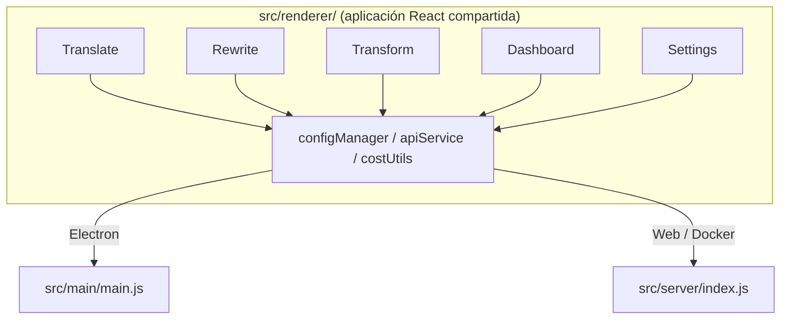

<p align="center">
  
</p>

<h1 align="center">Transrewrt</h1>

<p align="center">
  <a href="https://github.com/wsj-br/transrewrt/releases"></a>
  <a href="LICENSE"></a>
  
  
  
</p>

Herramienta de texto con IA: traduce entre idiomas, reescribe en diferentes estilos y transforma con prompts personalizados, todo a través de [OpenRouter](https://openrouter.ai). Se ejecuta como una aplicación de escritorio (Electron) o una aplicación web auto-hospedada (Docker).

- **Traducir** - entre docenas de idiomas, con detección automática del origen
- **Reescribir** - corregir gramática, mejorar claridad, formal/informal, acortar, expandir, técnico
- **Transformar** - prompts de IA personalizados; crear y gestionar prompts, idioma objetivo opcional por prompt
- **Modelos y coste** - elige cualquier modelo de OpenRouter; tablero de costes con registro en SQLite, resúmenes por modelo/operación/día
- **Interfaz de usuario** - i18n (pt-BR, de, fr, es, RTL), temas, fuentes, atajos de teclado; modo web seguro (clave API solo en el servidor)
- **Escritorio** - Aplicación Electron para Windows y Linux
- **Auto-hospedado** - Imagen Docker para amd64 y arm64 (compatible con Raspberry Pi)

Una vez instalado, consulta la **[Guía de usuario](../USER-GUIDE.md)** para un recorrido completo de todas las funciones.

<small>**Leer en otros idiomas:** [English (UK)](../README.md) · [Português (BR)](README.pt-BR.md) · [العربية](README.ar.md) · [বাংলা](README.bn.md) · [Català](README.ca.md) · [简体中文](README.zh-CN.md) · [繁體中文](README.zh-TW.md) · [Hrvatski](README.hr.md) · [Čeština](README.cs.md) · [Nederlands](README.nl.md) · [English (US)](README.en-US.md) · [Filipino](README.tl.md) · [Français](README.fr.md) · [Deutsch](README.de.md) · [Ελληνικά](README.el.md) · [हिन्दी](README.hi.md) · [Magyar](README.hu.md) · [Italiano](README.it.md) · [日本語](README.ja.md) · [Basa Jawa](README.jv.md) · [한국어](README.ko.md) · [Bahasa Melayu](README.ms.md) · [فارسی](README.fa.md) · [Polski](README.pl.md) · [Português (PT)](README.pt.md) · [ਪੰਜਾਬੀ](README.pa.md) · [Română](README.ro.md) · [Русский](README.ru.md) · [Slovenčina](README.sk.md) · [Español](README.es.md) · [Kiswahili](README.sw.md) · [Svenska](README.sv.md) · [తెలుగు](README.te.md) · [ภาษาไทย](README.th.md) · [Türkçe](README.tr.md) · [Українська](README.uk.md) · [Tiếng Việt](README.vi.md)</small>

<a id="screenshots"></a>
## Capturas de pantalla

**Selector de idioma**


**Traducir**


**Transformar - editor de prompts**


**Tablero**


**Configuración - selección de modelo**


<br /><br />

<a id="table-of-contents"></a>
## Tabla de Contenidos

<!-- START doctoc generated TOC please keep comment here to allow auto update -->
<!-- DON'T EDIT THIS SECTION, INSTEAD RE-RUN doctoc TO UPDATE -->

- [Inicio rápido](#quick-start)
- [Instalación](#installation)
  - [Windows (Electron)](#windows-electron)
  - [Linux (Electron)](#linux-electron)
  - [Docker](#docker)
- [Obteniendo una clave API de OpenRouter](#getting-an-openrouter-api-key)
- [Configuración y entorno](#configuration-and-environment)
- [Desarrollo y arquitectura](#development-and-architecture)
- [Lanzamientos y etiquetas](#releases-and-tags)
- [Contribuyendo](#contributing)
- [Descargo de responsabilidad](#disclaimer)
- [Licencia](#license)

<!-- END doctoc generated TOC please keep comment here to allow auto update -->

<br /><br />

<a id="quick-start"></a>

## Inicio rápido

**Docker (recomendado para auto-hospedaje)**

```bash
docker pull ghcr.io/wsj-br/transrewrt:latest

API_KEY=sk-or-your-key docker run -d \
  -p 5000:5000 \
  -v transrewrt-data:/app/data \
  -e API_KEY \
  --name transrewrt-web \
  ghcr.io/wsj-br/transrewrt:latest
```

Reemplaza `sk-or-your-key` con tu [clave API de OpenRouter](https://openrouter.ai/keys). Abre [http://localhost:5000](http://localhost:5000) y cambia la contraseña de administrador predeterminada antes de exponer el servicio.

<br />

> ℹ️ **NOTA**<br/>
> En Docker, la clave API de OpenRouter se configura únicamente mediante la variable de entorno `API_KEY` (no en la interfaz web). En el escritorio (Electron) la pegas en **Configuración → API**.

<br />

**Windows**

Descarga el instalador `Transrewrt Setup x.y.z.exe` más reciente desde [Lanzamientos](https://github.com/wsj-br/transrewrt/releases), ejecuta el instalador y luego inicia desde el menú Inicio o el acceso directo del escritorio. Ingresa tu clave API de OpenRouter en **Configuración → API**.

<br />

**Linux**

Descarga el archivo `.AppImage` desde [Lanzamientos](https://github.com/wsj-br/transrewrt/releases), luego:

```bash
chmod +x Transrewrt-x.y.z.AppImage && ./Transrewrt-x.y.z.AppImage
```

Ingresa tu clave API de OpenRouter en **Configuración → API**. En Debian/Ubuntu quizás necesites instalar dependencias adicionales primero:

```bash
sudo apt install libgtk-3-0 libnotify-dev libnss3 libxss1 libasound2 libxtst6 xauth
```

Consulta [Instalación → Linux](#linux-electron) para más detalles.

<br />

> ℹ️ **NOTA**<br/>
> macOS no es compatible actualmente. Transrewrt está disponible para Windows, Linux y Docker.

<br />

Una vez que la aplicación esté en ejecución, consulta la **[Guía de usuario](../USER-GUIDE.md)** para aprender a traducir, reescribir y transformar texto, gestionar indicaciones y configurar modelos.

<br /><br />

<a id="installation"></a>
## Instalación

<a id="windows-electron"></a>
### Windows (Electron)

- Descarga el instalador más reciente desde [Lanzamientos](https://github.com/wsj-br/transrewrt/releases).
- Ejecuta el `.exe` y sigue el instalador.
- Primera ejecución: inicia la aplicación desde el menú Inicio o el acceso directo del escritorio. La configuración se almacena en `%APPDATA%\transrewrt\`.

<br />

<a id="linux-electron"></a>
### Linux (Electron)

- Descarga el `.AppImage` desde [Lanzamientos](https://github.com/wsj-br/transrewrt/releases).
- Ejecuta: `chmod +x Transrewrt-x.y.z.AppImage && ./Transrewrt-x.y.z.AppImage`
- Dependencias adicionales (Debian/Ubuntu): `sudo apt install libgtk-3-0 libnotify-dev libnss3 libxss1 libasound2 libxtst6 xauth`
- Consulta [dev/DEVELOPMENT.md](../dev/DEVELOPMENT.md) para más información.

<br />

<a id="docker"></a>
### Docker

- Descarga: `docker pull ghcr.io/wsj-br/transrewrt:latest`
- La clave API de OpenRouter **debe** configurarse mediante la variable de entorno `API_KEY`. Pásala con `-e API_KEY` (o mediante `docker compose` / `.env`) para que la clave no sea visible en la lista de procesos.
- La clave API no puede ingresarse en la interfaz web.

Ejemplo - volumen con nombre para persistencia (clave API pasada por entorno, no en la línea de comandos):

```bash
API_KEY=sk-or-your-key docker run -d \
  -p 5000:5000 \
  -v transrewrt-data:/app/data \
  -e API_KEY \
  --name transrewrt-web \
  ghcr.io/wsj-br/transrewrt:latest
```

<br />

| Opción   | Descripción                                                                                                   |
| -------- | ------------------------------------------------------------------------------------------------------------- |
| Puerto   | `5000` (mapear con `-p 5000:5000`)                                                                            |
| Volumen  | Montar `/app/data` para persistencia de configuración y base de datos                                         |
| Variables de entorno | `PORT`, `CONFIG_PATH`, `API_KEY`, `API_URL`, `KEY_SEED` - ver [Configuración](#configuration-and-environment) |

Para construir y ejecutar desde el código fuente: `docker compose up --build -d` o `pnpm run docker:up` - consulta [dev/DEVELOPMENT.md](../dev/DEVELOPMENT.md).

<br /><br />

<a id="getting-an-openrouter-api-key"></a>
## Obtención de una clave API de OpenRouter

Transrewrt utiliza [OpenRouter](https://openrouter.ai) para modelos de IA. Necesitas una clave API para traducir, reescribir o transformar texto.

1. Regístrate o inicia sesión en [openrouter.ai](https://openrouter.ai).
2. Abre la página de [Claves](https://openrouter.ai/keys) y crea una nueva clave (asigna un nombre y opcionalmente establece un límite de crédito). Puedes usar modelos gratuitos sin añadir crédito.
3. **Escritorio (Electron):** pega la clave en **Configuración → API**. **Docker:** establece la variable de entorno `API_KEY` (ver [Inicio rápido](#quick-start)).

Para límites, BYOK y más, consulta [Autenticación de OpenRouter](https://openrouter.ai/docs/api/reference/authentication).

<br /><br />

<a id="configuration-and-environment"></a>

## Configuración y entorno

**Ubicaciones del archivo de configuración**

| Implementación         | Ubicación de la configuración                         |
| ---------------------- | ----------------------------------------------------- |
| Electron (Windows)     | `%APPDATA%\transrewrt\`                               |
| Electron (Linux)       | `~/.config/transrewrt/`                               |
| Web / Docker           | `/app/data/config.json` (usa un volumen para persistir) |

<br />

**Variables de entorno** (solo web/Docker; Electron usa el archivo de configuración local)

| Variable      | Predeterminado               | Descripción                                                      |
| ------------- | ---------------------------- | ---------------------------------------------------------------- |
| `PORT`        | `5000`                       | Puerto de escucha del servidor                                  |
| `CONFIG_PATH` | `/app/data/config.json`      | Ruta al archivo de configuración                                |
| `API_KEY`     | *(vacío)*                    | Clave API de OpenRouter (requerida para Docker; configurar mediante variables de entorno, no por interfaz) |
| `API_URL`     | `https://openrouter.ai/api/v1` | URL base de la API de AI ascendente                             |
| `KEY_SEED`    | *(vacío)*                    | Semilla de la clave proxy de Transrewrt (anula la configuración si se establece) |

<br />

**Datos y persistencia:** Para Docker, monta un volumen en `/app/data` para que `config.json` y la base de datos SQLite persistan entre reinicios del contenedor. Sin un volumen, se perderán todos los datos al detener el contenedor.

<br />

**Autenticación web:**

- Administrador predeterminado: `admin` / `transrewrt26`.
- Gestionar usuarios en **Configuración → Usuarios**.
- Restablecer una contraseña: `docker exec <contenedor> reset-web-password '<usuario>' '<nueva-contraseña>'`
  (desde el código fuente: `pnpm run reset-web-password -- <usuario> <nueva-contraseña>`)

<br />

> ⚠️ **ADVERTENCIA**<br/>
> Cambia la contraseña de administrador predeterminada inmediatamente en cualquier host accesible por red.

<br />

**Proxy Transrewrt (opcional):** Puedes enrutar el tráfico de la API a través de un proxy externo que utilice una clave móvil basada en el tiempo. En **Configuración → API**, habilita **Usar Proxy Transrewrt**, establece la **Semilla de clave** y configura la **URL de la API** como la URL base del proxy. Consulta [dev/SYSTEM-OVERVIEW.md](../dev/SYSTEM-OVERVIEW.md) para más detalles.

La configuración clave (tema, fuente, modelos, idiomas, etc.) está disponible en el cuadro de diálogo de Configuración o se puede editar directamente en el JSON de configuración. La lista completa y los valores predeterminados están documentados en [dev/DEVELOPMENT.md](../dev/DEVELOPMENT.md).

<br /><br />

<a id="development-and-architecture"></a>
## Desarrollo y arquitectura

- **Desarrollo:** Configuración, compilación, prueba e implementación (Electron, Web, Docker) - consulta **[dev/DEVELOPMENT.md](../dev/DEVELOPMENT.md)**.
- **Arquitectura y visión general del sistema:** Estructura de carpetas, pila tecnológica, decisiones de diseño, proxy Transrewrt - consulta **[dev/SYSTEM-OVERVIEW.md](../dev/SYSTEM-OVERVIEW.md)**.



<br /><br />

<a id="releases-and-tags"></a>
## Lanzamientos y etiquetas

- Las **etiquetas Git** `v`* (por ejemplo, `v1.0.10`) activan el [flujo de trabajo de lanzamiento](.github/workflows/release.yml). Los **Lanzamientos de GitHub** adjuntan el instalador de Windows (`.exe`) y el AppImage de Linux.
- Las **imágenes Docker** se publican en `ghcr.io/wsj-br/transrewrt`. Las etiquetas de las imágenes coinciden con la versión de Git (por ejemplo, `v1.0.10` → `ghcr.io/wsj-br/transrewrt:1.0.10`) además de `latest`. Multi-arquitectura: `linux/amd64` y `linux/arm64` (por ejemplo, Raspberry Pi).

<br /><br />

<a id="contributing"></a>
## Contribuciones

1. Haz un fork del repositorio.
2. Crea una rama de características: `git checkout -b feature/mi-caracteristica`
3. Confirma tus cambios con un mensaje claro.
4. Sube los cambios y abre una Solicitud de cambio (Pull Request) contra `main`.

Por favor, sigue el estilo de código existente y prueba tus cambios tanto en modo Electron como en web antes de enviar. Consulta [dev/DEVELOPMENT.md](../dev/DEVELOPMENT.md) para las instrucciones de compilación y pruebas.

<br />

**Reportar problemas:** Abre un problema en [GitHub](https://github.com/wsj-br/transrewrt/issues). Incluye tu plataforma (Windows / Linux / Docker) y la versión de la aplicación (mostrada en el cuadro de diálogo Acerca de o en la página Lanzamientos).

<br /><br />

<a id="disclaimer"></a>

## Descargo de responsabilidad

Los nombres de productos y los iconos pertenecen a sus respectivos propietarios y se utilizan únicamente con fines de identificación. Este software no está afiliado ni respaldado por ninguna de las marcas mencionadas.

<br /><br />

<a id="license"></a>
## Licencia

Derechos de autor © 2026 Waldemar Scudeller Jr.

[Apache License 2.0](LICENSE)