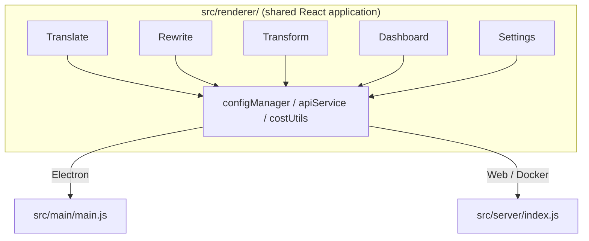

<p align="center">
  
</p>

<h1 align="center">Transrewrt</h1>

<p align="center">
  <a href="https://github.com/wsj-br/transrewrt/releases"></a>
  <a href="LICENSE"></a>
  
  
  
</p>

ابزار متنی مبتنی بر هوش مصنوعی: ترجمه بین زبان‌ها، بازنویسی با سبک‌های مختلف، و تبدیل با دستورالعمل‌های سفارشی - همه از طریق [OpenRouter](https://openrouter.ai). به صورت برنامه دسکتاپ (الکترون) یا برنامه وب خود-میزبانی شده (داکر) اجرا می‌شود.

- **ترجمه** - بین ده‌ها زبان، با تشخیص خودکار زبان مبدا
- **بازنویسی** - رفع اشتباهات گرامری، بهبود وضوح، رسمی/غیررسمی، کوتاه‌کردن، گسترش‌دادن، فنی
- **تبدیل** - دستورالعمل‌های سفارشی هوش مصنوعی؛ ایجاد و مدیریت دستورالعمل‌ها، زبان هدف اختیاری به ازای هر دستورالعمل
- **مدل‌ها و هزینه** - انتخاب هر مدل OpenRouter؛ صفحه‌ی کنترل هزینه با لاگ SQLite، خلاصه‌ها به تفکیک مدل/عملیات/روز
- **رابط کاربری** - بین‌الملالی‌سازی (pt-BR, de, fr, es, RTL)، تم‌ها، فونت‌ها، میان‌برهای کیبورد؛ حالت وب امن (کلید API فقط روی سرور)
- **دسکتاپ** - برنامه الکترون برای ویندوز و لینوکس
- **خود-میزبانی** - تصویر داکر برای amd64 و arm64 (آماده Raspberry Pi)

پس از نصب، **[راهنمای کاربر](../USER-GUIDE.md)** را برای مروری کامل بر تمامی ویژگی‌ها مشاهده کنید.

<small>**خواندن به زبان‌های دیگر:** [English (UK)](../README.md) · [Português (BR)](README.pt-BR.md) · [العربية](README.ar.md) · [বাংলা](README.bn.md) · [Català](README.ca.md) · [简体中文](README.zh-CN.md) · [繁體中文](README.zh-TW.md) · [Hrvatski](README.hr.md) · [Čeština](README.cs.md) · [Nederlands](README.nl.md) · [English (US)](README.en-US.md) · [Filipino](README.tl.md) · [Français](README.fr.md) · [Deutsch](README.de.md) · [Ελληνικά](README.el.md) · [हिन्दी](README.hi.md) · [Magyar](README.hu.md) · [Italiano](README.it.md) · [日本語](README.ja.md) · [Basa Jawa](README.jv.md) · [한국어](README.ko.md) · [Bahasa Melayu](README.ms.md) · [فارسی](README.fa.md) · [Polski](README.pl.md) · [Português (PT)](README.pt.md) · [ਪੰਜਾਬੀ](README.pa.md) · [Română](README.ro.md) · [Русский](README.ru.md) · [Slovenčina](README.sk.md) · [Español](README.es.md) · [Kiswahili](README.sw.md) · [Svenska](README.sv.md) · [తెలుగు](README.te.md) · [ภาษาไทย](README.th.md) · [Türkçe](README.tr.md) · [Українська](README.uk.md) · [Tiếng Việt](README.vi.md)</small>

<a id="screenshots"></a>
## تصاویر

**انتخاب‌گر زبان**


**ترجمه**


**تبدیل - ویرایش‌گر دستورالعمل**


**داشبورد**


**تنظیمات - انتخاب مدل**


<br /><br />

<a id="table-of-contents"></a>
## فهرست مطالب

<!-- START doctoc generated TOC please keep comment here to allow auto update -->
<!-- DON'T EDIT THIS SECTION, INSTEAD RE-RUN doctoc TO UPDATE -->

- [شروع سریع](#quick-start)
- [نصب](#installation)
  - [ویندوز (الکترون)](#windows-electron)
  - [لینوکس (الکترون)](#linux-electron)
  - [داکر](#docker)
- [دریافت کلید API OpenRouter](#getting-an-openrouter-api-key)
- [پیکربندی و محیط](#configuration-and-environment)
- [توسعه و معماری](#development-and-architecture)
- [انتشارات و تگ‌ها](#releases-and-tags)
- [ مشارکت](#contributing)
- [سلب مسئولیت](#disclaimer)
- [مجوز](#license)

<!-- END doctoc generated TOC please keep comment here to allow auto update -->

<br /><br />

<a id="quick-start"></a>

## شروع سریع

**Docker (توصیه شده برای میزبانی شخصی)**

```bash
docker pull ghcr.io/wsj-br/transrewrt:latest

API_KEY=sk-or-your-key docker run -d \
  -p 5000:5000 \
  -v transrewrt-data:/app/data \
  -e API_KEY \
  --name transrewrt-web \
  ghcr.io/wsj-br/transrewrt:latest
```

`sk-or-your-key` را با [کلید API OpenRouter](https://openrouter.ai/keys) خود جایگزین کنید. [http://localhost:5000](http://localhost:5000) را باز کرده و رمز عبور پیش‌فرض مدیر را قبل از در دسترس قرار دادن سرویس تغییر دهید.

<br />

> ℹ️ **توجه**<br/>
> در Docker کلید API OpenRouter تنها از طریق متغیر محیطی `API_KEY` تنظیم می‌شود (نه در رابط وب). در نسخه دسکتاپ (Electron) آن را در **تنظیمات → API** قرار می‌دهید.

<br />

**ویندوز**

آخرین `Transrewrt Setup x.y.z.exe` را از [Releases](https://github.com/wsj-br/transrewrt/releases) دانلود کنید، نصب‌کننده را اجرا کرده و سپس از منوی شروع یا میان‌بر دسکتاپ راه‌اندازی کنید. کلید API OpenRouter خود را در **تنظیمات → API** وارد کنید.

<br />

**لینوکس**

فایل `.AppImage` را از [Releases](https://github.com/wsj-br/transrewrt/releases) دانلود کرده و سپس:

```bash
chmod +x Transrewrt-x.y.z.AppImage && ./Transrewrt-x.y.z.AppImage
```

کلید API OpenRouter خود را در **تنظیمات → API** وارد کنید. در دبیان/اوبونتو ممکن است ابتدا وابستگی‌های اضافی را نصب کنید:

```bash
sudo apt install libgtk-3-0 libnotify-dev libnss3 libxss1 libasound2 libxtst6 xauth
```

برای جزئیات بیشتر به [نصب → لینوکس](#linux-electron) مراجعه کنید.

<br />

> ℹ️ **توجه**<br/>
> در حال حاضر macOS پشتیبانی نمی‌شود. Transrewrt برای ویندوز، لینوکس و Docker موجود است.

<br />

پس از اجرای برنامه، به **[راهنمای کاربر](../USER-GUIDE.md)** مراجعه کنید تا نحوه ترجمه، بازنویسی و تبدیل متن، مدیریت دستورات و پیکربندی مدل‌ها را بیاموزید.

<br /><br />

<a id="installation"></a>
## نصب

<a id="windows-electron"></a>
### ویندوز (Electron)

- آخرین نصب‌کننده را از [Releases](https://github.com/wsj-br/transrewrt/releases) دانلود کنید.
- فایل `.exe` را اجرا کرده و مراحل نصب را دنبال کنید.
- اجرای اول: برنامه را از منوی شروع یا میان‌بر دسکتاپ راه‌اندازی کنید. تنظیمات در `%APPDATA%\transrewrt\` ذخیره می‌شود.

<br />

<a id="linux-electron"></a>
### لینوکس (Electron)

- فایل `.AppImage` را از [Releases](https://github.com/wsj-br/transrewrt/releases) دانلود کنید.
- اجرا: `chmod +x Transrewrt-x.y.z.AppImage && ./Transrewrt-x.y.z.AppImage`
- وابستگی‌های اضافی (دبیان/اوبونتو): `sudo apt install libgtk-3-0 libnotify-dev libnss3 libxss1 libasound2 libxtst6 xauth`
- برای اطلاعات بیشتر به [dev/DEVELOPMENT.md](../dev/DEVELOPMENT.md) مراجعه کنید.

<br />

<a id="docker"></a>
### Docker

- دریافت: `docker pull ghcr.io/wsj-br/transrewrt:latest`
- کلید API OpenRouter **باید** از طریق متغیر محیطی `API_KEY` تنظیم شود. آن را با `-e API_KEY` (یا از طریق `docker compose` / `.env`) ارسال کنید تا کلید در لیست فرآیندها قابل مشاهده نباشد.
- امکان وارد کردن کلید API در رابط وب وجود ندارد.

مثال - برای پیوستگی با volume نام‌دار (کلید API از طریق env ارسال می‌شود، نه در خط فرمان):

```bash
API_KEY=sk-or-your-key docker run -d \
  -p 5000:5000 \
  -v transrewrt-data:/app/data \
  -e API_KEY \
  --name transrewrt-web \
  ghcr.io/wsj-br/transrewrt:latest
```

<br />

| گزینه   | توضیحات                                                                                                   |
| -------- | ------------------------------------------------------------------------------------------------------------- |
| پورت     | `5000` (نقشه‌برداری با `-p 5000:5000`)                                                                              |
| volume   | mount `/app/data` برای preserved کردن تنظیمات و پایگاه داده                                                         |
| متغیرهای محیطی | `PORT`, `CONFIG_PATH`, `API_KEY`, `API_URL`, `KEY_SEED` - به [پیکربندی](#configuration-and-environment) مراجعه کنید |

برای ساخت و اجرا از منبع: `docker compose up --build -d` یا `pnpm run docker:up` - به [dev/DEVELOPMENT.md](../dev/DEVELOPMENT.md) مراجعه کنید.

<br /><br />

<a id="getting-an-openrouter-api-key"></a>
## دریافت کلید API OpenRouter

Transrewrt از [OpenRouter](https://openrouter.ai) برای مدل‌های هوش مصنوعی استفاده می‌کند. برای ترجمه، بازنویسی یا تبدیل متن به یک کلید API نیاز دارید.

1. در [openrouter.ai](https://openrouter.ai) ثبت‌نام یا ورود کنید.
2. صفحه [Keys](https://openrouter.ai/keys) را باز کرده و یک کلید جدید ایجاد کنید (نامی برای آن انتخاب کرده و اختیاریاً محدودیت اعتبار تنظیم کنید). می‌توانید از مدل‌های رایگان بدون افزودن اعتبار استفاده کنید.
3. **دسکتاپ (Electron):** کلید را در **تنظیمات → API** قرار دهید. **Docker:** متغیر محیطی `API_KEY` را تنظیم کنید (به [شروع سریع](#quick-start) مراجعه کنید).

برای محدودیت‌ها، استفاده از کلید شخصی (BYOK) و موارد دیگر، به [احراز هویت OpenRouter](https://openrouter.ai/docs/api/reference/authentication) مراجعه کنید.

<br /><br />

<a id="configuration-and-environment"></a>

## پیکربندی و محیط

**مکان‌های فایل پیکربندی**

| راه‌اندازی         | مکان پیکربندی                                   |
| ------------------ | ------------------------------------------------- |
| الکترون (ویندوز)   | `%APPDATA%\transrewrt\`                           |
| الکترون (لینوکس)   | `~/.config/transrewrt/`                           |
| وب / داکر          | `/app/data/config.json` (برای تداوم، از volume استفاده کنید) |

<br />

**متغیرهای محیطی** (فقط برای وب/داکر؛ الکترون از فایل پیکربندی محلی استفاده می‌کند)

| متغیر      | پیش‌فرض                        | توضیحات                                                   |
| ------------- | ------------------------------ | ------------------------------------------------------------- |
| `PORT`        | `5000`                         | پورت گوش دادن سرور                                         |
| `CONFIG_PATH` | `/app/data/config.json`        | مسیر فایل پیکربندی                                       |
| `API_KEY`     | *(خالی)*                      | کلید API OpenRouter (برای داکر لازم است؛ از طریق env تنظیم شود، نه UI) |
| `API_URL`     | `https://openrouter.ai/api/v1` | پایه URL API هوش مصنوعی بالادست                                      |
| `KEY_SEED`    | *(خالی)*                      | مولد کلید پروکسی Transrewrt (اگر تنظیم شود، پیکربندی را نادیده می‌گیرد) |

<br />

**داده‌ها و پایداری:** برای داکر، یک volume در `/app/data` وصل کنید تا `config.json` و پایگاه داده SQLite پس از ریستارت کانتینر حفظ شوند. بدون volume، تمام داده‌ها هنگام توقف کانتینر از بین می‌روند.

<br />

**احراز هویت وب:**

- پیش‌فرز مدیر: `admin` / `transrewrt26`.
- مدیریت کاربران در **تنظیمات → کاربران**.
- ریست کردن رمز عبور: `docker exec <container> reset-web-password '<username>' '<new-password>'`
  (از منبع: `pnpm run reset-web-password -- <username> <new-password>`)

<br />

> ⚠️ **هشدار**<br/>
> فوراً پس از نصب روی هر میزبان قابل دسترسی شبکه‌ای، رمز عبور پیش‌فرض مدیر را تغییر دهید.

<br />

**پروکسی Transrewrt (اختیاری):** می‌توانید ترافیک API را از طریق یک پروکسی خارجی با کلید چرخش مبتنی بر زمان هدایت کنید. در **تنظیمات → API**، **استفاده از پروکسی Transrewrt** را فعال کنید، **مولد کلید** را تنظیم و **URL API** را به URL پایه پروکسی تغییر دهید. جزئیات بیشتر در [dev/SYSTEM-OVERVIEW.md](../dev/SYSTEM-OVERVIEW.md).

تنظیمات اصلی (تم، فونت، مدل‌ها، زبان‌ها و غیره) در دیالوگ تنظیمات در دسترس هستند یا می‌توانید مستقیماً در JSON پیکربندی ویرایش کنید. لیست کامل و پیش‌فرض‌ها در [dev/DEVELOPMENT.md](../dev/DEVELOPMENT.md) مستند شده‌اند.

<br /><br />

<a id="development-and-architecture"></a>
## توسعه و معماری

- **توسعه:** راه‌اندازی، ساخت، تست و استقرار (الکترون، وب، داکر) - See **[dev/DEVELOPMENT.md](../dev/DEVELOPMENT.md)**.
- **معماری و مرور سیستم:** ساختار پوشه، پشته فناوری، تصمیمات طراحی، پروکسی Transrewrt - See **[dev/SYSTEM-OVERVIEW.md](../dev/SYSTEM-OVERVIEW.md)**.



<br /><br />

<a id="releases-and-tags"></a>
## انتشارها و برچسب‌ها

- **برچسب‌های گیت** `v`* (مثلاً `v1.0.10`) [جریان کار انتشار](.github/workflows/release.yml) را فعال می‌کنند. **انتشارهای GitHub** نصب‌کننده ویندوز (`.exe`) و AppImage لینوکس را ضمیمه می‌کنند.
- **تصاویر داکر** در `ghcr.io/wsj-br/transrewrt` منتشر می‌شوند. برچسب‌های تصویر با نسخه گیت تطبیق دارند (مثلاً `v1.0.10` → `ghcr.io/wsj-br/transrewrt:1.0.10`) به علاوه `latest`. چند-معماری: `linux/amd64` و `linux/arm64` (مثلاً رزی‌بری پای).

<br /><br />

<a id="contributing"></a>
## مشارکت

1. مخزن را فurk کنید.
2. یک شاخه ویژگی بسازید: `git checkout -b feature/my-feature`
3. تغییرات خود را با پیام واضح کامیت کنید.
4. بفرستید و یک Pull Request بر `main` باز کنید.

لطفاً سبک کد موجود را دنبال کنید و تغییرات خود را هر دو حالت الکترون و وب قبل از ارسال تست کنید. برای دستورات ساخت و تست به [dev/DEVELOPMENT.md](../dev/DEVELOPMENT.md) رجوع کنید.

<br />

**گزارش مشکلات:** یک issue در [GitHub](https://github.com/wsj-br/transrewrt/issues) باز کنید. پلتفرم خود (ویندوز / لینوکس / داکر) و نسخه برنامه (در دیالوگ About یا صفحه Releases نشان داده می‌شود) را ذکر کنید.

<br /><br />

<a id="disclaimer"></a>
## سلب مسئولیت

## سلب مسئولیت

نام محصولات و آیکون‌ها متعلق به مالکان مربوطه هستند و فقط برای اهداف شناسایی به کار می‌روند. این نرم‌افزار با هیچ‌یک از برندهای ذکر شده وابسته یا تأیید شده نیست.

<br /><br />

<a id="license"></a>
## مجوز

حق نشر © ۲۰۲۶ والدیمار اسکودلر جوانر.

[Apache License 2.0](LICENSE)