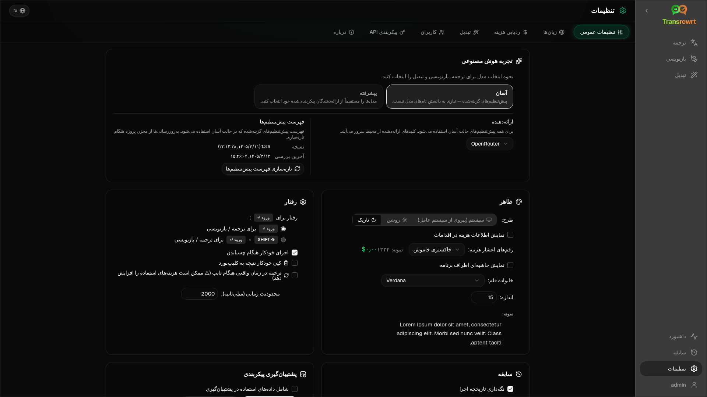

<p align="center">
  
</p>

<p align="center">
  <a href="https://github.com/wsj-br/transrewrt/releases"></a>
  <a href="LICENSE"></a>
  
  
  
</p>

ابزار متنی مبتنی بر هوش مصنوعی: ترجمه بین زبان‌ها، بازنویسی به سبک‌های مختلف و تبدیل با پرسش‌های سفارشی — با استفاده از ارائه‌دهندگان متعدد هوش مصنوعی (OpenRouter، OpenAI، Anthropic، Google Gemini، DeepSeek، Groq، Mistral، xAI و Ollama محلی). این ابزار به صورت برنامه دسکتاپ (الکترون) یا برنامه تحت وب قابل اجرا به صورت خودمیزبانی (Docker) اجرا می‌شود.

- **ترجمه** - بین ده‌ها زبان، با تشخیص خودکار زبان منبع
- **بازنویسی** - اصلاح دستور زبان، بهبود وضوح، سبک رسمی/غیررسمی، کوتاه‌تر کردن، گسترش دادن، تخصصی
- **تبدیل** - دستورهای هوش مصنوعی سفارشی؛ ایجاد و مدیریت دستورها، زبان مقصد اختیاری برای هر دستور
- **تاریخچه** - تاریخچه کامل اجرا با متن ورودی/خروجی، فیلتر کردن و صادرات
- **آسان و پیشرفته** - حالت آسان (پیش‌فرض): تنظیمات از پیش تعریف شده برای هر ارائه‌دهنده (**رایگان (OpenRouter)**، **استاندارد**، **پیشرفته**، **فنی**؛ تنها تنظیماتی که برای ارائه‌دهندهٔ انتخاب شده نگاشت دارند نمایش داده می‌شوند) بدون نیاز به انتخاب شناسهٔ مدل؛ حالت پیشرفته: لیست کامل مدل‌ها از ارائه‌دهندگان پیکربندی‌شدهٔ شما
- **مدل‌ها و هزینه** - نمودارهای هزینه و مصرف (خلاصه، بر اساس مدل، همهٔ فراخوانی‌ها) با قابلیت صادرات؛ OpenRouter میزان هزینهٔ واقعی را نشان می‌دهد، در حالی که سایر ارائه‌دهندگان از برآوردها استفاده می‌کنند
- **رابط کاربری** - رابط چندزبانه (بیش از ۳۰ زبان، پشتیبانی از زبان‌های راست‌به‌چپ)، قلم‌ها، ...
- **حالت وب** - پشتیبانی از چند کاربر با نقش‌های مدیر
- **دسکتاپ** - برنامه الکترون برای ویندوز و لینوکس
- **خودمیزبانی** - تصویر داکر برای amd64 و arm64 (آماده برای رزبری پای)

پس از نصب، [**راهنمای کاربر**](USER-GUIDE.fa.md) را برای مرور کامل تمام ویژگی‌ها مشاهده کنید.

<small>**خواندن به زبان‌های دیگر:** </small>
<small id="lang-list">[English (GB)](../README.md) · [Português (Brasil)](./README.pt-BR.md) · [العربية](./README.ar.md) · [বাংলা](./README.bn.md) · [Català](./README.ca.md) · [中文 (中国大陆)](./README.zh-CN.md) · [中文 (台灣)](./README.zh-TW.md) · [Hrvatski](./README.hr.md) · [Čeština](./README.cs.md) · [Nederlands](./README.nl.md) · [English (US)](./README.en-US.md) · [Tagalog](./README.tl.md) · [Français](./README.fr.md) · [Deutsch](./README.de.md) · [Ελληνικά](./README.el.md) · [हिन्दी](./README.hi.md) · [Magyar](./README.hu.md) · [Italiano](./README.it.md) · [日本語](./README.ja.md) · [한국어](./README.ko.md) · [Bahasa Melayu](./README.ms.md) · [فارسی](./README.fa.md) · [Polski](./README.pl.md) · [Basa Jawa](./README.jv.md) · [Português](./README.pt.md) · [ਪੰਜਾਬੀ](./README.pa.md) · [Română](./README.ro.md) · [Русский](./README.ru.md) · [Slovenčina](./README.sk.md) · [Español](./README.es.md) · [Kiswahili](./README.sw.md) · [Svenska](./README.sv.md) · [తెలుగు](./README.te.md) · [ไทย](./README.th.md) · [Türkçe](./README.tr.md) · [Українська](./README.uk.md) · [Tiếng Việt](./README.vi.md)</small>

<small>

> **توجه درباره ترجمه‌های رابط کاربری و مستندات:** تمام زبان‌های رابط کاربری به جز انگلیسی اصلی (بریتانیا)
> با استفاده از مدل‌های هوش مصنوعی ترجمه شده‌اند؛ ممکن است عبارت‌بندی نادقیق باشد یا دارای اشتباهات باشد.

</small>

<br/>

<a id="table-of-contents"></a>
## فهرست مطالب

<!-- START doctoc generated TOC please keep comment here to allow auto update -->
<!-- DON'T EDIT THIS SECTION, INSTEAD RE-RUN doctoc TO UPDATE -->

- [تصاویر](#screenshots)
- [شروع سریع](#quick-start)
- [دریافت کلید API OpenRouter](#getting-an-openrouter-api-key)
- [پیکربندی و محیط](#configuration-and-environment)
- [توسعه و معماری](#development-and-architecture)
- [گزارش مشکلات](#reporting-issues)
- [سلب مسئولیت](#disclaimer)
- [مجوز](#license)

<!-- END doctoc generated TOC please keep comment here to allow auto update -->

<br/><br/>

<a id="screenshots"></a>
## تصاویر صفحه

**انتخابگر زبان**


**ترجمه**


**تبدیل - ویرایشگر پرسش**


**داشبورد**


**تاریخچه**


**تنظیمات - انتخاب مدل**



<br/><br/>

<a id="quick-start"></a>
## شروع سریع

<details>
<summary><b>Docker (توصیه‌شده برای میزبانی شخصی)</b></summary>

<a id="docker"></a>

<br/>

```bash
docker pull ghcr.io/wsj-br/transrewrt:latest

OPENROUTER_API_KEY=sk-or-your-key docker run -d \
  -p 5000:5000 \
  -v transrewrt-data:/app/data \
  -e OPENROUTER_API_KEY \
  --name transrewrt-web \
  ghcr.io/wsj-br/transrewrt:latest
```

`sk-or-your-key` را با [کلید API شما در OpenRouter](https://openrouter.ai/keys) جایگزین کنید (یا کلیدهای سایر ارائه‌دهندگان را تنظیم کنید؛ به [پیکربندی](#configuration-and-environment) مراجعه کنید). [http://localhost:5000](http://localhost:5000) را باز کنید و قبل از در دسترس قرار دادن سرویس، گذرواژه پیش‌فرض مدیر را تغییر دهید.

حداقل یک کلید ارائه‌دهنده را از طریق محیط تنظیم کنید (برای مثال `OPENROUTER_API_KEY` برای OpenRouter). متغیرها را با `-e` یا `docker compose` / `.env` منتقل کنید تا اطلاعات محرمانه درون تصویر ذخیره نشوند. کلیدهای ارائه‌دهنده در رابط وب **وارد نمی‌شوند**؛ سرور آنها را از محیط می‌خواند.

<br/>

> ℹ️ **توجه**<br/>
> در Docker، احراز هویت مدل‌های زبانی بزرگ (LLM) با متغیرهای محیطی مانند `OPENROUTER_API_KEY`، `OPENAI_API_KEY`، `CEREBRAS_API_KEY`، … تنظیم می‌شود (نه در رابط کاربری وب). در دسکتاپ (الکترون) کلیدها را در بخش **تنظیمات → API** تنظیم می‌کنید.

<br/>

یا از Docker Compose استفاده کنید:

```bash
# download the compose file
wget https://github.com/wsj-br/transrewrt/raw/refs/heads/master/production.yml -O transrewrt.yml
# Edit the file to add your API keys (API_KEYs), or uncomment and adjust the `.env` file. Set the timezone (TZ) if necessary.
vi transrewrt.yml
# start the container
docker compose -f transrewrt.yml up -d
```

برای مشاهده تمام متغیرهای محیطی به [پیکربندی](#configuration-and-environment) مراجعه کنید، مانند `PORT`، `CONFIG_PATH`، `TZ` و کلیدهای LLM (`OPENROUTER_API_KEY`، `OPENAI_API_KEY`، …).

</details>

<br/>

<details>
<summary><b>منطقه زمانی سرور (Docker)</b></summary>

<a id="configuring-the-timezone"></a>

<br/>

تاریخ و زمان رابط کاربری برنامه، مطابق با تنظیمات محلی و منطقه زمانی **مرورگر** است. برای رفتار **سروری** (مانند ثبت رویدادها و موارد مشابه)، کانتینر از متغیر محیطی `TZ` استفاده می‌کند. مقدار پیش‌فرض `TZ=Europe/London` است.

برای استفاده از منطقه زمانی دیگر، `TZ` را در فایل Compose خود تنظیم کنید، مثلاً:

```yaml
environment:
  - TZ=America/Sao_Paulo
```

یا هنگام اجرای کانتینر (Docker) آن را ارسال کنید:

```bash
--env TZ=America/Sao_Paulo
```

در بسیاری از سیستم‌های میزبان لینوکس می‌توانید نام منطقه زمانی سیستم را با دستور زیر کپی کنید:

```bash
echo TZ=\"$(</etc/timezone)\"
```

فهرستی از نام‌های معتبر منطقه زمانی در [پایگاه داده tz](https://en.wikipedia.org/wiki/List_of_tz_database_time_zones) (ویکی‌پدیا) نگهداری می‌شود.

</details>

<br/>

<details>
<summary><b>ویندوز</b></summary>

<a id="windows-electron"></a>

<br/>

- آخرین نسخه `Transrewrt Setup x.y.z.exe` را از [انتشارات](https://github.com/wsj-br/transrewrt/releases) دانلود کنید.
- فایل `.exe` را اجرا کرده و مراحل نصب را دنبال کنید.
- اولین اجرا: برنامه را از منوی شروع یا میان‌بر دسکتاپ شروع کنید.
- کلیدهای API خود را در بخش **تنظیمات → API** وارد کنید. شما باید حداقل یک ارائه‌دهنده را پیکربندی کنید؛ OpenRouter معمولاً برای مدل‌های رایگان استفاده می‌شود.

<br/>

> ℹ️ **توجه**<br/>
> ویندوز ممکن است یکی از این هشدارهای امنیتی را نمایش دهد (معمول برای برنامه‌های بدون امضای معتبر یا مستقل):
>   - **کنترل حساب کاربری (UAC)**: "آیا می‌خواهید به این برنامه از یک ناشر ناشناخته اجازه تغییر در دستگاه خود بدهید؟" → روی **بله** کلیک کنید.
>   - **Microsoft Defender SmartScreen**: "ویندوز از کامپیوتر شما محافظت کرد" → روی **اطلاعات بیشتر** کلیک کنید → **با این حال اجرا کنید**.
>
> این اتفاق به این دلیل رخ می‌دهد که برنامه توسط مایکروسافت یا یک ناشر بزرگ امضا نشده است — اما اگر از انتشارات رسمی GitHub ما دانلود شده باشد (چک‌سوم‌ها را در صفحه [انتشارات](https://github.com/wsj-br/transrewrt/releases) کنار هر فایل بررسی کنید)، ایمن است.

<br/>

</details>

<br/>

<details>
<summary><b>Linux</b></summary>

<a id="linux-electron"></a>

<br/>

فایل `.AppImage` مربوط به پردازندهٔ خود را از [انتشارات](https://github.com/wsj-br/transrewrt/releases) دانلود کنید (`x64` برای رایانه‌های معمولی، `arm64` برای بسیاری از دستگاه‌های ARM از جمله Raspberry Pi 4+)، سپس:

```bash
chmod +x Transrewrt-x.y.z-x64.AppImage && ./Transrewrt-x.y.z-x64.AppImage
```

در x86_64/amd64 از نام فایل `x64` استفاده کنید؛ در ARM64 از نام `...-arm64.AppImage` استفاده کنید.

کلیدهای API خود را در **تنظیمات → API** وارد کنید. شما باید حداقل یک ارائه‌دهنده را پیکربندی کنید؛ OpenRouter برای مدل‌های رایگان رایج است.

**پیام‌های کنسول:** نسخه‌های بسته‌بندی‌شده لینوکس (AppImageهای `x64` و `arm64`) هشدارهای منسوخ‌شدهٔ Node را در ترمینال غیرفعال می‌کنند (برای مثال ماژول داخلی `punycode`). اگر Chromium خطاهای GPU / EGL مانند «GLES3 پشتیبانی نمی‌شود» چاپ کند اما برنامه کار کند، می‌توانید آن‌ها را با غیرفعال کردن شتاب سخت‌افزاری ساکت کنید:

```bash
TRANSREWRT_DISABLE_GPU=1 ./Transrewrt-x.y.z-arm64.AppImage
```

این مورد برای amd64 نیز اعمال می‌شود؛ نام فایل را با دانلود خود تطبیق دهید.

در دبیان/اوبونتو، ممکن است به کتابخانه‌های **اجرا** اضافی که توسط Chromium مورد نیاز است نیاز داشته باشید (این کتابخانه‌ها اغلب در نصب‌های کامل دسکتاپ وجود دارند). در صورت نیاز دستورات زیر را اجرا کنید:

```bash
sudo apt update
sudo apt install -y libfuse2 libgtk-3-0 libnotify4 libnss3 libnspr4 libxss1 libxtst6 xdg-utils \
     xauth libatspi2.0-0 libdrm2 libgbm1 libxcb-dri3-0 libcups2 libasound2t64
```

`libasound2t64` را با `libasound2` برای `arm64` جایگزین کنید. نصب‌های حداقلی یا سفارشی ممکن است همچنان با خطای فایل `.so` انجام نشده شکست بخورند. بسته‌ای را که در پیام خطا نام برده شده نصب کنید (افزونه‌های رایج: `libatk1.0-0`, `libatk-bridge2.0-0`, `libgbm1`, `libdrm2`). در برخی محیط‌ها، ممکن است باید برنامه را با استفاده از `APPIMAGE_EXTRACT_AND_RUN=1 ./Transrewrt-….AppImage` اجرا کنید.

<br/>

> ℹ️ **توجه**<br/>
> فعلاً macOS پشتیبانی نمی‌شود. Transrewrt برای ویندوز، لینوکس و داکر در دسترس است.

</details>

<br/>

پس از اجرای برنامه، [**راهنمای کاربر**](USER-GUIDE.fa.md) را برای یادگیری نحوه ترجمه، بازنویسی و تبدیل متن، مدیریت دستورها و پیکربندی مدل‌ها مشاهده کنید.

<br/><br/>

<a id="getting-an-openrouter-api-key"></a>
## دریافت کلید API OpenRouter

Transrewrt از ارائه‌دهندگان متعدد هوش مصنوعی پشتیبانی می‌کند. [OpenRouter](https://openrouter.ai) یک انتخاب محبوب است زیرا بسیاری از مدل‌ها را تحت یک کلید جمع‌آوری می‌کند و مدل‌های رایگان ارائه می‌دهد.

1. در [openrouter.ai](https://openrouter.ai) ثبت‌نام کنید یا وارد شوید.
2. صفحهٔ [Keys](https://openrouter.ai/keys) را باز کنید و یک کلید جدید ایجاد کنید (نام آن را تعیین کنید و به صورت اختیاری می‌توانید سقف اعتبار تعیین کنید). می‌توانید بدون افزودن اعتبار از مدل‌های رایگان استفاده کنید.
3. **دسکتاپ (الکترون):** کلیدها را در **تنظیمات → API** بچسبانید. **داکر:** متغیرهای محیطی مانند `OPENROUTER_API_KEY` را تنظیم کنید (به [شروع سریع](#quick-start) مراجعه کنید).

از مدل **Body Builder** OpenRouter ([`openrouter/bodybuilder`](https://openrouter.ai/openrouter/bodybuilder)) برای ترجمه، بازنویسی یا تبدیل استفاده نکنید: این مدل بارهای درخواست JSON برمی‌گرداند، نه متن کامل‌شده برای این وظایف. به [تنظیمات → مدل‌ها](USER-GUIDE.fa.md#models) در راهنمای کاربر مراجعه کنید.

شما همچنین می‌توانید از ارائه‌دهندگان دیگر (OpenAI، Anthropic، Google Gemini، DeepSeek، Groq، Mistral، xAI، Cerebras) استفاده کنید یا مدل‌ها را به صورت محلی با [Ollama](https://ollama.com) اجرا کنید. برای فهرست کامل ارائه‌دهندگان پشتیبانی‌شده و متغیرهای محیطی به [پیکربندی](#configuration-and-environment) مراجعه کنید.

</br>

> ⚠️ **هشدار**<br/>
> اگر از Ollama از دستگاه، کانتینر یا سرویس دیگری استفاده می‌کنید، مطمئن شوید که Ollama را برای پذیرش ارتباطات خارجی (نه فقط localhost) پیکربندی کرده‌اید.

<br/><br/>

<a id="configuration-and-environment"></a>
## پیکربندی و محیط

</br>

**مکان‌های فایل پیکربندی**

| استقرار         | محل پیکربندی                                   |
| ------------------ | ------------------------------------------------- |
| الکترون (ویندوز) | `%APPDATA%\transrewrt\`                           |
| الکترون (لینوکس)   | `~/.config/transrewrt/`                           |
| وب / داکر       | `/app/data/config.json` (از volume برای حفظ داده استفاده کنید) |

<br/>

**متغیرهای محیطی** (فقط برای وب/داکر؛ الکترون از فایل پیکربندی محلی استفاده می‌کند)

| متغیر             | توضیحات                                                                  |
|----------------------|------------------------------------------------------------------------------|
| `PORT`               | پورت گوشدهی سرور (پیش‌فرض `5000`)                                  |
| `CONFIG_PATH`        | مسیر فایل پیکربندی (پیش‌فرض `/app/data/config.json`)                |
| `TZ`                 | منطقه زمانی برای زمان سمت سرور (ثبت رویدادها و غیره) (پیش‌فرض `Europe/London`) |
| `HISTORY_DISABLED`   | به‌طور اختیاری، تاریخچه اجرا را غیرفعال می‌کند (پیش‌فرض `false` است) |
| `OPENROUTER_API_KEY` | کلید API OpenRouter                                                           |
| `OPENAI_API_KEY`     | کلید API OpenAI                                                               |
| `CEREBRAS_API_KEY`   | کلید API Cerebras                                                             |
| `ANTHROPIC_API_KEY`  | کلید API Anthropic                                                            |
| `GOOGLE_API_KEY`     | کلید API Google Gemini                                                        |
| `DEEPSEEK_API_KEY`   | کلید API DeepSeek                                                             |
| `GROQ_API_KEY`       | کلید API Groq                                                                 |
| `MISTRAL_API_KEY`    | کلید API Mistral                                                              |
| `OLLAMA_URL`         | آدرس پایه Ollama (مثلاً `http://host.docker.internal:11434`)                   |
| `XAI_API_KEY`        | کلید API xAI                                                                  |

**حالت حریم خصوصی:** برای غیرفعال کردن مطلق پیگیری تاریخچه بسته به `config.json` یا ترجیحات کاربر، مقدار `HISTORY_DISABLED` را روی `true` یا `1` (بدون توجه به بزرگی یا کوچکی حروف) تنظیم کنید، هم برای **فرآیند سرور وب/داکر** و/یا **فرآیند اصلی دسکتاپ الکترون** (مثلاً محیط سیستم یا برنامه‌ی راه‌انداز — نه فقط رندرر). این کار ذخیره‌سازی تاریخچه ورودی/خروجی را غیرفعال می‌کند، **تنظیمات → تنظیمات عمومی → تاریخچه** را قفل می‌کند و از دسترسی به APIهای مرتبط با تاریخچه جلوگیری می‌کند.

فقط ارائه‌دهندگانی را پیکربندی کنید که از آنها استفاده می‌کنید. شناسه‌های مدل دارای فضای نام هستند (`openrouter/…`, `openai/…`, `cerebras/…`, `ollama/…`, و غیره).

**نمایش هزینه:** OpenRouter در صورت امکان هزینه دقیق صورتحساب شده را برمی‌گرداند. سایر ارائه‌دهندگان از **تخمینی** استفاده می‌کنند که از قیمت‌گذاری عمومی مدل OpenRouter گرفته شده، در صورتی که کلید OpenRouter موجود باشد؛ در غیر این صورت، هزینه‌های غیر از OpenRouter ممکن است به صورت `0` نمایش داده شوند. این تخمین‌ها فاکتور نیستند.

<br/>

**داده‌ها و حفظ داده‌ها:** برای داکر، یک volume را در مسیر `/app/data` متصل کنید تا `config.json` و پایگاه داده SQLite بین راه‌اندازی‌های مجدد کانتینر حفظ شوند. بدون volume، تمام داده‌ها پس از توقف کانتینر از بین می‌روند.

<br/>

**احراز هویت وب:**

- مدیر پیش‌فرض: `admin` / `transrewrt26`.
- مدیریت کاربران در بخش **تنظیمات → کاربران**.
- بازنشانی گذرواژه: `docker exec <container> reset-web-password '<username>' '<new-password>'`

<br/>

> ⚠️ **اخطار**<br/>
> به محض اینکه سیستم در دسترس شبکه باشد، گذرواژه پیش‌فرض مدیر را تغییر دهید.

<br/>

تنظیمات کلیدی (فونت، مدل‌ها، زبان‌ها و غیره) در بخش تنظیمات برنامه در دسترس هستند.

<br/><br/>

<a id="development-and-architecture"></a>
## توسعه و معماری

- **توسعه:** راه‌اندازی، ساخت، تست و استقرار (الکترون، وب، داکر) - به [dev/DEVELOPMENT.md](../dev/DEVELOPMENT.md) مراجعه کنید.
- **مرور کلی معماری و سیستم:** ساختار پوشه‌ها، پشته فناوری، تصمیمات طراحی - به [dev/SYSTEM-OVERVIEW.md](../dev/SYSTEM-OVERVIEW.md) مراجعه کنید.

<br/><br/>

<a id="reporting-issues"></a>
## گزارش مشکلات

یک مشکل در [GitHub](https://github.com/wsj-br/transrewrt/issues) باز کنید. پلتفرم خود را (ویندوز / لینوکس / داکر) و نسخه برنامه (که در پنجره درباره یا در صفحه انتشارات نمایش داده می‌شود) ذکر کنید.

<br/><br/>

<a id="disclaimer"></a>
## اعلامیه

نام‌ها و آیکون‌های محصولات متعلق به مالکان خود بوده و فقط برای اهداف شناسایی استفاده می‌شوند. این نرم‌افزار با هیچ یک از برندهای ذکر شده همکاری یا تأییدی ندارد.

<br/><br/>

<a id="license"></a>
## مجوز

حق تألیف © 2026 والدمر اسکودلر جونیور.

[Apache License 2.0](../LICENSE)
