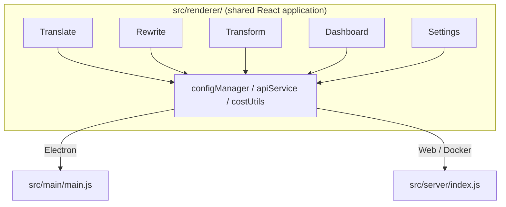

<p align="center">
  
</p>

<h1 align="center">Transrewrt</h1>

<p align="center">
  <a href="https://github.com/wsj-br/transrewrt/releases"></a>
  <a href="LICENSE"></a>
  
  
  
</p>

Outil de texte IA : traduisez entre plusieurs langues, réécrivez dans différents styles et transformez avec des invites personnalisées - le tout via [OpenRouter](https://openrouter.ai). Fonctionne comme une application de bureau (Electron) ou une application web auto-hébergée (Docker).

- **Traduire** - entre des dizaines de langues, avec détection automatique de la langue source
- **Réécrire** - corriger la grammaire, améliorer la clarté, formel/informel, raccourcir, développer, technique
- **Transformer** - des invites IA personnalisées ; créer et gérer des invites, langue cible facultative par invite
- **Modèles et coût** - choisissez n'importe quel modèle OpenRouter ; tableau de bord des coûts avec journal SQLite, résumés par modèle/opération/jour
- **Interface** - i18n (pt-BR, de, fr, es, RTL), thèmes, polices, raccourcis clavier ; mode web sécurisé (clé API uniquement sur le serveur)
- **Bureau** - application Electron pour Windows et Linux
- **Auto-hébergé** - image Docker pour amd64 & arm64 (compatible Raspberry Pi)

Une fois installé, consultez le **[Guide de l'utilisateur](../USER-GUIDE.md)** pour une visite complète de toutes les fonctionnalités.

<small>**Lire dans d'autres langues :** [English (UK)](../README.md) · [Português (BR)](README.pt-BR.md) · [العربية](README.ar.md) · [বাংলা](README.bn.md) · [Català](README.ca.md) · [简体中文](README.zh-CN.md) · [繁體中文](README.zh-TW.md) · [Hrvatski](README.hr.md) · [Čeština](README.cs.md) · [Nederlands](README.nl.md) · [English (US)](README.en-US.md) · [Filipino](README.tl.md) · [Français](README.fr.md) · [Deutsch](README.de.md) · [Ελληνικά](README.el.md) · [हिन्दी](README.hi.md) · [Magyar](README.hu.md) · [Italiano](README.it.md) · [日本語](README.ja.md) · [Basa Jawa](README.jv.md) · [한국어](README.ko.md) · [Bahasa Melayu](README.ms.md) · [فارسی](README.fa.md) · [Polski](README.pl.md) · [Português (PT)](README.pt.md) · [ਪੰਜਾਬੀ](README.pa.md) · [Română](README.ro.md) · [Русский](README.ru.md) · [Slovenčina](README.sk.md) · [Español](README.es.md) · [Kiswahili](README.sw.md) · [Svenska](README.sv.md) · [తెలుగు](README.te.md) · [ภาษาไทย](README.th.md) · [Türkçe](README.tr.md) · [Українська](README.uk.md) · [Tiếng Việt](README.vi.md)</small>

<a id="screenshots"></a>
## Captures d'écran

**Sélecteur de langue**


**Traduire**


**Transformer - éditeur d'invites**


**Tableau de bord**


**Paramètres - sélection de modèle**


<br /><br />

<a id="table-of-contents"></a>
## Table des matières

<!-- START doctoc generated TOC please keep comment here to allow auto update -->
<!-- DON'T EDIT THIS SECTION, INSTEAD RE-RUN doctoc TO UPDATE -->

- [Démarrage rapide](#quick-start)
- [Installation](#installation)
  - [Windows (Electron)](#windows-electron)
  - [Linux (Electron)](#linux-electron)
  - [Docker](#docker)
- [Obtenir une clé API OpenRouter](#getting-an-openrouter-api-key)
- [Configuration et environnement](#configuration-and-environment)
- [Développement et architecture](#development-and-architecture)
- [Publications et étiquettes](#releases-and-tags)
- [Contribuer](#contributing)
- [Avertissement](#disclaimer)
- [Licence](#license)

<!-- END doctoc generated TOC please keep comment here to allow auto update -->

<br /><br />

<a id="quick-start"></a>

## Démarrage rapide

**Docker (recommandé pour l'auto-hébergement)**

```bash
docker pull ghcr.io/wsj-br/transrewrt:latest

API_KEY=sk-or-your-key docker run -d \
  -p 5000:5000 \
  -v transrewrt-data:/app/data \
  -e API_KEY \
  --name transrewrt-web \
  ghcr.io/wsj-br/transrewrt:latest
```

Remplacez `sk-or-your-key` par votre [clé API OpenRouter](https://openrouter.ai/keys). Ouvrez [http://localhost:5000](http://localhost:5000) et changez le mot de passe administrateur par défaut avant d'exposer le service.

<br />

> ℹ️ **NOTE**<br/>
> Avec Docker, la clé API OpenRouter est définie uniquement via la variable d'environnement `API_KEY` (pas dans l'interface web). Sur desktop (Electron), vous la collez dans **Paramètres → API**.

<br />

**Windows**

Téléchargez le dernier `Transrewrt Setup x.y.z.exe` depuis [Releases](https://github.com/wsj-br/transrewrt/releases), exécutez l'installeur, puis lancez depuis le menu Démarrer ou le raccourci sur le bureau. Entrez votre clé API OpenRouter dans **Paramètres → API**.

<br />

**Linux**

Téléchargez le fichier `.AppImage` depuis [Releases](https://github.com/wsj-br/transrewrt/releases), puis :

```bash
chmod +x Transrewrt-x.y.z.AppImage && ./Transrewrt-x.y.z.AppImage
```

Entrez votre clé API OpenRouter dans **Paramètres → API**. Sur Debian/Ubuntu, vous devrez peut-être installer des dépendances supplémentaires :

```bash
sudo apt install libgtk-3-0 libnotify-dev libnss3 libxss1 libasound2 libxtst6 xauth
```

Voir [Installation → Linux](#linux-electron) pour plus de détails.

<br />

> ℹ️ **NOTE**<br/>
> macOS n'est actuellement pas supporté. Transrewrt est disponible pour Windows, Linux et Docker.

<br />

Une fois l'application en cours d'exécution, consultez le **[Guide utilisateur](../USER-GUIDE.md)** pour apprendre à traduire, réécrire et transformer du texte, gérer les prompts et configurer les modèles.

<br /><br />

<a id="installation"></a>
## Installation

<a id="windows-electron"></a>
### Windows (Electron)

- Téléchargez le dernier installeur depuis [Releases](https://github.com/wsj-br/transrewrt/releases).
- Exécutez le `.exe` et suivez l'installeur.
- Premier lancement : démarrez l'application depuis le menu Démarrer ou le raccourci sur le bureau. La configuration est stockée dans `%APPDATA%\transrewrt\`.

<br />

<a id="linux-electron"></a>
### Linux (Electron)

- Téléchargez le `.AppImage` depuis [Releases](https://github.com/wsj-br/transrewrt/releases).
- Exécutez : `chmod +x Transrewrt-x.y.z.AppImage && ./Transrewrt-x.y.z.AppImage`
- Dépendances supplémentaires (Debian/Ubuntu) : `sudo apt install libgtk-3-0 libnotify-dev libnss3 libxss1 libasound2 libxtst6 xauth`
- Voir [dev/DEVELOPMENT.md](../dev/DEVELOPMENT.md) pour plus d'informations.

<br />

<a id="docker"></a>
### Docker

- Récupérez l'image : `docker pull ghcr.io/wsj-br/transrewrt:latest`
- La clé API OpenRouter **doit** être définie via la variable d'environnement `API_KEY`. Passez-la avec `-e API_KEY` (ou via `docker compose` / `.env`) pour que la clé ne soit pas visible dans la liste des processus.
- La clé API ne peut pas être saisie dans l'interface web.

Exemple - volume nommé pour la persistance (clé API passée via env, pas en ligne de commande) :

```bash
API_KEY=sk-or-your-key docker run -d \
  -p 5000:5000 \
  -v transrewrt-data:/app/data \
  -e API_KEY \
  --name transrewrt-web \
  ghcr.io/wsj-br/transrewrt:latest
```

<br />

| Option   | Description                                                                                                   |
| -------- | ------------------------------------------------------------------------------------------------------------- |
| Port     | `5000` (mapper avec `-p 5000:5000`)                                                                            |
| Volume   | Monter `/app/data` pour la persistance de la configuration et de la base de données                           |
| Env vars | `PORT`, `CONFIG_PATH`, `API_KEY`, `API_URL`, `KEY_SEED` - voir [Configuration](#configuration-and-environment) |

Pour construire et exécuter depuis les sources : `docker compose up --build -d` ou `pnpm run docker:up` - voir [dev/DEVELOPMENT.md](../dev/DEVELOPMENT.md).

<br /><br />

<a id="getting-an-openrouter-api-key"></a>
## Obtenir une clé API OpenRouter

Transrewrt utilise [OpenRouter](https://openrouter.ai) pour les modèles d'IA. Vous avez besoin d'une clé API pour traduire, réécrire ou transformer du texte.

1. Inscrivez-vous ou connectez-vous sur [openrouter.ai](https://openrouter.ai).
2. Ouvrez la page [Keys](https://openrouter.ai/keys) et créez une nouvelle clé (donnez-lui un nom, et définissez éventuellement une limite de crédit). Vous pouvez utiliser des modèles gratuits sans ajouter de crédit.
3. **Desktop (Electron) :** collez la clé dans **Paramètres → API**. **Docker :** définissez la variable d'environnement `API_KEY` (voir [Démarrage rapide](#quick-start)).

Pour les limites, BYOK, et plus, voir [OpenRouter authentication](https://openrouter.ai/docs/api/reference/authentication).

<br /><br />

<a id="configuration-and-environment"></a>

## Configuration et environnement

**Emplacements des fichiers de configuration**

| Déploiement         | Emplacement de configuration                                   |
| ------------------ | ------------------------------------------------------------- |
| Electron (Windows) | `%APPDATA%\transrewrt\`                                        |
| Electron (Linux)   | `~/.config/transrewrt/`                                        |
| Web / Docker       | `/app/data/config.json` (utilisez un volume pour la persistance) |

<br />

**Variables d'environnement** (web/Docker uniquement ; Electron utilise le fichier de configuration local)

| Variable      | Par défaut                        | Description                                                   |
| ------------- | --------------------------------- | ------------------------------------------------------------- |
| `PORT`        | `5000`                            | Port d'écoute du serveur                                      |
| `CONFIG_PATH` | `/app/data/config.json`           | Chemin vers le fichier de configuration                      |
| `API_KEY`     | *(empty)*                         | Clé API OpenRouter (requise pour Docker ; définie via env, pas via l'interface) |
| `API_URL`     | `https://openrouter.ai/api/v1`    | URL de base de l'API IA amont                                |
| `KEY_SEED`    | *(empty)*                         | Graine de clé du proxy Transrewrt (remplace la configuration si définie) |

<br />

**Données et persistance :** Pour Docker, montez un volume sur `/app/data` afin que `config.json` et la base de données SQLite persistent entre les redémarrages du conteneur. Sans volume, toutes les données sont perdues lorsque le conteneur s'arrête.

<br />

**Authentification Web :**

- Admin par défaut : `admin` / `transrewrt26`.
- Gérer les utilisateurs dans **Paramètres → Utilisateurs**.
- Réinitialiser un mot de passe : `docker exec <container> reset-web-password '<username>' '<new-password>'`
  (depuis la source : `pnpm run reset-web-password -- <username> <new-password>`)

<br />

> ⚠️ **AVERTISSEMENT**<br/>
> Changez immédiatement le mot de passe admin par défaut sur tout hôte accessible par le réseau.

<br />

**Proxy Transrewrt (optionnel) :** Vous pouvez router le trafic API via un proxy externe qui utilise une clé roulante basée sur le temps. Dans **Paramètres → API**, activez **Utiliser le proxy Transrewrt**, définissez la **Graine de clé** et définissez l'**URL de l'API** comme l'URL de base du proxy. Voir [dev/SYSTEM-OVERVIEW.md](../dev/SYSTEM-OVERVIEW.md) pour plus de détails.

Les paramètres clés (thème, police, modèles, langues, etc.) sont disponibles dans la boîte de dialogue Paramètres ou peuvent être édités directement dans le JSON de configuration. La liste complète et les valeurs par défaut sont documentées dans [dev/DEVELOPMENT.md](../dev/DEVELOPMENT.md).

<br /><br />

<a id="development-and-architecture"></a>
## Développement et architecture

- **Développement :** Configuration, construction, test et déploiement (Électron, Web, Docker) - voir **[dev/DEVELOPMENT.md](../dev/DEVELOPMENT.md)**.
- **Architecture et aperçu du système :** Structure des dossiers, pile technologique, décisions de conception, proxy Transrewrt - voir **[dev/SYSTEM-OVERVIEW.md](../dev/SYSTEM-OVERVIEW.md)**.



<br /><br />

<a id="releases-and-tags"></a>
## Versions et étiquettes

- Les **étiquettes Git** `v`* (par ex. `v1.0.10`) déclenchent le [workflow de release](.github/workflows/release.yml). Les **GitHub Releases** joignent l'installateur Windows (`.exe`) et l'AppImage Linux.
- Les **images Docker** sont publiées sur `ghcr.io/wsj-br/transrewrt`. Les étiquettes d'image correspondent à la version Git (par ex. `v1.0.10` → `ghcr.io/wsj-br/transrewrt:1.0.10`) ainsi que `latest`. Multi-arch : `linux/amd64` et `linux/arm64` (par ex. Raspberry Pi).

<br /><br />

<a id="contributing"></a>
## Contribution

1. Forkez le dépôt.
2. Créez une branche de fonctionnalité : `git checkout -b feature/my-feature`
3. Committez vos modifications avec un message clair.
4. Poussez et ouvrez une Pull Request vers `main`.

Veuillez suivre le style de code existant et tester vos modifications à la fois en modes Électron et web avant de soumettre. Voir [dev/DEVELOPMENT.md](../dev/DEVELOPMENT.md) pour les instructions de construction et de test.

<br />

**Signaler des problèmes :** Ouvrez une issue sur [GitHub](https://github.com/wsj-br/transrewrt/issues). Indiquez votre plateforme (Windows / Linux / Docker) et la version de l'application (affichée dans la boîte de dialogue À propos ou sur la page Releases).

<br /><br />

<a id="disclaimer"></a>

## Avertissement

Les noms de produits et les icônes appartiennent à leurs propriétaires respectifs et sont utilisés à des fins d'identification uniquement. Ce logiciel n'est affilié à aucune des marques mentionnées et n'est pas approuvé par celles-ci.

<br /><br />

<a id="license"></a>
## Licence

Copyright © 2026 Waldemar Scudeller Jr.

[Licence Apache 2.0](LICENSE)