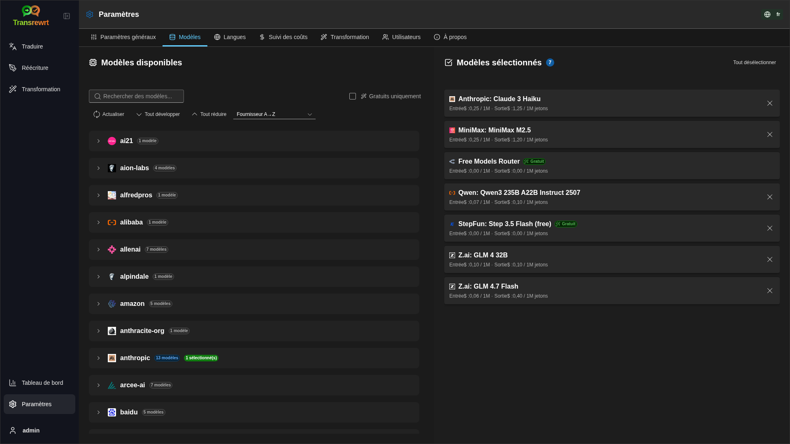

<p align="center">
  
</p>

<p align="center">
  <a href="https://github.com/wsj-br/transrewrt/releases"></a>
  <a href="LICENSE"></a>
  
  
  
</p>

Outil de texte alimenté par l'IA : traduire entre langues, réécrire dans différents styles et transformer avec des prompts personnalisés — en utilisant plusieurs fournisseurs d'IA (OpenRouter, OpenAI, Anthropic, Google Gemini, DeepSeek, Groq, Mistral, xAI et Ollama local). Fonctionne comme une application de bureau (Electron) ou une application web auto-hébergée (Docker).

- **Traduire** — entre des dizaines de langues, avec détection automatique de la langue source
- **Réécriture** — corriger la grammaire, améliorer la clarté, formel/informel, raccourcir, développer, technique
- **Transformation** — prompts IA personnalisés ; créer et gérer des prompts, langue cible facultative par prompt
- **Historique** — historique complet des exécutions avec texte d'entrée/sortie, filtres et exportation
- **Modèles et coût** — choisir des modèles parmi tous les fournisseurs configurés ; tableaux de bord de coût et d'utilisation avec journaux, résumés par modèle/opération/jour
- **Interface utilisateur** — interface multilingue (30+ langues, prise en charge RTL), polices, ...
- **Mode web** — prise en charge multi-utilisateurs avec rôles administrateur
- **Bureau** — application Electron pour Windows et Linux
- **Auto-hébergé** — image Docker pour amd64 et arm64 (prêt pour Raspberry Pi)

Une fois installé, consultez le **[Guide utilisateur](USER-GUIDE.fr.md)** pour une présentation complète de toutes les fonctionnalités.

<small>**Lire dans d'autres langues :** </small>
<small id="lang-list">[English (UK)](../README.md) · [Português (BR)](README.pt-BR.md) · [العربية](README.ar.md) · [বাংলা](README.bn.md) · [Català](README.ca.md) · [简体中文](README.zh-CN.md) · [繁體中文](README.zh-TW.md) · [Hrvatski](README.hr.md) · [Čeština](README.cs.md) · [Nederlands](README.nl.md) · [English (US)](README.en-US.md) · [Filipino](README.tl.md) · [Français](README.fr.md) · [Deutsch](README.de.md) · [Ελληνικά](README.el.md) · [हिन्दी](README.hi.md) · [Magyar](README.hu.md) · [Italiano](README.it.md) · [日本語](README.ja.md) · [Basa Jawa](README.jv.md) · [한국어](README.ko.md) · [Bahasa Melayu](README.ms.md) · [فارسی](README.fa.md) · [Polski](README.pl.md) · [Português (PT)](README.pt.md) · [ਪੰਜਾਬੀ](README.pa.md) · [Română](README.ro.md) · [Русский](README.ru.md) · [Slovenčina](README.sk.md) · [Español](README.es.md) · [Kiswahili](README.sw.md) · [Svenska](README.sv.md) · [తెలుగు](README.te.md) · [ภาษาไทย](README.th.md) · [Türkçe](README.tr.md) · [Українська](README.uk.md) · [Tiếng Việt](README.vi.md)</small>

<small>

> **Remarque concernant les traductions de l'interface et de la documentation :** Toutes les langues de l'interface, à l'exception de l'anglais (Royaume-Uni) d'origine, 
> ont été traduites à l'aide de modèles d'intelligence artificielle ; le texte peut être imprécis ou contenir des erreurs.

</small>

<br/>

<a id="screenshots"></a>
## Captures d'écran

**Sélecteur de langue**


**Traduire**


**Transformation - éditeur de prompt**


**Tableau de bord**


**Historique**


**Paramètres - sélection du modèle**



<br/><br/>

<a id="table-of-contents"></a>
## Table des matières

<!-- START doctoc generated TOC please keep comment here to allow auto update -->
<!-- DON'T EDIT THIS SECTION, INSTEAD RE-RUN doctoc TO UPDATE -->

- [Démarrage rapide](#quick-start)
- [Installation](#installation)
  - [Windows (Electron)](#windows-electron)
  - [Linux (Electron)](#linux-electron)
  - [Docker](#docker)
  - [Configuration du fuseau horaire](#configuring-the-timezone)
- [Obtenir une clé API OpenRouter](#getting-an-openrouter-api-key)
- [Configuration et environnement](#configuration-and-environment)
- [Développement et architecture](#development-and-architecture)
- [Signaler des problèmes](#reporting-issues)
- [Avertissement](#disclaimer)
- [Licence](#license)

<!-- END doctoc generated TOC please keep comment here to allow auto update -->

<br/><br/>

<a id="quick-start"></a>
## Démarrage rapide

**Docker (recommandé pour l'auto-hébergement)**

```bash
docker pull ghcr.io/wsj-br/transrewrt:latest

OPENROUTER_API_KEY=sk-or-your-key docker run -d \
  -p 5000:5000 \
  -v transrewrt-data:/app/data \
  -e OPENROUTER_API_KEY \
  --name transrewrt-web \
  ghcr.io/wsj-br/transrewrt:latest
```

Remplacez `sk-or-your-key` par votre [clé API OpenRouter](https://openrouter.ai/keys) (ou définissez les clés d'autres fournisseurs ; voir [Configuration](#configuration-and-environment)). Ouvrez [http://localhost:5000](http://localhost:5000) et modifiez le mot de passe administrateur par défaut avant d'exposer le service.

<br/>

> ℹ️ **REMARQUE**<br/>
> Dans Docker, les identifiants LLM sont définis via des variables d'environnement telles que `OPENROUTER_API_KEY`, `OPENAI_API_KEY`, `CEREBRAS_API_KEY`, … (et non dans l'interface web). Sur ordinateur (Electron), vous configurez les clés dans **Paramètres → API**.

<br/>

**Windows**

Téléchargez le dernier fichier `Transrewrt Setup x.y.z.exe` depuis [Releases](https://github.com/wsj-br/transrewrt/releases), exécutez l'installateur, puis lancez l'application depuis le menu Démarrer ou le raccourci bureau. Saisissez vos clés API dans **Paramètres → API**. Vous devez configurer au moins un fournisseur ; OpenRouter est courant pour les modèles gratuits.

<br/>

**Linux**

Téléchargez le fichier `.AppImage` correspondant à votre processeur depuis [Releases](https://github.com/wsj-br/transrewrt/releases) (`x64` pour les PC classiques, `arm64` pour de nombreux appareils ARM, y compris Raspberry Pi 4+), puis :

```bash
chmod +x Transrewrt-x.y.z-x64.AppImage && ./Transrewrt-x.y.z-x64.AppImage
```

Saisissez vos clés API dans **Paramètres → API**. Vous devez configurer au moins un fournisseur ; OpenRouter est courant pour les modèles gratuits.

**Messages de la console :** Les versions packagées pour Linux (`x64` et `arm64` AppImages) suppriment les avertissements de dépréciation de Node dans le terminal (par exemple pour le module intégré `punycode`). Si Chromium affiche des erreurs GPU / EGL telles que « GLES3 est non pris en charge », mais que l'application fonctionne, vous pouvez les désactiver en désactivant l'accélération matérielle :

```bash
TRANSREWRT_DISABLE_GPU=1 ./Transrewrt-x.y.z-arm64.AppImage
```

Cela s'applique également sur amd64 ; modifiez le nom du fichier en fonction de votre téléchargement. Consultez [Installation → Linux (Electron)](#linux-electron) pour plus de détails.

Sur Debian/Ubuntu, vous pourriez avoir besoin de bibliothèques **d'exécution** supplémentaires attendues par Chromium (souvent déjà présentes sur les bureaux complets). Utilisez **`libnotify4`** pour les notifications de bureau — **et non** `libnotify-dev` (celui-ci est destiné à la compilation de logiciels, pas à l'exécution de l'AppImage packagée) :

```bash
sudo apt install libgtk-3-0 libnotify4 libnss3 libxss1 libasound2 libxtst6 xauth
```

Les images minimales ou personnalisées peuvent toujours échouer à cause d'un fichier `.so` manquant ; installez le paquet nommé dans l'erreur (extensions fréquentes : `libatk1.0-0`, `libatk-bridge2.0-0`, `libgbm1`, `libdrm2`). Certains environnements nécessitent FUSE pour exécuter les AppImages (par exemple `libfuse2` sur Ubuntu 22.04+), ou utilisez `APPIMAGE_EXTRACT_AND_RUN=1 ./Transrewrt-….AppImage`.

<br/>

> ℹ️ **REMARQUE**<br/>
> macOS n'est actuellement pas pris en charge. Transrewrt est disponible pour Windows, Linux et Docker.

<br/>

Une fois l'application lancée, consultez le **[Guide utilisateur](USER-GUIDE.fr.md)** pour apprendre à traduire, réécrire et transformer du texte, gérer les invites et configurer les modèles.

<br/><br/>

<a id="installation"></a>
## Installation

<a id="windows-electron"></a>
### Windows (Electron)

- Téléchargez le dernier installateur depuis [Releases](https://github.com/wsj-br/transrewrt/releases).
- Exécutez le fichier `.exe` et suivez les instructions de l'installateur.
- Premier lancement : démarrez l'application depuis le menu Démarrer ou le raccourci bureau.

<br/>

> ℹ️ **REMARQUE**<br/>
> Windows peut afficher l'un de ces avertissements de sécurité (normal pour les applications non signées ou indépendantes) :
>   - **Contrôle de compte d'utilisateur (UAC)** : « Voulez-vous autoriser cette application provenant d'un éditeur inconnu à apporter des modifications à votre appareil ? » → Cliquez sur **Oui**.
>   - **Microsoft Defender SmartScreen** : « Windows a protégé votre PC » → Cliquez sur **Plus d'informations** → **Exécuter quand même**.
>
> Cela se produit car l'application n'est pas signée par Microsoft ou un éditeur majeur — elle est sûre si elle est téléchargée depuis nos versions officielles GitHub
>  (vérifiez la somme de contrôle SHA256 ci-dessous).

<br/>

<a id="linux-electron"></a>
### Linux (Electron)

- Téléchargez le fichier `.AppImage` correspondant (`.AppImage` `x64` ou `arm64`) depuis [Releases](https://github.com/wsj-br/transrewrt/releases).
- Exécutez : `chmod +x Transrewrt-x.y.z-x64.AppImage && ./Transrewrt-x.y.z-x64.AppImage` sur x86_64/amd64, ou utilisez le nom de fichier `...-arm64.AppImage` sur ARM64.
- **Bibliothèques système Debian/Ubuntu** (Electron/Chromium ; identiques à [Démarrage rapide → Linux](#quick-start)) : `sudo apt install libgtk-3-0 libnotify4 libnss3 libxss1 libasound2 libxtst6 xauth` — utilisez **`libnotify4`**, pas `libnotify-dev`. Sur les systèmes minimaux, installez toute bibliothèque `.so` manquante signalée dans le terminal ; des composants supplémentaires comme `libatk1.0-0`, `libatk-bridge2.0-0`, `libgbm1`, `libdrm2` sont souvent nécessaires. L'AppImage peut nécessiter `libfuse2` (Ubuntu 22.04+) ou `APPIMAGE_EXTRACT_AND_RUN=1 ./….AppImage`.
- **Messages GPU :** Chromium peut afficher des erreurs d'initialisation GPU ou EGL sur certains systèmes (notamment ARM) ; l'application peut tout de même fonctionner normalement. Pour éviter ces messages, lancez-la avec l'accélération matérielle désactivée : `TRANSREWRT_DISABLE_GPU=1 ./Transrewrt-x.y.z-x64.AppImage` (ou votre nom de fichier `arm64`).

<br/>

<a id="docker"></a>
### Docker

- Récupérez l'image : `docker pull ghcr.io/wsj-br/transrewrt:latest`
- Définissez au moins une clé de fournisseur via l'environnement (par exemple `OPENROUTER_API_KEY` pour OpenRouter). Passez les variables avec `-e` ou via `docker compose` / `.env` afin que les secrets ne soient pas intégrés à l'image.
- Les clés de fournisseur **ne doivent pas** être saisies dans l'interface web ; le serveur les lit depuis l'environnement.

Exemple - volume nommé pour la persistance (clé OpenRouter via variable d'environnement) :

```bash
OPENROUTER_API_KEY=sk-or-your-key docker run -d \
  -p 5000:5000 \
  -v transrewrt-data:/app/data \
  -e OPENROUTER_API_KEY \
  --name transrewrt-web \
  ghcr.io/wsj-br/transrewrt:latest
```

ou si vous préférez utiliser Docker Compose, utilisez :

```
# download the compose file
wget https://github.com/wsj-br/transrewrt/raw/refs/heads/master/production.yml -O transrewrt.yml
# edit the file to add the API_KEYS and adjust the timezone (TZ)
vi transrewrt.yml
# start the container
docker compose -f transrewrt.yml up -d
```

Consultez [Configuration](#configuration-and-environment) pour toutes les variables d'environnement, telles que `PORT`, `CONFIG_PATH`, `TZ` et les clés des modèles linguistiques (LLM) (`OPENROUTER_API_KEY`, `OPENAI_API_KEY`, …).

<a id="configuring-the-timezone"></a>
### Configuration du fuseau horaire

La date et l'heure de l'interface utilisateur suivent le paramètre local et le fuseau horaire du **navigateur**. Pour le comportement côté **serveur** (journalisation, etc.), le conteneur utilise la variable d'environnement `TZ`. La valeur par défaut est `TZ=Europe/London`.

Pour utiliser un autre fuseau horaire, définissez `TZ` dans votre fichier Compose, par exemple :

```yaml
environment:
  - TZ=America/Sao_Paulo
```

Ou passez-la lors de l'exécution du conteneur (Docker) :

```bash
--env TZ=America/Sao_Paulo
```

Sur de nombreux systèmes Linux, vous pouvez copier le nom du fuseau horaire système avec :

```bash
echo TZ=\"$(</etc/timezone)\"
```

Une liste des noms de fuseaux horaires valides est maintenue dans la [base de données tz](https://en.wikipedia.org/wiki/List_of_tz_database_time_zones) (Wikipédia).

<br/><br/>

<a id="getting-an-openrouter-api-key"></a>
## Obtenir une clé API OpenRouter

Transrewrt prend en charge plusieurs fournisseurs d'IA. [OpenRouter](https://openrouter.ai) est un choix populaire car il regroupe de nombreux modèles sous une seule clé et propose des modèles gratuits.

1. Inscrivez-vous ou connectez-vous sur [openrouter.ai](https://openrouter.ai).
2. Accédez à la page [Keys](https://openrouter.ai/keys) et créez une nouvelle clé (nommez-la, et éventuellement fixez une limite de crédit). Vous pouvez utiliser les modèles gratuits sans ajouter de crédit.
3. **Bureau (Electron)** : collez les clés dans **Paramètres → API**. **Docker** : définissez les variables d'environnement telles que `OPENROUTER_API_KEY` (voir [Démarrage rapide](#quick-start)).

N'utilisez pas le modèle **Body Builder** d'OpenRouter ([`openrouter/bodybuilder`](https://openrouter.ai/openrouter/bodybuilder)) pour traduire, réécrire ou transformer : il renvoie des charges utiles JSON, pas le texte finalisé pour ces tâches. Consultez [Paramètres → Modèles](USER-GUIDE.fr.md#models) dans le guide utilisateur.

Vous pouvez également utiliser d'autres fournisseurs (OpenAI, Anthropic, Google Gemini, DeepSeek, Groq, Mistral, xAI, Cerebras) ou exécuter des modèles localement avec [Ollama](https://ollama.com). Consultez [Configuration](#configuration-and-environment) pour la liste complète des fournisseurs pris en charge et des variables d'environnement.

> ⚠️ **AVERTISSEMENT**<br/>
> Si vous utilisez Ollama depuis un autre appareil, conteneur ou service, pensez à configurer Ollama pour autoriser les connexions externes (pas uniquement localhost).

Pour les limites, BYOK et plus encore, consultez [l'authentification OpenRouter](https://openrouter.ai/docs/api/reference/authentication).

<br/><br/>

<a id="configuration-and-environment"></a>
## Configuration et environnement

**Emplacements des fichiers de configuration**

| Déploiement         | Emplacement de la configuration                                   |
| ------------------ | ------------------------------------------------- |
| Electron (Windows) | `%APPDATA%\transrewrt\`                           |
| Electron (Linux)   | `~/.config/transrewrt/`                           |
| Web / Docker       | `/app/data/config.json` (utilisez un volume pour la persistance) |

<br/>

**Variables d'environnement** (web/Docker uniquement ; Electron utilise le fichier de configuration local)

| Variable             | Description                                                                  |
|----------------------|------------------------------------------------------------------------------|
| `PORT`               | Port d'écoute du serveur (par défaut `5000`)                                  |
| `CONFIG_PATH`        | Chemin vers le fichier de configuration (par défaut `/app/data/config.json`) |
| `TZ`                 | Fuseau horaire pour l'heure côté serveur (journaux, etc.) (par défaut `Europe/London`) |
| `OPENROUTER_API_KEY` | Clé API OpenRouter                                                           |
| `OPENAI_API_KEY`     | Clé API OpenAI                                                               |
| `CEREBRAS_API_KEY`   | Clé API Cerebras                                                             |
| `ANTHROPIC_API_KEY`  | Clé API Anthropic                                                            |
| `GOOGLE_API_KEY`     | Clé API Google Gemini                                                        |
| `DEEPSEEK_API_KEY`   | Clé API DeepSeek                                                             |
| `GROQ_API_KEY`       | Clé API Groq                                                                 |
| `MISTRAL_API_KEY`    | Clé API Mistral                                                              |
| `OLLAMA_URL`         | URL de base Ollama (par ex. `http://host.docker.internal:11434`)             |
| `XAI_API_KEY`        | Clé API xAI                                                                  |

Configurez uniquement les fournisseurs que vous utilisez. Les identifiants de modèle sont organisés par espace de noms (`openrouter/…`, `openai/…`, `cerebras/…`, `ollama/…`, etc.).

**Affichage des coûts :** OpenRouter renvoie le coût facturé exact le cas échéant. Les autres fournisseurs utilisent le coût **estimé** basé sur les tarifs publics des modèles OpenRouter lorsqu'une clé OpenRouter est disponible ; sans celle-ci, le coût non-OpenRouter peut s'afficher comme `0`. Les estimations ne constituent pas des factures.

<br/>

**Données et persistance :** Pour Docker, montez un volume sur `/app/data` afin que `config.json` et la base de données SQLite persistent après les redémarrages du conteneur. Sans volume, toutes les données sont perdues lorsque le conteneur s'arrête.

**Développeurs :** Après avoir récupéré des modifications remplaçant l'ancienne configuration à clé unique, réinitialisez ou fusionnez `data/config.json` avec la nouvelle structure par défaut issue de `src/config-defaults/config_default.json`, si votre fichier local utilise encore des champs supprimés (`api_key`, `api_url`, options de proxy).

<br/>

**Authentification web :**

- Administrateur par défaut : `admin` / `transrewrt26`.
- Gérez les utilisateurs dans **Paramètres → Utilisateurs**.
- Réinitialisez un mot de passe : `docker exec <container> reset-web-password '<username>' '<new-password>'`
  (depuis le code source : `pnpm run reset-web-password -- <username> <new-password>`)

<br/>

> ⚠️ **AVERTISSEMENT**<br/>
> Changez immédiatement le mot de passe administrateur par défaut sur tout hôte accessible depuis le réseau.

<br/>

Les paramètres principaux (police, modèles, langues, etc.) sont disponibles dans les **Paramètres** de l'application.

<br/><br/>

<a id="development-and-architecture"></a>
## Développement et architecture

- **Développement :** Installation, build, tests et déploiement (Electron, Web, Docker) - voir **[dev/DEVELOPMENT.md](../dev/DEVELOPMENT.md)**.
- **Architecture et aperçu du système :** Structure des dossiers, pile technologique, décisions de conception - voir **[dev/SYSTEM-OVERVIEW.md](../dev/SYSTEM-OVERVIEW.md)**.

<br/><br/>

<a id="reporting-issues"></a>
## Signalement des problèmes

Ouvrez un problème sur [GitHub](https://github.com/wsj-br/transrewrt/issues). Indiquez votre plateforme (Windows / Linux / Docker) et la version de l'application (affichée dans la boîte de dialogue À propos ou sur la page des versions).

<br/><br/>

<a id="disclaimer"></a>
## Clause de non-responsabilité

Les noms de produits et les icônes appartiennent à leurs propriétaires respectifs et sont utilisés uniquement à des fins d'identification. Ce logiciel n'est ni affilié ni approuvé par aucune des marques mentionnées.

<br/><br/>

<a id="license"></a>
## Licence

Droit d'auteur © 2026 Waldemar Scudeller Jr.

[Apache License 2.0](../LICENSE)
