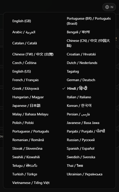
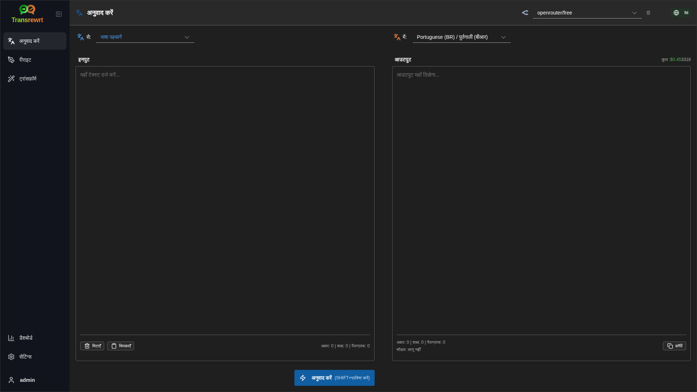
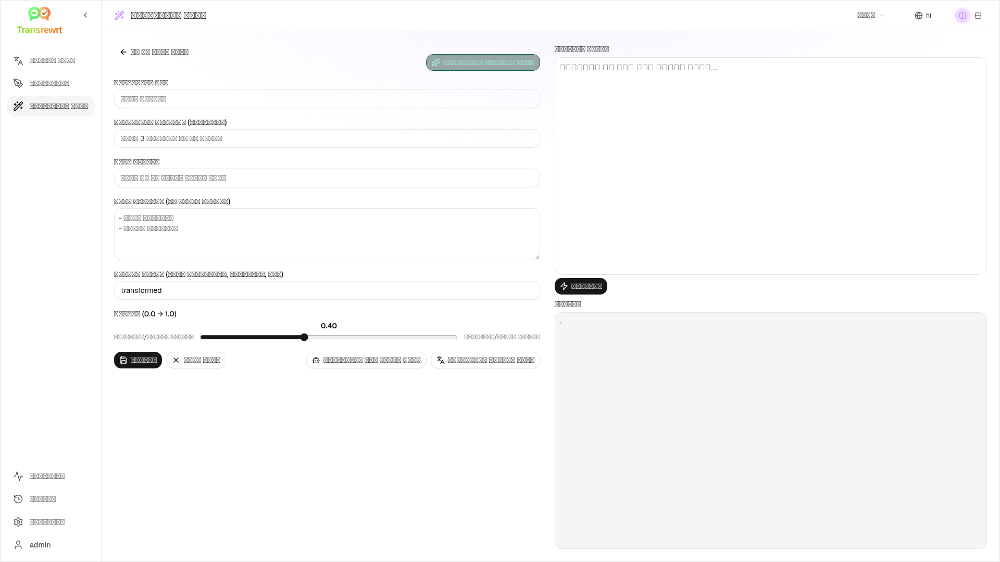
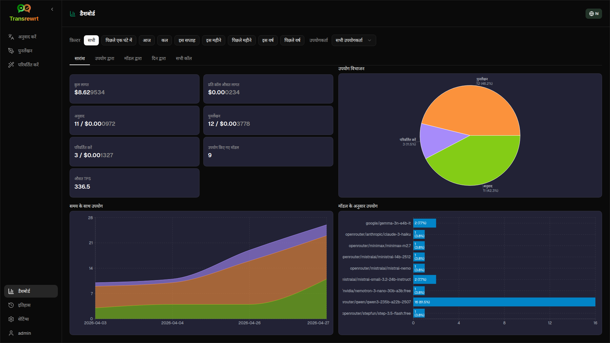
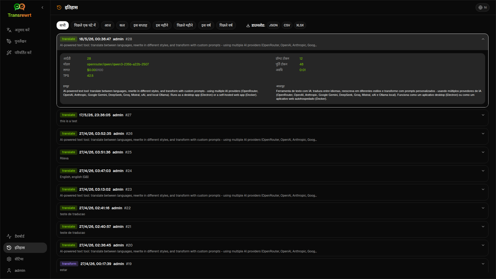
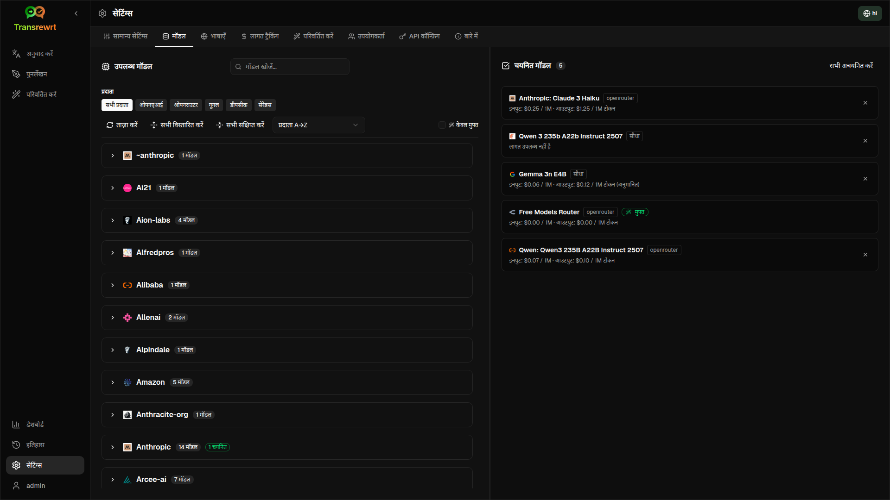

<p align="center">
  
</p>

<p align="center">
  <a href="https://github.com/wsj-br/transrewrt/releases"></a>
  <a href="LICENSE"></a>
  
  
  
</p>

एआई-संचालित पाठ उपकरण: कई एआई प्रदाताओं (OpenRouter, OpenAI, Anthropic, Google Gemini, DeepSeek, Groq, Mistral, xAI, और स्थानीय Ollama) का उपयोग करके भाषाओं के बीच अनुवाद करें, विभिन्न शैलियों में पुनर्लेखन करें, और कस्टम प्रॉम्प्ट के साथ परिवर्तित करें - डेस्कटॉप ऐप (Electron) या स्व-होस्टेड वेब ऐप (Docker) के रूप में चलाएं।

- **अनुवाद करें** - दर्जनों भाषाओं के बीच, स्वचालित स्रोत का पता लगाने के साथ
- **पुनर्लेखन** - व्याकरण ठीक करें, स्पष्टता में सुधार करें, औपचारिक/अनौपचारिक, छोटा करें, विस्तारित करें, तकनीकी
- **परिवर्तित करें** - कस्टम एआई प्रॉम्प्ट; प्रॉम्प्ट बनाएं और प्रबंधित करें, प्रत्येक प्रॉम्प्ट के लिए वैकल्पिक लक्ष्य भाषा
- **इतिहास** - इनपुट/आउटपुट पाठ के साथ पूर्ण निष्पादन इतिहास, फ़िल्टरिंग और निर्यात
- **मॉडल और लागत** - किसी भी कॉन्फ़िगर किए गए प्रदाता से मॉडल चुनें; लॉग के साथ लागत और उपयोग डैशबोर्ड, मॉडल/ऑपरेशन/दिन के अनुसार सारांश
- **यूआई** - बहुभाषी इंटरफ़ेस (30+ भाषाएं, RTL समर्थन), फ़ॉन्ट, ...
- **वेब मोड** - एडमिन भूमिकाओं के साथ बहु-उपयोगकर्ता समर्थन
- **डेस्कटॉप** - विंडोज और लिनक्स के लिए इलेक्ट्रॉन ऐप
- **स्व-होस्टेड** - amd64 और arm64 (रास्पबेरी पाई-तैयार) के लिए डॉकर इमेज

स्थापित होने के बाद, सभी सुविधाओं की पूर्ण जानकारी के लिए [**उपयोगकर्ता गाइड**](USER-GUIDE.hi.md) देखें।

<small>**अन्य भाषाओं में पढ़ें:** </small>
<small id="lang-list">[English (GB)](../README.md) · [Português (Brasil)](./README.pt-BR.md) · [العربية](./README.ar.md) · [বাংলা](./README.bn.md) · [Català](./README.ca.md) · [中文 (中国大陆)](./README.zh-CN.md) · [中文 (台灣)](./README.zh-TW.md) · [Hrvatski](./README.hr.md) · [Čeština](./README.cs.md) · [Nederlands](./README.nl.md) · [English (US)](./README.en-US.md) · [Tagalog](./README.tl.md) · [Français](./README.fr.md) · [Deutsch](./README.de.md) · [Ελληνικά](./README.el.md) · [हिन्दी](./README.hi.md) · [Magyar](./README.hu.md) · [Italiano](./README.it.md) · [日本語](./README.ja.md) · [한국어](./README.ko.md) · [Bahasa Melayu](./README.ms.md) · [فارسی](./README.fa.md) · [Polski](./README.pl.md) · [Basa Jawa](./README.jv.md) · [Português](./README.pt.md) · [ਪੰਜਾਬੀ](./README.pa.md) · [Română](./README.ro.md) · [Русский](./README.ru.md) · [Slovenčina](./README.sk.md) · [Español](./README.es.md) · [Kiswahili](./README.sw.md) · [Svenska](./README.sv.md) · [తెలుగు](./README.te.md) · [ไทย](./README.th.md) · [Türkçe](./README.tr.md) · [Українська](./README.uk.md) · [Tiếng Việt](./README.vi.md)</small>

<small>

> **यूआई और दस्तावेज़ीकरण अनुवाद पर नोट:** मूल अंग्रेजी (यूके) के अलावा सभी इंटरफ़ेस भाषाओं का 
> एआई मॉडल का उपयोग करके अनुवाद किया गया था; शब्दावली अशुद्ध हो सकती है या त्रुटियां शामिल हो सकती हैं।

</small>

<br/>

<a id="table-of-contents"></a>
## विषय सूची

<!-- START doctoc generated TOC please keep comment here to allow auto update -->
<!-- DON'T EDIT THIS SECTION, INSTEAD RE-RUN doctoc TO UPDATE -->

- [स्क्रीनशॉट](#screenshots)
- [त्वरित शुरुआत](#quick-start)
- [ओपनराउटर एपीआई कुंजी प्राप्त करना](#getting-an-openrouter-api-key)
- [कॉन्फ़िगरेशन और वातावरण](#configuration-and-environment)
- [विकास और वास्तुकला](#development-and-architecture)
- [समस्याएँ रिपोर्ट करना](#reporting-issues)
- [अस्वीकरण](#disclaimer)
- [लाइसेंस](#license)

<!-- END doctoc generated TOC please keep comment here to allow auto update -->

<br/><br/>

<a id="screenshots"></a>
## स्क्रीनशॉट

**भाषा चयनकर्ता**



**अनुवाद करें**



**ट्रांसफ़ॉर्म - प्रॉम्प्ट संपादक**



**डैशबोर्ड**



**हिस्ट्री**



**सेटिंग्स - मॉडल चयन**



<br/><br/>

<a id="quick-start"></a>
## त्वरित शुरुआत

<details>
<summary><b>डॉकर (स्व-होस्टिंग के लिए अनुशंसित)</b></summary>

<a id="docker"></a>

<br/>

```bash
docker pull ghcr.io/wsj-br/transrewrt:latest

OPENROUTER_API_KEY=sk-or-your-key docker run -d \
  -p 5000:5000 \
  -v transrewrt-data:/app/data \
  -e OPENROUTER_API_KEY \
  --name transrewrt-web \
  ghcr.io/wsj-br/transrewrt:latest
```

[OpenRouter API कुंजी](https://openrouter.ai/keys) के साथ `sk-or-your-key` को बदलें (या अन्य प्रदाता कुंजियाँ सेट करें; [कॉन्फ़िगरेशन](#configuration-and-environment) देखें)। [http://localhost:5000](http://localhost:5000) खोलें और सेवा को उजागर करने से पहले डिफ़ॉल्ट व्यवस्थापक पासवर्ड बदलें।

पर्यावरण के माध्यम से कम से कम एक प्रदाता कुंजी सेट करें (उदाहरण के लिए OpenRouter के लिए `OPENROUTER_API_KEY`)। `-e` या `docker compose` / `.env` के साथ चर पास करें ताकि गुप्त कुंजियाँ इमेज में न शामिल हों। प्रदाता कुंजियाँ वेब यूआई में **नहीं** दर्ज की जाती हैं; सर्वर उन्हें पर्यावरण से पढ़ता है।

<br/>

> ℹ️ **नोट**<br/>
> डॉकर में, एलएलएम प्रमाणपत्र वातावरण चर जैसे `OPENROUTER_API_KEY`, `OPENAI_API_KEY`, `CEREBRAS_API_KEY`, … के साथ सेट किए जाते हैं (वेब यूआई में नहीं)। डेस्कटॉप (इलेक्ट्रॉन) पर आप **सेटिंग्स → API** में कुंजियाँ कॉन्फ़िगर करते हैं।

<br/>

या डॉकर कंपोज का उपयोग करें:

```bash
# download the compose file
wget https://github.com/wsj-br/transrewrt/raw/refs/heads/master/production.yml -O transrewrt.yml
# Edit the file to add your API keys (API_KEYs), or uncomment and adjust the `.env` file. Set the timezone (TZ) if necessary.
vi transrewrt.yml
# start the container
docker compose -f transrewrt.yml up -d
```

[कॉन्फ़िगरेशन](#configuration-and-environment) में सभी वातावरण चर देखें, जैसे `PORT`, `CONFIG_PATH`, `TZ`, और एलएलएम कुंजियाँ (`OPENROUTER_API_KEY`, `OPENAI_API_KEY`, …)।

</details>

<br/>

<details>
<summary><b>सर्वर समयक्षेत्र (डॉकर)</b></summary>

<a id="configuring-the-timezone"></a>

<br/>

एप्लिकेशन उपयोगकर्ता इंटरफ़ेस की तारीख और समय **ब्राउज़र की** स्थानीय सेटिंग और समयक्षेत्र का अनुसरण करते हैं। **सर्वर-साइड** व्यवहार (लॉगिंग और इसी तरह) के लिए, कंटेनर `TZ` वातावरण चर का उपयोग करता है। डिफ़ॉल्ट `TZ=Europe/London` है।

किसी अन्य समयक्षेत्र का उपयोग करने के लिए, अपनी कंपोज़ फ़ाइल में `TZ` सेट करें, उदाहरण के लिए:

```yaml
environment:
  - TZ=America/Sao_Paulo
```

या कंटेनर चलाते समय (डॉकर) इसे पास करें:

```bash
--env TZ=America/Sao_Paulo
```

कई लिनक्स होस्ट पर आप सिस्टम समयक्षेत्र नाम को इसके साथ कॉपी कर सकते हैं:

```bash
echo TZ=\"$(</etc/timezone)\"
```

मान्य समयक्षेत्र नामों की सूची [tz डेटाबेस](https://en.wikipedia.org/wiki/List_of_tz_database_time_zones) (विकिपीडिया) में बनाए रखी जाती है।

</details>

<br/>

<details>
<summary><b>विंडोज़</b></summary>

<a id="windows-electron"></a>

<br/>

- [रिलीज़](https://github.com/wsj-br/transrewrt/releases) से नवीनतम `Transrewrt Setup x.y.z.exe` डाउनलोड करें।
- `.exe` चलाएं और इंस्टॉलर का अनुसरण करें।
- पहली बार चलाएं: स्टार्ट मेनू या डेस्कटॉप शॉर्टकट से ऐप शुरू करें।
- **सेटिंग्स → API** में अपनी API कुंजियाँ दर्ज करें। आपको कम से कम एक प्रदाता कॉन्फ़िगर करना होगा; मुफ़्त मॉडल के लिए OpenRouter आम है।

<br/>

> ℹ️ **नोट**<br/>
> विंडोज़ इनमें से एक सुरक्षा चेतावनी दिखा सकता है (अनसाइन/स्वतंत्र ऐप्स के लिए सामान्य):
>   - **यूज़र अकाउंट कंट्रोल (UAC)**: "क्या आप अज्ञात प्रकाशक के इस ऐप को अपने डिवाइस पर परिवर्तन करने की अनुमति देना चाहते हैं?" → **हाँ** पर क्लिक करें।
>   - **माइक्रोसॉफ्ट डिफेंडर स्मार्टस्क्रीन**: "विंडोज़ ने आपके पीसी की रक्षा की" → **अधिक जानकारी** पर क्लिक करें → **फिर भी चलाएँ**।
>
> ऐसा इसलिए होता है क्योंकि ऐप माइक्रोसॉफ्ट या किसी प्रमुख प्रकाशक द्वारा साइन नहीं किया गया है—यह सुरक्षित है यदि यह हमारे आधिकारिक GitHub रिलीज़ से डाउनलोड किया गया है (प्रत्येक संसाधन के साथ [रिलीज़](https://github.com/wsj-br/transrewrt/releases) पृष्ठ पर चेकसम सत्यापित करें)।

<br/>

</details>

<br/>

<details>
<summary><b>Linux</b></summary>

<a id="linux-electron"></a>

<br/>

[रिलीज़](https://github.com/wsj-br/transrewrt/releases) से अपने CPU के लिए `.AppImage` डाउनलोड करें (आम पीसी के लिए `x64`, Raspberry Pi 4+ सहित कई ARM डिवाइस के लिए `arm64`), फिर:

```bash
chmod +x Transrewrt-x.y.z-x64.AppImage && ./Transrewrt-x.y.z-x64.AppImage
```

x86_64/amd64 पर `x64` फ़ाइल नाम का उपयोग करें; ARM64 पर `...-arm64.AppImage` नाम का उपयोग करें।

**सेटिंग्स → API** में अपनी API कुंजियाँ दर्ज करें। आपको कम से कम एक प्रदाता को कॉन्फ़िगर करना होगा; मुफ़्त मॉडल के लिए OpenRouter आम है।

**कंसोल संदेश:** पैकेज किए गए लिनक्स बिल्ड (`x64` और `arm64` AppImages) टर्मिनल में नोड अप्रचलन चेतावनियों को दबा देते हैं (उदाहरण के लिए अंतर्निहित `punycode` मॉड्यूल)। यदि क्रोमियम GPU / EGL त्रुटियाँ प्रिंट करता है जैसे कि “GLES3 असमर्थित है” लेकिन ऐप काम करता है, तो आप हार्डवेयर त्वरण को अक्षम करके उन्हें चुप करा सकते हैं:

```bash
TRANSREWRT_DISABLE_GPU=1 ./Transrewrt-x.y.z-arm64.AppImage
```

यह amd64 पर भी लागू होता है; अपने डाउनलोड के अनुसार फ़ाइल नाम बदलें।

Debian/Ubuntu पर, आपको क्रोमियम द्वारा आवश्यक अतिरिक्त **रनटाइम** लाइब्रेरीज़ की आवश्यकता हो सकती है (ये अक्सर पूर्ण डेस्कटॉप स्थापना पर पहले से मौजूद होती हैं)। आवश्यकतानुसार नीचे दिए गए कमांड चलाएँ:

```bash
sudo apt update
sudo apt install -y libfuse2 libgtk-3-0 libnotify4 libnss3 libnspr4 libxss1 libxtst6 xdg-utils \
     xauth libatspi2.0-0 libdrm2 libgbm1 libxcb-dri3-0 libcups2 libasound2t64
```

`arm64` के लिए `libasound2t64` को `libasound2` से बदलें। न्यूनतम या कस्टम स्थापना अभी भी लापता `.so` फ़ाइल के साथ विफल हो सकती है। त्रुटि संदेश में नामित पैकेज स्थापित करें (सामान्य अतिरिक्त: `libatk1.0-0`, `libatk-bridge2.0-0`, `libgbm1`, `libdrm2`)। कुछ वातावरणों में, आपको `APPIMAGE_EXTRACT_AND_RUN=1 ./Transrewrt-….AppImage` का उपयोग करके ऐप चलाने की आवश्यकता हो सकती है।

<br/>

> ℹ️ **नोट**<br/>
> macOS वर्तमान में समर्थित नहीं है। Transrewrt Windows, Linux और Docker के लिए उपलब्ध है।

</details>

<br/>

एप्लिकेशन चलने के बाद, पाठ का अनुवाद कैसे करें, पुनर्लेखन और परिवर्तन कैसे करें, प्रॉम्प्ट प्रबंधित करें और मॉडल कॉन्फ़िगर करें, इसके बारे में जानने के लिए [**उपयोगकर्ता गाइड**](USER-GUIDE.hi.md) देखें।

<br/><br/>

<a id="getting-an-openrouter-api-key"></a>
## OpenRouter API कुंजी प्राप्त करना

Transrewrt कई AI प्रदाताओं का समर्थन करता है। [OpenRouter](https://openrouter.ai) एक लोकप्रिय विकल्प है क्योंकि यह एक कुंजी के तहत कई मॉडल को एकत्रित करता है और मुफ़्त मॉडल प्रदान करता है।

1. [openrouter.ai](https://openrouter.ai) पर साइन अप करें या लॉग इन करें।
2. [कुंजियाँ](https://openrouter.ai/keys) पृष्ठ खोलें और एक नई कुंजी बनाएं (इसका नाम दें, और वैकल्पिक रूप से क्रेडिट सीमा सेट करें)। आप क्रेडिट जोड़े बिना मुफ़्त मॉडल का उपयोग कर सकते हैं।
3. **डेस्कटॉप (इलेक्ट्रॉन):** **सेटिंग्स → API** में कुंजियाँ चिपकाएँ। **डॉकर:** वातावरण चर जैसे `OPENROUTER_API_KEY` सेट करें (देखें [त्वरित शुरुआत](#quick-start))।

अनुवाद करें, पुनर्लेखन करें या ट्रांसफ़ॉर्म करें के लिए OpenRouter के **बॉडी बिल्डर** मॉडल ([`openrouter/bodybuilder`](https://openrouter.ai/openrouter/bodybuilder)) का उपयोग न करें: यह उन कार्यों के लिए पूर्ण पाठ के बजाय JSON अनुरोध पेलोड लौटाता है। उपयोगकर्ता गाइड में [सेटिंग्स → मॉडल](USER-GUIDE.hi.md#models) देखें।

आप अन्य प्रदाताओं (OpenAI, Anthropic, Google Gemini, DeepSeek, Groq, Mistral, xAI, Cerebras) का भी उपयोग कर सकते हैं या [Ollama](https://ollama.com) के साथ स्थानीय रूप से मॉडल चला सकते हैं। समर्थित प्रदाताओं और वातावरण चरों की पूर्ण सूची के लिए [कॉन्फ़िगरेशन](#configuration-and-environment) देखें।

</br>

> ⚠️ **चेतावनी**<br/>
> यदि आप दूसरे डिवाइस, कंटेनर या सेवा से Ollama का उपयोग कर रहे हैं, तो बाहरी कनेक्शन की अनुमति देने के लिए Ollama को कॉन्फ़िगर करना याद रखें (केवल लोकलहोस्ट नहीं)।

<br/><br/>

<a id="configuration-and-environment"></a>
## कॉन्फ़िगरेशन और वातावरण

</br>

**कॉन्फ़िग फ़ाइल के स्थान**

| तैनाती | कॉन्फ़िग स्थान |
| ------------------ | ------------------------------------------------- |
| इलेक्ट्रॉन (विंडोज) | `%APPDATA%\transrewrt\` |
| इलेक्ट्रॉन (लिनक्स) | `~/.config/transrewrt/` |
| वेब / डॉकर | `/app/data/config.json` (स्थायी रखने के लिए एक वॉल्यूम का उपयोग करें) |

<br/>

**पर्यावरण चर** (केवल वेब/डॉकर; इलेक्ट्रॉन स्थानीय कॉन्फ़िग फ़ाइल का उपयोग करता है)

| चर | विवरण |
|----------------------|------------------------------------------------------------------------------|
| `PORT` | सर्वर सुनने का पोर्ट (डिफ़ॉल्ट `5000` पर) |
| `CONFIG_PATH`        | कॉन्फ़िग फ़ाइल का मार्ग (डिफ़ॉल्ट `/app/data/config.json` है)                |
| `TZ` | सर्वर-साइड समय के लिए समयक्षेत्र (लॉगिंग, आदि) (डिफ़ॉल्ट `Europe/London` पर) |
| `HISTORY_DISABLED`   | इतिहास के निष्पादन को अक्षम करें (वैकल्पिक, डिफ़ॉल्ट रूप से `false` होता है) |
| `OPENROUTER_API_KEY` | ओपनराउटर एपीआई कुंजी |
| `OPENAI_API_KEY` | ओपनएआई एपीआई कुंजी |
| `CEREBRAS_API_KEY` | सेरेब्रस एपीआई कुंजी |
| `ANTHROPIC_API_KEY` | एंथ्रोपिक एपीआई कुंजी |
| `GOOGLE_API_KEY` | गूगल जेमिनी एपीआई कुंजी |
| `DEEPSEEK_API_KEY` | डीपसीक एपीआई कुंजी |
| `GROQ_API_KEY` | ग्रॉक एपीआई कुंजी |
| `MISTRAL_API_KEY` | मिस्ट्रल एपीआई कुंजी |
| `OLLAMA_URL` | ओलामा बेस यूआरएल (उदाहरण के लिए `http://host.docker.internal:11434`) |
| `XAI_API_KEY`        | xAI API कुंजी                                                                  |

**गोपनीयता मोड:** `config.json` या उपयोगकर्ता की पसंद के बावजूद इतिहास के ट्रैक को अक्षम करने के लिए, **वेब/Docker सर्वर प्रक्रिया** और/या **इलेक्ट्रॉन डेस्कटॉप मुख्य प्रक्रिया** के लिए `HISTORY_DISABLED` को `true` या `1` (केस-असंवेदनशील) पर सेट करें (उदाहरण के लिए सिस्टम या लॉन्चर वातावरण — केवल रेंडरर नहीं)। इससे इनपुट/आउटपुट इतिहास को संग्रहीत करना अक्षम हो जाता है, **सेटिंग्स → सामान्य सेटिंग्स → इतिहास** लॉक हो जाता है, और इतिहास से संबंधित API अवरुद्ध हो जाते हैं।

केवल उन प्रदाताओं को कॉन्फ़िगर करें जिनका आप उपयोग करते हैं। मॉडल आईडी नामस्थानित हैं (`openrouter/…`, `openai/…`, `cerebras/…`, `ollama/…`, आदि)।

**लागत प्रदर्शन:** OpenRouter उपयुक्त होने पर ठीक बिल की गई लागत लौटाता है। अन्य प्रदाता तब तक **अनुमानित** लागत का उपयोग करते हैं जब तक OpenRouter की कुंजी उपलब्ध हो, जो OpenRouter की सार्वजनिक मॉडल मूल्य नीति से ली गई होती है; बिना कुंजी के, गैर-OpenRouter लागत `0` के रूप में दिख सकती है। अनुमान बिल नहीं होते हैं।

<br/>

**डेटा और स्थायित्व:** डॉकर के लिए, `/app/data` पर एक वॉल्यूम माउंट करें ताकि `config.json` और SQLite डेटाबेस कंटेनर पुनः आरंभ के दौरान बने रहें। बिना वॉल्यूम के, कंटेनर रुकने पर सभी डेटा खो जाता है।

<br/>

**वेब प्रमाणीकरण:**

- डिफ़ॉल्ट व्यवस्थापक: `admin` / `transrewrt26`।
- **सेटिंग्स → उपयोगकर्ता** में उपयोगकर्ताओं का प्रबंधन करें।
- पासवर्ड रीसेट करें: `docker exec <container> reset-web-password '<username>' '<new-password>'`

<br/>

> ⚠️ **चेतावनी**<br/>
> किसी भी नेटवर्क-एक्सेसिबल होस्ट पर डिफ़ॉल्ट व्यवस्थापक पासवर्ड तुरंत बदलें।

<br/>

कुंजी सेटिंग्स (फ़ॉन्ट, मॉडल, भाषाएँ, आदि) एप्लिकेशन सेटिंग्स में उपलब्ध हैं।

<br/><br/>

<a id="development-and-architecture"></a>
## विकास और आर्किटेक्चर

- **विकास:** सेटअप, बिल्ड, परीक्षण और तैनाती (इलेक्ट्रॉन, वेब, डॉकर) - देखें [dev/DEVELOPMENT.md](../dev/DEVELOPMENT.md)।
- **वास्तुकला और प्रणाली का अवलोकन:** फ़ोल्डर संरचना, तकनीकी स्टैक, डिज़ाइन निर्णय - देखें [dev/SYSTEM-OVERVIEW.md](../dev/SYSTEM-OVERVIEW.md)।

<br/><br/>

<a id="reporting-issues"></a>
## मुद्दों की रिपोर्टिंग

[GitHub](https://github.com/wsj-br/transrewrt/issues) पर एक मुद्दा खोलें। अपने प्लेटफ़ॉर्म (विंडोज़ / लिनक्स / डॉकर) और ऐप संस्करण (परिचय डायलॉग में या रिलीज़ पृष्ठ पर दिखाया गया) शामिल करें।

<br/><br/>

<a id="disclaimer"></a>
## अस्वीकरण

उत्पाद नाम और आइकन उनके संबंधित स्वामियों के हैं और केवल पहचान उद्देश्यों के लिए उपयोग किए गए हैं। यह सॉफ़्टवेयर उल्लिखित किसी भी ब्रांड से संबद्ध या समर्थित नहीं है।

<br/><br/>

<a id="license"></a>
## लाइसेंस

कॉपीराइट © 2026 वाल्डेमार स्कूडेलर जूनियर।

[Apache License 2.0](../LICENSE)
