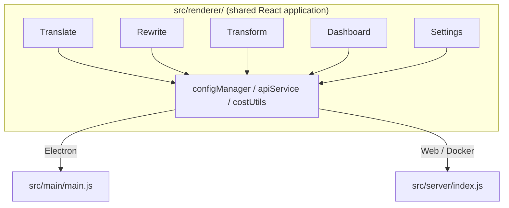

<p align="center">
  
</p>

<h1 align="center">Transrewrt</h1>

<p align="center">
  <a href="https://github.com/wsj-br/transrewrt/releases"></a>
  <a href="LICENSE"></a>
  
  
  
</p>

AI-संचालित पाठ कोश: भाषाओं के बीच अनुवाद करें, विभिन्न शैलियों में पुनर्लिखित करें, और कस्टम प्रॉम्प्ट्स के साथ परिवर्तित करें - सब [OpenRouter](https://openrouter.ai) के माध्यम से। डेस्कटॉप ऐप (Electron) या स्व-होस्ट किए गए वेब ऐप (Docker) के रूप में चलता है।

- **अनुवाद करें** - दर्जनों भाषाओं के बीच, स्वतः स्रोत पहचान के साथ
- **पुनर्लिखित करें** - व्याकरण ठीक करें, स्पष्टता बढ़ाएं, औपचारिक/अनौपचारिक, छोटा करें, विस्तार करें, तकनीकी
- **परिवर्तित करें** - कस्टम AI प्रॉम्प्ट्स; प्रॉम्प्ट्स बनाएं और प्रबंधित करें, प्रत्येक प्रॉम्प्ट के लिए वैकल्पिक लक्ष्य भाषा
- **मॉडल और लागत** - किसी भी OpenRouter मॉडल का चयन करें; SQLite लॉग के साथ लागत डैशबोर्ड, मॉडल/कार्य/दिन के अनुसार सारांश
- **उपयोगकर्ता इंटरफ़ेस** - i18n (pt-BR, de, fr, es, RTL), थीम, फ़ॉन्ट्स, कीबोर्ड शॉर्टकट; सुरक्षित वेब मोड (सर्वर पर ही API कुंजी)
- **डेस्कटॉप** - Windows और Linux के लिए Electron ऐप
- **स्व-होस्ट किया गया** - amd64 और arm64 के लिए Docker इमेज (Raspberry Pi तैयार)

एक बार इंस्टॉल हो जाने के बाद, सभी विशेषताओं के पूर्ण मार्गदर्शन के लिए **[उपयोगकर्ता गाइड](../USER-GUIDE.md)** देखें।

<small>**अन्य भाषाओं में पढ़ें:** [अंग्रेज़ी (UK)](../README.md) · [पुर्तगाली (BR)](README.pt-BR.md) · [अरबी](README.ar.md) · [बंगाली](README.bn.md) · [कैटलन](README.ca.md) · [सरल चीनी](README.zh-CN.md) · [पारंपरिक चीनी](README.zh-TW.md) · [क्रोएशियाई](README.hr.md) · [चेक](README.cs.md) · [डच](README.nl.md) · [अंग्रेज़ी (US)](README.en-US.md) · [फिलिपीनो](README.tl.md) · [फ्रेंच](README.fr.md) · [जर्मन](README.de.md) · [ग्रीक](README.el.md) · [हिंदी](README.hi.md) · [हंगेरियन](README.hu.md) · [इतालवी](README.it.md) · [जापानी](README.ja.md) · [जवानीज़](README.jv.md) · [कोरियाई](README.ko.md) · [मलय](README.ms.md) · [पर्शिया/फारसी](README.fa.md) · [पोलिश](README.pl.md) · [पुर्तगाली (PT)](README.pt.md) · [पंजाबी](README.pa.md) · [रोमानियन](README.ro.md) · [रूसी](README.ru.md) · [स्लोवाक](README.sk.md) · [स्पेनिश](README.es.md) · [स्वाहिली](README.sw.md) · [स्वीडिश](README.sv.md) · [तेलुगू](README.te.md) · [थाई](README.th.md) · [तुर्की](README.tr.md) · [युक्रेनियन](README.uk.md) · [वियतनामी](README.vi.md)</small>

<a id="screenshots"></a>
## स्क्रीनशॉट

**भाषा चुनने वाला**


**अनुवाद**


**परिवर्तन - प्रॉम्प्ट संपादक**


**डैशबोर्ड**


**सेटिंग्स - मॉडल चयन**


<br /><br />

<a id="table-of-contents"></a>
## सामग्री सूची

<!-- START doctoc generated TOC please keep comment here to allow auto update -->
<!-- DON'T EDIT THIS SECTION, INSTEAD RE-RUN doctoc TO UPDATE -->

- [त्वरित प्रारंभ](#quick-start)
- [इंस्टॉलेशन](#installation)
  - [विंडोज़ (Electron)](#windows-electron)
  - [लिनक्स (Electron)](#linux-electron)
  - [Docker](#docker)
- [OpenRouter API कुंजी प्राप्त करना](#getting-an-openrouter-api-key)
- [कॉन्फ़िगरेशन और वातावरण](#configuration-and-environment)
- [विकास और आर्कीटेक्चर](#development-and-architecture)
- [रिलीज़ और टैग](#releases-and-tags)
- [योगदान](#contributing)
- [अस्वीकरण](#disclaimer)
- [लाइसेंस](#license)

<!-- END doctoc generated TOC please keep comment here to allow auto update -->

<br /><br />

<a id="quick-start"></a>

## त्वरित प्रारंभ

**Docker (स्व-होस्टिंग के लिए अनुशंसित)**

```bash
docker pull ghcr.io/wsj-br/transrewrt:latest

API_KEY=sk-or-your-key docker run -d \
  -p 5000:5000 \
  -v transrewrt-data:/app/data \
  -e API_KEY \
  --name transrewrt-web \
  ghcr.io/wsj-br/transrewrt:latest
```

अपने `sk-or-your-key` को अपने [OpenRouter API कुंजी](https://openrouter.ai/keys) से बदलें। [http://localhost:5000](http://localhost:5000) खोलें और सेवा को प्रकाशित करने से पहले डिफ़ॉल्ट व्यवस्थापक पासवर्ड बदलें।

<br />

> ℹ️ **नोट**<br/>
> डॉकर में OpenRouter API कुंजी केवल `API_KEY` पर्यावरण चर (वेब UI में नहीं) के माध्यम से सेट की जाती है। डेस्कटॉप (Electron) पर आप इसे **सेटिंग्स → API** में पेस्ट करते हैं।

<br />

**Windows**

सबसे नया `Transrewrt Setup x.y.z.exe` [रिलीज़](https://github.com/wsj-br/transrewrt/releases) से डाउनलोड करें, इंस्टॉलर चलाएं, फिर स्टार्ट मेन्यू या डेस्कटॉप शॉर्टकट से शुरू करें। अपनी OpenRouter API कुंजी **सेटिंग्स → API** में दर्ज करें।

<br />

**Linux**

`.AppImage` [रिलीज़](https://github.com/wsj-br/transrewrt/releases) से डाउनलोड करें, फिर:

```bash
chmod +x Transrewrt-x.y.z.AppImage && ./Transrewrt-x.y.z.AppImage
```

अपनी OpenRouter API कुंजी **सेटिंग्स → API** में दर्ज करें। Debian/Ubuntu पर आपको पहले अतिरिक्त निर्भरताएं इंस्टॉल करनी आ सकती हैं:

```bash
sudo apt install libgtk-3-0 libnotify-dev libnss3 libxss1 libasound2 libxtst6 xauth
```

विवरण के लिए [स्थापन → Linux](#linux-electron) देखें।

<br />

> ℹ️ **नोट**<br/>
> macOS वर्तमान में समर्थित नहीं है। Transrewrt Windows, Linux, और Docker के लिए उपलब्ध है।

<br />

एक बार ऐप चलने के बाद, **[उपयोगकर्ता गाइड](../USER-GUIDE.md)** देखें ताकि आप पाठ का अनुवाद, पुनलेखन, और परिवर्तन कैसे करें, प्रॉम्प्ट प्रबंधन करें, और मॉडल कॉन्फ़िगर करें सीख सकें।

<br /><br />

<a id="installation"></a>
## स्थापन

<a id="windows-electron"></a>
### Windows (Electron)

- सबसे नया इंस्टॉलर [रिलीज़](https://github.com/wsj-br/transrewrt/releases) से डाउनलोड करें।
- `.exe` चलाएं और इंस्टॉलर का पालन करें।
- पहली बार चलाना: ऐप को स्टार्ट मेन्यू या डेस्कटॉप शॉर्टकट से शुरू करें। कॉन्फ़िग `%APPDATA%\transrewrt\` में संग्रहीत होता है।

<br />

<a id="linux-electron"></a>
### Linux (Electron)

- `.AppImage` [रिलीज़](https://github.com/wsj-br/transrewrt/releases) से डाउनलोड करें।
- चलाएं: `chmod +x Transrewrt-x.y.z.AppImage && ./Transrewrt-x.y.z.AppImage`
- अतिरिक्त निर्भरताएं (Debian/Ubuntu): `sudo apt install libgtk-3-0 libnotify-dev libnss3 libxss1 libasound2 libxtst6 xauth`
- अधिक जानने के लिए [dev/DEVELOPMENT.md](../dev/DEVELOPMENT.md) देखें।

<br />

<a id="docker"></a>
### Docker

- Pull: `docker pull ghcr.io/wsj-br/transrewrt:latest`
- OpenRouter API कुंजी को `API_KEY` पर्यावरण चर के माध्यम से सेट करना **आवश्यक** है। इसे `-e API_KEY` (या `docker compose` / `.env` के माध्यम से) पास करें ताकि कुंजी प्रक्रिया सूची में दिखाई न दे।
- API कुंजी को वेब UI में दर्ज नहीं किया जा सकता।

उदाहरण - स्थिरता के लिए नामकृत वॉल्यूम (API कुंजी env के माध्यम से पास की गई, कमांड लाइन में नहीं):

```bash
API_KEY=sk-or-your-key docker run -d \
  -p 5000:5000 \
  -v transrewrt-data:/app/data \
  -e API_KEY \
  --name transrewrt-web \
  ghcr.io/wsj-br/transrewrt:latest
```

<br />

| विकल्प   | विवरण                                                                                                   |
| -------- | ------------------------------------------------------------------------------------------------------------- |
| पोर्ट     | `5000` (`-p 5000:5000` के साथ मैप)                                                                              |
| वॉल्यूम   | कॉन्फ़िग और डेटाबेस स्थिरता के लिए `/app/data` माउंट करें                                                         |
| पर्यावरण चर | `PORT`, `CONFIG_PATH`, `API_KEY`, `API_URL`, `KEY_SEED` - [कॉन्फ़िगरेशन](#configuration-and-environment) देखें |

सोर्स से बिल्ड और रन करने के लिए: `docker compose up --build -d` या `pnpm run docker:up` - [dev/DEVELOPMENT.md](../dev/DEVELOPMENT.md) देखें।

<br /><br />

<a id="getting-an-openrouter-api-key"></a>
## OpenRouter API कुंजी प्राप्त करना

Transrewrt [OpenRouter](https://openrouter.ai) का उपयोग AI मॉडलों के लिए करता है। आपको पाठ का अनुवाद, पुनलेखन, या परिवर्तन करने के लिए एक API कुंजी की आवश्यकता है।

1. [openrouter.ai](https://openrouter.ai) पर साइन अप करें या लॉग इन करें।
2. [कुंजियाँ](https://openrouter.ai/keys) पेज खोलें और एक नई कुंजी बनाएं (इसे नाम दें, और वैकल्पिक रूप से क्रेडिट लिमिट सेट करें)। आप क्रेडिट जोड़े बिना फ्री मॉडल्स का उपयोग कर सकते हैं।
3. **डेस्कटॉप (Electron):** कुंजी को **सेटिंग्स → API** में पेस्ट करें। **डॉकर:** `API_KEY` पर्यावरण चर सेट करें (देखें [त्वरित प्रारंभ](#quick-start))।

सीमाओं, BYOK, और अधिक के लिए, [OpenRouter प्रमाणीकरण](https://openrouter.ai/docs/api/reference/authentication) देखें।

<br /><br />

<a id="configuration-and-environment"></a>

## कॉन्फ़िगरेशन और पर्यावरण

**कॉन्फ़िग फ़ाइल स्थान**

| डिप्लॉयमेंट         | कॉन्फ़िग स्थान                                   |
| ------------------ | ------------------------------------------------- |
| इलेक्ट्रॉन (विंडोज़) | `%APPDATA%\transrewrt\`                           |
| इलेक्ट्रॉन (लिनक्स)   | `~/.config/transrewrt/`                           |
| वेब / डॉकर       | `/app/data/config.json` (स्थिरता के लिए वॉल्यूम का उपयोग करें) |

<br />

**पर्यावरण वैरिएबल्स** (वेब/डॉकर के लिए; इलेक्ट्रॉन स्थानीय कॉन्फ़िग फ़ाइल का उपयोग करता है)

| वैरिएबल      | डिफ़ॉल्ट                        | विवरण                                                   |
| ------------- | ------------------------------ | ------------------------------------------------------------- |
| `PORT`        | `5000`                         | सर्वर सुनने वाला पोर्ट                                         |
| `CONFIG_PATH` | `/app/data/config.json`        | कॉन्फ़िग फ़ाइल का पाथ                                       |
| `API_KEY`     | *(खाली)*                      | OpenRouter API कुंजी (डॉकर के लिए आवश्यक; UI के माध्यम से नहीं, env के माध्यम से सेट करें) |
| `API_URL`     | `https://openrouter.ai/api/v1` | अपस्ट्रीम AI API बेस URL                                      |
| `KEY_SEED`    | *(खाली)*                      | Transrewrt प्रॉक्सी कुंजी सीड (सेट होने पर कॉन्फ़िग को ओवरराइड करता है)           |

<br />

**डेटा और स्थिरता:** डॉकर के लिए, कंटेनर रिस्टार्ट के बीच `config.json` और SQLite डेटाबेस को स्थिर रखने के लिए `/app/data` पर एक वॉल्यूम माउंट करें। बिना वॉल्यूम के, जब कंटेनर रुकता है तो सभी डेटा खो जाता है।

<br />

**वेब प्रमाणीकरण:**

- डिफ़ॉल्ट एडमिन: `admin` / `transrewrt26`.
- **सेटिंग्स → उपयोगकर्ता** में उपयोगकर्ताओं का प्रबंधन करें।
- पासवर्ड रीसेट करें: `docker exec <container> reset-web-password '<username>' '<new-password>'`
  (सोर्स से: `pnpm run reset-web-password -- <username> <new-password>`)

<br />

> ⚠️ **चेतावनी**<br/>
> नेटवर्क-accessible होस्ट पर तुरंत डिफ़ॉल्ट एडमिन पासवर्ड बदलें।

<br />

**Transrewrt प्रॉक्सी (वैकल्पिक):** आप API ट्रैफिक को एक समय-आधारित रोलिंग कुंजी वाले बाहरी प्रॉक्सी के माध्यम से रूट कर सकते हैं। **सेटिंग्स → API** में, **Transrewrt प्रॉक्सी का उपयोग करें** को सक्षम करें, **की सीड** सेट करें, और **API URL** को प्रॉक्सी बेस URL पर सेट करें। विवरण के लिए [dev/SYSTEM-OVERVIEW.md](../dev/SYSTEM-OVERVIEW.md) देखें।

थीम, फ़ॉन्ट, मॉडल, भाषा आदि की सेटिंग्स सेटिंग्स डायलॉग में उपलब्ध हैं या सीधे कॉन्फ़िग JSON में संपादित की जा सकती हैं। पूरी सूची और डिफ़ॉल्ट [dev/DEVELOPMENT.md](../dev/DEVELOPMENT.md) में दस्तावेज़ूकृत हैं।

<br /><br />

<a id="development-and-architecture"></a>
## डेवलपमेंट और आर्किटेक्चर

- **डेवलपमेंट:** सेटअप, बिल्ड, टेस्ट, और डिप्लॉय (इलेक्ट्रॉन, वेब, डॉकर) - **[dev/DEVELOPMENT.md](../dev/DEVELOPMENT.md)** देखें।
- **आर्किटेक्चर और सिस्टम ओवरव्यू:** फ़ोल्डर संरचना, टेक स्टैक, डिज़ाइन निर्णय, Transrewrt प्रॉक्सी - **[dev/SYSTEM-OVERVIEW.md](../dev/SYSTEM-OVERVIEW.md)** देखें।



<br /><br />

<a id="releases-and-tags"></a>
## रिलीज़ और टैग

- **Git टैग** `v`* (जैसे `v1.0.10`) [रिलीज़ वर्कफ्लो](.github/workflows/release.yml) को ट्रिगर करते हैं। **GitHub रिलीज़** विंडोज़ इंस्टॉलर (`.exe`) और लिनक्स AppImage को अटैच करते हैं।
- **डॉकर इमेज** `ghcr.io/wsj-br/transrewrt` पर पब्लिश होते हैं। इमेज टैग Git वर्जन से मैच करते हैं (जैसे `v1.0.10` → `ghcr.io/wsj-br/transrewrt:1.0.10`) साथ में `latest`। मल्टी-आर्क: `linux/amd64` और `linux/arm64` (जैसे Raspberry Pi)।

<br /><br />

<a id="contributing"></a>
## योगदान

1. रिपॉज़िटरी को फ़ॉर्क करें।
2. एक फ़ीचर ब्रांच बनाएं: `git checkout -b feature/my-feature`
3. अपने बदलावों को साफ़ संदेश के साथ कमिट करें।
4. `main` के खिलाफ पुश करें और एक पुल रिक्वेस्ट खोलें।

के साथ-साथ मौजूदा कोड स्टाइल का पालन करें और सबमिट करने से पहले अपने बदलावों को इलेक्ट्रॉन और वेब मोड दोनों में टेस्ट करें। बिल्ड और टेस्ट निर्देशों के लिए [dev/DEVELOPMENT.md](../dev/DEVELOPMENT.md) देखें।

<br />

**समस्या रिपोर्टिंग:** [GitHub](https://github.com/wsj-br/transrewrt/issues) पर एक इश्यू खोलें। अपने प्लेटफ़ॉर्म (विंडोज़ / लिनक्स / डॉकर) और ऐप वर्जन (एबाउट डायलॉग या रिलीज़ पेज पर दिखाई देता है) शामिल करें।

<br /><br />

<a id="disclaimer"></a>

## अस्वीकरण

उत्पाद नाम और आइकन अपने संबंधित मालिकों की संपत्ति हैं और केवल पहचानने के उद्देश्य से प्रयोग किए जाते हैं। यह सॉफ़्टवेयर किसी भी उल्लिखित ब्रांड से संबंधित या उनके द्वारा समर्थित नहीं है।

<br /><br />

<a id="license"></a>
## लाइसेंस

कॉपीराइट © 2026 Waldemar Scudeller Jr.

[Apache License 2.0](LICENSE)