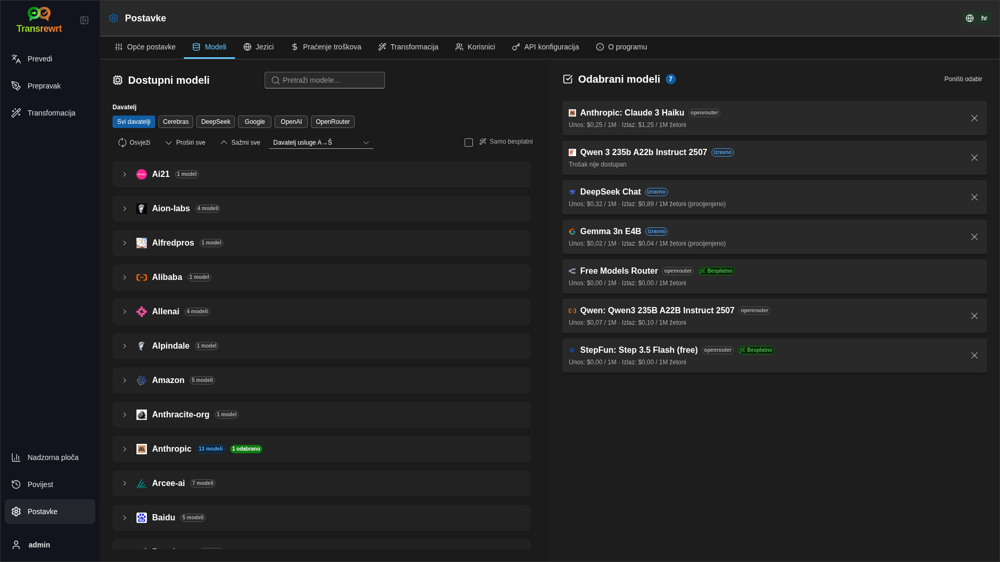

<p align="center">
  
</p>

<h1 align="center">Transrewrt</h1>

<p align="center">
  <a href="https://github.com/wsj-br/transrewrt/releases"></a>
  <a href="LICENSE"></a>
  
  
  
</p>

Alatom napajani alat za tekst: prijevod između jezika, prepisivanje u različitim stilovima i transformacija pomoću prilagođenih upita — koristeći više AI pružatelja usluga (OpenRouter, OpenAI, Anthropic, Google Gemini, DeepSeek, Groq, Mistral, xAI i lokalni Ollama). Funkcionira kao aplikacija za računalo (Electron) ili samostalna internetska aplikacija (Docker).

- **Prijevod** — između desetak jezika, s automatskim prepoznavanjem izvornog jezika
- **Prepisivanje** — ispravljanje gramatike, poboljšanje jasnoće, formalni/neformalni stil, skraćivanje, proširivanje, tehnički sadržaj
- **Transformacija** — prilagođeni AI upiti; stvaranje i upravljanje upitima, opcionalni ciljni jezik po upitu
- **Povijest** — potpuna povijest izvršavanja sa ulaznim/izlaznim tekstom, filtriranjem i mogućnošću izvoza
- **Modeli i troškovi** — odabir modela iz bilo kojeg konfiguriranog davatelja usluga; nadzorne ploče za troškove i korištenje s dnevnim zapisima i sažetkom po modelu/operaciji/danu
- **Korisnički sučelje** — višejezično sučelje (30+ jezika, podrška za RTL), fontovi, ...
- **Web način** — podrška za više korisnika s administratorskim ulogama
- **Računalo** — Electron aplikacija za Windows i Linux
- **Samopuštanje** — Docker slika za amd64 & arm64 (spremna za Raspberry Pi)

Nakon instalacije, pogledajte **[Vodič za korisnike](USER-GUIDE.hr.md)** za potpuni prikaz svih značajki.

<small>**Pročitajte na drugim jezicima:** [English (UK)](README.hr.md) · [Português (BR)](README.pt-BR.md) · [العربية](README.ar.md) · [বাংলা](README.bn.md) · [Català](README.ca.md) · [简体中文](README.zh-CN.md) · [繁體中文](README.zh-TW.md) · [Hrvatski](README.hr.md) · [Čeština](README.cs.md) · [Nederlands](README.nl.md) · [English (US)](README.en-US.md) · [Filipino](README.tl.md) · [Français](README.fr.md) · [Deutsch](README.de.md) · [Ελληνικά](README.el.md) · [हिन्दी](README.hi.md) · [Magyar](README.hu.md) · [Italiano](README.it.md) · [日本語](README.ja.md) · [Basa Jawa](README.jv.md) · [한국어](README.ko.md) · [Bahasa Melayu](README.ms.md) · [فارسی](README.fa.md) · [Polski](README.pl.md) · [Português (PT)](README.pt.md) · [ਪੰਜਾਬੀ](README.pa.md) · [Română](README.ro.md) · [Русский](README.ru.md) · [Slovenčina](README.sk.md) · [Español](README.es.md) · [Kiswahili](README.sw.md) · [Svenska](README.sv.md) · [తెలుగు](README.te.md) · [ภาษาไทย](README.th.md) · [Türkçe](README.tr.md) · [Українська](README.uk.md) · [Tiếng Việt](README.vi.md)</small>

<small>

> **Napomena o prijevodima sučelja i dokumentacije:** Svi prijevodi sučelja, osim izvornog engleskog (UK), 
> izvršeni su pomoću AI modela; formulacije mogu biti neprecizne ili sadržavati pogreške.

</small>

<br/>

<a id="screenshots"></a>
## Snimke zaslona

**Odabir jezika**


**Prijevod**


**Transformacija – uređivač upita**


**Nadzorna ploča**


**Povijest**


**Postavke – odabir modela**



<br/><br/>

<a id="table-of-contents"></a>

## Sadržaj

<!-- START doctoc generated TOC please keep comment here to allow auto update -->
<!-- DON'T EDIT THIS SECTION, INSTEAD RE-RUN doctoc TO UPDATE -->


- [Brzi početak](#quick-start)
- [Instalacija](#installation)
  - [Windows (Electron)](#windows-electron)
  - [Linux (Electron)](#linux-electron)
  - [Docker](#docker)
- [Kako dobiti OpenRouter API ključ](#getting-an-openrouter-api-key)
- [Konfiguracija i okolina](#configuration-and-environment)
- [Razvoj i arhitektura](#development-and-architecture)
- [Objave i oznake](#releases-and-tags)
- [Doprinošenje](#contributing)
- [Odricanje odgovornosti](#disclaimer)
- [Licenca](#license)

<!-- END doctoc generated TOC please keep comment here to allow auto update -->

<br/><br/>

<a id="quick-start"></a>
## Brzi početak

**Docker (preporučeno za samostalno hostovanje)**

```bash
docker pull ghcr.io/wsj-br/transrewrt:latest

OPENROUTER_KEY=sk-or-your-key docker run -d \
  -p 5000:5000 \
  -v transrewrt-data:/app/data \
  -e OPENROUTER_KEY \
  --name transrewrt-web \
  ghcr.io/wsj-br/transrewrt:latest
```

Zamijenite `sk-or-your-key` s vašim [OpenRouter API ključem](https://openrouter.ai/keys) (ili postavite ključeve drugih davatelja usluga; pogledajte [Konfiguracija](#configuration-and-environment)). Otvorite [http://localhost:5000](http://localhost:5000) i promijenite zadanu administratorsku lozinku prije otvaranja usluge.

<br/>

> ℹ️ **NAPOMENA**<br/>
> U Dockeru se vjerodajnice za LLM postavljaju putem varijabli okoline poput `OPENROUTER_KEY`, `OPENAI_KEY`, `CEREBRAS_KEY`, … (ne putem web sučelja). Na desktopu (Electron) konfigurirate ključe u dijelu **Postavke → API**.

<br/>

**Windows**

Preuzmite najnoviju datoteku `Transrewrt Setup x.y.z.exe` s [Objava](https://github.com/wsj-br/transrewrt/releases), pokrenite instalacijski program, a zatim pokrenite aplikaciju preko izbornika Start ili prečaca na radnoj površini. Unesite svoje API ključeve u **Postavke → API**. Potrebno je konfigurirati barem jednog davatelja usluge; OpenRouter je čest izbor za besplatne modele.

<br/>

**Linux**

Preuzmite `.AppImage` datoteku za svoj procesor s [Objava](https://github.com/wsj-br/transrewrt/releases) (`x64` za tipična računala, `arm64` za većinu ARM uređaja, uključujući Raspberry Pi 4+), zatim:

```bash
chmod +x Transrewrt-x.y.z-x64.AppImage && ./Transrewrt-x.y.z-x64.AppImage
```

Unesite svoje API ključeve u **Postavke → API**. Potrebno je konfigurirati barem jednog davatelja usluge; OpenRouter je čest izbor za besplatne modele.

Na Debian/Ubuntu sustavima možda ćete prvo morati instalirati dodatne ovisnosti:

```bash
sudo apt install libgtk-3-0 libnotify-dev libnss3 libxss1 libasound2 libxtst6 xauth
```

Pogledajte [Instalacija → Linux](#linux-electron) za više pojedinosti.

<br/>

> ℹ️ **NAPOMENA**<br/>
> Trenutno nije podržan macOS. Transrewrt je dostupan za Windows, Linux i Docker.

<br/>

Kada je aplikacija pokrenuta, pogledajte **[Vodič za korisnike](USER-GUIDE.hr.md)** da biste naučili kako prevoditi, prepisivati i transformirati tekst, upravljati upitima i konfigurirati modele.

<br/><br/>

<a id="installation"></a>
## Instalacija

<a id="windows-electron"></a>
### Windows (Electron)

- Preuzmite najnoviji instalacijski program s [Objava](https://github.com/wsj-br/transrewrt/releases).
- Pokrenite `.exe` datoteku i slijedite upute instalacijskog vodiča.
- Prvi pokret: pokrenite aplikaciju preko izbornika Start ili prečaca na radnoj površini.

<br/>

<a id="linux-electron"></a>
### Linux (Electron)

- Preuzmite odgovarajuću `.AppImage` datoteku (`x64` ili `arm64`) s [Objava](https://github.com/wsj-br/transrewrt/releases).
- Pokrenite: `chmod +x Transrewrt-x.y.z-x64.AppImage && ./Transrewrt-x.y.z-x64.AppImage` na x86_64/amd64 sustavima, ili koristite naziv datoteke `...-arm64.AppImage` na ARM64 sustavima.
- Dodatne ovisnosti (Debian/Ubuntu): `sudo apt install libgtk-3-0 libnotify-dev libnss3 libxss1 libasound2 libxtst6 xauth`
- Pogledajte [dev/DEVELOPMENT.md](../dev/DEVELOPMENT.md) za više informacija.

<br/>

<a id="docker"></a>
### Docker

- Preuzimanje: `docker pull ghcr.io/wsj-br/transrewrt:latest`
- Postavite barem jedan ključ davatelja usluge putem okoliša (npr. `OPENROUTER_KEY` za OpenRouter). Prijenos varijabli putem `-e` ili `docker compose` / `.env` osigurava da tajne nisu uklesane u sliku.
- Ključevi davatelja usluga **ne** unose se kroz web sučelje; poslužitelj ih čita iz okoline.

Primjer – imenovani volumen za trajnost (OpenRouter ključ preko env):

```bash
OPENROUTER_KEY=sk-or-your-key docker run -d \
  -p 5000:5000 \
  -v transrewrt-data:/app/data \
  -e OPENROUTER_KEY \
  --name transrewrt-web \
  ghcr.io/wsj-br/transrewrt:latest
```

<br/>

| Opcija   | Opis                                                                                                   |
| -------- | ------------------------------------------------------------------------------------------------------------- |
| Port     | `5000` (mapiranje s `-p 5000:5000`)                                                                              |
| Volumen  | Montirajte `/app/data` za trajnost konfiguracije i baze podataka                                                         |
| Var. okoline | `PORT`, `CONFIG_PATH`, uz ključeve za LLM (`OPENROUTER_KEY`, `OPENAI_KEY`, …) - pogledajte [Konfiguracija](#configuration-and-environment) |

Gradnja i pokretanje iz izvornog kôda: `docker compose up --build -d` ili `pnpm docker:up` - pogledajte [dev/DEVELOPMENT.md](../dev/DEVELOPMENT.md).

<br/><br/>

<a id="getting-an-openrouter-api-key"></a>

## Dohvaćanje OpenRouter API ključa

Transrewrt podržava više AI davatelja usluga. [OpenRouter](https://openrouter.ai) popularan je izbor jer grupira mnoge modele pod jednim ključem i nudi besplatne modele.

1. Registrirajte se ili prijavite na [openrouter.ai](https://openrouter.ai).
2. Otvorite stranicu [Keys](https://openrouter.ai/keys) i kreirajte novi ključ (dodijelite mu naziv i po želji postavite ograničenje kredita). Besplatne modele možete koristiti bez dodavanja kredita.
3. **Radna površina (Electron):** zalijepite ključeve u **Postavke → API**. **Docker:** postavite varijable okruženja poput `OPENROUTER_KEY` (pogledajte [Brzi početak](#quick-start)).

Nemojte koristiti OpenRouterov model **Body Builder** ([`openrouter/bodybuilder`](https://openrouter.ai/openrouter/bodybuilder)) za prevođenje, prepisivanje ili transformaciju: on vraća JSON zahtjeve s tijelom, a ne gotove tekstove za te zadatke. Pogledajte [Postavke → Modeli](USER-GUIDE.hr.md#models) u Priručniku za korisnike.

Također možete koristiti i druge davatelje usluga (OpenAI, Anthropic, Google Gemini, DeepSeek, Groq, Mistral, xAI, Cerebras) ili pokretati modele lokalno s [Ollama](https://ollama.com). Pogledajte [Konfiguracija](#configuration-and-environment) za potpun popis podržanih davatelja i varijabli okruženja.

> ⚠️ **UPOZORENJE**<br/>
> Ako koristite Ollama s drugog uređaja, kontejnera ili usluge, ne zaboravite konfigurirati Ollama da dopušta vanjske veze (ne samo lokalni host).

Za ograničenja, BYOK i više informacija, pogledajte [OpenRouter autentifikacija](https://openrouter.ai/docs/api/reference/authentication).

<br/><br/>

<a id="configuration-and-environment"></a>
## Konfiguracija i okruženje

**Lokacije konfiguracijskih datoteka**

| Implementacija      | Lokacija konfiguracije                         |
| ------------------ | ------------------------------------------------- |
| Electron (Windows) | `%APPDATA%\transrewrt\`                           |
| Electron (Linux)   | `~/.config/transrewrt/`                           |
| Web / Docker       | `/app/data/config.json` (koristite volumen za trajnost) |

<br/>

**Varijable okruženja** (samo web/Docker; Electron koristi lokalnu konfiguracijsku datoteku)

| Varijabla          | Zadano                  | Opis |
| ---------------- | ----------------------- | ----------- |
| `PORT`           | `5000`                  | Priključak na kojem sluša poslužitelj |
| `CONFIG_PATH`    | `/app/data/config.json` | Put do konfiguracijske datoteke |
| `OPENROUTER_KEY` | *(prazno)*               | OpenRouter API ključ |
| `OPENAI_KEY`     | *(prazno)*               | OpenAI API ključ |
| `CEREBRAS_KEY`   | *(prazno)*               | Cerebras API ključ |
| `ANTHROPIC_KEY`  | *(prazno)*               | Anthropic API ključ |
| `GOOGLE_KEY`     | *(prazno)*               | Google Gemini API ključ |
| `DEEPSEEK_KEY`   | *(prazno)*               | DeepSeek API ključ |
| `GROQ_KEY`       | *(prazno)*               | Groq API ključ |
| `MISTRAL_KEY`    | *(prazno)*               | Mistral API ključ |
| `OLLAMA_URL`     | *(prazno)*               | Osnovni URL Ollame (npr. `http://host.docker.internal:11434`) |
| `XAI_KEY`        | *(prazno)*               | xAI API ključ |

Konfigurirajte samo davatelje koji koristite. ID-ovi modela imaju imenski prostor (`openrouter/…`, `openai/…`, `cerebras/…`, `ollama/…`, itd.).

**Prikaz troškova:** OpenRouter vraća točan naplaćeni iznos kad god je moguće. Ostali davatelji koriste **procijenjene** troškove od javnih cijena modela OpenRoutera ako je dostupan OpenRouter ključ; bez njega, troškovi za davatelje osim OpenRoutera mogu biti prikazani kao `0`. Procjene nisu računi.

<br/>

**Podaci i trajnost:** Za Docker, pričvrstite volumen na `/app/data` kako bi `config.json` i SQLite baza podataka ostali sačuvani i nakon ponovnog pokretanja kontejnera. Bez volumena, svi podaci će biti izgubljeni kada se kontejner zaustavi.

**Programeri:** Nakon preuzimanja promjena koje zamjenjuju staru jednostavnu konfiguraciju s jednim ključem, vrati ili spoji `data/config.json` s novim zadanim oblikom iz `src/config-defaults/config_default.json` ako vaša lokalna datoteka i dalje koristi uklonjena polja (`api_key`, `api_url`, opcije proxyja).

<br/>

**Web autentifikacija:**

- Zadani administrator: `admin` / `transrewrt26`.
- Upravljanje korisnicima u **Postavke → Korisnici**.
- Ponovno postavljanje lozinke: `docker exec <kontejner> reset-web-password '<korisničko_ime>' '<nova_lozinka>'`
  (iz izvora: `pnpm run reset-web-password -- <korisničko_ime> <nova_lozinka>`)

<br/>

> ⚠️ **UPOZORENJE**<br/>
> Odmah promijenite zadane administratorske lozinke na bilo kojem poslužitelju dostupnom putem mreže.

<br/>

Osnovne postavke (font, modeli, jezici, itd.) dostupne su u aplikaciji u Postavkama.

<br/><br/>

<a id="development-and-architecture"></a>

## Razvoj i arhitektura

- **Razvoj:** Postavljanje, izgradnja, testiranje i implementacija (Elektron, Web, Docker) - pogledajte **[dev/DEVELOPMENT.md](../dev/DEVELOPMENT.md)**.
- **Pregled arhitekture i sustava:** Struktura mapa, tehnološki stack, dizajnerske odluke - pogledajte **[dev/SYSTEM-OVERVIEW.md](../dev/SYSTEM-OVERVIEW.md)**.

<br/><br/>

<a id="releases-and-tags"></a>
## Izdavanja i oznake

- **Git oznake** `v`* (npr. `v1.0.10`) pokreću [tijek rada za izdavanje](.github/workflows/release.yml). **GitHub objave** prilažu instalacijsku datoteku za Windows (`.exe`) i Linux AppImages (**x64** i **arm64**).
- **Docker slike** objavljuju se na `ghcr.io/wsj-br/transrewrt`. Oznake slika odgovaraju Git verziji (npr. `v1.0.10` → `ghcr.io/wsj-br/transrewrt:1.0.10`) te je dostupna i oznaka `latest`. Višestruka arhitektura: `linux/amd64` i `linux/arm64` (npr. Raspberry Pi).

<br/><br/>

<a id="contributing"></a>
## Suradnja

1. Učinite forku spremišta.
2. Stvorite granu za funkcionalnost: `git checkout -b feature/my-feature`
3. Zapisujte promjene s jasnim porukama.
4. Poslati promjene i otvorite Zahtjev za spajanje (Pull Request) prema `main`.

Molimo pridržavajte se postojećeg stil skoda i testirajte svoje promjene u both Elektron i web modu prije slanja. Pogledajte [dev/DEVELOPMENT.md](../dev/DEVELOPMENT.md) za upute o izgradnji i testiranju.

<br/>

**Prijavljanje problema:** Otvorite problem na [GitHubu](https://github.com/wsj-br/transrewrt/issues). Navodite svoju platformu (Windows / Linux / Docker) te verziju aplikacije (prikazano u prozoru "O programu" ili na stranici objava).

<br/><br/>

<a id="disclaimer"></a>
## Odricanje odgovornosti

Imena proizvoda i ikone pripadaju svojim vlasnicima i koriste se isključivo u svrhe identifikacije. Ovaj softver nije povezan niti odobren od strane bilo kojih navedenih brendova.

<br/><br/>

<a id="license"></a>
## Licenca

Autorska prava © 2026 Waldemar Scudeller Jr.

[Apache Licenca 2.0](LICENSE)