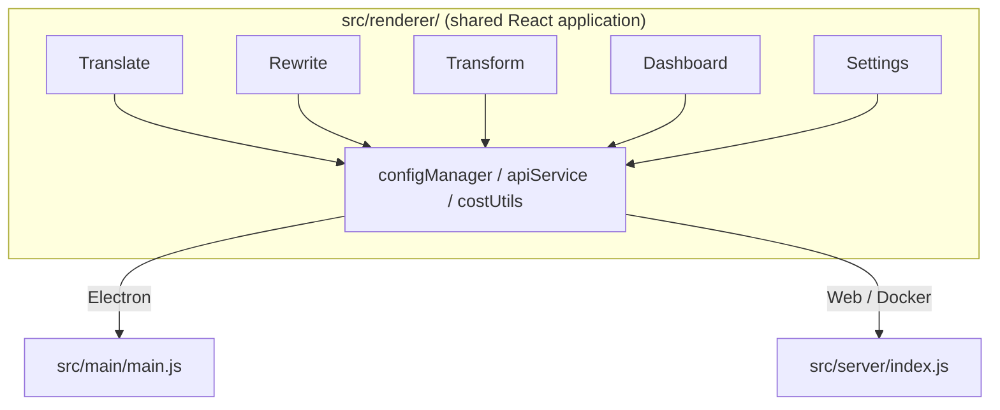

<p align="center">
  
</p>

<h1 align="center">Transrewrt</h1>

<p align="center">
  <a href="https://github.com/wsj-br/transrewrt/releases"></a>
  <a href="LICENSE"></a>
  
  
  
</p>

AI-powered tekstualni alat: prevodi između jezika, prepisuje u različitim stilovima i transformira pomoću prilagođenih uputa – sve putem [OpenRouter](https://openrouter.ai). Radi kao laptop aplikacija (Electron) ili samostojeća web aplikacija (Docker).

- **Prevodi** – između desetaka jezika, s automatskim otkrivanjem izvornog jezika
- **Prepisuje** – popravlja gramatiku, poboljšava jasnoću, formalno/neformalno, skraćuje, proširuje, tehnički
- **Transformira** – prilagođene AI upute; stvaranje i upravljanje uputama, opcionalni ciljni jezik po uputi
- **Modeli i troškovi** – odabir bilo kojeg OpenRouter modela; kontrolni panel troškova s SQLite logom, sažetaka po modelu/operaciji/danu
- **Korisničko sučelje** – i18n (pt-BR, de, fr, es, RTL), teme, fontovi, tipkovni prečaci; siguran web način (API ključ samo na poslužitelju)
- **Laptop** – Electron aplikacija za Windows i Linux
- **Samostojeće** – Docker slika za amd64 & arm64 (Raspberry Pi spreman)

Nakon instalacije, pogledajte **[Korisničko uputstvo](../USER-GUIDE.md)** za potpuno vođenje kroz sve značajke.

<small>**Pročitajte na drugim jezicima:** [English (UK)](../README.md) · [Português (BR)](README.pt-BR.md) · [العربية](README.ar.md) · [বাংলা](README.bn.md) · [Català](README.ca.md) · [简体中文](README.zh-CN.md) · [繁體中文](README.zh-TW.md) · [Hrvatski](README.hr.md) · [Čeština](README.cs.md) · [Nederlands](README.nl.md) · [English (US)](README.en-US.md) · [Filipino](README.tl.md) · [Français](README.fr.md) · [Deutsch](README.de.md) · [Ελληνικά](README.el.md) · [हिन्दी](README.hi.md) · [Magyar](README.hu.md) · [Italiano](README.it.md) · [日本語](README.ja.md) · [Basa Jawa](README.jv.md) · [한국어](README.ko.md) · [Bahasa Melayu](README.ms.md) · [فارسی](README.fa.md) · [Polski](README.pl.md) · [Português (PT)](README.pt.md) · [ਪੰਜਾਬੀ](README.pa.md) · [Română](README.ro.md) · [Русский](README.ru.md) · [Slovenčina](README.sk.md) · [Español](README.es.md) · [Kiswahili](README.sw.md) · [Svenska](README.sv.md) · [తెలుగు](README.te.md) · [ภาษาไทย](README.th.md) · [Türkçe](README.tr.md) · [Українська](README.uk.md) · [Tiếng Việt](README.vi.md)</small>

<a id="screenshots"></a>
## Slike

**Odabir jezika**


**Prevod**


**Transformacija – uređivač uputa**


**Kontrolni panel**


**Postavke – odabir modela**


<br /><br />

<a id="table-of-contents"></a>
## Tablica sadržaja

<!-- START doctoc generated TOC please keep comment here to allow auto update -->
<!-- DON'T EDIT THIS SECTION, INSTEAD RE-RUN doctoc TO UPDATE -->

- [Brzi početak](#quick-start)
- [Instalacija](#installation)
  - [Windows (Electron)](#windows-electron)
  - [Linux (Electron)](#linux-electron)
  - [Docker](#docker)
- [Dobivanje OpenRouter API ključa](#getting-an-openrouter-api-key)
- [Konfiguracija i okolina](#configuration-and-environment)
- [Razvoj i arhitektura](#development-and-architecture)
- [Izdanja i oznake](#releases-and-tags)
- [Doprinjenje](#contributing)
- [Odricanje od odgovornosti](#disclaimer)
- [Licenca](#license)

<!-- END doctoc generated TOC please keep comment here to allow auto update -->

<br /><br />

<a id="quick-start"></a>

## Brz početak

**Docker (preporučeno za samostalno hostanje)**

```bash
docker pull ghcr.io/wsj-br/transrewrt:latest

API_KEY=sk-or-your-key docker run -d \
  -p 5000:5000 \
  -v transrewrt-data:/app/data \
  -e API_KEY \
  --name transrewrt-web \
  ghcr.io/wsj-br/transrewrt:latest
```

Zamijenite `sk-or-your-key` svojim [OpenRouter API ključem](https://openrouter.ai/keys). Otvorite [http://localhost:5000](http://localhost:5000) i promijenite zadanu admin lozinku prije izlaganja servisa.

<br />

> ℹ️ **NAPOMENA**<br/>
> U Dockeru se OpenRouter API ključ postavlja samo putem varijable okruženja `API_KEY` (ne u web korisničkom interfejsu). Na desktopu (Electron) ga zalijepite u **Postavke → API**.

<br />

**Windows**

Preuzmite najnoviju `Transrewrt Setup x.y.z.exe` s [Izdanja](https://github.com/wsj-br/transrewrt/releases), pokrenite instalacijski program, zatim pokrenite iz Start izbornika ili prečaca na radnoj površini. Unesite svoj OpenRouter API ključ u **Postavke → API**.

<br />

**Linux**

Preuzmite `.AppImage` s [Izdanja](https://github.com/wsj-br/transrewrt/releases), zatim:

```bash
chmod +x Transrewrt-x.y.z.AppImage && ./Transrewrt-x.y.z.AppImage
```

Unesite svoj OpenRouter API ključ u **Postavke → API**. Na Debianu/Ubuntu možda ćete prvo trebati instalirati dodatne ovisnosti:

```bash
sudo apt install libgtk-3-0 libnotify-dev libnss3 libxss1 libasound2 libxtst6 xauth
```

Pogledajte [Instalacija → Linux](#linux-electron) za detalje.

<br />

> ℹ️ **NAPOMENA**<br/>
> macOS trenutno nije podržan. Transrewrt je dostupan za Windows, Linux i Docker.

<br />

Jednom kada je aplikacija pokrenuta, pogledajte **[Korisnički vodič](../USER-GUIDE.md)** kako biste naučili prevoditi, prepisivati i transformirati tekst, upravljati upitima i konfigurirati modele.

<br /><br />

<a id="installation"></a>
## Instalacija

<a id="windows-electron"></a>
### Windows (Electron)

- Preuzmite najnoviju instalaciju s [Izdanja](https://github.com/wsj-br/transrewrt/releases).
- Pokrenite `.exe` i slijedite instalacijski program.
- Prvo pokretanje: pokrenite aplikaciju iz Start izbornika ili prečaca na radnoj površini. Konfiguracija je spremljena u `%APPDATA%\transrewrt\`.

<br />

<a id="linux-electron"></a>
### Linux (Electron)

- Preuzmite `.AppImage` s [Izdanja](https://github.com/wsj-br/transrewrt/releases).
- Pokrenite: `chmod +x Transrewrt-x.y.z.AppImage && ./Transrewrt-x.y.z.AppImage`
- Dodatne ovisnosti (Debian/Ubuntu): `sudo apt install libgtk-3-0 libnotify-dev libnss3 libxss1 libasound2 libxtst6 xauth`
- Pogledajte [dev/DEVELOPMENT.md](../dev/DEVELOPMENT.md) za više.

<br />

<a id="docker"></a>
### Docker

- Povuci: `docker pull ghcr.io/wsj-br/transrewrt:latest`
- OpenRouter API ključ **mora** biti postavljen putem varijable okruženja `API_KEY`. Proslijedite ga s `-e API_KEY` (ili preko `docker compose` / `.env`) tako da ključ nije vidljiv u listi procesa.
- API ključ ne može biti unesen u web korisničkom interfejsu.

Primjer - imenovani volume za trajnost (API ključ proslijeđen putem env, ne u komandnoj liniji):

```bash
API_KEY=sk-or-your-key docker run -d \
  -p 5000:5000 \
  -v transrewrt-data:/app/data \
  -e API_KEY \
  --name transrewrt-web \
  ghcr.io/wsj-br/transrewrt:latest
```

<br />

| Opcija   | Opis |
| -------- | ---- |
| Port     | `5000` (mapiraj s `-p 5000:5000`) |
| Volume   | Montiraj `/app/data` za konfiguraciju i trajnost baze podataka |
| Varijable okruženja | `PORT`, `CONFIG_PATH`, `API_KEY`, `API_URL`, `KEY_SEED` - pogledajte [Konfiguracija](#configuration-and-environment) |

Za izgradnju i pokretanje iz izvornog koda: `docker compose up --build -d` ili `pnpm run docker:up` - pogledajte [dev/DEVELOPMENT.md](../dev/DEVELOPMENT.md).

<br /><br />

<a id="getting-an-openrouter-api-key"></a>
## Dobivanje OpenRouter API ključa

Transrewrt koristi [OpenRouter](https://openrouter.ai) za AI modele. Treba vam API ključ za prevodjenje, prepisivanje ili transformaciju teksta.

1. Prijavite se ili ulogirajte se na [openrouter.ai](https://openrouter.ai).
2. Otvorite stranicu [Ključevi](https://openrouter.ai/keys) i napravite novi ključ (dajte mu ime i po mogućstvu postavite limit kredita). Možete koristiti besplatne modele bez dodavanja kredita.
3. **Desktop (Electron):** zalijepite ključ u **Postavke → API**. **Docker:** postavite varijablu okruženja `API_KEY` (vidi [Brz početak](#quick-start)).

Za limiete, BYOK i više, pogledajte [OpenRouter autentifikaciju](https://openrouter.ai/docs/api/reference/authentication).

<br /><br />

<a id="configuration-and-environment"></a>

## Konfiguracija i okolina

**Lokacije konfiguracijske datoteke**

| Deployment         | Lokacija konfiguracije                                   |
| ------------------ | -------------------------------------------------------- |
| Electron (Windows) | `%APPDATA%\transrewrt\`                                  |
| Electron (Linux)   | `~/.config/transrewrt/`                                  |
| Web / Docker       | `/app/data/config.json` (koristite volume za trajnost) |

<br />

**Varijable okoline** (samo za Web/Docker; Electron koristi lokalnu konfiguracijsku datoteku)

| Varijabla     | Default                       | Opis                                                          |
| ------------- | ----------------------------- | ------------------------------------------------------------- |
| `PORT`        | `5000`                        | Port na kojem server osluškuje                                |
| `CONFIG_PATH` | `/app/data/config.json`       | Putanja do konfiguracijske datoteke                          |
| `API_KEY`     | *(prazno)*                    | OpenRouter API ključ (potreban za Docker; postavite putem okoline, ne UI) |
| `API_URL`     | `https://openrouter.ai/api/v1` | Osnovni URL upstream AI API-ja                               |
| `KEY_SEED`    | *(prazno)*                    | Transrewrt proxy ključni seed (premošćuje config ako je postavljen) |

<br />

**Podaci i trajnost:** Za Docker, montirajte volume na `/app/data` kako bi `config.json` i SQLite baza podataka ostale spremljeni nakon restarta kontejnera. Bez volume-a, svi podaci će biti izgubljeni kada se kontejner zaustavi.

<br />

**Web autentifikacija:**

- Zadani admin: `admin` / `transrewrt26`.
- Upravljanje korisnicima u **Postavke → Korisnici**.
| Resetiranje lozinke: `docker exec <kontejner> reset-web-password '<korisnik>' '<nova-lozinka>'`
  (iz izvora: `pnpm run reset-web-password -- <korisnik> <nova-lozinka>`)

<br />

> ⚠️ **UPOZORENJE**<br/>
> Odmah promijenite zadanu administratorsku lozinku na bilo kojem host-u dostupnom u mreži.

<br />

**Transrewrt proxy (opcionalno):** Možete usmjeriti API promet kroz vanjski proxy koji koristi vremenski ključ za rotaciju. U **Postavke → API**, omogućite **Koristi Transrewrt Proxy**, postavite **Ključni seed** i postavite **API URL** na osnovni URL proxy-ja. Detalje vidite u [dev/SYSTEM-OVERVIEW.md](../dev/SYSTEM-OVERVIEW.md).

Ključne postavke (tema, font, modeli, jezici, itd.) dostupne su u dijalogu Postavke ili se mogu izravno urediti u JSON configu. Potpuni popis i zadane vrijednosti dokumentirani su u [dev/DEVELOPMENT.md](../dev/DEVELOPMENT.md).

<br /><br />

<a id="development-and-architecture"></a>
## Razvoj i arhitektura

- **Razvoj:** Postavljanje, build, testiranje i deployment (Electron, Web, Docker) - pogledajte **[dev/DEVELOPMENT.md](../dev/DEVELOPMENT.md)**.
- **Arhitektura i pregled sustava:** Struktura foldera, tehnološki stack, dizajnerske odluke, Transrewrt proxy - pogledajte **[dev/SYSTEM-OVERVIEW.md](../dev/SYSTEM-OVERVIEW.md)**.



<br /><br />

<a id="releases-and-tags"></a>
## Izlazi i oznake

- **Git oznake** `v`* (npr. `v1.0.10`) pokreću [radnju izlaza](.github/workflows/release.yml). **GitHub Izlazi** prilažu Windows installer (`.exe`) i Linux AppImage.
- **Docker slike** se objavljuju na `ghcr.io/wsj-br/transrewrt`. Oznake slika odgovaraju Git verziji (npr. `v1.0.10` → `ghcr.io/wsj-br/transrewrt:1.0.10`) plus `latest`. Multi-arhitektura: `linux/amd64` i `linux/arm64` (npr. Raspberry Pi).

<br /><br />

<a id="contributing"></a>
## Doprinošenje

1. Forkajte repozitorij.
2. Stvorite granu za novu značajku: `git checkout -b feature/my-feature`
3. Commitajte vaše promjene s jasnom porukom.
4. Push i otvorite Pull Request protiv `main`.

Molim slijedite postojeći stil koda i testirajte vaše promjene u i Electron i web modu prije predavanja. Instrukcije za build i testiranje pogledajte u [dev/DEVELOPMENT.md](../dev/DEVELOPMENT.md).

<br />

**Prijavljivanje problema:** Otvorite problem na [GitHub](https://github.com/wsj-br/transrewrt/issues). Uključite vašu platformu (Windows / Linux / Docker) i verziju aplikacije (prikazanu u dijalogu O aplikaciji ili na stranici Izlaza).

<br /><br />

<a id="disclaimer"></a>

## Odricanje od odgovornosti

Nazivi proizvoda i ikone pripadaju njihovim vlasnicima i koriste se samo za identifikacijske svrhe. Ova softverska aplikacija nije povezana niti odobrena od strane bilo kojeg od navedenih brendova.

<br /><br />

<a id="license"></a>
## Licenca

Copyright © 2026 Waldemar Scudeller Jr.

[Apache Licenca 2.0](LICENSE)