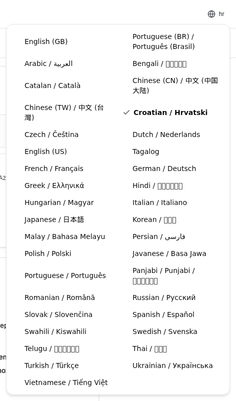
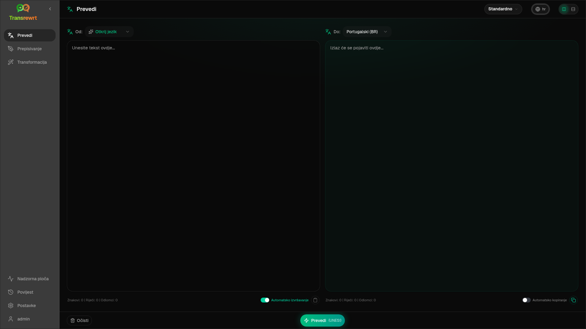
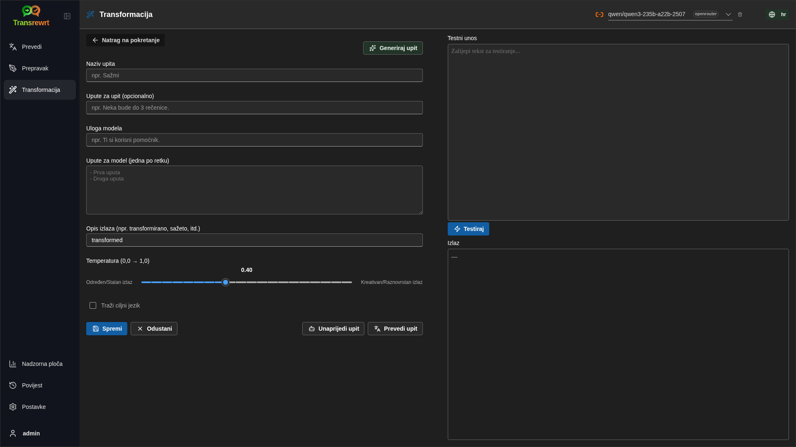
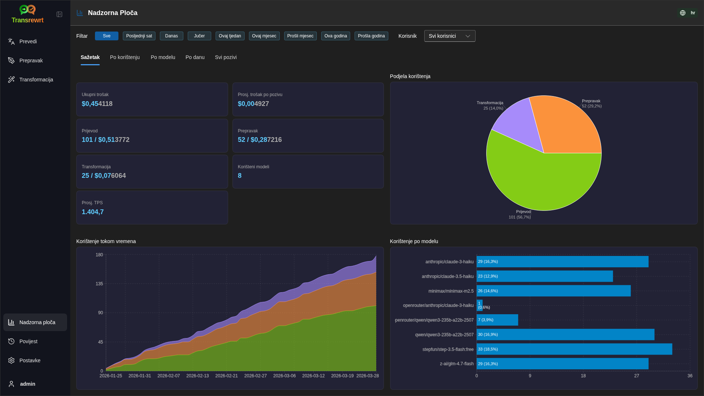
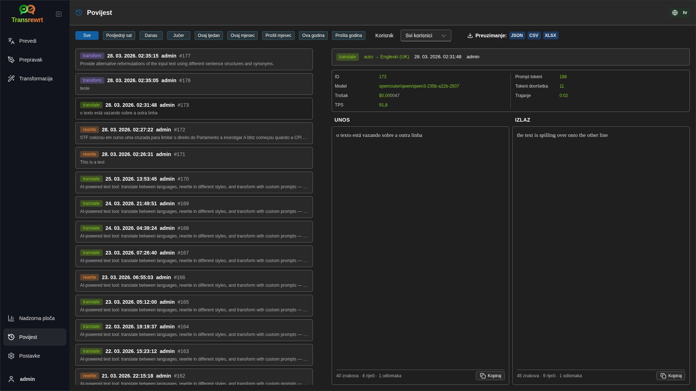
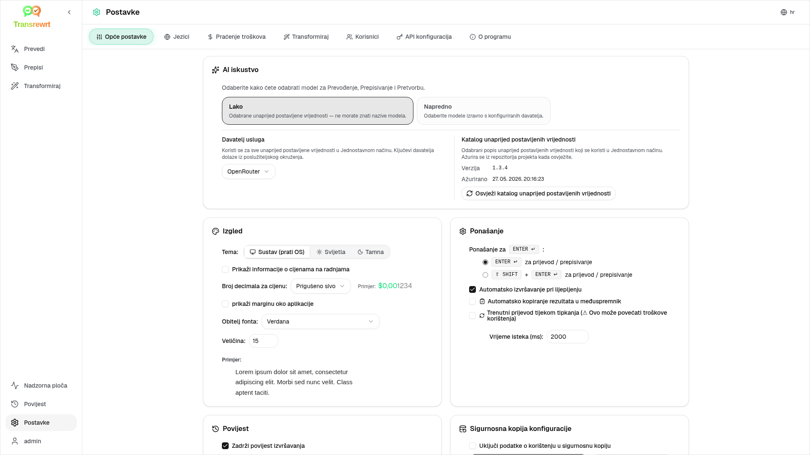

<p align="center">
  
</p>

<p align="center">
  <a href="https://github.com/wsj-br/transrewrt/releases"></a>
  <a href="LICENSE"></a>
  
  
  
</p>

AI alat za obradu teksta: prevođenje između jezika, prepisivanje u različitim stilovima i transformacija prilagođenim upitima – koristeći više AI davatelja (OpenRouter, OpenAI, Anthropic, Google Gemini, DeepSeek, Groq, Mistral, xAI i lokalni Ollama). Radi kao desktop aplikacija (Electron) ili samoposlužena web aplikacija (Docker).

- **Prevedi** - između desetak jezika, s automatskim prepoznavanjem izvora
- **Prepisi** - ispravi gramatiku, poboljšaj jasnoću, formalno/neformalno, skraćivanje, proširivanje, tehnički sadržaj
- **Transformiraj** - prilagođeni AI upiti; kreiraj i upravljaj upitima, opcionalni ciljni jezik po upitu
- **Povijest** - potpuna povijest izvršavanja s ulaznim/izlaznim tekstom, filtriranjem i izvozom
- **Lako i Napredno** - Laki način (zadano): odabrani predlošci po davatelju usluga (**Besplatno (OpenRouter)**, **Standardno**, **Napredno**, **Tehničko**; prikazuju se samo predlošci koji imaju mapiranje za odabranog davatelja usluga) bez odabira ID-ova modela; Napredni način: potpuni popis modela iz vaših konfiguriranih davatelja usluga
- **Modeli i trošak** - nadzorne ploče za trošak i korištenje (Sažetak, Po modelu, Svi pozivi) s mogućnošću izvoza; OpenRouter prikazuje stvarne troškove, dok ostali davatelji usluga koriste procjene
- **Korisnički sučelje (UI)** - višejezično sučelje (30+ jezika, podrška za RTL), fontovi, ...
- **Web način** - podrška za više korisnika s administratorskim ulogama
- **Radna površina** - Electron aplikacija za Windows i Linux
- **Samostalno hostiranje** - Docker slika za amd64 i arm64 (spremno za Raspberry Pi)

Nakon instalacije, pogledajte [**vodič za korisnike**](USER-GUIDE.hr.md) za potpuni pregled svih značajki.

<small>**Pročitajte na drugim jezicima:** </small>
<small id="lang-list">[English (GB)](../README.md) · [Português (Brasil)](./README.pt-BR.md) · [العربية](./README.ar.md) · [বাংলা](./README.bn.md) · [Català](./README.ca.md) · [中文 (中国大陆)](./README.zh-CN.md) · [中文 (台灣)](./README.zh-TW.md) · [Hrvatski](./README.hr.md) · [Čeština](./README.cs.md) · [Nederlands](./README.nl.md) · [English (US)](./README.en-US.md) · [Tagalog](./README.tl.md) · [Français](./README.fr.md) · [Deutsch](./README.de.md) · [Ελληνικά](./README.el.md) · [हिन्दी](./README.hi.md) · [Magyar](./README.hu.md) · [Italiano](./README.it.md) · [日本語](./README.ja.md) · [한국어](./README.ko.md) · [Bahasa Melayu](./README.ms.md) · [فارسی](./README.fa.md) · [Polski](./README.pl.md) · [Basa Jawa](./README.jv.md) · [Português](./README.pt.md) · [ਪੰਜਾਬੀ](./README.pa.md) · [Română](./README.ro.md) · [Русский](./README.ru.md) · [Slovenčina](./README.sk.md) · [Español](./README.es.md) · [Kiswahili](./README.sw.md) · [Svenska](./README.sv.md) · [తెలుగు](./README.te.md) · [ไทย](./README.th.md) · [Türkçe](./README.tr.md) · [Українська](./README.uk.md) · [Tiếng Việt](./README.vi.md)</small>

<small>

> **Napomena o prijevodima sučelja i dokumentacije:** Svi jezici sučelja osim izvornog engleskog (UK)
> prevedeni su pomoću AI modela; izrazi mogu biti neprecizni ili sadržavati pogreške.

</small>

<br/>

<a id="table-of-contents"></a>
## Popis sadržaja

<!-- START doctoc generated TOC please keep comment here to allow auto update -->
<!-- DON'T EDIT THIS SECTION, INSTEAD RE-RUN doctoc TO UPDATE -->

- [Slike ekrana](#screenshots)
- [Brzi početak](#quick-start)
- [Dobivanje OpenRouter API ključa](#getting-an-openrouter-api-key)
- [Konfiguracija i okruženje](#configuration-and-environment)
- [Razvoj i arhitektura](#development-and-architecture)
- [Prijavljivanje problema](#reporting-issues)
- [Ograničenje odgovornosti](#disclaimer)
- [Licenca](#license)

<!-- END doctoc generated TOC please keep comment here to allow auto update -->

<br/><br/>

<a id="screenshots"></a>
## Slike ekrana

**Odabir jezika**



**Prevedi**



**Transformacija - uređivač upita**



**Nadzorna ploča**



**Povijest**



**Postavke - odabir modela**



<br/><br/>

<a id="quick-start"></a>
## Brzi početak

<details>
<summary><b>Docker (preporučuje se za samostalno hostovanje)</b></summary>

<a id="docker"></a>

<br/>

```bash
docker pull ghcr.io/wsj-br/transrewrt:latest

OPENROUTER_API_KEY=sk-or-your-key docker run -d \
  -p 5000:5000 \
  -v transrewrt-data:/app/data \
  -e OPENROUTER_API_KEY \
  --name transrewrt-web \
  ghcr.io/wsj-br/transrewrt:latest
```

Zamijenite `sk-or-your-key` s vašim [OpenRouter API ključem](https://openrouter.ai/keys) (ili postavite ključeve drugih davatelja; pogledajte [Konfiguraciju](#configuration-and-environment)). Otvorite [http://localhost:5000](http://localhost:5000) i promijenite zadani administratorski lozinku prije nego što izložite uslugu.

Postavite barem jedan ključ davatelja putem okoline (npr. `OPENROUTER_API_KEY` za OpenRouter). Prosljedite varijable s `-e` ili `docker compose` / `.env` kako tajne ne bi bile ugrađene u sliku. Ključevi davatelja **nisu** uneseni u web sučelju; poslužitelj ih čita iz okoline.

<br/>

> ℹ️ **NAPOMENA**<br/>
> U Dockeru, vjerodajnice za LLM postavljaju se pomoću varijabli okoline kao što su `OPENROUTER_API_KEY`, `OPENAI_API_KEY`, `CEREBRAS_API_KEY`, … (ne u web sučelju). Na računalu (Electron) konfigurirate ključeve u **Postavke → API**.

<br/>

Ili koristite Docker Compose:

```bash
# download the compose file
wget https://github.com/wsj-br/transrewrt/raw/refs/heads/master/production.yml -O transrewrt.yml
# Edit the file to add your API keys (API_KEYs), or uncomment and adjust the `.env` file. Set the timezone (TZ) if necessary.
vi transrewrt.yml
# start the container
docker compose -f transrewrt.yml up -d
```

Pogledajte [Konfiguraciju](#configuration-and-environment) za sve varijable okoline, kao što su `PORT`, `CONFIG_PATH`, `TZ`, i ključevi za LLM (`OPENROUTER_API_KEY`, `OPENAI_API_KEY`, …).

</details>

<br/>

<details>
<summary><b>Vremenska zona poslužitelja (Docker)</b></summary>

<a id="configuring-the-timezone"></a>

<br/>

Datum i vrijeme sučelja aplikacije slijede lokalne postavke i vremensku zonu **preglednika**. Za **poslužiteljsko** ponašanje (zapisivanje i slično), spremnik koristi varijablu okoline `TZ`. Zadana vrijednost je `TZ=Europe/London`.

Da biste koristili drugu vremensku zonu, postavite `TZ` u svoju datoteku Compose, na primjer:

```yaml
environment:
  - TZ=America/Sao_Paulo
```

Ili prosljedite prilikom pokretanja spremnika (Docker):

```bash
--env TZ=America/Sao_Paulo
```

Na mnogim Linux hostovima možete kopirati naziv vremenske zone sustava s:

```bash
echo TZ=\"$(</etc/timezone)\"
```

Popis valjanih naziva vremenskih zona održava se u [tz bazi podataka](https://en.wikipedia.org/wiki/List_of_tz_database_time_zones) (Wikipedia).

</details>

<br/>

<details>
<summary><b>Windows</b></summary>

<a id="windows-electron"></a>

<br/>

- Preuzmite najnoviji `Transrewrt Setup x.y.z.exe` s [Izdavanja](https://github.com/wsj-br/transrewrt/releases).
- Pokrenite `.exe` i slijedite upute instalacije.
- Prvo pokretanje: pokrenite aplikaciju iz izbornika Start ili prečaca na radnoj površini.
- Unesite svoje API ključeve u **Postavke → API**. Morate konfigurirati barem jednog davatelja; OpenRouter je čest izbor za besplatne modele.

<br/>

> ℹ️ **NAPOMENA**<br/>
> Windows može prikazati jedno od ovih upozorenja o sigurnosti (normalno za nepotpisane/neovisne aplikacije):
>   - **Kontrola računa korisnika (UAC)**: "Želite li dopustiti ovoj aplikaciji nepoznatog izdavača da unese promjene na vašem uređaju?" → Kliknite **Da**.
>   - **Microsoft Defender SmartScreen**: "Windows je zaštitio vaše računalo" → Kliknite **Više informacija** → **Svejedno pokreni**.
>
> To se događa jer aplikacija nije potpisana od strane Microsofta ili velikog izdavača — sigurno je ako je preuzeta s naših službenih GitHub izdanja (provjerite kontrolne zbroje na stranici [Izdavanja](https://github.com/wsj-br/transrewrt/releases) uz svaki resurs).

<br/>

</details>

<br/>

<details>
<summary><b>Linux</b></summary>

<a id="linux-electron"></a>

<br/>

Preuzmite `.AppImage` za svoj CPU s [Releases stranice](https://github.com/wsj-br/transrewrt/releases) (`x64` za tipična računala, `arm64` za mnoge ARM uređaje, uključujući Raspberry Pi 4+), zatim:

```bash
chmod +x Transrewrt-x.y.z-x64.AppImage && ./Transrewrt-x.y.z-x64.AppImage
```

Na x86_64/amd64 koristite `x64` naziv datoteke; na ARM64 koristite `...-arm64.AppImage` naziv.

Unesite svoje API ključeve u **Postavke → API**. Morate konfigurirati barem jednog davatelja; OpenRouter je čest izbor za besplatne modele.

**Poruke u konzoli:** Pakirane Linux verzije (`x64` i `arm64` AppImages) potiskuju Node upozorenja o zastarjelosti u terminalu (npr. ugrađeni `punycode` modul). Ako Chromium ispisuje GPU / EGL pogreške kao što je „GLES3 nije podržan“, ali aplikacija radi, možete ih ugasiti onemogućavanjem hardverskog ubrzavanja:

```bash
TRANSREWRT_DISABLE_GPU=1 ./Transrewrt-x.y.z-arm64.AppImage
```

To vrijedi i za amd64; promijenite naziv datoteke da odgovara vašem preuzimanju.

Na Debian/Ubuntu sustavima možda ćete trebati dodatne **runtime** biblioteke koje zahtijeva Chromium (one su često već prisutne na potpunim desktop instalacijama). Pokrenite donje naredbe ako je potrebno:

```bash
sudo apt update
sudo apt install -y libfuse2 libgtk-3-0 libnotify4 libnss3 libnspr4 libxss1 libxtst6 xdg-utils \
     xauth libatspi2.0-0 libdrm2 libgbm1 libxcb-dri3-0 libcups2 libasound2t64
```

zamijenite `libasound2t64` s `libasound2` za `arm64`. Minimalne ili prilagođene instalacije i dalje mogu završiti s greškom o nedostajućoj `.so` datoteci. Instalirajte paket koji je naznačen u poruci o grešci (češći dodatci: `libatk1.0-0`, `libatk-bridge2.0-0`, `libgbm1`, `libdrm2`). U nekim okruženjima možda ćete morati pokrenuti aplikaciju koristeći `APPIMAGE_EXTRACT_AND_RUN=1 ./Transrewrt-….AppImage`.

<br/>

> ℹ️ **NAPOMENA**<br/>
> macOS trenutačno nije podržan. Transrewrt je dostupan za Windows, Linux i Docker.

</details>

<br/>

Kada aplikacija radi, pogledajte [**vodič za korisnike**](USER-GUIDE.hr.md) da biste naučili kako prevesti, prepisati i transformirati tekst, upravljati upitima i konfigurirati modele.

<br/><br/>

<a id="getting-an-openrouter-api-key"></a>
## Dohvaćanje OpenRouter API ključa

Transrewrt podržava više AI davatelja. [OpenRouter](https://openrouter.ai) je popularan izbor jer agregira mnoge modele pod jednim ključem i nudi besplatne modele.

1. Registrirajte se ili se prijavite na [openrouter.ai](https://openrouter.ai).
2. Otvorite stranicu [Keys](https://openrouter.ai/keys) i kreirajte novi ključ (dodijelite mu naziv i po želji postavite ograničenje kredita). Možete koristiti besplatne modele bez dodavanja kredita.
3. **Desktop (Electron):** zalijepite ključeve u **Postavke → API**. **Docker:** postavite varijable okruženja kao što je `OPENROUTER_API_KEY` (pogledajte [Brzi početak](#quick-start)).

Nemojte koristiti OpenRouterov model **Body Builder** ([`openrouter/bodybuilder`](https://openrouter.ai/openrouter/bodybuilder)) za prevođenje, prepravak ili transformaciju: on vraća JSON teret zahtjeva, a ne gotov tekst za te zadatke. Pogledajte [Postavke → Modeli](USER-GUIDE.hr.md#models) u Korisničkom vodiču.

Također možete koristiti druge davatelje (OpenAI, Anthropic, Google Gemini, DeepSeek, Groq, Mistral, xAI, Cerebras) ili pokretati modele lokalno s [Ollama](https://ollama.com). Pogledajte [Konfiguracija](#configuration-and-environment) za potpuni popis podržanih davatelja i varijabli okruženja.

</br>

> ⚠️ **UPOZORENJE**<br/>
> Ako koristite Ollama s drugog uređaja, kontejnera ili servisa, sjetite se konfigurirati Ollama da dopušta vanjske veze (ne samo localhost).

<br/><br/>

<a id="configuration-and-environment"></a>
## Konfiguracija i okruženje

</br>

**Lokacije konfiguracijske datoteke**

| Implementacija         | Lokacija konfiguracije                                   |
| ------------------ | ------------------------------------------------- |
| Electron (Windows) | `%APPDATA%\transrewrt\`                           |
| Electron (Linux)   | `~/.config/transrewrt/`                           |
| Web / Docker       | `/app/data/config.json` (koristite volumen za trajno pohranjivanje) |

<br/>

**Varijable okoline** (samo za web/Docker; Electron koristi lokalnu konfiguracijsku datoteku)

| Varijabla             | Opis                                                                  |
|----------------------|------------------------------------------------------------------------------|
| `PORT`               | Priključak na kojem sluša poslužitelj (zadano: `5000`)                                  |
| `CONFIG_PATH`        | Put do konfiguracijske datoteke (zadano: `/app/data/config.json`)                |
| `TZ`                 | vremenska zona za poslužiteljsko vrijeme (zapisivanje dnevnika itd.) (zadano: `Europe/London`) |
| `HISTORY_DISABLED`   | Prisilno isključivanje povijesti izvođenja (neobavezno, zadano je `false`)                  |
| `OPENROUTER_API_KEY` | OpenRouter API ključ                                                           |
| `OPENAI_API_KEY`     | OpenAI API ključ                                                               |
| `CEREBRAS_API_KEY`   | Cerebras API ključ                                                             |
| `ANTHROPIC_API_KEY`  | Anthropic API ključ                                                            |
| `GOOGLE_API_KEY`     | Google Gemini API ključ                                                        |
| `DEEPSEEK_API_KEY`   | DeepSeek API ključ                                                             |
| `GROQ_API_KEY`       | Groq API ključ                                                                 |
| `MISTRAL_API_KEY`    | Mistral API ključ                                                              |
| `OLLAMA_URL`         | Ollama osnovni URL (npr. `http://host.docker.internal:11434`)                   |
| `XAI_API_KEY`        | xAI API ključ                                                                  |

**Način privatnosti:** Da biste prisilno isključili praćenje povijesti bez obzira na `config.json` ili postavke pojedinačnih korisnika, postavite `HISTORY_DISABLED` na `true` ili `1` (neovisno o velikim/malim slovima) za **web/Docker poslužiteljski proces** i/ili **glavni proces Electron desktop aplikacije** (npr. sustav ili okruženje pokretača — ne samo renderer). To onemogućuje pohranjivanje povijesti ulaza/izlaza, zaključava **Postavke → Opće postavke → Povijest** i blokira API-je vezane uz Povijest.

Konfigurirajte samo davatelje usluga koje koristite. ID-ovi modela su imenski prostori (`openrouter/…`, `openai/…`, `cerebras/…`, `ollama/…`, itd.).

**Prikaz troškova:** OpenRouter vraća točan naplaćeni trošak kad god je primjenjivo. Ostali davatelji koriste **procijenjeno** troškove iz javne cjenika modela OpenRoutera kada je dostupan OpenRouter ključ; bez njega, troškovi za ne-OpenRouter mogu se prikazati kao `0`. Procjene nisu računi.

<br/>

**Podaci i trajnost:** Za Docker, pričvrstite volume na `/app/data` kako bi `config.json` i SQLite baza podataka ostali sačuvani nakon ponovnog pokretanja kontejnera. Bez volumena, svi podaci se gube kada se kontejner zaustavi.

<br/>

**Web autentikacija:**

- Zadani administrator: `admin` / `transrewrt26`.
- Upravljanje korisnicima u **Postavke → Korisnici**.
- Ponovno postavljanje lozinke: `docker exec <container> reset-web-password '<username>' '<new-password>'`

<br/>

> ⚠️ **UPOZORENJE**<br/>
> Odmah promijenite zadani administratorski lozinku na svakom hostu dostupnom putem mreže.

<br/>

Postavke ključnih opcija (font, modeli, jezici, itd.) dostupne su u aplikaciji u dijelu Postavke.

<br/><br/>

<a id="development-and-architecture"></a>
## Razvoj i arhitektura

- **Razvoj:** Postavljanje, izgradnja, testiranje i implementacija (Electron, Web, Docker) - pogledajte [dev/DEVELOPMENT.md](../dev/DEVELOPMENT.md).
- **Arhitektura i pregled sustava:** Struktura mapa, tehnološki stog, dizajnerska rješenja - pogledajte [dev/SYSTEM-OVERVIEW.md](../dev/SYSTEM-OVERVIEW.md).

<br/><br/>

<a id="reporting-issues"></a>
## Prijavljivanje problema

Otvorite problem na [GitHub](https://github.com/wsj-br/transrewrt/issues). Uključite svoju platformu (Windows / Linux / Docker) i verziju aplikacije (prikazana u dijalogu O programu ili na stranici objava).

<br/><br/>

<a id="disclaimer"></a>
## Odricanje odgovornosti

Imena proizvoda i ikone vlasništvo su njihovih vlasnika i koriste se samo u svrhe identifikacije. Ovaj softver nije povezan s niti ga podržavaju navedene marke.

<br/><br/>

<a id="license"></a>
## License

Autorska prava © 2026 Waldemar Scudeller Jr.

[Apache License 2.0](../LICENSE)
