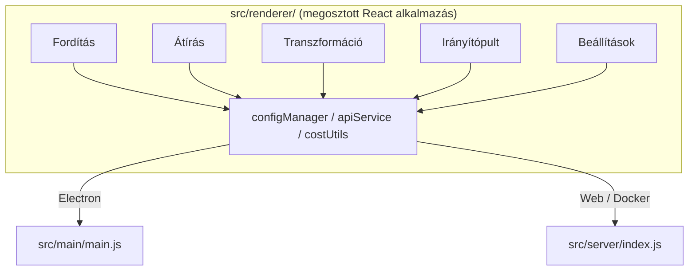

<p align="center">
  
</p>

<h1 align="center">Transrewrt</h1>

<p align="center">
  <a href="https://github.com/wsj-br/transrewrt/releases"></a>
  <a href="LICENSE"></a>
  
  
  
</p>

AI-alapú szöveges eszköz: nyelvközű fordítás,不同 stílusokban újraírás, és testreszabott parancsokkal átalakítás – mind az [OpenRouter](https://openrouter.ai) segítségével. Asztali alkalmazásként (Electron) vagy önkiszolgáló webalkalmazásként (Docker) fut.

- **Fordítás** – több tucat nyelv között, automatikus forrásnyelv-felismeréssel
- **Átírás** – helyesírási javítás, egyértelműség javítása, formális/informális, rövidítés, bővítés, technikai szöveg
- **Átalakítás** – egyéni AI-parancsok; parancsok létrehozása és kezelése, opcionális célnyelv parancsonként
- **Modellek & költség** – bármely OpenRouter-modell kiválasztása; költségirányítópult SQLite naplóval, összefoglalók modell/művelet/nap szerint
- **Felhasználói felület** – i18n (pt-BR, de, fr, es, RTL), témák, betűtípusok, billentyűparancsok; biztonságos webmód (API-kulcs csak a szerveren)
- **Asztali** – Windows és Linux Electron alkalmazás
- **Önkiszolgáló** – Docker image amd64 & arm64 architektúrákra (Raspberry Pi-kompatibilis)

A telepítés után tekintse meg a **[Felhasználói útmutató](../USER-GUIDE.md)**-t az összes funkció részletes ismertetéséért.

<small>**Olvasható más nyelveken:** [English (UK)](../README.md) · [Português (BR)](README.pt-BR.md) · [العربية](README.ar.md) · [বাংলা](README.bn.md) · [Català](README.ca.md) · [简体中文](README.zh-CN.md) · [繁體中文](README.zh-TW.md) · [Hrvatski](README.hr.md) · [Čeština](README.cs.md) · [Nederlands](README.nl.md) · [English (US)](README.en-US.md) · [Filipino](README.tl.md) · [Français](README.fr.md) · [Deutsch](README.de.md) · [Ελληνικά](README.el.md) · [हिन्दी](README.hi.md) · [Magyar](README.hu.md) · [Italiano](README.it.md) · [日本語](README.ja.md) · [Basa Jawa](README.jv.md) · [한국어](README.ko.md) · [Bahasa Melayu](README.ms.md) · [فارسی](README.fa.md) · [Polski](README.pl.md) · [Português (PT)](README.pt.md) · [ਪੰਜਾਬੀ](README.pa.md) · [Română](README.ro.md) · [Русский](README.ru.md) · [Slovenčina](README.sk.md) · [Español](README.es.md) · [Kiswahili](README.sw.md) · [Svenska](README.sv.md) · [తెలుగు](README.te.md) · [ภาษาไทย](README.th.md) · [Türkçe](README.tr.md) · [Українська](README.uk.md) · [Tiếng Việt](README.vi.md)</small>

<a id="screenshots"></a>
## Képernyőképek

**Nyelpválasztó**


**Fordítás**


**Átalakítás - parancsszerkesztő**


**Irányítópult**


**Beállítások - modellválasztás**


<br /><br />

<a id="table-of-contents"></a>
## Tartalomjegyzék

<!-- START doctoc generated TOC please keep comment here to allow auto update -->
<!-- DON'T EDIT THIS SECTION, INSTEAD RE-RUN doctoc TO UPDATE -->

- [Gyorsindítás](#gyrosindítás)
- [Telepítés](#telepítés)
  - [Windows (Electron)](#windows-electron)
  - [Linux (Electron)](#linux-electron)
  - [Docker](#docker)
- [OpenRouter API kulcs beszerzése](#getting-an-openrouter-api-key)
- [Konfiguráció és környezet](#configuration-and-environment)
- [Fejlesztés és architektúra](#development-and-architecture)
- [Kiadások és címkék](#releases-and-tags)
- [Hozzájárulás](#contributing)
- [Felelősségkizárás](#disclaimer)
- [Licenc](#license)

<!-- END doctoc generated TOC please keep comment here to allow auto update -->

<br /><br />

<a id="quick-start"></a>

## Gyors indítás

**Docker (ajánlott saját üzemeltetéshez)**

```bash
docker pull ghcr.io/wsj-br/transrewrt:latest

API_KEY=sk-or-your-key docker run -d \
  -p 5000:5000 \
  -v transrewrt-data:/app/data \
  -e API_KEY \
  --name transrewrt-web \
  ghcr.io/wsj-br/transrewrt:latest
```

Cseréld le a `sk-or-your-key`-et az [OpenRouter API kulcsoddal](https://openrouter.ai/keys). Nyisd meg a [http://localhost:5000](http://localhost:5000) oldalt, és módosítsd az alapértelmezett admin jelszót, mielőtt kitépd a szolgáltatást.

<br />

> ℹ️ **MEGJEGYZÉS**<br/>
> Dockerben az OpenRouter API kulcs csak az `API_KEY` környezeti változón keresztül állítható be (nem a web felületen). Asztali (Electron) verzióban a **Beállítások → API** helyén illeszd be.

<br />

**Windows**

Töltsd le a legújabb `Transrewrt Setup x.y.z.exe` fájlt a [Kiadások](https://github.com/wsj-br/transrewrt/releases) oldalról, futtasd a telepítőt, majd indítsd az Start menüből vagy az asztali parancsikonból. Add meg az OpenRouter API kulcsodat a **Beállítások → API** alatt.

<br />

**Linux**

Töltsd le a `.AppImage` fájlt a [Kiadások](https://github.com/wsj-br/transrewrt/releases) oldalról, majd:

```bash
chmod +x Transrewrt-x.y.z.AppImage && ./Transrewrt-x.y.z.AppImage
```

Add meg az OpenRouter API kulcsodat a **Beállítások → API** alatt. Debian/Ubuntu esetén előfordulhat, hogy telepíteni kell további függőségeket:

```bash
sudo apt install libgtk-3-0 libnotify-dev libnss3 libxss1 libasound2 libxtst6 xauth
```

Részletekért lásd a [Telepítés → Linux](#linux-electron) részt.

<br />

> ℹ️ **MEGJEGYZÉS**<br/>
> Jelenleg nem támogatott a macOS. A Transrewrt elérhető Windows, Linux és Docker rendszerekre.

<br />

Amint az alkalmazás elindult, olvasd el a **[Felhasználói útmutatót](../USER-GUIDE.md)**, hogy megtudd, hogyanFordíthatsz, átírsz és transzformálsz szöveget, kezelheted a promptokat és konfigurálhatod a modelleket.

<br /><br />

<a id="installation"></a>
## Telepítés

<a id="windows-electron"></a>
### Windows (Electron)

- Töltsd le a legújabb telepítőt a [Kiadások](https://github.com/wsj-br/transrewrt/releases) oldalról.
- Futtasd a `.exe` fájlt és kövesd a telepítőt.
- Első indítás: indítsd az alkalmazást a Start menüből vagy az asztali parancsikonból. A konfiguráció a `%APPDATA%\transrewrt\` mappában tárolódik.

<br />

<a id="linux-electron"></a>
### Linux (Electron)

- Töltsd le a `.AppImage` fájlt a [Kiadások](https://github.com/wsj-br/transrewrt/releases) oldalról.
- Futtatás: `chmod +x Transrewrt-x.y.z.AppImage && ./Transrewrt-x.y.z.AppImage`
- Extra függőségek (Debian/Ubuntu): `sudo apt install libgtk-3-0 libnotify-dev libnss3 libxss1 libasound2 libxtst6 xauth`
- További információkért lásd a [dev/DEVELOPMENT.md](../dev/DEVELOPMENT.md) fájlt.

<br />

<a id="docker"></a>
### Docker

- Pull: `docker pull ghcr.io/wsj-br/transrewrt:latest`
- Az OpenRouter API kulcsot **csak** az `API_KEY` környezeti változón keresztül kell beállítani. Add át a `-e API_KEY` kapcsolóval (vagy `docker compose` / `.env` segítségével), hogy a kulcs ne legyen látható a folyamatlistában.
- Az API kulcs nem adható meg a web felületen.

Példa - elnevezett kötet tartósságért (API kulcs környezeti változón keresztül, nem parancssorban):

```bash
API_KEY=sk-or-your-key docker run -d \
  -p 5000:5000 \
  -v transrewrt-data:/app/data \
  -e API_KEY \
  --name transrewrt-web \
  ghcr.io/wsj-br/transrewrt:latest
```

<br />

| Opció   | Leírás                                                                                                   |
| -------- | ------------------------------------------------------------------------------------------------------------- |
| Port     | `5000` (képezz a `-p 5000:5000` segítségével)                                                                              |
| Volume   | Csatlakoztasd a `/app/data` mappát a konfiguráció és az adatbázis tartósságához                                                         |
| Környezeti változók | `PORT`, `CONFIG_PATH`, `API_KEY`, `API_URL`, `KEY_SEED` - lásd [Konfiguráció](#configuration-and-environment) |

Forráskból történő fordításhoz és futtatáshoz: `docker compose up --build -d` vagy `pnpm run docker:up` - lásd [dev/DEVELOPMENT.md](../dev/DEVELOPMENT.md).

<br /><br />

<a id="getting-an-openrouter-api-key"></a>
## OpenRouter API kulcs beszerzése

A Transrewrt az [OpenRouter](https://openrouter.ai) szolgáltatást használja AI modellekhez. API kulcsra van szükséged a szöveg fordításához, átírásához vagy átalakításához.

1. Regisztrálj vagy jelentkezz be a [openrouter.ai](https://openrouter.ai) oldalon.
2. Nyisd meg a [Kulcsok](https://openrouter.ai/keys) oldalt, és hozz létre egy új kulcsot (nevezd el, és opcionálisan állíts be hitelkeretet). Ingyenes modellek használata nincs szükség hitel feltöltésre.
3. **Asztali (Electron):** illeszd be a kulcsot a **Beállítások → API** alatt. **Docker:** állítsd be az `API_KEY` környezeti változót (lásd [Gyors indítás](#quick-start)).

Korlátokról, BYOK-ról és többet a [OpenRouter authentication](https://openrouter.ai/docs/api/reference/authentication) oldalon találsz.

<br /><br />

<a id="configuration-and-environment"></a>

## Konfiguráció és környezet

**Konfigurációs fájlok elhelyezkedése**

| Üzemeltetés         | Konfigurációs útvonal                                   |
| ------------------- | ------------------------------------------------------- |
| Electron (Windows)  | `%APPDATA%\transrewrt\`                                 |
| Electron (Linux)    | `~/.config/transrewrt/`                                 |
| Web / Docker        | `/app/data/config.json` (használj kötetet a megőrzéshez) |

<br />

**Környezeti változók** (csak web/Docker; Electron a helyi konfigurációs fájlt használja)

| Változó      | Alapértelmezett                        | Leírás                                                                          |
| ------------ | -------------------------------------- | -------------------------------------------------------------------------------- |
| `PORT`       | `5000`                                 | A szerver által figyelt port                                                    |
| `CONFIG_PATH`| `/app/data/config.json`               | A konfigurációs fájl útvonala                                                   |
| `API_KEY`    | *(üres)*                               | OpenRouter API kulcs (szükséges Dockerhoz; állítsd be környezeti változóként, nem UI-ból) |
| `API_URL`    | `https://openrouter.ai/api/v1`        | A felsőbb rétegbeli AI API alap címe                                            |
| `KEY_SEED`   | *(üres)*                               | Transrewrt proxy kulcs mag (felülírja a konfigurációt, ha be van állítva)        |

<br />

**Adatok és tartósság:** Docker esetén csatolj egy kötetet az `/app/data` útvonalra, hogy a `config.json` és az SQLite adatbázis megmaradjon a kontainer újraindításai között. Kötet nélkül minden adat elvész, amikor a kontener leáll.

<br />

**Web hitelesítés:**

- Alapértelmezett admin: `admin` / `transrewrt26`.
- Felhasználók kezelése a **Beállítások → Felhasználók** menüpontban.
- Jelszó visszaállítása: `docker exec <kontener> reset-web-password '<felhasználónév>' '<új-jelszó>'`
  (forráskódból: `pnpm run reset-web-password -- <felhasználónév> <új-jelszó>`)

<br />

> ⚠️ **FIGYELEM**<br/>
> Változd meg azonnal az alapértelmezett admin jelszót minden hálózaton keresztül elérhető gépen.

<br />

**Transrewrt proxy (opcionális):** Az API forgalmat egy külső proxyn keresztül is irányíthatod, amely időalapú rotáló kulcsot használ. A **Beállítások → API** menüpontban engedélyezd a **Transrewrt proxy használata** lehetőséget, állítsd be a **Kulcs magot** és az **API URL** mezőt a proxy alapcímére. Részletekért lásd a [dev/SYSTEM-OVERVIEW.md](../dev/SYSTEM-OVERVIEW.md) fájlt.

A fő beállítások (téma, betűtípus, modellek, nyelvek stb.) a Beállítások párbeszédpanelen érhetők el, vagy közvetlenül a konfigurációs JSON fájlban szerkeszthetők. A teljes lista és az alapértelmezett értékek a [dev/DEVELOPMENT.md](../dev/DEVELOPMENT.md) fájlban dokumentálva vannak.

<br /><br />

<a id="development-and-architecture"></a>
## Fejlesztés és architektúra

- **Fejlesztés:** Beállítás, buildelés, tesztelés és üzembe helyezés (Electron, Web, Docker) – lásd a **[dev/DEVELOPMENT.md](../dev/DEVELOPMENT.md)** fájlt.
- **Architektúra és rendszeráttekintés:** Mappastruktúra, tech stack, tervezési döntések, Transrewrt proxy – lásd a **[dev/SYSTEM-OVERVIEW.md](../dev/SYSTEM-OVERVIEW.md)** fájlt.



<br /><br />

<a id="releases-and-tags"></a>
## Kiadások és címkék

- **Git címkék** `v`* (pl. `v1.0.10`) aktiválják a [kiadási workflow-t](.github/workflows/release.yml). A **GitHub Kiadások** mellékelik a Windows telepítőt (`.exe`) és a Linux AppImage-t.
- **Docker képek** a `ghcr.io/wsj-br/transrewrt` repóban jelennek meg. A kép címkéi megegyeznek a Git verzióval (pl. `v1.0.10` → `ghcr.io/wsj-br/transrewrt:1.0.10`) plusz a `latest`. Multi-arch: `linux/amd64` és `linux/arm64` (pl. Raspberry Pi).

<br /><br />

<a id="contributing"></a>
## Hozzájárulás

1. Fork old a repót.
2. Hozz létre egy funkcióágat: `git checkout -b feature/my-feature`
3. Tedd közzé a változtatásaidat egy világos üzenettel.
4. Küldd és nyiss egy Pull Request-ot a `main` ág ellen.

Kérlek, kövesd a meglévő kódstílust és teszteld a változtatásaidat mind Electron és web módban, mielőtt beküldenéd. Buildelési és tesztelési utasításokért lásd a [dev/DEVELOPMENT.md](../dev/DEVELOPMENT.md) fájlt.

<br />

**Problémák jelentése:** Nyiss egy problémát a [GitHub-on](https://github.com/wsj-br/transrewrt/issues). Add meg a platformod (Windows / Linux / Docker) és az alkalmazás verziót (megjelenik az About párbeszédpanelen vagy a Kiadások oldalon).

<br /><br />

<a id="disclaimer"></a>

## Jogi nyilatkozat

A terméknevek és ikonok a megfelelő tulajdonosok tulajdonában vannak, és kizárólag azonosításra szolgálnak. Ez a szoftver nem áll kapcsolatban, és nincs egyetlen említett márkkal sem.

<br /><br />

<a id="license"></a>
## Licenc

Copyright © 2026 Waldemar Scudeller Jr.

[Apache License 2.0](LICENSE)