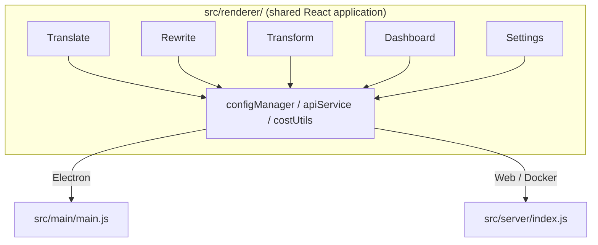

<p align="center">
  
</p>

<h1 align="center">Transrewrt</h1>

<p align="center">
  <a href="https://github.com/wsj-br/transrewrt/releases"></a>
  <a href="LICENSE"></a>
  
  
  
</p>

Strumento di testo basato su IA: traduci tra lingue, riscrivi in stili diversi e trasforma con prompt personalizzati - tutto tramite [OpenRouter](https://openrouter.ai). Funziona come app desktop (Electron) o come web app self-hosted (Docker).

- **Traduci** - tra decine di lingue, con rilevamento automatico della lingua sorgente
- **Riscrivi** - correggi grammatica, migliora la chiarezza, formale/informale, abbreviare, espandere, tecnico
- **Trasforma** - prompt IA personalizzati; crea e gestisci prompt, lingua di destinazione opzionale per prompt
- **Modelli e costi** - scegli qualsiasi modello OpenRouter; dashboard dei costi con log SQLite, riepiloghi per modello/operazione/giorno
- **Interfaccia** - i18n (pt-BR, de, fr, es, RTL), temi, caratteri, scorciatoie da tastiera; modalità web sicura (chiave API solo sul server)
- **Desktop** - app Electron per Windows e Linux
- **Self-hosted** - immagine Docker per amd64 & arm64 (compatibile Raspberry Pi)

Una volta installato, consulta la **[Guida Utente](../USER-GUIDE.md)** per una panoramica completa di tutte le funzionalità.

<small>**Leggi in altre lingue:** [English (UK)](../README.md) · [Português (BR)](README.pt-BR.md) · [العربية](README.ar.md) · [বাংলা](README.bn.md) · [Català](README.ca.md) · [简体中文](README.zh-CN.md) · [繁體中文](README.zh-TW.md) · [Hrvatski](README.hr.md) · [Čeština](README.cs.md) · [Nederlands](README.nl.md) · [English (US)](README.en-US.md) · [Filipino](README.tl.md) · [Français](README.fr.md) · [Deutsch](README.de.md) · [Ελληνικά](README.el.md) · [हिन्दी](README.hi.md) · [Magyar](README.hu.md) · [Italiano](README.it.md) · [日本語](README.ja.md) · [Basa Jawa](README.jv.md) · [한국어](README.ko.md) · [Bahasa Melayu](README.ms.md) · [فارسی](README.fa.md) · [Polski](README.pl.md) · [Português (PT)](README.pt.md) · [ਪੰਜਾਬੀ](README.pa.md) · [Română](README.ro.md) · [Русский](README.ru.md) · [Slovenčina](README.sk.md) · [Español](README.es.md) · [Kiswahili](README.sw.md) · [Svenska](README.sv.md) · [తెలుగు](README.te.md) · [ภาษาไทย](README.th.md) · [Türkçe](README.tr.md) · [Українська](README.uk.md) · [Tiếng Việt](README.vi.md)</small>

<a id="screenshots"></a>
## Screenshots

**Selettore della lingua**


**Traduzione**


**Trasforma - editor prompt**


**Dashboard**


**Impostazioni - selezione modello**


<br /><br />

<a id="table-of-contents"></a>
## Indice

<!-- START doctoc generated TOC please keep comment here to allow auto update -->
<!-- DON'T EDIT THIS SECTION, INSTEAD RE-RUN doctoc TO UPDATE -->

- [Guida rapida](#quick-start)
- [Installazione](#installation)
  - [Windows (Electron)](#windows-electron)
  - [Linux (Electron)](#linux-electron)
  - [Docker](#docker)
- [Ottenere una chiave API OpenRouter](#getting-an-openrouter-api-key)
- [Configurazione e ambiente](#configuration-and-environment)
- [Sviluppo e architettura](#development-and-architecture)
- [Release e tag](#releases-and-tags)
- [Contribuire](#contributing)
- [Declinazione di responsabilità](#disclaimer)
- [Licenza](#license)

<!-- END doctoc generated TOC please keep comment here to allow auto update -->

<br /><br />

<a id="quick-start"></a>

## Guida rapida

**Docker (consigliato per il self-hosting)**

```bash
docker pull ghcr.io/wsj-br/transrewrt:latest

API_KEY=sk-or-your-key docker run -d \
  -p 5000:5000 \
  -v transrewrt-data:/app/data \
  -e API_KEY \
  --name transrewrt-web \
  ghcr.io/wsj-br/transrewrt:latest
```

Sostituisci `sk-or-your-key` con la tua [chiave API OpenRouter](https://openrouter.ai/keys). Apri [http://localhost:5000](http://localhost:5000) e cambia la password amministratore predefinita prima di esporre il servizio.

<br />

> ℹ️ **NOTA**<br/>
> In Docker la chiave API OpenRouter è impostata solo tramite la variabile d'ambiente `API_KEY` (non nell'interfaccia web). Sul desktop (Electron) la incolli in **Impostazioni → API**.

<br />

**Windows**

Scarica il più recente `Transrewrt Setup x.y.z.exe` da [Rilasci](https://github.com/wsj-br/transrewrt/releases), esegui il programma di installazione, quindi avvia dal menu Start o dal collegamento sul desktop. Inserisci la tua chiave API OpenRouter in **Impostazioni → API**.

<br />

**Linux**

Scarica il `.AppImage` da [Rilasci](https://github.com/wsj-br/transrewrt/releases), quindi:

```bash
chmod +x Transrewrt-x.y.z.AppImage && ./Transrewrt-x.y.z.AppImage
```

Inserisci la tua chiave API OpenRouter in **Impostazioni → API**. Su Debian/Ubuntu potresti dover installare prima le dipendenze aggiuntive:

```bash
sudo apt install libgtk-3-0 libnotify-dev libnss3 libxss1 libasound2 libxtst6 xauth
```

Vedi [Installazione → Linux](#linux-electron) per i dettagli.

<br />

> ℹ️ **NOTA**<br/>
> macOS non è attualmente supportato. Transrewrt è disponibile per Windows, Linux e Docker.

<br />

Una volta che l'app è in esecuzione, consulta la **[Guida utente](../USER-GUIDE.md)** per imparare come tradurre, riscrivere e trasformare testo, gestire prompt e configurare modelli.

<br /><br />

<a id="installation"></a>
## Installazione

<a id="windows-electron"></a>
### Windows (Electron)

*   Scarica il programma di installazione più recente da [Rilasci](https://github.com/wsj-br/transrewrt/releases).
*   Esegui il `.exe` e segui il programma di installazione.
*   Primo avvio: avvia l'app dal menu Start o dal collegamento sul desktop. La configurazione è memorizzata in `%APPDATA%\transrewrt\`.

<br />

<a id="linux-electron"></a>
### Linux (Electron)

*   Scarica il `.AppImage` da [Rilasci](https://github.com/wsj-br/transrewrt/releases).
*   Esegui: `chmod +x Transrewrt-x.y.z.AppImage && ./Transrewrt-x.y.z.AppImage`
*   Dipendenze aggiuntive (Debian/Ubuntu): `sudo apt install libgtk-3-0 libnotify-dev libnss3 libxss1 libasound2 libxtst6 xauth`
*   Vedi [dev/DEVELOPMENT.md](../dev/DEVELOPMENT.md) per ulteriori dettagli.

<br />

<a id="docker"></a>
### Docker

*   Scarica: `docker pull ghcr.io/wsj-br/transrewrt:latest`
*   La chiave API OpenRouter **deve** essere impostata tramite la variabile d'ambiente `API_KEY`. Passala con `-e API_KEY` (o tramite `docker compose` / `.env`) in modo che la chiave non sia visibile nella lista dei processi.
*   La chiave API non può essere inserita nell'interfaccia web.

Esempio - volume nominato per la persistenza (chiave API passata tramite env, non nella riga di comando):

```bash
API_KEY=sk-or-your-key docker run -d \
  -p 5000:5000 \
  -v transrewrt-data:/app/data \
  -e API_KEY \
  --name transrewrt-web \
  ghcr.io/wsj-br/transrewrt:latest
```

<br />

| Opzione   | Descrizione                                                                                                   |
| -------- | ------------------------------------------------------------------------------------------------------------- |
| Porta     | `5000` (mappa con `-p 5000:5000`)                                                                              |
| Volume   | Monta `/app/data` per la persistenza di configurazione e database                                                 |
| Variabili d'ambiente | `PORT`, `CONFIG_PATH`, `API_KEY`, `API_URL`, `KEY_SEED` - vedi [Configurazione](#configuration-and-environment) |

Per compilare ed eseguire dal sorgente: `docker compose up --build -d` o `pnpm run docker:up` - vedi [dev/DEVELOPMENT.md](../dev/DEVELOPMENT.md).

<br /><br />

<a id="getting-an-openrouter-api-key"></a>
## Come ottenere una chiave API OpenRouter

Transrewrt utilizza [OpenRouter](https://openrouter.ai) per i modelli AI. Hai bisogno di una chiave API per tradurre, riscrivere o trasformare testo.

1.  Registrati o accedi su [openrouter.ai](https://openrouter.ai).
2.  Apri la pagina [Chiavi](https://openrouter.ai/keys) e crea una nuova chiave (dai un nome e, opzionalmente, imposta un limite di credito). Puoi utilizzare modelli gratuiti senza aggiungere credito.
3.  **Desktop (Electron):** incolla la chiave in **Impostazioni → API**. **Docker:** imposta la variabile d'ambiente `API_KEY` (vedi [Guida rapida](#quick-start)).

Per limiti, BYOK e altro, vedi [Autenticazione OpenRouter](https://openrouter.ai/docs/api/reference/authentication).

<br /><br />

<a id="configuration-and-environment"></a>

## Configurazione e ambiente

**Percorsi del file di configurazione**

| Distribuzione         | Percorso configurazione                           |
| --------------------- | ------------------------------------------------- |
| Electron (Windows)    | `%APPDATA%\transrewrt\`                           |
| Electron (Linux)      | `~/.config/transrewrt/`                           |
| Web / Docker          | `/app/data/config.json` (usa un volume per persistenza) |

<br />

**Variabili d'ambiente** (solo web/Docker; Electron usa il file di configurazione locale)

| Variabile      | Predefinito                        | Descrizione                                                   |
| -------------- | ---------------------------------- | ------------------------------------------------------------- |
| `PORT`         | `5000`                             | Porta di ascolto server                                      |
| `CONFIG_PATH`  | `/app/data/config.json`            | Percorso del file di configurazione                          |
| `API_KEY`      | *(vuoto)*                          | Chiave API OpenRouter (richiesta per Docker; impostata tramite variabile d'ambiente, non UI) |
| `API_URL`      | `https://openrouter.ai/api/v1`     | URL base API AI upstream                                     |
| `KEY_SEED`     | *(vuoto)*                          | Seme chiave proxy Transrewrt (sovrascrive la configurazione se impostato) |

<br />

**Dati e persistenza:** Per Docker, montare un volume in `/app/data` in modo che `config.json` e il database SQLite persistano tra i riavvii del container. Senza un volume, tutti i dati vengono persi quando il container si ferma.

<br />

**Autenticazione web:**

- Admin predefinito: `admin` / `transrewrt26`.
- Gestisci gli utenti in **Impostazioni → Utenti**.
- Reimposta una password: `docker exec <container> reset-web-password '<username>' '<new-password>'`
  (dal sorgente: `pnpm run reset-web-password -- <username> <new-password>`)

<br />

> ⚠️ **AVVISO**<br/>
> Cambiare immediatamente la password admin predefinita su qualsiasi host accessibile in rete.

<br />

**Proxy Transrewrt (opzionale):** Puoi instradare il traffico API attraverso un proxy esterno che utilizza una chiave rotativa basata sul tempo. In **Impostazioni → API**, abilita **Usa Proxy Transrewrt**, imposta **Seme chiave** e imposta **URL API** all'URL base del proxy. Vedi [dev/SYSTEM-OVERVIEW.md](../dev/SYSTEM-OVERVIEW.md) per i dettagli.

Le impostazioni chiave (tema, carattere, modelli, lingue, ecc.) sono disponibili nella finestra di dialogo Impostazioni o possono essere modificate direttamente nel JSON di configurazione. L'elenco completo e i predefiniti sono documentati in [dev/DEVELOPMENT.md](../dev/DEVELOPMENT.md).

<br /><br />

<a id="development-and-architecture"></a>
## Sviluppo e architettura

- **Sviluppo:** Configurazione, compilazione, test e deploy (Electron, Web, Docker) - vedi **[dev/DEVELOPMENT.md](../dev/DEVELOPMENT.md)**.
- **Architettura e panoramica del sistema:** Struttura delle cartelle, stack tecnologico, decisioni di progettazione, Proxy Transrewrt - vedi **[dev/SYSTEM-OVERVIEW.md](../dev/SYSTEM-OVERVIEW.md)**.



<br /><br />

<a id="releases-and-tags"></a>
## Rilasci e tag

- I tag Git `v`* (ad es. `v1.0.10`) attivano il [workflow di rilascio](.github/workflows/release.yml). **GitHub Releases** include l'installer Windows (`.exe`) e l'AppImage Linux.
- Le immagini Docker sono pubblicate su `ghcr.io/wsj-br/transrewrt`. I tag delle immagini corrispondono alla versione Git (ad es. `v1.0.10` → `ghcr.io/wsj-br/transrewrt:1.0.10`) più `latest`. Multi-arch: `linux/amd64` e `linux/arm64` (ad es. Raspberry Pi).

<br /><br />

<a id="contributing"></a>
## Contribuire

1. Forka il repository.
2. Crea un branch di feature: `git checkout -b feature/my-feature`
3. Esegui il commit delle modifiche con un messaggio chiaro.
4. Fai push e apri una Pull Request verso `main`.

Segui lo stile di codice esistente e testa le tue modifiche sia in modalità Electron che web prima di inviare. Vedi [dev/DEVELOPMENT.md](../dev/DEVELOPMENT.md) per le istruzioni di compilazione e test.

<br />

**Segnalazione di problemi:** Apri un issue su [GitHub](https://github.com/wsj-br/transrewrt/issues). Includi la tua piattaforma (Windows / Linux / Docker) e la versione dell'app (visualizzabile nella finestra di dialogo Informazioni o nella pagina Rilasci).

<br /><br />

<a id="disclaimer"></a>

## Esclusione di responsabilità

I nomi dei prodotti e le icone appartengono ai rispettivi proprietari e sono utilizzati esclusivamente per scopi di identificazione. Questo software non è affiliato né approvato da alcuno dei marchi menzionati.

<br /><br />

<a id="license"></a>
## Licenza

Copyright © 2026 Waldemar Scudeller Jr.

[Apache License 2.0](LICENSE)