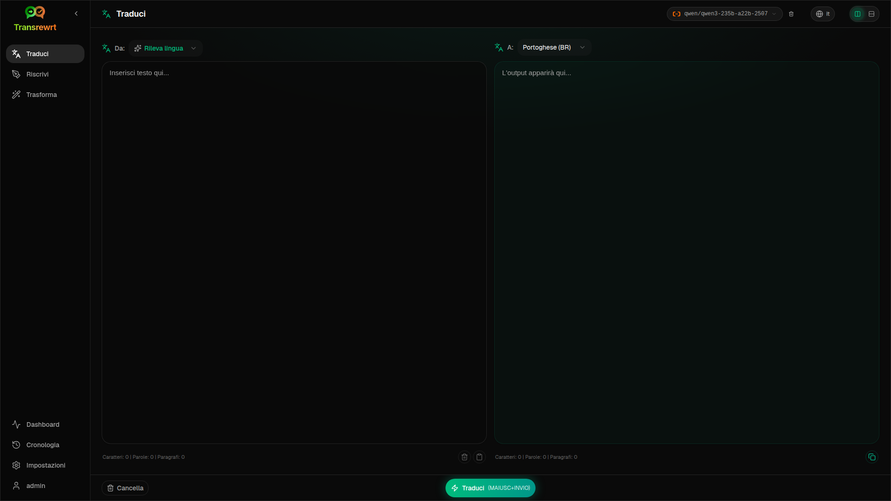

<p align="center">
  
</p>

<h1 align="center">Transrewrt</h1>

<p align="center">
  <a href="https://github.com/wsj-br/transrewrt/releases"></a>
  <a href="LICENSE"></a>
  
</p>

Strumento di testo basato sull'IA per **tradurre**, **riscrivere** e **trasformare** con prompt personalizzati. Utilizza i tuoi provider AI (OpenRouter, OpenAI, Anthropic, Google Gemini, DeepSeek, Groq, Mistral, xAI, Cerebras, NVIDIA, Alibaba Cloud, apikey.fun, endpoint compatibili con OpenAI e server locali come Ollama, LM Studio o llama.cpp). Esegui come app desktop (Windows / Linux / macOS) o app web Docker. Nessun account cloud Transrewrt.

## Caratteristiche

| Funzionalità | Descrizione |
| --- | --- |
| **Traduci** | Decine di lingue, rilevamento automatico, glossari, perfezionamento con Riformula |
| **Riscrittura** | Chiarezza, tono, lunghezza, ortografia e grammatica — stessa lingua |
| **Trasforma** | Prompt AI personalizzati che crei, modifichi e riutilizzi |
| **Distribuisci** | Desktop Electron o web Docker (amd64 e arm64) |
| **Chiavi** | I tuoi provider, il tuo host — Predefiniti facili o elenco di modelli avanzati |



<small>**Leggi in altre lingue:** </small>
<small id="lang-list">[English (UK)](../README.md) · [العربية](./README.ar.md) · [简体中文](./README.zh-Hans.md) · [繁體中文](./README.zh-Hant.md) · [Čeština](./README.cs.md) · [Nederlands](./README.nl.md) · [Français](./README.fr.md) · [Deutsch](./README.de.md) · [Ελληνικά](./README.el.md) · [हिन्दी](./README.hi.md) · [Magyar](./README.hu.md) · [Italiano](./README.it.md) · [日本語](./README.ja.md) · [한국어](./README.ko.md) · [فارسی](./README.fa.md) · [Polski](./README.pl.md) · [Português (Brasil)](./README.pt-BR.md) · [Română](./README.ro.md) · [Русский](./README.ru.md) · [Slovenčina](./README.sk.md) · [Español](./README.es.md) · [Svenska](./README.sv.md) · [ไทย](./README.th.md) · [Türkçe](./README.tr.md) · [Українська](./README.uk.md) · [Tiếng Việt](./README.vi.md)</small>

## Avvio rapido

**Docker**

```bash
docker pull ghcr.io/wsj-br/transrewrt:latest

docker run -d \
  -p 5000:5000 \
  -v transrewrt-data:/app/data \
  -e PROVIDER_API_KEY=your-key \
  --name transrewrt \
  ghcr.io/wsj-br/transrewrt:latest
```

Sostituisci `PROVIDER_API_KEY` con la variabile del tuo provider (ad esempio `OPENROUTER_API_KEY`, `OPENAI_API_KEY`, `GROQ_API_KEY`). Apri [http://localhost:5000](http://localhost:5000) e cambia la Password predefinita dell'Amministratore. Le chiavi sono impostate tramite variabili d'ambiente (non l'interfaccia utente web).

**Windows** — Scarica `Transrewrt Setup x.y.z.exe` da [Releases](https://github.com/wsj-br/transrewrt/releases), installa, quindi aggiungi le chiavi in **Impostazioni → API**.

**Linux** — Scarica il `.AppImage` da [Releases](https://github.com/wsj-br/transrewrt/releases), quindi:

```bash
chmod +x Transrewrt-x.y.z-x64.AppImage && ./Transrewrt-x.y.z-x64.AppImage
```

**macOS** — Scarica il `.dmg` per il tuo Mac da [Releases](https://github.com/wsj-br/transrewrt/releases): `arm64` per Apple Silicon, `x64` per Intel. Apri l'immagine disco e trascina Transrewrt in Applicazioni.

La build non è firmata, quindi Gatekeeper blocca il primo avvio. Fai clic destro su `Transrewrt.app` e scegli **Apri**, quindi conferma **Apri**. Oppure cancella l'attributo di quarantena:

```bash
xattr -dr com.apple.quarantine /Applications/Transrewrt.app
```

Dettagli della piattaforma (Compose, SmartScreen, librerie apt, flag GPU, fuso orario): [Documentazione di avvio rapido](https://wsj-br.github.io/transrewrt/docs/quick-start/).

## Documentazione

Documentazione completa del prodotto (installazione, chiavi API, guide, impostazioni, risoluzione dei problemi):

**[https://wsj-br.github.io/transrewrt/docs/](https://wsj-br.github.io/transrewrt/docs/)**

- [Chiave API](https://wsj-br.github.io/transrewrt/docs/api-key/)
- [Configurazione](https://wsj-br.github.io/transrewrt/docs/configuration/)
- [Traduci](https://wsj-br.github.io/transrewrt/docs/translate/) · [Riscrittura](https://wsj-br.github.io/transrewrt/docs/rewrite/) · [Trasforma](https://wsj-br.github.io/transrewrt/docs/transform/)
- [Problemi comuni](https://wsj-br.github.io/transrewrt/docs/common-issues/)

## Sviluppo

- Configurazione, build, test, distribuzione: [dev/DEVELOPMENT.md](../dev/DEVELOPMENT.md)
- Panoramica dell'architettura: [dev/SYSTEM-OVERVIEW.md](../dev/SYSTEM-OVERVIEW.md)

## Supporto

Apri un problema su [GitHub](https://github.com/wsj-br/transrewrt/issues). Includi la tua piattaforma (Windows / Linux / macOS / Docker) e la versione dell'app (finestra di dialogo Informazioni o pagina Releases).

## Riconoscimenti

I suggerimenti preimpostati in modalità Easy nell'editor dei preset utilizzano dati di valutazione pubblici
solo sulla macchina del manutentore. Nessun contenuto del dataset viene ridistribuito con Transrewrt:

- [languagebench](https://huggingface.co/spaces/fair-forward/languagebench) (CC BY-SA 4.0) — traduzione ChrF
- [Arena](https://huggingface.co/datasets/lmarena-ai/leaderboard-dataset) (CC BY 4.0) — Arena Score
- [models.dev](https://models.dev/) (MIT)

Le licenze delle dipendenze di terze parti e queste note sulle origini dei dati sono elencate in [NOTICES](../NOTICES).

## Licenza

Diritti d'autore © 2026 Waldemar Scudeller Jr.

[Apache License 2.0](../LICENSE)

<br/>

I nomi e le icone dei prodotti appartengono ai rispettivi proprietari e vengono utilizzati solo a scopo identificativo. Questo software non è affiliato o approvato da tali marchi.

<small>

> **Nota sulle traduzioni dell'interfaccia utente e della documentazione:** Tutte le lingue dell'interfaccia e della documentazione, ad eccezione dell'inglese (Regno Unito), sono state tradotte con l'IA utilizzando [ai-i18n-tools](https://wsj-br.github.io/ai-i18n-tools/); la formulazione potrebbe essere imprecisa o contenere errori.

</small>
