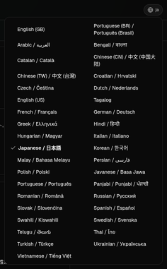
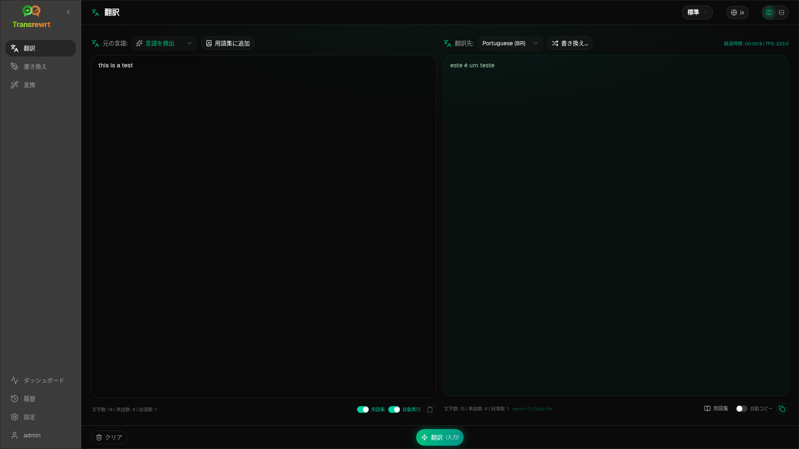
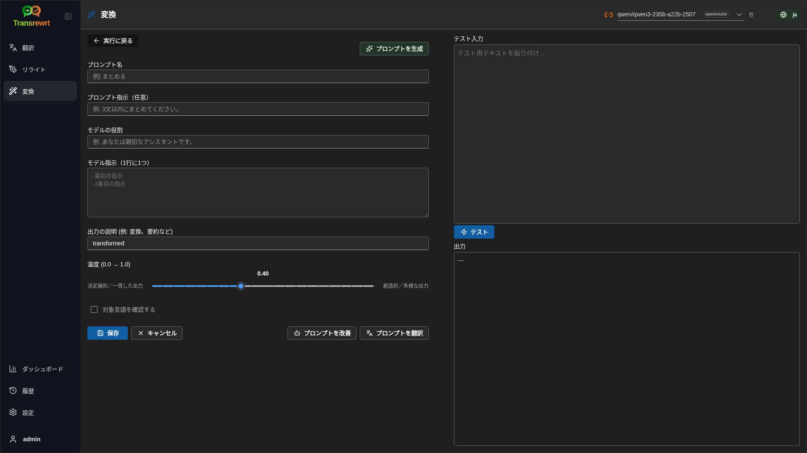
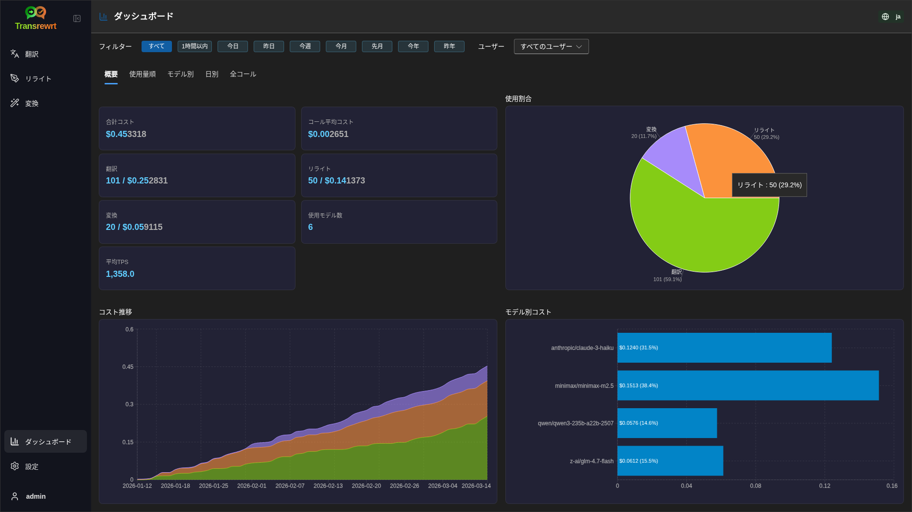
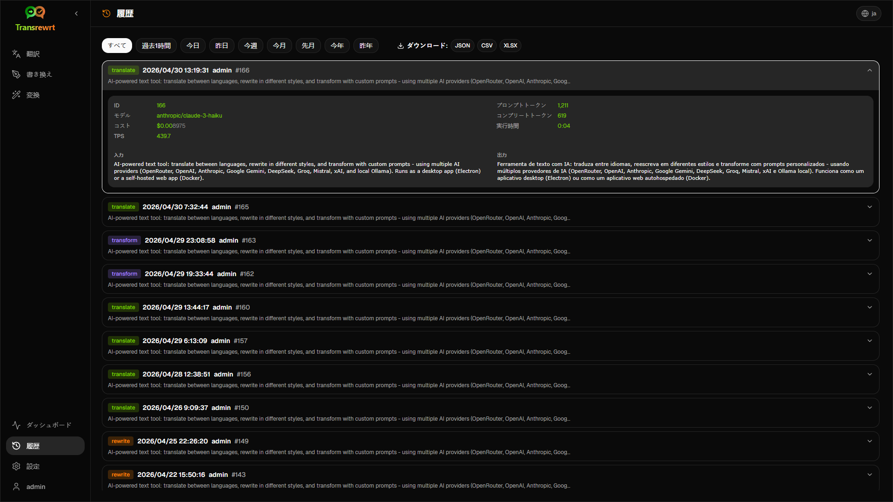
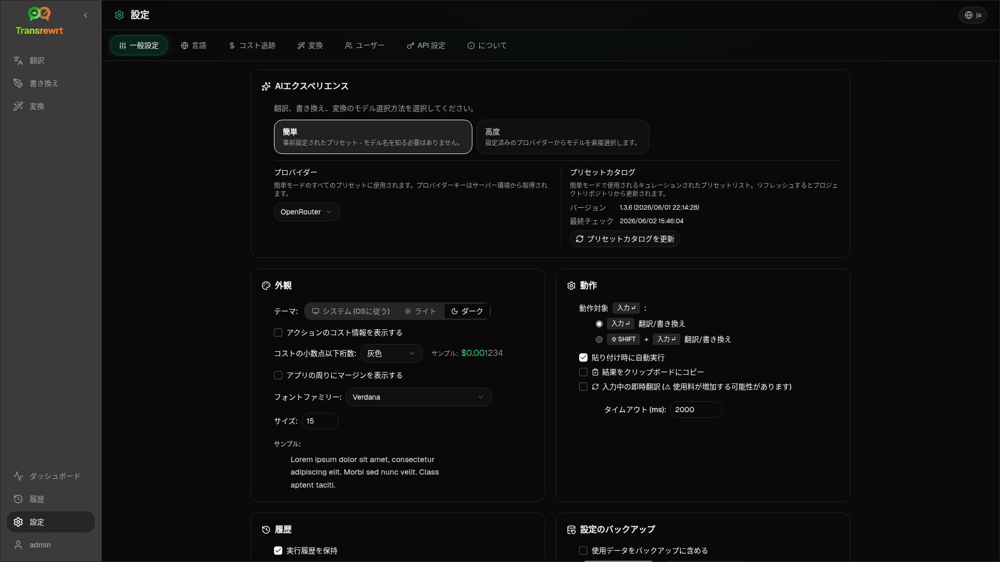

<p align="center">
  
</p>

<p align="center">
  <a href="https://github.com/wsj-br/transrewrt/releases"></a>
  <a href="LICENSE"></a>
  
  
  
</p>

AI搭載のテキストツール：複数のAIプロバイダー（OpenRouter、OpenAI、Anthropic、Google Gemini、DeepSeek、Groq、Mistral、xAI、およびローカルOllama）を使用して、言語間の翻訳、スタイルの書き直し、カスタムプロンプトによる変換が可能。デスクトップアプリ（Electron）またはセルフホスト型Webアプリ（Docker）として動作。

- **翻訳** - 数十の言語間で翻訳。ソース言語は自動検出
- **書き換え** - 文法の修正、明確さの向上、フォーマル/インフォーマルへの調整、短縮、拡張、技術的な表現への変換など
- **変換** - カスタムAIプロンプト。プロンプトの作成と管理が可能。プロンプトごとに任意のターゲット言語を指定可能
- **履歴** - 入力テキストと出力テキストを含む完全な実行履歴。フィルタリングおよびエクスポート機能付き
- **かんたん & 高度** - かんたんモード（デフォルト）: プロバイダーごとの選定済みプリセット（**無料 (OpenRouter)**、**標準**、**高度**、**技術的**；選択したプロバイダーにマッピングがあるプリセットのみ表示）で、モデルIDを選択する必要なし。高度モード: 設定済みプロバイダーからの完全なモデル一覧
- **モデル & コスト** - コストおよび使用状況のダッシュボード（概要、モデル別、すべての呼び出し）とエクスポート機能。OpenRouterは実際の支出を表示し、他のプロバイダーは推定値を使用
- **UI** - 多言語インターフェイス（30以上の言語、RTL対応）、フォント、…
- **Webモード** - 管理者ロール付きの複数ユーザー対応
- **Desktop** - WindowsおよびLinux向けElectronアプリ
- **セルフホスト** - amd64およびarm64向けDockerイメージ（Raspberry Pi対応）

インストール後は、すべての機能の詳細な説明について、[**ユーザーガイド**](USER-GUIDE.ja.md)を参照してください。

<small>**他の言語で読む：** </small>
<small id="lang-list">[English (GB)](../README.md) · [Português (Brasil)](./README.pt-BR.md) · [العربية](./README.ar.md) · [বাংলা](./README.bn.md) · [Català](./README.ca.md) · [中文 (中国大陆)](./README.zh-CN.md) · [中文 (台灣)](./README.zh-TW.md) · [Hrvatski](./README.hr.md) · [Čeština](./README.cs.md) · [Nederlands](./README.nl.md) · [English (US)](./README.en-US.md) · [Tagalog](./README.tl.md) · [Français](./README.fr.md) · [Deutsch](./README.de.md) · [Ελληνικά](./README.el.md) · [हिन्दी](./README.hi.md) · [Magyar](./README.hu.md) · [Italiano](./README.it.md) · [日本語](./README.ja.md) · [한국어](./README.ko.md) · [Bahasa Melayu](./README.ms.md) · [فارسی](./README.fa.md) · [Polski](./README.pl.md) · [Basa Jawa](./README.jv.md) · [Português](./README.pt.md) · [ਪੰਜਾਬੀ](./README.pa.md) · [Română](./README.ro.md) · [Русский](./README.ru.md) · [Slovenčina](./README.sk.md) · [Español](./README.es.md) · [Kiswahili](./README.sw.md) · [Svenska](./README.sv.md) · [తెలుగు](./README.te.md) · [ไทย](./README.th.md) · [Türkçe](./README.tr.md) · [Українська](./README.uk.md) · [Tiếng Việt](./README.vi.md)</small>

<small>

> **UIおよびドキュメント翻訳に関する注意：** 英語（UK）以外のすべてのインターフェース言語はAIモデルで翻訳されています。表現が不正確または誤りを含む可能性があります。

</small>

<br/>

<a id="table-of-contents"></a>
## 目次

<!-- START doctoc generated TOC please keep comment here to allow auto update -->
<!-- DON'T EDIT THIS SECTION, INSTEAD RE-RUN doctoc TO UPDATE -->

- [スクリーンショット](#screenshots)
- [クイックスタート](#quick-start)
- [OpenRouter APIキーの取得方法](#getting-an-openrouter-api-key)
- [設定と環境](#configuration-and-environment)
- [開発とアーキテクチャ](#development-and-architecture)
- [問題の報告](#reporting-issues)
- [免責事項](#disclaimer)
- [ライセンス](#license)

<!-- END doctoc generated TOC please keep comment here to allow auto update -->

<br/><br/>

<a id="screenshots"></a>
## スクリーンショット

**言語セレクター**



**翻訳**



**変換 - プロンプトエディター**



**ダッシュボード**



**履歴**



**設定 - モデル選択**



<br/><br/>

<a id="quick-start"></a>
## クイックスタート

<details>
<summary><b>Docker (自己ホスティングにはDockerが推奨)</b></summary>

<a id="docker"></a>

<br/>

```bash
docker pull ghcr.io/wsj-br/transrewrt:latest

OPENROUTER_API_KEY=sk-or-your-key docker run -d \
  -p 5000:5000 \
  -v transrewrt-data:/app/data \
  -e OPENROUTER_API_KEY \
  --name transrewrt-web \
  ghcr.io/wsj-br/transrewrt:latest
```

`sk-or-your-key`を[OpenRouter APIキー](https://openrouter.ai/keys)に置き換えてください（または他のプロバイダーのキーを設定してください。[構成](#configuration-and-environment)を参照）。[http://localhost:5000](http://localhost:5000)を開き、サービスを外部に公開する前に既定の管理者パスワードを変更してください。

環境変数経由で少なくとも1つのプロバイダーのキーを設定してください（例: OpenRouterの場合は`OPENROUTER_API_KEY`）。`-e`または`docker compose` / `.env`で変数を渡すことで、シークレットがイメージに組み込まれるのを防げます。プロバイダーのキーはウェブUIでは**入力しません**。サーバーは環境変数から読み取ります。

<br/>

> ℹ️ **注意**<br/>
> Dockerでは、LLMの認証情報は`OPENROUTER_API_KEY`、`OPENAI_API_KEY`、`CEREBRAS_API_KEY`、…といった環境変数で設定します（ウェブUIではありません）。デスクトップ版（Electron）では、**設定 → API**でキーを設定します。

<br/>

またはDocker Composeを使用します。

```bash
# download the compose file
wget https://github.com/wsj-br/transrewrt/raw/refs/heads/master/production.yml -O transrewrt.yml
# Edit the file to add your API keys (API_KEYs), or uncomment and adjust the `.env` file. Set the timezone (TZ) if necessary.
vi transrewrt.yml
# start the container
docker compose -f transrewrt.yml up -d
```

すべての環境変数（`PORT`、`CONFIG_PATH`、`TZ`、およびLLMキー（`OPENROUTER_API_KEY`、`OPENAI_API_KEY`、…）など）については、[構成](#configuration-and-environment)を参照してください。

</details>

<br/>

<details>
<summary><b>サーバーのタイムゾーン（Docker）</b></summary>

<a id="configuring-the-timezone"></a>

<br/>

アプリケーションのユーザーインターフェースの日時表示は、**ブラウザーの**ロケールとタイムゾーンに従います。**サーバー側**の動作（ログ記録など）については、コンテナは`TZ`環境変数を使用します。デフォルトは`TZ=Europe/London`です。

別のタイムゾーンを使用するには、Composeファイルで`TZ`を設定してください。例:

```yaml
environment:
  - TZ=America/Sao_Paulo
```

またはコンテナ実行時に渡します（Docker）:

```bash
--env TZ=America/Sao_Paulo
```

多くのLinuxホストでは、以下のコマンドでシステムのタイムゾーン名をコピーできます:

```bash
echo TZ=\"$(</etc/timezone)\"
```

有効なタイムゾーン名の一覧は[tzデータベース](https://en.wikipedia.org/wiki/List_of_tz_database_time_zones)（Wikipedia）で管理されています。

</details>

<br/>

<details>
<summary><b>Windows</b></summary>

<a id="windows-electron"></a>

<br/>

- 最新の`Transrewrt Setup x.y.z.exe`を[リリース](https://github.com/wsj-br/transrewrt/releases)からダウンロードしてください。
- `.exe`を実行し、インストーラーに従ってください。
- 初回起動時: スタートメニューまたはデスクトップのショートカットからアプリを起動します。
- **設定 → API**でAPIキーを入力してください。少なくとも1つのプロバイダーを設定する必要があります。無料のモデルを利用するにはOpenRouterが一般的です。

<br/>

> ℹ️ **NOTE**<br/>
> Windowsは、これらのセキュリティ警告のいずれかを表示する場合があります（署名されていない/インディーアプリに対しては通常のことです）：
>   - **ユーザーアカウント制御 (UAC)**: "不明な発行者のこのアプリがデバイスに変更を加えることを許可しますか？" → **はい**をクリックします。
>   - **Microsoft Defender SmartScreen**: "WindowsがあなたのPCを保護しました" → **詳細情報**をクリック → **それでも実行**をクリックします。
>
> これは、アプリがMicrosoftまたは主要な発行者によって署名されていないために発生しますが、公式のGitHubリリースからダウンロードした場合は安全です（各アセットに対して[リリース](https://github.com/wsj-br/transrewrt/releases)ページでチェックサムを確認してください）。

<br/>

</details>

<br/>

<details>
<summary><b>Linux</b></summary>

<a id="linux-electron"></a>

<br/>

[リリース](https://github.com/wsj-br/transrewrt/releases) からお使いのCPU用の `.AppImage` をダウンロードしてください（一般的なPC向けは `x64`、Raspberry Pi 4+を含む多くのARMデバイス向けは `arm64`）。その後：

```bash
chmod +x Transrewrt-x.y.z-x64.AppImage && ./Transrewrt-x.y.z-x64.AppImage
```

x86_64/amd64では`x64`というファイル名を使用してください。ARM64では`...-arm64.AppImage`という名前を使用します。

APIキーは**設定 → API**で入力してください。少なくとも1つのプロバイダーを設定する必要があります。無料モデルを利用する場合、OpenRouterがよく使われます。

**コンソールメッセージ：** パッケージ化されたLinuxビルド（`x64`および`arm64` AppImages）は、端末でのNodeの非推奨警告（たとえば組み込みの`punycode`モジュールに関するもの）を抑制します。Chromiumが「GLES3はサポートされていません」などのGPU / EGLエラーを出力してもアプリが動作する場合は、ハードウェアアクセラレーションを無効にしてこれらのメッセージを抑制できます：

```bash
TRANSREWRT_DISABLE_GPU=1 ./Transrewrt-x.y.z-arm64.AppImage
```

これはamd64でも同様に適用されます。ダウンロードしたファイルに合わせてファイル名を変更してください。

Debian/Ubuntuでは、Chromiumに必要な追加の**ランタイム**ライブラリが必要になる場合があります（フルデスクトップ環境では既にインストールされていることが多いです）。必要に応じて以下のコマンドを実行してください：

```bash
sudo apt update
sudo apt install -y libfuse2 libgtk-3-0 libnotify4 libnss3 libnspr4 libxss1 libxtst6 xdg-utils \
     xauth libatspi2.0-0 libdrm2 libgbm1 libxcb-dri3-0 libcups2 libasound2t64
```

`libasound2t64`を`libasound2`に置き換えて、`arm64`用にしてください。最小構成またはカスタムインストールでは、`.so`ファイルが見つからないエラーで失敗する場合があります。エラーメッセージに表示されたパッケージ名をインストールしてください（よく使われる追加パッケージ：`libatk1.0-0`、`libatk-bridge2.0-0`、`libgbm1`、`libdrm2`）。環境によっては、`APPIMAGE_EXTRACT_AND_RUN=1 ./Transrewrt-….AppImage`を使ってアプリを実行する必要があるかもしれません。

<br/>

> ℹ️ **注意**<br/>
> 現在、macOSはサポートされていません。TransrewrtはWindows、Linux、Docker向けに利用可能です。

</details>

<br/>

アプリが起動したら、[**ユーザーガイド**](USER-GUIDE.ja.md)を参照して、テキストの翻訳、書き換え、変換の方法、プロンプトの管理、モデルの設定方法を確認してください。

<br/><br/>

<a id="getting-an-openrouter-api-key"></a>
## OpenRouterのAPIキーを取得する

Transrewrtは複数のAIプロバイダーをサポートしています。[OpenRouter](https://openrouter.ai)は、多数のモデルを1つのキーで利用でき、無料モデルも提供しているため、人気の選択肢です。

1. [openrouter.ai](https://openrouter.ai)でサインアップまたはログインします。
2. [Keys](https://openrouter.ai/keys)ページを開き、新しいキーを作成します（名前を付け、必要に応じてクレジットの上限を設定できます）。クレジットを追加せずに無料モデルを使用できます。
3. **デスクトップ（Electron）：** キーを**設定 → API**に貼り付けます。**Docker：** `OPENROUTER_API_KEY`などの環境変数を設定します（[クイックスタート](#quick-start)を参照）。

翻訳、書き直し、変換には、OpenRouterの**Body Builder**モデル（[`openrouter/bodybuilder`](https://openrouter.ai/openrouter/bodybuilder)）を使用しないでください。このモデルはそれらのタスクの完了したテキストではなく、JSONリクエストペイロードを返します。詳しくはユーザーガイドの[設定 → モデル](USER-GUIDE.ja.md#models)を参照してください。

他のプロバイダー（OpenAI、Anthropic、Google Gemini、DeepSeek、Groq、Mistral、xAI、Cerebras）を使用したり、[Ollama](https://ollama.com)を使ってローカルでモデルを実行することもできます。サポートされているプロバイダーと環境変数の完全なリストについては、[設定](#configuration-and-environment)を参照してください。

</br>

> ⚠️ **警告**<br/>
> 別のデバイス、コンテナ、またはサービスからOllamaを使用する場合は、Ollamaを外部接続（localhostのみではない）を許可するように設定することを忘れないでください。

<br/><br/>

<a id="configuration-and-environment"></a>
## 設定と環境

</br>

**設定ファイルの場所**

| デプロイメント         | 設定ファイルの場所                                   |
| ------------------ | ------------------------------------------------- |
| Electron (Windows) | `%APPDATA%\transrewrt\`                           |
| Electron (Linux)   | `~/.config/transrewrt/`                           |
| Web / Docker       | `/app/data/config.json` (永続化にはボリュームを使用) |

<br/>

**環境変数** (Web / Docker のみ対象。Electron はローカルの設定ファイルを使用)

| 変数             | 説明                                                                  |
|----------------------|------------------------------------------------------------------------------|
| `PORT`               | サーバーのリスンポート（デフォルトは `5000`）                                  |
| `CONFIG_PATH`        | 設定ファイルのパス（デフォルトは `/app/data/config.json`）                |
| `TZ`                 | サーバー側のタイムゾーン（ログなど用。デフォルトは `Europe/London`） |
| `HISTORY_DISABLED`   | 履歴の実行をオフに強制（オプション、デフォルトは `false`）                  |
| `OPENROUTER_API_KEY` | OpenRouter APIキー                                                           |
| `OPENAI_API_KEY`     | OpenAI APIキー                                                               |
| `CEREBRAS_API_KEY`   | Cerebras APIキー                                                             |
| `ANTHROPIC_API_KEY`  | Anthropic APIキー                                                            |
| `GOOGLE_API_KEY`     | Google Gemini APIキー                                                        |
| `DEEPSEEK_API_KEY`   | DeepSeek APIキー                                                             |
| `GROQ_API_KEY`       | Groq APIキー                                                                 |
| `MISTRAL_API_KEY`    | Mistral APIキー                                                              |
| `OLLAMA_URL`         | OllamaのベースURL（例: `http://host.docker.internal:11434`）                   |
| `XAI_API_KEY`        | xAI API キー                                                                  |

**プライバシーモード：** `config.json` やユーザーごとの設定に関係なく、履歴の記録を強制的にオフにするには、**web/Dockerサーバープロセス** および／または **Electronデスクトップメインプロセス** に対して `HISTORY_DISABLED` を `true` または `1`（大文字小文字を区別しない）に設定します（例：システムまたはランチャの環境 — レンダラープロセス単体ではなく）。これにより、入力／出力履歴の保存が無効になり、**設定 → 一般設定 → 履歴** がロックされ、履歴関連のAPIがブロックされます。

使用するプロバイダーのみを設定してください。モデルIDは名前空間付きです（`openrouter/…`、`openai/…`、`cerebras/…`、`ollama/…`など）。

**コスト表示：** OpenRouterは該当する場合、請求された正確なコストを返します。その他のプロバイダーは、OpenRouterキーが利用可能な場合、OpenRouterの公開モデル価格に基づく**推定**コストを使用します。キーがない場合、OpenRouter以外のコストは`0`と表示されることがあります。推定値は請求書ではありません。

<br/>

**データと永続性：** Dockerの場合、`/app/data`にボリュームをマウントして、`config.json`およびSQLiteデータベースがコンテナの再起動後も保持されるようにしてください。ボリュームがない場合、コンテナ停止時にすべてのデータが失われます。

<br/>

**Web認証：**

- デフォルト管理者： `admin` / `transrewrt26`。
- ユーザーの管理は**設定 → ユーザー**から行えます。
- パスワードのリセット： `docker exec <container> reset-web-password '<username>' '<new-password>'`

<br/>

> ⚠️ **警告**<br/>
> 任意のネットワークアクセス可能なホストでは、直ちにデフォルトの管理者パスワードを変更してください。

<br/>

キー設定（フォント、モデル、言語など）は、アプリケーションの「設定」で利用できます。

<br/><br/>

<a id="development-and-architecture"></a>
## 開発およびアーキテクチャ

- **開発:** セットアップ、ビルド、テスト、デプロイ（Electron、Web、Docker）- 詳細は [dev/DEVELOPMENT.md](../dev/DEVELOPMENT.md) を参照。
- **アーキテクチャとシステム概要:** フォルダ構造、技術スタック、設計上の意思決定 - 詳細は [dev/SYSTEM-OVERVIEW.md](../dev/SYSTEM-OVERVIEW.md) を参照。

<br/><br/>

<a id="reporting-issues"></a>
## 問題の報告

[GitHub](https://github.com/wsj-br/transrewrt/issues)で問題を登録してください。使用しているプラットフォーム（Windows / Linux / Docker）およびアプリのバージョン（「情報」ダイアログまたはリリースページに表示）を含めてください。

<br/><br/>

<a id="disclaimer"></a>
## 免責事項

製品名およびアイコンはそれぞれの所有者に帰属し、識別目的でのみ使用されています。本ソフトウェアは、記載されているブランドと提携しているものではなく、それらのブランドによる推奨も受けていません。

<br/><br/>

<a id="license"></a>
## ライセンス

Copyright © 2026 Waldemar Scudeller Jr.

[Apache License 2.0](../LICENSE)
