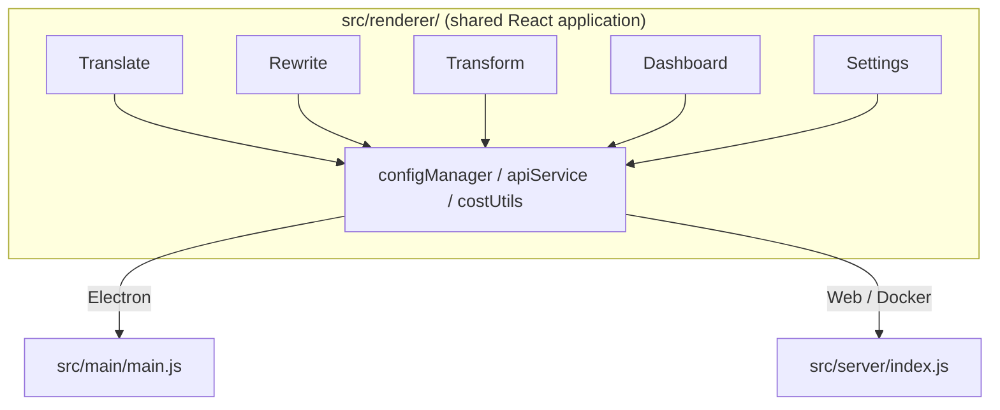

<p align="center">
  
</p>

<h1 align="center">Transrewrt</h1>

<p align="center">
  <a href="https://github.com/wsj-br/transrewrt/releases"></a>
  <a href="LICENSE"></a>
  
  
  
</p>

AIを活用したテキストツール：言語間の翻訳、異なるスタイルでの書き換え、カスタムプロンプトによる変換 - すべて[OpenRouter](https://openrouter.ai)経由で。デスクトップアプリ（Electron）またはセルフホスト型Webアプリ（Docker）として実行。

- **翻訳** - 数十の言語間で、自動ソース検出機能付き
- **書き換え** - 文法修正、明確性向上、正式/非正式、短縮、拡張、技術的
- **変換** - カスタムAIプロンプト；プロンプトの作成と管理、プロンプトごとのオプションの対象言語
- **モデルとコスト** - 任意のOpenRouterモデルを選択；SQLiteログ付きコストダッシュボード、モデル/操作/日ごとのサマリー
- **UI** - i18n (pt-BR, de, fr, es, RTL), テーマ, フォント, キーボードショートカット；安全なWebモード（APIキーはサーバーのみ）
- **デスクトップ** - WindowsとLinux用のElectronアプリ
- **セルフホスト** - amd64およびarm64用Dockerイメージ（Raspberry Pi対応）

インストール後、すべての機能の詳細なガイドについては[ユーザーガイド](../USER-GUIDE.md)をご覧ください。

<small>**他の言語で読む：** [English (UK)](../README.md) · [Português (BR)](README.pt-BR.md) · [العربية](README.ar.md) · [বাংলা](README.bn.md) · [Català](README.ca.md) · [简体中文](README.zh-CN.md) · [繁體中文](README.zh-TW.md) · [Hrvatski](README.hr.md) · [Čeština](README.cs.md) · [Nederlands](README.nl.md) · [English (US)](README.en-US.md) · [Filipino](README.tl.md) · [Français](README.fr.md) · [Deutsch](README.de.md) · [Ελληνικά](README.el.md) · [हिन्दी](README.hi.md) · [Magyar](README.hu.md) · [Italiano](README.it.md) · [日本語](README.ja.md) · [Basa Jawa](README.jv.md) · [한국어](README.ko.md) · [Bahasa Melayu](README.ms.md) · [فارسی](README.fa.md) · [Polski](README.pl.md) · [Português (PT)](README.pt.md) · [ਪੰਜਾਬੀ](README.pa.md) · [Română](README.ro.md) · [Русский](README.ru.md) · [Slovenčina](README.sk.md) · [Español](README.es.md) · [Kiswahili](README.sw.md) · [Svenska](README.sv.md) · [తెలుగు](README.te.md) · [ภาษาไทย](README.th.md) · [Türkçe](README.tr.md) · [Українська](README.uk.md) · [Tiếng Việt](README.vi.md)</small>

<a id="screenshots"></a>
## スクリーンショット

**言語セレクター**


**翻訳**


**変換 - プロンプトエディター**


**コストダッシュボード**


**設定 - モデル選択**


<br /><br />

<a id="table-of-contents"></a>
## 目次

<!-- START doctoc generated TOC please keep comment here to allow auto update -->
<!-- DON'T EDIT THIS SECTION, INSTEAD RE-RUN doctoc TO UPDATE -->

- [クイックスタート](#quick-start)
- [インストール](#installation)
  - [Windows (Electron)](#windows-electron)
  - [Linux (Electron)](#linux-electron)
  - [Docker](#docker)
- [OpenRouter APIキーの取得](#getting-an-openrouter-api-key)
- [設定と環境](#configuration-and-environment)
- [開発とアーキテクチャ](#development-and-architecture)
- [リリースとタグ](#releases-and-tags)
- [貢献](#contributing)
- [免責事項](#disclaimer)
- [ライセンス](#license)

<!-- END doctoc generated TOC please keep comment here to allow auto update -->

<br /><br />

<a id="quick-start"></a>

## クイックスタート

**Docker（セルフホスティング推奨）**

```bash
docker pull ghcr.io/wsj-br/transrewrt:latest

API_KEY=sk-or-your-key docker run -d \
  -p 5000:5000 \
  -v transrewrt-data:/app/data \
  -e API_KEY \
  --name transrewrt-web \
  ghcr.io/wsj-br/transrewrt:latest
```

`sk-or-your-key` をあなたの [OpenRouter API キー](https://openrouter.ai/keys) に置き換えてください。[http://localhost:5000](http://localhost:5000) を開き、デフォルトの管理者パスワードを変更してから、サービスを外部に公開してください。

<br />

> ℹ️ **注意**<br/>
> Docker では、OpenRouter API キーは `API_KEY` 環境変数経由でのみ設定されます（Web UI では設定できません）。デスクトップ版（Electron）では、**設定 → API** に貼り付けてください。

<br />

**Windows**

[リリース](https://github.com/wsj-br/transrewrt/releases) から最新の `Transrewrt Setup x.y.z.exe` をダウンロードし、インストーラーを実行してください。その後、スタートメニューまたはデスクトップショートカットから起動します。**設定 → API** に OpenRouter API キーを入力してください。

<br />

**Linux**

[リリース](https://github.com/wsj-br/transrewrt/releases) から `.AppImage` をダウンロードし、以下の手順に従ってください：

```bash
chmod +x Transrewrt-x.y.z.AppImage && ./Transrewrt-x.y.z.AppImage
```

**設定 → API** に OpenRouter API キーを入力してください。Debian/Ubuntu では、まず追加の依存関係をインストールする必要がある場合があります：

```bash
sudo apt install libgtk-3-0 libnotify-dev libnss3 libxss1 libasound2 libxtst6 xauth
```

詳細は [インストール → Linux (#linux-electron)](#linux-electron) を参照してください。

<br />

> ℹ️ **注意**<br/>
> 現在 macOS はサポートされていません。Transrewrt は Windows、Linux、Docker で利用可能です。

<br />

アプリが起動したら、**[ユーザーガイド](../USER-GUIDE.md)** を参照して、テキストの翻訳、書き換え、変換方法や、プロンプトの管理、モデルの設定方法を学んでください。

<br /><br />

<a id="installation"></a>
## インストール

<a id="windows-electron"></a>
### Windows (Electron)

- [リリース](https://github.com/wsj-br/transrewrt/releases) から最新のインストーラーをダウンロードしてください。
- `.exe` ファイルを実行し、インストーラーの指示に従ってください。
- 初回起動：スタートメニューまたはデスクトップショートカットからアプリを起動します。設定は `%APPDATA%\transrewrt\` に保存されます。

<br />

<a id="linux-electron"></a>
### Linux (Electron)

- [リリース](https://github.com/wsj-br/transrewrt/releases) から `.AppImage` をダウンロードしてください。
- 実行方法: `chmod +x Transrewrt-x.y.z.AppImage && ./Transrewrt-x.y.z.AppImage`
- 追加の依存関係（Debian/Ubuntu）: `sudo apt install libgtk-3-0 libnotify-dev libnss3 libxss1 libasound2 libxtst6 xauth`
- 詳細は [dev/DEVELOPMENT.md](../dev/DEVELOPMENT.md) を参照してください。

<br />

<a id="docker"></a>
### Docker

- イメージの取得: `docker pull ghcr.io/wsj-br/transrewrt:latest`
- OpenRouter API キーは `API_KEY` 環境変数経由で**必ず**設定してください。`-e API_KEY` を使用して渡すか（または `docker compose` / `.env` 経由で）、プロセス一覧にキーが表示されないようにします。
- API キーは Web UI では入力できません。

例 - 永続化用の名前付きボリューム（API キーは環境変数経由で渡し、コマンドラインには直接記述しない）：

```bash
API_KEY=sk-or-your-key docker run -d \
  -p 5000:5000 \
  -v transrewrt-data:/app/data \
  -e API_KEY \
  --name transrewrt-web \
  ghcr.io/wsj-br/transrewrt:latest
```

<br />

| オプション   | 説明                                                                                                   |
| ------------ | ----------------------------------------------------------------------------------------------------- |
| ポート       | `5000`（`-p 5000:5000` でマッピング）                                                                  |
| ボリューム   | 設定とデータベースの永続化のために `/app/data` をマウント                                              |
| 環境変数     | `PORT`, `CONFIG_PATH`, `API_KEY`, `API_URL`, `KEY_SEED` - [設定と環境変数](#configuration-and-environment) を参照 |

ソースからビルドして実行するには: `docker compose up --build -d` または `pnpm run docker:up` - [dev/DEVELOPMENT.md](../dev/DEVELOPMENT.md) を参照してください。

<br /><br />

<a id="getting-an-openrouter-api-key"></a>
## OpenRouter API キーの取得方法

Transrewrt は AI モデルに [OpenRouter](https://openrouter.ai) を使用します。テキストを翻訳、書き換え、変換するには API キーが必要です。

1. [openrouter.ai](https://openrouter.ai) でサインアップまたはログインしてください。
2. [Keys](https://openrouter.ai/keys) ページを開き、新しいキーを作成してください（名前を付け、必要に応じてクレジット上限を設定）。クレジットを追加しなくても無料モデルを使用できます。
3. **デスクトップ版（Electron）:** キーを **設定 → API** に貼り付けてください。**Docker:** `API_KEY` 環境変数を設定してください（[クイックスタート](#quick-start) を参照）。

利用制限、BYOK（独自キー持ち込み）などの詳細は、[OpenRouter 認証](https://openrouter.ai/docs/api/reference/authentication) を参照してください。

<br /><br />

<a id="configuration-and-environment"></a>

## 設定と環境

**設定ファイルの配置場所**

| デプロイ環境 | 設定ファイルの場所 |
| ------------ | ------------------- |
| Electron (Windows) | `%APPDATA%\transrewrt\` |
| Electron (Linux)   | `~/.config/transrewrt/` |
| Web / Docker       | `/app/data/config.json` (ボリュームを使用して永続化) |

<br />

**環境変数**（Web / Docker のみ; Electron はローカル設定ファイルを使用）

| 変数名 | デフォルト | 説明 |
| ------ | ---------- | ---- |
| `PORT` | `5000` | サーバーがリッスンするポート |
| `CONFIG_PATH` | `/app/data/config.json` | 設定ファイルへのパス |
| `API_KEY` | `*(なし)*` | OpenRouter API キー（Docker で必須; 環境変数で設定、UI では設定不可） |
| `API_URL` | `https://openrouter.ai/api/v1` | アップストリーム AI API のベース URL |
| `KEY_SEED` | `*(なし)*` | Transrewrt プロキシのキーシード（設定されている場合、設定ファイルを上書き） |

<br />

**データと永続性:** Docker の場合は、`/app/data` にボリュームをマウントして、`config.json` と SQLite データベースがコンテナの再起動後も保持されるようにしてください。ボリュームがない場合、コンテナが停止するとすべてのデータが失われます。

<br />

**Web 認証:**

- デフォルト管理者: `admin` / `transrewrt26`.
- ユーザー管理は **設定 → ユーザー** から行います。
- パスワードをリセット: `docker exec <container> reset-web-password '<username>' '<new-password>'`
  （ソースからの場合: `pnpm run reset-web-password -- <username> <new-password>`）

<br />

> ⚠️ **警告**<br/>
> ネットワークからアクセス可能なホストでは、すぐにデフォルトの管理者パスワードを変更してください。

<br />

**Transrewrt プロキシ（オプション）:** 設定 → API で **Transrewrt プロキシを使用** を有効にし、**キーシード** を設定し、**API URL** をプロキシベース URL に設定します。詳細は [dev/SYSTEM-OVERVIEW.md](../dev/SYSTEM-OVERVIEW.md) を参照してください。

主要な設定（テーマ、フォント、モデル、言語など）は設定ダイアログから利用するか、設定 JSON に直接編集できます。完全なリストとデフォルト値は [dev/DEVELOPMENT.md](../dev/DEVELOPMENT.md) に記載されています。

<br /><br />

<a id="development-and-architecture"></a>
## 開発とアーキテクチャ

- **開発:** セットアップ、ビルド、テスト、デプロイ（Electron、Web、Docker） - 詳細は **[dev/DEVELOPMENT.md](../dev/DEVELOPMENT.md)** を参照してください。
- **アーキテクチャとシステム概要:** フォルダ構成、技術スタック、設計判断、Transrewrt プロキシ - 詳細は **[dev/SYSTEM-OVERVIEW.md](../dev/SYSTEM-OVERVIEW.md)** を参照してください。



<br /><br />

<a id="releases-and-tags"></a>
## リリースとタグ

- **Git タグ** `v`*（例: `v1.0.10`）が [リリースワークフロー](.github/workflows/release.yml) をトリガーします。**GitHub Releases** には Windows インストーラー（`.exe`）と Linux AppImage が添付されます。
- **Docker イメージ** は `ghcr.io/wsj-br/transrewrt` に公開されます。イメージタグは Git バージョンと一致します（例: `v1.0.10` → `ghcr.io/wsj-br/transrewrt:1.0.10`）に加えて `latest` もあります。マルチアーキテクチャ: `linux/amd64` と `linux/arm64`（例: Raspberry Pi）に対応しています。

<br /><br />

<a id="contributing"></a>
## コントリビューション

1. リポジトリをフォークします。
2. 機能ブランチを作成します: `git checkout -b feature/my-feature`
3. 変更を明確なメッセージでコミットします。
4. プッシュし、`main` に対して Pull Request を開きます。

提出する前に、既存のコードスタイルに従い、Electron と Web モードの両方で変更をテストしてください。ビルドとテストの手順については [dev/DEVELOPMENT.md](../dev/DEVELOPMENT.md) を参照してください。

<br />

**問題の報告:** [GitHub](https://github.com/wsj-br/transrewrt/issues) に問題を作成してください。プラットフォーム（Windows / Linux / Docker）とアプリのバージョン（About ダイアログまたは Releases ページに表示）を含めてください。

<br /><br />

<a id="disclaimer"></a>

## 免責事項

製品名およびアイコンはそれぞれの所有者に帰属し、識別目的のみで使用されています。このソフトウェアは、記載されたいずれのブランドとも関連がなく、また承認されていません。

<br /><br />

<a id="license"></a>
## ライセンス

Copyright © 2026 Waldemar Scudeller Jr.

[Apache License 2.0](LICENSE)