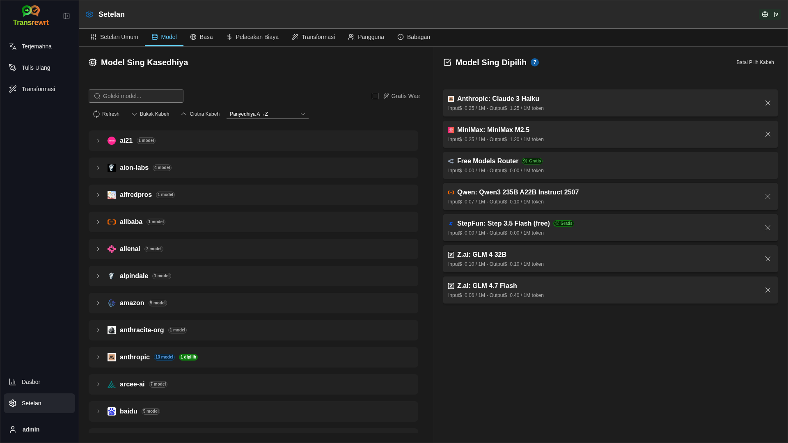

<p align="center">
  
</p>

<p align="center">
  <a href="https://github.com/wsj-br/transrewrt/releases"></a>
  <a href="LICENSE"></a>
  
  
  
</p>

Piranti teks dibantu AI: terjemahna antar basa, tulis ulang kanthi gaya sing beda, lan transformasi kanthi prompt custom - nggunakake panyedhiya AI akeh (OpenRouter, OpenAI, Anthropic, Google Gemini, DeepSeek, Groq, Mistral, xAI, lan lokal Ollama). Mligi dadi aplikasi desktop (Electron) utawa aplikasi web sing di-host dhewe (Docker).

- **Terjemahna** - antar puluhan basa, kanthi deteksi sumber otomatis
- **Tulis Ulang** - ndandani Tata Basa, ningkatake kejelasan, formal/informal, cekakke, ambakke, teknis
- **Transformasi** - prompt AI custom; gawe lan atur prompt, basa target opsional saben prompt
- **Riwayat** - riwayat eksekusi lengkap karo teks input/output, filter, lan ekspor
- **Model & biaya** - pilih model saka panyedhiya sing dikonfigurasi; dasbor biaya lan panggunaan karo log, ringkasan miturut model/operasi/dina
- **UI** - antarmuka multilingual (30+ basa, dukungan RTL), font, ...
- **Mode web** - dukungan multi-pangguna karo peran admin
- **Desktop** - aplikasi Electron kanggo Windows lan Linux
- **Di-host dhewe** - image Docker kanggo amd64 & arm64 (siap Raspberry Pi)

Sawise dipasang, delok **[Panduan Panganggo](USER-GUIDE.jv.md)** kanggo panduan lengkap kabeh fitur.

<small>**Maca ing basa liya:** </small>
<small id="lang-list">[English (UK)](../README.md) · [Português (BR)](README.pt-BR.md) · [العربية](README.ar.md) · [বাংলা](README.bn.md) · [Català](README.ca.md) · [简体中文](README.zh-CN.md) · [繁體中文](README.zh-TW.md) · [Hrvatski](README.hr.md) · [Čeština](README.cs.md) · [Nederlands](README.nl.md) · [English (US)](README.en-US.md) · [Filipino](README.tl.md) · [Français](README.fr.md) · [Deutsch](README.de.md) · [Ελληνικά](README.el.md) · [हिन्दी](README.hi.md) · [Magyar](README.hu.md) · [Italiano](README.it.md) · [日本語](README.ja.md) · [Basa Jawa](README.jv.md) · [한국어](README.ko.md) · [Bahasa Melayu](README.ms.md) · [فارسی](README.fa.md) · [Polski](README.pl.md) · [Português (PT)](README.pt.md) · [ਪੰਜਾਬੀ](README.pa.md) · [Română](README.ro.md) · [Русский](README.ru.md) · [Slovenčina](README.sk.md) · [Español](README.es.md) · [Kiswahili](README.sw.md) · [Svenska](README.sv.md) · [తెలుగు](README.te.md) · [ภาษาไทย](README.th.md) · [Türkçe](README.tr.md) · [Українська](README.uk.md) · [Tiếng Việt](README.vi.md)</small>

<small>

> **Catetan babagan terjemahan UI lan dokumentasi:** Kabeh basa antarmuka kajaba Inggris (UK) asli
> diterjemahake nggunakake model AI; basa bisa ora pas utawa ngandhut kesalahan.

</small>

<br/>

<a id="table-of-contents"></a>
## Tabel Isi

<!-- START doctoc generated TOC please keep comment here to allow auto update -->
<!-- DON'T EDIT THIS SECTION, INSTEAD RE-RUN doctoc TO UPDATE -->

- [Screenshot](#screenshots)
- [Quick start](#quick-start)
- [Njaluk kunci OpenRouter API](#getting-an-openrouter-api-key)
- [Konfigurasi lan lingkungan](#configuration-and-environment)
- [Pengembangan lan arsitektur](#development-and-architecture)
- [Nglaporake masalah](#reporting-issues)
- [Penegasan](#disclaimer)
- [Lisensi](#license)

<!-- END doctoc generated TOC please keep comment here to allow auto update -->

<br/><br/>

<a id="screenshots"></a>
## Tangkapan Layar

**Pilih basa**


**Terjemahna**


**Transformasi - editor prompt**


**Dasbor**


**Riwayat**


**Setelan - pilihan model**



<br/><br/>

<a id="quick-start"></a>
## Mulai Cepet

<details>
<summary><b>Docker (disaranke kanggo self-hosting)</b></summary>

<a id="docker"></a>

<br/>

```bash
docker pull ghcr.io/wsj-br/transrewrt:latest

OPENROUTER_API_KEY=sk-or-your-key docker run -d \
  -p 5000:5000 \
  -v transrewrt-data:/app/data \
  -e OPENROUTER_API_KEY \
  --name transrewrt-web \
  ghcr.io/wsj-br/transrewrt:latest
```

Ganti `sk-or-your-key` karo [kunci API OpenRouter](https://openrouter.ai/keys)) (atau setel kunci panyedhiya liya; delok [Konfigurasi](#configuration-and-environment)). Buka [http://localhost:5000](http://localhost:5000) lan owahi sandi admin standar sak durunge ngekspos layanan.

Setel paling siji kunci panyedhiya liwat lingkungan (umpamane `OPENROUTER_API_KEY` kanggo OpenRouter). Pass variabel karo `-e` utawa `docker compose` / `.env` supaya rahasia ora dibake ing gambar. Kunci panyedhiya **ora** dilebokake ing UI web; server maca saka lingkungan.

<br/>

> ℹ️ **CATETAN**<br/>
> Ing Docker, kredensial LLM diatur nganggo variabel lingkungan kaya `OPENROUTER_API_KEY`, `OPENAI_API_KEY`, `CEREBRAS_API_KEY`, … (ora ing UI web). Ing desktop (Electron) sampeyan ngonfigurasi kunci ing **Setelan → API**.

<br/>

Utawa nggunakake Docker Compose:

```
# download the compose file
wget https://github.com/wsj-br/transrewrt/raw/refs/heads/master/production.yml -O transrewrt.yml
# Edit the file to add your API keys (API_KEYs), or uncomment and adjust the `.env` file. Set the timezone (TZ) if necessary.
vi transrewrt.yml
# start the container
docker compose -f transrewrt.yml up -d
```

Deleng [Konfigurasi](#configuration-and-environment) kanggo kabeh variabel lingkungan, kaya `PORT`, `CONFIG_PATH`, `TZ`, lan kunci LLM (`OPENROUTER_API_KEY`, `OPENAI_API_KEY`, …).

</details>

<br/>

<details>
<summary><b>Zona wektu server (Docker)</b></summary>

<a id="configuring-the-timezone"></a>

<br/>

Tanggal lan wektu antarmuka panganggo aplikasi nututi **browser** lan zona wektu. Kanggo tumindak **sisi server** (logging lan liya-liyane), wadah nggunakake variabel lingkungan `TZ`. Asline yaiku `TZ=Europe/London`.

Kanggo nggunakake zona wektu liya, atur `TZ` ing file Compose sampeyan, contone:

```yaml
environment:
  - TZ=America/Sao_Paulo
```

Utawa lewati nalika nglakokake wadah (Docker):

```bash
--env TZ=America/Sao_Paulo
```

Ing akeh host Linux sampeyan bisa nyalin jeneng zona wektu sistem karo:

```bash
echo TZ=\"$(</etc/timezone)\"
```

Daptar jeneng zona wektu sing sah dipertahankan ing [basis data tz](https://en.wikipedia.org/wiki/List_of_tz_database_time_zones) (Wikipedia).

</details>

<br/>

<details>
<summary><b>Windows</b></summary>

<a id="windows-electron"></a>

<br/>

- Unduh `Transrewrt Setup x.y.z.exe` paling anyar saka [Rilis](https://github.com/wsj-br/transrewrt/releases).
- Run `.exe` lan ikuti installer.
- Run pisanan: miwiti app saka menu Start utawa shortcut desktop.
- Lebokake kunci API ing **Setelan → API**. Sampeyan perlu konfigurasi paling siji panyedhiya; OpenRouter umum kanggo model gratis.

<br/>

> ℹ️ **CATETAN**<br/>
> Windows bisa nampilkan siji saka peringatan keamanan iki (normal kanggo app unsigned/indie):
>   - **User Account Control (UAC)**: "Apa sampeyan pengin ngidini app saka penerbit sing ora dikenal nggawe owah-owahan ing perangkat sampeyan?" → Klik **Ya**.
>   - **Microsoft Defender SmartScreen**: "Windows nglindungi PC sampeyan" → Klik **Info liyane** → **Run anyway**.
>
> Iki kedadeyan amarga app ora ditandatangani dening Microsoft utawa penerbit gedhe-aman yen diunduh saka rilis GitHub resmi kita (verifikasi checksum ing kaca [Rilis](https://github.com/wsj-br/transrewrt/releases) kanthi saben aset).

<br/>

</details>

<br/>

<details>
<summary><b>Linux</b></summary>

<a id="linux-electron"></a>

<br/>

Unduh `.AppImage` kanggo CPU sampeyan saka [Rilis](https://github.com/wsj-br/transrewrt/releases) (`x64` kanggo PC umum, `arm64` kanggo piranti ARM akeh, kalebu Raspberry Pi 4+), banjur:

```bash
chmod +x Transrewrt-x.y.z-x64.AppImage && ./Transrewrt-x.y.z-x64.AppImage
```

Ing x86_64/amd64 nggunakake jeneng file `x64`; ing ARM64 nggunakake jeneng `...-arm64.AppImage`.

Lebokake kunci API ing **Setelan → API**. Sampeyan perlu konfigurasi paling siji panyedhiya; OpenRouter umum kanggo model gratis.

**Pesen konsol:** Build Linux sing dikemas (`x64` lan `arm64` AppImages) ngeyel peringatan deprekasi Node ing terminal (kayata modul bawaan `punycode`). Yen Chromium munculake kesalahan GPU / EGL kaya “GLES3 ora didhukung” nanging aplikasi tetep mlaku, sampeyan bisa mungkem kanthi mateni akselerasi hardware:

```bash
TRANSREWRT_DISABLE_GPU=1 ./Transrewrt-x.y.z-arm64.AppImage
```

Iki berlaku uga ing amd64; owah jeneng file kanggo cocog karo undhuhan sampeyan.

Ing Debian/Ubuntu, sampeyan bisa butuh **runtime** tambahan sing dibutuhke Chromium (iki asring wis ana ing instalasi desktop penuh). Run perintah ngisor iki yen dibutuhake:

```bash
sudo apt update
sudo apt install -y libfuse2 libgtk-3-0 libnotify4 libnss3 libnspr4 libxss1 libxtst6 xdg-utils \
     xauth libatspi2.0-0 libdrm2 libgbm1 libxcb-dri3-0 libcups2 libasound2t64
```

owah `libasound2t64` dadi `libasound2` kanggo `arm64`. Instalasi minimal utawa custom isih bisa gagal karo file `.so` sing ilang. Install paket sing jenenge ing pesen kesalahan (ekstra umum: `libatk1.0-0`, `libatk-bridge2.0-0`, `libgbm1`, `libdrm2`). Ing sawetenging lingkungan, sampeyan bisa perlu njaluk app nggunakake `APPIMAGE_EXTRACT_AND_RUN=1 ./Transrewrt-….AppImage`.

<br/>

> ℹ️ **CATETAN**<br/>
> macOS durung didhukung saiki. Transrewrt kasedhiya kanggo Windows, Linux, lan Docker.

</details>

<br/>

Sak wise app mbukak, delok **[Pandhu Panganggo](USER-GUIDE.jv.md)** kanggo sinau cara ngelemahake, nulis ulang, lan transformasi teks, ngatur prompt, lan konfigurasi model.

<br/><br/>

<a id="getting-an-openrouter-api-key"></a>
## Entuk Kunci API OpenRouter

Transrewrt ndhukung akeh panyedhiya AI. [OpenRouter](https://openrouter.ai) pilihan populer amarga nggabungake akeh model ing siji kunci lan nawakake model gratis.

1. Daftar utawa mlebu ing [openrouter.ai](https://openrouter.ai).
2. Buka kaca [Kunci](https://openrouter.ai/keys) lan gawe kunci anyar (jenengi, lan opsional atur watesan kredit). Sampeyan bisa nggunakake model gratis tanpa nambah kredit.
3. **Desktop (Electron):** tempel kunci ing **Setelan → API**. **Docker:** atur variabel lingkungan kaya `OPENROUTER_API_KEY` (deleng [Mulai Cepet](#quick-start)).

Aja nggunakake model **Body Builder** OpenRouter ([`openrouter/bodybuilder`](https://openrouter.ai/openrouter/bodybuilder)) kanggo terjemahna, tulis ulang, utawa transformasi: iku maringi muatan JSON permintaan, dudu teks rampung kanggo tugas-tugas kasebut. Deleng [Setelan → Model](USER-GUIDE.jv.md#models) ing Pandhuan Panganggo.

Sampeyan uga bisa nggunakake panyedhiya liya (OpenAI, Anthropic, Google Gemini, DeepSeek, Groq, Mistral, xAI, Cerebras) utawa mlakuake model lokal karo [Ollama](https://ollama.com). Deleng [Konfigurasi](#configuration-and-environment) kanggo daptar lengkap panyedhiya sing didhukung lan variabel lingkungan.

</br>

> ⚠️ **PÈRINGATAN**<br/>
> Yen sampeyan nggunakake Ollama saka piranti, wadah, utawa layanan liya, eling konfigurasi Ollama kanggo ngidinake koneksi eksternal (ora mung localhost).

<br/><br/>

<a id="configuration-and-environment"></a>
## Konfigurasi lan lingkungan

</br>

**Lokasi file konfigurasi**

| Penyebaran           | Lokasi konfigurasi                                 |
| ------------------ | ------------------------------------------------- |
| Electron (Windows) | `%APPDATA%\transrewrt\`                           |
| Electron (Linux)   | `~/.config/transrewrt/`                           |
| Web / Docker       | `/app/data/config.json` (gunakake volume kanggo nyimpen) |

<br/>

**Variabel lingkungan** (khusus web/Docker; Electron nggunakake file konfigurasi lokal)

| Variabel             | Katerangan                                                                  |
|----------------------|------------------------------------------------------------------------------|
| `PORT`               | Port pendengar server  (minangka standar `5000`)                                  |
| `CONFIG_PATH`        | Path menyang file konfigurasi (minangka standar `/app/data/config.json)                 |
| `TZ`                 | zona wektu kanggo wektu sisi server (logging, lsp.) (minangka standar `Europe/London`) |
| `OPENROUTER_API_KEY` | Kunci API OpenRouter                                                           |
| `OPENAI_API_KEY`     | Kunci API OpenAI                                                               |
| `CEREBRAS_API_KEY`   | Kunci API Cerebras                                                             |
| `ANTHROPIC_API_KEY`  | Kunci API Anthropic                                                            |
| `GOOGLE_API_KEY`     | Kunci API Google Gemini                                                        |
| `DEEPSEEK_API_KEY`   | Kunci API DeepSeek                                                             |
| `GROQ_API_KEY`       | Kunci API Groq                                                                 |
| `MISTRAL_API_KEY`    | Kunci API Mistral                                                              |
| `OLLAMA_URL`         | URL dhasar Ollama (contone `http://host.docker.internal:11434`)                   |
| `XAI_API_KEY`        | Kunci API xAI                                                                  |

Konfigurasilah mung penyedia sing digunakake. ID model duwe namespace (`openrouter/…`, `openai/…`, `cerebras/…`, `ollama/…`, lsp).

**Tampilan biaya:** OpenRouter mbalikake biaya sing dibayar sacara tepat nalika cocog. Panyedhiya liyane nggunakake **perkiraan** biaya saka rega model umum OpenRouter nalika ana kunci OpenRouter; tanpa iku, biaya non-OpenRouter bisa uga nuduhake `0`. Perkiraan ora dianggep invoice.

<br/>

**Data lan persistensi:** Kanggo Docker, pasang volume ing `/app/data` supaya `config.json` lan database SQLite tetep ana sawise restart wadah. Tanpa volume, kabeh data ilang nalika wadah mandheg.

<br/>

**Otentikasi web:**

- Admin default: `admin` / `transrewrt26`.
- Kelola pangguna ing **Setelan → Pangguna**.
- Reset sandi: `docker exec <container> reset-web-password '<username>' '<new-password>'`

<br/>

> ⚠️ **PERINGATAN**<br/>
> Ganti sandi admin baku langsung ing host sing bisa diakses jaringan.

<br/>

Setelan utama (font, model, basa, lsp.) kasedhiya ing Setelan aplikasi.

<br/><br/>

<a id="development-and-architecture"></a>
## Pangembangan lan arsitektur

- **Pangembangan:** Ngatur, mbangun, nguji, lan nyebarake (Electron, Web, Docker) - deleng **[dev/DEVELOPMENT.md](../dev/DEVELOPMENT.md)**.
- **Arsitektur lan gambaran sistem:** Struktur folder, tumpukan teknologi, keputusan desain - deleng **[dev/SYSTEM-OVERVIEW.md](../dev/SYSTEM-OVERVIEW.md)**.

<br/><br/>

<a id="reporting-issues"></a>
## Pelaporan masalah

Bukak masalah ing [GitHub](https://github.com/wsj-br/transrewrt/issues). Sertakake platform sampeyan (Windows / Linux / Docker) lan vèrsi aplikasi (katon ing dialog Babagan utawa ing kaca Rilis).

<br/><br/>

<a id="disclaimer"></a>
## Penafian

Jeneng produk lan ikon dadi duwèké sing nduwèni lan mung digunakake kanggo tujuan identifikasi. Piranti lunak iki ora afiliasi karo utawa didukung déning merek-merek sing kasebut.

<br/><br/>

<a id="license"></a>
## Linsènsi

Hak Cipta © 2026 Waldemar Scudeller Jr.

[Apache License 2.0](../LICENSE)
