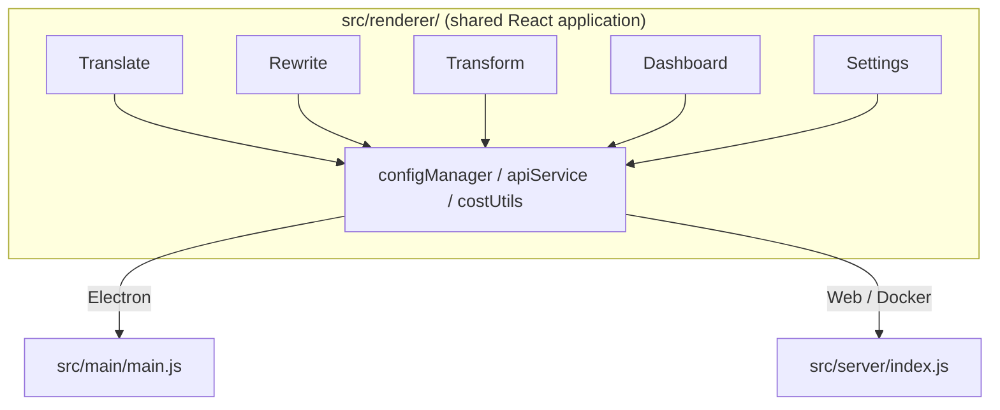

<p align="center">
  
</p>

<h1 align="center">Transrewrt</h1>

<p align="center">
  <a href="https://github.com/wsj-br/transrewrt/releases"></a>
  <a href="LICENSE"></a>
  
  
  
</p>

Alat teks bantuan AI: nerjuhan antar basa, nulis ulang karo gayane macem-macem, lan owah-owahan karo prompt vinCustom - kabeh mlalui [OpenRouter](https://openrouter.ai). Main dadi aplikasi desktop (Electron) utawa aplikasi web di-host dhewe (Docker).

- **Nerjuhake** - antar puluhan basa, kanthi deteksi sumber otomatis
- **Nulis ulang** - mbenerake Tata Basa, ngambah kejelasan, formal/tidak formal, nyiptakake, nambahi, teknis
- **Owahan** - prompt AI vinCustom; gawe lan atur prompt, target basa opsional per prompt
- **Model lan biaya** - pilih model OpenRouter apa wae; dashboard biaya karo log SQLite, ringkasanmiturut model/operasi/hari
- **UI** - i18n (pt-BR, de, fr, es, RTL), tema, font, shortcut keyboard; mode web aman (API key mung ing server)
- **Desktop** - aplikasi Electron kanggo Windows lan Linux
- **Di-host dhewe** - image Docker kanggo amd64 & arm64 (siap kanggo Raspberry Pi)

Sampun dipasang, delok **[Panduan Panganggo](../USER-GUIDE.md)** kanggo panduan lengkap kabeh fiture.

<small>**Waca ing basa liyane:** [English (UK)](../README.md) · [Português (BR)](README.pt-BR.md) · [العربية](README.ar.md) · [বাংলা](README.bn.md) · [Català](README.ca.md) · [简体中文](README.zh-CN.md) · [繁體中文](README.zh-TW.md) · [Hrvatski](README.hr.md) · [Čeština](README.cs.md) · [Nederlands](README.nl.md) · [English (US)](README.en-US.md) · [Filipino](README.tl.md) · [Français](README.fr.md) · [Deutsch](README.de.md) · [Ελληνικά](README.el.md) · [हिन्दी](README.hi.md) · [Magyar](README.hu.md) · [Italiano](README.it.md) · [日本語](README.ja.md) · [Basa Jawa](README.jv.md) · [한국어](README.ko.md) · [Bahasa Melayu](README.ms.md) · [فارسی](README.fa.md) · [Polski](README.pl.md) · [Português (PT)](README.pt.md) · [ਪੰਜਾਬੀ](README.pa.md) · [Română](README.ro.md) · [Русский](README.ru.md) · [Slovenčina](README.sk.md) · [Español](README.es.md) · [Kiswahili](README.sw.md) · [Svenska](README.sv.md) · [తెలుగు](README.te.md) · [ภาษาไทย](README.th.md) · [Türkçe](README.tr.md) · [Українська](README.uk.md) · [Tiếng Việt](README.vi.md)</small>

<a id="screenshots"></a>
## Screenshots

**Pamilih basa**


**Nerjuhake**


**Owahan - editor prompt**


**Dashboard**


**Setelan - pilihan model**


<br /><br />

<a id="table-of-contents"></a>
## Daftar Isi

<!-- START doctoc generated TOC please keep comment here to allow auto update -->
<!-- DON'T EDIT THIS SECTION, INSTEAD RE-RUN doctoc TO UPDATE -->

- [Quick start](#quick-start)
- [Installation](#installation)
  - [Windows (Electron)](#windows-electron)
  - [Linux (Electron)](#linux-electron)
  - [Docker](#docker)
- [Getting an OpenRouter API key](#getting-an-openrouter-api-key)
- [Configuration and environment](#configuration-and-environment)
- [Development and architecture](#development-and-architecture)
- [Releases and tags](#releases-and-tags)
- [Contributing](#contributing)
- [Disclaimer](#disclaimer)
- [License](#license)

<!-- END doctoc generated TOC please keep comment here to allow auto update -->

<br /><br />

<a id="quick-start"></a>

## Miwiti Cepet

**Docker (disarankan kanggo hosting dhewe)**

```bash
docker pull ghcr.io/wsj-br/transrewrt:latest

API_KEY=sk-or-your-key docker run -d \
  -p 5000:5000 \
  -v transrewrt-data:/app/data \
  -e API_KEY \
  --name transrewrt-web \
  ghcr.io/wsj-br/transrewrt:latest
```

Ganti `sk-or-your-key` karo [kunci API OpenRouter](https://openrouter.ai/keys)mu. Buka [http://localhost:5000](http://localhost:5000) lan owahi sandi admin standar sak durunge nglairake servis.

<br />

> ℹ️ **NOTE**<br/>
> Ing Docker kunci API OpenRouter mung di set liwat variabel lingkungan `API_KEY` (ora ing UI web). Ing desktop (Electron) nempelno ing **Setelan → API**.

<br />

**Windows**

Undhuh `Transrewrt Setup x.y.z.exe` paling anyar saka [Rilis](https://github.com/wsj-br/transrewrt/releases),jalankan installer, banjur lacak saka menu Start utawa shortcuts desktop. Lebno kunci API OpenRouter ing **Setelan → API**.

<br />

**Linux**

Undhuh `.AppImage` saka [Rilis](https://github.com/wsj-br/transrewrt/releases), banjur:

```bash
chmod +x Transrewrt-x.y.z.AppImage && ./Transrewrt-x.y.z.AppImage
```

Lebno kunci API OpenRouter ing **Setelan → API**. Ing Debian/Ubuntu mbokmenawa butuh instal dependencies tambahan sawise:

```bash
sudo apt install libgtk-3-0 libnotify-dev libnss3 libxss1 libasound2 libxtst6 xauth
```

Delok [Pemasangan → Linux](#linux-electron) kanggo detail.

<br />

> ℹ️ **NOTE**<br/>
> macOS saiki durung didhukung. Transrewrt is available for Windows, Linux, lan Docker.

<br />

Sak wise aplikasé mlaku, delok **[Pituduh Naraguna](../USER-GUIDE.md)** kanggo sinau cara nerjemahake, nulis ulang, lan transformasi teks, mene rembug, lan konfigurasi model.

<br /><br />

<a id="installation"></a>
## Pemasangan

<a id="windows-electron"></a>
### Windows (Electron)

- Undhuh installer paling anyar saka [Rilis](https://github.com/wsj-br/transrewrt/releases).
- Jalankan `.exe` lan ikuti installer.
- Pisanan: miwit twitter app saka menu Start utawa shortcuts desktop. Konfig disimpen ing `%APPDATA%\transrewrt\`.

<br />

<a id="linux-electron"></a>
### Linux (Electron)

- Undhuh `.AppImage` saka [Rilis](https://github.com/wsj-br/transrewrt/releases).
- Run: `chmod +x Transrewrt-x.y.z.AppImage && ./Transrewrt-x.y.z.AppImage`
- Dependencies tambahan (Debian/Ubuntu): `sudo apt install libgtk-3-0 libnotify-dev libnss3 libxss1 libasound2 libxtst6 xauth`
- Delok [dev/DEVELOPMENT.md](../dev/DEVELOPMENT.md) kanggo liyane.

<br />

<a id="docker"></a>
### Docker

- Pull: `docker pull ghcr.io/wsj-br/transrewrt:latest`
- Kunci API OpenRouter **kudu** di set liwat variabel lingkungan `API_KEY`. Pass `-e API_KEY` (utawa liwat `docker compose` / `.env`) supaya key ora katon ing process list.
- Kunci API ora bisa dilebokake ing UI web.

Conto - volume named kanggo persistensi (API key passed liwat env, ora ing command line):

```bash
API_KEY=sk-or-your-key docker run -d \
  -p 5000:5000 \
  -v transrewrt-data:/app/data \
  -e API_KEY \
  --name transrewrt-web \
  ghcr.io/wsj-br/transrewrt:latest
```

<br />

| Opsi   | Keterangan                                                                                                   |
| -------- | ------------------------------------------------------------------------------------------------------------- |
| Port     | `5000` (map with `-p 5000:5000`)                                                                              |
| Volume   | Mount `/app/data` kanggo config lan database persistensi                                                      |
| Env vars | `PORT`, `CONFIG_PATH`, `API_KEY`, `API_URL`, `KEY_SEED` - delok [Konfigurasi](#configuration-and-environment) |

Kanggo mbangun lan njalani saka source: `docker compose up --build -d` utawa `pnpm run docker:up` - delok [dev/DEVELOPMENT.md](../dev/DEVELOPMENT.md).

<br /><br />

<a id="getting-an-openrouter-api-key"></a>
## Njaluk Kunci API OpenRouter

Transrewrt nggunaaké [OpenRouter](https://openrouter.ai) kanggo model AI. Sampéyan butuh kunci API kanggo nerjemahake, nulis ulang, utawa transformasi teks.

1. Daftar utawa login ing [openrouter.ai](https://openrouter.ai).
2. Buka halaman [Keys](https://openrouter.ai/keys) lan gawé kunci anyar (jenengna, lan optionally set credit limit). Sampéyan bisa nggunakaké model free without adding credit.
3. **Desktop (Electron):** nempelno kunci ing **Setelan → API**. **Docker:** set variabel lingkungan `API_KEY` (delok [Miwiti Cepet](#quick-start)).

Kanggo watesan, BYOK, lan liyane, delok [Otentikasi OpenRouter](https://openrouter.ai/docs/api/reference/authentication).

<br /><br />

<a id="configuration-and-environment"></a>

## Konfigurasi lan linggané

**Lokasi file konfigurasi**

| Deployment         | Lokasi konfigurasi                                   |
| ------------------ | ---------------------------------------------------- |
| Electron (Windows) | `%APPDATA%\transrewrt\`                              |
| Electron (Linux)   | `~/.config/transrewrt/`                              |
| Web / Docker       | `/app/data/config.json` (gunakake volume kanggo nyimpen) |

<br />

**Variabel lingkungan** (mung web/Docker; Electron nggunakake file konfigurasi lokal)

| Variabel      | Default                        | Penjelasan                                                   |
| ------------- | ------------------------------ | ------------------------------------------------------------ |
| `PORT`        | `5000`                         | Port kanggo ngrungokake server                              |
| `CONFIG_PATH` | `/app/data/config.json`        | Path menyang file konfigurasi                              |
| `API_KEY`     | *(kosong)*                     | OpenRouter API key (wajib kanggo Docker; set liwat env, dudu UI) |
| `API_URL`     | `https://openrouter.ai/api/v1` | Base URL API AI sing munggah                               |
| `KEY_SEED`    | *(kosong)*                     | Transrewrt proxy key seed (ngganti konfigurasi yen wis set) |

<br />

**Data lan.persistence:** Kanggo Docker, mount volume ing `/app/data` supaya `config.json` lan database SQLite tetep katon nalika container di-restart. Tanpa volume, kabeh data ilang nalika container mandheg.

<br />

**Otentikasi web:**

- Admin baku: `admin` / `transrewrt26`.
|尚无翻译|Kelola pengguna ing **Setelan → Pengguna**.
|尚无翻译|Reset sandi: `docker exec <container> reset-web-password '<username>' '<new-password>'`
  (saka source: `pnpm run reset-web-password -- <username> <new-password>`)

<br />

> ⚠️ **PEPÉYÉ**<br/>
|尚无翻译|Ganti sandi admin baku immediately ing host sing bisa diaksès rung jaringan.

<br />

**Transrewrt proxy (opsional):** Sampéyan bisa nggantiake traffic API liwat proxy sing nggunakake Rolling Key sing adhedhasar wektu. Ing **Setelan → API**, aktifké **Gunakake Transrewrt Proxy**, set **Key seed**, lan set **API URL** menyang base URL proxi. Delok [dev/SYSTEM-OVERVIEW.md](../dev/SYSTEM-OVERVIEW.md) kanggo rincian.

Setelan utama (tema, font, model, basa, lsp.) kasedhiya ing dialog Setelan utawa bisa diedit langsung ing config JSON. Daftar lengkap lan baku didokumentasèkake ing [dev/DEVELOPMENT.md](../dev/DEVELOPMENT.md).

<br /><br />

<a id="development-and-architecture"></a>
## Pengembangan lan arsitektur

- **Pengembangan:** Setup, build, test, lan deploy (Electron, Web, Docker) - delok **[dev/DEVELOPMENT.md](../dev/DEVELOPMENT.md)**.
- **Arsitektur lan gambaran sistem:** Folder structure, tech stack, kaputusan desain, Transrewrt proxy - delok **[dev/SYSTEM-OVERVIEW.md](../dev/SYSTEM-OVERVIEW.md)**.



<br /><br />

<a id="releases-and-tags"></a>
## Rilis lan tag

- **Git tags** `v`* (conto: `v1.0.10`) ngaktifake [workflow rilis](.github/workflows/release.yml). **GitHub Releases** nambahi installer Windows (`.exe`) lan Linux AppImage.
- **Docker images** ditulis marang `ghcr.io/wsj-br/transrewrt`. Tag gambar cocog karo versi Git (conto: `v1.0.10` → `ghcr.io/wsj-br/transrewrt:1.0.10`) plus `latest`. Multi-arch: `linux/amd64` lan `linux/arm64` (conto: Raspberry Pi).

<br /><br />

<a id="contributing"></a>
## Kontribusi

1. Fork repositori.
2. Nggawé branch fitur: `git checkout -b feature/my-feature`
3. Komit owah-owahan kalian pamedharan sing jelas.
4. Push lan bukak Pull Request menyang `main`.

Mangga equator kode sing ana lan tes owah-owhan ing mode Electron lan web sakdurung ngirim. Delok [dev/DEVELOPMENT.md](../dev/DEVELOPMENT.md) kanggo instraksi build lan test.

<br />

**Nglaporké masalah:** Bukak issue ing [GitHub](https://github.com/wsj-br/transrewrt/issues). Tambah platform (Windows / Linux / Docker) lan versi app (ketékan ing dialog About utawa ing halaman Releases).

<br /><br />

<a id="disclaimer"></a>

## Panafian

Asma produk lan ikon iku kagungan pemilik piyambak-piyambak lan mung digunakake kanggo identifikasi wae. Parangkat lunak iki ora duwe afiliasi utawa ora didukung dening merek-merek kasebut.

<br /><br />

<a id="license"></a>
## Lisensi

Hak Cipta © 2026 Waldemar Scudeller Jr.

[Apache License 2.0](LICENSE)