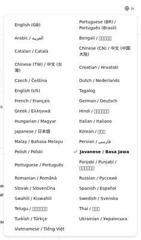
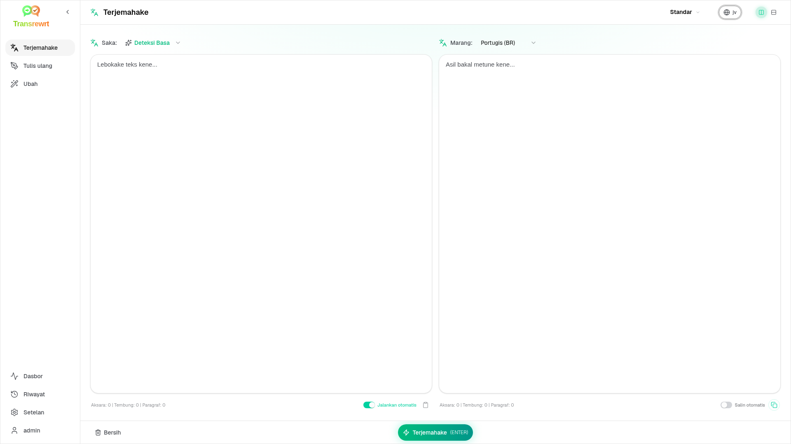
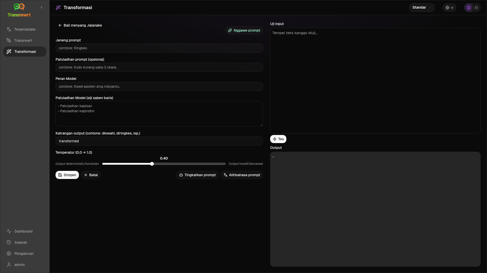
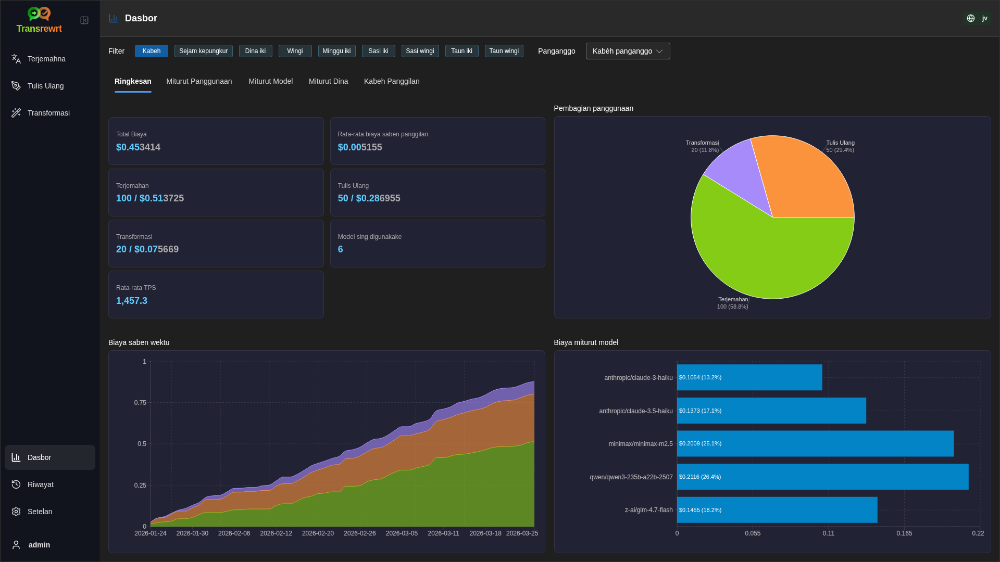
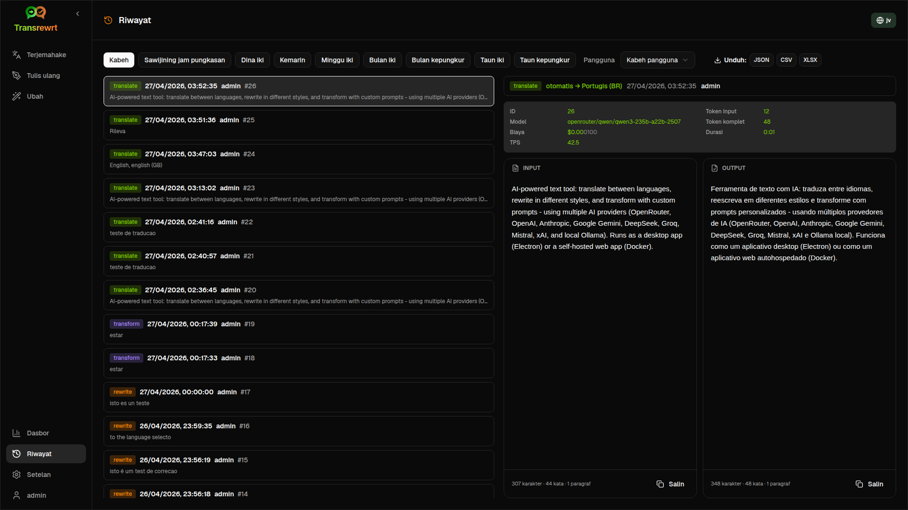
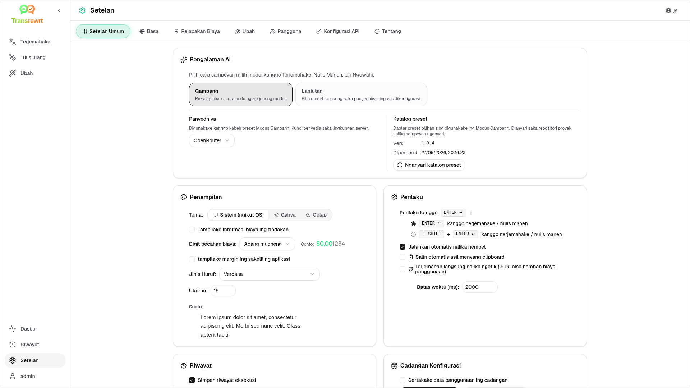

<p align="center">
  
</p>

<p align="center">
  <a href="https://github.com/wsj-br/transrewrt/releases"></a>
  <a href="LICENSE"></a>
  
  
  
</p>

Alat teks sing didhukung AI: terjemahake antar basa, tulis ulang gaya beda, lan ubah nganggo prompt khusus - nggunakake pirang-pirang panyedhiya AI (OpenRouter, OpenAI, Anthropic, Google Gemini, DeepSeek, Groq, Mistral, xAI, lan Ollama lokal). Jalan minangka aplikasi desktop (Electron) utawa aplikasi web sing bisa digawe dhewe (Docker).

- **Terjemahake** - antarane puluhan basa, kanthi pendeteksian sumber otomatis
- **Tulis ulang** - perbaiki tata basa, improve clarity, formal/informal, ngendhakake, nembahake, teknis
- **Ubah** - prompt AI khusus; gawe lan atur prompt, basa sasaran opsional saben prompt
- **Riwayat** - riwayat eksekusi lengkap kanthi teks input/output, penyaringan, lan ekspor
- **Gampang & Lanjutan** - Modus gampang (standar): preset sing dipilih saben panyedhiya (**Gratis (OpenRouter)**, **Standar**, **Lanjutan**, **Teknis**; mung preset kanthi peta kanggo panyedhiya sing dipilih sing katon) tanpa milih ID model; Modus lanjutan: dhaftar model lengkap saka panyedhiya sing wis dikonfigurasi
- **Model lan biaya** - dasbor biaya lan panggunaan (Ringkasan, Dhèk model, Kabeh pangelingan API) kanthi ekspor; OpenRouter nuduhake panggunan nyata, panyedhiya liya nggunakake perkiraan
- **UI** - antarmuka multibasa (30+ basa, dhukungan RTL), font, ...
- **Modus web** - dhukungan multi-pangguna kanthi peran admin
- **Desktop** - Aplikasi Electron kanggo Windows lan Linux
- **Swadaya** - Gambar Docker kanggo amd64 & arm64 (siap digunakake ing Raspberry Pi)

Sawise dipasang, deleng [**Pandhuan Pangguna**](USER-GUIDE.jv.md) kanggo pandhuan lengkap babagan kabeh fitur.

<small>**Macaa ing basa liya:** </small>
<small id="lang-list">[English (GB)](../README.md) · [Português (Brasil)](./README.pt-BR.md) · [العربية](./README.ar.md) · [বাংলা](./README.bn.md) · [Català](./README.ca.md) · [中文 (中国大陆)](./README.zh-CN.md) · [中文 (台灣)](./README.zh-TW.md) · [Hrvatski](./README.hr.md) · [Čeština](./README.cs.md) · [Nederlands](./README.nl.md) · [English (US)](./README.en-US.md) · [Tagalog](./README.tl.md) · [Français](./README.fr.md) · [Deutsch](./README.de.md) · [Ελληνικά](./README.el.md) · [हिन्दी](./README.hi.md) · [Magyar](./README.hu.md) · [Italiano](./README.it.md) · [日本語](./README.ja.md) · [한국어](./README.ko.md) · [Bahasa Melayu](./README.ms.md) · [فارسی](./README.fa.md) · [Polski](./README.pl.md) · [Basa Jawa](./README.jv.md) · [Português](./README.pt.md) · [ਪੰਜਾਬੀ](./README.pa.md) · [Română](./README.ro.md) · [Русский](./README.ru.md) · [Slovenčina](./README.sk.md) · [Español](./README.es.md) · [Kiswahili](./README.sw.md) · [Svenska](./README.sv.md) · [తెలుగు](./README.te.md) · [ไทย](./README.th.md) · [Türkçe](./README.tr.md) · [Українська](./README.uk.md) · [Tiếng Việt](./README.vi.md)</small>

<small>

> **Cathetan bab terjemahan UI lan dokumentasi:** Kabeh basa antarmuka kajaba Basa Inggris (UK) asli 
> diterjemahake nggunakake model AI; ukara bisa ora tepat utawa ngemot kesalahan.

</small>

<br/>

<a id="table-of-contents"></a>
## Tabel Isi

<!-- START doctoc generated TOC please keep comment here to allow auto update -->
<!-- DON'T EDIT THIS SECTION, INSTEAD RE-RUN doctoc TO UPDATE -->

- [Tangkapan layar](#screenshots)
- [Mulai cepet](#quick-start)
- [Entuk kunci API OpenRouter](#getting-an-openrouter-api-key)
- [Konfigurasi lan lingkungan](#configuration-and-environment)
- [Pangembangan lan arsitektur](#development-and-architecture)
- [Laporan masalah](#reporting-issues)
- [Penafian](#disclaimer)
- [Lisensi](#license)

<!-- END doctoc generated TOC please keep comment here to allow auto update -->

<br/><br/>

<a id="screenshots"></a>
## Tangkapan layar

**Pemilih basa**



**Terjemahake**



**Ubah - editor prompt**



**Dasbor**



**Riwayat**



**Setelan - pilihan model**



<br/><br/>

<a id="quick-start"></a>
## Mulai cepet

<details>
<summary><b>Docker (disarankan kanggo self-hosting)</b></summary>

<a id="docker"></a>

<br/>

```bash
docker pull ghcr.io/wsj-br/transrewrt:latest

OPENROUTER_API_KEY=sk-or-your-key docker run -d \
  -p 5000:5000 \
  -v transrewrt-data:/app/data \
  -e OPENROUTER_API_KEY \
  --name transrewrt-web \
  ghcr.io/wsj-br/transrewrt:latest
```

Ganti `sk-or-your-key` nganggo [konci API OpenRouter](https://openrouter.ai/keys) (utawa atur konci panyedhiya liyane; deleng [Konfigurasi](#configuration-and-environment)). Bukak [http://localhost:5000](http://localhost:5000) lan ganti sandhi admin baku sadurunge ngekspos layanan kasebut.

Atur paling ora siji konci panyedhiya liwat lingkungan (contone `OPENROUTER_API_KEY` kanggo OpenRouter). Lelumpukna variabel nganggo `-e` utawa `docker compose` / `.env` supaya rahasia ora kakebeng ing gambar. Konci panyedhiya **ora** dimasukkan ing UI web; server maca saka lingkungan.

<br/>

> ℹ️ **CATETAN**<br/>
> Ing Docker, kredensial LLM diatur nganggo variabel lingkungan kaya `OPENROUTER_API_KEY`, `OPENAI_API_KEY`, `CEREBRAS_API_KEY`, … (ora ing UI web). Ing desktop (Electron) sampeyan ngonfigurasi konci ing **Setelan → API**.

<br/>

Utawa gunakna Docker Compose:

```bash
# download the compose file
wget https://github.com/wsj-br/transrewrt/raw/refs/heads/master/production.yml -O transrewrt.yml
# Edit the file to add your API keys (API_KEYs), or uncomment and adjust the `.env` file. Set the timezone (TZ) if necessary.
vi transrewrt.yml
# start the container
docker compose -f transrewrt.yml up -d
```

Deleng [Konfigurasi](#configuration-and-environment) kanggo kabeh variabel lingkungan, kaya `PORT`, `CONFIG_PATH`, `TZ`, lan konci LLM (`OPENROUTER_API_KEY`, `OPENAI_API_KEY`, …).

</details>

<br/>

<details>
<summary><b>Zona wektu server (Docker)</b></summary>

<a id="configuring-the-timezone"></a>

<br/>

Tampilan tanggal lan wektu antarmuka panganggo nututi lokal lan zona wektu **browser**. Kanggo perilaku **sisi-server** (pencatatan log lan liya-liyane), wadah nggunakake variabel lingkungan `TZ`. Baku yaiku `TZ=Europe/London`.

Kanggo nggunakna zona wektu liya, atur `TZ` ing berkas Compose sampeyan, contone:

```yaml
environment:
  - TZ=America/Sao_Paulo
```

Utawa lewati nalika njalankan wadah (Docker):

```bash
--env TZ=America/Sao_Paulo
```

Ing akeh host Linux sampeyan bisa nyalin jeneng zona wektu sistem nganggo:

```bash
echo TZ=\"$(</etc/timezone)\"
```

Daptar jeneng zona wektu sing valid dipertahankan ing [basis data tz](https://en.wikipedia.org/wiki/List_of_tz_database_time_zones) (Wikipedia).

</details>

<br/>

<details>
<summary><b>Windows</b></summary>

<a id="windows-electron"></a>

<br/>

- Unduh `Transrewrt Setup x.y.z.exe` paling anyar saka [Rilis](https://github.com/wsj-br/transrewrt/releases).
- Jalanke `.exe` lan tuntun pandhuan instalasi.
- Jalanke pisanan: miwiti aplikasi saka menu Mulai utawa pintasan desktop.
- Lebokne kunci API sampeyan ing **Setelan → API**. Sampeyan kudu ngonfigurasi paling ora siji panyedhiya; OpenRouter umume digunakake kanggo model gratis.

<br/>

> ℹ️ **CATETAN**<br/>
> Windows bisa uga nuduhake salah siji peringatan keamanan iki (normal kanggo aplikasi sing ora ditandatangani/independen):
>   - **User Account Control (UAC)**: "Apa sampeyan arep ngidini aplikasi iki saka penerbit ora dikenal kanggo ngganti piranti sampeyan?" → Klik **Ya**.
>   - **Microsoft Defender SmartScreen**: "Windows nglindhungi PC sampeyan" → Klik **Info liyane** → **Jalanne tetep**.
>
> Iki kedadeyan amarga aplikasi ora ditandatangani dening Microsoft utawa penerbit utama—iki aman yen didownload saka rilis GitHub resmi kita (verifikasi checksum ing kaca [Rilis](https://github.com/wsj-br/transrewrt/releases) bareng karo saben aset).

<br/>

</details>

<br/>

<details><summary><b>Linux</b></summary>

<a id="linux-electron"></a>

<br/>

Unduh `.AppImage` kanggo CPU sampeyan saka [Rilis](https://github.com/wsj-br/transrewrt/releases) (`x64` kanggo PC biasa, `arm64` kanggo akeh piranti ARM, kalebu Raspberry Pi 4+), banjur:

```bash
chmod +x Transrewrt-x.y.z-x64.AppImage && ./Transrewrt-x.y.z-x64.AppImage
```

Gunakake jeneng berkas `x64` kanggo x86_64/amd64; gunakake jeneng `...-arm64.AppImage` kanggo ARM64.

Lebokne kunci API sampeyan ing **Setelan → API**. Sampeyan kudu ngonfigurasi paling ora siji panyedhiya; OpenRouter umume digunakake kanggo model gratis.

**Pesen konsol:** Build Linux sing dikemas (AppImage `x64` lan `arm64`) ngeblok peringatan deprekasi Node ing terminal (kayata modul internal `punycode`). Yen Chromium munculake kesalahan GPU / EGL kayata “GLES3 ora didhukung” nanging aplikasi tetep mlaku, sampeyan bisa mateni kanthi mateni akselerasi hardware:

```bash
TRANSREWRT_DISABLE_GPU=1 ./Transrewrt-x.y.z-arm64.AppImage
```

Iki ditrapake uga ing amd64; ganti jeneng berkas supaya cocog karo undhuhan sampeyan.

Ing Debian/Ubuntu, sampeyan bisa uga butuh pustaka **runtime** tambahan sing dibutuhake dening Chromium (iki asring wis ana ing instalasi desktop lengkap). Jalanke perintah ngisor iki yen perlu:

```bash
sudo apt update
sudo apt install -y libfuse2 libgtk-3-0 libnotify4 libnss3 libnspr4 libxss1 libxtst6 xdg-utils \
     xauth libatspi2.0-0 libdrm2 libgbm1 libxcb-dri3-0 libcups2 libasound2t64
```

ganti `libasound2t64` dadi `libasound2` kanggo `arm64`. Instalasi minimal utawa kustom isih bisa gagal karo berkas `.so` sing ilang. Instal paket kanthi jeneng sing katon ing pesen kesalahan (tambahan umum: `libatk1.0-0`, `libatk-bridge2.0-0`, `libgbm1`, `libdrm2`). Ing sawetara lingkungan, sampeyan bisa uga kudu mlakuake aplikasi nggunakake `APPIMAGE_EXTRACT_AND_RUN=1 ./Transrewrt-….AppImage`.

<br/>

> ℹ️ **CATETAN**<br/>
> macOS saiki durung didhukung. Transrewrt kasedhiya kanggo Windows, Linux, lan Docker.

</details>

<br/>

Sawise aplikasi dijalanke, deleng [**Pandhuan Pangguna**](USER-GUIDE.jv.md) kanggo sinau carane menerjemahake, nulis ulang, lan ngowahi teks, ngatur prompt, lan ngonfigurasi model.

<br/><br/>

<a id="getting-an-openrouter-api-key"></a>
## Entuk kunci API OpenRouter

Transrewrt ndhukung akeh panyedhiya AI. [OpenRouter](https://openrouter.ai) pilihan populer amarga nggabungake akeh model ing siji kunci lan nawakake model gratis.

1. Daftar utawa mlebu ing [openrouter.ai](https://openrouter.ai).
2. Buka kaca [Kunci](https://openrouter.ai/keys) lan gawe kunci anyar (jenengi, lan opsional atur watesan kredit). Sampeyan bisa nggunakake model gratis tanpa nambah kredit.
3. **Desktop (Electron):** tempel kunci ing **Setelan → API**. **Docker:** atur variabel lingkungan kayata `OPENROUTER_API_KEY` (deleng [Mulai Cepet](#quick-start)).

Aja nggunakake model **Body Builder** OpenRouter ([`openrouter/bodybuilder`](https://openrouter.ai/openrouter/bodybuilder)) kanggo terjemahake, tulis maneh, utawa owah: iku maringi muatan JSON, ora teks rampung kanggo tugas kasebut. Deleng [Setelan → Model](USER-GUIDE.jv.md#models) ing Pandhuan Pangguna.

Sampeyan uga bisa nggunakake panyedhiya liyane (OpenAI, Anthropic, Google Gemini, DeepSeek, Groq, Mistral, xAI, Cerebras) utawa mlakuake model lokal nganggo [Ollama](https://ollama.com). Deleng [Konfigurasi](#configuration-and-environment) kanggo daftar lengkap panyedhiya sing didhukung lan variabel lingkungan.

</br>

> ⚠️ **PANENGGAN**<br/>
> Yen sampeyan nggunakake Ollama saka piranti, wadah, utawa layanan liya, eling konfigurasi Ollama kanggo ngidini sambungan eksternal (ora mung localhost).

<br/><br/>

<a id="configuration-and-environment"></a>
## Konfigurasi lan lingkungan

</br>

**Lokasi berkas konfigurasi**

| Penyebaran         | Lokasi konfigurasi                                   |
| ------------------ | ------------------------------------------------- |
| Electron (Windows) | `%APPDATA%\transrewrt\`                           |
| Electron (Linux)   | `~/.config/transrewrt/`                           |
| Web / Docker       | `/app/data/config.json` (gunakake volume kanggo nyimpen) |

<br/>

**Variabel lingkungan** (khusus web/Docker; Electron nggunakake berkas konfigurasi lokal)

| Variabel             | Katerangan                                                                  |
|----------------------|------------------------------------------------------------------------------|
| `PORT`               | port pendengaran server  (minangka baku yaiku `5000`)                                  |
| `CONFIG_PATH`        | Path menyang berkas konfigurasi (minangka baku yaiku `/app/data/config.json`)                |
| `TZ`                 | zona wektu kanggo wektu sisi server (pencatatan log, lsp.) (minangka baku yaiku  `Europe/London`) |
| `HISTORY_DISABLED`   | Paksa riwayat eksekusi mati (opsional, bawaan ke `false`)                  |
| `OPENROUTER_API_KEY` | Kunci API OpenRouter                                                           |
| `OPENAI_API_KEY`     | Kunci API OpenAI                                                               |
| `CEREBRAS_API_KEY`   | Kunci API Cerebras                                                             |
| `ANTHROPIC_API_KEY`  | Kunci API Anthropic                                                            |
| `GOOGLE_API_KEY`     | Kunci API Google Gemini                                                        |
| `DEEPSEEK_API_KEY`   | Kunci API DeepSeek                                                             |
| `GROQ_API_KEY`       | Kunci API Groq                                                                 |
| `MISTRAL_API_KEY`    | Kunci API Mistral                                                              |
| `OLLAMA_URL`         | URL dhasar Ollama (contone `http://host.docker.internal:11434`)                   |
| `XAI_API_KEY`        | xAI API key                                                                  |

**Modus privasi:** Kanggo memaksa pelacakan riwayat mati tanpa nggatekake `config.json` utawa preferensi saben pangguna, setel `HISTORY_DISABLED` dadi `true` utawa `1` (ora nggatekake kapitalisasi) kanggo **proses server web/Docker** lan/utawa **proses utama desktop Electron** (contone lingkungan sistem utawa peluncur — ora mung renderer). Iki mateni nyimpen riwayat input/output, ngunci **Setelan → Setelan Umum → Riwayat**, lan mblokir API sing ana gandhèngan karo Riwayat.

Konfigurasikake mung provider sing digunakake. ID model duwé namespace (`openrouter/…`, `openai/…`, `cerebras/…`, `ollama/…`, lsp.).

**Tampilan biaya:** OpenRouter maringi biaya sing dibayar sacara tepat yen cocog. Provider liya nggunakake biaya **diperkirakake** saka rega model umum OpenRouter nalika ana kunci OpenRouter; tanpa kuwi, biaya non-OpenRouter bisa uga nuduhake minangka `0`. Perkiraan ora kalebu invoice.

<br/>

**Data lan persistensi:** Kanggo Docker, pasang volume ing `/app/data` supaya `config.json` lan database SQLite tetep ana sawise restart wadah. Tanpa volume, kabeh data ilang nalika wadah mandheg.

<br/>

**Otentikasi web:**

- Admin baku: `admin` / `transrewrt26`.
- Atur pangguna ing **Setelan → Pangguna**.
- Reset sandhi: `docker exec <container> reset-web-password '<username>' '<new-password>'`

<br/>

> ⚠️ **PERINGATAN**<br/>
> Ganti sandhi admin baku sacara langsung ing host sing bisa diakses jaringan.

<br/>

Setelan utama (huruf, model, basa, lsp.) kasedhiya ing Setelan aplikasi.

<br/><br/>

<a id="development-and-architecture"></a>
## Pangembangan lan arsitektur

- **Pangembangan:** Siapake, gawe, tes, lan sebar (Electron, Web, Docker) - deleng [dev/DEVELOPMENT.md](../dev/DEVELOPMENT.md).
- **Arsitektur lan gambaran sistem:** Struktur folder, tumpukan teknologi, keputusan desain - deleng [dev/SYSTEM-OVERVIEW.md](../dev/SYSTEM-OVERVIEW.md).

<br/><br/>

<a id="reporting-issues"></a>
## Pelaporan masalah

Bukak isu ing [GitHub](https://github.com/wsj-br/transrewrt/issues). Sertakake platform sampeyan (Windows / Linux / Docker) lan versi aplikasi (katon ing dialog Tentang utawa ing kaca Rilis).

<br/><br/>

<a id="disclaimer"></a>
## Penafian

Nama produk lan ikon milik pemiliké dhéwé lan digunakaké mung kanggo tujuan identifikasi. Software iki ora duwé hubungan utawa disetujui déning merek-merek sing dijelasaké.

<br/><br/>

<a id="license"></a>
## Lisensi

Hak Cipta © 2026 Waldemar Scudeller Jr.

[Apache License 2.0](../LICENSE)
