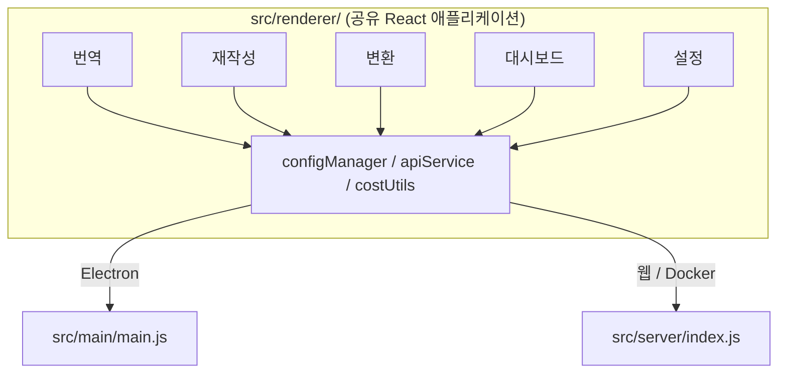

<p align="center">
  
</p>

<h1 align="center">Transrewrt</h1>

<p align="center">
  <a href="https://github.com/wsj-br/transrewrt/releases"></a>
  <a href="LICENSE"></a>
  
  
  
</p>

[OpenRouter](https://openrouter.ai)를 활용한 AI 기반 텍스트 도구: 언어 간 번역, 다양한 스타일로 재작성, 사용자 지정 프롬프트로 변환 - 모두 하나로. 데스크톱 앱(Electron) 또는 자체 호스팅 웹 앱(Docker)으로 실행됩니다.

- **번역** - 자동 원본 언어 감지와 함께 수십 개 언어 간 번역
- **재작성** - 문법 수정, 명확성 향상, 격식/비격식, 요약, 확장, 기술 문서
- **변환** - 사용자 지정 AI 프롬프트; 프롬프트 생성 및 관리, 프롬프트별 선택적 대상 언어
- **모델 & 비용** - 원하는 OpenRouter 모델 선택; SQLite 로그, 모델/작업/일별 요약이 포함된 비용 대시보드
- **UI** - i18n (포르투갈어(브라질), 독일어, 프랑스어, 스페인어, RTL), 테마, 글꼴, 키보드 단축키; 안전한 웹 모드 (API 키는 서버에만)
- **데스크톱** - Windows 및 Linux용 Electron 앱
- **자체 호스팅** - amd64 & arm64(Raspberry Pi 지원)용 Docker 이미지

설치가 완료되면 모든 기능에 대한 전체 안내는 **[사용자 가이드](../USER-GUIDE.md)**를 참조하세요.

<small>**다른 언어로 읽기:** [English (UK)](../README.md) · [Português (BR)](README.pt-BR.md) · [العربية](README.ar.md) · [বাংলা](README.bn.md) · [Català](README.ca.md) · [简体中文](README.zh-CN.md) · [繁體中文](README.zh-TW.md) · [Hrvatski](README.hr.md) · [Čeština](README.cs.md) · [Nederlands](README.nl.md) · [English (US)](README.en-US.md) · [Filipino](README.tl.md) · [Français](README.fr.md) · [Deutsch](README.de.md) · [Ελληνικά](README.el.md) · [हिन्दी](README.hi.md) · [Magyar](README.hu.md) · [Italiano](README.it.md) · [日本語](README.ja.md) · [Basa Jawa](README.jv.md) · [한국어](README.ko.md) · [Bahasa Melayu](README.ms.md) · [فارسی](README.fa.md) · [Polski](README.pl.md) · [Português (PT)](README.pt.md) · [ਪੰਜਾਬੀ](README.pa.md) · [Română](README.ro.md) · [Русский](README.ru.md) · [Slovenčina](README.sk.md) · [Español](README.es.md) · [Kiswahili](README.sw.md) · [Svenska](README.sv.md) · [తెలుగు](README.te.md) · [ภาษาไทย](README.th.md) · [Türkçe](README.tr.md) · [Українська](README.uk.md) · [Tiếng Việt](README.vi.md)</small>

<a id="screenshots"></a>
## 스크린샷

**언어 선택기**


**번역**


**변환 - 프롬프트 편집기**


**대시보드**


**설정 - 모델 선택**


<br /><br />

<a id="table-of-contents"></a>
## 목차

<!-- START doctoc generated TOC please keep comment here to allow auto update -->
<!-- DON'T EDIT THIS SECTION, INSTEAD RE-RUN doctoc TO UPDATE -->

- [빠른 시작](#quick-start)
- [설치](#installation)
  - [Windows (Electron)](#windows-electron)
  - [Linux (Electron)](#linux-electron)
  - [Docker](#docker)
- [OpenRouter API 키 받기](#getting-an-openrouter-api-key)
- [설정 및 환경](#configuration-and-environment)
- [개발 및 아키텍처](#development-and-architecture)
- [릴리스 및 태그](#releases-and-tags)
- [기여하기](#contributing)
- [면책 조항](#disclaimer)
- [라이선스](#license)

<!-- END doctoc generated TOC please keep comment here to allow auto update -->

<br /><br />

<a id="quick-start"></a>

## 빠른 시작

**Docker (자가 호스팅 권장)**

```bash
docker pull ghcr.io/wsj-br/transrewrt:latest

API_KEY=sk-or-your-key docker run -d \
  -p 5000:5000 \
  -v transrewrt-data:/app/data \
  -e API_KEY \
  --name transrewrt-web \
  ghcr.io/wsj-br/transrewrt:latest
```

`sk-or-your-key`를 [OpenRouter API 키](https://openrouter.ai/keys)로 대체합니다. [http://localhost:5000](http://localhost:5000)을 열고 서비스를 노출하기 전에 기본 관리자 비밀번호를 변경합니다.

<br />

> ℹ️ **참고**<br/>
> Docker에서는 OpenRouter API 키가 `API_KEY` 환경 변수를 통해서만 설정됩니다(웹 UI 아님). 데스크톱(Electron)에서는 **설정 → API**에 붙여넣습니다.

<br />

**Windows**

[Releases](https://github.com/wsj-br/transrewrt/releases)에서 최신 `Transrewrt Setup x.y.z.exe`를 다운로드하고, 설치 프로그램을 실행한 후 시작 메뉴나 데스크톱 바로 가기로 실행합니다. **설정 → API**에 OpenRouter API 키를 입력합니다.

<br />

**Linux**

[Releases](https://github.com/wsj-br/transrewrt/releases)에서 `.AppImage`를 다운로드한 후:

```bash
chmod +x Transrewrt-x.y.z.AppImage && ./Transrewrt-x.y.z.AppImage
```

**설정 → API**에 OpenRouter API 키를 입력합니다. Debian/Ubuntu에서는 먼저 추가 종속성을 설치해야 할 수 있습니다:

```bash
sudo apt install libgtk-3-0 libnotify-dev libnss3 libxss1 libasound2 libxtst6 xauth
```

자세한 내용은 [설치 → Linux](#linux-electron)를 참조하세요.

<br />

> ℹ️ **참고**<br/>
> 현재 macOS는 지원되지 않습니다. Transrewrt는 Windows, Linux, Docker에서 사용할 수 있습니다.

<br />

앱이 실행되면 텍스트를 번역, 재작성, 변형하고, 프롬프트를 관리하며, 모델을 구성하는 방법을 배우려면 **[사용자 가이드](../USER-GUIDE.md)**를 참조하세요.

<br /><br />

<a id="installation"></a>
## 설치

<a id="windows-electron"></a>
### Windows (Electron)

- [Releases](https://github.com/wsj-br/transrewrt/releases)에서 최신 설치 프로그램을 다운로드합니다.
- `.exe` 파일을 실행하고 설치 프로그램을 따릅니다.
- 첫 실행: 시작 메뉴나 데스크톱 바로 가기에서 앱을 시작합니다. 구성은 `%APPDATA%\transrewrt\`에 저장됩니다.

<br />

<a id="linux-electron"></a>
### Linux (Electron)

- [Releases](https://github.com/wsj-br/transrewrt/releases)에서 `.AppImage`를 다운로드합니다.
- 실행: `chmod +x Transrewrt-x.y.z.AppImage && ./Transrewrt-x.y.z.AppImage`
- 추가 종속성(Debian/Ubuntu): `sudo apt install libgtk-3-0 libnotify-dev libnss3 libxss1 libasound2 libxtst6 xauth`
- 더 자세한 내용은 [dev/DEVELOPMENT.md](../dev/DEVELOPMENT.md)를 참조하세요.

<br />

<a id="docker"></a>
### Docker

- 풀: `docker pull ghcr.io/wsj-br/transrewrt:latest`
- OpenRouter API 키는 **반드시** `API_KEY` 환경 변수를 통해 설정해야 합니다. `-e API_KEY`로 전달하거나(`docker compose` / `.env`를 통해) 키가 프로세스 목록에 표시되지 않게 합니다.
- API 키는 웹 UI에서 입력할 수 없습니다.

예제 - 영구성을 위한 명명된 볼륨(API 키는 명령줄이 아닌 env로 전달):

```bash
API_KEY=sk-or-your-key docker run -d \
  -p 5000:5000 \
  -v transrewrt-data:/app/data \
  -e API_KEY \
  --name transrewrt-web \
  ghcr.io/wsj-br/transrewrt:latest
```

<br />

| 옵션   | 설명                                                                                                   |
| -------- | ------------------------------------------------------------------------------------------------------------- |
| 포트     | `5000` (`-p 5000:5000`로 매핑)                                                                              |
| 볼륨   | 구성 및 데이터베이스 영속성을 위해 `/app/data`를 마운트                                                         |
| 환경 변수 | `PORT`, `CONFIG_PATH`, `API_KEY`, `API_URL`, `KEY_SEED` - [구성](#configuration-and-environment) 참조 |

소스에서 빌드하고 실행하려면: `docker compose up --build -d` 또는 `pnpm run docker:up` - [dev/DEVELOPMENT.md](../dev/DEVELOPMENT.md) 참조.

<br /><br />

<a id="getting-an-openrouter-api-key"></a>
## OpenRouter API 키 얻기

Transrewrt는 AI 모델에 [OpenRouter](https://openrouter.ai)를 사용합니다. 텍스트를 번역, 재작성, 변형하려면 API 키가 필요합니다.

1. [openrouter.ai](https://openrouter.ai)에서 가입하거나 로그인합니다.
2. [키](https://openrouter.ai/keys) 페이지를 열고 새 키를 생성합니다(이름을 지정하고, 선택적으로 크레딧 한도를 설정). 크레딧을 추가하지 않고도 무료 모델을 사용할 수 있습니다.
3. **데스크톱(Electron):** **설정 → API**에 키를 붙여넣습니다. **Docker:** `API_KEY` 환경 변수를 설정합니다([빠른 시작](#quick-start) 참조).

한도, BYOK 등에 대해서는 [OpenRouter 인증](https://openrouter.ai/docs/api/reference/authentication)을 참조하세요.

<br /><br />

<a id="configuration-and-environment"></a>

## 구성 및 환경

**설정 파일 위치**

| 배포 방식         | 설정 위치                                   |
| ----------------- | ------------------------------------------- |
| Electron (Windows) | `%APPDATA%\transrewrt\`                    |
| Electron (Linux)   | `~/.config/transrewrt/`                    |
| 웹 / Docker       | `/app/data/config.json` (영구 저장을 위해 볼륨 사용) |

<br />

**환경 변수** (웹/Docker 전용; Electron은 로컬 설정 파일 사용)

| 변수      | 기본값                        | 설명                                                   |
| --------- | ---------------------------- | ------------------------------------------------------ |
| `PORT`        | `5000`                         | 서버 listening 포트                                    |
| `CONFIG_PATH` | `/app/data/config.json`        | 설정 파일 경로                                         |
| `API_KEY`     | *(비어 있음)*                  | OpenRouter API 키 (Docker의 경우 필수; UI 대신 env로 설정) |
| `API_URL`     | `https://openrouter.ai/api/v1` | 업스트림 AI API 기본 URL                               |
| `KEY_SEED`    | *(비어 있음)*                  | Transrewrt 프록시 키 시드 (설정된 경우 재정의)           |

<br />

**데이터 및 영구성:** Docker의 경우 컨테이너 재시작 간에 `config.json` 및 SQLite 데이터베이스가 지속되도록 `/app/data`에 볼륨을 마운트하세요. 볼륨 없이 컨테이너가 중지되면 모든 데이터가 손실됩니다.

<br />

**웹 인증:**

- 기본 관리자: `admin` / `transrewrt26`.
- **설정 → 사용자**에서 사용자 관리.
- 비밀번호 재설정: `docker exec <container> reset-web-password '<username>' '<new-password>'`
  (소스에서: `pnpm run reset-web-password -- <username> <new-password>`)

<br />

> ⚠️ **경고**<br/>
> 네트워크 접근 가능한 호스트에서는 기본 관리자 비밀번호를 즉시 변경하세요.

<br />

**Transrewrt 프록시 (선택 사항):** 시간 기반 롤링 키를 사용하는 외부 프록시를 통해 API 트래픽을 라우팅할 수 있습니다. **설정 → API**에서 **Transrewrt 프록시 사용**을 활성화하고, **키 시드**를 설정하며, **API URL**을 프록시 기본 URL로 설정하세요. 자세한 내용은 [dev/SYSTEM-OVERVIEW.md](../dev/SYSTEM-OVERVIEW.md)를 참조하세요.

주요 설정(테마, 글꼴, 모델, 언어 등)은 설정 대화 상자에서 사용할 수 있거나 설정 JSON을 직접 편집할 수 있습니다. 전체 목록 및 기본값은 [dev/DEVELOPMENT.md](../dev/DEVELOPMENT.md)에 문서화되어 있습니다.

<br /><br />

<a id="development-and-architecture"></a>
## 개발 및 아키텍처

- **개발:** 설정, 빌드, 테스트 및 배포(Electron, 웹, Docker) - **[dev/DEVELOPMENT.md](../dev/DEVELOPMENT.md)** 참조.
- **아키텍처 및 시스템 개요:** 폴더 구조, 기술 스택, 설계 결정, Transrewrt 프록시 - **[dev/SYSTEM-OVERVIEW.md](../dev/SYSTEM-OVERVIEW.md)** 참조.



<br /><br />

<a id="releases-and-tags"></a>
## 릴리스 및 태그

- `v`* (예: `v1.0.10`) **Git 태그**는 [릴리스 워크플로우](.github/workflows/release.yml)를 트리거합니다. **GitHub 릴리스**에는 Windows 설치 프로그램(`.exe`) 및 Linux AppImage가 첨부됩니다.
- **Docker 이미지**는 `ghcr.io/wsj-br/transrewrt`에 게시됩니다. 이미지 태그는 Git 버전(예: `v1.0.10` → `ghcr.io/wsj-br/transrewrt:1.0.10`)과 일치하며 `latest`도 포함됩니다. 멀티 아키텍처: `linux/amd64` 및 `linux/arm64` (예: Raspberry Pi).

<br /><br />

<a id="contributing"></a>
## 기여

1. 리포지토리를 포크하세요.
2. 기능 브랜치 생성: `git checkout -b feature/my-feature`
3. 명확한 메시지로 변경 사항을 커밋하세요.
4. 푸시하고 `main`을 대상으로 Pull Request를 엽니다.

기존 코드 스타일을 따르고 제출하기 전에 Electron 및 웹 모드 모두에서 변경 사항을 테스트하세요. 빌드 및 테스트 지침은 [dev/DEVELOPMENT.md](../dev/DEVELOPMENT.md)를 참조하세요.

<br />

**이슈 보고:** [GitHub](https://github.com/wsj-br/transrewrt/issues)에서 이슈를 열어주세요. 플랫폼(Windows / Linux / Docker)과 앱 버전(정보 대화 상자 또는 릴리스 페이지에 표시됨)을 포함하세요.

<br /><br />

<a id="disclaimer"></a>

## 면책 조항

제품 이름과 아이콘은 각 소유주의 자산이며 식별 목적으로만 사용됩니다. 본 소프트웨어는 언급된 브랜드 중 어느 쪽과도 제휴하지 않았으며, 그 어떠한 보증도 받지 않았습니다.

<br /><br />

<a id="license"></a>
## 라이선스

저작권 © 2026 Waldemar Scudeller Jr.

[Apache License 2.0](LICENSE)