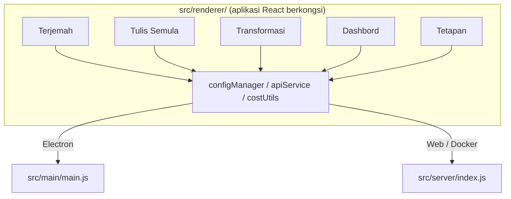

<p align="center">
  
</p>

<h1 align="center">Transrewrt</h1>

<p align="center">
  <a href="https://github.com/wsj-br/transrewrt/releases"></a>
  <a href="LICENSE"></a>
  
  
  
</p>

Alatan teks berkuasa AI: terjemah antara bahasa, tulis semula dalam pelbagai gaya, dan ubah suai dengan prompet tersuai - semua melalui [OpenRouter](https://openrouter.ai). Berjalan sebagai aplikasi desktop (Electron) atau aplikasi web yang dihos sendiri (Docker).

- **Terjemah** - antara beberapa bahasa, dengan pengesanan sumber automatik
- **Tulis Semula** - betulkan tatabahasa, tingkatkan kejelasan, formal/tidak formal, pendekkan, kembangkan, teknikal
- **Ubah Suai** - prompet AI tersuai; cipta dan urus prompet, bahasa sasaran pilihan bagi setiap prompet
- **Model dan kos** - pilih mana-mana model OpenRouter; papan pemuka kos dengan log SQLite, ringkasan mengikut model/operasi/hari
- **UI** - i18n (pt-BR, de, fr, es, RTL), tema, fon, pintasan papan kekunci; mod web selamat (kunci API hanya pada pelayan)
- **Desktop** - Aplikasi Electron untuk Windows dan Linux
- **Dihos sendiri** - Imej Docker untuk amd64 & arm64 (sedia Raspberry Pi)

Selepas dipasang, lihat **[Panduan Pengguna](../USER-GUIDE.md)** untuk panduan lengkap semua ciri.

<small>**Baca dalam bahasa lain:** [English (UK)](../README.md) · [Português (BR)](README.pt-BR.md) · [العربية](README.ar.md) · [বাংলা](README.bn.md) · [Català](README.ca.md) · [简体中文](README.zh-CN.md) · [繁體中文](README.zh-TW.md) · [Hrvatski](README.hr.md) · [Čeština](README.cs.md) · [Nederlands](README.nl.md) · [English (US)](README.en-US.md) · [Filipino](README.tl.md) · [Français](README.fr.md) · [Deutsch](README.de.md) · [Ελληνικά](README.el.md) · [हिन्दी](README.hi.md) · [Magyar](README.hu.md) · [Italiano](README.it.md) · [日本語](README.ja.md) · [Basa Jawa](README.jv.md) · [한국어](README.ko.md) · [Bahasa Melayu](README.ms.md) · [فارسی](README.fa.md) · [Polski](README.pl.md) · [Português (PT)](README.pt.md) · [ਪੰਜਾਬੀ](README.pa.md) · [Română](README.ro.md) · [Русский](README.ru.md) · [Slovenčina](README.sk.md) · [Español](README.es.md) · [Kiswahili](README.sw.md) · [Svenska](README.sv.md) · [తెలుగు](README.te.md) · [ภาษาไทย](README.th.md) · [Türkçe](README.tr.md) · [Українська](README.uk.md) · [Tiếng Việt](README.vi.md)</small>

<a id="screenshots"></a>
## Cekupan Skrin

**Pemilih bahasa**


**Terjemah**


**Ubah Suai - penyunting prompet**


**Papan pemuka**


**Tetapan - pemilihan model**


<br /><br />

<a id="table-of-contents"></a>
## Jadual Kandungan

<!-- START doctoc generated TOC please keep comment here to allow auto update -->
<!-- DON'T EDIT THIS SECTION, INSTEAD RE-RUN doctoc TO UPDATE -->

- [Permulaan cepat](#quick-start)
- [Pemasangan](#installation)
  - [Windows (Electron)](#windows-electron)
  - [Linux (Electron)](#linux-electron)
  - [Docker](#docker)
- [Mendapat kunci API OpenRouter](#getting-an-openrouter-api-key)
- [Konfigurasi dan persekitaran](#configuration-and-environment)
- [Pembangunan dan seni bina](#development-and-architecture)
- [Pelancaran dan tag](#releases-and-tags)
- [Sumbangan](#contributing)
- [Penafian](#disclaimer)
- [Lesen](#license)

<!-- END doctoc generated TOC please keep comment here to allow auto update -->

<br /><br />

<a id="quick-start"></a>

## Mula Cepat

**Docker (disyorkan untuk pengendalian sendiri)**

```bash
docker pull ghcr.io/wsj-br/transrewrt:latest

API_KEY=sk-or-your-key docker run -d \
  -p 5000:5000 \
  -v transrewrt-data:/app/data \
  -e API_KEY \
  --name transrewrt-web \
  ghcr.io/wsj-br/transrewrt:latest
```

Ganti `sk-or-your-key` dengan [kekunci API OpenRouter](https://openrouter.ai/keys) anda. Buka [http://localhost:5000](http://localhost:5000) dan tukar kata laluan pentadbir lalai sebelum mendedahkan perkhidmatan.

<br />

> ℹ️ **CATATAN**<br/>
> Dalam Docker, kekunci API OpenRouter hanya ditetapkan melalui pembolehubah persekitaran `API_KEY` (bukan dalam UI web). Pada desktop (Electron), anda tampalkannya di **Tetapan → API**.

<br />

**Windows**

Muaturun fail `Transrewrt Setup x.y.z.exe` terkini dari [Rilis](https://github.com/wsj-br/transrewrt/releases), jalankan pemasang, kemudian lancarkan dari menu Start atau pintasan desktop. Masukkan kekunci API OpenRouter anda di **Tetapan → API**.

<br />

**Linux**

Muaturun `.AppImage` dari [Rilis](https://github.com/wsj-br/transrewrt/releases), kemudian:

```bash
chmod +x Transrewrt-x.y.z.AppImage && ./Transrewrt-x.y.z.AppImage
```

Masukkan kekunci API OpenRouter anda di **Tetapan → API**. Pada Debian/Ubuntu, anda mungkin perlu pasang pelekat tambahan dahulu:

```bash
sudo apt install libgtk-3-0 libnotify-dev libnss3 libxss1 libasound2 libxtst6 xauth
```

Lihat [Pemasangan → Linux](#linux-electron) untuk但ْ但但 but-but-but-but-but-but-but-but-but-but-but-but-but-but-but-but-but-but-but-but-but-but-but-but-but-but-but-but-but-but-but-but-but-but-but-but-but-but-but-but-but-but-but-but-but-but-but-but-but-but-but-but-but-but-but-but-but-but-but-but-but-but-but-but-but-but-but-but-but-but-but-but-but-but-but-but-but-but-but-but-but-but-but-but-but-but-but-but-but-but-but-but-but-but-but-but-but-but-but-but-but-but-but-but-but-but-but-but-but-but-but-but-but-but-but-but-but-but-but-but-but-but-but-but-but-but-but-but-but-but-but-but-but-but-but-but-but-but-but-but-but-but-but-but-but-but-but-but-but-but-but-but-but-but-but-but-but-but-but-but-but-but-but-but-but-but-but-but-but-but-but-but-but-but-but-but-but-but-but-but-but-but-but-but-but-but-but-but-but-but-but-but-but-but-but-but-but-but-but-but-but-but-but-but-but-but-but-but-but-but-but-but-but-but-but-but-but-but-but-but-but-but-but-but-but-but-but-but-but-but-but-but-but-but-but-but-but-but-but-but-but-but-but-but-but-but-but-but-but-but-but-but-but-but-but-but-but-but-but-but-but-but-but-but-but-but-but-but-but-but-but-but-but-but-but-but-but-but-but-but-but-but-but-but-but-but-but-but-but-but-but-but-but-but-but-but-but-but-but-but-but-but-but-but-but-but-but-but-but-but-but-but-but-but-but-but-but-but-but-but-but-but-but-but-but-but-but-but-but-but-but-but-but-but-but-but-but-but-but-but-but-but-but-but-but-but-but-but-but-but-but-but-but-but-but-but-but-but-but-but-but-but-but-but-but-but-but-but-but-but-but-but-but-but-but-but-but-but-but-but-but-but-but-but-but-but-but-but-but-but-but-but-but-but-but-but-but-but-but-but-but-but-but-but-but-but-but-but-but-but-but-but-but-but-but-but-but-but-but-but-but-but-but-but-but-but-but-but-but-but-but-but-but-but-but-but-but-but-but-but-but-but-but-but-but-but-but-but-but-but-but-but-but-but-but-but-but-but-but-but-but-but-but-but-but-but-but-but-but-but-but-but-but-but-but-but-but-but-but-but-but-but-but-but-but-but-but-but-but-but-but-but-but-but-but-but-but-but-but-but-but-but-but-but-but-but-but-but-but-but-but-but-but-but-but-but-but-but-but-but-but-but-but-but-but-but-but-but-but-but-but-but-but-but-but-but-but-but-but-but-but-but-but-but-but-but-but-but-but-but-but-but-but-but-but-but-but-but-but-but-but-but-but-but-but-but-but-but-but-but-but-but-but-but-but-but-but-but-but-but-but-but-but-but-but-but-but-but-but-but-but-but-but-but-but-but-but-but-but-but-but-but-but-but-but-but-but-but-but-but-but-but-but-but-but-but-but-but-but-but-but-but-but-but-but-but-but-but-but-but-but-but-but-but-but-but-but-but-but-but-but-but-but-but-but-but-but-but-but-but-but-but-but-but-but-but-but-but-but-but-but-but-but-but-but-but-but-but-but-but-but-but-but-but-but-but-but-but-but-but-but-but-but-but-but-but-but-but-but-but-but-but-but-but-but-but-but-but-but-but-but-but-but-but-but-but-but-but-but-but-but-but-but-but-but-but-but-but-but-but-but-but-but-but-but-but-but-but-but-but-but-but-but-but-but-but-but-but-but-but-but-but-but-but-but-but-but-but-but-but-but-but-but-but-but-but-but-but-but-but-but-but-but-but-but-but-but-but-but-but-but-but-but-but-but-but-but-but-but-but-but-but-but-but-but-but-but-but-but-but-but-but-but-but-but-but-but-but-but-but-but-but-but-but-but-but-but-but-but-but-but-but-but-but-but-but-but-but-but-but-but-but-but-but-but-but-but-but-but-but-but-but-but-but-but-but-but-but-but-but-but-but-but-but-but-but-but-but-but-but-but-but-but-but-but-but-but-but-but-but-but-but-but-but-but-but-but-but-but-but-but-but-but-but-but-but-but-but-but-but-but-but-but-but-but-but-but-but-but-but-but-but-but-but-but-but-but-but-but-but-but-but-but-but-but-but-but-but-but-but-but-but-but-but-but-but-but-but-but-but-but-but-but-but-but-but-but-but-but-but-but-but-but-but-but-but-but-but-but-but-but-but-but-but-but-but-but-but-but-but-but-but-but-but-but-but-but-but-but-but-but-but-but-but-but-but-but-but-but-but-but-but-but-but-but-but-but-but-but-but-but-but-but-but-but-but-but-but-but-but-but-but-but-but-but-but-but-but-but-but-but-but-but-but-but-but-but-but-but-but-but-but-but-but-but-but-but-but-but-but-but-but-but-but-but-but-but-but-but-but-but-but-but-but-but-but-but-but-but-but-but-but-but-but-but-but-but-but-but-but-but-but-but-but-but-but-but-but-but-but-but-but-but-but-but-but-but-but-but-but-but-but-but-but-but-but-but-but-but-but-but-but-but-but-but-but-but-but-but-but-but-but-but-but-but-but-but-but-but-but-but-but-but-but-but-but-but-but-but-but-but-but-but-but-but-but-but-but-but-but-but-but-but-but-but-but-but-but-but-but-but-but-but-but-but-but-but-but-but-but-but-but-but-but-but-but-but-but-but-but-but-but-but-but-but-but-but-but-but-but-but-but-but-but-but-but-but-but-but-but-but-but-but-but-but-but-but-but-but-but-but-but-but-but-but-but-but-but-but-but-but-but-but-but-but-but-but-but-but-but-but-but-but-but-but-but-but-but-but-but-but-but-but-but-but-but-but-but-but-but-but-but-but-but-but-but-but-but-but-but-but-but-but-but-but-but-but-but-but-but-but-but-but-but-but-but-but-but-but-but-but-but-but-but-but-but-but-but-but-but-but-but-but-but-but-but-but-but-but-but-but-but-but-but-but-but-but-but-but-but-but-but-but-but-but-but-but-but-but-but-but-but-but-but-but-but-but-but-but-but-but-but-but-but-but-but-but-but-but-but-but-but-but-but-but-but-but-but-but-but-but-but-but-but-but-but-but-but-but-but-but-but-but-but-but-but-but-but-but-but-but-but-but-but-but-but-but-but-but-but-but-but-but-but-but-but-but-but-but-but-but-but-but-but-but-but-but-but-but-but-but-but-but-but-but-but-but-but-but-but-but-but-but-but-but-but-but-but-but-but-but-but-but-but-but-but-but-but-but-but-but-but-but-but-but-but-but-but-but-but-but-but-but-but-but-but-but-but-but-but-but-but-but-but-but-but-but-but-but-but-but-but-but-but-but-but-but-but-but-but-but-but-but-but-but-but-but-but-but-but-but-but-but-but-but-but-but-but-but-but-but-but-but-but-but-but-but-but-but-but-but-but-but-but-but-but-but-but-but-but-but-but-but-but-but-but-but-but-but-but-but-but-but-but-but-but-but-but-but-but-but-but-but-but-but-but-but-but-but-but-but-but-but-but-but-but-but-but-but-but-but-but-but-but-but-but-but-but-but-but-but-but-but-but-but-but-but-but-but-but-but-but-but-but-but-but-but-but-but-but-but-but-but-but-but-but-but-but-but-but-but-but-but-but-but-but-but-but-but-but-but-but-but-but-but-but-but-but-but-but-but-but-but-but-but-but-but-but-but-but-but-but-but-but-but-but-but-but-but-but-but-but-but-but-but-but-but-but-but-but-but-but-but-but-but-but-but-but-but-but-but-but-but-but-but-but-but-but-but-but-but-but-but-but-but-but-but-but-but-but-but-but-but-but-but-but-but-but-but-but-but-but-but-but-but-but-but-but-but-but-but-but-but-but-but-but-but-but-but-but-but-but-but-but-but-but-but-but-but-but-but-but-but-but-but-but-but-but-but-but-but-but-but-but-but-but-but-but-but-but-but-but-but-but-but-but-but-but-but-but-but-but-but-but-but-but-but-but-but-but-but-but-but-but-but-but-but-but-but-but-but-but-but-but-but-but-but-but-but-but-but-but-but-but-but-but-but-but-but-but-but-but-but-but-but-but-but-but-but-but-but-but-but-but-but-but-but-but-but-but-but-but-but-but-but-but-but-but-but-but-but-but-but-but-but-but-but-but-but-but-but-but-but-but-but-but-but-but-but-but-but-but-but-but-but-but-but-but-but-but-but-but-but-but-but-but-but-but-but-but-but-but-but-but-but-but-but-but-but-but-but-but-but-but-but-but-but-but-but-but-but-but-but-but-but-but-but-but-but-but-but-but-but-but-but-but-but-but-but-but-but-but-but-but-but-but-but-but-but-but-but-but-but-but-but-but-but-but-but-but-but-but-but-but-but-but-but-but-but-but-but-but-but-but-but-but-but-but-but-but-but-but-but-but-but-but-but-but-but-but-but-but-but-but-but-but-but-but-but-but-but-but-but-but-but-but-but-but-but-but-but-but-but-but-but-but-but-but-but-but-but-but-but-but-but-but-but-but-but-but-but-but-but-but-but-but-but-but-but-but-but-but-but-but-but-but-but-but-but-but-but-but-but-but-but-but-but-but-but-but-but-but-but-but-but-but-but-but-but-but-but-but-but-but-but-but-but-but-but-but-but-but-but-but-but-but-but-but-but-but-but-but-but-but-but-but-but-but-but-but-but-but-but-but-but-but-but-but-but-but-but-but-but-but-but-but-but-but-but-but-but-but-but-but-but-but-but-but-but-but-but-but-but-but-but-but-but-but-but-but-but-but-but-but-but-but-but-but-but-but-but-but-but-but-but-but-but-but-but-but-but-but-but-but-but-but-but-but-but-but-but-but-but-but-but-but-but-but-but-but-but-but-but-but-but-but-but-but-but-but-but-but-but-but-but-but-but-but-but-but-but-but-but-but-but-but-but-but-but-but-but-but-but-but-but-but-but-but-but-but-but-but-but-but-but-but-but-but-but-but-but-but-but-but-but-but-but-but-but-but-but-but-but-but-but-but-but-but-but-but-but-but-but-but-but-but-but-but-but-but-but-but-but-but-but-but-but-but-but-but-but-but-but-but-but-but-but-but-but-but-but-but-but-but-but-but-but-but-but-but-but-but-but-but-but-but-but-but-but-but-but-but-but-but-but-but-but-but-but-but-but-but-but-but-but-but-but-but-but-but-but-but-but-but-but-but-but-but-but-but-but-but-but-but-but-but-but-but-but-but-but-but-but-but-but-but-but-but-but-but-but-but-but-but-but-but-but-but-but-but-but-but-but-but-but-but-but-but-but-but-but-but-but-but-but-but-but-but-but-but-but-but-but-but-but-but-but-but-but-but-but-but-but-but-but-but-but-but-but-but-but-but-but-but-but-but-but-but-but-but-but-but-but-but-but-but-but-but-but-but-but-but-but-but-but-but-but-but-but-but-but-but-but-but-but-but-but-but-but-but-but-but-but-but-but-but-but-but-but-but-but-but-but-but-but-but-but-but-but-but-but-but-but-but-but-but-but-but-but-but-but-but-but-but-but-but-but-but-but-but-but-but-but-but-but-but-but-but-but-but-but-but-but-but-but-but-but-but-but-but-but-but-but-but-but-but-but-but-but-but-but-but-but-but-but-but-but-but-but-but-but-but-but-but-but-but-but-but-but-but-but-but-but-but-but-but-but-but-but-but-but-but-but-but-but-but-but-but-but-but-but-but-but-but-but-but-but-but-but-but-but-but-but-but-but-but-but-but-but-but-but-but-but-but-but-but-but-but-but-but-but-but-but-but-but-but-but-but-but-but-but-but-but-but-but-but-but-but-but-but-but-but-but-but-but-but-but-but-but-but-but-but-but-but-but-but-but-but-but-but-but-but-but-but-but-but-but-but-but-but-but-but-but-but-but-but-but-but-but-but-but-but-but-but-but-but-but-but-but-but-but-but-but-but-but-but-but-but-but-but-but-but-but-but-but-but-but-but-but-but-but-but-but-but-but-but-but-but-but-but-but-but-but-but-but-but-but-but-but-but-but-but-but-but-but-but-but-but-but-but-but-but-but-but-but-but-but-but-but-but-but-but-but-but-but-but-but-but-but-but-but-but-but-but-but-but-but-but-but-but-but-but-but-but-but-but-but-but-but-but-but-but-but-but-but-but-but-but-but-but-but-but-but-but-but-but-but-but-but-but-but-but-but-but-but-but-but-but-but-but-but-but-but-but-but-but-but-but-but-but-but-but-but-but-but-but-but-but-but-but-but-but-but-but-but-but-but-but-but-but-but-but-but-but-but-but-but-but-but-but-but-but-but-but-but-but-but-but-but-but-but-but-but-but-but-but-but-but-but-but-but-but-but-but-but-but-but-but-but-but-but-but-but-but-but-but-but-but-but-but-but-but-but-but-but-but-but-but-but-but-but-but-but-but-but-but-but-but-but-but-but-but-but-but-but-but-but-but-but-but-but-but-but-but-but-but-but-but-but-but-but-but-but-but-but-but-but-but-but-but-but-but-but-but-but-but-but-but-but-but-but-but-but-but-but-but-but-but-but-but-but-but-but-but-but-but-but-but-but-but-but-but-but-but-but-but-but-but-but-but-but-but-but-but-but-but-but-but-but-but-but-but-but-but-but-but-but-but-but-but-but-but-but-but-but-but-but-but-but-but-but-but-but-but-but-but-but-but-but-but-but-but-but-but-but-but-but-but-but-but-but-but-but-but-but-but-but-but-but-but-but-but-but-but-but-but-but-but-but-but-but-but-but-but-but-but-but-but-but-but-but-but-but-but-but-but-but-but-but-but-but-but-but-but-but-but-but-but-but-but-but-but-but-but-but-but-but-but-but-but-but-but-but-but-but-but-but-but-but-but-but-but-but-but-but-but-but-but-but-but-but-but-but-but-but-but-but-but-but-but-but-but-but-but-but-but-but-but-but-but-but-but-but-but-but-but-but-but-but-but-but-but-but-but-but-but-but-but-but-but-but-but-but-but-but-but-but-but-but-but-but-but-but-but-but-but-but-but-but-but-but-but-but-but-but-but-but-but-but-but-but-but-but-but-but-but-but-but-but-but-but-but-but-but-but-but-but-but-but-but-but-but-but-but-but-but-but-but-but-but-but-but-but-but-but-but-but-but-but-but-but-but-but-but-but-but-but-but-but-but-but-but-but-but-but-but-but-but-but-but-but-but-but-but-but-but-but-but-but-but-but-but-but-but-but-but-but-but-but-but-but-but-but-but-but-but-but-but-but-but-but-but-but-but-but-but-but-but-but-but-but-but-but-but-but-but-but-but-but-but-but-but-but-but-but-but-but-but-but-but-but-but-but-but-but-but-but-but-but-but-but-but-but-but-but-but-but-but-but-but-but-but-but-but-but-but-but-but-but-but-but-but-but-but-but-but-but-but-but-but-but-but-but-but-but-but-but-but-but-but-but-but-but-but-but-but-but-but-but-but-but-but-but-but-but-but-but-but-but-but-but-but-but-but-but-but-but-but-but-but-but-but-but-but-but-but-but-but-but-but-but-but-but-but-but-but-but-but-but-but-but-but-but-but-but-but-but-but-but-but-but-but-but-but-but-but-but-but-but-but-but-but-but-but-but-but-but-but-but-but-but-but-but-but-but-but-but-but-but-but-but-but-but-but-but-but-but-but-but-but-but-but-but-but-but-but-but-but-but-but-but-but-but-but-but-but-but-but-but-but-but-but-but-but-but-but-but-but-but-but-but-but-but-but-but-but-but-but-but-but-but-but-but-but-but-but-but-but-but-but-but-but-but-but-but-but-but-but-but-but-but-but-but-but-but-but-but-but-but-but-but-but-but-but-but-but-but-but-but-but-but-but-but-but-but-but-but-but-but-but-but-but-but-but-but-but-but-but-but-but-but-but-but-but-but-but-but-but-but-but-but-but-but-but-but-but-but-but-but-but-but-but-but-but-but-but-but-but-but-but-but-but-but-but-but-but-but-but-but-but-but-but-but-but-but-but-but-but-but-but-but-but-but-but-but-but-but-but-but-but-but-but-but-but-but-but-but-but-but-but-but-but-but-but-but-but-but-but-but-but-but-but-but-but-but-but-but-but-but-but-but-but-but-but-but-but-but-but-but-but-but-but-but-but-but-but-but-but-but-but-but-but-but-but-but-but-but-but-but-but-but-but-but-but-but-but-but-but-but-but-but-but-but-but-but-but-but-but-but-but-but-but-but-but-but-but-but-but-but-but-but-but-but-but-but-but-but-but-but-but-but-but-but-but-but-but-but-but-but-but-but-but-but-but-but-but-but-but-but-but-but-but-but-but-but-but-but-but-but-but-but-but-but-but-but-but-but-but-but-but-but-but-but-but-but-but-but-but-but-but-but-but-but-but-but-but-but-but-but-but-but-but-but-but-but-but-but-but-but-but-but-but-but-but-but-but-but-but-but-but-but-but-but-but-but-but-but-but-but-but-but-but-but-but-but-but-but-but-but-but-but-but-but-but-but-but-but-but-but-but-but-but-but-but-but-but-but-but-but-but-but-but-but-but-but-but-but-but-but-but-but-but-but-but-but-but-but-but-but-but-but-but-but-but-but-but-but-but-but-but-but-but-but-but-but-but-but-but-but-but-but-but-but-but-but-but-but-but-but-but-but-but-but-but-but-but-but-but-but-but-but-but-but-but-but-but-but-but-but-but-but-but-but-but-but-but-but-but-but-but-but-but-but-but-but-but-but-but-but-but-but-but-but-but-but-but-but-but-but-but-but-but-but-but-but-but-but-but-but-but-but-but-but-but-but-but-but-but-but-but-but-but-but-but-but-but-but-but-but-but-but-but-but-but-but-but-but-but-but-but-but-but-but-but-but-but-but-but-but-but-but-but-but-but-but-but-but-but-but-but-but-but-but-but-but-but-but-but-but-but-but-but-but-but-but-but-but-but-but-but-but-but-but-but-but-but-but-but-but-but-but-but-but-but-but-but-but-but-but-but-but-but-but-but-but-but-but-but-but-but-but-but-but-but-but-but-but-but-but-but-but-but-but-but-but-but-but-but-but-but-but-but-but-but-but-but-but-but-but-but-but-but-but-but-but-but-but-but-but-but-but-but-but-but-but-but-but-but-but-but-but-but-but-but-but-but-but-but-but-but-but-but-but-but-but-but-but-but-but-but-but-but-but-but-but-but-but-but-but-but-but-but-but-but-but-but-but-but-but-but-but-but-but-but-but-but-but-but-but-but-but-but-but-but-but-but-but-but-but-but-but-but-but-but-but-but-but-but-but-but-but-but-but-but-but-but-but-but-but-but-but-but-but-but-but-but-but-but-but-but-but-but-but-but-but-but-but-but-but-but-but-but-but-but-but-but-but-but-but-but-but-but-but-but-but-but-but-but-but-but-but-but-but-but-but-but-but-but-but-but-but-but-but-but-but-but-but-but-but-but-but-but-but-but-but-but-but-but-but-but-but-but-but-but-but-but-but-but-but-but-but-but-but-but-but-but-but-but-but-but-but-but-but-but-but-but-but-but-but-but-but-but-but-but-but-but-but-but-but-but-but-but-but-but-but-but-but-but-but-but-but-but-but-but-but-but-but-but-but-but-but-but-but-but-but-but-but-but-but-but-but-but-but-but-but-but-but-but-but-but-but-but-but-but-but-but-but-but-but-but-but-but-but-but-but-but-but-but-but-but-but-but-but-but-but-but-but-but-but-but-but-but-but-but-but-but-but-but-but-but-but-but-but-but-but-but-but-but-but-but-but-but-but-but-but-but-but-but-but-but-but-but-but-but-but-but-but-but-but-but-but-but-but-but-but-but-but-but-but-but-but-but-but-but-but-but-but-but-but-but-but-but-but-but-but-but-but-but-but-but-but-but-but-but-but-but-but-but-but-but-but-but-but-but-but-but-but-but-but-but-but-but-but-but-but-but-but-but-but-but-but-but-but-but-but-but-but-but-but-but-but-but-but-but-but-but-but-but-but-but-but-but-but-but-but-but-but-but-but-but-but-but-but-but-but-but-but-but-but-but-but-but-but-but-but-but-but-but-but-but-but-but-but-but-but-but-but-but-but-but-but-but-but-but-but-but-but-but-but-but-but-but-but-but-but-but-but-but-but-but-but-but-but-but-but-but-but-but-but-but-but-but-but-but-but-but-but-but-but-but-but-but-but-but-but-but-but-but-but-but-but-but-but-but-but-but-but-but-but-but-but-but-but-but-but-but-but-but-but-but-but-but-but-but-but-but-but-but-but-but-but-but-but-but-but-but-but-but-but-but-but-but-but-but-but-but-but-but-but-but-but-but-but-but-but-but-but-but-but-but-but-but-but-but-but-but-but-but-but-but-but-but-but-but-but-but-but-but-but-but-but-but-but-but-but-but-but-but-but-but-but-but-but-but-but-but-but-but-but-but-but-but-but-but-but-but-but-but-but-but-but-but-but-but-but-but-but-but-but-but-but-but-but-but-but-but-but-but-but-but-but-but-but-but-but-but-but-but-but-but-but-but-but-but-but-but-but-but-but-but-but-but-but-but-but-but-but-but-but-but-but-but-but-but-but-but-but-but-but-but-but-but-but-but-but-but-but-but-but-but-but-but-but-but-but-but-but-but-but-but-but-but-but-but-but-but-but-but-but-but-but-but-but-but-but-but-but-but-but-but-but-but-but-but-but-but-but-but-but-but-but-but-but-but-but-but-but-but-but-but-but-but-but-but-but-but-but-but-but-but-but-but-but-but-but-but-but-but-but-but-but-but-but-but-but-but-but-but-but-but-but-but-but-but-but-but-but-but-but-but-but-but-but-but-but-but-but-but-but-but-but-but-but-but-but-but-but-but-but-but-but-but-but-but-but-but-but-but-but-but-but-but-but-but-but-but-but-but-but-but-but-but-but-but-but-but-but-but-but-but-but-but-but-but-but-but-but-but-but-but-but-but-but-but-but-but-but-but-but-but-but-but-but-but-but-but-but-but-but-but-but-but-but-but-but-but-but-but-but-but-but-but-but-but-but-but-but-but-but-but-but-but-but-but-but-but-but-but-but-but-but-but-but-but-but-but-but-but-but-but-but-but-but-but-but-but-but-but-but-but-but-but-but-but-but-but-but-but-but-but-but-but-but-but-but-but-but-but-but-but-but-but-but-but-but-but-but-but-but-but-but-but-but-but-but-but-but-but-but-but-but-but-but-but-but-but-but-but-but-but-but-but-but-but-but-but-but-but-but-but-but-but-but-but-but-but-but-but-but-but-but-but-but-but-but-but-but-but-but-but-but-but-but-but-but-but-but-but-but-but-but-but-but-but-but-but-but-but-but-but-but-but-but-but-but-but-but-but-but-but-but-but-but-but-but-but-but-but-but-but-but-but-but-but-but-but-but-but-but-but-but-but-but-but-but-but-but-but-but-but-but-but-but-but-but-but-but-but-but-but-but-but-but-but-but-but-but-but-but-but-but-but-but-but-but-but-but-but-but-but-but-but-but-but-but-but-but-but-but-but-but-but-but-but-but-but-but-but-but-but-but-but-but-but-but-but-but-but-but-but-but-but-but-but-but-but-but-but-but-but-but-but-but-but-but-but-but-but-but-but-but-but-but-but-but-but-but-but-but-but-but-but-but-but-but-but-but-but-but-but-but-but-but-but-but-but-but-but-but-but-but-but-but-but-but-but-but-but-but-but-but-but-but-but-but-but-but-but-but-but-but-but-but-but-but-but-but-but-but-but-but-but-but-but-but-but-but-but-but-but-but-but-but-but-but-but-but-but-but-but-but-but-but-but-but-but-but-but-but-but-but-but-but-but-but-but-but-but-but-but-but-but-but-but-but-but-but-but-but-but-but-but-but-but-but-but-but-but-but-but-but-but-but-but-but-but-but-but-but-but-but-but-but-but-but-but-but-but-but-but-but-but-but-but-but-but-but-but-but-but-but-but-but-but-but-but-but-but-but-but-but-but-but-but-but-but-but-but-but-but-but-but-but-but-but-but-but-but-but-but-but-but-but-but-but-but-but-but-but-but-but-but-but-but-but-but-but-but-but-but-but-but-but-but-but-but-but-but-but-but-but-but-but-but-but-but-but-but-but-but-but-but-but-but-but-but-but-but-but-but-but-but-but-but-but-but-but-but-but-but-but-but-but-but-but-but-but-but-but-but-but-but-but-but-but-but-but-but-but-but-but-but-but-but-but-but-but-but-but-but-but-but-but-but-but-but-but-but-but-but-but-but-but-but-but-but-but-but-but-but-but-but-but-but-but-but-but-but-but-but-but-but-but-but-but-but-but-but-but-but-but-but-but-but-but-but-but-but-but-but-but-but-but-but-but-but-but-but-but-but-but-but-but-but-but-but-but-but-but-but-but-but-but-but-but-but-but-but-but-but-but-but-but-but-but-but-but-but-but-but-but-but-but-but-but-but-but-but-but-but-but-but-but-but-but-but-but-but-but-but-but-but-but-but-but-but-but-but-but-but-but-but-but-but-but-but-but-but-but-but-but-but-but-but-but-but-but-but-but-but-but-but-but-but-but-but-but-but-but-but-but-but-but-but-but-but-but-but-but-but-but-but-but-but-but-but-but-but-but-but-but-but-but-but-but-but-but-but-but-but-but-but-but-but-but-but-but-but-but-but-but-but-but-but-but-but-but-but-but-but-but-but-but-but-but-but-but-but-but-but-but-but-but-but-but-but-but-but-but-but-but-but-but-but-but-but-but-but-but-but-but-but-but-but-but-but-but-but-but-but-but-but-but-but-but-but-but-but-but-but-but-but-but-but-but-but-but-but-but-but-but-but-but-but-but-but-but-but-but-but-but-but-but-but-but-but-but-but-but-but-but-but-but-but-but-but-but-but-but-but-but-but-but-but-but-but-but-but-but-but-but-but-but-but-but-but-but-but-but-but-but-but-but-but-but-but-but-but-but-but-but-but-but-but-but-but-but-but-but-but-but-but-but-but-but-but-but-but-but-but-but-but-but-but-but-but-but-but-but-but-but-but-but-but-but-but-but-but-but-but-but-but-but-but-but-but-but-but-but-but-but-but-but-but-but-but-but-but-but-but-but-but-but-but-but-but-but-but-but-but-but-but-but-but-but-but-but-but-but-but-but-but-but-but-but-but-but-but-but-but-but-but-but-but-but-but-but-but-but-but-but-but-but-but-but-but-but-but-but-but-but-but-but-but-but-but-but-but-but-but-but-but-but-but-but-but-but-but-but-but-but-but-but-but-but-but-but-but-but-but-but-but-but-but-but-but-but-but-but-but-but-but-but-but-but-but-but-but-but-but-but-but-but-but-but-but-but-but-but-but-but-but-but-but-but-but-but-but-but-but-but-but-but-but-but-but-but-but-but-but-but-but-but-but-but-but-but-but-but-but-but-but-but-but-but-but-but-but-but-but-but-but-but-but-but-but-but-but-but-but-but-but-but-but-but-but-but-but-but-but-but-but-but-but-but-but-but-but-but-but-but-but-but-but-but-but-but-but-but-but-but-but-but-but-but-but-but-but-but-but-but-but-but-but-but-but-but-but-but-but-but-but-but-but-but-but-but-but-but-but-but-but-but-but-but-but-but-but-but-but-but-but-but-but-but-but-but-but-but-but-but-but-but-but-but-but-but-but-but-but-but-but-but-but-but-but-but-but-but-but-but-but-but-but-but-but-but-but-but-but-but-but-but-but-but-but-but-but-but-but-but-but-but-but-but-but-but-but-but-but-but-but-but-but-but-but-but-but-but-but-but-but-but-but-but-but-but-but-but-but-but-but-but-but-but-but-but-but-but-but-but-but-but-but-but-but-but-but-but-but-but-but-but-but-but-but-but-but-but-but-but-but-but-but-but-but-but-but-but-but-but-but-but-but-but-but-but-but-but-but-but-but-but-but-but-but-but-but-but-but-but-but-but-but-but-but-but-but-but-but-but-but-but-but-but-but-but-but-but-but-but-but-but-but-but-but-but-but-but-but-but-but-but-but-but-but-but-but-but-but-but-but-but-but-but-but-but-but-but-but-but-but-but-but-but-but-but-but-but-but-but-but-but-but-but-but-but-but-but-but-but-but-but-but-but-but-but-but-but-but-but-but-but-but-but-but-but-but-but-but-but-but-but-but-but-but-but-but-but-but-but-but-but-but-but-but-but-but-but-but-but-but-but-but-but-but-but-but-but-but-but-but-but-but-but-but-but-but-but-but-but-but-but-but-but-but-but-but-but-but-but-but-but-but-but-but-but-but-but-but-but-but-but-but-but-but-but-but-but-but-but-but-but-but-but-but-but-but-but-but-but-but-but-but-but-but-but-but-but-but-but-but-but-but-but-but-but-but-but-but-but-but-but-but-but-but-but-but-but-but-but-but-but-but-but-but-but-but-but-but-but-but-but-but-but-but-but-but-but-but-but-but-but-but-but-but-but-but-but-but-but-but-but-but-but-but-but-but-but-but-but-but-but-but-but-but-but-but-but-but-but-but-but-but-but-but-but-but-but-but-but-but-but-but-but-but-but-but-but-but-but-but-but-but-but-but-but-but-but-but-but-but-but-but-but-but-but-but-but-but-but-but-but-but-but-but-but-but-but-but-but-but-but-but-but-but-but-but-but-but-but-but-but-but-but-but-but-but-but-but-but-but-but-but-but-but-but-but-but-but-but-but-but-but-but-but-but-but-but-but-but-but-but-but-but-but-but-but-but-but-but-but-but-but-but-but-but-but-but-but-but-but-but-but-but-but-but-but-but-but-but-but-but-but-but-but-but-but-but-but-but-but-but-but-but-but-but-but-but-but-but-but-but-but-but-but-but-but-but-but-but-but-but-but-but-but-but-but-but-but-but-but-but-but-but-but-but-but-but-but-but-but-but-but-but-but-but-but-but-but-but-but-but-but-but-but-but-but-but-but-but-but-but-but-but-but-but-but-but-but-but-but-but-but-but-but-but-but-but-but-but-but-but-but-but-but-but-but-but-but-but-but-but-but-but-but-but-but-but-but-but-but-but-but-but-but-but-but-but-but-but-but-but-but-but-but-but-but-but-but-but-but-but-but-but-but-but-but-but-but-but-but-but-but-but-but-but-but-but-but-but-but-but-but-but-but-but-but-but-but-but-but-but-but-but-but-but-but-but-but-but-but-but-but-but-but-but-but-but-but-but-but-but-but-but-but-but-but-but-but-but-but-but-but-but-but-but-but-but-but-but-but-but-but-but-but-but-but-but-but-but-but-but-but-but-but-but-but-but-but-but-but-but-but-but-but-but-but-but-but-but-but-but-but-but-but-but-but-but-but-but-but-but-but-but-but-but-but-but-but-but-but-but-but-but-but-but-but-but-but-but-but-but-but-but-but-but-but-but-but-but-but-but-but-but-but-but-but-but-but-but-but-but-but-but-but-but-but-but-but-but-but-but-but-but-but-but-but-but-but-but-but-but-but-but-but-but-but-but-but-but-but-but-but-but-but-but-but-but-but-but-but-but-but-but-but-but-but-but-but-but-but-but-but-but-but-but-but-but-but-but-but-but-but-but-but-but-but-but-but-but-but-but-but-but-but-but-but-but-but-but-but-but-but-but-but-but-but-but-but-but-but-but-but-but-but-but-but-but-but-but-but-but-but-but-but-but-but-but-but-but-but-but-but-but-but-but-but-but-but-but-but-but-but-but-but-but-but-but-but-but-but-but-but-but-but-but-but-but-but-but-but-but-but-but-but-but-but-but-but-but-but-but-but-but-but-but-but-but-but-but-but-but-but-but-but-but-but-but-but-but-but-but-but-but-but-but-but-but-but-but-but-but-but-but-but-but-but-but-but-but-but-but-but-but-but-but-but-but-but-but-but-but-but-but-but-but-but-but-but-but-but-but-but-but-but-but-but-but-but-but-but-but-but-but-but-but-but-but-but-but-but-but-but-but-but-but-but-but-but-but-but-but-but-but-but-but-but-but-but-but-but-but-but-but-but-but-but-but-but-but-but-but-but-but-but-but-but-but-but-but-but-but-but-but-but-but-but-but-but-but-but-but-but-but-but-but-but-but-but-but-but-but-but-but-but-but-but-but-but-but-but-but-but-but-but-but-but-but-but-but-but-but-but-but-but-but-but-but-but-but-but-but-but-but-but-but-but-but-but-but-but-but-but-but-but-but-but-but-but-but-but-but-but-but-but-but-but-but-but-but-but-but-but-but-but-but-but-but-but-but-but-but-but-but-but-but-but-but-but-but-but-but-but-but-but-but-but-but-but-but-but-but-but-but-but-but-but-but-but-but-but-but-but-but-but-but-but-but-but-but-but-but-but-but-but-but-but-but-but-but-but-but-but-but-but-but-but-but-but-but-but-but-but-but-but-but-but-but-but-but-but-but-but-but-but-but-but-but-but-but-but-but-but-but-but-but-but-but-but-but-but-but-but

## Konfigurasi dan persekitaran

**Lokasi fail konfigurasi**

| Pemasangan         | Lokasi konfigurasi                                   |
| ------------------ | ---------------------------------------------------- |
| Electron (Windows) | `%APPDATA%\transrewrt\`                              |
| Electron (Linux)   | `~/.config/transrewrt/`                              |
| Web / Docker       | `/app/data/config.json` (gunakan volume untuk kekal) |

<br />

**Pembolehkampung persekitaran** (hanya untuk web/Docker; Electron menggunakan fail konfigurasi tempatan)

| Pembolehkampung | Lalai                        | Penerangan                                                   |
| --------------- | ----------------------------- | ------------------------------------------------------------ |
| `PORT`          | `5000`                        | Port untuk pelayan mendengar                                 |
| `CONFIG_PATH`   | `/app/data/config.json`       | Path ke fail konfigurasi                                     |
| `API_KEY`       | *(kosong)*                    | Kekunci API OpenRouter (diperlukan untuk Docker; tetap melalui env, bukan UI) |
| `API_URL`       | `https://openrouter.ai/api/v1` | URL asas API AI hulu                                         |
| `KEY_SEED`      | *(kosong)*                    | Benih kekunci proksi Transrewrt (mengatasi konfigurasi jika ditetapkan) |

<br />

**Data dan ketekalan:** Untuk Docker, lepaskan volume di `/app/data` supaya `config.json` dan pangkalan data SQLite kekal ornamental wanita semasa container dimulakan semula. Tanpa volume, semua data akan hilang apabila container berhenti.

<br />

**Pengesahan web:**

- Admin lalai: `admin` / `transrewrt26`.
- Urus pengguna dalam **Tetapan → Pengguna**.
- Tetap semula kata laluan: `docker exec <container> reset-web-password '<nama-pengguna>' '<kata-laluan-baru'>`
  (dari sumber: `pnpm run reset-web-password -- <nama-pengguna> <kata-laluan-baru>`)

<br />

> ⚠️ **AMARAN**<br/>
> Tukar kata laluan admin lalai seketika pada sebarang hos yang boleh diakses melalui rangkaian.

<br />

**Proksi Transrewrt (pilihan):** Anda boleh lalu trafik API melalui proksi luaran yang menggunakan kunci bergerak berdasarkan masa. Dalam **Tetapan → API**, dayakan **Gunakan Proksi Transrewrt**, tetapkan **Benih kekunci**, dan tetapkan **URL API** ke URL asas proksi. Lihat [dev/SYSTEM-OVERVIEW.md](../dev/SYSTEM-OVERVIEW.md) untuk butiran.

Tetapan utama (tema, font, model, bahasa, dll.) tersedia dalamdialog Tetapan atau boleh disunting terus dalam JSON konfigurasi. Senarai penuh dan lalai didokumentasikan dalam [dev/DEVELOPMENT.md](../dev/DEVELOPMENT.md).

<br /><br />

<a id="development-and-architecture"></a>
## Pembangunan dan seni bina

- **Pembangunan:** Sedia, bina, uji, dan tanggal (Electron, Web, Docker) - lihat **[dev/DEVELOPMENT.md](../dev/DEVELOPMENT.md)**.
- **Seni bina dan gambaran sistem:** Struktur folder, tech stack, keputusan reka bentuk, Proksi Transrewrt - lihat **[dev/SYSTEM-OVERVIEW.md](../dev/SYSTEM-OVERVIEW.md)**.



<br /><br />

<a id="releases-and-tags"></a>
## Keluaran dan tag

- **Tag Git** `v`* (contoh `v1.0.10`) picu [aliran kerja keluaran](.github/workflows/release.yml). **Keluaran GitHub** melampirkan peng instal Windows (`.exe`) dan Linux AppImage.
- **Imej Docker** diterbitkan ke `ghcr.io/wsj-br/transrewrt`. Tag imej sepadan dengan versi Git (contoh `v1.0.10` → `ghcr.io/wsj-br/transrewrt:1.0.10`) ditambah `latest`. Multi-ark: `linux/amd64` dan `linux/arm64` (contoh Raspberry Pi).

<br /><br />

<a id="contributing"></a>
## Sumbangan

1. Fork repositori.
2. Cipta branch ciri: `git checkout -b feature/my-feature`
3. Lakukan perubahan anda dengan mesej yang jelas.
4. Tolak dan buka Permintaan Tarik ke `main`.

Sila ikut gaya kod sedia ada dan uji perubahan anda dalam kedua-dua mod Electron dan web sebelum menghantar. Lihat [dev/DEVELOPMENT.md](../dev/DEVELOPMENT.md) untuk arahan bina dan uji.

<br />

**Melaporkan isu:** Buka isu di [GitHub](https://github.com/wsj-br/transrewrt/issues). Sertakan platform anda (Windows / Linux / Docker) dan versi aplikasi (ditunjukkan dalam dialog Tentang atau pada halaman Keluaran).

<br /><br />

<a id="disclaimer"></a>

## Penafian

Nama produk dan ikon adalah milik pemilik masing-masing dan hanya digunakan untuk tujuan pengenalan. Perisian ini tidak dikaitkan atau diiktiraf oleh mana-mana jenama yang disebut.

<br /><br />

<a id="license"></a>
## Lesen

Hak Cipta © 2026 Waldemar Scudeller Jr.

[Lesen Apache 2.0](LICENSE)