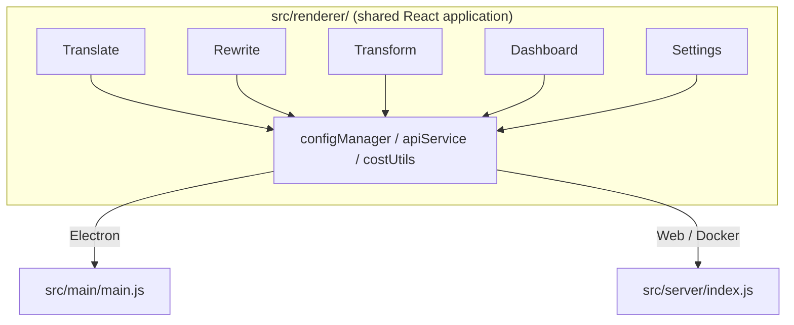

<p align="center">
  
</p>

<h1 align="center">Transrewrt</h1>

<p align="center">
  <a href="https://github.com/wsj-br/transrewrt/releases"></a>
  <a href="LICENSE"></a>
  
  
  
</p>

Op AI gebaseerdteksttool: vertalen tussen talen, herschrijven in verschillende stijlen en transformeren met aangepaste prompts – allemaal via [OpenRouter](https://openrouter.ai). Werkt als een desktop-app (Electron) of een zelf-gehoste webapp (Docker).

- **Vertalen** - tussen tientallen talen, met automatische brondetectie
- **Herschrijven** - grammatica verbeteren, duidelijkheid verhogen, formeel/informeel, inkorten, uitbreiden, technisch
- **Transformeren** - aangepaste AI-prompts; prompts maken en beheren, optionele doeltaal per prompt
- **Modellen & kosten** - elke OpenRouter-model kiezen; Kosten-dashboard met SQLite-log, samenvattingen per model/operatie/dag
- **UI** - i18n (pt-BR, de, fr, es, RTL), thema's, lettertypes, sneltoetsen; beveiligde webmodus (API-sleutel alleen op server)
- **Desktop** - Electron-app voor Windows en Linux
- **Zelf-hostend** - Docker-image voor amd64 & arm64 (Raspberry Pi-klaar)

Zie na installatie de **[Gebruikershandleiding](../USER-GUIDE.md)** voor een volledige uitleg van alle functies.

<small>**Lees in andere talen:** [English (UK)](../README.md) · [Português (BR)](README.pt-BR.md) · [العربية](README.ar.md) · [বাংলা](README.bn.md) · [Català](README.ca.md) · [简体中文](README.zh-CN.md) · [繁體中文](README.zh-TW.md) · [Hrvatski](README.hr.md) · [Čeština](README.cs.md) · [Nederlands](README.nl.md) · [English (US)](README.en-US.md) · [Filipino](README.tl.md) · [Français](README.fr.md) · [Deutsch](README.de.md) · [Ελληνικά](README.el.md) · [हिन्दी](README.hi.md) · [Magyar](README.hu.md) · [Italiano](README.it.md) · [日本語](README.ja.md) · [Basa Jawa](README.jv.md) · [한국어](README.ko.md) · [Bahasa Melayu](README.ms.md) · [فارسی](README.fa.md) · [Polski](README.pl.md) · [Português (PT)](README.pt.md) · [ਪੰਜਾਬੀ](README.pa.md) · [Română](README.ro.md) · [Русский](README.ru.md) · [Slovenčina](README.sk.md) · [Español](README.es.md) · [Kiswahili](README.sw.md) · [Svenska](README.sv.md) · [తెలుగు](README.te.md) · [ภาษาไทย](README.th.md) · [Türkçe](README.tr.md) · [Українська](README.uk.md) · [Tiếng Việt](README.vi.md)</small>

<a id="screenshots"></a>
## Schermafbeeldingen

**Taalkeuze**


**Vertalen**


**Transformeren - prompt-editor**


**Dashboard**


**Instellingen - modelselectie**


<br /><br />

<a id="table-of-contents"></a>
## Inhoudsopgave

<!-- START doctoc generated TOC please keep comment here to allow auto update -->
<!-- DON'T EDIT THIS SECTION, INSTEAD RE-RUN doctoc TO UPDATE -->

- [Snelstart](#quick-start)
- [Installatie](#installation)
  - [Windows (Electron)](#windows-electron)
  - [Linux (Electron)](#linux-electron)
  - [Docker](#docker)
- [Een OpenRouter-API-sleutel krijgen](#getting-an-openrouter-api-key)
- [Configuratie en omgeving](#configuration-and-environment)
- [Ontwikkeling en architectuur](#development-and-architecture)
- [Releases en tags](#releases-and-tags)
- [Bijdragen](#contributing)
- [Disclaimer](#disclaimer)
- [Licentie](#license)

<!-- END doctoc generated TOC please keep comment here to allow auto update -->

<br /><br />

<a id="quick-start"></a>

## Snelstart

**Docker (aanbevolen voor zelf-hosting)**

```bash
docker pull ghcr.io/wsj-br/transrewrt:latest

API_KEY=sk-or-your-key docker run -d \
  -p 5000:5000 \
  -v transrewrt-data:/app/data \
  -e API_KEY \
  --name transrewrt-web \
  ghcr.io/wsj-br/transrewrt:latest
```

Vervang `sk-or-your-key` door je [OpenRouter API-sleutel](https://openrouter.ai/keys). Open [http://localhost:5000](http://localhost:5000) en verander het standaard admin-wachtwoord voordat je de service blootstelt.

<br />

> ℹ️ **OPMERKING**<br/>
> In Docker wordt de OpenRouter API-sleutel alleen ingesteld via de `API_KEY` omgevingsvariabele (niet in de web UI). Op desktop (Electron) plak je het in **Instellingen → API**.

<br />

**Windows**

Download de nieuwste `Transrewrt Setup x.y.z.exe` van [Releases](https://github.com/wsj-br/transrewrt/releases), voer de installer uit, en start vanuit het Startmenu of het bureaublad-snelkoppeling. Voer je OpenRouter API-sleutel in **Instellingen → API**.

<br />

**Linux**

Download de `.AppImage` van [Releases](https://github.com/wsj-br/transrewrt/releases), en dan:

```bash
chmod +x Transrewrt-x.y.z.AppImage && ./Transrewrt-x.y.z.AppImage
```

Voer je OpenRouter API-sleutel in **Instellingen → API**. Op Debian/Ubuntu moet je mogelijk eerst extra dependencies installeren:

```bash
sudo apt install libgtk-3-0 libnotify-dev libnss3 libxss1 libasound2 libxtst6 xauth
```

Zie [Installatie → Linux](#linux-electron) voor details.

<br />

> ℹ️ **OPMERKING**<br/>
> macOS wordt momenteel niet ondersteund. Transrewrt is beschikbaar voor Windows, Linux, en Docker.

<br />

Zodra de app draait, zie de **[Gebruikersgids](../USER-GUIDE.md)** om te leren hoe je tekst vertaalt, herschrijft, en transformeert, prompts beheert, en modellen configureert.

<br /><br />

<a id="installation"></a>
## Installatie

<a id="windows-electron"></a>
### Windows (Electron)

- Download de nieuwste installer van [Releases](https://github.com/wsj-br/transrewrt/releases).
- Voer de `.exe` uit en volg de installer.
- Eerste keer: start de app vanuit het Startmenu of het bureaublad-snelkoppeling. Configuratie is opgeslagen in `%APPDATA%\transrewrt\`.

<br />

<a id="linux-electron"></a>
### Linux (Electron)

- Download de `.AppImage` van [Releases](https://github.com/wsj-br/transrewrt/releases).
- Voer uit: `chmod +x Transrewrt-x.y.z.AppImage && ./Transrewrt-x.y.z.AppImage`
- Extra dependencies (Debian/Ubuntu): `sudo apt install libgtk-3-0 libnotify-dev libnss3 libxss1 libasound2 libxtst6 xauth`
- Zie [dev/DEVELOPMENT.md](../dev/DEVELOPMENT.md) voor meer.

<br />

<a id="docker"></a>
### Docker

- Haal: `docker pull ghcr.io/wsj-br/transrewrt:latest`
- De OpenRouter API-sleutel **moet** worden ingesteld via de `API_KEY` omgevingsvariabele. Geef het door met `-e API_KEY` (of via `docker compose` / `.env`) zodat de sleutel niet zichtbaar is in de proceslijst.
- De API-sleutel kan niet worden ingevoerd in de web UI.

Voorbeeld - named volume voor persistentie (API-sleutel doorgegeven via env, niet in de commandoregel):

```bash
API_KEY=sk-or-your-key docker run -d \
  -p 5000:5000 \
  -v transrewrt-data:/app/data \
  -e API_KEY \
  --name transrewrt-web \
  ghcr.io/wsj-br/transrewrt:latest
```

<br />

| Optie   | Beschrijving                                                                                                   |
| ------- | --------------------------------------------------------------------------------------------------------------- |
| Poort   | `5000` (koppel met `-p 5000:5000`)                                                                              |
| Volume  | Koppel `/app/data` voor configuratie en database-persistentie                                                   |
| Omgevingsvariabelen | `PORT`, `CONFIG_PATH`, `API_KEY`, `API_URL`, `KEY_SEED` - zie [Configuratie](#configuration-and-environment) |

Om vanuit de bron te bouwen en te draaien: `docker compose up --build -d` of `pnpm run docker:up` - zie [dev/DEVELOPMENT.md](../dev/DEVELOPMENT.md).

<br /><br />

<a id="getting-an-openrouter-api-key"></a>
## Een OpenRouter API-sleutel verkrijgen

Transrewrt gebruikt [OpenRouter](https://openrouter.ai) voor AI-modellen. Je hebt een API-sleutel nodig om tekst te vertalen, herschrijven, of te transformereren.

1. Registreer je of log in bij [openrouter.ai](https://openrouter.ai).
2. Open de [Sleutels](https://openrouter.ai/keys) pagina en maak een nieuwe sleutel (noem het, en stel optioneel een kredietlimiet in). Je kunt gratis modellen gebruiken zonder krediet toe te voegen.
3. **Desktop (Electron):** plak de sleutel in **Instellingen → API**. **Docker:** stel de `API_KEY` omgevingsvariabele in (zie [Snelstart](#quick-start)).

Voor limieten, BYOK, en meer, zie [OpenRouter-authenticatie](https://openrouter.ai/docs/api/reference/authentication).

<br /><br />

<a id="configuration-and-environment"></a>

## Configuratie en omgeving

**Locaties configuratiebestand**

| Implementatie        | Configuratie locatie                              |
| -------------------- | ------------------------------------------------- |
| Electron (Windows)   | `%APPDATA%\transrewrt\`                           |
| Electron (Linux)     | `~/.config/transrewrt/`                           |
| Web / Docker         | `/app/data/config.json` (gebruik een volume om te bewaren) |

<br />

**Omgevingsvariabelen** (alleen web/Docker; Electron gebruikt het lokale configuratiebestand)

| Variabele      | Standaard                        | Beschrijving                                                   |
| -------------- | -------------------------------- | ------------------------------------------------------------- |
| `PORT`         | `5000`                           | Luisterpoort van de server                                    |
| `CONFIG_PATH`  | `/app/data/config.json`          | Pad naar het configuratiebestand                              |
| `API_KEY`      | *(leeg)*                         | OpenRouter API-sleutel (vereist voor Docker; stel in via env, niet via UI) |
| `API_URL`      | `https://openrouter.ai/api/v1`   | Basis-URL van de upstream AI API                             |
| `KEY_SEED`     | *(leeg)*                         | Transrewrt proxy-sleutel zaad (overschrijft config als ingesteld) |

<br />

**Gegevens en persistentie:** Voor Docker, koppel een volume aan op `/app/data` zodat `config.json` en de SQLite-database bewaard blijven bij herstarten van de container. Zonder een volume gaan alle gegevens verloren wanneer de container stopt.

<br />

**Web authenticatie:**

- Standaard beheerder: `admin` / `transrewrt26`.
- Gebruikers beheren in **Instellingen → Gebruikers**.
- Wachtwoord resetten: `docker exec <container> reset-web-password '<gebruikersnaam>' '<nieuw-wachtwoord>'`
  (van bron: `pnpm run reset-web-password -- <gebruikersnaam> <nieuw-wachtwoord>`)

<br />

> ⚠️ **WAARSCHUWING**<br/>
> Wijzig het standaard beheerderswachtwoord onmiddellijk op elke netwerktoegankelijke host.

<br />

**Transrewrt proxy (optioneel):** Je kunt API-verkeer routeren via een externe proxy die een tijdgebaseerd roterende sleutel gebruikt. In **Instellingen → API**, schakel **Gebruik Transrewrt Proxy** in, stel **Sleutel zaad** in en stel **API URL** in op de proxy-basis-URL. Zie [dev/SYSTEM-OVERVIEW.md](../dev/SYSTEM-OVERVIEW.md) voor details.

Belangrijke instellingen (thema, lettertype, modellen, talen, etc.) zijn beschikbaar in het Instellingen dialoogvenster of kunnen direct in de config JSON worden bewerkt. De volledige lijst en standaardwaarden zijn gedocumenteerd in [dev/DEVELOPMENT.md](../dev/DEVELOPMENT.md).

<br /><br />

<a id="development-and-architecture"></a>
## Ontwikkeling en architectuur

- **Ontwikkeling:** Setup, build, test en deploy (Electron, Web, Docker) - zie **[dev/DEVELOPMENT.md](../dev/DEVELOPMENT.md)**.
- **Architectuur en systeemoverzicht:** Folderstructuur, tech stack, ontbeslissingen, Transrewrt proxy - zie **[dev/SYSTEM-OVERVIEW.md](../dev/SYSTEM-OVERVIEW.md)**.



<br /><br />

<a id="releases-and-tags"></a>
## Releases en tags

- **Git tags** `v`* (bijv. `v1.0.10`) starten de [release workflow](.github/workflows/release.yml). **GitHub Releases** voegen de Windows installer (`.exe`) en Linux AppImage bij.
- **Docker images** worden gepubliceerd naar `ghcr.io/wsj-br/transrewrt`. Image tags komen overeen met de Git-versie (bijv. `v1.0.10` → `ghcr.io/wsj-br/transrewrt:1.0.10`) plus `latest`. Multi-arch: `linux/amd64` en `linux/arm64` (bijv. Raspberry Pi).

<br /><br />

<a id="contributing"></a>
## Bijdragen

1. Fork de repository.
2. Maak een feature branch: `git checkout -b feature/my-feature`
3. Commit je wijzigingen met een duidelijke melding.
4. Push en open een Pull Request tegen `main`.

Houd je aan de bestaande codestijl en test je wijzigingen in zowel Electron als web modi voordat je indient. Zie [dev/DEVELOPMENT.md](../dev/DEVELOPMENT.md) voor build- en testinstructies.

<br />

**Problemen rapporteren:** Open een issue op [GitHub](https://github.com/wsj-br/transrewrt/issues). Neem je platform (Windows / Linux / Docker) en app-versie (getoond in het Over dialoogvenster of op de Releases pagina) op.

<br /><br />

<a id="disclaimer"></a>

## Aansprakelijkheidsuitsluiting

Productnamen en iconen behoren tot hun respectievelijke eigenaren en worden uitsluitend gebruikt voor identificatiedoeleinden. Deze software is niet verbonden aan of goedgekeurd door een van de genoemde merken.

<br /><br />

<a id="license"></a>
## Licentie

Copyright © 2026 Waldemar Scudeller Jr.

[Apache License 2.0](LICENSE)