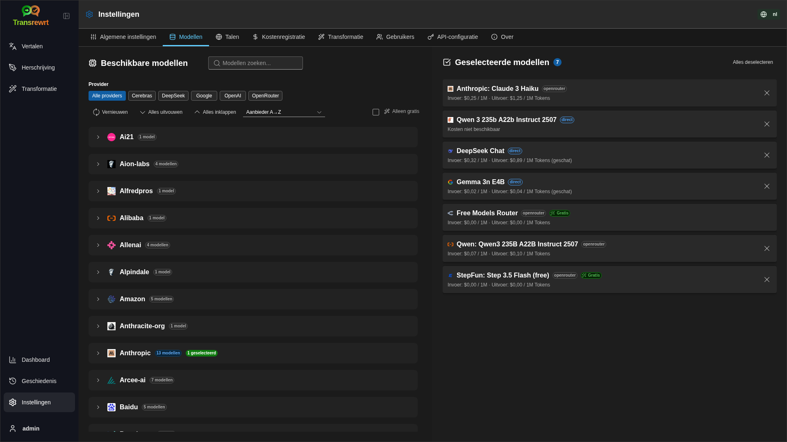

<p align="center">
  
</p>

<p align="center">
  <a href="https://github.com/wsj-br/transrewrt/releases"></a>
  <a href="LICENSE"></a>
  
  
  
</p>

AI-gestuurde teksttool: vertalen tussen talen, herschrijven in verschillende stijlen en transformeren met aangepaste prompts - met gebruik van meerdere AI-providers (OpenRouter, OpenAI, Anthropic, Google Gemini, DeepSeek, Groq, Mistral, xAI en lokaal Ollama). Werkt als desktopapp (Electron) of als zelfgehoste webapp (Docker).

- **Vertalen** - tussen tientallen talen, met automatische herkenning van de bron
- **Herschrijven** - grammatica verbeteren, duidelijkheid verbeteren, formeler/informeel, verkorten, uitbreiden, technisch
- **Transformeren** - aangepaste AI-prompts; prompts aanmaken en beheren, optionele doeltaal per prompt
- **Geschiedenis** - volledige uitvoeringsgeschiedenis met invoer/uitvoertekst, filteren en exporteren
- **Modellen en kosten** - kies modellen van elke geconfigureerde provider; kosten- en gebruiksdashboards met log, samenvattingen per model/operatie/dag
- **UI** - meertalige interface (30+ talen, ondersteuning voor RTL), lettertypen, ...
- **Webmodus** - ondersteuning voor meerdere gebruikers met beheerdersrollen
- **Desktop** - Electron-app voor Windows en Linux
- **Zelf gehost** - Docker-image voor amd64 & arm64 (klaar voor Raspberry Pi)

Nadat u het hebt geïnstalleerd, raadpleeg de [**Gebruikershandleiding**](USER-GUIDE.nl.md) voor een volledige uitleg van alle functies.

<small>**Lees in andere talen:** </small>
<small id="lang-list">[English (GB)](../README.md) · [Português (Brasil)](./README.pt-BR.md) · [العربية](./README.ar.md) · [বাংলা](./README.bn.md) · [Català](./README.ca.md) · [中文 (中国大陆)](./README.zh-CN.md) · [中文 (台灣)](./README.zh-TW.md) · [Hrvatski](./README.hr.md) · [Čeština](./README.cs.md) · [Nederlands](./README.nl.md) · [English (US)](./README.en-US.md) · [Tagalog](./README.tl.md) · [Français](./README.fr.md) · [Deutsch](./README.de.md) · [Ελληνικά](./README.el.md) · [हिन्दी](./README.hi.md) · [Magyar](./README.hu.md) · [Italiano](./README.it.md) · [日本語](./README.ja.md) · [한국어](./README.ko.md) · [Bahasa Melayu](./README.ms.md) · [فارسی](./README.fa.md) · [Polski](./README.pl.md) · [Basa Jawa](./README.jv.md) · [Português](./README.pt.md) · [ਪੰਜਾਬੀ](./README.pa.md) · [Română](./README.ro.md) · [Русский](./README.ru.md) · [Slovenčina](./README.sk.md) · [Español](./README.es.md) · [Kiswahili](./README.sw.md) · [Svenska](./README.sv.md) · [తెలుగు](./README.te.md) · [ไทย](./README.th.md) · [Türkçe](./README.tr.md) · [Українська](./README.uk.md) · [Tiếng Việt](./README.vi.md)</small>

<small>

> **Opmerking over vertalingen van de gebruikersinterface en documentatie:** Alle interface-talen behalve het oorspronkelijke Engels (GB)
> zijn vertaald met behulp van AI-modellen; de formulering kan onnauwkeurig zijn of fouten bevatten.

</small>

<br/>

<a id="table-of-contents"></a>
## Inhoudsopgave

<!-- START doctoc generated TOC please keep comment here to allow auto update -->
<!-- DON'T EDIT THIS SECTION, INSTEAD RE-RUN doctoc TO UPDATE -->

- [Schermafdrukken](#screenshots)
- [Snel aan de slag](#quick-start)
- [Een OpenRouter API-sleutel verkrijgen](#getting-an-openrouter-api-key)
- [Configuratie en omgeving](#configuration-and-environment)
- [Ontwikkeling en architectuur](#development-and-architecture)
- [Problemen melden](#reporting-issues)
- [Disclaimer](#disclaimer)
- [Licentie](#license)

<!-- END doctoc generated TOC please keep comment here to allow auto update -->

<br/><br/>

<a id="screenshots"></a>
## Schermafbeeldingen

**Taalkeuze**


**Vertalen**


**Transformatie - prompt-editor**


**Dashboard**


**Geschiedenis**


**Instellingen - modelkeuze**



<br/><br/>

<a id="quick-start"></a>
## Snel aan de slag

<details>
<summary><b>Docker (aanbevolen voor self-hosting)</b></summary>

<a id="docker"></a>

<br/>

```bash
docker pull ghcr.io/wsj-br/transrewrt:latest

OPENROUTER_API_KEY=sk-or-your-key docker run -d \
  -p 5000:5000 \
  -v transrewrt-data:/app/data \
  -e OPENROUTER_API_KEY \
  --name transrewrt-web \
  ghcr.io/wsj-br/transrewrt:latest
```

Vervang `sk-or-your-key` door jouw [OpenRouter API-sleutel](https://openrouter.ai/keys) (of stel andere provider-sleutels in; zie [Configuratie](#configuration-and-environment)). Open [http://localhost:5000](http://localhost:5000) en wijzig het standaard beheerderswachtwoord voordat je de service openstelt.

Stel minstens één providersleutel in via omgevingsvariabelen (bijvoorbeeld `OPENROUTER_API_KEY` voor OpenRouter). Geef variabelen door met `-e` of `docker compose` / `.env` zodat geheimen niet in de image worden opgenomen. Providersleutels worden **niet** ingevoerd in de webinterface; de server leest ze uit de omgeving.

<br/>

> ℹ️ **OPMERKING**<br/>
> In Docker worden LLM-referenties ingesteld met omgevingsvariabelen zoals `OPENROUTER_API_KEY`, `OPENAI_API_KEY`, `CEREBRAS_API_KEY`, … (niet in de webinterface). Op desktop (Electron) configureer je sleutels in **Instellingen → API**.

<br/>

Of gebruik Docker Compose:

```bash
# download the compose file
wget https://github.com/wsj-br/transrewrt/raw/refs/heads/master/production.yml -O transrewrt.yml
# Edit the file to add your API keys (API_KEYs), or uncomment and adjust the `.env` file. Set the timezone (TZ) if necessary.
vi transrewrt.yml
# start the container
docker compose -f transrewrt.yml up -d
```

Zie [Configuratie](#configuration-and-environment) voor alle omgevingsvariabelen, zoals `PORT`, `CONFIG_PATH`, `TZ`, en LLM-sleutels (`OPENROUTER_API_KEY`, `OPENAI_API_KEY`, …).

</details>

<br/>

<details>
<summary><b>Tijdzone van de server (Docker)</b></summary>

<a id="configuring-the-timezone"></a>

<br/>

De datum en tijd in de gebruikersinterface volgen de **browserlocale** en tijdzone. Voor **serverzijde** gedrag (loggen en dergelijke) gebruikt de container de omgevingsvariabele `TZ`. De standaardwaarde is `TZ=Europe/London`.

Om een andere tijdzone te gebruiken, stel `TZ` in je Compose-bestand in, bijvoorbeeld:

```yaml
environment:
  - TZ=America/Sao_Paulo
```

Of geef deze door bij het starten van de container (Docker):

```bash
--env TZ=America/Sao_Paulo
```

Op veel Linux-systemen kun je de systeemtijdzonenaam kopiëren met:

```bash
echo TZ=\"$(</etc/timezone)\"
```

Een lijst met geldige tijdzonenamen wordt bijgehouden in de [tz-database](https://en.wikipedia.org/wiki/List_of_tz_database_time_zones) (Wikipedia).

</details>

<br/>

<details>
<summary><b>Windows</b></summary>

<a id="windows-electron"></a>

<br/>

- Download de nieuwste `Transrewrt Setup x.y.z.exe` van [Releases](https://github.com/wsj-br/transrewrt/releases).
- Voer het `.exe` uit en volg de installatie.
- Eerste keer: start de app via het Startmenu of bureaubladsnelkoppeling.
- Voer je API-sleutels in bij **Instellingen → API**. Je moet minstens één provider configureren; OpenRouter is gebruikelijk voor gratis modellen.

<br/>

> ℹ️ **OPMERKING**<br/>
> Windows kan een van deze beveiligingswaarschuwingen tonen (normaal bij ondertekende/indie-apps):
>   - **User Account Control (UAC)**: "Wilt u toestaan dat deze app van een onbekende uitgever wijzigingen aanbrengt op uw apparaat?" → Klik op **Ja**.
>   - **Microsoft Defender SmartScreen**: "Windows heeft uw PC beveiligd" → Klik op **Meer informatie** → **Toch uitvoeren**.
>
> Dit gebeurt omdat de app niet is ondertekend door Microsoft of een grote uitgever — het is veilig als je deze hebt gedownload van onze officiële GitHub-releases (controleer de checksums op de [Releases](https://github.com/wsj-br/transrewrt/releases)-pagina naast elk bestand).

<br/>

</details>

<br/>

<details>
<summary><b>Linux</b></summary>

<a id="linux-electron"></a>

<br/>

Download het `.AppImage` voor je CPU van [Releases](https://github.com/wsj-br/transrewrt/releases) (`x64` voor typische pc's, `arm64` voor veel ARM-apparaten, inclusief Raspberry Pi 4+), daarna:

```bash
chmod +x Transrewrt-x.y.z-x64.AppImage && ./Transrewrt-x.y.z-x64.AppImage
```

Gebruik op x86_64/amd64 de `x64` bestandsnaam; op ARM64 gebruik je de `...-arm64.AppImage` naam.

Voer je API-sleutels in bij **Instellingen → API**. Je moet minstens één provider configureren; OpenRouter is veelgebruikt voor gratis modellen.

**Consoleberichten:** Gepackagde Linux-versies (`x64` en `arm64` AppImages) onderdrukken Node deprecatie-waarschuwingen in de terminal (bijvoorbeeld de ingebouwde `punycode` module). Als Chromium GPU / EGL fouten afdrukt zoals “GLES3 is niet ondersteund”, maar de app werkt wel, kun je deze stilzetten door hardwareversnelling uit te schakelen:

```bash
TRANSREWRT_DISABLE_GPU=1 ./Transrewrt-x.y.z-arm64.AppImage
```

Dit geldt ook voor amd64; wijzig de bestandsnaam zodat deze overeenkomt met jouw download.

Op Debian/Ubuntu heb je mogelijk extra **runtime**-bibliotheken nodig die vereist zijn door Chromium (deze zijn vaak al aanwezig bij volledige desktopinstallaties). Voer de onderstaande commando's uit indien nodig:

```bash
sudo apt update
sudo apt install -y libfuse2 libgtk-3-0 libnotify4 libnss3 libnspr4 libxss1 libxtst6 xdg-utils \
     xauth libatspi2.0-0 libdrm2 libgbm1 libxcb-dri3-0 libcups2 libasound2t64
```

vervang `libasound2t64` door `libasound2` voor `arm64`. Minimale of aangepaste installaties kunnen nog steeds mislukken met een ontbrekend `.so` bestand. Installeer het pakket met de naam uit de foutmelding (veelvoorkomende extra's: `libatk1.0-0`, `libatk-bridge2.0-0`, `libgbm1`, `libdrm2`). In sommige omgevingen moet je de app mogelijk uitvoeren met `APPIMAGE_EXTRACT_AND_RUN=1 ./Transrewrt-….AppImage`.

<br/>

> ℹ️ **OPMERKING**<br/>
> macOS wordt momenteel niet ondersteund. Transrewrt is beschikbaar voor Windows, Linux en Docker.

</details>

<br/>

Zodra de app actief is, raadpleeg de [**Gebruikershandleiding**](USER-GUIDE.nl.md) om te leren hoe u tekst kunt vertalen, herschrijven en transformeren, prompts kunt beheren en modellen kunt configureren.

<br/><br/>

<a id="getting-an-openrouter-api-key"></a>
## Een OpenRouter API-sleutel verkrijgen

Transrewrt ondersteunt meerdere AI-providers. [OpenRouter](https://openrouter.ai) is een populaire keuze omdat het veel modellen onder één sleutel bundelt en gratis modellen aanbiedt.

1. Meld je aan of log in op [openrouter.ai](https://openrouter.ai).
2. Ga naar de [Keys](https://openrouter.ai/keys) pagina en maak een nieuwe sleutel aan (geef deze een naam, en stel eventueel een kredietlimiet in). Je kunt gratis modellen gebruiken zonder krediet toe te voegen.
3. **Desktop (Electron):** plak de sleutels in **Instellingen → API**. **Docker:** stel omgevingsvariabelen in zoals `OPENROUTER_API_KEY` (zie [Snel aan de slag](#quick-start)).

Gebruik OpenRouter’s **Body Builder** model ([`openrouter/bodybuilder`](https://openrouter.ai/openrouter/bodybuilder)) niet voor vertalen, herschrijven of transformeren: het retourneert JSON-verzoekgegevens, niet de voltooide tekst voor deze taken. Zie [Instellingen → Modellen](USER-GUIDE.nl.md#models) in de Gebruikershandleiding.

Je kunt ook andere providers gebruiken (OpenAI, Anthropic, Google Gemini, DeepSeek, Groq, Mistral, xAI, Cerebras) of modellen lokaal uitvoeren met [Ollama](https://ollama.com). Zie [Configuratie](#configuration-and-environment) voor de volledige lijst met ondersteunde providers en omgevingsvariabelen.

</br>

> ⚠️ **WAARSCHUWING**<br/>
> Als je Ollama gebruikt vanaf een ander apparaat, container of service, vergeet dan niet Ollama te configureren om externe verbindingen toe te staan (niet alleen localhost).

<br/><br/>

<a id="configuration-and-environment"></a>
## Configuratie en omgeving

</br>

**Locaties van configuratiebestanden**

| Implementatie         | Configuratielocatie                                   |
| ------------------ | ------------------------------------------------- |
| Electron (Windows) | `%APPDATA%\transrewrt\`                           |
| Electron (Linux)   | `~/.config/transrewrt/`                           |
| Web / Docker       | `/app/data/config.json` (gebruik een volume om op te slaan) |

<br/>

**Omgevingsvariabelen** (alleen web/Docker; Electron gebruikt het lokale configuratiebestand)

| Variabele             | Beschrijving                                                                  |
|----------------------|------------------------------------------------------------------------------|
| `PORT`               | Poort waarop de server luistert (standaard `5000`)                                  |
| `CONFIG_PATH`        | Pad naar het configuratiebestand (standaard is `/app/data/config.json`)                |
| `TZ`                 | tijdzone voor serverzijde tijd (loggen, enz.) (standaard `Europe/London`) |
| `HISTORY_DISABLED`   | Forceer geschiedenisregistratie uit (optioneel, standaard is `false`)                  |
| `OPENROUTER_API_KEY` | OpenRouter API-sleutel                                                           |
| `OPENAI_API_KEY`     | OpenAI API-sleutel                                                               |
| `CEREBRAS_API_KEY`   | Cerebras API-sleutel                                                             |
| `ANTHROPIC_API_KEY`  | Anthropic API-sleutel                                                            |
| `GOOGLE_API_KEY`     | Google Gemini API-sleutel                                                        |
| `DEEPSEEK_API_KEY`   | DeepSeek API-sleutel                                                             |
| `GROQ_API_KEY`       | Groq API-sleutel                                                                 |
| `MISTRAL_API_KEY`    | Mistral API-sleutel                                                              |
| `OLLAMA_URL`         | Ollama basis-URL (bijv. `http://host.docker.internal:11434`)                   |
| `XAI_API_KEY`        | xAI API-sleutel                                                                  |

**Privacymodus:** Om de geschiedenisregistratie uit te schakelen, ongeacht `config.json` of gebruikersvoorkeuren, stel `HISTORY_DISABLED` in op `true` of `1` (niet hoofdlettergevoelig) voor het **web/Docker-serverproces** en/of het **Electron-desktop hoofdproces** (bijvoorbeeld systeem- of startomgeving — niet alleen de renderer). Dit schakelt het opslaan van invoer/uitvoer-geschiedenis uit, vergrendelt **Instellingen → Algemene instellingen → Geschiedenis** en blokkeert geschiedenisgerelateerde API's.

Configureer alleen de providers die u gebruikt. Model-ID's zijn genamespace (`openrouter/…`, `openai/…`, `cerebras/…`, `ollama/…`, enz.).

**Kostenweergave:** OpenRouter retourneert de exacte factuurkosten indien van toepassing. Andere providers gebruiken de **geschatte** kosten van OpenRouter’s openbare modelprijzen wanneer een OpenRouter-sleutel beschikbaar is; zonder deze kunnen kosten van niet-OpenRouter worden weergegeven als `0`. Schattingen zijn geen facturen.

<br/>

**Gegevens en persistentie:** Voor Docker, koppel een volume aan `/app/data` zodat `config.json` en de SQLite-database behouden blijven bij het opnieuw opstarten van de container. Zonder een volume gaan alle gegevens verloren wanneer de container stopt.

<br/>

**Webverificatie:**

- Standaardbeheerder: `admin` / `transrewrt26`.
- Beheer gebruikers in **Instellingen → Gebruikers**.
- Wachtwoord opnieuw instellen: `docker exec <container> reset-web-password '<username>' '<new-password>'`

<br/>

> ⚠️ **WAARSCHUWING**<br/>
> Wijzig het standaardbeheerderswachtwoord onmiddellijk op elk netwerktoegankelijke host.

<br/>

Sleutelinstellingen (lettertype, modellen, talen, enz.) zijn beschikbaar in de applicatie-instellingen.

<br/><br/>

<a id="development-and-architecture"></a>
## Ontwikkeling en architectuur

- **Ontwikkeling:** Installatie, builden, testen en implementeren (Electron, Web, Docker) - zie [dev/DEVELOPMENT.md](../dev/DEVELOPMENT.md).
- **Architectuur en systeemoverzicht:** Mapstructuur, technologiestack, ontwerpbeslissingen - zie [dev/SYSTEM-OVERVIEW.md](../dev/SYSTEM-OVERVIEW.md).

<br/><br/>

<a id="reporting-issues"></a>
## Problemen melden

Open een issue op [GitHub](https://github.com/wsj-br/transrewrt/issues). Vermeld uw platform (Windows / Linux / Docker) en app-versie (weergegeven in het Over-dialoog of op de Releases-pagina).

<br/><br/>

<a id="disclaimer"></a>
## Disclaimer

Productnamen en pictogrammen behoren toe aan hun respectieve eigenaren en worden alleen gebruikt ter identificatie. Deze software is niet gelieerd aan of goedgekeurd door een van de genoemde merken.

<br/><br/>

<a id="license"></a>
## Licentie

Copyright © 2026 Waldemar Scudeller Jr.

[Apache License 2.0](../LICENSE)
