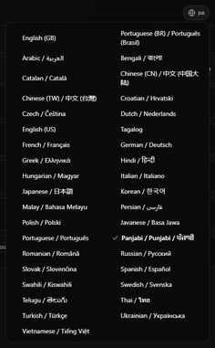
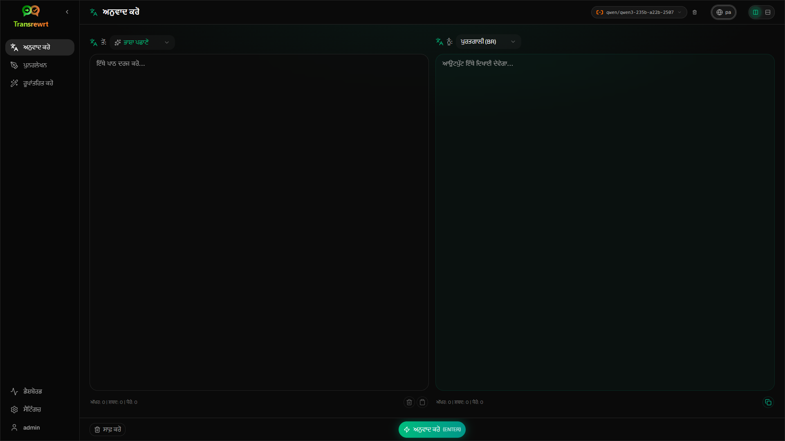
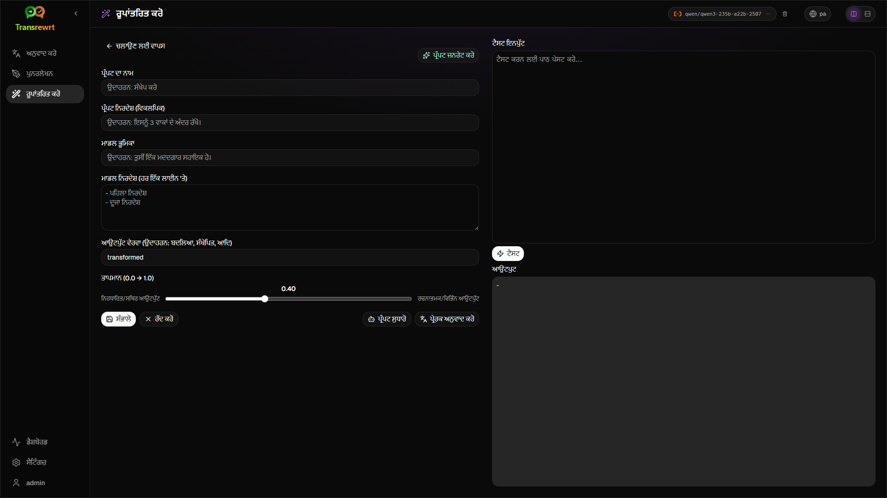
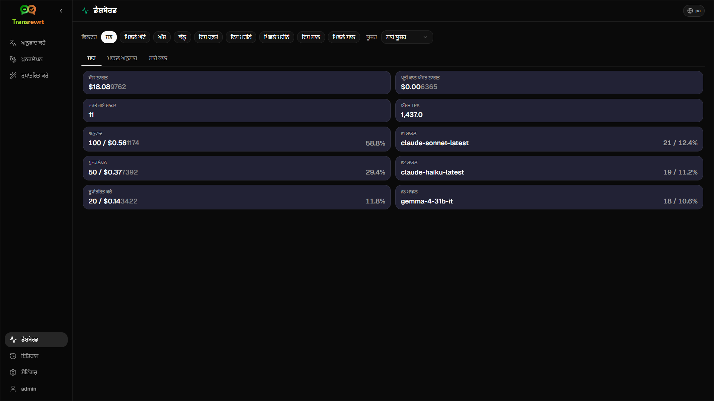
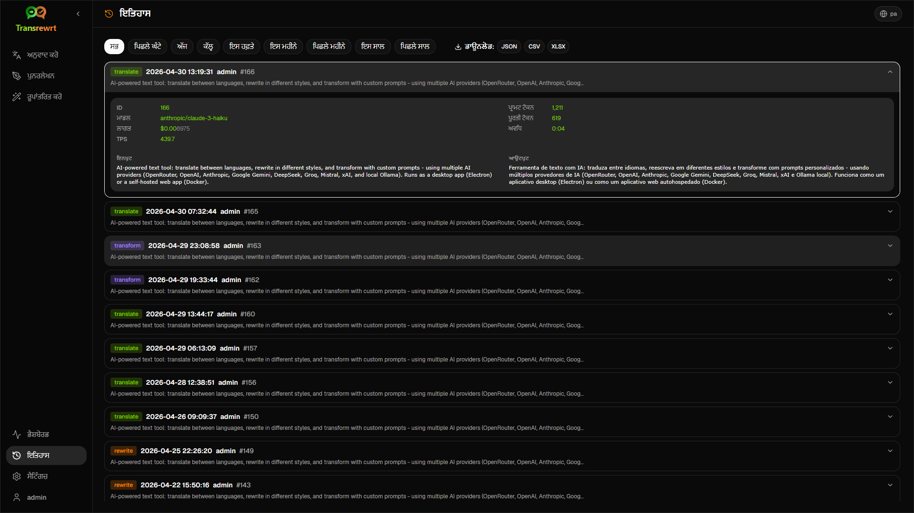
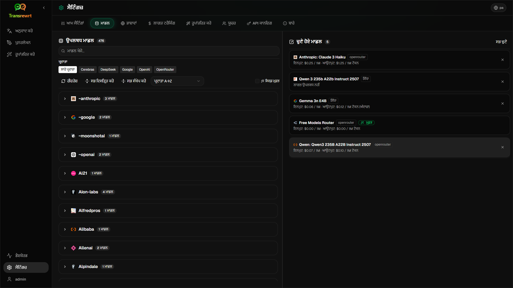

<p align="center">
  
</p>

<p align="center">
  <a href="https://github.com/wsj-br/transrewrt/releases"></a>
  <a href="LICENSE"></a>
  
  
  
</p>

AI-ਸ਼ਕਤੀਸ਼ਾਲੀ ਟੈਕਸਟ ਟੂਲ: ਭਾਸ਼ਾਵਾਂ ਵਿੱਚ ਅਨੁਵਾਦ ਕਰੋ, ਵੱਖ-ਵੱਖ ਸ਼ੈਲੀਆਂ ਵਿੱਚ ਮੁੜ-ਲਿਖੋ, ਅਤੇ ਕਸਟਮ ਪ੍ਰੋਂਪਟਾਂ ਨਾਲ ਟ੍ਰਾਂਸਫਾਰਮ ਕਰੋ - ਕਈ AI ਪ੍ਰਦਾਤਾਵਾਂ (OpenRouter, OpenAI, Anthropic, Google Gemini, DeepSeek, Groq, Mistral, xAI, ਅਤੇ ਸਥਾਨਕ Ollama) ਦੀ ਵਰਤੋਂ ਕਰਦੇ ਹੋਏ। ਡੈਸਕਟਾਪ ਐਪ (Electron) ਜਾਂ ਸੈਲਫ-ਹੋਸਟਡ ਵੈੱਬ ਐਪ (Docker) ਵਜੋਂ ਚਲਦਾ ਹੈ।

- **ਅਨੁਵਾਦ ਕਰੋ** - ਦਰਜਨਾਂ ਭਾਸ਼ਾਵਾਂ ਵਿੱਚ, ਆਟੋਮੈਟਿਕ ਸਰੋਤ ਪਛਾਣ ਨਾਲ
- **ਪੁਨਰਲੇਖਨ** - ਵਿਆਕਰਨ ਠੀਕ ਕਰੋ, ਸਪਸ਼ਟਤਾ ਵਧਾਓ, ਔਪਚਾਰਿਕ/ਅਣਔਪਚਾਰਿਕ, ਛੋਟਾ ਕਰੋ, ਵਧਾਓ, ਤਕਨੀਕੀ
- **ਰੂਪਾਂਤਰਿਤ ਕਰੋ** - ਕਸਟਮ ਏਆਈ ਪ੍ਰੰਪਟ; ਪ੍ਰੰਪਟ ਬਣਾਓ ਅਤੇ ਪ੍ਰਬੰਧਿਤ ਕਰੋ, ਹਰੇਕ ਪ੍ਰੰਪਟ ਲਈ ਵਿਕਲਪਿਕ ਟੀਚਾ ਭਾਸ਼ਾ
- **ਇਤਿਹਾਸ** - ਇਨਪੁਟ/ਆਉਟਪੁਟ ਟੈਕਸਟ, ਫਿਲਟਰਿੰਗ, ਅਤੇ ਨਿਰਯਾਤ ਨਾਲ ਪੂਰਾ ਕਾਰਜ ਇਤਿਹਾਸ
- **ਮਾਡਲ ਅਤੇ ਲਾਗਤ** - ਕਿਸੇ ਵੀ ਕੰਫਿਗਰ ਕੀਤੇ ਪ੍ਰਦਾਤਾ ਤੋਂ ਮਾਡਲ ਚੁਣੋ; ਲਾਗਤ ਅਤੇ ਵਰਤੋਂ ਡੈਸ਼ਬੋਰਡ ਲੌਗ, ਮਾਡਲ/ਆਪਰੇਸ਼ਨ/ਦਿਨ ਅਨੁਸਾਰ ਸਾਰਾਂਸ਼
- **ਯੂਆਈ** - ਬਹੁਭਾਸ਼ੀ ਇੰਟਰਫੇਸ (30+ ਭਾਸ਼ਾਵਾਂ, ਆਰਟੀਐਲ ਸਹਾਇਤਾ), ਫੋਂਟ, ...
- **ਵੈੱਬ ਮੋਡ** - ਐਡਮਿਨ ਭੂਮਿਕਾਵਾਂ ਨਾਲ ਬਹੁ-ਯੂਜ਼ਰ ਸਹਾਇਤਾ
- **ਡੈਸਕਟਾਪ** - ਵਿੰਡੋਜ਼ ਅਤੇ ਲੀਨਕਸ ਲਈ ਇਲੈਕਟ੍ਰਾਨ ਐਪ
- **ਆਪਣੇ ਆਪ ਹੋਸਟ ਕੀਤਾ** - ਐਮਡੀ64 ਅਤੇ ਐਆਰਐਮ64 (ਰਾਸਪਬੇਰੀ ਪਾਈ-ਤਿਆਰ) ਲਈ ਡਾਕਰ ਇਮੇਜ

ਇੰਸਟਾਲ ਹੋਣ ਤੋਂ ਬਾਅਦ, ਸਾਰੀਆਂ ਵਿਸ਼ੇਸ਼ਤਾਵਾਂ ਦੀ ਪੂਰੀ ਜਾਂਚ ਲਈ [**ਯੂਜ਼ਰ ਗਾਈਡ**](USER-GUIDE.pa.md) ਵੇਖੋ।

<small>**ਹੋਰ ਭਾਸ਼ਾਵਾਂ ਵਿੱਚ ਪੜ੍ਹੋ:** </small>
<small id="lang-list">[English (GB)](../README.md) · [Português (Brasil)](./README.pt-BR.md) · [العربية](./README.ar.md) · [বাংলা](./README.bn.md) · [Català](./README.ca.md) · [中文 (中国大陆)](./README.zh-CN.md) · [中文 (台灣)](./README.zh-TW.md) · [Hrvatski](./README.hr.md) · [Čeština](./README.cs.md) · [Nederlands](./README.nl.md) · [English (US)](./README.en-US.md) · [Tagalog](./README.tl.md) · [Français](./README.fr.md) · [Deutsch](./README.de.md) · [Ελληνικά](./README.el.md) · [हिन्दी](./README.hi.md) · [Magyar](./README.hu.md) · [Italiano](./README.it.md) · [日本語](./README.ja.md) · [한국어](./README.ko.md) · [Bahasa Melayu](./README.ms.md) · [فارسی](./README.fa.md) · [Polski](./README.pl.md) · [Basa Jawa](./README.jv.md) · [Português](./README.pt.md) · [ਪੰਜਾਬੀ](./README.pa.md) · [Română](./README.ro.md) · [Русский](./README.ru.md) · [Slovenčina](./README.sk.md) · [Español](./README.es.md) · [Kiswahili](./README.sw.md) · [Svenska](./README.sv.md) · [తెలుగు](./README.te.md) · [ไทย](./README.th.md) · [Türkçe](./README.tr.md) · [Українська](./README.uk.md) · [Tiếng Việt](./README.vi.md)</small>

<small>

> **UI ਅਤੇ ਦਸਤਾਵੇਜ਼ੀਕਰਨ ਅਨੁਵਾਦਾਂ ਬਾਰੇ ਨੋਟ:** ਮੂਲ ਅੰਗਰੇਜ਼ੀ (UK) ਨੂੰ ਛੱਡ ਕੇ ਸਾਰੀਆਂ ਇੰਟਰਫੇਸ ਭਾਸ਼ਾਵਾਂ 
> AI ਮਾਡਲਾਂ ਦੀ ਵਰਤੋਂ ਕਰਕੇ ਅਨੁਵਾਦਿਤ ਕੀਤੀਆਂ ਗਈਆਂ ਸਨ; ਸ਼ਬਦਾਵਲੀ ਅਸ਼ੁੱਧ ਹੋ ਸਕਦੀ ਹੈ ਜਾਂ ਗਲਤੀਆਂ ਸ਼ਾਮਲ ਹੋ ਸਕਦੀਆਂ ਹਨ।

</small>

<br/>

<a id="table-of-contents"></a>
## ਸਮੱਗਰੀ ਦੀ ਸੂਚੀ

<!-- START doctoc generated TOC please keep comment here to allow auto update -->
<!-- DON'T EDIT THIS SECTION, INSTEAD RE-RUN doctoc TO UPDATE -->

- [ਸਕਰੀਨਸ਼ਾਟ](#screenshots)
- [ਤੁਰੰਤ ਸ਼ੁਰੂਆਤ](#quick-start)
- [ਓਪਨਰਾਊਟਰ ਏਪੀਆਈ ਕੁੰਜੀ ਪ੍ਰਾਪਤ ਕਰਨਾ](#getting-an-openrouter-api-key)
- [ਕੰਫਿਗਰੇਸ਼ਨ ਅਤੇ ਵਾਤਾਵਰਣ](#configuration-and-environment)
- [ਵਿਕਾਸ ਅਤੇ ਆਰਕੀਟੈਕਚਰ](#development-and-architecture)
- [ਮੁੱਦਿਆਂ ਦੀ ਰਿਪੋਰਟਿੰਗ](#reporting-issues)
- [ਅਸਵੀਕਾਰ](#disclaimer)
- [ਲਾਇਸੈਂਸ](#license)

<!-- END doctoc generated TOC please keep comment here to allow auto update -->

<br/><br/>

<a id="screenshots"></a>
## ਸਕਰੀਨਸ਼ਾਟ

**ਭਾਸ਼ਾ ਚੋਣਕਰਤਾ**



**ਅਨੁਵਾਦ ਕਰੋ**



**ਟ੍ਰਾਂਸਫਾਰਮ - ਪ੍ਰੋਂਪਟ ਸੰਪਾਦਕ**



**ਡੈਸ਼ਬੋਰਡ**



**ਇਤਿਹਾਸ**



**ਸੈਟਿੰਗਾਂ - ਮਾਡਲ ਚੋਣ**



<br/><br/>

<a id="quick-start"></a>
## ਤੁਰੰਤ ਸ਼ੁਰੂਆਤ

<details>
<summary><b>Docker (ਸਵੈ-ਹੋਸਟਿੰਗ ਲਈ ਸਿਫਾਰਸ਼ ਕੀਤਾ ਗਿਆ)</b></summary>

<a id="docker"></a>

<br/>

```bash
docker pull ghcr.io/wsj-br/transrewrt:latest

OPENROUTER_API_KEY=sk-or-your-key docker run -d \
  -p 5000:5000 \
  -v transrewrt-data:/app/data \
  -e OPENROUTER_API_KEY \
  --name transrewrt-web \
  ghcr.io/wsj-br/transrewrt:latest
```

[OpenRouter API key](https://openrouter.ai/keys) ਨਾਲ `sk-or-your-key` ਨੂੰ ਬਦਲੋ (ਜਾਂ ਹੋਰ ਪ੍ਰਦਾਤਾ ਕੁੰਜੀਆਂ ਸੈੱਟ ਕਰੋ; [ਕਨਫਿਗਰੇਸ਼ਨ](#configuration-and-environment) ਵੇਖੋ)। [http://localhost:5000](http://localhost:5000) ਖੋਲ੍ਹੋ ਅਤੇ ਸੇਵਾ ਨੂੰ ਉਜਾਗਰ ਕਰਨ ਤੋਂ ਪਹਿਲਾਂ ਡਿਫਾਲਟ ਐਡਮਿਨ ਪਾਸਵਰਡ ਬਦਲੋ।

ਵਾਤਾਵਰਣ ਰਾਹੀਂ ਘੱਟੋ ਘੱਟ ਇੱਕ ਪ੍ਰਦਾਤਾ ਕੁੰਜੀ ਸੈੱਟ ਕਰੋ (ਉਦਾਹਰਣ ਲਈ OpenRouter ਲਈ `OPENROUTER_API_KEY`)। `-e` ਜਾਂ `docker compose` / `.env` ਨਾਲ ਚਲਦੀਆਂ ਚੀਜ਼ਾਂ ਪਾਸ ਕਰੋ ਤਾਂ ਜੋ ਗੁਪਤ ਚੀਜ਼ਾਂ ਚਿੱਤਰ ਵਿੱਚ ਨਾ ਜੋੜੀਆਂ ਜਾਣ। ਪ੍ਰਦਾਤਾ ਕੁੰਜੀਆਂ **ਵੈੱਬ UI ਵਿੱਚ ਦਾਖਲ ਨਹੀਂ ਕੀਤੀਆਂ ਜਾਂਦੀਆਂ**; ਸਰਵਰ ਉਹਨਾਂ ਨੂੰ ਵਾਤਾਵਰਣ ਤੋਂ ਪੜ੍ਹਦਾ ਹੈ।

<br/>

> ℹ️ **ਨੋਟ**<br/>
> Docker ਵਿੱਚ, LLM ਪ੍ਰਮਾਣ ਪੱਤਰਾਂ ਨੂੰ ਵਾਤਾਵਰਣ ਚਲਦੀਆਂ ਚੀਜ਼ਾਂ ਨਾਲ ਸੈੱਟ ਕੀਤਾ ਜਾਂਦਾ ਹੈ ਜਿਵੇਂ `OPENROUTER_API_KEY`, `OPENAI_API_KEY`, `CEREBRAS_API_KEY`, … (ਵੈੱਬ UI ਵਿੱਚ ਨਹੀਂ)। ਡੈਸਕਟਾਪ (Electron) ਉੱਤੇ ਤੁਸੀਂ **ਸੈਟਿੰਗਾਂ → API** ਵਿੱਚ ਕੁੰਜੀਆਂ ਕੰਫਿਗਰ ਕਰਦੇ ਹੋ।

<br/>

ਜਾਂ Docker Compose ਵਰਤੋ:

```bash
# download the compose file
wget https://github.com/wsj-br/transrewrt/raw/refs/heads/master/production.yml -O transrewrt.yml
# Edit the file to add your API keys (API_KEYs), or uncomment and adjust the `.env` file. Set the timezone (TZ) if necessary.
vi transrewrt.yml
# start the container
docker compose -f transrewrt.yml up -d
```

[ਕਨਫਿਗਰੇਸ਼ਨ](#configuration-and-environment) ਵਿੱਚ ਸਾਰੀਆਂ ਵਾਤਾਵਰਣ ਚਲਦੀਆਂ ਚੀਜ਼ਾਂ ਲਈ ਵੇਖੋ, ਜਿਵੇਂ `PORT`, `CONFIG_PATH`, `TZ`, ਅਤੇ LLM ਕੁੰਜੀਆਂ (`OPENROUTER_API_KEY`, `OPENAI_API_KEY`, …)।

</details>

<br/>

<details>
<summary><b>ਸਰਵਰ ਟਾਈਮਜ਼ੋਨ (Docker)</b></summary>

<a id="configuring-the-timezone"></a>

<br/>

ਐਪਲੀਕੇਸ਼ਨ ਯੂਜ਼ਰ ਇੰਟਰਫੇਸ ਦੀ ਮਿਤੀ ਅਤੇ ਸਮਾਂ **ਬਰਾਊਜ਼ਰ** ਦੇ ਸਥਾਨਕ ਸਥਾਪਨ ਅਤੇ ਸਮਾਂ ਖੇਤਰ ਦੀ ਪਾਲਣਾ ਕਰਦੇ ਹਨ। **ਸਰਵਰ-ਸਾਈਡ** ਵਰਤਾਓ (ਲੌਗਿੰਗ ਅਤੇ ਇਸ ਤਰ੍ਹਾਂ ਦੀਆਂ ਚੀਜ਼ਾਂ) ਲਈ, ਕੰਟੇਨਰ `TZ` ਵਾਤਾਵਰਣ ਚਲਨ ਦੀ ਵਰਤੋਂ ਕਰਦਾ ਹੈ। ਮੂਲ ਰੂਪ `TZ=Europe/London` ਹੈ।

ਕਿਸੇ ਹੋਰ ਟਾਈਮਜ਼ੋਨ ਦੀ ਵਰਤੋਂ ਕਰਨ ਲਈ, ਆਪਣੀ Compose ਫਾਈਲ ਵਿੱਚ `TZ` ਸੈੱਟ ਕਰੋ, ਉਦਾਹਰਣ ਲਈ:

```yaml
environment:
  - TZ=America/Sao_Paulo
```

ਜਾਂ ਕੰਟੇਨਰ ਨੂੰ ਚਲਾਉਂਦੇ ਸਮੇਂ ਪਾਸ ਕਰੋ (Docker):

```bash
--env TZ=America/Sao_Paulo
```

ਬਹੁਤ ਸਾਰੇ ਲੀਨਕਸ ਹੋਸਟਾਂ ਉੱਤੇ ਤੁਸੀਂ ਸਿਸਟਮ ਟਾਈਮਜ਼ੋਨ ਨਾਮ ਨੂੰ ਇਸ ਨਾਲ ਕਾਪੀ ਕਰ ਸਕਦੇ ਹੋ:

```bash
echo TZ=\"$(</etc/timezone)\"
```

ਵੈਧ ਟਾਈਮਜ਼ੋਨ ਨਾਮਾਂ ਦੀ ਸੂਚੀ [tz database](https://en.wikipedia.org/wiki/List_of_tz_database_time_zones) (ਵਿਕੀਪੀਡੀਆ) ਵਿੱਚ ਰੱਖੀ ਜਾਂਦੀ ਹੈ।

</details>

<br/>

<details>
<summary><b>ਵਿੰਡੋਜ਼</b></summary>

<a id="windows-electron"></a>

<br/>

- [ਰੀਲੀਜ਼](https://github.com/wsj-br/transrewrt/releases) ਤੋਂ ਨਵੀਂਤਮ `Transrewrt Setup x.y.z.exe` ਡਾਊਨਲੋਡ ਕਰੋ।
- `.exe` ਨੂੰ ਚਲਾਓ ਅਤੇ ਇੰਸਟਾਲਰ ਦੀ ਪਾਲਣਾ ਕਰੋ।
- ਪਹਿਲੀ ਵਾਰ: ਸਟਾਰਟ ਮੇਨੂ ਜਾਂ ਡੈਸਕਟਾਪ ਸ਼ਾਰਟਕੱਟ ਤੋਂ ਐਪ ਨੂੰ ਸ਼ੁਰੂ ਕਰੋ।
- **ਸੈਟਿੰਗਾਂ → API** ਵਿੱਚ ਆਪਣੀਆਂ API ਕੁੰਜੀਆਂ ਦਾਖਲ ਕਰੋ। ਤੁਹਾਨੂੰ ਘੱਟੋ ਘੱਟ ਇੱਕ ਪ੍ਰਦਾਤਾ ਨੂੰ ਕੰਫਿਗਰ ਕਰਨ ਦੀ ਲੋੜ ਹੈ; ਮੁਫ਼ਤ ਮਾਡਲ ਲਈ OpenRouter ਆਮ ਹੈ।

<br/>

> ℹ️ **ਨੋਟ**<br/>
> ਵਿੰਡੋਜ਼ ਇੱਕ ਇਹਨਾਂ ਸੁਰੱਖਿਆ ਚੇਤਾਵਨੀਆਂ ਵਿੱਚੋਂ ਦਿਖਾ ਸਕਦਾ ਹੈ (ਬਿਨਾਂ ਦਸਤਖਤ/ਸੁਤੰਤਰ ਐਪਸ ਲਈ ਸਧਾਰਨ):
>   - **ਯੂਜ਼ਰ ਅਕਾਊਂਟ ਕੰਟਰੋਲ (UAC)**: "ਕੀ ਤੁਸੀਂ ਇਸ ਅਣਜਾਣ ਪ੍ਰਕਾਸ਼ਕ ਤੋਂ ਐਪ ਨੂੰ ਆਪਣੇ ਡਿਵਾਈਸ ਵਿੱਚ ਤਬਦੀਲੀਆਂ ਕਰਨ ਦੀ ਆਗਿਆ ਦੇਣਾ ਚਾਹੁੰਦੇ ਹੋ?" → **ਹਾਂ** ਉੱਤੇ ਕਲਿੱਕ ਕਰੋ।
>   - **ਮਾਈਕਰੋਸਾਫਟ ਡਿਫੈਂਡਰ ਸਮਾਰਟਸਕਰੀਨ**: "ਵਿੰਡੋਜ਼ ਨੇ ਤੁਹਾਡੇ ਪੀਸੀ ਨੂੰ ਸੁਰੱਖਿਅਤ ਰੱਖਿਆ" → **ਹੋਰ ਜਾਣਕਾਰੀ** ਉੱਤੇ ਕਲਿੱਕ ਕਰੋ → **ਫਿਰ ਵੀ ਚਲਾਓ**।
>
> ਇਹ ਇਸ ਲਈ ਹੁੰਦਾ ਹੈ ਕਿਉਂਕਿ ਐਪ ਮਾਈਕਰੋਸਾਫਟ ਜਾਂ ਕਿਸੇ ਵੱਡੇ ਪ੍ਰਕਾਸ਼ਕ ਦੁਆਰਾ ਦਸਤਖਤ ਨਹੀਂ ਕੀਤੀ ਗਈ ਹੈ-ਇਹ ਸੁਰੱਖਿਅਤ ਹੈ ਜੇ ਸਾਡੀਆਂ ਅਧਿਕਾਰਤ GitHub ਰੀਲੀਜ਼ਾਂ ਤੋਂ ਡਾਊਨਲੋਡ ਕੀਤੀ ਗਈ ਹੈ (ਹਰੇਕ ਐਸੇਟ ਨਾਲ [ਰੀਲੀਜ਼](https://github.com/wsj-br/transrewrt/releases) ਸਫ਼ੇ ਉੱਤੇ ਚੈੱਕਸਮ ਦੀ ਪੁਸ਼ਟੀ ਕਰੋ)।

<br/>

</details>

<br/>

<details>
<summary><b>Linux</b></summary>

<a id="linux-electron"></a>

<br/>

[ਰਿਲੀਜ਼](https://github.com/wsj-br/transrewrt/releases) ਤੋਂ ਆਪਣੇ CPU ਲਈ `.AppImage` ਡਾਊਨਲੋਡ ਕਰੋ (ਆਮ ਪੀਸੀ ਲਈ `x64`, ਰਾਸਪਬੇਰੀ ਪਾਈ 4+ ਸਮੇਤ ਬਹੁਤ ਸਾਰੇ ARM ਡਿਵਾਈਸਾਂ ਲਈ `arm64`), ਫਿਰ:

```bash
chmod +x Transrewrt-x.y.z-x64.AppImage && ./Transrewrt-x.y.z-x64.AppImage
```

x86_64/amd64 ਤੇ `x64` ਫਾਇਲ ਨਾਮ ਵਰਤੋਂ; ARM64 ਤੇ `...-arm64.AppImage` ਨਾਮ ਵਰਤੋਂ।

**ਸੈਟਿੰਗਾਂ → API** ਵਿੱਚ ਆਪਣੀਆਂ API ਕੁੰਜੀਆਂ ਦਿਓ। ਤੁਹਾਨੂੰ ਘੱਟੋ ਘੱਟ ਇੱਕ ਪ੍ਰਦਾਤਾ ਨੂੰ ਕਾਨਫਿਗਰ ਕਰਨਾ ਹੋਵੇਗਾ; ਮੁਫ਼ਤ ਮਾਡਲਾਂ ਲਈ OpenRouter ਆਮ ਹੈ।

**ਕੰਸੋਲ ਸੁਨੇਹੇ:** ਪੈਕੇਜ ਕੀਤੇ ਲੀਨਕਸ ਬਿਲਡ (`x64` ਅਤੇ `arm64` AppImages) ਟਰਮੀਨਲ ਵਿੱਚ ਨੋਡ ਡੀਪ੍ਰੀਸੀਏਸ਼ਨ ਚੇਤਾਵਨੀਆਂ ਨੂੰ ਦਬਾਉਂਦੇ ਹਨ (ਉਦਾਹਰਣ ਲਈ ਅੰਦਰੂਨੀ `punycode` ਮਾਡਲ)। ਜੇਕਰ ਕ੍ਰੋਮੀਅਮ 'GLES3 is unsupported' ਵਰਗੀਆਂ GPU / EGL ਗਲਤੀਆਂ ਛਾਪਦਾ ਹੈ ਪਰ ਐਪ ਕੰਮ ਕਰਦੀ ਹੈ, ਤਾਂ ਤੁਸੀਂ ਹਾਰਡਵੇਅਰ ਐਕਸੈਲਰੇਸ਼ਨ ਨੂੰ ਅਯੋਗ ਕਰਕੇ ਉਹਨਾਂ ਨੂੰ ਚੁੱਪ ਕਰ ਸਕਦੇ ਹੋ:

```bash
TRANSREWRT_DISABLE_GPU=1 ./Transrewrt-x.y.z-arm64.AppImage
```

ਇਹ amd64 ਤੇ ਵੀ ਲਾਗੂ ਹੁੰਦਾ ਹੈ; ਆਪਣੇ ਡਾਊਨਲੋਡ ਨਾਲ ਮੇਲ ਖਾਂਦੇ ਨਾਮ ਨਾਲ ਫਾਇਲ ਨਾਮ ਬਦਲੋ।

Debian/Ubuntu ਤੇ, ਤੁਹਾਨੂੰ Chromium ਦੁਆਰਾ ਲੋੜੀਂਦੀਆਂ ਅਤਿਰਿਕਤ **ਰਨਟਾਈਮ** ਲਾਇਬ੍ਰੇਰੀਆਂ ਦੀ ਲੋੜ ਹੋ ਸਕਦੀ ਹੈ (ਇਹ ਪੂਰੀ ਡੈਸਕਟਾਪ ਇੰਸਟਾਲੇਸ਼ਨਾਂ ਤੇ ਅਕਸਰ ਪਹਿਲਾਂ ਤੋਂ ਮੌਜੂਦ ਹੁੰਦੀਆਂ ਹਨ)। ਜੇ ਲੋੜ ਹੋਵੇ ਤਾਂ ਹੇਠਾਂ ਦਿੱਤੇ ਕਮਾਂਡ ਚਲਾਓ:

```bash
sudo apt update
sudo apt install -y libfuse2 libgtk-3-0 libnotify4 libnss3 libnspr4 libxss1 libxtst6 xdg-utils \
     xauth libatspi2.0-0 libdrm2 libgbm1 libxcb-dri3-0 libcups2 libasound2t64
```

`libasound2t64` ਨੂੰ `libasound2` ਨਾਲ `arm64` ਲਈ ਬਦਲੋ। ਘੱਟੋ ਘੱਟ ਜਾਂ ਕਸਟਮ ਇੰਸਟਾਲੇਸ਼ਨ ਅਜੇ ਵੀ ਗਾਇਬ `.so` ਫਾਇਲ ਨਾਲ ਫੇਲ੍ਹ ਹੋ ਸਕਦੀ ਹੈ। ਗਲਤੀ ਸੁਨੇਹੇ ਵਿੱਚ ਦਿੱਤੇ ਨਾਮ ਦੇ ਪੈਕੇਜ ਨੂੰ ਇੰਸਟਾਲ ਕਰੋ (ਆਮ ਐਕਸਟਰਾ: `libatk1.0-0`, `libatk-bridge2.0-0`, `libgbm1`, `libdrm2`)। ਕੁਝ ਮਾਹੌਲਾਂ ਵਿੱਚ, ਤੁਹਾਨੂੰ `APPIMAGE_EXTRACT_AND_RUN=1 ./Transrewrt-….AppImage` ਵਰਤ ਕੇ ਐਪ ਚਲਾਉਣ ਦੀ ਲੋੜ ਹੋ ਸਕਦੀ ਹੈ।

<br/>

> ℹ️ **ਨੋਟ**<br/>
> ਮੈਕਓਐਸ ਨੂੰ ਫਿਲਹਾਲ ਸਮਰਥਨ ਨਹੀਂ ਮਿਲਿਆ ਹੈ। ਵਿੰਡੋਜ਼, ਲੀਨਕਸ, ਅਤੇ ਡੌਕਰ ਲਈ Transrewrt ਉਪਲਬਧ ਹੈ।

</details>

<br/>

ਐਪ ਚੱਲਣ ਤੋਂ ਬਾਅਦ, ਪਾਠ ਨੂੰ ਅਨੁਵਾਦ ਕਰਨ, ਪੁਨਰਲੇਖਨ ਕਰਨ ਅਤੇ ਰੂਪਾਂਤਰਿਤ ਕਰਨ, ਪ੍ਰੰਪਟ ਪ੍ਰਬੰਧਿਤ ਕਰਨ ਅਤੇ ਮਾਡਲ ਕਾਨਫਿਗਰ ਕਰਨ ਬਾਰੇ ਜਾਣਨ ਲਈ [**ਯੂਜ਼ਰ ਗਾਈਡ**](USER-GUIDE.pa.md) ਵੇਖੋ।

<br/><br/>

<a id="getting-an-openrouter-api-key"></a>
## OpenRouter API ਕੁੰਜੀ ਪ੍ਰਾਪਤ ਕਰਨਾ

Transrewrt ਕਈ ਏਆਈ ਪ੍ਰਦਾਤਾਵਾਂ ਨੂੰ ਸਮਰਥਨ ਦਿੰਦਾ ਹੈ। [OpenRouter](https://openrouter.ai) ਇੱਕ ਪ੍ਰਸਿੱਧ ਚੋਣ ਹੈ ਕਿਉਂਕਿ ਇਹ ਇੱਕੋ ਕੁੰਜੀ ਹੇਠ ਬਹੁਤ ਸਾਰੇ ਮਾਡਲਾਂ ਨੂੰ ਇਕੱਠਾ ਕਰਦਾ ਹੈ ਅਤੇ ਮੁਫ਼ਤ ਮਾਡਲ ਪ੍ਰਦਾਨ ਕਰਦਾ ਹੈ।

1. [openrouter.ai](https://openrouter.ai) ਤੇ ਸਾਈਨ ਅੱਪ ਕਰੋ ਜਾਂ ਲੌਗ ਇਨ ਕਰੋ।
2. [ਕੁੰਜੀਆਂ](https://openrouter.ai/keys) ਪੰਨੇ ਨੂੰ ਖੋਲ੍ਹੋ ਅਤੇ ਇੱਕ ਨਵੀਂ ਕੁੰਜੀ ਬਣਾਓ (ਇਸਦਾ ਨਾਮ ਦਿਓ, ਅਤੇ ਵਿਕਲਪਕ ਤੌਰ 'ਤੇ ਇੱਕ ਕ੍ਰੈਡਿਟ ਸੀਮਾ ਸੈੱਟ ਕਰੋ)। ਤੁਸੀਂ ਕ੍ਰੈਡਿਟ ਸ਼ਾਮਲ ਕੀਤੇ ਬਿਨਾਂ ਮੁਫ਼ਤ ਮਾਡਲ ਵਰਤ ਸਕਦੇ ਹੋ।
3. **ਡੈਸਕਟਾਪ (ਇਲੈਕਟ੍ਰਾਨ):** **ਸੈਟਿੰਗਾਂ → API** ਵਿੱਚ ਕੁੰਜੀਆਂ ਪੇਸਟ ਕਰੋ। **ਡੌਕਰ:** `OPENROUTER_API_KEY` ਵਰਗੇ ਐਨਵੀਰਨਮੈਂਟ ਵੇਰੀਏਬਲ ਸੈੱਟ ਕਰੋ (ਤੇਜ਼ੀ ਨਾਲ ਸ਼ੁਰੂਆਤ ਲਈ [Quick start](#quick-start) ਵੇਖੋ)।

ਅਨੁਵਾਦ, ਮੁੜ-ਲਿਖਤ ਜਾਂ ਟ੍ਰਾਂਸਫਾਰਮ ਲਈ OpenRouter ਦੇ **ਬਾਡੀ ਬਿਲਡਰ** ਮਾਡਲ ([`openrouter/bodybuilder`](https://openrouter.ai/openrouter/bodybuilder)) ਦੀ ਵਰਤੋਂ ਨਾ ਕਰੋ: ਇਹ ਉਹਨਾਂ ਕੰਮਾਂ ਲਈ ਪੂਰੀ ਟੈਕਸਟ ਦੀ ਬਜਾਏ JSON ਰਿਕੁਐਸਟ ਪੇਲੋਡ ਵਾਪਸ ਕਰਦਾ ਹੈ। ਯੂਜ਼ਰ ਗਾਈਡ ਵਿੱਚ [ਸੈਟਿੰਗਾਂ → ਮਾਡਲ](USER-GUIDE.pa.md#models) ਵੇਖੋ।

ਤੁਸੀਂ ਹੋਰ ਪ੍ਰਦਾਤਾਵਾਂ (OpenAI, Anthropic, Google Gemini, DeepSeek, Groq, Mistral, xAI, Cerebras) ਦੀ ਵਰਤੋਂ ਕਰ ਸਕਦੇ ਹੋ ਜਾਂ [Ollama](https://ollama.com) ਨਾਲ ਸਥਾਨਕ ਤੌਰ 'ਤੇ ਮਾਡਲ ਚਲਾ ਸਕਦੇ ਹੋ। ਸਮਰਥਿਤ ਪ੍ਰਦਾਤਾਵਾਂ ਅਤੇ ਐਨਵੀਰਨਮੈਂਟ ਵੇਰੀਏਬਲਾਂ ਦੀ ਪੂਰੀ ਸੂਚੀ ਲਈ [ਕਾਨਫਿਗਰੇਸ਼ਨ](#configuration-and-environment) ਵੇਖੋ।

</br>

> ⚠️ **ਚੇਤਾਵਨੀ**<br/>
> ਜੇਕਰ ਤੁਸੀਂ ਕਿਸੇ ਹੋਰ ਡਿਵਾਈਸ, ਕੰਟੇਨਰ ਜਾਂ ਸੇਵਾ ਤੋਂ Ollama ਦੀ ਵਰਤੋਂ ਕਰ ਰਹੇ ਹੋ, ਤਾਂ ਯਾਦ ਰੱਖੋ ਕਿ Ollama ਨੂੰ ਬਾਹਰੀ ਕਨੈਕਸ਼ਨਾਂ ਨੂੰ ਸਵੀਕਾਰ ਕਰਨ ਲਈ ਕਾਨਫਿਗਰ ਕਰੋ (ਸਿਰਫ਼ ਲੋਕਲਹੋਸਟ ਨਹੀਂ)।

<br/><br/>

<a id="configuration-and-environment"></a>
## ਕਾਨਫਿਗਰੇਸ਼ਨ ਅਤੇ ਮਾਹੌਲ

</br>

**ਕਾਨਫ਼ਿਗਰੇਸ਼ਨ ਫਾਇਲ ਦੇ ਸਥਾਨ**

| ਡਿਪਲੌਇਮੈਂਟ         | ਕੰਫਿਗ ਸਥਾਨ                                   |
| ------------------ | ------------------------------------------------- |
| ਇਲੈਕਟ੍ਰਾਨ (ਵਿੰਡੋਜ਼) | `%APPDATA%\transrewrt\`                           |
| ਇਲੈਕਟ੍ਰਾਨ (ਲੀਨਕਸ)   | `~/.config/transrewrt/`                           |
| ਵੈੱਬ / ਡਾਕਰ       | `/app/data/config.json` (ਸਥਾਈ ਰੱਖਣ ਲਈ ਵਾਲੀਅਮ ਦੀ ਵਰਤੋਂ ਕਰੋ) |

<br/>

**ਵਾਤਾਵਰਣ ਚਲ (ਐਨਵਾਇਰਨਮੈਂਟ ਵੇਰੀਏਬਲਜ਼)** (ਸਿਰਫ਼ ਵੈੱਬ/ਡੌਕਰ ਲਈ; ਇਲੈਕਟ੍ਰਾਨ ਸਥਾਨਕ ਕਾਨਫ਼ਿਗਰੇਸ਼ਨ ਫਾਇਲ ਦੀ ਵਰਤੋਂ ਕਰਦਾ ਹੈ)

| ਚਲਣਯੋਗ             | ਵੇਰਵਾ                                                                  |
|----------------------|------------------------------------------------------------------------------|
| `PORT`               | ਸਰਵਰ ਸੁਣਨ ਪੋਰਟ  (ਡਿਫਾਲਟ `5000` ਤੇ)                                  |
| `CONFIG_PATH`        | ਕੌਨਫਿਗ ਫਾਇਲ ਦਾ ਮਾਰਗ (ਡਿਫਾਲਟ `/app/data/config.json` ਹੈ)                |
| `TZ`                 | ਸਰਵਰ-ਸਾਈਡ ਸਮਾਂ ਲਈ ਸਮਾਂ ਖੇਤਰ (ਲੌਗਿੰਗ, ਆਦਿ) (ਡਿਫਾਲਟ `Europe/London` ਤੇ) |
| `HISTORY_DISABLED`   | ਇਤਿਹਾਸ ਨੂੰ ਬੰਦ ਕਰਨ ਲਈ ਮਜਬੂਰ ਕਰੋ (ਵਿਕਲਪਿਕ, ਮੂਲ ਰੂਪ ਵਿੱਚ `false` ਹੁੰਦਾ ਹੈ)                  |
| `OPENROUTER_API_KEY` | ਓਪਨਰਾਊਟਰ ਏਪੀਆਈ ਕੁੰਜੀ                                                           |
| `OPENAI_API_KEY`     | ਓਪਨਏਆਈ ਏਪੀਆਈ ਕੁੰਜੀ                                                               |
| `CEREBRAS_API_KEY`   | ਸੇਰੇਬਰਸ ਏਪੀਆਈ ਕੁੰਜੀ                                                             |
| `ANTHROPIC_API_KEY`  | ਐਂਥਰੋਪਿਕ ਏਪੀਆਈ ਕੁੰਜੀ                                                            |
| `GOOGLE_API_KEY`     | ਗੂਗਲ ਜੈਮੀਨੀ ਏਪੀਆਈ ਕੁੰਜੀ                                                        |
| `DEEPSEEK_API_KEY`   | ਡੀਪਸੀਕ ਏਪੀਆਈ ਕੁੰਜੀ                                                             |
| `GROQ_API_KEY`       | ਗਰੋਕ ਏਪੀਆਈ ਕੁੰਜੀ                                                                 |
| `MISTRAL_API_KEY`    | ਮਿਸਟਰਲ ਏਪੀਆਈ ਕੁੰਜੀ                                                              |
| `OLLAMA_URL`         | ਓਲਾਮਾ ਬੇਸ URL (ਜਿਵੇਂ `http://host.docker.internal:11434`)                   |
| `XAI_API_KEY`        | xAI API ਕੁੰਜੀ                                                                  |

**ਪ੍ਰਾਈਵੇਸੀ ਮੋਡ:** `config.json` ਜਾਂ ਯੂਜ਼ਰ ਅਨੁਸਾਰੀ ਪਸੰਦਾਂ ਤੋਂ ਬੇਪਰਵਾਹ ਇਤਿਹਾਸ ਨੂੰ ਬੰਦ ਕਰਨ ਲਈ, **ਵੈੱਬ/Docker ਸਰਵਰ ਪ੍ਰਕਿਰਿਆ** ਅਤੇ/ਜਾਂ **ਇਲੈਕਟ੍ਰਾਨ ਡੈਸਕਟਾਪ ਮੁੱਖ ਪ੍ਰਕਿਰਿਆ** ਲਈ `HISTORY_DISABLED` ਨੂੰ `true` ਜਾਂ `1` (ਅੱਖਰ-ਅਸੰਵੇਦਨਸ਼ੀਲ) ਤੇ ਸੈੱਟ ਕਰੋ (ਉਦਾਹਰਣ ਵਜੋਂ ਸਿਸਟਮ ਜਾਂ ਲਾਂਚਰ ਵਾਤਾਵਰਣ — ਸਿਰਫ਼ ਰੈਂਡਰਰ ਨਹੀਂ)। ਇਸ ਨਾਲ ਇਨਪੁਟ/ਆਉਟਪੁਟ ਇਤਿਹਾਸ ਸਟੋਰ ਕਰਨਾ ਅਸਮਰੱਥ ਹੋ ਜਾਂਦਾ ਹੈ, **ਸੈਟਿੰਗਜ਼ → ਆਮ ਸੈਟਿੰਗਾਂ → ਇਤਿਹਾਸ** ਨੂੰ ਲਾਕ ਕੀਤਾ ਜਾਂਦਾ ਹੈ, ਅਤੇ ਇਤਿਹਾਸ-ਸਬੰਧਤ API ਨੂੰ ਰੋਕਿਆ ਜਾਂਦਾ ਹੈ।

ਸਿਰਫ਼ ਉਹਨਾਂ ਪ੍ਰਦਾਤਾਵਾਂ ਨੂੰ ਕਾਨਫ਼ਿਗਰ ਕਰੋ ਜਿਨ੍ਹਾਂ ਦੀ ਤੁਸੀਂ ਵਰਤੋਂ ਕਰਦੇ ਹੋ। ਮਾਡਲ ਆਈਡੀਜ਼ ਨਾਮਕ ਖੇਤਰ (`openrouter/…`, `openai/…`, `cerebras/…`, `ollama/…`, ਆਦਿ) ਹਨ।

**ਲਾਗਤ ਪ੍ਰਦਰਸ਼ਨ:** OpenRouter ਲਾਗੂ ਹੋਣ ਦੀ ਸਥਿਤੀ ਵਿੱਚ ਸਹੀ ਬਿਲਡ ਲਾਗਤ ਵਾਪਸ ਕਰਦਾ ਹੈ। ਹੋਰ ਪ੍ਰਦਾਤਾ OpenRouter ਦੀ ਖੁੱਲ੍ਹੀ ਮਾਡਲ ਕੀਮਤ ਤੋਂ **ਅਨੁਮਾਨਿਤ** ਲਾਗਤ ਦੀ ਵਰਤੋਂ ਕਰਦੇ ਹਨ ਜਦੋਂ OpenRouter ਕੁੰਜੀ ਉਪਲਬਧ ਹੁੰਦੀ ਹੈ; ਇਸ ਦੇ ਬਿਨਾਂ, ਗੈਰ-OpenRouter ਲਾਗਤ `0` ਵਜੋਂ ਦਿਖਾਈ ਦੇ ਸਕਦੀ ਹੈ। ਅਨੁਮਾਨ ਬਿੱਲ ਨਹੀਂ ਹੁੰਦੇ।

<br/>

**ਡੇਟਾ ਅਤੇ ਸਥਾਈਕਰਨ:** ਡੌਕਰ ਲਈ, `/app/data` ਤੇ ਇੱਕ ਵਾਲੀਅਮ ਮਾਊਂਟ ਕਰੋ ਤਾਂ ਜੋ `config.json` ਅਤੇ SQLite ਡੇਟਾਬੇਸ ਕੰਟੇਨਰ ਨੂੰ ਮੁੜ ਚਾਲੂ ਕਰਨ ਦੌਰਾਨ ਸਥਾਈ ਰਹੇ। ਬਿਨਾਂ ਵਾਲੀਅਮ ਦੇ, ਕੰਟੇਨਰ ਰੁਕਣ ਤੇ ਸਾਰਾ ਡੇਟਾ ਖੋ ਜਾਂਦਾ ਹੈ।

<br/>

**ਵੈੱਬ ਪ੍ਰਮਾਣਕਰਨ:**

- ਡਿਫ਼ਾਲਟ ਐਡਮਿਨ: `admin` / `transrewrt26`।
- **ਸੈਟਿੰਗਾਂ → ਉਪਭੋਗਤਾ** ਵਿੱਚ ਉਪਭੋਗਤਾ ਪ੍ਰਬੰਧਿਤ ਕਰੋ।
- ਪਾਸਵਰਡ ਰੀਸੈੱਟ ਕਰੋ: `docker exec <container> reset-web-password '<username>' '<new-password>'`

<br/>

> ⚠️ **ਚੇਤਾਵਨੀ**<br/>
> ਕਿਸੇ ਵੀ ਨੈੱਟਵਰਕ-ਪਹੁੰਚਯੋਗ ਹੋਸਟ ਤੇ ਡਿਫ਼ਾਲਟ ਐਡਮਿਨ ਪਾਸਵਰਡ ਤੁਰੰਤ ਬਦਲੋ।

<br/>

ਕੁੰਜੀ ਸੈਟਿੰਗਾਂ (ਫਾਂਟ, ਮਾਡਲ, ਭਾਸ਼ਾਵਾਂ, ਆਦਿ) ਐਪਲੀਕੇਸ਼ਨ ਸੈਟਿੰਗਾਂ ਵਿੱਚ ਉਪਲਬਧ ਹਨ।

<br/><br/>

<a id="development-and-architecture"></a>
## ਵਿਕਾਸ ਅਤੇ ਆਰਕੀਟੈਕਚਰ

- **ਵਿਕਾਸ:** ਸੈਟਅੱਪ, ਬਿਲਡ, ਟੈਸਟ, ਅਤੇ ਡਿਪਲੌਅ (ਇਲੈਕਟ੍ਰਾਨ, ਵੈੱਬ, ਡੌਕਰ) - [dev/DEVELOPMENT.md](../dev/DEVELOPMENT.md) ਵੇਖੋ।
- **ਆਰਕੀਟੈਕਚਰ ਅਤੇ ਸਿਸਟਮ ਦਾ ਜਨਰਲ ਵਿਚਾਰ:** ਫੋਲਡਰ ਸਟਰਕਚਰ, ਟੈਕ ਸਟੈਕ, ਡਿਜ਼ਾਈਨ ਫੈਸਲੇ - [dev/SYSTEM-OVERVIEW.md](../dev/SYSTEM-OVERVIEW.md) ਵੇਖੋ।

<br/><br/>

<a id="reporting-issues"></a>
## ਮੁੱਦਿਆਂ ਦੀ ਰਿਪੋਰਟ ਕਰਨਾ

[GitHub](https://github.com/wsj-br/transrewrt/issues) ਤੇ ਇੱਕ ਮੁੱਦਾ ਖੋਲ੍ਹੋ। ਆਪਣੇ ਪਲੇਟਫਾਰਮ (ਵਿੰਡੋਜ਼ / ਲੀਨਕਸ / ਡੌਕਰ) ਅਤੇ ਐਪ ਵਰਜਨ (ਬਾਰੇ ਡਾਇਲਾਗ ਜਾਂ ਰੀਲੀਜ਼ ਪੇਜ ਤੇ ਦਿਖਾਇਆ ਗਿਆ) ਸ਼ਾਮਲ ਕਰੋ।

<br/><br/>

<a id="disclaimer"></a>
## ਅਸਵੀਕਰਣ

ਉਤਪਾਦ ਨਾਮ ਅਤੇ ਆਈਕਨ ਆਪਣੇ ਸਬੰਧਤ ਮਾਲਕਾਂ ਦੇ ਹਨ ਅਤੇ ਸਿਰਫ਼ ਪਛਾਣ ਦੇ ਉਦੇਸ਼ਾਂ ਲਈ ਵਰਤੇ ਗਏ ਹਨ। ਇਹ ਸੌਫ਼ਟਵੇਅਰ ਕਿਸੇ ਵੀ ਦੱਸੇ ਗਏ ਬ੍ਰਾਂਡ ਨਾਲ ਸੰਬੰਧਿਤ ਜਾਂ ਪ੍ਰਮਾਣਿਤ ਨਹੀਂ ਹੈ।

<br/><br/>

<a id="license"></a>
## ਲਾਇਸੈਂਸ

ਕਾਪੀਰਾਈਟ © 2026 ਵਾਲਡੇਮਾਰ ਸਕੂਡੇਲਰ ਜੂਨੀਅਰ।

[Apache License 2.0](../LICENSE)
