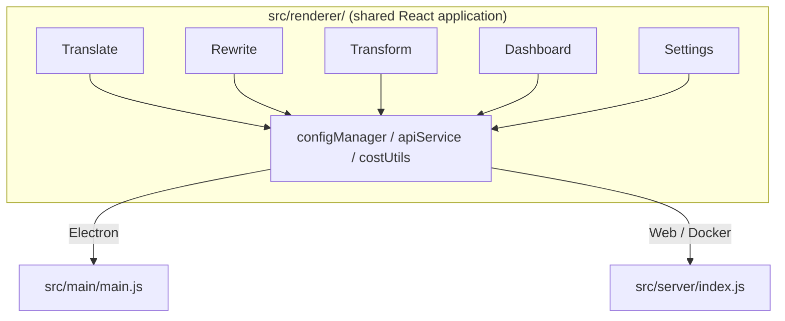

<p align="center">
  
</p>

<h1 align="center">ਟ੍ਰਾਂਸਰਿਊਰਟ</h1>

<p align="center">
  <a href="https://github.com/wsj-br/transrewrt/releases"></a>
  <a href="LICENSE"></a>
  
  
  
</p>

ਐਈ-ਪਾਵਰ ਟੈਕਸਟ ਟੂਲ: ਵੱਖ-ਵੱਖ ਭਾਸ਼ਾਵਾਂ ਦੇ ਵਿਚਕਾਰ ਅਨੁਵਾਦ ਕਰੋ, ਵੱਖ-ਵੱਖ ਸ਼ੈਲੀਆਂ ਵਿੱਚ ਦੁਬਾਰਾ ਲਿਖੋ, ਅਤੇ ਕਸਟਮ ਪ੍ਰਾਂਪਟਸ ਨਾਲ ਬਦਲੋ - ਸਭ [OpenRouter](https://openrouter.ai) ਰਾਹੀਂ। ਡੈਸਕਟਾਪ ਐਪ (ਈਲੈਕਟਰਨ) ਜਾਂ ਸੈਲਫ-ਹੋਸਟਡ ਵੈੱਬ ਐਪ (ਡਾਕਰ) ਵਜੋਂ ਚਲਦਾ ਹੈ।

- **ਅਨੁਵਾਦ** - ਦਸ਼ਾਂ ਦੇ ਭਾਸ਼ਾਵਾਂ ਦੇ ਵਿਚਕਾਰ, ਅਟੋਮੈਟਿਕ ਸਰੋਤ ਕਣਟੈਕਸਟ ਨਾਲ
- **ਦੁਬਾਰਾ ਲਿਖੋ** - ਵਿਆਕਰਨ ਠੀਕ ਕਰੋ, ਸਪਸ਼ਟਤਾ ਵਧਾਓ, ਫਾਰਮਲ/ਇਨਫਾਰਮਲ, ਛੋਟਾ ਕਰੋ, ਫੈਲਾ ਕਰੋ, ਵਿਗਿਆਨਿਕ
- **ਬਦਲੋ** - ਕਸਟਮ ਐਈ ਪ੍ਰਾਂਪਟਸ; ਪ੍ਰਾਂਪਟਸ ਬਣਾਓ ਅਤੇ ਪ੍ਰਬੰਧਿਤ ਕਰੋ, ਪ੍ਰਾਂਪਟ ਪ੍ਰਤੀ ਲੋੜੀਂਦੇ ਟਾਰਗੇਟ ਭਾਸ਼ਾ (ਵਿਕਲਪਿਕ)
- **ਮਾਡਲ ਅਤੇ ਖਰਚ** - ਕੋਈ ਵੀ OpenRouter ਮਾਡਲ ਚੁਣੋ; SQLite ਲਾਗ ਨਾਲ ਖਰਚਾ ਡੈਸ਼ਬੋਰਡ, ਮਾਡਲ/ਓਪਰੇਸ਼ਨ/ਦਿਨ ਦੇ ਸਾਰਾਂਸ਼
- **ਯੂਆਈ** - i18n (pt-BR, de, fr, es, RTL), ਥੀਮ, ਫੋਂਟ, ਕੀਬੋਰਡ ਸ਼ਾਰਟਕੱਟ; ਸੁਰੱਖਿਅਤ ਵੈੱਬ ਮੋਡ (API ਕੀ ਸਰਵਰ ਤੇ ਹੀ)
- **ਡੈਸਕਟਾਪ** - Windows ਅਤੇ Linux ਲਈ ਈਲੈਕਟਰਨ ਐਪ
- **ਸੈਲਫ-ਹੋਸਟਡ** - amd64 & arm64 (ਰਾਸਪਬੇਰੀ ਪੀ-ਰੈਡੀ) ਲਈ Docker ਇਮੇਜ

ਇੰਸਟਾਲ ਹੋਣ 'ਤੇ, ਸਭ ਫੀਚਰਾਂ ਦੀ ਪੂਰੀ ਵਾਲਕਥਰੂ ਦੇਖਣ ਲਈ **[ਉਪਭੋਗਤਾ ਗਾਈਡ](../USER-GUIDE.md)** ਵੇਖੋ।

<small>**ਦੁਆਨੇ ਹੋਰ ਭਾਸ਼ਾਵਾਂ ਵਿੱਚ ਪਢ਼ੋ:** [English (UK)](../README.md) · [Português (BR)](README.pt-BR.md) · [العربية](README.ar.md) · [বাংলা](README.bn.md) · [Català](README.ca.md) · [简体中文](README.zh-CN.md) · [繁體中文](README.zh-TW.md) · [Hrvatski](README.hr.md) · [Čeština](README.cs.md) · [Nederlands](README.nl.md) · [English (US)](README.en-US.md) · [Filipino](README.tl.md) · [Français](README.fr.md) · [Deutsch](README.de.md) · [Ελληνικά](README.el.md) · [हिन्दी](README.hi.md) · [Magyar](README.hu.md) · [Italiano](README.it.md) · [日本語](README.ja.md) · [Basa Jawa](README.jv.md) · [한국어](README.ko.md) · [Bahasa Melayu](README.ms.md) · [فارسی](README.fa.md) · [Polski](README.pl.md) · [Português (PT)](README.pt.md) · [ਪੰਜਾਬੀ](README.pa.md) · [Română](README.ro.md) · [Русский](README.ru.md) · [Slovenčina](README.sk.md) · [Español](README.es.md) · [Kiswahili](README.sw.md) · [Svenska](README.sv.md) · [తెలుగు](README.te.md) · [ภาษาไทย](README.th.md) · [Türkçe](README.tr.md) · [Українська](README.uk.md) · [Tiếng Việt](README.vi.md)</small>

<a id="screenshots"></a>
## ਸਕਰੀਨਸ਼ਾਟ

**ਭਾਸ਼ਾ ਚੋਣਵੀਂ**


**ਅਨੁਵਾਦ**


**ਬਦਲੋ - ਪ੍ਰਾਂਪਟ ਐਡੀਟਰ**


**ਡੈਸ਼ਬੋਰਡ**


**ਸੈਟਿੰਗਸ - ਮਾਡਲ ਚੋਣ**


<br /><br />

<a id="table-of-contents"></a>
## ਸਮੱਗਰੀ ਸੂਚੀ

<!-- START doctoc generated TOC please keep comment here to allow auto update -->
<!-- DON'T EDIT THIS SECTION, INSTEAD RE-RUN doctoc TO UPDATE -->

- [ਤੇਜ਼ ਸ਼ੁਰੂਆਤ](#quick-start)
- [ਇੰਸਟਾਲੇਸ਼ਨ](#installation)
  - [Windows (Electron)](#windows-electron)
  - [Linux (Electron)](#linux-electron)
  - [Docker](#docker)
- [ਇੱਕ OpenRouter API ਕੀ ਪ੍ਰਾਪਤ ਕਰਨਾ](#getting-an-openrouter-api-key)
- [ਕਾਂਫਿਗਰੇਸ਼ਨ ਅਤੇ ਐਨਵਾਇਰਨਮੈਂਟ](#configuration-and-environment)
- [ਡਿਵੈਲਪਮੈਂਟ ਅਤੇ ਆਰਕੀਟੈਕਚਰ](#development-and-architecture)
- [ਰੀਲੀਜ਼ ਅਤੇ ਟੈਗ](#releases-and-tags)
- [ਯੋਗਦਾਨ ਪਾਉਣਾ](#contributing)
- [ਡਿਸਕਲੇਮਰ](#disclaimer)
- [ਲਾਇਸੈਂਸ](#license)

<!-- END doctoc generated TOC please keep comment here to allow auto update -->

<br /><br />

<a id="quick-start"></a>

## ਤੇਜ਼ ਸ਼ੁਰੂਆਤ

**Docker (ਸਵੈਂ-ਹੋਸਟਿੰਗ ਲਈ ਸਿਫਾਰਸ਼ੀਦਾ)**

```bash
docker pull ghcr.io/wsj-br/transrewrt:latest

API_KEY=sk-or-your-key docker run -d \
  -p 5000:5000 \
  -v transrewrt-data:/app/data \
  -e API_KEY \
  --name transrewrt-web \
  ghcr.io/wsj-br/transrewrt:latest
```

`sk-or-your-key` ਨੂੰ ਆਪਣੇ [OpenRouter API ਕੀ](https://openrouter.ai/keys) ਨਾਲ ਬਦਲੋ। [http://localhost:5000](http://localhost:5000) ਖੋਲ੍ਹੋ ਅਤੇ ਸਰਵਿਸ ਨੂੰ ਉਜਾਗਰ ਕਰਨ ਤੋਂ ਪਹਿਲਾਂ ਡਿਫਾਲਟ ਐਡਮਿਨ ਪਾਸਵਰਡ ਬਦਲੋ।

<br />

> ℹ️ **ਨੋਟ**<br/>
> Docker ਵਿੱਚ OpenRouter API ਕੀ ਸਿਰਫ `API_KEY` ਐਨਵਾਇਰਨਮੈਂਟ ਵੇਰੀਐਬਲ ਰਾਹੀਂ ਸੈੱਟ ਹੁੰਦੀ ਹੈ (ਵੈੱਬ UI ਵਿੱਚ ਨਹੀਂ)। ਡੈਸਕਟਾਪ (Electron) 'ਚ ਤੁਸੀਂ ਇਸ ਨੂੰ **ਸੈਟਿੰਗਸ → API** ਵਿੱਚ ਪੇਸਟ ਕਰਦੇ ਹੋ।

<br />

**Windows**

`Transrewrt Setup x.y.z.exe` ਨੂੰ [Releases](https://github.com/wsj-br/transrewrt/releases) ਤੋਂ ਡਾਊਨਲੋਡ ਕਰੋ, ਇੰਸਟਾਲਰ ਨੂੰ ਚਲਾਓ, ਫਿਰ ਸਟਾਰਟ ਮੈਨੂ ਜਾਂ ਡੈਸਕਟਾਪ ਸ਼ਾਰਟਕੱਟ ਤੋਂ ਲਾਂਚ ਕਰੋ। ਆਪਣਾ OpenRouter API ਕੀ **ਸੈਟਿੰਗਸ → API** ਵਿੱਚ ਦਰਜ ਕਰੋ।

<br />

**Linux**

`.AppImage` ਨੂੰ [Releases](https://github.com/wsj-br/transrewrt/releases) ਤੋਂ ਡਾਊਨਲੋਡ ਕਰੋ, ਫਿਰ:

```bash
chmod +x Transrewrt-x.y.z.AppImage && ./Transrewrt-x.y.z.AppImage
```

ਆਪਣਾ OpenRouter API ਕੀ **ਸੈਟਿੰਗਸ → API** ਵਿੱਚ ਦਰਜ ਕਰੋ। Debian/Ubuntu 'ਚ ਤੁਹਾਨੂੰ ਪਹਿਲਾਂ ਅਧਿਕ ਡਿਪੈਂਡੈਂਸੀਆਂ ਇੰਸਟਾਲ ਕਰਨੀਆਂ ਪੈ ਸਕਦੀਆਂ ਹਨ:

```bash
sudo apt install libgtk-3-0 libnotify-dev libnss3 libxss1 libasound2 libxtst6 xauth
```

 ਵਿਸਤਾਰਾਂ ਲਈ [ਇਨਸਟਾਲੇਸ਼ਨ → Linux](#linux-electron) ਵੇਖੋ।

<br />

> ℹ️ **ਨੋਟ**<br/>
> macOS ਮੌਜੂਦਾ ਵਿੱਚ ਸਹਾਇਤਾ ਨਹੀਂ ਹੈ। Transrewrt Windows, Linux, ਅਤੇ Docker ਲਈ ਉਪਲਬਧ ਹੈ।

<br />

ਜਦੋਂ ਐਪ ਚੱਲ ਰਹੀ ਹੋਵੇ, ਤਾਂ **[ਯੂਜ਼ਰ ਗਾਈਡ](../USER-GUIDE.md)** ਵੇਖੋ ਕਿ ਕਿਵੇਂ ਸਮੱਗਰੀ ਅਨੁਵਾਦ, ਰੀ-ਲਿਖਣ, ਅਤੇ ਰੂਪਾਂਤਰਿਤ ਕਰਨ, ਪ੍ਰਾਂਪਟਸ ਨੂੰ ਪਰਬੰਧਿਤ ਕਰਨ, ਅਤੇ ਮਾਡਲ ਕਨਫਿਗਰ ਕਰਨ।

<br /><br />

<a id="installation"></a>
## ਇਨਸਟਾਲੇਸ਼ਨ

<a id="windows-electron"></a>
### Windows (Electron)

- ਸਭ ਤੋਂ ਤਾਜ਼ਾ ਇੰਸਟਾਲਰ ਨੂੰ [Releases](https://github.com/wsj-br/transrewrt/releases) ਤੋਂ ਡਾਊਨਲੋਡ ਕਰੋ।
- `.exe` ਨੂੰ ਚਲਾਓ ਅਤੇ ਇੰਸਟਾਲਰ ਦਾ ਪਾਲਣ ਕਰੋ।
- ਪਹਿਲੀ ਚਲਾਨਾ: ਐਪ ਨੂੰ ਸਟਾਰਟ ਮੈਨੂ ਜਾਂ ਡੈਸਕਟਾਪ ਸ਼ਾਰਟਕੱਟ ਤੋਂ ਸ਼ੁਰੂ ਕਰੋ। ਕਨਫਿਗ `%APPDATA%\transrewrt\` ਵਿੱਚ ਸਟੋਰ ਹੁੰਦੀ ਹੈ।

<br />

<a id="linux-electron"></a>
### Linux (Electron)

- `.AppImage` ਨੂੰ [Releases](https://github.com/wsj-br/transrewrt/releases) ਤੋਂ ਡਾਊਨਲੋਡ ਕਰੋ।
- ਚਲਾਓ: `chmod +x Transrewrt-x.y.z.AppImage && ./Transrewrt-x.y.z.AppImage`
- ਅਧਿਕ ਡਿਪੈਂਡੈਂਸੀਆਂ (Debian/Ubuntu): `sudo apt install libgtk-3-0 libnotify-dev libnss3 libxss1 libasound2 libxtst6 xauth`
- ਵਧੇਰੇ ਲਈ [dev/DEVELOPMENT.md](../dev/DEVELOPMENT.md) ਵੇਖੋ।

<br />

<a id="docker"></a>
### Docker

- ਪਲ: `docker pull ghcr.io/wsj-br/transrewrt:latest`
- OpenRouter API ਕੀ **ਮਾਂਜ਼** `API_KEY` ਐਨਵਾਇਰਨਮੈਂਟ ਵੇਰੀਐਬਲ ਰਾਹੀਂ ਸੈੱਟ ਕੀਤਾ ਜਾਣਾ ਚਾਹੀਦਾ ਹੈ। ਇਸ ਨੂੰ `-e API_KEY` ਨਾਲ ਪਾਸ ਕਰੋ (ਜਾਂ `docker compose` / `.env` ਰਾਹੀਂ) ਤਾਂ ਜੋ ਕੀ ਪ੍ਰੋਸੈਸ ਲਿਸਟ ਵਿੱਚ ਦਿਖਾਈ ਨਾ ਦੇ।
- API ਕੀ ਵੈੱਬ UI ਵਿੱਚ ਦਰਜ ਨਹੀਂ ਕੀਤਾ ਜਾ ਸਕਦਾ।

ਉਦਾਹਰਨ - ਪਰਸਿਸਟੈਂਸ ਲਈ ਨਾਮਕ ਵਾਲਿਊਮ (API ਕੀ env ਰਾਹੀਂ ਪਾਸ ਕੀਤਾ, ਕਮਾਂਡ ਲਾਈਨ ਵਿੱਚ ਨਹੀਂ):

```bash
API_KEY=sk-or-your-key docker run -d \
  -p 5000:5000 \
  -v transrewrt-data:/app/data \
  -e API_KEY \
  --name transrewrt-web \
  ghcr.io/wsj-br/transrewrt:latest
```

<br />

| ਵਿਕਲਪ   | ਵਰਣਨ                                                                                                   |
| -------- | ------------------------------------------------------------------------------------------------------- |
| ਪੋਰਟ     | `5000` (`-p 5000:5000` ਨਾਲ ਮੈਪ ਕਰੋ)                                                                              |
| ਵਾਲਿਊਮ   | ਕਨਫਿਗ ਅਤੇ ਡਾਟਾਬੇਸ ਪਰਸਿਸਟੈਂਸ ਲਈ `/app/data` ਮਾਊਂਟ ਕਰੋ                                                         |
| Env ਵੇਰੀਐਬਲ | `PORT`, `CONFIG_PATH`, `API_KEY`, `API_URL`, `KEY_SEED` - ਵੇਖੋ [ਕਨਫਿਗਰੇਸ਼ਨ](#configuration-and-environment) |

ਸੋਝੇ ਤੋਂ ਬਿਲਡ ਅਤੇ ਚਲਾਉਣ ਲਈ: `docker compose up --build -d` ਜਾਂ `pnpm run docker:up` - ਵੇਖੋ [dev/DEVELOPMENT.md](../dev/DEVELOPMENT.md)।

<br /><br />

<a id="getting-an-openrouter-api-key"></a>
## ਇੱਕ OpenRouter API ਕੀ ਪ੍ਰਾਪਤ ਕਰਨਾ

Transrewrt AI ਮਾਡਲਾਂ ਲਈ [OpenRouter](https://openrouter.ai) ਦੀ ਵਰਤੋਂ ਕਰਦਾ ਹੈ। ਤੁਹਾਨੂੰ ਸਮੱਗਰੀ ਅਨੁਵਾਦ, ਰੀ-ਲਿਖਣ, ਜਾਂ ਰੂਪਾਂਤਰਿਤ ਕਰਨ ਲਈ ਇੱਕ API ਕੀ ਜ਼ਰੂਰੀ ਹੈ।

1. [openrouter.ai](https://openrouter.ai) 'ਤੇ ਸਾਇਨ ਐਪ ਕਰੋ ਜਾਂ ਲਾਗ ਇਨ ਕਰੋ।
2. [Keys](https://openrouter.ai/keys) ਪੇਜ ਖੋਲ੍ਹੋ ਅਤੇ ਇੱਕ ਨਵਾਂ ਕੀ ਬਣਾਓ (ਇਸਦਾ ਨਾਮ ਰੱਖੋ, ਅਤੇ ਵਿਕਲਪਿਕ ਰੂਪ ਵਿੱਚ ਕ੍ਰੈਡਿਟ ਲਿਮਿਟ ਸੈੱਟ ਕਰੋ)। ਤੁਸੀਂ ਬਿਨਾਂ ਕ੍ਰੈਡਿਟ ਜੋੜੇ ਫ्री ਮਾਡਲਾਂ ਦੀ ਵਰਤੋਂ ਕਰ ਸਕਦੇ ਹੋ।
3. **ਡੈਸਕਟਾਪ (Electron):** ਕੀ ਨੂੰ **ਸੈਟਿੰਗਸ → API** ਵਿੱਚ ਪੇਸਟ ਕਰੋ। **Docker:** `API_KEY` ਐਨਵਾਇਰਨਮੈਂਟ ਵੇਰੀਐਬਲ ਸੈੱਟ ਕਰੋ (ਵੇਖੋ [ਤੇਜ਼ ਸ਼ੁਰੂਆਤ](#quick-start)।

ਲਿਮਿਟਾਂ, BYOK, ਅਤੇ ਵਧੇਰੇ ਲਈ, ਵੇਖੋ [OpenRouter ਪ੍ਰਮਾਣੀਕਰਨ](https://openrouter.ai/docs/api/reference/authentication)।

<br /><br />

<a id="configuration-and-environment"></a>

## ਕਨਫਿਗਰੇਸ਼ਨ ਅਤੇ ਵਾਤਾਵਰਨ

**ਕਨਫਿਗਰੇਸ਼ਨ ਫਾਈਲ ਦੇ ਸਥਾਨ**

| ਡੈਪਲੋਇਮੈਂਟ         | ਕਨਫਿਗਰੇਸ਼ਨ ਦਾ ਸਥਾਨ                                   |
| ------------------ | ------------------------------------------------- |
| ਈਲੈਕਟਰੌਨ (ਵਿੰਡੋਜ਼) | `%APPDATA%\transrewrt\`                           |
| ਈਲੈਕਟਰੌਨ (ਲਿਨਸ)   | `~/.config/transrewrt/`                           |
| ਵੈੱਬ / ਡਾਕਰ       | `/app/data/config.json` (ਦੀ ਰੱਖਣਾ ਲਈ ਵਾਲਿਊਮ ਇੰਸਟਾਲ ਕਰੋ) |

<br />

**ਵਾਤਾਵਰਨ ਵੈਰੀਏਬਲ** (ਵੈੱਬ/ਡਾਕਰ ਹੀ; ਈਲੈਕਟਰੌਨ ਸਥਾਨੀ ਕਨਫਿਗਰੇਸ਼ਨ ਫਾਈਲ ਦੀ ਵਰਤੋਂ ਕਰਦਾ ਹੈ)

| ਵੈਰੀਏਬਲ      | ਡਿਫਾਲਟ                        | ਵਰਣਨ                                                   |
| ------------- | ------------------------------ | ------------------------------------------------------------- |
| `PORT`        | `5000`                         | ਸਰਵਰ ਸੁਨਵੈਂ ਪੋਰਟ                                         |
| `CONFIG_PATH` | `/app/data/config.json`        | ਕਨਫਿਗਰੇਸ਼ਨ ਫਾਈਲ ਦਾ ਪਾਥ                                       |
| `API_KEY`     | *(ਖਾਲੀ)*                      | OpenRouter API ਕੀ (ਡਾਕਰ ਲਈ ਲਾਜ਼ਮੀ; env ਰਾਹੀਂ ਸੈੱਟ ਕਰੋ, UI ਨਾਲ ਨਹੀਂ) |
| `API_URL`     | `https://openrouter.ai/api/v1` | ਅੱਪਸਟਰੀਮ AI API ਬੇਸ URL                                      |
| `KEY_SEED`    | *(ਖਾਲੀ)*                      | Transrewrt ਪ੍ਰੋਓਕਸੀ ਕੀ ਸੀਡ (ਸੈੱਟ ਹੋਣ 'ਤੇ ਕਨਫਿਗ ਵਰਤਣ 'ਚ ਓਵਰਰਾਈਡ ਕਰਦਾ ਹੈ)           |

<br />

**ਡਾਟਾ ਅਤੇ ਪਰਸਿਸਟੈਂਸ:** ਡਾਕਰ ਲਈ, `/app/data` 'ਤੇ ਇੱਕ ਵਾਲਿਊਮ ਮਾਊਂਟ ਕਰੋ ਤਾਂ ਕਿ `config.json` ਅਤੇ SQLite ਡੇਟਾਬੇਸ ਕੰਟੇਨਰ ਦੇ ਮੁੜ-ਸ਼ੁਰੂ ਹੋਣ 'ਤੇ ਬਣੀ ਰਹੇ। ਵਾਲਿਊਮ ਦੇ ਬਗੈਰ, ਸਾਰਾ ਡਾਟਾ ਗੁਆਬ ਹੋ ਜਾਂਦਾ ਹੈ ਜਦੋਂ ਕੰਟੇਨਰ ਬੰਦ ਕੀਤਾ ਜਾਂਦਾ ਹੈ।

<br />

**ਵੈੱਬ ਪ੍ਰਮਾਣੀਕਰਨ:**

- ਡਿਫਾਲਟ ਐਡਮਿਨ: `admin` / `transrewrt26`.
- ਸੈਟਿੰਗਾਂ → ਉਪਭੋਗਤਾ ਵਿੱਚ ਉਪਭੋਗਤਿਆਂ ਦੀ ਪਰਬੰਧ ਕਰੋ।
- ਪਾਸਵਰਡ ਨੂੰ ਰੀਸੈੱਟ ਕਰੋ: `docker exec <container> reset-web-password '<username>' '<new-password>'`
  (ਸਰੋਤ ਤੋਂ: `pnpm run reset-web-password -- <username> <new-password>`)

<br />

> ⚠️ **ਚੇਤਾਵਨੀ**<br/>
> ਨੈਟਵਰਕ-ਅਧਾਰਤ ਮੇਜ਼ਬਾਨ 'ਤੇ ਡਿਫਾਲਟ ਐਡਮਿਨ ਪਾਸਵਰਡ ਤੁਰੰਤ ਬਦਲੋ।

<br />

**Transrewrt ਪ੍ਰੋਆਕਸੀ (ਵਿਕਲਪਿਕ):** ਤੁਸੀਂ ਇੱਕ ਬਾਹਰੀ ਪ੍ਰੋਆਕਸੀ ਰਾਹੀਂ API ਟ੍ਰਾਫਿਕ ਰਾਊਟ ਕਰ ਸਕਦੇ ਹੋ ਜੋ ਸਮੇਂ-ਆਧਾਰਤ ਰੋਲਿੰਗ ਕੀ ਦੀ ਵਰਤੋੰ ਕਰਦੀ ਹੈ। **ਸੈਟਿੰਗਾਂ → API** ਵਿੱਚ, **Transrewrt Proxy ਵਰਤੋਂ** ਨੂੰ ਸ克ੋਪਾਨ ਕਰੋ, **Key seed** ਸੈੱਟ ਕਰੋ, ਅਤੇ **API URL** ਨੂੰ ਪ੍ਰੋਆਕਸੀ ਬੇਸ URL 'ਤੇ ਸੈੱਟ ਕਰੋ। ਵਿਸਥਾਰਾਂ ਲਈ [dev/SYSTEM-OVERVIEW.md](../dev/SYSTEM-OVERVIEW.md) ਨੂੰ ਦੇਖੋ।

ਸੀਮ ਟੀਮ (ਥੀਮ, ਫੋਂਟ, ਮਾਡਲ, ਭਾਸ਼ਾਵਾਂ, ਆਦਿ) ਸੈਟਿੰਗ ਡਾਈਲਾਗ 'ਚ ਉਪਲਬਧ ਹਨ ਜਾਂ ਸਿੱਧੇ ਕਨਫਿਗ JSON 'ਚ ਸੰਪਾਦਿਤ ਕੀਤੀਆਂ ਜਾ ਸਕਦੀਆਂ ਹਨ। ਪੂਰੀ ਲਿਸਟ ਅਤੇ ਡਿਫਾਲਟ [dev/DEVELOPMENT.md](../dev/DEVELOPMENT.md) ਵਿੱਚ ਦਸਤਾਵੇਜ਼ ਕੀਤੇ ਗਏ ਹਨ।

<br /><br />

<a id="development-and-architecture"></a>
## ਡਿਵੈਲਪਮੈਂਟ ਅਤੇ ਆਰਕੀਟੈਕਚਰ

- **ਡਿਵੈલਪਮੈਂਟ:** ਸੈਟਅੱਪ, ਬuilਡ, ਟੈਸਟ, ਅਤੇ ਡੈਪਲੋਇ (ਈਲੈਕਟਰੌਨ, ਵੈੱਬ, ਡਾਕਰ) - **[dev/DEVELOPMENT.md](../dev/DEVELOPMENT.md)** ਦੇਖੋ।
- **ਆਰਕੀਟੈਕਚਰ ਅਤੇ ਸਿਸਟਮ ਅਵਰਲੋਕ:** ਫੋਲਡਰ ਸਟਰਕਚਰ, ਟੈਕ ਸਟੈਕ, ਡਿਜ਼ਾਇਨ ਦੇ ਸਿਆਣੇ, Transrewrt ਪ੍ਰੋਆਕਸੀ - **[dev/SYSTEM-OVERVIEW.md](../dev/SYSTEM-OVERVIEW.md)** ਦੇਖੋ।



<br /><br />

<a id="releases-and-tags"></a>
## ਰੀਲੀਜ਼ ਅਤੇ ਟੈਗ

- **Git ਟੈਗ** `v`* (ਉਦਾਹਰਨ `v1.0.10`) [ਰੀਲਿਜ਼ ਵਰਕਫਲੋ](.github/workflows/release.yml) ਨੂੰ ਟ੍ਰਿਗਰ ਕਰਦੇ ਹਨ। **GitHub Releases** ਵਿੱਚ ਵਿੰਡੋਜ਼ ਇੰਸਟਾਲਰ (`.exe`) ਅਤੇ ਲਿਨਸ AppImage ਐਟੈਚ ਹੁੰਦੇ ਹਨ।
- **ਡਾਕਰ ਇਮੇਜ਼** `ghcr.io/wsj-br/transrewrt` 'ਤੇ ਪਬਲਿਸ਼ ਕੀਤੇ ਜਾਂਦੇ ਹਨ। ਇਮੇਜ ਟੈਗ Git ਵਰਜਨ ਨਾਲ ਮੇਲ ਖਾਂਦੇ ਹਨ (ਉਦਾਹਰਨ `v1.0.10` → `ghcr.io/wsj-br/transrewrt:1.0.10`) plus `latest`. ਮਲਟੀ-ਆਰਕ: `linux/amd64` ਅਤੇ `linux/arm64` (ਉਦਾਹਰਨ Raspberry Pi)।

<br /><br />

<a id="contributing"></a>
## ਯੋਗਦਾਨ

1. ਰਿਪੋਜ਼ਿਟਰੀ ਨੂੰ ਫੋਰੱਕ ਕਰੋ।
2. ਇੱਕ ਫੀਚਰ ਬ੍ਰਾਂਚ ਬਣਾਓ: `git checkout -b feature/my-feature`
3. ਸਾਫ਼ ਸੰਦੇਸ਼ ਨਾਲ ਆਪਣੀਆਂ ਤਬਦੀਲੀਆਂ ਕਮਿਟ ਕਰੋ।
4. ਪੁਸ਼ ਕਰੋ ਅਤੇ `main` ਵਿਰੁੱਧ ਇੱਕ Pull Request ਖੋਲ੍ਹੋ।

ਕੋਡ ਸ਼ੈਲੀ ਦੀ ਪਾਲਣਾ ਕਰੋ ਅਤੇ ਯੋਗਦਾਨ ਦੇ ਨਾਲੋ ਨਾਲ ਈਲੈਕਟਰੌਨ ਅਤੇ ਵੈੱਬ ਮੋਡ ਵਿੱਚ ਆਪਣੀਆਂ ਤਬਦੀਲੀਆਂ ਟੈਸਟ ਕਰੋ। ਬuilt ਅਤੇ ਟੈਸਟ ਨਿਰਦੇਸ਼ਾਂ ਲਈ [dev/DEVELOPMENT.md](../dev/DEVELOPMENT.md) ਦੇਖੋ।

<br />

**ਮੁੱਦਿਆਂ ਦੀ ਰਿਪੋਰਟਿੰਗ:** [GitHub](https://github.com/wsj-br/transrewrt/issues) 'ਤੇ ਇੱਕ ਮੁੱਦਾ ਖੋਲ੍ਹੋ। ਆਪਣੀ ਪਲੇਟਫਾਮ (ਵਿੰਡੋਜ਼ / ਲਿਨਸ / ਡਾਕਰ) ਅਤੇ ਐਪ ਵਰਜਨ (About ਡਾਈਲਾਗ ਜਾਂ Releases ਪੰਨਾ 'ਚ ਦਿਖਾਈ ਦਿੱਤੀ ਜਾਂਦੀ ਹੈ) ਸ਼ਾਮਲ ਕਰੋ।

<br /><br />

<a id="disclaimer"></a>

## ਅਪਗਣਨ

ਉਤਪਾਦ ਨਾਮ ਅਤੇ ਆਈਕਾਨ ਦੇ ਉਨ੍ਹਾਂ ਦੇ ਮਾਲਕਾਂ ਦੇ ਹਨ ਅਤੇ ਸਿਰਫ ਪਛਾਣ ਦੇ ਉਦੇਸ਼ਾਂ ਲਈ ਵਰਤੇ ਜਾਂਦੇ ਹਨ। ਇਹ ਸਾਫਟਵੇਅਰ ਦਿੱਤੇ ਗਏ ਕਿਸੇ ਵੀ ਬ੍ਰਾਂਡ ਨਾਲ ਜੁੜਿਆ ਹੋਇਆ ਨਹੀਂ ਹੈ ਜਾਂ ਨਹੀਂ ਮੰਗੋਆਂਦਾ ਹੈ।

<br /><br />

<a id="license"></a>
## ਲਾਇਸੈਂਸ

ਕਾਪੀਰਾਈਟ © 2026 ਵਾਲਦੇਮਾਰ ਸਕੂਡੈਲਰ ਜੂਨੀਅਰ।

[ਅਪਾਚੇ ਲਾਇਸੈਂਸ 2.0](LICENSE)