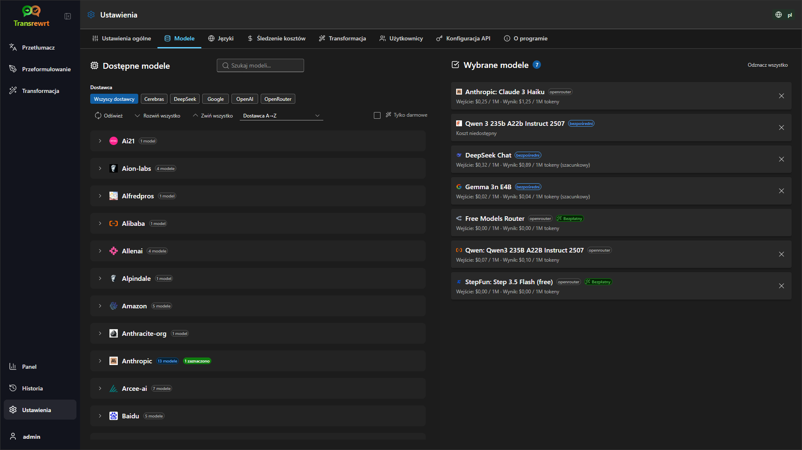

<p align="center">
  
</p>

<p align="center">
  <a href="https://github.com/wsj-br/transrewrt/releases"></a>
  <a href="LICENSE"></a>
  
  
  
</p>

Narzędzie tekstowe wspierane przez sztuczną inteligencję: tłumaczenie między językami, przeformułowanie w różnych stylach oraz transformacja za pomocą niestandardowych promptów — z wykorzystaniem wielu dostawców AI (OpenRouter, OpenAI, Anthropic, Google Gemini, DeepSeek, Groq, Mistral, xAI oraz lokalny Ollama). Działa jako aplikacja desktopowa (Electron) lub samodzielnie hostowana aplikacja internetowa (Docker).

- **Przetłumacz** — między dziesiątkami języków, z automatycznym wykrywaniem języka źródłowego  
- **Przeformułowanie** — poprawa gramatyki, poprawa jasności, styl formalny/nieformalny, skrócenie, rozwinięcie, język techniczny  
- **Transformacja** — niestandardowe prompty AI; tworzenie i zarządzanie promptami, opcjonalny język docelowy dla każdego promptu  
- **Historia** — pełna historia operacji z tekstem wejściowym/wyjściowym, filtrowanie i eksport  
- **Modele i koszt** — wybór modeli z dowolnego skonfigurowanego dostawcy; panele kosztów i zużycia z dziennikami, podsumowaniami wg modelu/operacji/dnia  
- **Interfejs użytkownika** — wielojęzyczny interfejs (ponad 30 języków, obsługa RTL), czcionki, ...  
- **Tryb internetowy** — obsługa wielu użytkowników z rolami administratora  
- **Wersja desktopowa** — aplikacja Electron dla systemów Windows i Linux  
- **Samodzielnie hostowana** — obraz Docker dla architektur amd64 i arm64 (gotowy do działania na Raspberry Pi)

Po zainstalowaniu zapoznaj się z **[Przewodnikiem użytkownika](USER-GUIDE.pl.md)**, aby poznać wszystkie funkcje.

<small>**Przeczytaj w innych językach:** </small>
<small id="lang-list">[English (UK)](../README.md) · [Português (BR)](README.pt-BR.md) · [العربية](README.ar.md) · [বাংলা](README.bn.md) · [Català](README.ca.md) · [简体中文](README.zh-CN.md) · [繁體中文](README.zh-TW.md) · [Hrvatski](README.hr.md) · [Čeština](README.cs.md) · [Nederlands](README.nl.md) · [English (US)](README.en-US.md) · [Filipino](README.tl.md) · [Français](README.fr.md) · [Deutsch](README.de.md) · [Ελληνικά](README.el.md) · [हिन्दी](README.hi.md) · [Magyar](README.hu.md) · [Italiano](README.it.md) · [日本語](README.ja.md) · [Basa Jawa](README.jv.md) · [한국어](README.ko.md) · [Bahasa Melayu](README.ms.md) · [فارسی](README.fa.md) · [Polski](README.pl.md) · [Português (PT)](README.pt.md) · [ਪੰਜਾਬੀ](README.pa.md) · [Română](README.ro.md) · [Русский](README.ru.md) · [Slovenčina](README.sk.md) · [Español](README.es.md) · [Kiswahili](README.sw.md) · [Svenska](README.sv.md) · [తెలుగు](README.te.md) · [ภาษาไทย](README.th.md) · [Türkçe](README.tr.md) · [Українська](README.uk.md) · [Tiếng Việt](README.vi.md)</small>

<small></small>

> **Uwaga dotycząca tłumaczeń interfejsu i dokumentacji:** Wszystkie języki interfejsu oprócz oryginalnego angielskiego (Wielka Brytania) zostały przetłumaczone przy użyciu modeli AI; sformułowania mogą być niedokładne lub zawierać błędy.

</small>

<br/>

<a id="screenshots"></a>
## Zrzuty ekranu

**Wybór języka**


**Przetłumacz**


**Transformacja – edytor promptów**


**Panel**


**Historia**


**Ustawienia – wybór modelu**



<br/><br/>

<a id="table-of-contents"></a>
## Spis treści

<!-- START doctoc generated TOC please keep comment here to allow auto update -->
<!-- DON'T EDIT THIS SECTION, INSTEAD RE-RUN doctoc TO UPDATE -->

- [Szybki start](#quick-start)
- [Instalacja](#installation)
  - [Windows (Electron)](#windows-electron)
  - [Linux (Electron)](#linux-electron)
  - [Docker](#docker)
  - [Konfiguracja strefy czasowej](#configuring-the-timezone)
- [Uzyskanie klucza API OpenRouter](#getting-an-openrouter-api-key)
- [Konfiguracja i środowisko](#configuration-and-environment)
- [Rozwój i architektura](#development-and-architecture)
- [Zgłaszanie problemów](#reporting-issues)
- [Zrzeczenie się odpowiedzialności](#disclaimer)
- [Licencja](#license)

<!-- END doctoc generated TOC please keep comment here to allow auto update -->

<br/><br/>

<a id="quick-start"></a>
## Szybki start

**Docker (zalecane dla samodzielnego hostingu)**

```bash
docker pull ghcr.io/wsj-br/transrewrt:latest

OPENROUTER_API_KEY=sk-or-your-key docker run -d \
  -p 5000:5000 \
  -v transrewrt-data:/app/data \
  -e OPENROUTER_API_KEY \
  --name transrewrt-web \
  ghcr.io/wsj-br/transrewrt:latest
```

Zamień `sk-or-your-key` na swój [klucz API OpenRouter](https://openrouter.ai/keys) (lub ustaw klucze innych dostawców; zobacz [Konfiguracja](#configuration-and-environment)). Otwórz [http://localhost:5000](http://localhost:5000) i zmień domyślne hasło administratora przed udostępnieniem usługi.

<br/>

> ℹ️ **UWAGA**<br/>
> W Dockerze poświadczenia LLM są ustawiane za pomocą zmiennych środowiskowych, takich jak `OPENROUTER_API_KEY`, `OPENAI_API_KEY`, `CEREBRAS_API_KEY`, … (nie w interfejsie WWW). Na komputerze (Electron) klucze konfiguruje się w **Ustawienia → API**.

<br/>

**Windows**

Pobierz najnowszy plik `Transrewrt Setup x.y.z.exe` z sekcji [Releases](https://github.com/wsj-br/transrewrt/releases), uruchom instalator, a następnie uruchom aplikację z menu Start lub skrótu na pulpicie. Wprowadź swoje klucze API w **Ustawienia → API**. Musisz skonfigurować co najmniej jednego dostawcę, OpenRouter jest popularny dla modeli bezpłatnych.

<br/>

**Linux**

Pobierz plik `.AppImage` odpowiedni dla Twojego procesora z sekcji [Releases](https://github.com/wsj-br/transrewrt/releases) (`x64` dla typowych komputerów, `arm64` dla wielu urządzeń ARM, w tym Raspberry Pi 4+), a następnie:

```bash
chmod +x Transrewrt-x.y.z-x64.AppImage && ./Transrewrt-x.y.z-x64.AppImage
```

Wprowadź swoje klucze API w **Ustawienia → API**. Musisz skonfigurować co najmniej jednego dostawcę, OpenRouter jest popularny dla modeli bezpłatnych.

**Komunikaty konsoli:** Pakietowe wersje dla Linuksa (`x64` i `arm64` AppImages) tłumią ostrzeżenia deprecjacyjne Node w terminalu (na przykład wbudowany moduł `punycode`). Jeśli Chromium wyświetla błędy GPU / EGL, takie jak „GLES3 jest nieobsługiwane”, ale aplikacja działa, możesz je wyłączyć, wyłączając akcelerację sprzętową:

```bash
TRANSREWRT_DISABLE_GPU=1 ./Transrewrt-x.y.z-arm64.AppImage
```

Dotyczy to również amd64; zmień nazwę pliku, aby pasowała do pobranego. Zobacz [Instalacja → Linux (Electron)](#linux-electron) dla nieco więcej szczegółów.

W systemach Debian/Ubuntu mogą być potrzebne dodatkowe biblioteki **uruchomieniowe**, których oczekuje Chromium (często już obecne na pełnych pulpitach). Użyj **`libnotify4`** do powiadomień na pulpicie — **nie** `libnotify-dev` (to służy do budowania oprogramowania, nie do uruchamiania spakowanego AppImage):

```bash
sudo apt install libgtk-3-0 libnotify4 libnss3 libxss1 libasound2 libxtst6 xauth
```

Minimalne lub niestandardowe obrazy mogą nadal kończyć się błędem brakującego `.so`; zainstaluj pakiet o nazwie podanej w komunikacie błędu (częste dodatki: `libatk1.0-0`, `libatk-bridge2.0-0`, `libgbm1`, `libdrm2`). Niektóre środowiska wymagają FUSE do uruchamiania AppImages (np. `libfuse2` w Ubuntu 22.04+), lub użyj `APPIMAGE_EXTRACT_AND_RUN=1 ./Transrewrt-….AppImage`.

<br/>

> ℹ️ **UWAGA**<br/>
> macOS nie jest obecnie obsługiwany. Transrewrt jest dostępny dla Windows, Linux i Docker.

<br/>

Po uruchomieniu aplikacji zapoznaj się z **[Przewodnikiem użytkownika](USER-GUIDE.pl.md)**, aby dowiedzieć się, jak tłumaczyć, przeformułowywać i przekształcać tekst, zarządzać promptami oraz konfigurować modele.

<br/><br/>

<a id="installation"></a>
## Instalacja

<a id="windows-electron"></a>
### Windows (Electron)

- Pobierz najnowszy instalator z sekcji [Releases](https://github.com/wsj-br/transrewrt/releases).
- Uruchom plik `.exe` i postępuj zgodnie z instrukcjami instalatora.
- Przy pierwszym uruchomieniu: uruchom aplikację z menu Start lub skrótu na pulpicie.

<br/>

> ℹ️ **UWAGA**<br/>
> Windows może wyświetlić jedno z tych ostrzeżeń bezpieczeństwa (normalne dla aplikacji niepodpisanych/niezależnych):
>   - **Kontrola konta użytkownika (UAC)**: „Czy chcesz zezwolić tej aplikacji od nieznanego wydawcy na wprowadzanie zmian na urządzeniu?” → Kliknij **Tak**.
>   - **Microsoft Defender SmartScreen**: „Windows chroni Twój komputer” → Kliknij **Więcej informacji** → **Wszystko jedno uruchom**.
>
> Dzieje się tak, ponieważ aplikacja nie jest podpisana przez Microsoft ani dużego wydawcę — jest bezpieczna, jeśli została pobrana z oficjalnych wydań na GitHubie
>  (zweryfikuj sumę kontrolną SHA256 poniżej).

<br/>

<a id="linux-electron"></a>
### Linux (Electron)

- Pobierz odpowiedni plik `.AppImage` (`x64` lub `arm64`) z sekcji [Releases](https://github.com/wsj-br/transrewrt/releases).
- Uruchom: `chmod +x Transrewrt-x.y.z-x64.AppImage && ./Transrewrt-x.y.z-x64.AppImage` na x86_64/amd64 lub użyj nazwy pliku `...-arm64.AppImage` na ARM64.
- **Biblioteki uruchomieniowe Debian/Ubuntu** (Electron/Chromium; takie same jak w [Szybki start → Linux](#quick-start)): `sudo apt install libgtk-3-0 libnotify4 libnss3 libxss1 libasound2 libxtst6 xauth` — użyj **`libnotify4`**, a nie `libnotify-dev`. W systemach minimalnych zainstaluj brakujące biblioteki `.so` raportowane w terminalu; często wymagane są dodatki takie jak `libatk1.0-0`, `libatk-bridge2.0-0`, `libgbm1`, `libdrm2`. AppImage może wymagać `libfuse2` (Ubuntu 22.04+) lub `APPIMAGE_EXTRACT_AND_RUN=1 ./….AppImage`.
- **Komunikaty GPU:** Chromium może zapisywać błędy inicjalizacji GPU lub EGL w niektórych systemach (szczególnie ARM); aplikacja może działać normalnie. Aby uniknąć tych komunikatów, uruchom z wyłączoną akceleracją sprzętową: `TRANSREWRT_DISABLE_GPU=1 ./Transrewrt-x.y.z-x64.AppImage` (lub odpowiednią nazwę pliku `arm64`).

<br/>

<a id="docker"></a>
### Docker

- Pobierz obraz: `docker pull ghcr.io/wsj-br/transrewrt:latest`
- Ustaw co najmniej jeden klucz dostawcy przez środowisko (np. `OPENROUTER_API_KEY` dla OpenRouter). Przekaż zmienne za pomocą `-e` lub `docker compose` / `.env`, aby tajne dane nie były wbudowane w obraz.
- Klucze dostawcy **nie** są wprowadzane w interfejsie webowym; serwer odczytuje je ze środowiska.

Przykład – nazwana wolumina dla trwałości (klucz OpenRouter przez env):

```bash
OPENROUTER_API_KEY=sk-or-your-key docker run -d \
  -p 5000:5000 \
  -v transrewrt-data:/app/data \
  -e OPENROUTER_API_KEY \
  --name transrewrt-web \
  ghcr.io/wsj-br/transrewrt:latest
```

lub jeśli wolisz użyć Docker Compose, użyj:

```
# download the compose file
wget https://github.com/wsj-br/transrewrt/raw/refs/heads/master/production.yml -O transrewrt.yml
# edit the file to add the API_KEYS and adjust the timezone (TZ)
vi transrewrt.yml
# start the container
docker compose -f transrewrt.yml up -d
```

Zobacz [Configuration](#configuration-and-environment) po wszystkie zmienne środowiskowe, takie jak `PORT`, `CONFIG_PATH`, `TZ` oraz klucze LLM (`OPENROUTER_API_KEY`, `OPENAI_API_KEY`, …).

<a id="configuring-the-timezone"></a>
### Konfigurowanie strefy czasowej

Interfejs użytkownika aplikacji używa ustawień lokalizacyjnych i strefy czasowej **przeglądarki**. W przypadku zachowania po stronie **serwera** (rejestrowanie itp.), kontener korzysta ze zmiennej środowiskowej `TZ`. Domyślnie ustawiona jest wartość `TZ=Europe/London`.

Aby użyć innej strefy czasowej, ustaw `TZ` w pliku Compose, na przykład:

```yaml
environment:
  - TZ=America/Sao_Paulo
```

Lub przekaż ją podczas uruchamiania kontenera (Docker):

```bash
--env TZ=America/Sao_Paulo
```

W wielu systemach Linux nazwę strefy czasowej systemu możesz skopiować za pomocą:

```bash
echo TZ=\"$(</etc/timezone)\"
```

Lista poprawnych nazw stref czasowych jest prowadzona w [bazie danych tz](https://en.wikipedia.org/wiki/List_of_tz_database_time_zones) (Wikipedia).

<br/><br/>

<a id="getting-an-openrouter-api-key"></a>
## Uzyskanie klucza API OpenRouter

Transrewrt obsługuje wiele dostawców AI. [OpenRouter](https://openrouter.ai) jest popularnym wyborem, ponieważ agreguje wiele modeli pod jednym kluczem i oferuje modele bezpłatne.

1. Zarejestruj się lub zaloguj na stronie [openrouter.ai](https://openrouter.ai).
2. Otwórz stronę [Keys](https://openrouter.ai/keys) i utwórz nowy klucz (nadaj mu nazwę i opcjonalnie ustaw limit środków). Możesz korzystać z modeli bezpłatnych bez dodawania środków.
3. **Desktop (Electron):** wklej klucze w **Ustawienia → API**. **Docker:** ustaw zmienne środowiskowe, takie jak `OPENROUTER_API_KEY` (zobacz [Szybki start](#quick-start)).

Nie należy używać modelu **Body Builder** OpenRouter ([`openrouter/bodybuilder`](https://openrouter.ai/openrouter/bodybuilder)) do tłumaczenia, przeformułowania ani transformacji: zwraca on ładunki żądań JSON, a nie ukończony tekst dla tych zadań. Zobacz [Ustawienia → Modele](USER-GUIDE.pl.md#models) w Podręczniku użytkownika.

Możesz również używać innych dostawców (OpenAI, Anthropic, Google Gemini, DeepSeek, Groq, Mistral, xAI, Cerebras) lub uruchamiać modele lokalnie za pomocą [Ollama](https://ollama.com). Zobacz [Configuration](#configuration-and-environment) po pełną listę obsługiwanych dostawców i zmiennych środowiskowych.

> ⚠️ **OSTRZEŻENIE**<br/>
> Jeśli używasz Ollama z innego urządzenia, kontenera lub usługi, pamiętaj, aby skonfigurować Ollama tak, aby zezwalało na połączenia zewnętrzne (nie tylko localhost).

Aby uzyskać informacje dotyczące limitów, własnych kluczy (BYOK) i innych, zobacz [uwierzytelnianie OpenRouter](https://openrouter.ai/docs/api/reference/authentication).

<br/><br/>

<a id="configuration-and-environment"></a>
## Konfiguracja i środowisko

**Lokalizacje plików konfiguracyjnych**

| Wdrożenie         | Lokalizacja konfiguracji                                   |
| ------------------ | ------------------------------------------------- |
| Electron (Windows) | `%APPDATA%\transrewrt\`                           |
| Electron (Linux)   | `~/.config/transrewrt/`                           |
| Web / Docker       | `/app/data/config.json` (użyj wolumenu, aby dane były trwałe) |

<br/>

**Zmienne środowiskowe** (tylko web/Docker; Electron używa lokalnego pliku konfiguracyjnego)

| Zmienna              | Opis                                                                           |
|----------------------|--------------------------------------------------------------------------------|
| `PORT`               | Port nasłuchiwania serwera (domyślnie `5000`)                                  |
| `CONFIG_PATH`        | Ścieżka do pliku konfiguracyjnego (domyślnie `/app/data/config.json`)          |
| `TZ`                 | strefa czasowa dla czasu po stronie serwera (logowanie itp.) (domyślnie `Europe/London`) |
| `OPENROUTER_API_KEY` | Klucz API OpenRouter                                                           |
| `OPENAI_API_KEY`     | Klucz API OpenAI                                                               |
| `CEREBRAS_API_KEY`   | Klucz API Cerebras                                                             |
| `ANTHROPIC_API_KEY`  | Klucz API Anthropic                                                            |
| `GOOGLE_API_KEY`     | Klucz API Google Gemini                                                        |
| `DEEPSEEK_API_KEY`   | Klucz API DeepSeek                                                             |
| `GROQ_API_KEY`       | Klucz API Groq                                                                 |
| `MISTRAL_API_KEY`    | Klucz API Mistral                                                              |
| `OLLAMA_URL`         | Podstawowy adres URL Ollama (np. `http://host.docker.internal:11434`)          |
| `XAI_API_KEY`        | Klucz API xAI                                                                  |

Skonfiguruj tylko dostawców, których używasz. Identyfikatory modeli są nazwane przestrzennie (`openrouter/…`, `openai/…`, `cerebras/…`, `ollama/…`, itp.).

**Wyświetlanie kosztów:** OpenRouter zwraca rzeczywisty rozliczony koszt, gdy to możliwe. Pozostali dostawcy używają **szacunkowego** kosztu z publicznej cennikowej OpenRouter, jeśli dostępny jest klucz OpenRouter; w przeciwnym razie koszt niebędący OpenRouter może być wyświetlany jako `0`. Szacunki nie są fakturami.

<br/>

**Dane i trwałość:** W przypadku Dockera zamontuj wolumen w `/app/data`, aby plik `config.json` i baza danych SQLite były trwałe po ponownym uruchomieniu kontenera. Bez wolumenu wszystkie dane zostaną utracone po zatrzymaniu kontenera.

**Deweloperzy:** Po ściągnięciu zmian zastępujących starą konfigurację z pojedynczym kluczem, zresetuj lub scal `data/config.json` z nową domyślną strukturą z pliku `src/config-defaults/config_default.json`, jeśli Twój lokalny plik nadal używa usuniętych pól (`api_key`, `api_url`, opcje proxy).

<br/>

**Uwierzytelnianie w sieci web:**

- Domyślny administrator: `admin` / `transrewrt26`.
- Zarządzaj użytkownikami w **Ustawienia → Użytkownicy**.
- Zresetuj hasło: `docker exec <container> reset-web-password '<username>' '<new-password>'`
  (z kodu źródłowego: `pnpm run reset-web-password -- <username> <new-password>`)

<br/>

> ⚠️ **OSTRZEŻENIE**<br/>
> Natychmiast zmień domyślne hasło administratora na dowolnym hoście dostępnym w sieci.

<br/>

Główne ustawienia (czcionka, modele, języki itp.) są dostępne w Ustawieniach aplikacji.

<br/><br/>

<a id="development-and-architecture"></a>
## Rozwój i architektura

- **Rozwój:** Konfiguracja, kompilacja, testowanie i wdrażanie (Electron, Web, Docker) - zobacz **[dev/DEVELOPMENT.md](../dev/DEVELOPMENT.md)**.
- **Architektura i przegląd systemu:** Struktura folderów, stos technologiczny, decyzje projektowe - zobacz **[dev/SYSTEM-OVERVIEW.md](../dev/SYSTEM-OVERVIEW.md)**.

<br/><br/>

<a id="reporting-issues"></a>
## Zgłaszanie problemów

Zgłoś problem na [GitHubie](https://github.com/wsj-br/transrewrt/issues). Dołącz informacje o swojej platformie (Windows / Linux / Docker) oraz wersji aplikacji (widocznej w oknie „O programie” lub na stronie wydań).

<br/><br/>

<a id="disclaimer"></a>
## Zrzeczenie odpowiedzialności

Nazwy produktów i ikony należą do ich właścicieli i są używane wyłącznie w celach identyfikacyjnych. To oprogramowanie nie jest powiązane z wymienionymi markami ani przez nie wspierane.

<br/><br/>

<a id="license"></a>
## Licencja

Prawa autorskie © 2026 Waldemar Scudeller Jr.

[Apache License 2.0](../LICENSE)
